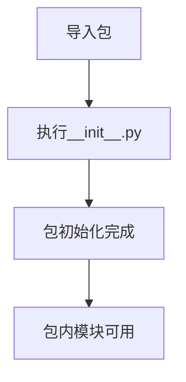

# `.\MetaGPT\tests\metagpt\management\__init__.py` 详细设计文档

这是一个空的Python包初始化文件，当前不包含任何功能代码，仅作为包的标识和占位符。

## 整体流程



## 类结构

```
无类结构
```

## 全局变量及字段


    

## 全局函数及方法


## 关键组件


### 代码文件

这是一个空的Python包初始化文件，用于标记目录为Python包，当前不包含任何功能代码。


## 问题及建议


### 已知问题

-   **空文件问题**：当前 `__init__.py` 文件为空，仅包含元信息注释。这可能导致该包在导入时无法正确初始化其子模块或暴露必要的公共接口，影响代码的可维护性和使用便利性。

### 优化建议

-   **明确包导出**：建议在 `__init__.py` 文件中使用 `__all__` 列表来显式声明该包对外公开的模块、类或函数。这有助于明确包的公共API，防止内部实现细节被意外导入，并提升代码的可读性和可维护性。
-   **添加包级文档**：在文件顶部添加包级别的文档字符串（docstring），简要说明该包的主要功能、包含的核心模块以及基本用法。这能为开发者提供清晰的指引。
-   **考虑包初始化逻辑**：如果该包在初始化时需要执行一些设置（如配置加载、资源注册等），可以在此文件中添加相应的初始化代码。但需注意保持初始化逻辑的轻量和幂等性。


## 其它


### 设计目标与约束

该代码文件是一个包的初始化文件（`__init__.py`），其主要设计目标是定义当前目录为一个Python包，并可能控制包的导入行为。其核心约束是遵循Python的包和模块机制，确保该文件的存在以允许目录被正确识别为包，并可能在其中执行包级别的初始化代码或定义包的公共接口（如`__all__`列表）。

### 错误处理与异常设计

当前代码文件为空，不包含任何显式的错误处理或异常抛出逻辑。作为包的入口点，其潜在的异常主要来源于Python解释器在导入包时遇到的系统级错误（如语法错误、导入路径问题等），这些将由Python运行时自动处理并抛出相应的异常（如`ImportError`, `SyntaxError`）。

### 数据流与状态机

由于当前文件不包含任何可执行代码逻辑，因此不存在内部的数据流处理或状态管理。其唯一的作用是在包被导入时由Python解释器执行，可能影响后续模块导入的命名空间，但本身不处理数据或维护状态。

### 外部依赖与接口契约

此`__init__.py`文件本身没有声明任何外部依赖（如`import`语句）。它作为包的接口，隐式地定义了包的边界。如果未来需要，可以在此文件中定义`__all__`变量来明确声明包的公共接口（即通过`from package import *`时应导入哪些模块），从而与外部使用者建立明确的导入契约。目前，该契约是隐式的，即导入包本身不会自动导入任何子模块。

    