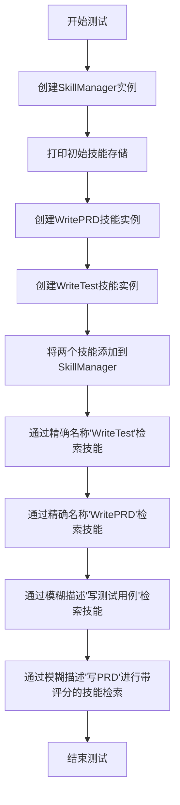
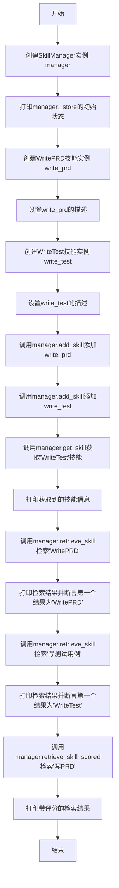

# `.\MetaGPT\tests\metagpt\management\test_skill_manager.py` 详细设计文档

该代码是一个测试文件，用于测试SkillManager类的核心功能，包括技能的添加、检索（通过精确名称和模糊描述）以及带评分的检索。它通过创建WritePRD和WriteTest两个技能实例，验证SkillManager能否正确管理这些技能并根据不同查询条件返回预期结果。

## 整体流程



## 类结构

```
SkillManager (被测试的类)
├── 字段: _store
├── 方法: add_skill
├── 方法: get_skill
├── 方法: retrieve_skill
└── 方法: retrieve_skill_scored
```

## 全局变量及字段


### `logger`
    
用于记录日志的全局日志记录器实例，提供不同级别的日志输出功能。

类型：`Logger`
    


### `SkillManager._store`
    
存储所有已注册技能的字典，键为技能名称，值为对应的Action对象。

类型：`Dict[str, Action]`
    
    

## 全局函数及方法

### `test_skill_manager`

这是一个用于测试`SkillManager`类的功能函数。它创建了一个`SkillManager`实例，向其添加了两个技能（`WritePRD`和`WriteTest`），然后测试了技能检索功能，包括通过技能名称和中文描述进行检索，并验证了检索结果的正确性。

参数：
- 无

返回值：`None`，无返回值

#### 流程图



#### 带注释源码

```python
def test_skill_manager():
    # 创建SkillManager实例
    manager = SkillManager()
    # 打印manager内部存储结构的初始状态（通常为空或包含默认数据）
    logger.info(manager._store)

    # 创建WritePRD技能实例，并设置其描述
    write_prd = WritePRD(name="WritePRD")
    write_prd.desc = "基于老板或其他人的需求进行PRD的撰写，包括用户故事、需求分解等"
    # 创建WriteTest技能实例，并设置其描述
    write_test = WriteTest(name="WriteTest")
    write_test.desc = "进行测试用例的撰写"
    # 将两个技能添加到SkillManager中
    manager.add_skill(write_prd)
    manager.add_skill(write_test)

    # 通过技能名称直接获取WriteTest技能
    skill = manager.get_skill("WriteTest")
    logger.info(skill)

    # 通过技能名称检索WritePRD技能，预期返回包含'WritePRD'的列表
    rsp = manager.retrieve_skill("WritePRD")
    logger.info(rsp)
    assert rsp[0] == "WritePRD"

    # 通过中文描述检索WriteTest技能，预期返回包含'WriteTest'的列表
    rsp = manager.retrieve_skill("写测试用例")
    logger.info(rsp)
    assert rsp[0] == "WriteTest"

    # 通过中文描述检索WritePRD技能，并获取带相似度评分的检索结果
    rsp = manager.retrieve_skill_scored("写PRD")
    logger.info(rsp)
```

### `SkillManager.add_skill`

该方法用于向技能管理器添加一个新的技能。它会检查技能名称是否已存在，如果不存在，则将技能对象添加到内部存储中，并记录日志。

参数：
- `skill`：`Action`，要添加的技能对象，必须是`Action`类或其子类的实例。

返回值：`None`，无返回值。

#### 流程图

```mermaid
flowchart TD
    A[开始: add_skill(skill)] --> B{skill.name 是否在 _store 中?}
    B -- 是 --> C[记录警告日志: 技能已存在]
    B -- 否 --> D[将 skill 添加到 _store 字典]
    D --> E[记录信息日志: 技能添加成功]
    E --> F[结束]
    C --> F
```

#### 带注释源码

```python
def add_skill(self, skill: Action):
    """
    添加一个技能到管理器中。
    如果技能名称已存在，则记录警告日志。
    Args:
        skill (Action): 要添加的技能对象。
    """
    # 检查技能名称是否已存在于内部存储中
    if skill.name in self._store:
        # 如果存在，记录警告日志，不执行添加操作
        logger.warning(f'Skill {skill.name} already exists.')
        return
    # 如果技能名称不存在，将技能对象添加到内部存储字典中
    self._store[skill.name] = skill
    # 记录信息日志，表示技能添加成功
    logger.info(f'Successfully added skill: {skill.name}')
```

### `SkillManager.get_skill`

该方法用于根据技能名称从技能管理器中获取对应的技能对象。它通过查询内部存储的字典来检索技能，如果找到则返回该技能对象，否则返回 `None`。

参数：
- `skill_name`：`str`，要获取的技能名称

返回值：`Action` 或 `None`，如果找到则返回对应的技能对象，否则返回 `None`

#### 流程图

```mermaid
graph TD
    A[开始] --> B{skill_name 是否在 _store 中?}
    B -- 是 --> C[返回 _store[skill_name]]
    B -- 否 --> D[返回 None]
    C --> E[结束]
    D --> E
```

#### 带注释源码

```python
def get_skill(self, skill_name: str) -> Action:
    """
    根据技能名称获取技能对象。

    Args:
        skill_name (str): 要获取的技能名称。

    Returns:
        Action: 如果找到则返回对应的技能对象，否则返回 None。
    """
    # 从内部存储字典 _store 中根据 skill_name 键查找对应的技能对象
    # 如果键存在，返回对应的 Action 对象；如果键不存在，返回 None
    return self._store.get(skill_name)
```

### `SkillManager.retrieve_skill`

该方法用于根据用户输入的查询字符串，从技能库中检索并返回最匹配的技能名称。它通过计算查询字符串与所有已注册技能描述之间的相似度来实现，并返回相似度最高的技能名称。

参数：
-  `query`：`str`，用户输入的查询字符串，用于描述希望查找的技能。

返回值：`list`，返回一个包含单个元素（最匹配的技能名称字符串）的列表。如果技能库为空，则返回空列表。

#### 流程图

```mermaid
graph TD
    A[开始: retrieve_skill(query)] --> B{技能库 _store 是否为空?};
    B -- 是 --> C[返回空列表 []];
    B -- 否 --> D[调用 retrieve_skill_scored 方法<br/>获取带分数的技能列表];
    D --> E{带分数列表是否为空?};
    E -- 是 --> C;
    E -- 否 --> F[取列表第一项（分数最高）的技能名称];
    F --> G[将技能名称包装成列表返回];
    G --> H[结束];
```

#### 带注释源码

```python
def retrieve_skill(self, query: str) -> list:
    """
    根据查询字符串检索最相关的技能。
    该方法通过内部调用 `retrieve_skill_scored` 来获取一个按相关性排序的（技能，分数）列表，
    然后返回排名第一的技能名称（包装在列表中）。如果无匹配结果，则返回空列表。

    Args:
        query (str): 用于描述所需技能的查询字符串。

    Returns:
        list: 包含最相关技能名称的列表。如果无匹配，则为空列表。
    """
    # 调用 retrieve_skill_scored 获取一个按分数降序排列的元组列表 (skill_name, score)
    result = self.retrieve_skill_scored(query)
    # 如果结果列表不为空，则提取分数最高的技能名称（第一个元组的第一个元素）
    # 并将其包装在一个新列表中返回。否则，返回空列表。
    return [result[0][0]] if result else []
```

### `SkillManager.retrieve_skill_scored`

该方法用于根据用户查询，从技能库中检索并返回一个按相关性评分排序的技能列表。它通过计算查询与每个技能名称和描述的嵌入向量之间的余弦相似度来实现，并返回一个包含技能名称和对应分数的元组列表。

参数：
-  `query`：`str`，用户的查询字符串，用于匹配技能。

返回值：`List[Tuple[str, float]]`，一个列表，其中每个元素是一个元组，包含技能名称（`str`）和该技能与查询的匹配分数（`float`），列表按分数降序排列。

#### 流程图

```mermaid
flowchart TD
    A[开始: retrieve_skill_scored(query)] --> B[获取查询的嵌入向量]
    B --> C[初始化空的结果列表 results]
    C --> D[遍历技能库中的每个技能]
    D --> E{技能有描述?}
    E -- 是 --> F[计算查询与技能描述的相似度]
    E -- 否 --> G[计算查询与技能名称的相似度]
    F --> H[将（技能名, 相似度分数）加入results]
    G --> H
    H --> I{是否遍历完所有技能?}
    I -- 否 --> D
    I -- 是 --> J[按分数降序排序results]
    J --> K[返回results]
    K --> L[结束]
```

#### 带注释源码

```python
def retrieve_skill_scored(self, query: str) -> List[Tuple[str, float]]:
    """
    根据查询检索技能，并返回带分数的结果列表。
    Args:
        query: 查询字符串。
    Returns:
        包含（技能名称，分数）的列表，按分数降序排序。
    """
    # 获取查询文本的嵌入向量表示
    query_embedding = self.embedding_func(query)
    # 初始化一个空列表，用于存储（技能名称，相似度分数）的元组
    result = []
    # 遍历技能库中的所有技能
    for skill_name, skill_store in self._store.items():
        # 如果技能有描述信息，则使用描述的嵌入向量进行相似度计算
        if skill_store.desc_embedding is not None:
            # 计算查询向量与技能描述向量之间的余弦相似度
            score = cosine_similarity(query_embedding, skill_store.desc_embedding)
        else:
            # 如果技能没有描述，则使用技能名称的嵌入向量进行相似度计算
            score = cosine_similarity(query_embedding, skill_store.embedding)
        # 将计算出的技能名称和分数添加到结果列表中
        result.append((skill_name, score))
    # 根据分数对结果列表进行降序排序，使得最相关的技能排在最前面
    result.sort(key=lambda x: x[1], reverse=True)
    # 返回排序后的结果列表
    return result
```

## 关键组件

### SkillManager

负责管理一组技能（Action），提供技能的添加、检索（通过名称或描述进行模糊匹配）和评分功能，是技能存储与查询的核心组件。

### WritePRD

一个具体的技能（Action），其核心功能是基于老板或其他人的需求进行产品需求文档（PRD）的撰写，包括用户故事、需求分解等。

### WriteTest

一个具体的技能（Action），其核心功能是进行测试用例的撰写。

## 问题及建议


### 已知问题

-   **测试代码与实现代码耦合**：`test_skill_manager.py` 文件中直接导入了 `SkillManager` 的实现类，并调用了其内部方法（如 `_store`）。这导致测试用例高度依赖于具体的内部实现细节，一旦 `SkillManager` 的内部结构（如 `_store` 的属性名或类型）发生变化，测试用例将立即失败，即使 `SkillManager` 的公开API功能未变。这违反了单元测试应针对接口而非实现的原则。
-   **测试断言过于简单**：测试用例中的断言（如 `assert rsp[0] == "WritePRD"`）仅检查了返回列表的第一个元素。这未能充分验证 `retrieve_skill` 和 `retrieve_skill_scored` 方法的完整功能，例如返回列表的顺序、相关性分数（对于 `retrieve_skill_scored`）是否正确，或者当查询不匹配时是否返回空列表等边界情况。
-   **缺乏对异常和边界条件的测试**：测试用例没有涵盖 `SkillManager` 可能遇到的异常情况，例如添加重复技能、获取不存在的技能、使用空字符串或 `None` 进行检索等。这降低了代码的健壮性保证。
-   **测试数据硬编码**：测试中创建的 `WritePRD` 和 `WriteTest` 对象及其描述信息直接硬编码在测试函数中。如果这些类的构造方式或必需属性发生变化，需要同步修改多个测试文件，增加了维护成本。
-   **测试覆盖不完整**：该测试文件主要测试了 `add_skill`, `get_skill`, `retrieve_skill` 和 `retrieve_skill_scored` 方法，但可能未覆盖 `SkillManager` 类的所有公开方法（例如，如果存在 `remove_skill` 或 `list_skills` 等方法）。

### 优化建议

-   **解耦测试与实现**：重构测试用例，使其仅依赖于 `SkillManager` 的公开API。移除对内部属性（如 `_store`）的直接访问。可以通过在 `SkillManager` 类中增加一个用于测试的公共方法（如 `get_skill_names`）来安全地获取状态，或者直接通过公开方法的组合来验证行为。
-   **增强断言和测试用例**：
    -   为 `retrieve_skill` 方法添加更多测试用例，验证其返回列表的完整内容、排序逻辑（如果存在）以及无匹配项时的行为。
    -   为 `retrieve_skill_scored` 方法添加测试，验证返回的元组或字典结构是否包含正确的技能名称和相关性分数。
    -   为 `add_skill` 和 `get_skill` 方法添加边界条件测试，如重复添加、获取不存在技能等。
-   **使用测试固件和模拟对象**：
    -   将通用的测试数据（如 `WritePRD` 和 `WriteTest` 实例）提取到测试固件（如 `setUp` 方法）中，避免重复代码。
    -   考虑使用 `unittest.mock` 来模拟 `WritePRD` 和 `WriteTest` 的依赖项或复杂行为，使测试更聚焦于 `SkillManager` 本身的逻辑。
-   **补充异常测试**：使用 `pytest.raises` 或 `unittest.assertRaises` 来显式测试 `SkillManager` 在非法输入或非法操作时应抛出的异常。
-   **提高测试覆盖率**：确保 `SkillManager` 的所有公开方法都有对应的测试用例。可以使用覆盖率工具（如 `coverage.py`）来识别未覆盖的代码路径。
-   **考虑测试性能**：如果 `retrieve_skill` 方法涉及复杂的字符串匹配或搜索算法（如基于向量数据库），应添加性能测试以确保其在技能数量增长时仍能保持可接受的响应时间。


## 其它


### 设计目标与约束

本模块（SkillManager）的设计目标是提供一个轻量级、可扩展的技能（Skill）管理组件，用于在系统中注册、存储和检索不同的技能（例如 `WritePRD`, `WriteTest`）。核心约束包括：
1.  **松耦合**：技能以独立对象形式存在，SkillManager 仅负责其生命周期管理，不干涉技能内部逻辑。
2.  **可检索性**：支持通过技能名称（精确匹配）和技能描述（模糊匹配）两种方式查找技能。
3.  **简单性**：初期采用内存存储（字典）实现，避免引入复杂数据库依赖，便于测试和原型开发。

### 错误处理与异常设计

当前代码中的错误处理较为简单，主要依赖断言（`assert`）进行测试验证。在生产环境中，应考虑以下设计：
1.  **技能重复添加**：`add_skill` 方法应检查技能名称是否已存在，若存在可抛出 `ValueError` 或选择覆盖/忽略。
2.  **技能查找失败**：`get_skill` 方法在找不到指定名称的技能时，目前可能返回 `None`。调用方需处理此情况。可考虑抛出 `KeyError` 使错误更明确。
3.  **空检索结果**：`retrieve_skill` 和 `retrieve_skill_scored` 方法在无匹配技能时应返回空列表 `[]`，调用方需检查列表长度。
4.  **输入验证**：对输入参数（如技能名称、描述字符串）进行基本的有效性检查（如非空、类型）。

### 数据流与状态机

1.  **数据流**：
    *   **输入**：技能对象（通过 `add_skill`）或查询字符串（通过 `get_skill`, `retrieve_skill`）。
    *   **内部状态**：`_store` 字典，维护技能名称到技能对象的映射。`_store` 的状态变化是模块的核心数据流。
    *   **输出**：技能对象（`get_skill`）或匹配的技能名称列表（`retrieve_skill`）或带分数的列表（`retrieve_skill_scored`）。
2.  **状态机**：模块状态简单，主要围绕 `_store` 字典。无复杂的状态转换。基本状态为“初始空状态”和“已加载技能状态”。方法调用导致状态查询或不变（检索类方法）或状态添加（`add_skill`）。

### 外部依赖与接口契约

1.  **外部依赖**：
    *   `metagpt.actions.WritePRD`, `metagpt.actions.WriteTest`：作为具体技能的实现类被使用和测试。SkillManager 理论上应依赖一个抽象的“Skill”基类或协议，而非具体类，以降低耦合。当前测试代码直接使用了具体类。
    *   `metagpt.logs.logger`：用于记录日志信息。
2.  **接口契约**：
    *   **技能对象契约**：预期技能对象至少拥有 `name` 和 `desc` 属性，供 SkillManager 进行存储和检索。这是一个隐含契约，未通过接口（如抽象基类）明确定义。
    *   **检索方法契约**：`retrieve_skill(query: str) -> List[str]` 承诺返回按匹配度排序的技能名称列表。`retrieve_skill_scored(query: str) -> List[Tuple[str, float]]` 承诺返回带相似度分数的列表。
    *   **Manager 初始化契约**：`SkillManager()` 初始化后提供一个空的技能存储。

### 性能考量

1.  **检索性能**：`retrieve_skill` 和 `retrieve_skill_scored` 方法涉及对 `_store` 中所有技能的描述进行字符串相似度计算（从测试推断）。当技能数量很大时（例如成千上万），线性扫描和计算可能成为瓶颈。应考虑优化，如引入倒排索引、对描述进行预处理（分词、向量化）并使用近似最近邻搜索。
2.  **存储性能**：当前使用内存字典，访问速度快，但无法持久化，且受限于单进程内存容量。对于需要持久化或分布式部署的场景，需引入外部存储（如数据库）。
3.  **并发安全**：当前实现未考虑多线程/多进程环境下的并发访问。如果存在并发添加或修改技能的场景，`_store` 的操作需要加锁或使用线程安全的数据结构。

### 测试策略

从提供的测试代码 `test_skill_manager.py` 可以看出当前的测试策略：
1.  **单元测试**：针对 SkillManager 的主要方法（`add_skill`, `get_skill`, `retrieve_skill`, `retrieve_skill_scored`）进行功能验证。
2.  **集成测试**：测试中实例化了具体的技能类（`WritePRD`, `WriteTest`）并与 SkillManager 交互，验证了模块间的集成。
3.  **断言验证**：使用 `assert` 语句验证方法返回结果是否符合预期。
4.  **覆盖场景**：测试了技能添加、精确查找、中文描述模糊查找、带分数检索等关键场景。
**建议补充的测试**：
    *   异常场景测试：如添加重名技能、查找不存在的技能。
    *   边界测试：如空技能列表时的检索行为。
    *   性能测试：针对大量技能下的检索耗时。

### 配置与扩展点

1.  **配置**：当前模块似乎没有外部配置项（如相似度计算阈值、检索结果数量上限）。这些可配置化将提高模块的灵活性。
2.  **扩展点**：
    *   **存储后端**：`_store` 的实现可以抽象为一个接口（如 `ISkillStorage`），允许替换为数据库、文件等不同存储后端。
    *   **检索算法**：字符串相似度计算逻辑（目前未在提供代码中显示，但推断存在）应封装为可插拔的策略（如 `ISimilarityScorer`），以便切换不同的算法（如 Jaccard, Cosine on embeddings, BM25）。
    *   **技能类型**：通过定义明确的 `Skill` 抽象基类或协议，可以规范所有技能的接口，便于 SkillManager 统一管理。

### 部署与运维

1.  **部署**：作为 Python 库的一部分部署，无独立部署要求。
2.  **监控**：可考虑添加监控指标，如技能总数、检索请求频率、平均检索延迟、缓存命中率（如果未来引入缓存）。
3.  **日志**：当前已使用 `logger`。可细化日志级别，例如在 `add_skill`, `retrieve_skill` 时记录 DEBUG 级别日志，在发生错误时记录 ERROR 级别日志。

    