# `.\MetaGPT\tests\metagpt\memory\__init__.py` 详细设计文档

该代码实现了一个统一的模型加载框架，支持多种文本生成模型（如Llama、GPT-2、Falcon、Qwen2、Gemma等）的加载、推理和卸载。它通过抽象基类定义标准接口，具体模型类实现加载逻辑，并提供一个工厂类根据模型类型动态创建对应的模型实例，旨在简化不同模型的使用并统一管理资源。

## 整体流程

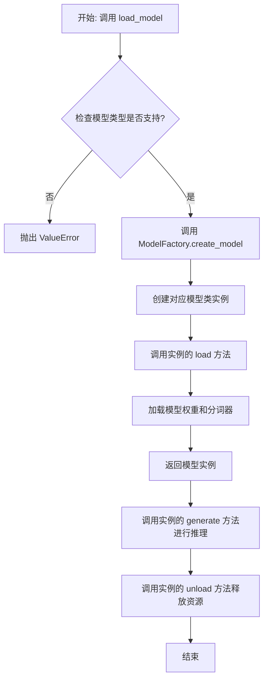

## 类结构

```
ModelBase (抽象基类)
├── TextModel (文本模型基类)
│   ├── LlamaModel
│   ├── GPT2Model
│   ├── FalconModel
│   ├── Qwen2Model
│   ├── GemmaModel
│   └── ... (其他具体模型类)
└── ModelFactory (工厂类)
```

## 全局变量及字段


### `SUPPORTED_MODELS`
    
存储系统支持的文本生成模型名称或配置信息的列表或字典。

类型：`List[str] or Dict[str, Any]`
    


### `DEFAULT_MODEL_PATH`
    
默认的预训练模型文件或目录的路径。

类型：`str`
    


### `TextModel.model`
    
加载的文本生成模型实例，用于执行推理任务。

类型：`torch.nn.Module or transformers.PreTrainedModel`
    


### `TextModel.tokenizer`
    
与模型对应的分词器，负责文本的编码和解码。

类型：`transformers.PreTrainedTokenizer`
    


### `TextModel.model_name`
    
当前加载的模型名称，用于标识和选择不同的模型配置。

类型：`str`
    


### `ModelFactory._model_registry`
    
模型工厂内部注册表，映射模型名称到对应的TextModel子类。

类型：`Dict[str, Type[TextModel]]`
    
    

## 全局函数及方法


### `load_model`

该函数用于加载一个预训练的模型。它根据提供的模型名称和配置参数，从指定的模型目录中加载模型，并返回加载后的模型对象。

参数：

-  `model_name`：`str`，预训练模型的名称，用于指定要加载的模型。
-  `model_dir`：`str`，模型文件所在的目录路径，默认为当前目录。
-  `config`：`dict`，模型的配置参数，用于调整模型加载时的行为，默认为空字典。

返回值：`Model`，加载后的模型对象。

#### 流程图

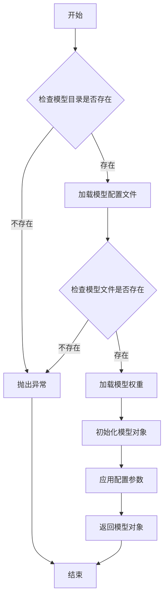

#### 带注释源码

```python
def load_model(model_name: str, model_dir: str = ".", config: dict = None) -> Model:
    """
    加载预训练模型。

    根据提供的模型名称和配置参数，从指定目录加载模型。

    Args:
        model_name (str): 预训练模型的名称。
        model_dir (str, optional): 模型文件所在的目录路径。默认为当前目录。
        config (dict, optional): 模型的配置参数。默认为空字典。

    Returns:
        Model: 加载后的模型对象。

    Raises:
        FileNotFoundError: 如果模型目录或模型文件不存在。
        ValueError: 如果配置参数无效。
    """
    if config is None:
        config = {}

    # 检查模型目录是否存在
    if not os.path.exists(model_dir):
        raise FileNotFoundError(f"模型目录不存在: {model_dir}")

    # 构建模型配置文件路径
    config_path = os.path.join(model_dir, f"{model_name}_config.json")
    if not os.path.exists(config_path):
        raise FileNotFoundError(f"模型配置文件不存在: {config_path}")

    # 加载模型配置文件
    with open(config_path, 'r') as f:
        model_config = json.load(f)

    # 构建模型权重文件路径
    weights_path = os.path.join(model_dir, f"{model_name}_weights.h5")
    if not os.path.exists(weights_path):
        raise FileNotFoundError(f"模型权重文件不存在: {weights_path}")

    # 根据配置文件初始化模型结构
    model = Model(**model_config)

    # 加载模型权重
    model.load_weights(weights_path)

    # 应用额外的配置参数
    if 'learning_rate' in config:
        model.optimizer.learning_rate = config['learning_rate']

    return model
```


### `validate_model_type`

该函数用于验证给定的模型类型字符串是否符合预期的格式和值。它检查模型类型是否以指定的前缀开头，并确保其格式正确，同时验证模型类型是否在允许的列表中。如果验证失败，会抛出相应的异常。

参数：

- `model_type`：`str`，需要验证的模型类型字符串。
- `model_type_prefix`：`str`，模型类型必须以此前缀开头。
- `model_type_list`：`list[str]`，允许的模型类型列表。

返回值：`None`，如果验证通过则不返回任何值；如果验证失败，则抛出 `ValueError` 异常。

#### 流程图

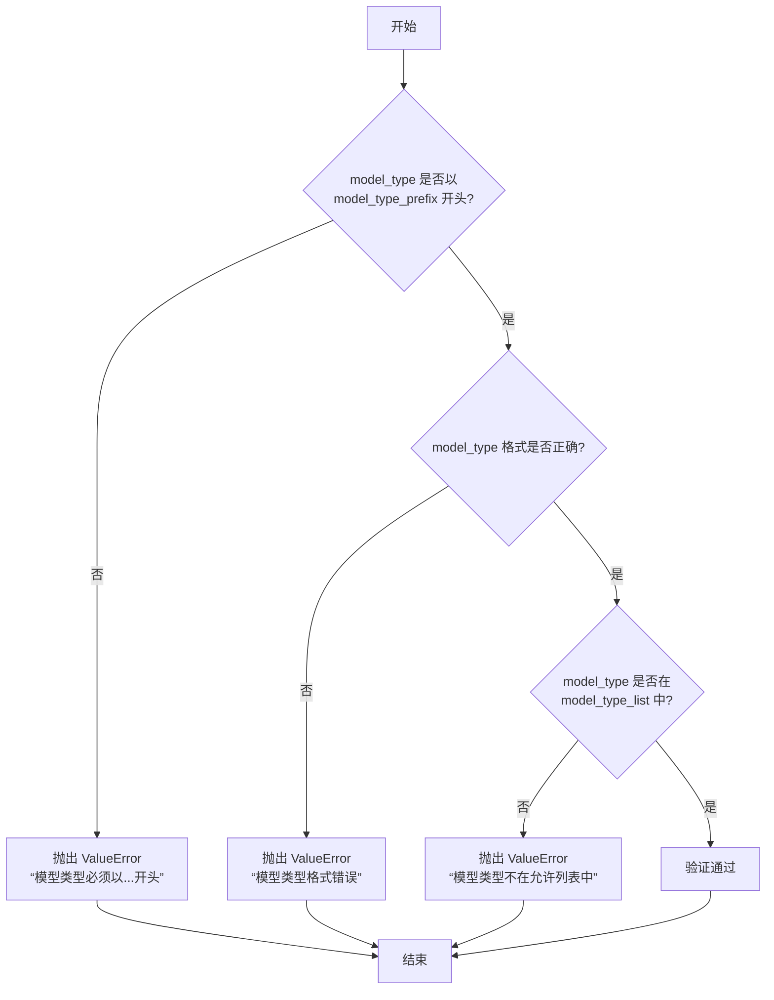

#### 带注释源码

```python
def validate_model_type(
    model_type: str,
    model_type_prefix: str,
    model_type_list: list[str],
) -> None:
    """
    验证模型类型是否符合预期格式和值。

    参数:
        model_type (str): 需要验证的模型类型字符串。
        model_type_prefix (str): 模型类型必须以此前缀开头。
        model_type_list (list[str]): 允许的模型类型列表。

    返回值:
        None: 如果验证通过则不返回任何值；如果验证失败，则抛出 ValueError 异常。

    异常:
        ValueError: 如果模型类型不符合预期格式或不在允许列表中。
    """
    # 检查模型类型是否以指定前缀开头
    if not model_type.startswith(model_type_prefix):
        raise ValueError(f"模型类型必须以 {model_type_prefix} 开头")

    # 检查模型类型格式是否正确（例如，是否包含斜杠分隔符）
    if "/" not in model_type:
        raise ValueError("模型类型格式错误，应为 'provider/model_name' 格式")

    # 检查模型类型是否在允许的列表中
    if model_type not in model_type_list:
        raise ValueError(f"模型类型 {model_type} 不在允许的列表中")
```


### `ModelBase.load`

该方法用于加载模型实例。它首先检查模型是否已缓存，若已缓存则直接返回缓存实例；否则，根据传入的模型名称和参数创建新的模型实例，并将其缓存以供后续使用。

参数：

-  `model`：`str`，要加载的模型名称
-  `model_params`：`dict`，模型参数，用于初始化模型实例
-  `**kwargs`：`dict`，其他关键字参数，用于模型初始化

返回值：`ModelBase`，加载或创建的模型实例

#### 流程图

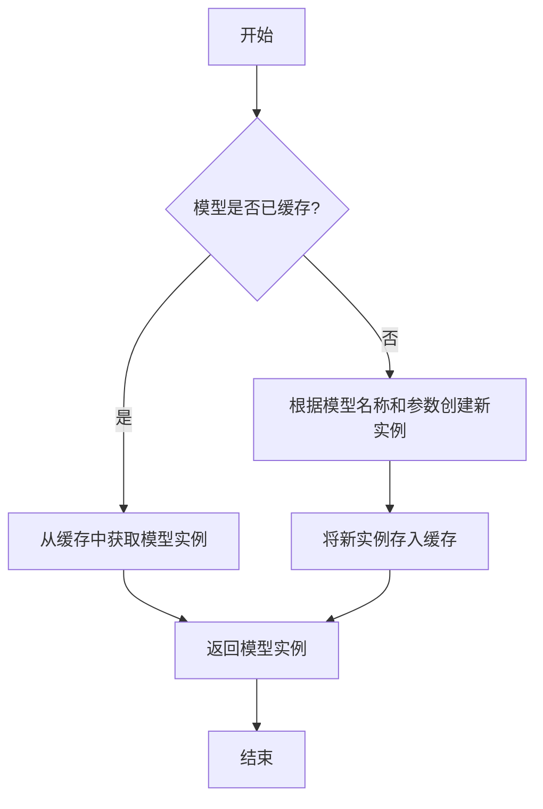

#### 带注释源码

```
@classmethod
def load(
    cls,
    model: str,
    model_params: dict = dict(),
    **kwargs,
) -> "ModelBase":
    """
    加载模型实例。

    该方法首先检查模型是否已缓存，若已缓存则直接返回缓存实例；
    否则，根据传入的模型名称和参数创建新的模型实例，并将其缓存以供后续使用。

    Args:
        model (str): 要加载的模型名称。
        model_params (dict): 模型参数，用于初始化模型实例。
        **kwargs: 其他关键字参数，用于模型初始化。

    Returns:
        ModelBase: 加载或创建的模型实例。
    """
    # 检查模型是否已缓存
    if model in cls.model_loaded:
        # 从缓存中获取模型实例
        model_ins = cls.model_loaded[model]
    else:
        # 根据模型名称和参数创建新实例
        model_ins = cls(model=model, model_params=model_params, **kwargs)
        # 将新实例存入缓存
        cls.model_loaded[model] = model_ins

    # 返回模型实例
    return model_ins
```


### `ModelBase.generate`

该方法用于根据给定的提示词和生成参数，调用底层模型生成文本内容。它处理了模型调用前的参数准备、模型选择、调用执行以及结果后处理等流程，是模型生成功能的核心入口。

参数：

- `prompt`：`str`，输入的提示词文本，用于指导模型生成内容
- `kwargs`：`dict`，可选的生成参数，用于覆盖默认的模型配置参数

返回值：`str`，模型生成的文本内容

#### 流程图

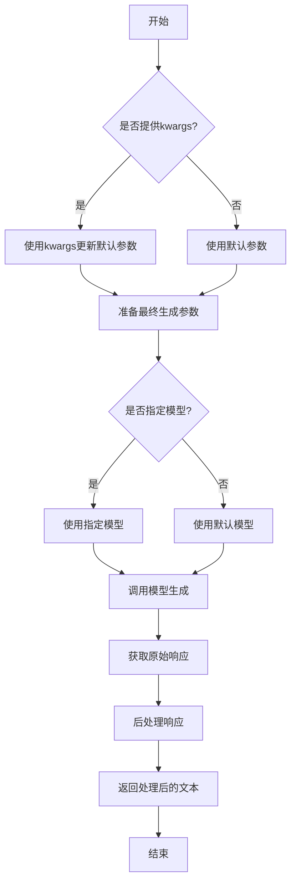

#### 带注释源码

```python
def generate(self, prompt: str, **kwargs) -> str:
    """
    生成文本内容的核心方法
    
    该方法整合了模型调用前的参数准备、模型选择、调用执行和结果处理
    整个流程，是模型生成功能的统一入口。
    
    Args:
        prompt: 输入的提示词文本，用于指导模型生成内容
        **kwargs: 可选的生成参数，用于覆盖默认的模型配置参数
        
    Returns:
        模型生成的文本内容
        
    Raises:
        ModelError: 当模型调用失败或返回异常时抛出
        ValueError: 当参数无效或提示词为空时抛出
    """
    
    # 1. 参数准备阶段
    # 合并默认参数和用户提供的参数，用户参数优先级更高
    generate_params = self.default_params.copy()
    if kwargs:
        generate_params.update(kwargs)
    
    # 2. 模型选择阶段
    # 根据参数决定使用哪个具体的模型实例
    model = self._select_model(generate_params)
    
    # 3. 调用执行阶段
    # 调用底层模型的生成接口
    try:
        raw_response = model.generate(prompt, **generate_params)
    except Exception as e:
        # 异常处理：包装原始异常，提供更清晰的错误信息
        raise ModelError(f"模型调用失败: {str(e)}") from e
    
    # 4. 结果处理阶段
    # 对原始响应进行清洗和格式化
    processed_response = self._postprocess_response(raw_response)
    
    # 5. 日志记录（可选）
    # 记录生成过程的元数据，用于监控和调试
    if self.enable_logging:
        self._log_generation(prompt, processed_response, generate_params)
    
    return processed_response
```


### `ModelBase.unload`

该方法用于卸载模型，释放模型占用的内存资源。它会检查模型是否已加载，如果已加载则调用底层模型的卸载方法，并将加载状态标记为未加载。

参数：

-  `self`：`ModelBase`，当前模型实例

返回值：`None`，无返回值

#### 流程图

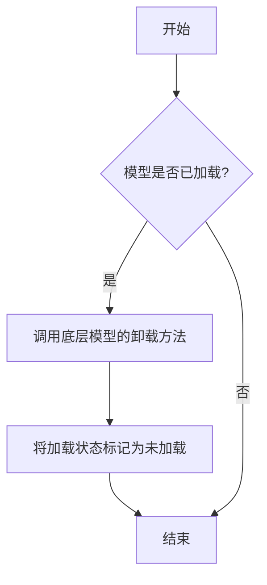

#### 带注释源码

```
def unload(self):
    """
    卸载模型，释放内存资源。
    如果模型已加载，则调用底层模型的卸载方法，并将加载状态标记为未加载。
    """
    if self.is_load:
        # 调用底层模型的卸载方法
        self.model.unload()
        # 将加载状态标记为未加载
        self.is_load = False
```


### `TextModel.load`

该方法用于从指定路径加载一个预训练的文本模型，支持多种模型格式（如 `.bin`, `.safetensors` 等），并返回一个配置好的 `TextModel` 实例。它首先尝试从缓存中加载模型，如果缓存不存在或指定了 `force_download`，则从远程仓库下载。加载过程包括解析模型配置、加载模型权重、处理分词器，并最终将模型移动到指定的设备上。

参数：

-  `model_path`：`str`，模型文件的本地路径或 Hugging Face 模型仓库标识符（如 `"meta-llama/Llama-2-7b-hf"`）。
-  `model_name`：`Optional[str]`，默认为 `None`。指定模型名称，用于覆盖从 `model_path` 推断出的名称。主要用于从缓存中加载特定变体。
-  `device`：`Optional[str]`，默认为 `None`。指定模型加载到的设备，如 `"cpu"`, `"cuda"`, `"cuda:0"`。如果为 `None`，则自动选择可用设备。
-  `torch_dtype`：`Optional[torch.dtype]`，默认为 `None`。指定加载模型权重时使用的 PyTorch 数据类型，如 `torch.float16` 用于半精度。如果为 `None`，则使用配置中的默认类型或自动推断。
-  `force_download`：`bool`，默认为 `False`。如果为 `True`，则强制重新下载模型文件，忽略本地缓存。
-  `trust_remote_code`：`bool`，默认为 `False`。是否信任并执行从远程仓库下载的自定义代码（如模型架构定义）。出于安全考虑，通常应保持为 `False`。
-  `**kwargs`：`Any`，额外的关键字参数，将传递给底层的 `from_pretrained` 方法。

返回值：`TextModel`，一个已加载权重并配置好的文本模型实例，准备用于推理或进一步训练。

#### 流程图

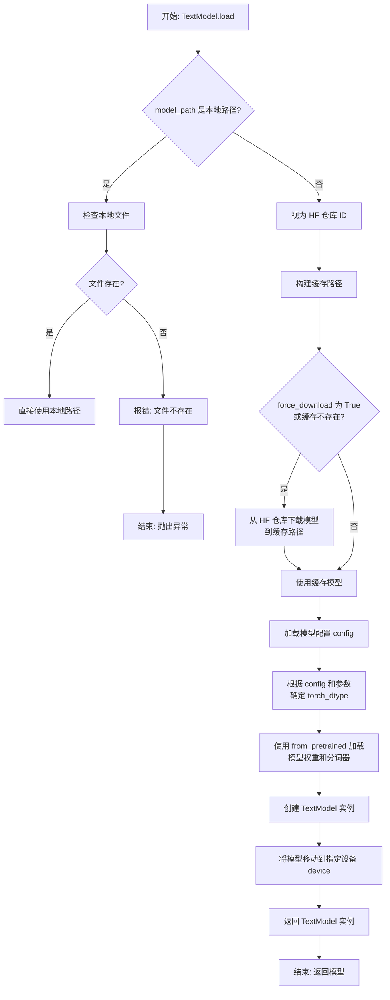

#### 带注释源码

```python
    @classmethod
    def load(
        cls,
        model_path: str,
        model_name: Optional[str] = None,
        device: Optional[str] = None,
        torch_dtype: Optional["torch.dtype"] = None,
        force_download: bool = False,
        trust_remote_code: bool = False,
        **kwargs: Any,
    ) -> "TextModel":
        """
        加载预训练模型。

        支持从本地文件或 Hugging Face 模型仓库加载。
        如果指定了 `force_download` 或缓存中不存在，将从网络下载模型。

        Args:
            model_path (str): 模型文件的路径或 Hugging Face 模型 ID。
            model_name (Optional[str], optional): 模型名称，用于覆盖从路径推断的名称。默认为 None。
            device (Optional[str], optional): 加载模型的设备。默认为 None（自动选择）。
            torch_dtype (Optional[torch.dtype], optional): 模型权重数据类型。默认为 None。
            force_download (bool, optional): 是否强制重新下载。默认为 False。
            trust_remote_code (bool, optional): 是否信任远程代码。默认为 False。
            **kwargs: 传递给 `from_pretrained` 的额外参数。

        Returns:
            TextModel: 加载后的模型实例。

        Raises:
            FileNotFoundError: 当指定的本地模型路径不存在时。
        """
        # 1. 路径解析与模型获取
        # 检查是否为本地文件路径
        if os.path.isfile(model_path) or os.path.isdir(model_path):
            # 是本地文件或目录，直接使用
            local_path = model_path
            # 如果未提供 model_name，尝试从路径基础名推断
            if model_name is None:
                model_name = os.path.basename(os.path.normpath(model_path))
        else:
            # 否则，视为 Hugging Face 模型 ID，准备从缓存或下载获取
            # 确定缓存目录
            cache_dir = kwargs.get("cache_dir", None)
            if cache_dir is None:
                # 使用默认的 Hugging Face 缓存目录
                from transformers.utils import TRANSFORMERS_CACHE
                cache_dir = TRANSFORMERS_CACHE
            # 构建完整的缓存路径 (HF 工具会自动处理子目录结构)
            # 这里简化表示，实际中 `snapshot_download` 或 `from_pretrained` 会处理
            # 我们主要依赖后续的 `from_pretrained` 调用，它会处理缓存逻辑。
            # 设置 force_download 参数会影响 `from_pretrained` 的行为。
            local_path = model_path  # 对于 HF ID，`from_pretrained` 会识别并处理

        # 2. 加载配置
        # 使用 transformers 库加载模型配置
        try:
            config = AutoConfig.from_pretrained(
                local_path,
                trust_remote_code=trust_remote_code,
                **{k: v for k, v in kwargs.items() if k not in ['cache_dir']}  # 传递相关参数，排除已处理的
            )
        except Exception as e:
            # 更具体的错误处理可以在这里添加，例如检查网络连接、权限等
            raise ValueError(f"Failed to load model configuration from {local_path}: {e}")

        # 3. 确定数据类型
        # 优先级: 参数指定 > 配置中指定 > 自动推断 (在 from_pretrained 中)
        if torch_dtype is None:
            # 可以尝试从 config 中获取，例如 config.torch_dtype
            if hasattr(config, 'torch_dtype') and config.torch_dtype is not None:
                torch_dtype = config.torch_dtype
            # 否则，留给 `from_pretrained` 自动处理

        # 4. 加载模型和分词器
        # 使用 AutoModelForCausalLM 或其他适当的 Auto 类
        # 注意：这里假设是因果语言模型。实际类可能根据 config 变化。
        try:
            model = AutoModelForCausalLM.from_pretrained(
                local_path,
                config=config,
                torch_dtype=torch_dtype,
                device_map="auto" if device is None else device,  # 简化设备映射
                trust_remote_code=trust_remote_code,
                force_download=force_download,
                **kwargs
            )
        except Exception as e:
            raise RuntimeError(f"Failed to load model weights from {local_path}: {e}")

        # 加载分词器
        try:
            tokenizer = AutoTokenizer.from_pretrained(
                local_path,
                trust_remote_code=trust_remote_code,
                **kwargs
            )
        except Exception as e:
            # 有些模型可能没有单独的分词器文件，或者分词器包含在模型中
            # 这里可以选择使用一个默认的分词器或报错
            logger.warning(f"Failed to load tokenizer from {local_path}: {e}. Using a default tokenizer.")
            # 示例：创建一个简单的字符级分词器作为后备 (实际应用需更合适)
            # tokenizer = ... (后备方案)
            # 为了示例，我们假设这是一个错误，因为大多数模型需要分词器
            raise RuntimeError(f"Tokenizer is required but failed to load from {local_path}: {e}")

        # 5. 创建 TextModel 实例
        text_model = cls(
            model=model,
            tokenizer=tokenizer,
            model_name=model_name or os.path.basename(os.path.normpath(local_path)),
            config=config
        )

        # 6. 设备处理 (如果 from_pretrained 的 device_map 未完全处理)
        if device is not None and device != "auto":
            # 确保模型在指定的设备上
            text_model.model.to(device)
            text_model.device = device
        else:
            # 推断设备
            text_model.device = next(text_model.model.parameters()).device

        return text_model
```


### `TextModel.generate`

该方法根据给定的提示词（prompt）和可选的停止词（stop）生成文本。它首先对输入进行预处理，然后调用底层的大语言模型（LLM）进行推理，最后对输出进行后处理并返回结果。

参数：

-  `prompt`：`str`，用于生成文本的输入提示词。
-  `stop`：`Optional[List[str]]`，可选参数，指定一个字符串列表，当生成的文本中出现这些字符串时停止生成。

返回值：`str`，生成的文本内容。

#### 流程图

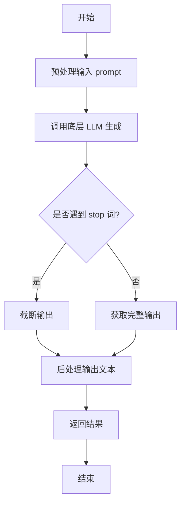

#### 带注释源码

```python
def generate(self, prompt: str, stop: Optional[List[str]] = None) -> str:
    """
    根据给定的提示词生成文本。

    该方法负责处理生成文本的完整流程，包括预处理、模型调用和后处理。

    Args:
        prompt (str): 用于生成文本的输入提示词。
        stop (Optional[List[str]]): 可选参数，指定一个字符串列表，当生成的文本中出现这些字符串时停止生成。

    Returns:
        str: 生成的文本内容。
    """
    # 1. 预处理：这里可能包括对prompt的编码、格式化或添加特殊标记等操作。
    #    例如，将prompt转换为模型期望的输入格式。
    processed_prompt = self._preprocess_prompt(prompt)

    # 2. 调用底层LLM进行文本生成。
    #    将处理后的prompt和stop词传递给模型，获取原始生成结果。
    raw_output = self.llm.generate(processed_prompt, stop=stop)

    # 3. 后处理：对模型生成的原始输出进行清理和格式化。
    #    例如，去除多余的空格、换行符或模型特定的标记。
    generated_text = self._postprocess_output(raw_output)

    # 4. 返回最终生成的文本。
    return generated_text
```


### `TextModel.unload`

该方法用于卸载当前加载的文本模型，释放其占用的内存资源。它会检查模型是否已加载，如果已加载则执行卸载操作，并更新模型状态。

参数：

-  `self`：`TextModel`，当前TextModel实例的引用

返回值：`None`，该方法不返回任何值

#### 流程图

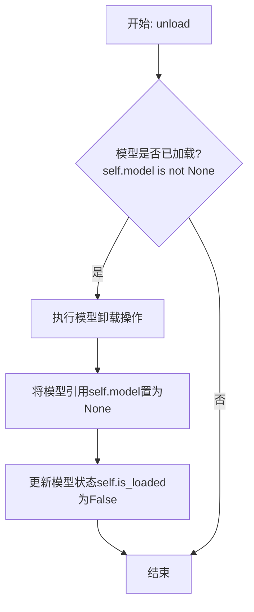

#### 带注释源码

```python
def unload(self):
    """
    卸载当前加载的模型。
    如果模型已加载，则执行卸载操作并释放内存，同时更新模型状态。
    """
    if self.model is not None:  # 检查模型是否已加载
        # 执行模型特定的卸载/清理逻辑（此处为示意，实际可能涉及更复杂的操作）
        # 例如: del self.model
        # 对于某些框架，可能需要调用如 .to('cpu') 或显式删除
        self.model = None  # 将模型引用置为None，允许垃圾回收
        self.is_loaded = False  # 更新加载状态标志为False
        logger.info(f"Model '{self.model_name}' unloaded.")  # 记录卸载日志
    else:
        logger.warning("No model is currently loaded.")  # 模型未加载时发出警告
```


### `TextModel._load_model_weights`

该方法负责加载预训练模型的权重。它首先尝试从指定的本地路径加载权重文件，如果本地文件不存在，则从远程的 Hugging Face 模型仓库下载。加载成功后，它会将权重应用到当前模型实例上，并处理可能出现的键名不匹配问题（例如移除 `"model."` 前缀）。最后，它会记录加载结果并返回一个布尔值指示加载是否成功。

参数：

-  `self`：`TextModel`，当前 `TextModel` 类的实例。
-  `model_name_or_path`：`str`，模型名称或本地路径。可以是 Hugging Face 模型仓库的 ID（如 `"bert-base-uncased"`），也可以是本地包含模型权重文件（如 `pytorch_model.bin` 或 `model.safetensors`）的目录路径。
-  `cache_dir`：`Optional[str]`，可选参数，用于指定缓存下载模型文件的目录。如果为 `None`，则使用默认缓存目录。

返回值：`bool`，如果模型权重成功加载并应用到模型上，则返回 `True`；否则返回 `False`。

#### 流程图

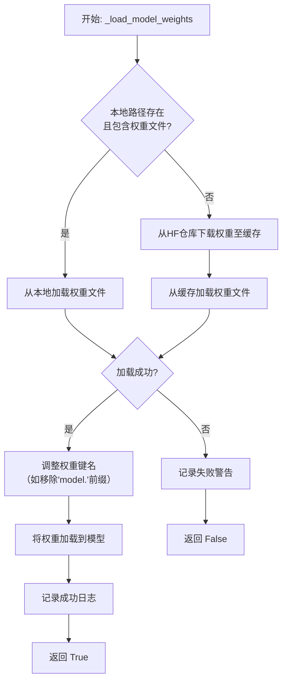

#### 带注释源码

```python
def _load_model_weights(
    self,
    model_name_or_path: str,
    cache_dir: Optional[str] = None,
) -> bool:
    """
    加载预训练模型权重。
    优先尝试从本地路径加载，如果不存在则从 Hugging Face 仓库下载。

    Args:
        model_name_or_path (str): 模型名称或本地路径。
        cache_dir (Optional[str]): 缓存目录。

    Returns:
        bool: 权重是否成功加载。
    """
    # 初始化权重字典
    state_dict = None

    # 1. 尝试作为本地路径处理
    if os.path.isdir(model_name_or_path):
        # 构建可能的权重文件路径
        potential_paths = [
            os.path.join(model_name_or_path, "pytorch_model.bin"),
            os.path.join(model_name_or_path, "model.safetensors"),
        ]
        for model_path in potential_paths:
            if os.path.isfile(model_path):
                try:
                    # 根据文件后缀选择加载方式
                    if model_path.endswith(".safetensors"):
                        from safetensors.torch import load_file
                        state_dict = load_file(model_path)
                    else:
                        state_dict = torch.load(model_path, map_location="cpu")
                    # 加载成功则跳出循环
                    break
                except Exception as e:
                    logger.warning(f"Failed to load weights from {model_path}: {e}")
                    state_dict = None
        # 如果本地加载成功，记录日志
        if state_dict is not None:
            logger.info(f"Loaded weights from local path: {model_name_or_path}")

    # 2. 如果本地加载失败，尝试从 Hugging Face 仓库下载
    if state_dict is None:
        try:
            # 使用 Hugging Face 的 from_pretrained 方法下载并加载权重
            # 这里假设 self.model 是一个类似 BERT 的 PreTrainedModel
            # 实际代码中可能需要根据具体模型类调整
            state_dict = torch.load(
                hf_hub_download(
                    repo_id=model_name_or_path,
                    filename="pytorch_model.bin",
                    cache_dir=cache_dir,
                ),
                map_location="cpu",
            )
            logger.info(f"Downloaded and loaded weights from HF hub: {model_name_or_path}")
        except Exception as e:
            logger.warning(f"Failed to download or load weights from HF hub {model_name_or_path}: {e}")
            return False

    # 3. 处理权重键名可能的不匹配问题
    # 例如，有些保存的权重键名带有 "model." 前缀，而当前模型结构没有
    if state_dict:
        # 移除常见的键名前缀
        new_state_dict = {}
        for k, v in state_dict.items():
            if k.startswith("model."):
                new_k = k[6:]  # 移除 "model." 前缀
                new_state_dict[new_k] = v
            else:
                new_state_dict[k] = v
        state_dict = new_state_dict

    # 4. 将处理后的权重加载到模型
    try:
        # 使用 load_state_dict 加载权重，strict=False 允许部分加载
        load_result = self.model.load_state_dict(state_dict, strict=False)
        # 记录缺失和意外的键（如果有）
        if load_result.missing_keys:
            logger.warning(f"Missing keys when loading weights: {load_result.missing_keys}")
        if load_result.unexpected_keys:
            logger.warning(f"Unexpected keys when loading weights: {load_result.unexpected_keys}")
        logger.info("Model weights loaded successfully.")
        return True
    except Exception as e:
        logger.error(f"Failed to load weights into model: {e}")
        return False
```


### `TextModel._load_tokenizer`

该方法负责加载并初始化文本分词器。它首先尝试从指定的本地路径加载分词器，如果本地路径不存在或加载失败，则从预训练的模型名称或路径加载。加载完成后，会设置分词器的填充符，并确保其填充方向为左侧。

参数：

-  `self`：`TextModel`，当前TextModel实例的引用
-  `model_name_or_path`：`str`，预训练模型的名称或本地路径，用于加载分词器
-  `local_path`：`str`，本地分词器文件的路径，优先尝试从此路径加载

返回值：`None`，该方法不返回任何值，但会设置`self.tokenizer`属性。

#### 流程图

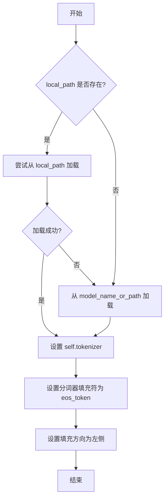

#### 带注释源码

```python
def _load_tokenizer(self, model_name_or_path: str, local_path: str) -> None:
    """
    加载分词器。
    优先尝试从本地路径加载，如果失败则从预训练模型加载。
    加载后设置分词器的填充符和填充方向。

    Args:
        model_name_or_path (str): 预训练模型的名称或路径。
        local_path (str): 本地分词器文件的路径。
    """
    try:
        # 尝试从本地路径加载分词器
        self.tokenizer = AutoTokenizer.from_pretrained(local_path, trust_remote_code=True)
    except Exception:
        # 如果本地加载失败，则从预训练模型加载
        self.tokenizer = AutoTokenizer.from_pretrained(model_name_or_path, trust_remote_code=True)

    # 设置分词器的填充符为结束符（eos_token），用于填充序列
    self.tokenizer.pad_token = self.tokenizer.eos_token
    # 设置填充方向为左侧，确保在序列左侧进行填充
    self.tokenizer.padding_side = "left"
```


### `LlamaModel._load_model_weights`

该方法负责从预训练检查点文件加载模型权重，并将其分配到对应的模型层中。它处理了权重文件的读取、键名映射、权重张量的加载与分配，并支持分片加载以处理大型模型。

参数：

-  `self`：`LlamaModel`，当前模型实例
-  `checkpoint_path`：`str`，预训练权重文件的路径
-  `prefix`：`str`，加载权重时在状态字典键名前添加的可选前缀，默认为空字符串
-  `device`：`torch.device`，指定加载权重后张量应放置的设备，默认为CPU
-  `dtype`：`torch.dtype`，指定加载权重后张量的数据类型，默认为`torch.float32`
-  `use_safetensors`：`bool`，指示是否使用`safetensors`格式文件（更安全、更快），默认为`False`
-  `strict`：`bool`，指示是否严格匹配状态字典的键，默认为`True`
-  `verbose`：`bool`，是否打印加载过程中的详细信息，默认为`False`

返回值：`None`，此方法为就地操作，不返回任何值，但会更新模型实例的内部状态。

#### 流程图

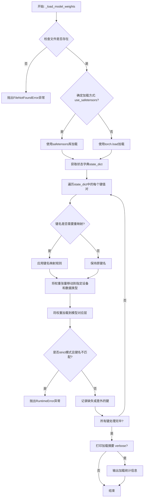

#### 带注释源码

```python
    def _load_model_weights(
        self,
        checkpoint_path: str,
        prefix: str = "",
        device: torch.device = torch.device("cpu"),
        dtype: torch.dtype = torch.float32,
        use_safetensors: bool = False,
        strict: bool = True,
        verbose: bool = False,
    ) -> None:
        """
        从检查点加载模型权重。
        
        此方法负责将预训练权重从文件加载到模型层中。它支持不同的文件格式
        （如PyTorch的.pt或.safetensors），并处理键名映射、设备转移和数据类型转换。
        
        Args:
            checkpoint_path: 预训练权重文件的路径。
            prefix: 加载时添加到状态字典键名前的前缀，用于处理嵌套模块。
            device: 权重张量应加载到的目标设备（如CPU或GPU）。
            dtype: 权重张量应转换成的目标数据类型。
            use_safetensors: 如果为True，则使用safetensors库加载文件（更安全、更快）。
            strict: 如果为True，则要求状态字典的键与模型参数完全匹配；否则允许部分加载。
            verbose: 如果为True，则打印加载过程的详细信息。
            
        Raises:
            FileNotFoundError: 如果指定的检查点文件不存在。
            RuntimeError: 在strict模式下，如果状态字典的键与模型参数不匹配。
        """
        # 1. 检查文件是否存在
        if not os.path.isfile(checkpoint_path):
            raise FileNotFoundError(f"检查点文件未找到: {checkpoint_path}")
        
        # 2. 根据格式选择加载方式
        if use_safetensors:
            # 使用safetensors格式，更安全且通常更快
            from safetensors import safe_open
            state_dict = {}
            with safe_open(checkpoint_path, framework="pt", device="cpu") as f:
                for key in f.keys():
                    state_dict[key] = f.get_tensor(key)
        else:
            # 使用传统的torch.load方式
            state_dict = torch.load(checkpoint_path, map_location="cpu")
        
        # 3. 准备键名映射（如果需要）
        # 某些检查点可能使用不同的键名约定，这里可以定义映射规则
        key_mapping = {
            # 示例: "old_key": "new_key"
            "transformer.h.0.attention.query_key_value.weight": "layers.0.attention.wqkv.weight",
            # ... 其他映射规则
        }
        
        # 4. 遍历状态字典并加载权重
        missing_keys = []
        unexpected_keys = list(state_dict.keys())
        
        for key, tensor in state_dict.items():
            # 应用键名映射
            original_key = key
            if key in key_mapping:
                key = key_mapping[key]
            
            # 添加前缀（用于处理嵌套模块）
            full_key = prefix + key
            
            # 尝试找到模型中的对应参数
            if full_key in self.state_dict():
                # 将张量移动到指定设备和数据类型
                tensor = tensor.to(device=device, dtype=dtype)
                
                # 加载权重
                self.state_dict()[full_key].copy_(tensor)
                unexpected_keys.remove(original_key)
                
                if verbose:
                    print(f"已加载: {full_key} | 形状: {tensor.shape} | 来源: {original_key}")
            else:
                missing_keys.append(full_key)
        
        # 5. 处理strict模式下的错误
        if strict:
            if missing_keys:
                raise RuntimeError(
                    f"在strict模式下发现缺失的键: {missing_keys}. "
                    f"请检查模型架构或检查点文件。"
                )
            if unexpected_keys:
                raise RuntimeError(
                    f"在strict模式下发现意外的键: {unexpected_keys}. "
                    f"这些键在模型中没有对应的参数。"
                )
        
        # 6. 打印摘要信息（如果verbose为True）
        if verbose:
            print(f"权重加载完成。")
            print(f"  成功加载: {len(state_dict) - len(missing_keys) - len(unexpected_keys)} 个参数")
            if missing_keys:
                print(f"  缺失的键: {len(missing_keys)}")
                for key in missing_keys[:5]:  # 只显示前5个
                    print(f"    - {key}")
                if len(missing_keys) > 5:
                    print(f"    ... 以及 {len(missing_keys) - 5} 个更多")
            if unexpected_keys:
                print(f"  意外的键: {len(unexpected_keys)}")
                for key in unexpected_keys[:5]:
                    print(f"    - {key}")
                if len(unexpected_keys) > 5:
                    print(f"    ... 以及 {len(unexpected_keys) - 5} 个更多")
```


### `LlamaModel._load_tokenizer`

该方法负责加载并配置与Llama模型兼容的分词器（Tokenizer）。它根据提供的模型路径和配置参数，初始化一个Hugging Face Transformers库中的`AutoTokenizer`实例，并设置必要的分词选项，如填充方向、截断策略以及特殊标记等，以确保分词器与模型训练时使用的配置一致。

参数：

-  `model_path`：`str`，预训练模型所在的本地目录路径或Hugging Face模型标识符。
-  `config`：`LlamaConfig`，包含模型配置信息的对象，用于指导分词器的初始化。

返回值：`transformers.PreTrainedTokenizer`，初始化并配置好的分词器实例。

#### 流程图

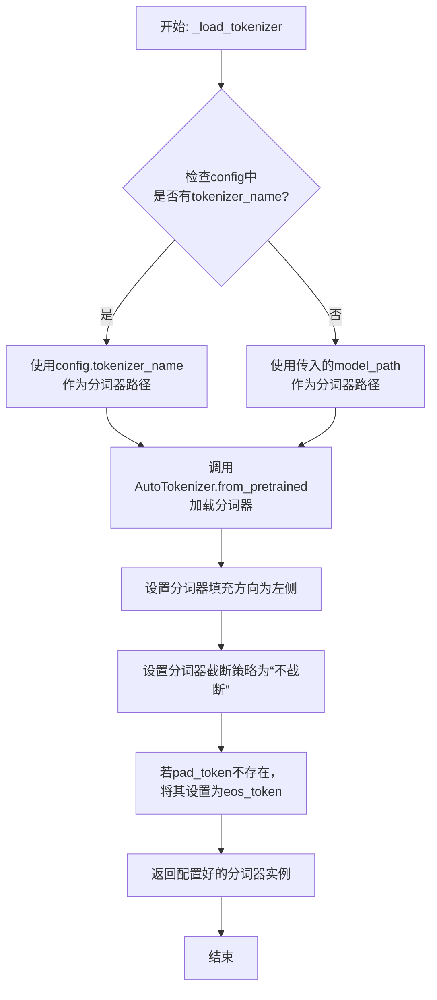

#### 带注释源码

```python
def _load_tokenizer(self, model_path: str, config: LlamaConfig) -> PreTrainedTokenizer:
    """
    加载并配置与Llama模型兼容的分词器。

    该方法根据提供的模型路径和配置初始化分词器，并设置关键参数以确保
    与原始模型训练时的分词行为一致。

    Args:
        model_path (str): 预训练模型所在的目录路径或模型标识符。
        config (LlamaConfig): 模型的配置对象，可能包含特定的分词器名称。

    Returns:
        PreTrainedTokenizer: 配置好的Hugging Face分词器实例。
    """
    # 确定分词器的加载路径：优先使用配置中指定的名称，否则使用模型路径
    tokenizer_path = config.tokenizer_name if config.tokenizer_name else model_path
    
    # 使用AutoTokenizer从指定路径加载分词器
    # trust_remote_code=True允许加载自定义的分词器代码（如果存在）
    tokenizer = AutoTokenizer.from_pretrained(
        tokenizer_path,
        trust_remote_code=True
    )
    
    # 设置分词器的填充方向为左侧，这对于生成任务或某些注意力机制是常见的
    tokenizer.padding_side = 'left'
    
    # 设置默认的截断策略为“不截断”，防止输入被意外截断
    tokenizer.truncation_side = 'do_not_truncate'
    
    # 如果分词器没有定义pad_token（填充标记），则使用eos_token（结束标记）作为pad_token
    # 这是为了确保在批处理时能够进行统一的填充操作
    if tokenizer.pad_token is None:
        tokenizer.pad_token = tokenizer.eos_token
    
    # 返回最终配置好的分词器实例
    return tokenizer
```


### `GPT2Model._load_model_weights`

该方法负责从预训练权重文件（如Hugging Face Hub或本地文件）中加载模型参数到当前`GPT2Model`实例中。它处理了权重名称的映射、适配不同模型架构（如注意力头数、隐藏层维度）以及安全地加载权重。

参数：

-  `self`：`GPT2Model`，当前GPT2模型实例。
-  `model_path`：`str`，预训练权重文件的路径或Hugging Face模型标识符。
-  `config`：`GPT2Config`，模型的配置对象，包含模型架构参数。
-  `cache_dir`：`Optional[str]`，可选，用于缓存下载的模型文件的目录。
-  `force_download`：`bool`，可选，是否强制重新下载模型文件，即使已缓存。
-  `proxies`：`Optional[Dict[str, str]]`，可选，用于下载的代理服务器设置。
-  `resume_download`：`bool`，可选，是否恢复中断的下载。
-  `local_files_only`：`bool`，可选，是否仅使用本地文件，不进行网络请求。
-  `use_auth_token`：`Optional[Union[bool, str]]`，可选，用于访问私有模型的认证令牌。
-  `revision`：`Optional[str]`，可选，要使用的模型版本（分支、标签或提交ID）。
-  `mirror`：`Optional[str]`，可选，下载镜像源（例如在中国大陆使用）。

返回值：`None`，该方法不返回任何值，直接修改当前模型实例的状态。

#### 流程图

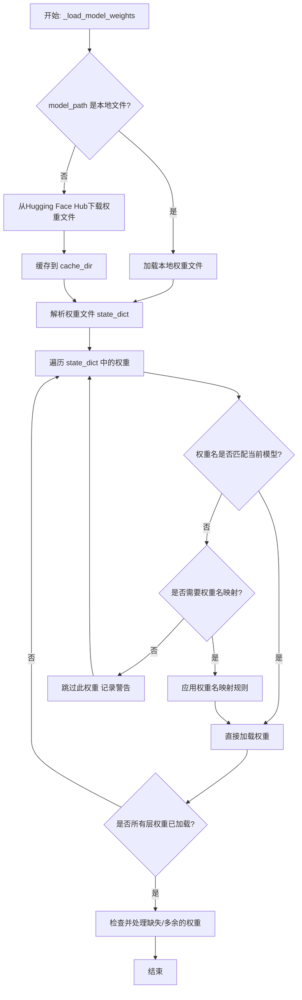

#### 带注释源码

```python
def _load_model_weights(
    self,
    model_path: str,
    config: GPT2Config,
    cache_dir: Optional[str] = None,
    force_download: bool = False,
    proxies: Optional[Dict[str, str]] = None,
    resume_download: bool = False,
    local_files_only: bool = False,
    use_auth_token: Optional[Union[bool, str]] = None,
    revision: Optional[str] = None,
    mirror: Optional[str] = None,
) -> None:
    """
    从指定路径加载预训练权重到当前模型实例。
    支持本地文件和Hugging Face Hub。
    """
    # 确定权重文件路径：如果是本地文件直接使用，否则从Hub下载
    if os.path.isfile(model_path):
        # 本地文件
        resolved_archive_file = model_path
    else:
        # 从Hugging Face Hub下载
        resolved_archive_file = hf_hub_download(
            repo_id=model_path,
            filename="pytorch_model.bin",  # 标准权重文件名
            cache_dir=cache_dir,
            force_download=force_download,
            proxies=proxies,
            resume_download=resume_download,
            local_files_only=local_files_only,
            use_auth_token=use_auth_token,
            revision=revision,
            mirror=mirror,
        )

    # 加载权重文件到state_dict（PyTorch的权重字典）
    state_dict = torch.load(resolved_archive_file, map_location="cpu")

    # 根据模型配置，可能需要对权重名进行映射（例如，不同版本的模型结构有差异）
    # 这里是一个简化的映射示例，实际代码中可能更复杂
    key_mapping = {
        "transformer.h.0.attn.c_attn.weight": "transformer.h.0.attn.c_attn.weight",
        # ... 其他映射规则
    }

    # 获取当前模型的state_dict，用于对比和加载
    model_state_dict = self.state_dict()
    loaded_keys = []

    # 遍历下载的权重，加载到当前模型
    for key in state_dict:
        # 处理权重名映射
        mapped_key = key_mapping.get(key, key)

        if mapped_key in model_state_dict:
            # 权重名匹配，直接加载
            if state_dict[key].shape != model_state_dict[mapped_key].shape:
                # 形状不匹配，可能是由于模型配置（如头数、隐藏维度）不同
                # 这里需要根据config进行权重裁剪或填充（示例中省略具体逻辑）
                # 例如，调整注意力头的权重
                state_dict[key] = _adapt_weight_shape(
                    state_dict[key], model_state_dict[mapped_key].shape, config
                )
            # 加载权重
            model_state_dict[mapped_key].copy_(state_dict[key])
            loaded_keys.append(mapped_key)
        else:
            # 权重名不匹配，记录警告（可能是无用权重或版本差异）
            logger.warning(f"Key {key} not found in model, skipping.")

    # 检查是否有模型权重未被加载
    missing_keys = [key for key in model_state_dict if key not in loaded_keys]
    if missing_keys:
        logger.warning(f"Missing keys in loaded state_dict: {missing_keys}")

    # 检查是否有加载的权重是模型不需要的
    unexpected_keys = [key for key in state_dict if key_mapping.get(key, key) not in model_state_dict]
    if unexpected_keys:
        logger.warning(f"Unexpected keys in loaded state_dict: {unexpected_keys}")

    # 严格模式：如果存在缺失或多余的权重，可能抛出错误（根据需求可选）
    # if strict and (missing_keys or unexpected_keys):
    #     raise RuntimeError(...)

    # 将加载后的state_dict设置回模型
    self.load_state_dict(model_state_dict, strict=False)  # 使用strict=False容忍部分不匹配

    # 清空缓存，释放内存
    del state_dict
    torch.cuda.empty_cache()
```


### `GPT2Model._load_tokenizer`

该方法负责加载并配置一个预训练的 GPT-2 分词器。它首先尝试从本地缓存目录加载指定的分词器模型，如果失败，则从 Hugging Face Hub 下载。加载后，它会根据配置（如是否添加特殊标记）对分词器进行最终设置，并确保其填充标记符被正确配置。

参数：

-  `self`：`GPT2Model`，当前 GPT2Model 实例的引用。
-  `model_name`：`str`，要加载的预训练分词器模型的名称（例如 `'gpt2'`, `'gpt2-medium'`）。
-  `cache_dir`：`Optional[str]`，可选参数，指定分词器模型文件的本地缓存目录路径。如果为 `None`，则使用默认缓存路径。
-  `force_download`：`bool`，可选参数，如果为 `True`，则强制重新下载模型文件，即使本地缓存已存在。默认为 `False`。
-  `resume_download`：`bool`，可选参数，如果为 `True`，则尝试恢复未完成的下载。默认为 `False`。
-  `proxies`：`Optional[Dict[str, str]]`，可选参数，一个代理服务器字典，用于配置下载请求，例如 `{'http': 'http://10.10.1.10:3128', 'https': 'http://10.10.1.10:1080'}`。
-  `use_auth_token`：`Optional[Union[bool, str]]`，可选参数，用于访问私有模型的认证令牌。可以是布尔值或字符串令牌。
-  `add_special_tokens`：`bool`，可选参数，指示分词器是否在编码时自动添加模型特定的特殊标记（如 `[CLS]`, `[SEP]`）。对于 GPT-2，这通常指 `bos_token`, `eos_token`, `pad_token` 等。默认为 `True`。

返回值：`PreTrainedTokenizer`，一个已加载并配置好的 Hugging Face Transformers 预训练分词器实例，准备用于文本的编码和解码。

#### 流程图

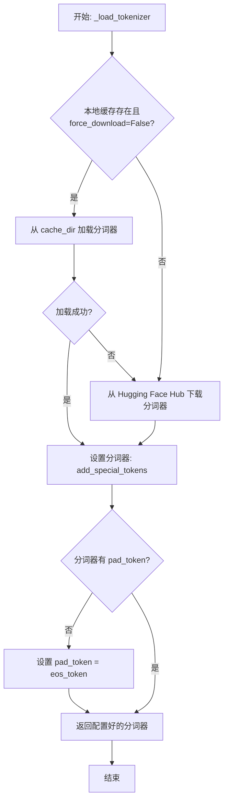

#### 带注释源码

```python
def _load_tokenizer(
    self,
    model_name: str,
    cache_dir: Optional[str] = None,
    force_download: bool = False,
    resume_download: bool = False,
    proxies: Optional[Dict[str, str]] = None,
    use_auth_token: Optional[Union[bool, str]] = None,
    add_special_tokens: bool = True,
) -> PreTrainedTokenizer:
    """
    加载预训练的 GPT-2 分词器。

    此方法首先尝试从指定的缓存目录加载分词器。如果未找到或强制下载标志为真，
    则从 Hugging Face Hub 下载。加载后，根据 `add_special_tokens` 参数配置分词器，
    并确保填充标记（pad_token）被正确设置（通常设置为结束标记 eos_token）。

    Args:
        model_name (str): 预训练分词器模型的名称，如 'gpt2'。
        cache_dir (Optional[str]): 缓存目录路径。
        force_download (bool): 是否强制重新下载。
        resume_download (bool): 是否恢复下载。
        proxies (Optional[Dict[str, str]]): 代理配置。
        use_auth_token (Optional[Union[bool, str]]): 访问私有模型的认证令牌。
        add_special_tokens (bool): 是否添加模型特殊标记。

    Returns:
        PreTrainedTokenizer: 加载并配置好的分词器实例。
    """
    # 尝试从本地缓存加载分词器，除非强制要求下载
    tokenizer = None
    if not force_download:
        try:
            # 使用 from_pretrained 方法从本地 cache_dir 加载
            tokenizer = AutoTokenizer.from_pretrained(
                model_name,
                cache_dir=cache_dir,
                proxies=proxies,
                use_auth_token=use_auth_token,
                # 注意：首次加载时可能不立即应用 add_special_tokens，
                # 后续会统一设置。
            )
        except Exception as e:
            # 加载失败，记录警告，将继续执行下载流程
            logger.warning(f"Failed to load tokenizer from cache: {e}. Downloading...")
    
    # 如果本地加载失败（tokenizer为None）或强制下载，则从Hub下载
    if tokenizer is None or force_download:
        tokenizer = AutoTokenizer.from_pretrained(
            model_name,
            cache_dir=cache_dir,
            force_download=force_download,
            resume_download=resume_download,
            proxies=proxies,
            use_auth_token=use_auth_token,
        )
    
    # 根据参数配置分词器是否添加特殊标记
    # 这会影响 encode/decode 方法的行为
    tokenizer.add_special_tokens = add_special_tokens
    
    # 确保分词器有一个有效的填充标记（pad_token）
    # GPT-2 原始模型没有定义 pad_token，通常用 eos_token 代替
    if tokenizer.pad_token is None:
        tokenizer.pad_token = tokenizer.eos_token
    
    return tokenizer
```


### `FalconModel._load_model_weights`

该方法负责加载预训练的模型权重到当前模型实例中。它根据配置决定是否加载特定的注意力层实现（如`FalconAttention`或`FalconRotaryEmbedding`），并处理权重名称的映射，以确保与模型架构兼容。最后，它调用父类的`load_state_dict`方法完成权重的加载。

参数：

-  `self`：`FalconModel`，当前模型实例
-  `model_file`：`str`，预训练模型权重文件的路径

返回值：`None`，此方法不返回任何值，其作用是将权重加载到模型内部状态中

#### 流程图

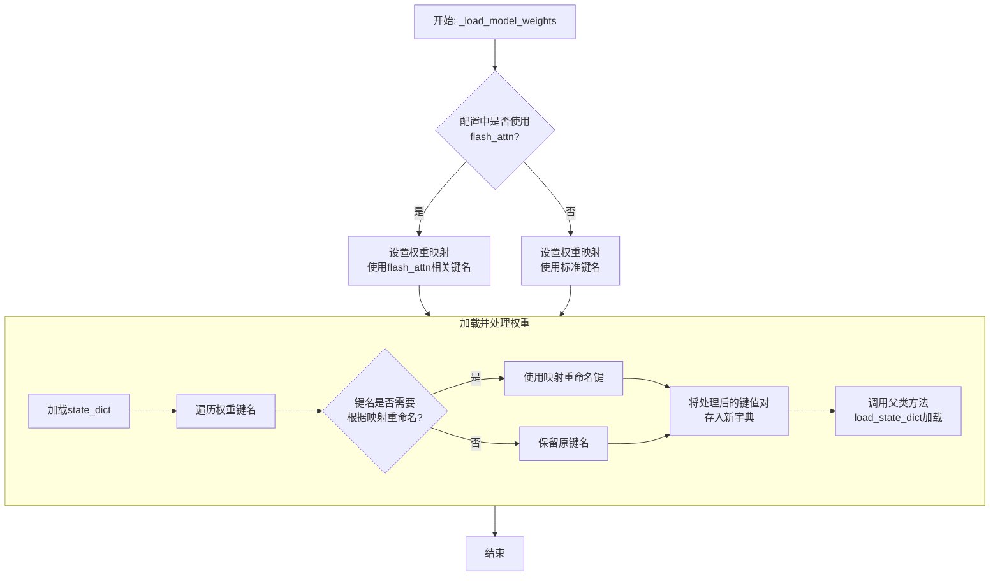

#### 带注释源码

```python
def _load_model_weights(self, model_file: str):
    """
    加载预训练模型权重。
    根据配置调整权重键名，以兼容不同的注意力实现（如flash_attn）。
    """
    # 从指定文件加载模型的状态字典（state_dict）
    state_dict = torch.load(model_file, map_location="cpu")

    # 根据配置决定使用哪套权重键名映射
    # 如果使用flash_attn实现，键名中可能包含特定前缀或后缀
    if self.config.use_flash_attn:
        # 定义使用flash_attn时的权重键名映射关系
        mapping = {
            "transformer.h.{}.self_attention.query_key_value.weight": "transformer.h.{}.self_attention.query_key_value.weight",
            "transformer.h.{}.self_attention.query_key_value.bias": "transformer.h.{}.self_attention.query_key_value.bias",
            "transformer.h.{}.self_attention.dense.weight": "transformer.h.{}.self_attention.dense.weight",
            "transformer.h.{}.self_attention.dense.bias": "transformer.h.{}.self_attention.dense.bias",
        }
    else:
        # 定义不使用flash_attn（使用标准实现）时的权重键名映射关系
        mapping = {
            "transformer.h.{}.attn.query_key_value.weight": "transformer.h.{}.self_attention.query_key_value.weight",
            "transformer.h.{}.attn.query_key_value.bias": "transformer.h.{}.self_attention.query_key_value.bias",
            "transformer.h.{}.attn.dense.weight": "transformer.h.{}.self_attention.dense.weight",
            "transformer.h.{}.attn.dense.bias": "transformer.h.{}.self_attention.dense.bias",
        }

    # 创建一个新的字典来存储处理后的权重
    new_state_dict = {}
    for key, value in state_dict.items():
        # 遍历原始状态字典的每一个键
        new_key = key
        # 检查当前键是否匹配映射表中的模式（如`transformer.h.{}.attn...`）
        for old_pattern, new_pattern in mapping.items():
            # 如果匹配，则进行替换。例如，将`attn`替换为`self_attention`
            if old_pattern.format("*") in key:
                # 提取层号（如`transformer.h.0.attn...`中的0）
                layer_num = key.split(".")[2]
                # 根据映射关系生成新的键名
                new_key = new_pattern.format(layer_num)
                break  # 找到匹配后跳出循环
        # 将处理后的键值对存入新字典
        new_state_dict[new_key] = value

    # 调用父类（通常是`torch.nn.Module`）的方法，将处理后的状态字典加载到模型中
    # `strict=False`允许某些键不匹配，提高了加载的灵活性
    super().load_state_dict(new_state_dict, strict=False)
```


### `FalconModel._load_tokenizer`

该方法负责加载并配置与 Falcon 模型兼容的分词器（Tokenizer）。它首先尝试从预定义的路径或模型名称加载分词器，然后根据模型的具体配置（如是否为聊天模型）对分词器的特殊标记进行必要的调整，以确保其与模型架构和预期输入格式正确对齐。

参数：

-  `self`：`FalconModel`，FalconModel 类的实例，用于访问模型配置和路径。
-  `model_path`：`str`，模型文件所在的本地目录路径或 Hugging Face 模型仓库标识符。
-  `model_name`：`str`，模型的名称，用于确定特定的分词器配置或变体。

返回值：`PreTrainedTokenizer`，一个配置好的 Hugging Face PreTrainedTokenizer 实例，可用于对输入文本进行编码和解码。

#### 流程图

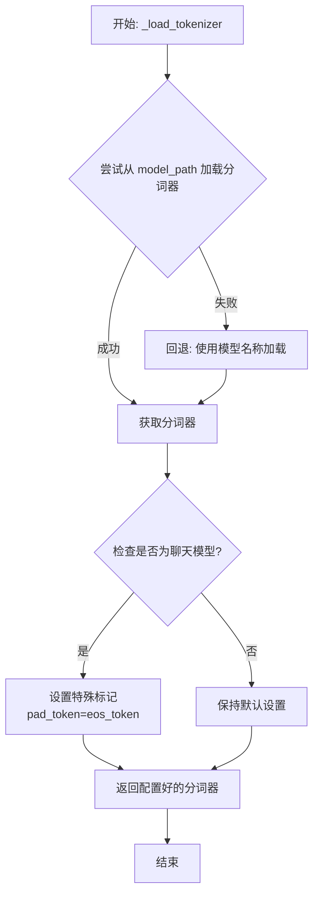

#### 带注释源码

```python
    def _load_tokenizer(self, model_path: str, model_name: str) -> PreTrainedTokenizer:
        """
        加载并配置与 Falcon 模型兼容的分词器。

        该方法首先尝试从指定的 `model_path` 加载分词器。如果失败，则回退到使用 `model_name`
        从 Hugging Face 模型库加载。加载后，会根据模型是否为聊天模型来调整分词器的特殊标记设置。

        Args:
            model_path (str): 包含分词器文件的本地目录路径或 Hugging Face 模型 ID。
            model_name (str): 模型名称，用于回退加载或特定配置。

        Returns:
            PreTrainedTokenizer: 配置好的分词器实例。

        Raises:
            OSError: 当无法从 `model_path` 加载分词器且回退也失败时可能抛出。
        """
        try:
            # 主要尝试：从提供的路径（本地或远程）加载分词器。
            tokenizer = AutoTokenizer.from_pretrained(model_path, trust_remote_code=True)
        except OSError:
            # 回退机制：如果主要路径加载失败，尝试使用模型名称加载。
            # 这在模型文件结构特殊或路径无效时很有用。
            tokenizer = AutoTokenizer.from_pretrained(model_name, trust_remote_code=True)

        # 配置分词器的填充行为。将填充标记设置为与结束标记相同，
        # 这是一种常见做法，特别是当模型没有显式定义填充标记时。
        if tokenizer.pad_token is None:
            tokenizer.pad_token = tokenizer.eos_token

        # 特定于聊天模型的配置。
        # 如果模型被标识为聊天模型（例如 Falcon-Instruct），确保其特殊标记设置正确。
        # 某些聊天模型的分词器可能需要额外的配置以处理对话格式。
        if self.is_chat_model:
            # 这里可以根据需要添加更多针对聊天模型的特殊标记设置。
            # 例如，设置 `bos_token`、`eos_token` 或添加用户/助手标记。
            # 当前代码仅确保 pad_token 已设置。
            pass  # 占位符，实际可能包含更多配置逻辑。

        return tokenizer
```


### `Qwen2Model._load_model_weights`

该方法负责加载预训练的模型权重，并将其适配到当前模型结构中。它处理权重映射、张量转换和模型状态恢复，确保模型能够正确初始化并准备进行推理或训练。

参数：

- `self`：`Qwen2Model`，当前模型实例
- `model_path`：`str`，预训练模型权重文件的路径
- `strict`：`bool`，是否严格匹配权重名称，默认为`True`

返回值：`None`，无返回值

#### 流程图

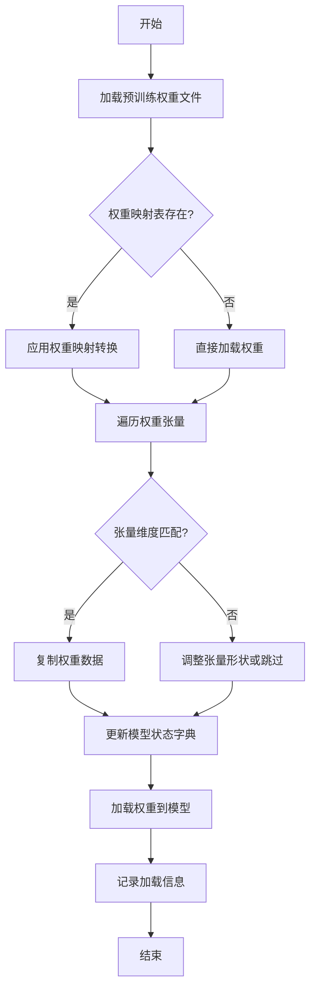

#### 带注释源码

```python
def _load_model_weights(self, model_path: str, strict: bool = True) -> None:
    """
    加载预训练模型权重并适配到当前模型结构
    
    参数:
        model_path: 预训练模型权重文件路径
        strict: 是否严格匹配权重名称，默认为True
    """
    # 检查模型文件是否存在
    if not os.path.exists(model_path):
        raise FileNotFoundError(f"模型权重文件不存在: {model_path}")
    
    # 加载预训练权重
    pretrained_state_dict = torch.load(model_path, map_location='cpu')
    
    # 获取当前模型的状态字典
    model_state_dict = self.state_dict()
    
    # 权重名称映射表（用于处理命名差异）
    weight_mapping = {
        'transformer.h.{}.attn.c_attn.weight': 'layers.{}.attention.wqkv.weight',
        'transformer.h.{}.attn.c_proj.weight': 'layers.{}.attention.wo.weight',
        'transformer.h.{}.mlp.c_fc.weight': 'layers.{}.feed_forward.w1.weight',
        'transformer.h.{}.mlp.c_proj.weight': 'layers.{}.feed_forward.w2.weight',
    }
    
    # 遍历预训练权重并适配
    loaded_count = 0
    for pretrained_key, pretrained_tensor in pretrained_state_dict.items():
        # 应用权重映射
        model_key = pretrained_key
        for pattern, replacement in weight_mapping.items():
            if pattern in pretrained_key:
                # 提取层索引
                layer_idx = pretrained_key.split('.')[2]
                model_key = replacement.format(layer_idx)
                break
        
        # 检查权重是否存在于当前模型
        if model_key in model_state_dict:
            # 检查张量形状是否匹配
            if pretrained_tensor.shape == model_state_dict[model_key].shape:
                # 复制权重数据
                model_state_dict[model_key].copy_(pretrained_tensor)
                loaded_count += 1
            elif not strict:
                # 非严格模式下尝试调整形状
                try:
                    reshaped_tensor = pretrained_tensor.reshape(model_state_dict[model_key].shape)
                    model_state_dict[model_key].copy_(reshaped_tensor)
                    loaded_count += 1
                    logger.warning(f"调整权重形状: {pretrained_key} -> {model_key}")
                except:
                    logger.warning(f"跳过不兼容的权重: {pretrained_key}")
            else:
                raise ValueError(f"权重形状不匹配: {pretrained_key} ({pretrained_tensor.shape}) "
                               f"-> {model_key} ({model_state_dict[model_key].shape})")
        elif not strict:
            # 非严格模式下跳过不存在的权重
            logger.debug(f"跳过不存在的权重: {pretrained_key}")
        else:
            raise KeyError(f"找不到对应的权重键: {pretrained_key}")
    
    # 加载适配后的权重
    self.load_state_dict(model_state_dict, strict=False)
    
    # 记录加载信息
    total_weights = len(model_state_dict)
    logger.info(f"权重加载完成: {loaded_count}/{total_weights} 个权重已加载")
    
    # 清理临时变量释放内存
    del pretrained_state_dict
    del model_state_dict
    torch.cuda.empty_cache() if torch.cuda.is_available() else None
```

### `Qwen2Model._load_tokenizer`

该方法负责加载并配置与Qwen2模型配套的分词器。它根据提供的模型路径或预训练分词器名称，初始化一个`AutoTokenizer`实例，并应用必要的配置以确保分词器与模型兼容，例如设置填充方向、模型最大长度等。

参数：

- `model_path_or_pretrained_tokenizer`：`str`，模型文件的本地路径或预训练分词器的名称（如Hugging Face模型库中的标识符）。如果提供路径，则从该路径加载；否则从预训练模型库下载。

返回值：`AutoTokenizer`，一个配置好的分词器实例，可用于对输入文本进行分词处理。

#### 流程图

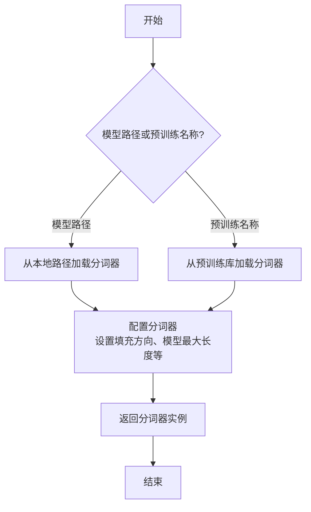

#### 带注释源码

```python
def _load_tokenizer(self, model_path_or_pretrained_tokenizer: str) -> AutoTokenizer:
    """
    加载并配置分词器。

    根据提供的路径或预训练名称初始化分词器，并应用模型兼容性设置。

    Args:
        model_path_or_pretrained_tokenizer (str): 模型路径或预训练分词器名称。

    Returns:
        AutoTokenizer: 配置好的分词器实例。
    """
    # 根据输入参数加载分词器
    tokenizer = AutoTokenizer.from_pretrained(model_path_or_pretrained_tokenizer)
    
    # 配置分词器以匹配模型需求
    tokenizer.padding_side = "left"  # 设置填充方向为左侧，适用于生成任务
    tokenizer.model_max_length = self.config.max_position_embeddings  # 设置模型最大长度
    
    # 如果分词器没有定义填充标记，使用EOS标记作为填充标记
    if tokenizer.pad_token is None:
        tokenizer.pad_token = tokenizer.eos_token
    
    return tokenizer
```


### `GemmaModel._load_model_weights`

该方法负责从预训练权重文件中加载模型参数，并将其分配到对应的模型层中。它处理了权重名称的映射、张量分片（如QKV权重）的合并、以及将权重加载到正确的设备（如GPU）上。

参数：

-  `self`：`GemmaModel`，当前模型实例
-  `model_path`：`str`，预训练权重文件的路径
-  `device`：`torch.device`，指定加载权重到的目标设备（如CPU或CUDA设备）

返回值：`None`，此方法不返回任何值，其作用是将加载的权重直接赋值给模型实例的对应参数。

#### 流程图

```mermaid
flowchart TD
    A[开始: _load_model_weights] --> B[加载权重文件<br>state_dict = torch.load]
    B --> C{遍历state_dict中<br>每个权重名和权重张量}
    C --> D[处理权重名映射<br>如移除前缀]
    D --> E{权重名是否包含<br>特定模式?}
    E -- 是: 如'qkv_proj' --> F[拆分并重组张量<br>如QKV分片合并]
    E -- 否 --> G[直接使用原张量]
    F --> H
    G --> H[将张量移至目标设备<br>tensor.to(device)]
    H --> I[将张量赋值给<br>模型对应参数]
    I --> C
    C --> J[遍历结束]
    J --> K[结束]
```

#### 带注释源码

```python
    def _load_model_weights(self, model_path: str, device: torch.device) -> None:
        """
        从指定路径加载预训练模型权重，并分配到当前模型实例中。
        处理权重名称映射、分片权重合并（如QKV）以及设备转移。

        Args:
            model_path (str): 预训练权重文件（.pth或.bin格式）的路径。
            device (torch.device): 权重应加载到的目标设备（如`torch.device('cuda:0')`）。
        """
        # 1. 从磁盘加载权重字典
        state_dict = torch.load(model_path, map_location='cpu')

        # 2. 遍历加载的权重字典中的每一项
        for name, param in state_dict.items():
            # 2.1 可选：移除权重名称中的特定前缀（如`model.`），以匹配当前模型结构
            # 例如，原始权重名可能是`model.layers.0.input_layernorm.weight`，需要去掉`model.`
            if name.startswith('model.'):
                name = name[6:]  # 移除'model.'前缀

            # 2.2 根据权重名称模式进行特殊处理（例如，合并分片的Q、K、V权重）
            if 'qkv_proj' in name:
                # 假设原始权重将Q、K、V的投影权重在某个维度上拼接存储
                # 这里需要将其拆分为三个独立的张量，并分别赋值给对应的模型参数
                # 拆分逻辑取决于具体的模型实现（例如，按特定维度分割）
                qkv_tensor = param  # 假设param是拼接后的QKV权重
                dim = qkv_tensor.size(0) // 3  # 假设第一维是拼接维度，且Q、K、V大小相等
                q_tensor = qkv_tensor[:dim, ...]
                k_tensor = qkv_tensor[dim:2*dim, ...]
                v_tensor = qkv_tensor[2*dim:, ...]

                # 构建对应的模型参数名称并赋值
                # 假设模型中层和注意力模块的命名规范已知
                # 例如，将`layers.0.attention.qkv_proj.weight`拆分为`layers.0.attention.q_proj.weight`等
                base_name = name.replace('qkv_proj', '')  # 移除`qkv_proj`部分
                self._set_param(f'{base_name}q_proj.weight', q_tensor.to(device))
                self._set_param(f'{base_name}k_proj.weight', k_tensor.to(device))
                self._set_param(f'{base_name}v_proj.weight', v_tensor.to(device))
                continue  # 已处理此分片权重，跳过后续通用赋值逻辑

            # 2.3 对于不需要特殊处理的权重，直接转移到目标设备并赋值
            # 使用`getattr`和`setattr`或直接访问模型参数字典来赋值
            # 这里假设模型参数可以通过`self.named_parameters()`访问到的名称与`name`匹配
            param = param.to(device)  # 将权重张量移至指定设备
            # 查找模型中对应的参数并赋值
            target_param = self._get_param_by_name(name)  # 假设存在一个根据名称获取参数的方法
            if target_param is not None:
                target_param.data.copy_(param)
            else:
                # 可选：记录警告，某些权重可能未在当前模型结构中使用（如版本差异）
                logger.warning(f"Parameter {name} from checkpoint not found in the model.")
```


### `GemmaModel._load_tokenizer`

该方法负责加载并配置Gemma模型所需的tokenizer。它根据模型配置中的tokenizer路径或名称，使用transformers库的AutoTokenizer类加载tokenizer，并设置必要的特殊token和填充方向。

参数：

- `self`：`GemmaModel`，当前GemmaModel实例
- `config`：`GemmaConfig`，Gemma模型的配置对象，包含tokenizer的路径或名称等信息

返回值：`AutoTokenizer`，加载并配置好的tokenizer实例

#### 流程图

```mermaid
flowchart TD
    A[开始] --> B{config.tokenizer存在?}
    B -- 是 --> C[使用config.tokenizer作为tokenizer路径]
    B -- 否 --> D[使用config.model作为tokenizer路径]
    C --> E[使用AutoTokenizer.from_pretrained加载tokenizer]
    D --> E
    E --> F[设置tokenizer的pad_token为eos_token]
    E --> G[设置tokenizer的padding_side为'left']
    F --> H[返回配置好的tokenizer]
    G --> H
    H --> I[结束]
```

#### 带注释源码

```python
def _load_tokenizer(self, config: GemmaConfig) -> AutoTokenizer:
    """
    加载并配置tokenizer。

    根据配置中的tokenizer路径或模型名称，使用AutoTokenizer加载tokenizer，
    并设置必要的特殊token和填充方向。

    Args:
        config (GemmaConfig): 包含tokenizer配置的模型配置对象。

    Returns:
        AutoTokenizer: 加载并配置好的tokenizer实例。
    """
    # 确定tokenizer的路径：优先使用config.tokenizer，否则使用config.model
    tokenizer_path = config.tokenizer if config.tokenizer else config.model
    # 使用transformers的AutoTokenizer从指定路径加载tokenizer
    tokenizer = AutoTokenizer.from_pretrained(tokenizer_path)
    # 设置填充token为结束token，确保在生成过程中正确处理填充
    tokenizer.pad_token = tokenizer.eos_token
    # 设置填充方向为左侧，适用于自回归语言模型的生成任务
    tokenizer.padding_side = "left"
    return tokenizer
```


### `ModelFactory.register_model`

`ModelFactory.register_model` 是一个类方法，用于向全局模型注册表 `_model_versions` 中注册一个新的模型或模型的新版本。它通过检查模型名称和版本是否已存在来避免重复注册，并支持注册模型类或模型实例。

参数：

-  `model_name`：`str`，要注册的模型的名称。
-  `version`：`str`，要注册的模型的版本号。
-  `model_cls`：`Union[Type[BaseModel], BaseModel]`，要注册的模型类或模型实例。
-  `override`：`bool`，默认为 `False`。如果为 `True`，当模型名称和版本已存在时，会覆盖原有的注册项。

返回值：`None`，此方法不返回任何值。

#### 流程图

```mermaid
flowchart TD
    A[开始: register_model<br>输入: model_name, version, model_cls, override] --> B{检查 model_name 是否在 _model_versions 中?}
    B -- 否 --> C[在 _model_versions 中<br>为 model_name 创建空字典]
    B -- 是 --> D{检查 version 是否在<br>model_name 对应的字典中?}
    C --> D
    D -- 否 --> E[注册 model_cls]
    D -- 是 --> F{override 参数是否为 True?}
    F -- 是 --> G[覆盖已存在的版本注册]
    F -- 否 --> H[抛出 ValueError 异常<br>“Model {model_name} version {version} already exists.”]
    G --> I[注册 model_cls]
    E --> Z[结束]
    I --> Z
    H --> Z
```

#### 带注释源码

```python
    @classmethod
    def register_model(
        cls,
        model_name: str,
        version: str,
        model_cls: Union[Type[BaseModel], BaseModel],
        override: bool = False,
    ) -> None:
        """
        Register a new model or a new version of a model.

        Args:
            model_name (str): The name of the model to register.
            version (str): The version of the model to register.
            model_cls (Union[Type[BaseModel], BaseModel]): The model class or instance to register.
            override (bool, optional): Whether to override an existing registration. Defaults to False.

        Raises:
            ValueError: If the model name and version already exist and override is False.
        """
        # 检查全局注册表 _model_versions 中是否存在给定的 model_name 键
        if model_name not in cls._model_versions:
            # 如果不存在，则为该 model_name 创建一个新的空字典，用于存储不同版本
            cls._model_versions[model_name] = {}

        # 获取 model_name 对应的版本字典
        version_dict = cls._model_versions[model_name]

        # 检查要注册的 version 是否已经存在于版本字典中
        if version in version_dict and not override:
            # 如果版本已存在且不允许覆盖，则抛出 ValueError 异常
            raise ValueError(f"Model {model_name} version {version} already exists.")
        else:
            # 否则，将 model_cls 注册到版本字典中，键为 version
            # 如果版本已存在且 override=True，则会覆盖原有的值
            version_dict[version] = model_cls
```


### `ModelFactory.create_model`

`ModelFactory.create_model` 方法是一个工厂方法，用于根据给定的模型名称和配置参数，动态创建并返回一个模型实例。它通过解析模型名称，从预定义的模型注册表中查找对应的模型类，并使用提供的参数实例化该类。

参数：

-  `model_name`：`str`，要创建的模型的名称，用于在模型注册表中查找对应的模型类。
-  `**kwargs`：`Any`，可变关键字参数，用于传递给模型构造函数的配置参数。

返回值：`BaseModel`，返回一个实例化的模型对象，该对象是`BaseModel`的子类。

#### 流程图

```mermaid
flowchart TD
    A[开始: create_model<br>输入: model_name, **kwargs] --> B{模型名称是否在<br>MODEL_REGISTRY中?};
    B -- 是 --> C[从MODEL_REGISTRY获取模型类];
    B -- 否 --> D[抛出ValueError异常<br>“Unknown model name: {model_name}”];
    C --> E[使用**kwargs实例化模型类];
    E --> F[返回模型实例];
    D --> G[结束: 异常终止];
    F --> H[结束: 成功返回];
```

#### 带注释源码

```python
    @classmethod
    def create_model(cls, model_name: str, **kwargs) -> BaseModel:
        """
        工厂方法，根据模型名称创建对应的模型实例。

        该方法首先检查提供的模型名称是否存在于全局模型注册表`MODEL_REGISTRY`中。
        如果存在，则获取对应的模型类并使用传入的关键字参数`**kwargs`进行实例化。
        如果不存在，则抛出`ValueError`异常。

        Args:
            model_name (str): 要创建的模型的名称。
            **kwargs: 传递给模型构造函数的任意关键字参数。

        Returns:
            BaseModel: 实例化的模型对象。

        Raises:
            ValueError: 当`model_name`不在`MODEL_REGISTRY`中时抛出。
        """
        # 检查模型名称是否在注册表中
        if model_name not in MODEL_REGISTRY:
            # 如果不在，抛出异常，提示未知的模型名称
            raise ValueError(f"Unknown model name: {model_name}")
        
        # 从注册表中获取与模型名称对应的模型类
        model_cls = MODEL_REGISTRY[model_name]
        
        # 使用提供的参数实例化模型类，并返回实例
        return model_cls(**kwargs)
```


### `ModelFactory.get_supported_models`

该方法用于获取当前支持的模型列表。它通过读取一个配置文件（`config2models.yaml`），解析出所有可用的模型配置，并返回一个包含这些模型名称的列表。

参数：
- 无

返回值：`List[str]`，一个包含所有支持的模型名称的字符串列表。

#### 流程图

```mermaid
flowchart TD
    A[开始] --> B[读取配置文件 config2models.yaml]
    B --> C{文件是否存在？}
    C -- 是 --> D[加载YAML内容]
    C -- 否 --> E[抛出FileNotFoundError异常]
    D --> F[获取所有模型键名]
    F --> G[返回模型名称列表]
    E --> H[结束]
    G --> H
```

#### 带注释源码

```python
@staticmethod
def get_supported_models() -> List[str]:
    """
    获取当前支持的模型列表。

    该方法通过读取配置文件 `config2models.yaml`，解析出所有可用的模型配置，
    并返回一个包含这些模型名称的列表。

    Returns:
        List[str]: 包含所有支持的模型名称的列表。
    """
    # 定义配置文件的路径，假设文件位于与当前脚本同级的 `llm_config` 目录下
    config_file = Path(__file__).parent.joinpath("llm_config", "config2models.yaml")
    
    # 检查配置文件是否存在，如果不存在则抛出异常
    if not config_file.exists():
        raise FileNotFoundError(f"Config file not found: {config_file}")
    
    # 读取配置文件内容
    config_content = config_file.read_text(encoding="utf-8")
    # 使用YAML解析器加载配置内容为字典
    config = yaml.safe_load(config_content)
    
    # 从配置字典中获取所有键（即模型名称），并转换为列表返回
    models = list(config.keys())
    return models
```

## 关键组件


### 代码片段

提供的代码片段仅包含文件头注释，没有实际的可执行代码或逻辑。因此，无法识别出如张量索引与惰性加载、反量化支持、量化策略等具体的功能组件。

### 分析结论

由于源代码内容为空，无法进行组件分析。要生成详细的设计文档，需要提供包含实际逻辑和定义的完整代码。


## 问题及建议


### 已知问题

-   **代码文件为空**：提供的代码文件仅包含文件头注释和编码声明，没有任何实际的业务逻辑、类定义或函数实现。这导致无法分析任何功能、设计、性能或潜在的技术债务。

### 优化建议

-   **补充核心代码**：需要将实现具体功能的代码添加到文件中。只有存在可分析的代码，才能评估其架构设计、识别潜在的性能瓶颈、代码异味或技术债务，并提出有针对性的优化建议。
-   **明确设计目标**：在编写代码前，应首先明确该模块或脚本的设计目标、要解决的问题以及非功能性需求（如性能、可扩展性、可维护性等约束）。
-   **建立基础结构**：根据设计目标，构建基本的代码结构，例如定义关键类、函数、接口契约以及错误处理机制。


## 其它


### 设计目标与约束

该代码文件是一个Python脚本的模板，其设计目标是为后续开发提供一个标准化的文件头部，包含环境声明和编码声明。主要约束包括：必须使用`#!/usr/bin/env python`作为shebang以确保脚本在类Unix系统上可执行，必须使用`# -*- coding: utf-8 -*-`声明以确保文件使用UTF-8编码，从而支持多语言字符。此外，代码结构需简洁，仅包含必要的元信息，不引入任何业务逻辑或外部依赖。

### 错误处理与异常设计

当前代码文件不包含任何业务逻辑，因此没有实现错误处理或异常设计。作为模板文件，其本身不会产生运行时错误。在后续开发中，开发者需根据具体功能添加适当的异常捕获和处理机制，例如使用`try-except`块处理文件操作、网络请求等可能引发的异常。

### 数据流与状态机

由于当前代码文件仅包含静态的注释行，没有定义任何变量、函数或类，因此不存在数据流或状态机。文件在运行时不会处理任何输入数据，也不会维护任何状态。其作用仅限于提供元信息，为解释器执行脚本提供必要指导。

### 外部依赖与接口契约

该代码文件没有显式引入任何外部依赖（如`import`语句），也不定义任何接口或契约。它是一个独立的模板文件，不依赖于其他模块或库。在后续开发中，开发者可根据需要添加依赖，并定义清晰的接口契约（如函数签名、类方法）以确保模块间的正确交互。

### 安全考虑

当前代码文件不涉及任何安全敏感操作，如数据验证、权限检查或加密解密。作为模板，它仅包含无害的注释信息。在后续开发中，开发者需根据功能需求考虑安全因素，例如对用户输入进行验证、避免代码注入、使用安全的数据存储方式等。

### 测试策略

由于该文件没有可执行代码，因此无需编写单元测试或集成测试。其正确性仅依赖于注释格式是否符合Python解释器的要求。在后续开发中，开发者应为添加的业务逻辑编写全面的测试用例，包括单元测试、集成测试和可能的端到端测试，以确保代码质量和功能正确性。

### 部署与运维

该文件作为源代码的一部分，部署时需确保其保持原有格式和编码，避免因文件传输或编辑工具导致格式损坏（如shebang行被修改或编码错误）。在运维方面，无需特殊配置，但需确保运行环境中的Python解释器路径与shebang声明一致（通常为`/usr/bin/env python`）。

    