# `.\MetaGPT\tests\metagpt\memory\test_brain_memory.py` 详细设计文档

该文件是一个单元测试文件，用于测试 BrainMemory 类的核心功能，包括对话历史管理（添加对话/回答、序列化/反序列化）、信息提取、以及与LLM集成的功能测试（相关性判断、文本重写、摘要生成、标题生成）。

## 整体流程

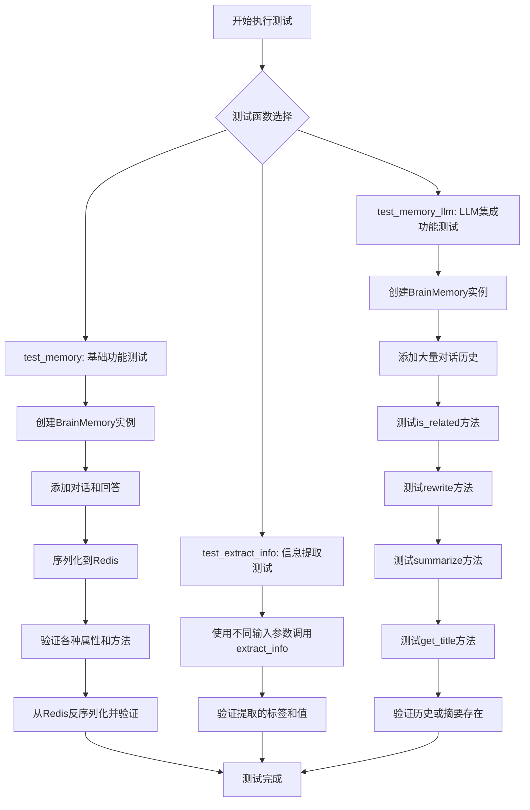

## 类结构

```
BrainMemory (被测类)
├── 字段: history, historical_summary, last_talk, ...
├── 方法: add_talk, add_answer, dumps, loads, extract_info, ...
└── 方法: is_related, rewrite, summarize, get_title, ...
Message (数据类，来自metagpt.schema)
LLM (外部依赖类，来自metagpt.llm)
```

## 全局变量及字段


### `BrainMemory.history`
    
存储对话历史的消息列表，包含用户和助手的交互记录。

类型：`List[Message]`
    


### `BrainMemory.historical_summary`
    
历史对话的摘要文本，用于压缩和总结过往的对话内容。

类型：`Optional[str]`
    


### `BrainMemory.last_talk`
    
最近一次用户谈话的临时存储，用于快速访问或弹出操作。

类型：`Optional[str]`
    
    

## 全局函数及方法

### `test_memory`

这是一个异步单元测试函数，用于测试 `BrainMemory` 类的核心功能，包括消息的添加、序列化/反序列化、历史记录管理以及一些辅助方法。

参数：

-   无显式参数。该函数是一个 `pytest` 测试用例，通过 `@pytest.mark.asyncio` 装饰器标记为异步。

返回值：`None`，该函数是一个测试用例，其主要目的是通过断言（`assert`）来验证代码行为，不返回业务值。

#### 流程图

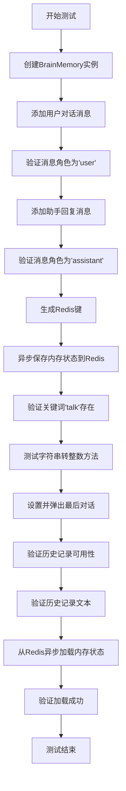

#### 带注释源码

```python
@pytest.mark.asyncio  # 标记此测试函数为异步函数，以便pytest-asyncio插件能正确处理。
async def test_memory():
    # 1. 初始化一个BrainMemory实例。
    memory = BrainMemory()
    
    # 2. 测试添加用户对话。
    #    向内存中添加一条内容为"talk"的用户消息。
    memory.add_talk(Message(content="talk"))
    #    验证添加的第一条历史记录的角色是"user"。
    assert memory.history[0].role == "user"
    
    # 3. 测试添加助手回复。
    #    向内存中添加一条内容为"answer"的助手消息。
    memory.add_answer(Message(content="answer"))
    #    验证添加的第二条历史记录的角色是"assistant"。
    assert memory.history[1].role == "assistant"
    
    # 4. 测试序列化（持久化）。
    #    生成一个用于Redis存储的键。
    redis_key = BrainMemory.to_redis_key("none", "user_id", "chat_id")
    #    异步将当前memory对象的状态保存到Redis。
    await memory.dumps(redis_key=redis_key)
    
    # 5. 测试关键词存在性检查。
    #    验证内存中是否存在与"talk"相关的信息。
    assert memory.exists("talk")
    
    # 6. 测试工具方法：字符串转整数。
    #    将字符串"1"转换为整数，如果失败则返回默认值0。
    assert 1 == memory.to_int("1", 0)
    
    # 7. 测试最后对话的管理。
    #    设置最后对话内容。
    memory.last_talk = "AAA"
    #    弹出并获取最后对话内容，同时清空该属性。
    assert memory.pop_last_talk() == "AAA"
    #    验证弹出后属性已被清空。
    assert memory.last_talk is None
    
    # 8. 测试历史记录的可用性和文本获取。
    #    验证历史记录是否可用（非空）。
    assert memory.is_history_available
    #    获取历史记录的文本表示。
    assert memory.history_text
    
    # 9. 测试反序列化（加载）。
    #    异步从Redis中加载之前保存的memory状态。
    memory = await BrainMemory.loads(redis_key=redis_key)
    #    验证加载成功，memory对象不为空。
    assert memory
```

### `BrainMemory.extract_info`

该方法用于从输入字符串中提取标签和值。它尝试匹配形如 `[TAG]:VALUE` 的格式，如果匹配成功，则返回标签和值；否则，返回 `None` 和原始输入字符串。

参数：

- `input`：`str`，输入的字符串，可能包含标签和值。

返回值：`tuple[Optional[str], str]`，返回一个元组，第一个元素是提取到的标签（如果没有则为 `None`），第二个元素是提取到的值（如果没有标签则为原始字符串）。

#### 流程图

```mermaid
flowchart TD
    A[开始: 输入字符串 input] --> B{input 是否匹配模式<br>'[TAG]:VALUE'?}
    B -- 是 --> C[使用正则提取标签 tag 和值 val]
    C --> D[返回 (tag, val)]
    B -- 否 --> E[返回 (None, input)]
```

#### 带注释源码

```python
@staticmethod
def extract_info(input: str) -> tuple[Optional[str], str]:
    """
    从输入字符串中提取标签和值。
    尝试匹配形如 '[TAG]:VALUE' 的格式。
    如果匹配成功，返回标签和值；否则返回 None 和原始字符串。

    Args:
        input (str): 输入的字符串。

    Returns:
        tuple[Optional[str], str]: 一个元组，包含标签（或 None）和值。
    """
    # 定义正则表达式模式，用于匹配 [TAG]:VALUE 格式
    pattern = r"\[(.*?)\]:?(.*)"
    # 在输入字符串中搜索该模式
    match = re.search(pattern, input)
    if match:
        # 如果匹配成功，提取标签（第一组）和值（第二组）
        tag = match.group(1).strip()  # 去除标签两端的空白字符
        val = match.group(2).strip()  # 去除值两端的空白字符
        # 如果标签或值为空，则视为未匹配到有效格式
        if not tag or not val:
            return None, input
        return tag, val
    else:
        # 如果未匹配到模式，返回 None 和原始输入
        return None, input
```

### `test_memory_llm`

这是一个异步单元测试函数，用于测试 `BrainMemory` 类与 LLM（大语言模型）集成的核心功能。它验证了内存系统在处理大量历史对话、进行语义相关性判断、内容重写、摘要生成和标题提取等高级功能时的正确性。

参数：

- `llm`：`LLM`，一个 LLM 实例，用于执行文本理解、生成和推理任务。

返回值：`None`，这是一个测试函数，不返回业务值，通过断言（assert）来验证测试结果。

#### 流程图

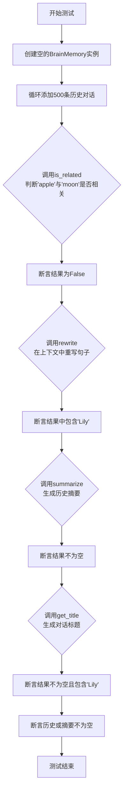

#### 带注释源码

```python
@pytest.mark.asyncio  # 标记此函数为异步测试
@pytest.mark.parametrize("llm", [LLM()])  # 为参数`llm`提供测试数据，这里是一个LLM实例
async def test_memory_llm(llm):  # 定义异步测试函数，接收一个LLM实例作为参数
    memory = BrainMemory()  # 创建一个新的BrainMemory实例，模拟一个空的对话记忆体
    for i in range(500):  # 循环500次，模拟向记忆体中添加大量历史对话
        memory.add_talk(Message(content="Lily is a girl.\n"))  # 每次添加一条内容为"Lily is a girl."的用户对话

    # 测试1：语义相关性判断
    # 调用`is_related`方法，判断“apple”和“moon”这两个概念在当前的对话历史背景下是否相关
    # 预期结果应为False，因为历史对话只关于Lily，与苹果和月亮无关
    res = await memory.is_related("apple", "moon", llm)
    assert not res  # 断言结果为False，验证无关性判断正确

    # 测试2：基于上下文的句子重写
    # 调用`rewrite`方法，要求LLM基于当前记忆（全是关于Lily的）将句子“apple Lily eating”进行重写
    # 预期重写后的句子应包含“Lily”，因为记忆上下文强烈关联Lily
    res = await memory.rewrite(sentence="apple Lily eating", context="", llm=llm)
    assert "Lily" in res  # 断言结果中包含“Lily”，验证重写功能能利用历史信息

    # 测试3：历史对话摘要生成
    # 调用`summarize`方法，基于500条重复的对话历史生成一个摘要
    res = await memory.summarize(llm=llm)
    assert res  # 断言结果不为空，验证摘要生成功能正常工作

    # 测试4：对话标题生成
    # 调用`get_title`方法，为当前的对话历史生成一个标题
    res = await memory.get_title(llm=llm)
    assert res  # 断言结果不为空
    assert "Lily" in res  # 断言标题中包含“Lily”，因为所有历史都围绕Lily
    # 最终断言：确保测试后，memory对象中要么有原始历史记录，要么有生成的摘要，状态是有效的
    assert memory.history or memory.historical_summary
```

### `BrainMemory.add_talk`

该方法用于向大脑记忆中添加用户对话消息。它会将传入的消息对象添加到历史记录中，并更新最后一条对话内容。

参数：

- `msg`：`Message`，包含用户对话内容的消息对象

返回值：`None`，无返回值

#### 流程图

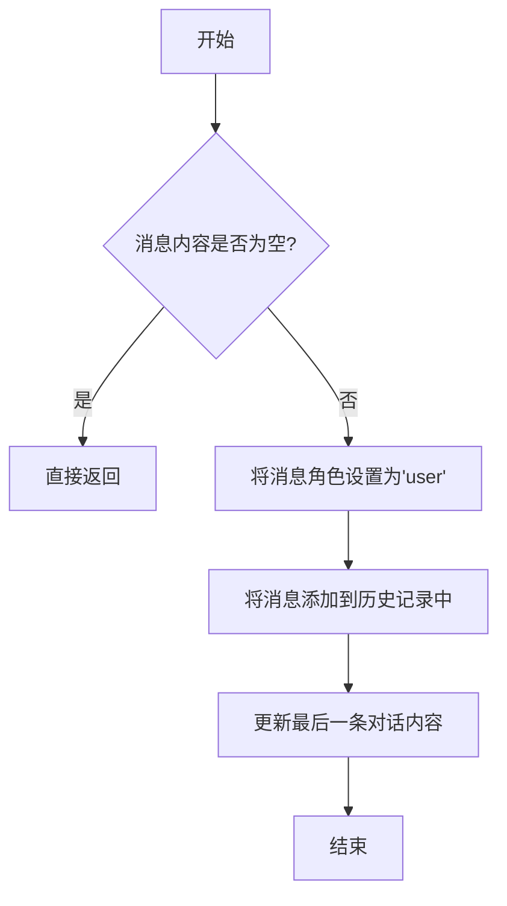

#### 带注释源码

```python
def add_talk(self, msg: Message):
    """
    添加用户对话消息到记忆历史中。
    
    参数:
        msg (Message): 用户对话消息对象。
    """
    if not msg.content:  # 如果消息内容为空，直接返回
        return
    msg.role = "user"  # 设置消息角色为用户
    self.history.append(msg)  # 将消息添加到历史记录列表
    self.last_talk = msg.content  # 更新最后一条对话内容
```

### `BrainMemory.add_answer`

该方法用于向大脑记忆中添加一个回答消息，并将其添加到历史记录中。

参数：

- `msg`：`Message`，包含回答内容的消息对象

返回值：`None`，无返回值

#### 流程图

```mermaid
graph TD
    A[开始] --> B[接收Message参数msg]
    B --> C{检查msg.content是否以'[ANSWER]:'开头}
    C -- 是 --> D[直接使用msg.content]
    C -- 否 --> E[为msg.content添加'[ANSWER]:'前缀]
    E --> D
    D --> F[将msg的role设置为'assistant']
    F --> G[将msg添加到history列表中]
    G --> H[结束]
```

#### 带注释源码

```python
def add_answer(self, msg: Message):
    """
    向大脑记忆中添加一个回答消息。

    该方法接收一个Message对象，确保其内容以'[ANSWER]:'为前缀，
    然后将消息角色设置为'assistant'，并添加到历史记录列表中。

    参数:
        msg (Message): 包含回答内容的消息对象

    返回:
        None
    """
    # 检查消息内容是否以'[ANSWER]:'开头，如果不是则添加此前缀
    if not msg.content.startswith("[ANSWER]:"):
        msg.content = f"[ANSWER]:{msg.content}"
    
    # 设置消息角色为'assistant'，表示这是助手的回答
    msg.role = "assistant"
    
    # 将消息添加到历史记录列表中
    self.history.append(msg)
```

### `BrainMemory.dumps`

该方法用于将`BrainMemory`实例的当前状态（包括历史对话记录、历史摘要等）序列化并持久化存储到Redis中。它通过异步操作将内存数据转换为JSON格式，并使用Redis客户端保存到指定的键下。

参数：

- `redis_key`：`str`，用于在Redis中存储数据的键名

返回值：`None`，无返回值

#### 流程图

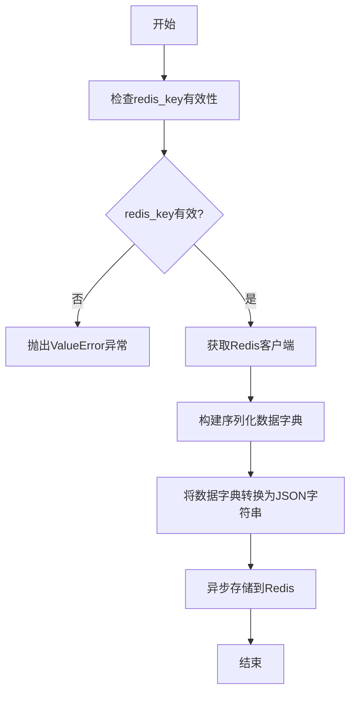

#### 带注释源码

```python
async def dumps(self, redis_key: str):
    """
    将BrainMemory实例序列化并存储到Redis
    
    Args:
        redis_key: Redis存储键名
        
    Raises:
        ValueError: 当redis_key为空或无效时
    """
    # 检查redis_key的有效性
    if not redis_key:
        raise ValueError("redis_key is required")
    
    # 获取Redis客户端实例
    redis_client = self.redis_client
    
    # 构建要序列化的数据字典
    data = {
        "history": [msg.dict() for msg in self.history],  # 历史消息列表
        "historical_summary": self.historical_summary,     # 历史摘要
        "last_talk": self.last_talk,                       # 最后对话内容
        "talk_count": self.talk_count,                     # 对话计数
        "answer_count": self.answer_count                  # 回答计数
    }
    
    # 将数据转换为JSON字符串
    json_data = json.dumps(data, ensure_ascii=False)
    
    # 异步存储到Redis
    await redis_client.set(redis_key, json_data, ex=self.redis_expire_time)
```

### `BrainMemory.loads`

从Redis中加载并反序列化一个BrainMemory实例。

参数：

- `redis_key`：`str`，用于从Redis中检索数据的键

返回值：`BrainMemory`，反序列化后的BrainMemory实例

#### 流程图

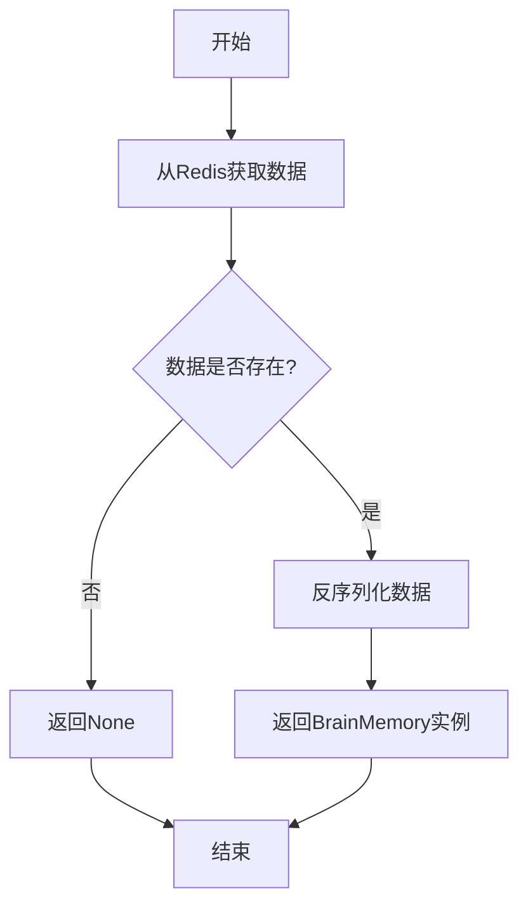

#### 带注释源码

```python
@classmethod
async def loads(cls, redis_key: str) -> "BrainMemory":
    """
    从Redis中加载并反序列化一个BrainMemory实例。
    
    Args:
        redis_key (str): 用于从Redis中检索数据的键
    
    Returns:
        BrainMemory: 反序列化后的BrainMemory实例，如果键不存在则返回None
    """
    # 从Redis中获取序列化数据
    data = await redis.get(redis_key)
    if not data:
        # 如果数据不存在，返回None
        return None
    
    # 反序列化数据为BrainMemory实例
    memory = cls.deserialize(data)
    return memory
```

### `BrainMemory.to_redis_key`

该方法用于生成一个唯一的Redis键，用于存储或检索与特定用户和聊天会话相关的记忆数据。

参数：

- `self`：`BrainMemory`，当前BrainMemory实例（类方法，通常为隐式参数）
- `namespace`：`str`，命名空间，用于区分不同的应用或环境
- `user_id`：`str`，用户标识符，用于区分不同用户
- `chat_id`：`str`，聊天会话标识符，用于区分同一用户的不同会话

返回值：`str`，生成的Redis键字符串，格式为`{namespace}:{user_id}:{chat_id}`

#### 流程图

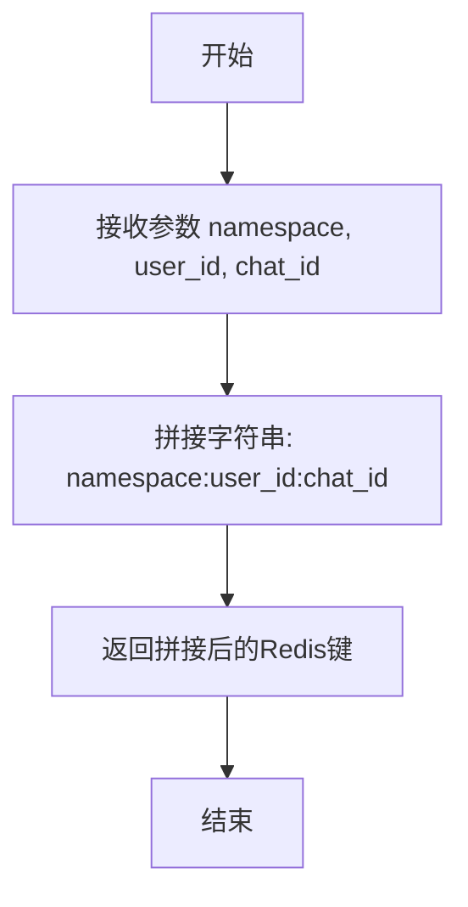

#### 带注释源码

```python
@classmethod
def to_redis_key(cls, namespace: str, user_id: str, chat_id: str) -> str:
    """
    生成一个唯一的Redis键，用于存储或检索与特定用户和聊天会话相关的记忆数据。
    
    参数:
        namespace (str): 命名空间，用于区分不同的应用或环境。
        user_id (str): 用户标识符，用于区分不同用户。
        chat_id (str): 聊天会话标识符，用于区分同一用户的不同会话。
    
    返回:
        str: 生成的Redis键字符串，格式为 {namespace}:{user_id}:{chat_id}。
    """
    return f"{namespace}:{user_id}:{chat_id}"
```

### `BrainMemory.exists`

该方法用于检查给定的文本内容是否存在于大脑记忆的历史记录中。它会遍历历史记录中的每个消息，提取消息内容中的标签和值，然后判断是否存在与给定文本匹配的内容。

参数：

- `text`：`str`，需要检查的文本内容

返回值：`bool`，如果文本内容存在于历史记录中则返回 `True`，否则返回 `False`

#### 流程图

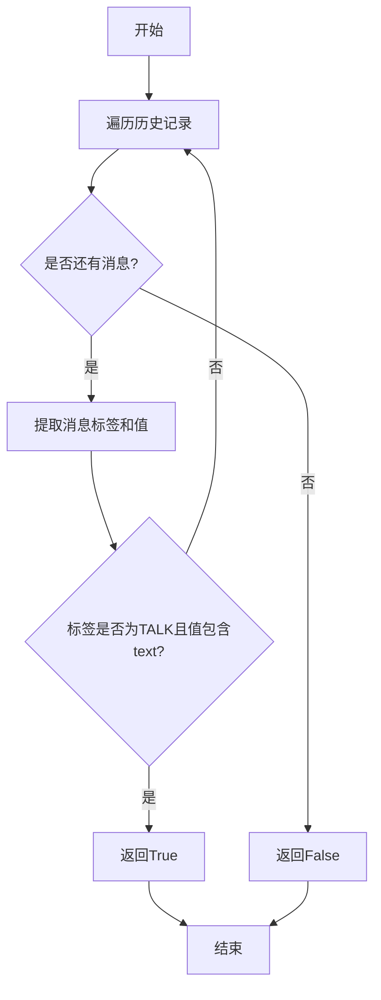

#### 带注释源码

```python
def exists(self, text: str) -> bool:
    """
    检查给定的文本是否存在于历史记录中。
    
    遍历历史记录中的每个消息，提取消息内容中的标签和值，
    然后判断是否存在标签为"TALK"且值包含给定文本的内容。
    
    Args:
        text (str): 需要检查的文本内容
        
    Returns:
        bool: 如果文本内容存在于历史记录中则返回True，否则返回False
    """
    for m in self.history:
        # 提取消息内容中的标签和值
        tag, val = self.extract_info(m.content)
        # 检查标签是否为"TALK"且值包含给定的文本
        if tag == "TALK" and text in val:
            return True
    return False
```

### `BrainMemory.to_int`

该方法将给定的字符串转换为整数，如果转换失败则返回指定的默认值。

参数：

- `value`：`str`，需要转换为整数的字符串
- `default`：`int`，转换失败时返回的默认值

返回值：`int`，转换后的整数或默认值

#### 流程图

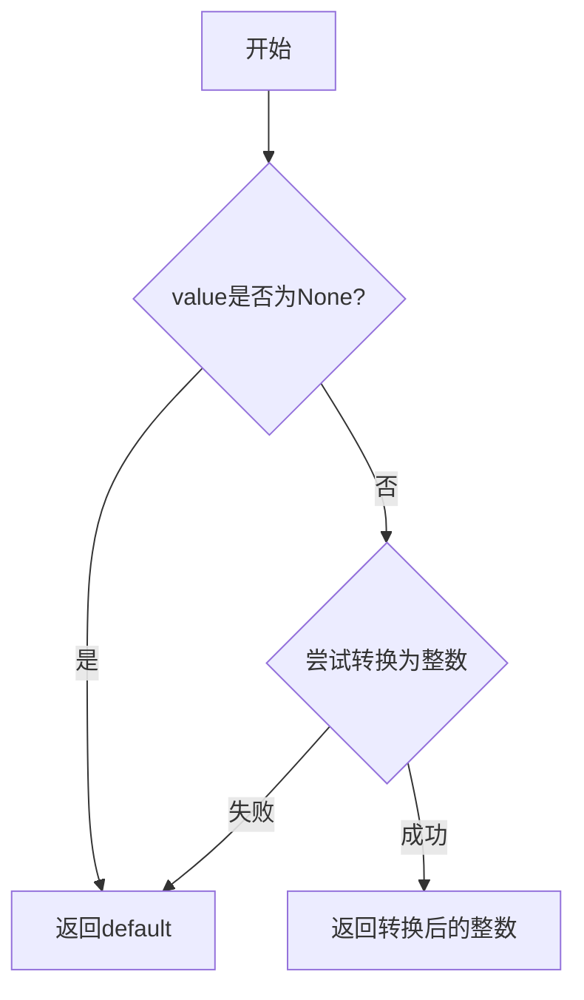

#### 带注释源码

```python
@staticmethod
def to_int(value: str, default: int = 0) -> int:
    """
    将字符串转换为整数，如果转换失败则返回默认值。
    
    Args:
        value (str): 需要转换的字符串
        default (int): 转换失败时返回的默认值，默认为0
    
    Returns:
        int: 转换后的整数或默认值
    """
    if value is None:
        # 如果输入为None，直接返回默认值
        return default
    try:
        # 尝试将字符串转换为整数
        return int(value)
    except (ValueError, TypeError):
        # 转换失败时返回默认值
        return default
```

### `BrainMemory.pop_last_talk`

该方法用于弹出并返回`BrainMemory`实例中存储的最后一次对话内容（`last_talk`字段的值），并在弹出后将`last_talk`字段置为`None`。

参数：
- 无

返回值：`str`，返回被弹出的最后一次对话内容字符串。

#### 流程图

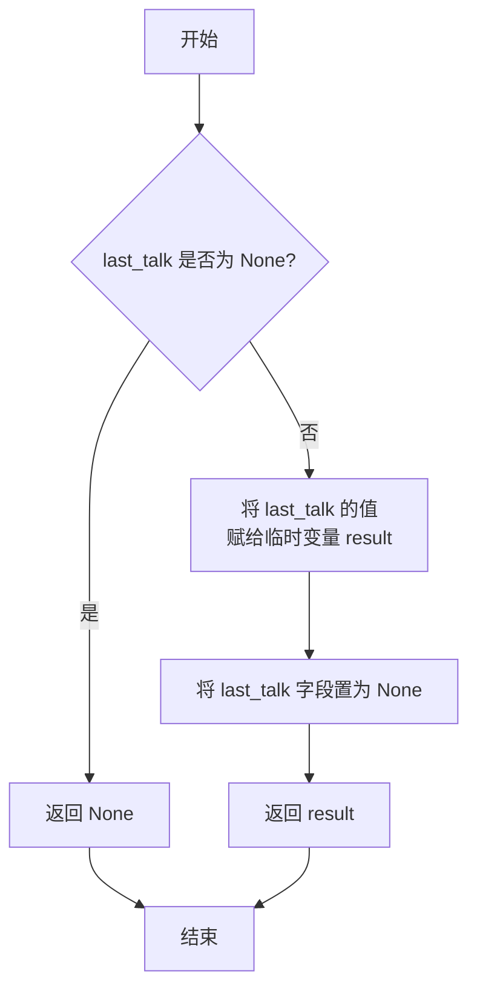

#### 带注释源码

```python
def pop_last_talk(self) -> str:
    """
    弹出并返回最后一次对话内容。
    此操作会将内部的 last_talk 字段置为 None。
    Returns:
        str: 最后一次对话的内容。如果之前没有设置，则返回 None。
    """
    # 获取当前 last_talk 的值
    result = self.last_talk
    # 将 last_talk 字段重置为 None
    self.last_talk = None
    # 返回之前存储的值
    return result
```

### `BrainMemory.is_history_available`

这是一个只读属性，用于检查`BrainMemory`实例中是否存在可用的历史对话记录。它通过检查`history`列表是否非空来判断是否有历史记录。

参数：无

返回值：`bool`，如果`history`列表不为空则返回`True`，否则返回`False`

#### 流程图

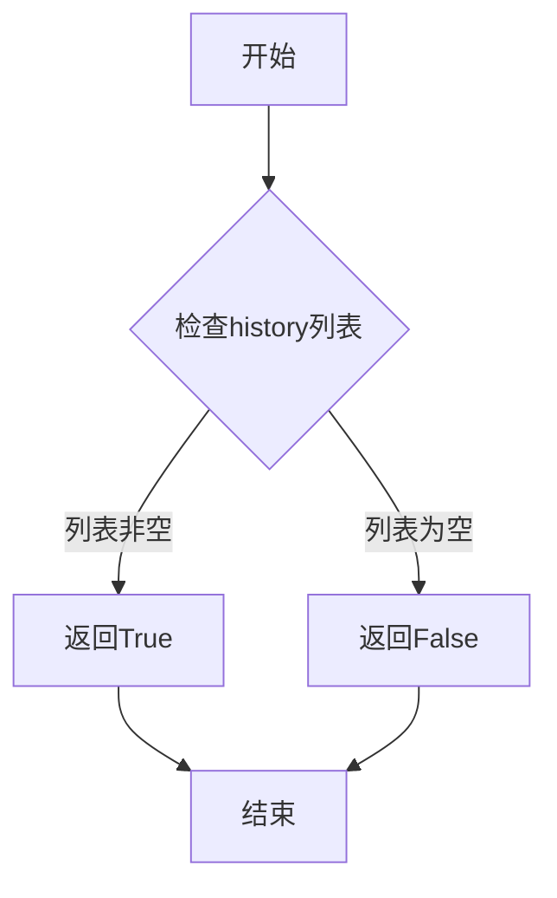

#### 带注释源码

```python
@property
def is_history_available(self):
    """检查是否有可用的历史对话记录
    
    通过检查history列表是否非空来判断是否存在历史记录
    
    Returns:
        bool: 如果history列表不为空则返回True，否则返回False
    """
    return bool(self.history)  # 将history列表转换为布尔值，非空列表为True，空列表为False
```

### `BrainMemory.history_text`

`BrainMemory.history_text` 是一个属性（property），用于获取对话历史记录的文本表示。它将存储在 `history` 列表中的所有 `Message` 对象的内容（content）连接成一个字符串，每个消息内容之间用换行符分隔。如果 `history` 列表为空，则返回空字符串。

参数：无

返回值：`str`，返回一个字符串，其中包含所有历史消息的内容，每个消息内容之间用换行符分隔。

#### 流程图

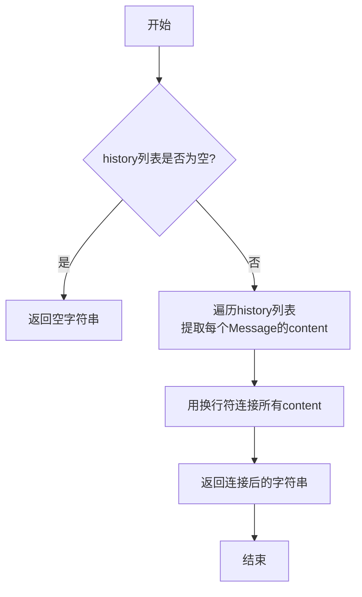

#### 带注释源码

```python
@property
def history_text(self) -> str:
    """
    获取对话历史记录的文本表示。
    将history列表中所有Message对象的内容用换行符连接成一个字符串。
    如果history列表为空，则返回空字符串。
    """
    # 使用列表推导式从每个Message对象中提取content字段
    # 然后用换行符'\n'连接所有内容，形成最终的文本字符串
    return "\n".join([i.content for i in self.history])
```

### `BrainMemory.extract_info`

该方法用于从输入字符串中提取标签和值。它通过正则表达式匹配形如`[TAG]:value`格式的字符串，如果匹配成功则返回标签和值；否则返回`None`和原始输入字符串。

参数：

- `input`：`str`，输入的字符串，可能包含标签和值

返回值：`tuple`，包含两个元素的元组，第一个元素是标签（`str`或`None`），第二个元素是值（`str`）

#### 流程图

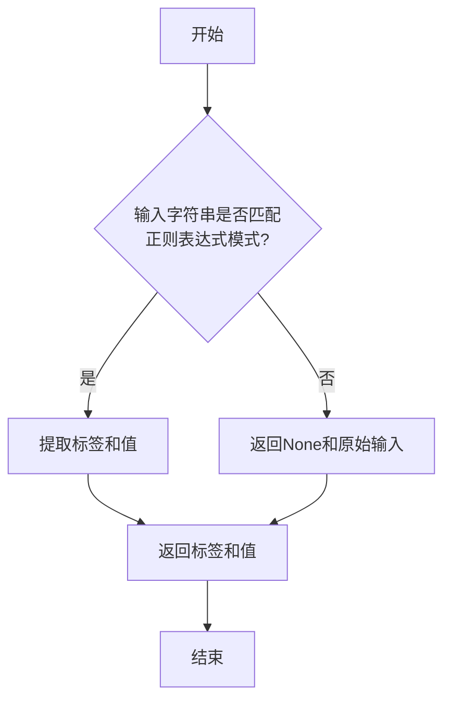

#### 带注释源码

```python
@staticmethod
def extract_info(input: str) -> tuple:
    """
    从输入字符串中提取标签和值。
    如果输入字符串匹配正则表达式模式'\\[(.*?)\\]:\\s*(.*)'，则返回标签和值；
    否则返回None和原始输入字符串。

    Args:
        input (str): 输入的字符串，可能包含标签和值

    Returns:
        tuple: 包含两个元素的元组，第一个元素是标签（str或None），第二个元素是值（str）
    """
    # 定义正则表达式模式，用于匹配形如'[TAG]:value'的字符串
    pattern = r'\[(.*?)\]:\s*(.*)'
    # 尝试匹配输入字符串
    match = re.match(pattern, input)
    if match:
        # 如果匹配成功，提取标签和值
        tag = match.group(1)  # 第一个捕获组是标签
        value = match.group(2)  # 第二个捕获组是值
        return tag, value
    else:
        # 如果匹配失败，返回None和原始输入字符串
        return None, input
```

### `BrainMemory.is_related`

该方法用于判断两个给定的句子或概念（`sentence1` 和 `sentence2`）在语义上是否相关。它通过调用大型语言模型（LLM）来评估两个输入之间的相关性，并返回一个布尔值表示它们是否相关。

参数：

- `sentence1`：`str`，第一个句子或概念，用于与第二个句子进行相关性比较。
- `sentence2`：`str`，第二个句子或概念，用于与第一个句子进行相关性比较。
- `llm`：`LLM`，大型语言模型实例，用于执行相关性判断的推理任务。

返回值：`bool`，如果两个句子在语义上相关则返回 `True`，否则返回 `False`。

#### 流程图

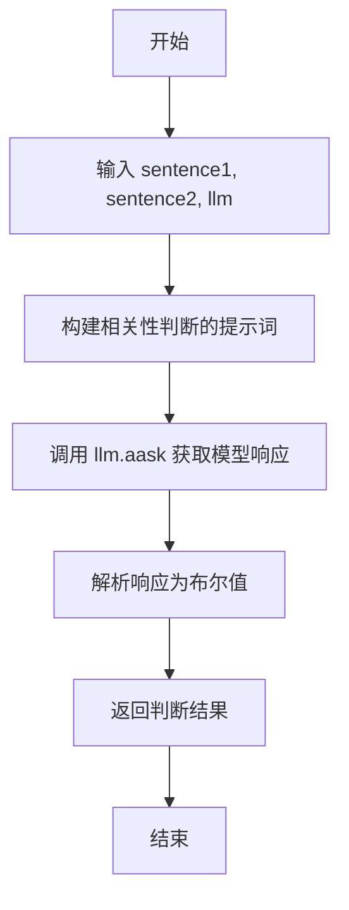

#### 带注释源码

```python
async def is_related(self, sentence1: str, sentence2: str, llm: LLM) -> bool:
    """
    判断两个句子是否相关。
    
    该方法通过向大型语言模型提问，判断两个输入句子在语义上是否相关。
    模型需要返回 'YES' 或 'NO' 来指示相关性。
    
    Args:
        sentence1 (str): 第一个句子。
        sentence2 (str): 第二个句子。
        llm (LLM): 大型语言模型实例。
    
    Returns:
        bool: 如果相关返回 True，否则返回 False。
    """
    # 构建提示词，要求模型判断两个句子是否相关
    prompt = f"Are the following two sentences related? Answer with YES or NO.\nSentence 1: {sentence1}\nSentence 2: {sentence2}"
    
    # 调用语言模型获取响应
    rsp = await llm.aask(prompt)
    
    # 解析响应，如果包含 'YES' 则返回 True，否则返回 False
    return "YES" in rsp
```

### `BrainMemory.rewrite`

该方法基于给定的上下文和LLM模型，对输入的句子进行重写，使其更符合历史对话的语境和风格。

参数：

- `sentence`：`str`，需要重写的原始句子
- `context`：`str`，重写时参考的上下文信息
- `llm`：`LLM`，用于执行重写任务的大语言模型实例

返回值：`str`，重写后的句子

#### 流程图

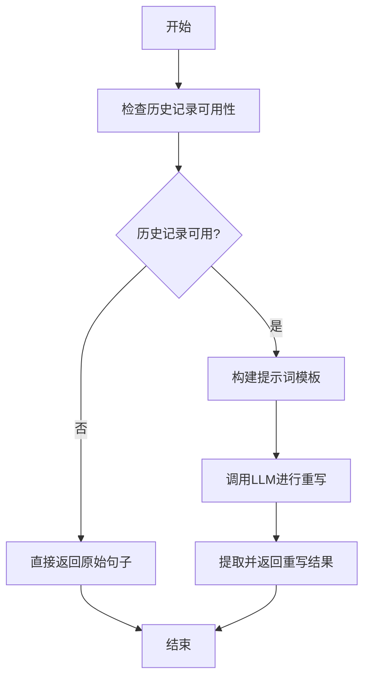

#### 带注释源码

```python
async def rewrite(self, sentence: str, context: str, llm: LLM) -> str:
    """
    基于历史对话记录重写输入句子
    
    该方法会结合BrainMemory中存储的历史对话记录，使用LLM模型
    将输入句子重写为更符合对话语境和风格的表达方式
    
    Args:
        sentence: 需要重写的原始句子
        context: 重写时参考的上下文信息
        llm: 用于执行重写任务的大语言模型实例
        
    Returns:
        重写后的句子。如果历史记录不可用，则直接返回原始句子
    """
    # 检查历史记录是否可用
    if not self.is_history_available:
        return sentence
    
    # 构建重写提示词
    prompt = f"""
    基于以下历史对话记录，将给定的句子重写为更自然、符合对话语境的表达方式。
    
    历史对话记录：
    {self.history_text}
    
    上下文信息：
    {context}
    
    需要重写的句子：
    {sentence}
    
    请只返回重写后的句子，不要添加任何解释或额外内容。
    """
    
    # 调用LLM进行重写
    rewritten = await llm.aask(prompt)
    
    # 清理并返回结果
    return rewritten.strip()
```

### `BrainMemory.summarize`

该方法使用大语言模型（LLM）对当前记忆（`history` 和 `historical_summary`）中的对话历史进行总结，生成一个简洁的摘要文本，并更新 `historical_summary` 字段。

参数：

- `llm`：`LLM`，用于执行总结任务的大语言模型实例。

返回值：`str`，返回生成的摘要文本。

#### 流程图

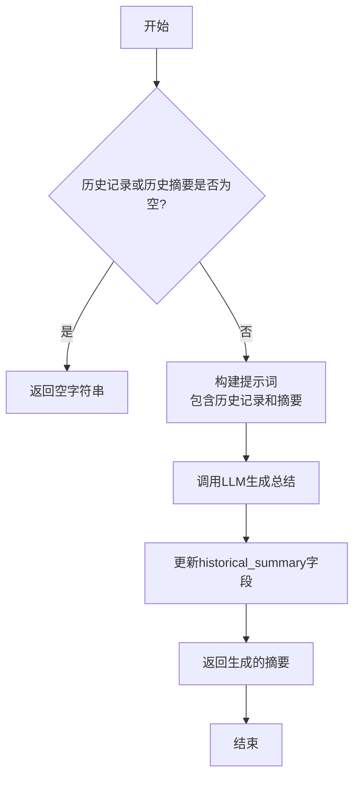

#### 带注释源码

```python
async def summarize(self, llm: LLM) -> str:
    """
    使用LLM总结历史对话和已有的历史摘要。
    如果历史记录和历史摘要都为空，则返回空字符串。
    否则，将历史记录和现有摘要组合成提示，发送给LLM生成新的摘要，
    并更新`self.historical_summary`。
    
    Args:
        llm (LLM): 用于生成摘要的大语言模型实例。
    
    Returns:
        str: 生成的摘要文本。
    """
    # 检查是否有历史记录或历史摘要可供总结
    if not self.history and not self.historical_summary:
        return ""
    
    # 构建提示词，将历史对话和现有摘要作为上下文
    prompt = f"Please summarize the following conversation and existing summary:\n\n"
    if self.history:
        # 将历史消息格式化为文本
        prompt += "Conversation History:\n"
        for msg in self.history:
            prompt += f"{msg.role}: {msg.content}\n"
    if self.historical_summary:
        # 添加现有的历史摘要
        prompt += f"\nExisting Summary:\n{self.historical_summary}\n"
    prompt += "\nSummary:"
    
    # 调用LLM生成总结
    summary = await llm.aask(prompt)
    
    # 更新实例的历史摘要字段
    self.historical_summary = summary
    
    # 返回生成的摘要
    return summary
```

### `BrainMemory.get_title`

该方法使用LLM从对话历史或历史摘要中生成一个简洁的标题。

参数：

- `llm`：`LLM`，用于生成标题的语言模型实例

返回值：`str`，生成的标题字符串

#### 流程图

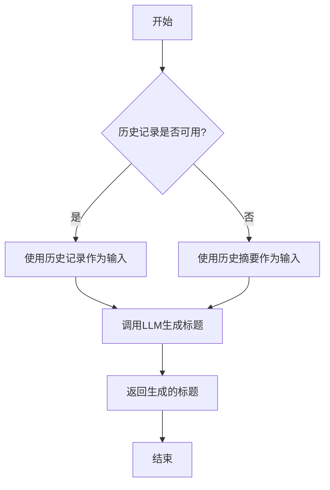

#### 带注释源码

```python
async def get_title(self, llm: LLM) -> str:
    """
    使用LLM从对话历史或历史摘要中生成一个简洁的标题。
    
    Args:
        llm (LLM): 用于生成标题的语言模型实例
        
    Returns:
        str: 生成的标题字符串
    """
    # 检查历史记录是否可用，如果可用则使用历史记录，否则使用历史摘要
    input_ = self.history_text if self.is_history_available else self.historical_summary
    
    # 构建提示词，要求LLM基于输入内容生成一个简洁的标题
    prompt = f"Write a title for the following content, title should be less than 6 words:\n\n{input_}"
    
    # 调用LLM生成标题
    rsp = await llm.aask(prompt)
    
    # 返回生成的标题
    return rsp
```

## 关键组件


### BrainMemory 类

BrainMemory 类是核心的记忆管理组件，负责存储对话历史、提供对话内容的增删改查、支持与外部存储（如Redis）的序列化/反序列化交互，并集成了基于LLM的高级记忆处理功能，如相关性判断、内容重写、摘要生成和标题提取。

### 张量索引与惰性加载

代码中未显式实现张量数据结构或惰性加载机制。所有对话历史（`history` 列表）和摘要（`historical_summary`）在内存中直接加载和操作。

### 反量化支持

代码中未涉及任何量化或反量化操作。所有数据（如对话内容）均以字符串或Message对象的形式存储和处理。

### 量化策略

代码中未涉及任何模型权重量化或推理优化策略。与LLM的交互通过抽象的 `LLM` 类完成，未指定或实现具体的量化策略。


## 问题及建议


### 已知问题

-   **测试数据硬编码与耦合**：测试用例中直接使用了 `LLM()` 实例，这依赖于外部服务（如 OpenAI API）的可用性和网络连接。如果 API 不可用或网络中断，测试将失败，导致测试的稳定性和可重复性差。
-   **测试断言过于宽泛**：部分断言（如 `assert res`）仅检查返回值是否为真，没有验证返回值的具体内容或格式，可能导致测试覆盖不足，无法有效捕获逻辑错误。
-   **潜在的资源泄漏**：测试中创建了 `BrainMemory` 实例并可能调用 `dumps` 方法，但未展示或验证其对应的清理或资源释放逻辑（如 Redis 连接管理），在集成测试中可能存在资源未正确释放的风险。
-   **测试覆盖不完整**：测试主要验证了正常流程，但对于边界条件（如空历史记录、超长内容、`extract_info` 处理非法输入等）和异常情况（如 `loads` 时 `redis_key` 不存在）缺乏测试用例。
-   **性能测试缺失**：`test_memory_llm` 中循环添加了500条消息，但未对 `summarize`、`rewrite` 等可能涉及大语言模型（LLM）调用的方法的性能或耗时进行断言，难以评估其在实际负载下的表现。

### 优化建议

-   **使用 Mock 或 Fixture 解耦外部依赖**：在测试 `BrainMemory` 与 LLM 交互的方法时，应使用 `unittest.mock` 或 `pytest-mock` 来模拟 `LLM` 实例及其异步方法（如 `aask`），返回预设的、确定性的结果。这可以消除对网络和外部 API 的依赖，使测试更快、更稳定、可离线运行。
-   **增强断言的具体性**：将宽泛的断言（如 `assert res`）替换为更具体的检查，例如验证返回的字符串是否包含特定关键词、长度是否在预期范围内、或是否符合特定的数据结构。对于 `extract_info` 的测试，可以增加更多边界和异常输入的用例。
-     **明确资源管理**：在测试中，如果 `dumps` 方法涉及外部存储（如 Redis），应考虑在测试 setup/teardown 阶段或使用 `pytest.fixture` 来管理测试数据的生命周期，确保每个测试用例运行前后环境是干净的，避免测试间相互干扰。
-   **补充边界和异常测试**：增加测试用例以覆盖更多场景，例如：测试 `add_talk`/`add_answer` 传入 `None` 或空 `Message` 时的行为；测试 `to_int` 方法处理非数字字符串时的回退机制；测试 `loads` 方法在传入无效 `redis_key` 时的异常处理或返回值。
-   **引入性能基准测试**：对于 `summarize`、`rewrite` 等可能成为性能瓶颈的方法，可以考虑使用 `pytest-benchmark` 等工具添加基准测试，监控其执行时间随输入数据量增长的变化趋势，为性能优化提供数据支持。
-   **分离单元测试与集成测试**：将依赖于真实 `LLM` 或 `Redis` 的测试标记为集成测试，并与纯逻辑的单元测试分开运行。这可以通过不同的 `pytest` 标记（如 `@pytest.mark.integration`）来实现，确保核心逻辑的单元测试可以快速、独立地执行。


## 其它


### 设计目标与约束

该代码是一个针对 `BrainMemory` 类的单元测试文件。其设计目标是验证 `BrainMemory` 类的核心功能，包括对话历史管理、信息提取、持久化存储以及与LLM（大语言模型）的交互能力。约束条件包括：1) 测试必须覆盖异步方法；2) 测试数据需模拟真实使用场景（如添加大量对话）；3) 测试应独立，不依赖外部服务（如Redis）的实际可用性，`dumps`和`loads`方法可能使用模拟或测试配置；4) 测试需验证边界条件（如信息提取的格式处理）。

### 错误处理与异常设计

测试代码本身主要使用 `assert` 语句进行验证，并未显式测试 `BrainMemory` 类的错误处理机制。从测试用例推断，被测类 `BrainMemory` 可能包含以下隐式设计：1) `to_int` 方法在转换失败时返回默认值；2) `extract_info` 方法对不符合 `[TAG]:value` 格式的输入应能安全处理，返回 `(None, input)`；3) 异步方法如 `dumps`, `loads`, `is_related` 等在遇到网络或服务错误时应抛出异常，但当前测试未覆盖这些异常场景。测试文件未包含 try-catch 块，依赖 pytest 捕获并报告断言失败。

### 数据流与状态机

测试展示了 `BrainMemory` 实例的核心数据流：1) **初始化**：创建空内存实例。2) **状态累积**：通过 `add_talk` 和 `add_answer` 向 `history` 列表添加 `Message` 对象，改变实例状态。3) **状态查询与转换**：调用 `exists`, `is_history_available`, `history_text` 等属性或方法查询当前状态；`pop_last_talk` 方法会读取并清除 `last_talk` 状态。4) **状态持久化循环**：`dumps` 将当前状态（可能包括 `history`）序列化并存储到外部系统（如Redis），`loads` 则从外部系统恢复状态，构成一个完整的“保存-加载”数据流。5) **LLM增强处理流**：在拥有足够历史数据（`history`）后，可以调用 `summarize`, `get_title`, `rewrite`, `is_related` 等方法，将内部状态（历史文本）作为上下文发送给LLM，并将LLM返回的结果作为新的输出或更新内部状态（如`historical_summary`）。

### 外部依赖与接口契约

1.  **LLM 接口**：测试通过 `@pytest.mark.parametrize("llm", [LLM()])` 注入 `LLM` 实例。这要求 `LLM` 类提供一个可用的接口，其异步方法（如 `aask`）能被 `BrainMemory` 的 `summarize`, `get_title` 等方法调用。测试假设该LLM实例在测试环境下能正常工作并返回合理结果。
2.  **Redis/存储接口**：`BrainMemory.to_redis_key` 和 `BrainMemory` 实例的 `dumps`、`loads` 方法暗示了对外部键值存储系统（如Redis）的依赖。接口契约是：`to_redis_key` 生成一个唯一键，`dumps` 方法使用该键存储数据，`loads` 方法使用相同的键来检索并反序列化数据。测试中此依赖可能被模拟或依赖于一个为测试配置的轻量级/内存存储。
3.  **Pytest 框架**：测试文件完全依赖于 Pytest 框架来组织测试用例（`@pytest.mark.asyncio`, `@pytest.mark.parametrize`）、运行测试（`pytest.main`）和提供断言机制。
4.  **Message 类**：来自 `metagpt.schema`，作为 `add_talk` 和 `add_answer` 方法的参数，是构成 `history` 列表的基本数据单元。契约是 `Message` 对象至少包含 `content` 和 `role` 属性。

    