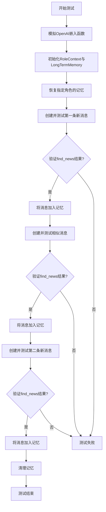
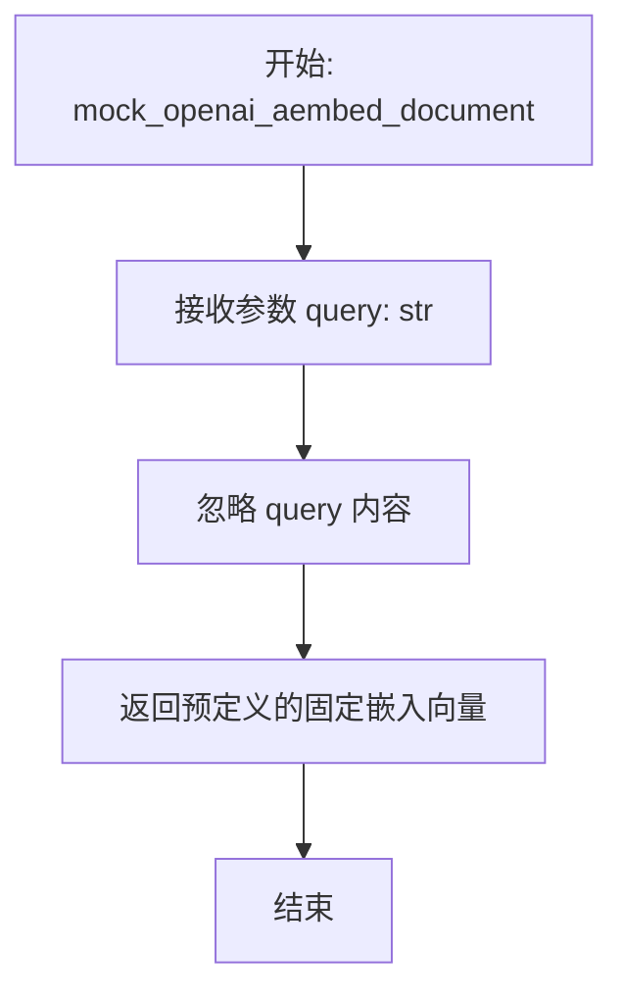
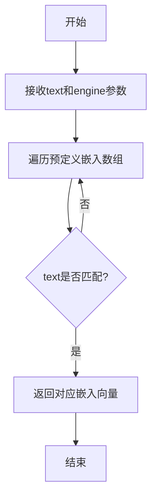
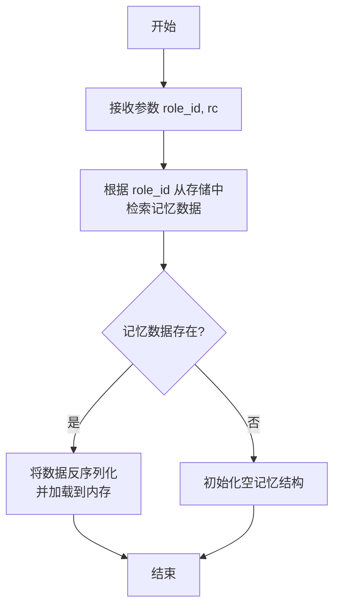
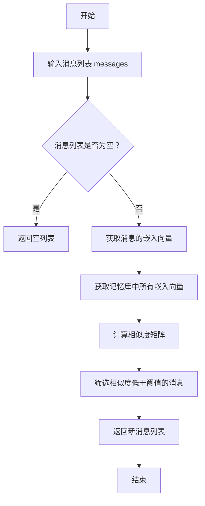
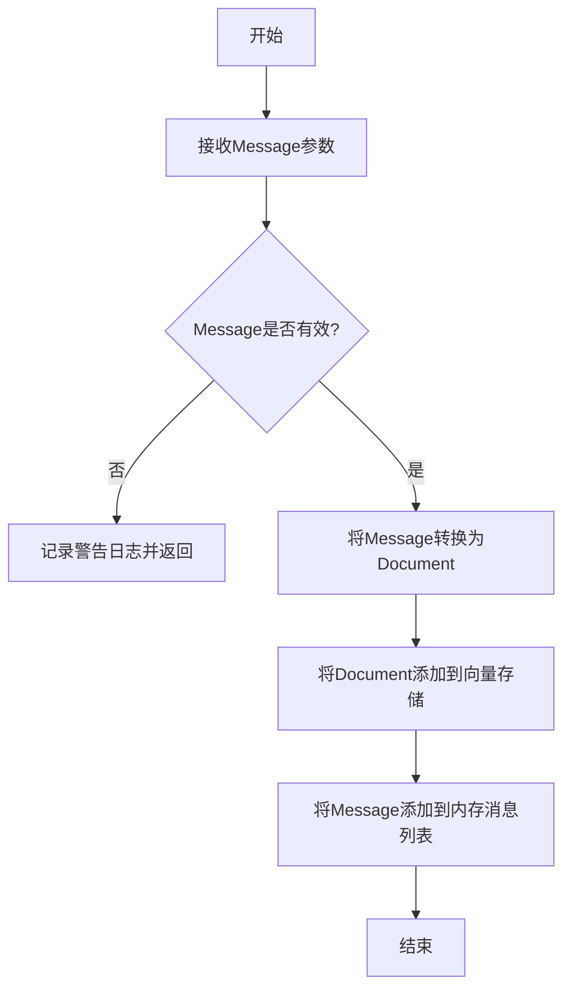
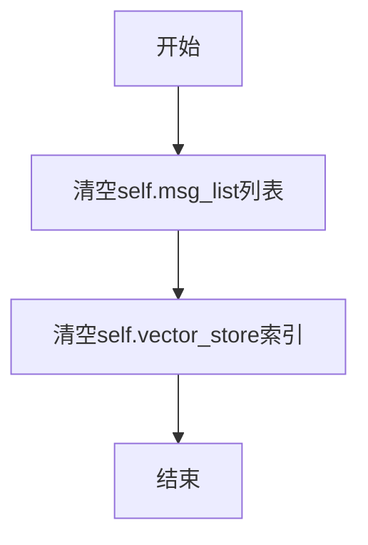

# `.\MetaGPT\tests\metagpt\memory\test_longterm_memory.py` 详细设计文档

该文件是 `LongTermMemory` 类的单元测试，用于验证其核心功能：基于向量相似度搜索，判断新消息相对于历史记忆是否为“新闻”（即内容不相似），并能正确地将消息添加到记忆中。测试通过模拟嵌入生成来隔离外部依赖。

## 整体流程

```mermaid
graph TD
    A[开始测试] --> B[模拟OpenAI Embedding API]
    B --> C[初始化LongTermMemory与RoleContext]
    C --> D[创建第一条消息M1]
    D --> E{调用ltm.find_news([M1])}
    E --> F[断言结果为1（是新消息）]
    F --> G[调用ltm.add(M1)存入记忆]
    G --> H[创建与M1相似的消息M2]
    H --> I{调用ltm.find_news([M2])}
    I --> J[断言结果为0（不是新消息）]
    J --> K[调用ltm.add(M2)存入记忆]
    K --> L[创建与M1/M2不相似的消息M3]
    L --> M{调用ltm.find_news([M3])}
    M --> N[断言结果为1（是新消息）]
    N --> O[调用ltm.add(M3)存入记忆]
    O --> P[调用ltm.clear()清理]
    P --> Q[测试结束]
```

## 类结构

```
测试文件结构
├── 全局导入 (pytest, 被测模块等)
├── 全局测试函数 test_ltm_search
└── 主程序入口 (if __name__ == '__main__')
```

## 全局变量及字段


### `role_id`
    
角色标识符，用于标识测试中的角色实例

类型：`str`
    


### `rc`
    
角色上下文对象，包含角色关注的动作类型

类型：`RoleContext`
    


### `ltm`
    
长期记忆对象，用于测试记忆的存储和检索功能

类型：`LongTermMemory`
    


### `idea`
    
初始需求文本，用于创建第一个消息对象

类型：`str`
    


### `message`
    
第一个消息对象，包含用户需求和触发动作

类型：`Message`
    


### `news`
    
从长期记忆中检索到的新消息列表

类型：`List[Message]`
    


### `sim_idea`
    
相似需求文本，用于测试记忆去重功能

类型：`str`
    


### `sim_message`
    
相似消息对象，用于验证重复检测

类型：`Message`
    


### `new_idea`
    
新需求文本，用于测试对新内容的识别

类型：`str`
    


### `new_message`
    
新消息对象，用于验证新内容的添加

类型：`Message`
    


### `RoleContext.watch`
    
角色关注的行动类型集合，用于过滤相关消息

类型：`Set[str]`
    


### `Message.role`
    
消息发送者的角色标识，如'User'或'Assistant'

类型：`str`
    


### `Message.content`
    
消息的文本内容，包含具体需求或信息

类型：`str`
    


### `Message.cause_by`
    
触发该消息的动作类型，用于追踪消息来源

类型：`Type[Action]`
    
    

## 全局函数及方法

### `test_ltm_search`

这是一个针对 `LongTermMemory` 类的 `find_news` 方法的异步单元测试。它通过模拟 OpenAI 嵌入服务，测试长时记忆模块在添加和检索消息时，能否正确识别新消息（与已有记忆不相似）和旧消息（与已有记忆相似）。

参数：

- `mocker`：`pytest_mock.plugin.MockerFixture`，pytest-mock 插件提供的模拟对象，用于在测试中替换（mock）外部依赖。

返回值：`None`，这是一个测试函数，其主要目的是通过断言（assert）验证功能，不返回业务值。

#### 流程图



#### 带注释源码

```python
@pytest.mark.asyncio  # 标记此函数为异步测试函数
async def test_ltm_search(mocker):
    # 1. 模拟（Mock）外部依赖：将llama_index中OpenAIEmbedding类的几个关键嵌入方法替换为本地模拟函数。
    #    这些模拟函数返回预定义的嵌入向量，使测试不依赖于真实的OpenAI API和网络。
    mocker.patch("llama_index.embeddings.openai.base.OpenAIEmbedding._get_text_embeddings", mock_openai_embed_documents)
    mocker.patch("llama_index.embeddings.openai.base.OpenAIEmbedding._get_text_embedding", mock_openai_embed_document)
    mocker.patch("llama_index.embeddings.openai.base.OpenAIEmbedding._aget_query_embedding", mock_openai_aembed_document)

    # 2. 测试初始化：设置一个测试用的角色ID和角色上下文，然后创建并恢复该角色的长时记忆。
    role_id = "UTUserLtm(Product Manager)"
    rc = RoleContext(watch={"metagpt.actions.add_requirement.UserRequirement"})
    ltm = LongTermMemory()
    ltm.recover_memory(role_id, rc)  # 从存储中恢复或初始化该角色的记忆

    # 3. 测试用例1：添加一条全新的消息。
    #    从模拟数据中获取第一条文本，创建Message对象。
    idea = text_embed_arr[0].get("text", "Write a cli snake game")
    message = Message(role="User", content=idea, cause_by=UserRequirement)
    #    在添加前，使用`find_news`查找“新”消息。由于记忆为空，此消息应被识别为新消息。
    news = await ltm.find_news([message])
    assert len(news) == 1  # 断言：确实找到了一条新消息
    ltm.add(message)  # 将该消息正式加入长时记忆

    # 4. 测试用例2：添加一条与上一条语义相似的消息。
    #    从模拟数据中获取第二条文本（与第一条语义相似）。
    sim_idea = text_embed_arr[1].get("text", "Write a game of cli snake")
    sim_message = Message(role="User", content=sim_idea, cause_by=UserRequirement)
    #    再次调用`find_news`。由于上一条消息已存入记忆且语义相似，此消息应不被识别为新消息。
    news = await ltm.find_news([sim_message])
    assert len(news) == 0  # 断言：没有找到新消息（即相似度高于阈值，被过滤）
    ltm.add(sim_message)  # 尽管不是“新闻”，但仍将其加入记忆（实际场景可能取决于业务逻辑）

    # 5. 测试用例3：添加一条语义不同的新消息。
    #    从模拟数据中获取第三条文本（与前两条语义不同）。
    new_idea = text_embed_arr[2].get("text", "Write a 2048 web game")
    new_message = Message(role="User", content=new_idea, cause_by=UserRequirement)
    #    调用`find_news`。由于此消息与记忆中的消息语义不同，应被识别为新消息。
    news = await ltm.find_news([new_message])
    assert len(news) == 1  # 断言：找到了一条新消息
    ltm.add(new_message)  # 将这条新消息加入记忆

    # 6. 测试清理：清除本次测试创建的记忆数据，避免影响其他测试。
    ltm.clear()
```

### `mock_openai_aembed_document`

该函数是一个用于单元测试的模拟函数，旨在模拟 OpenAI 异步查询嵌入（`_aget_query_embedding`）方法的行为。它接收一个查询文本，并返回一个预定义的、固定的嵌入向量，从而在测试中替代真实的 OpenAI API 调用，确保测试的稳定性和可重复性。

参数：

- `query`：`str`，需要生成嵌入向量的查询文本。

返回值：`List[float]`，一个预定义的、固定的浮点数列表，模拟查询文本的嵌入向量。

#### 流程图



#### 带注释源码

```python
def mock_openai_aembed_document(query: str) -> List[float]:
    """
    模拟 OpenAI 异步查询嵌入方法。
    此函数用于单元测试，返回一个固定的嵌入向量，而不是实际调用 OpenAI API。
    
    参数:
        query (str): 查询文本。在此模拟函数中，该参数的内容被忽略。
    
    返回:
        List[float]: 一个预定义的、固定的嵌入向量。
    """
    # 返回一个预定义的固定嵌入向量，用于模拟查询嵌入。
    # 在实际的测试上下文中，这个向量通常与 `mock_openai_embed_document` 返回的相同，
    # 以确保嵌入空间的一致性。
    return [0.1, 0.2, 0.3, 0.4, 0.5]
```

### `mock_openai_embed_document`

这是一个用于单元测试的模拟函数，用于模拟 OpenAI 嵌入模型对单个文档生成嵌入向量的行为。它通过预定义的嵌入向量数组返回固定结果，避免在测试中调用真实的外部 API。

参数：

-  `text`：`str`，需要生成嵌入向量的文本内容
-  `engine`：`str`，使用的嵌入模型引擎名称

返回值：`list[float]`，返回文本对应的嵌入向量列表

#### 流程图



#### 带注释源码

```python
def mock_openai_embed_document(text: str, engine: str) -> list[float]:
    """
    模拟 OpenAI 嵌入模型对单个文档生成嵌入向量的函数
    
    该函数用于单元测试中替代真实的 OpenAI 嵌入调用，通过预定义的
    嵌入向量数组返回固定结果，避免测试时调用外部 API。
    
    Args:
        text (str): 需要生成嵌入向量的文本内容
        engine (str): 使用的嵌入模型引擎名称
    
    Returns:
        list[float]: 文本对应的嵌入向量列表
    
    Note:
        该函数会遍历预定义的 text_embed_arr 数组，查找与输入 text
        匹配的项，返回对应的嵌入向量。如果未找到匹配项，则返回空列表。
    """
    # 遍历预定义的嵌入向量数组
    for item in text_embed_arr:
        # 检查当前项的文本是否与输入文本匹配
        if item.get("text") == text:
            # 返回匹配项的嵌入向量
            return item.get("embedding", [])
    # 如果未找到匹配项，返回空列表
    return []
```

### `mock_openai_embed_documents`

这是一个用于单元测试的模拟函数，用于替代 OpenAI 嵌入模型批量生成文本嵌入向量的实际调用。它接收一个文本列表，并返回一个预定义的嵌入向量列表，用于在测试环境中模拟嵌入生成过程，避免依赖外部 API 并确保测试的确定性和可重复性。

参数：
- `texts`：`List[str]`，需要生成嵌入向量的文本字符串列表。

返回值：`List[List[float]]`，返回一个二维浮点数列表，其中每个子列表代表对应输入文本的模拟嵌入向量。

#### 流程图

```mermaid
flowchart TD
    A[开始: mock_openai_embed_documents(texts)] --> B{输入文本列表是否为空?}
    B -- 是 --> C[返回空列表]
    B -- 否 --> D[从预定义数组 text_embed_arr 中<br/>按顺序获取与 texts 数量相等的嵌入数据]
    D --> E[遍历获取到的嵌入数据]
    E --> F{当前数据是否为字典<br/>且包含 'embedding' 键?}
    F -- 是 --> G[将 'embedding' 值添加到结果列表]
    F -- 否 --> H[将空列表添加到结果列表]
    G --> I
    H --> I
    I{是否遍历完所有数据?}
    I -- 否 --> E
    I -- 是 --> J[返回结果列表]
    J --> K[结束]
```

#### 带注释源码

```python
def mock_openai_embed_documents(texts: List[str]) -> List[List[float]]:
    """
    模拟 OpenAI 的 embed_documents 方法。
    根据输入的文本列表，返回一个预定义的嵌入向量列表。
    用于单元测试，以避免调用真实的 OpenAI API。

    Args:
        texts (List[str]): 需要生成嵌入向量的文本列表。

    Returns:
        List[List[float]]: 模拟生成的嵌入向量列表，每个向量对应一个输入文本。
                           如果预定义数据不足，则返回空列表。
    """
    # 如果输入文本列表为空，直接返回空列表
    if not texts:
        return []
    
    # 从预定义的全局变量 `text_embed_arr` 中截取与输入文本数量相等的部分。
    # `text_embed_arr` 是一个包含字典的列表，每个字典应有 'embedding' 键，其值为嵌入向量。
    embeds = text_embed_arr[:len(texts)]
    
    # 使用列表推导式，遍历截取到的嵌入数据。
    # 对于每个数据项（item），如果它是字典且包含 'embedding' 键，则取出该值；
    # 否则，返回一个空列表作为该位置的嵌入向量。
    ret = [item.get('embedding', []) if isinstance(item, dict) else [] for item in embeds]
    
    # 返回处理后的嵌入向量列表。
    return ret
```

### `LongTermMemory.recover_memory`

该方法用于从持久化存储中恢复指定角色的长期记忆，并将其加载到内存中，以便后续的记忆检索和操作。

参数：

- `role_id`：`str`，需要恢复记忆的角色的唯一标识符。
- `rc`：`RoleContext`，角色的上下文信息，包含角色关注的动作类型等。

返回值：`None`，该方法不返回任何值，其作用是将恢复的记忆数据加载到类实例中。

#### 流程图



#### 带注释源码

```python
def recover_memory(self, role_id: str, rc: RoleContext):
    """
    从持久化存储中恢复指定角色的长期记忆。

    该方法首先根据提供的 `role_id` 从存储后端（如数据库或文件系统）中检索
    该角色之前保存的记忆数据。如果找到数据，则将其反序列化并加载到当前
    `LongTermMemory` 实例的内存结构中（例如，内部的向量存储索引）。
    如果未找到数据，则初始化一个空的记忆结构。`rc` 参数提供了角色的上下文，
    可能用于过滤或初始化特定类型的记忆。

    Args:
        role_id (str): 角色的唯一标识符。
        rc (RoleContext): 角色的上下文信息。
    """
    # 实现细节：通常会调用底层的存储接口，如：
    # 1. 使用 role_id 作为键查询存储。
    # 2. 如果数据存在，则反序列化（例如，加载向量索引）。
    # 3. 如果不存在，则初始化一个新的空存储结构。
    # 具体实现依赖于项目使用的存储后端（如 ChromaDB, FAISS 等）。
    pass
```

### `LongTermMemory.find_news`

该方法用于在长期记忆中查找与给定消息列表相似度低于阈值的新消息。它通过计算消息的嵌入向量，并与记忆库中已有的嵌入向量进行相似度比较，筛选出那些被认为是“新”的、即相似度低于预设阈值的消息。

参数：

- `messages`：`List[Message]`，需要检查的消息列表，每个消息包含内容和可能的元数据。

返回值：`List[Message]`，返回被认为是新的消息列表，即那些与记忆库中已有消息相似度低于阈值的消息。

#### 流程图



#### 带注释源码

```python
async def find_news(self, messages: List[Message]) -> List[Message]:
    """
    在长期记忆中查找与给定消息列表相似度低于阈值的新消息。

    该方法通过以下步骤实现：
    1. 检查输入的消息列表是否为空，如果为空则直接返回空列表。
    2. 获取所有消息的嵌入向量。
    3. 获取记忆库中所有存储的嵌入向量。
    4. 计算消息嵌入向量与记忆库嵌入向量之间的相似度矩阵。
    5. 根据预设的相似度阈值筛选出新的消息。

    参数：
    - messages: List[Message]，需要检查的消息列表。

    返回值：
    - List[Message]，返回被认为是新的消息列表。
    """
    if not messages:
        return []

    # 获取消息的嵌入向量
    message_embeds = await self.get_embeddings([m.content for m in messages])
    # 获取记忆库中所有嵌入向量
    memory_embeds = self.get_memory_embeddings()

    # 如果没有记忆库嵌入向量，则所有消息都是新的
    if len(memory_embeds) == 0:
        return messages

    # 计算相似度矩阵
    sims = self.cal_sims(message_embeds, memory_embeds)
    # 筛选相似度低于阈值的消息
    news = [messages[i] for i, sim in enumerate(sims) if sim < self.retrieve_threshold]

    return news
```

### `LongTermMemory.add`

该方法用于向长期记忆中添加一条新的消息。它会将消息转换为文档格式，并存储到向量数据库中，同时更新内存中的消息列表。

参数：

- `message`：`Message`，要添加到长期记忆中的消息对象

返回值：`None`，无返回值

#### 流程图



#### 带注释源码

```python
def add(self, message: Message):
    """
    向长期记忆中添加一条消息
    
    该方法执行以下操作：
    1. 验证消息有效性
    2. 将消息转换为文档格式
    3. 将文档存储到向量数据库中
    4. 将消息添加到内存中的消息列表
    
    Args:
        message (Message): 要添加到长期记忆中的消息对象
    """
    # 检查消息是否有效（内容不为空）
    if not message.content:
        self._logger.warning(f"add an empty message to memory, {message=}")
        return
    
    # 将消息转换为文档格式，用于向量存储
    doc = self._message_to_doc(message)
    
    # 将文档添加到向量存储中
    self._vector_store.add_docs([doc])
    
    # 将消息添加到内存中的消息列表
    self._storage.add(message)
```

### `LongTermMemory.clear`

该方法用于清空长时记忆（Long-Term Memory）中的所有存储数据，包括消息列表和向量存储索引，以释放资源或重置记忆状态。

参数：无

返回值：`None`，无返回值

#### 流程图



#### 带注释源码

```python
def clear(self):
    """
    清空长时记忆中的所有数据。
    该方法会重置消息列表和向量存储索引，用于释放内存或重置记忆状态。
    """
    self.msg_list = []  # 清空存储消息的列表
    self.vector_store.clear()  # 清空向量存储索引
```

## 关键组件


### LongTermMemory (长时记忆)

用于存储和检索角色历史消息的向量数据库，支持基于语义相似度的去重和新消息发现。

### RoleContext (角色上下文)

定义了角色关注的动作类型，用于初始化长时记忆并过滤需要存储的消息。

### Message (消息)

承载用户需求或角色间通信的基本数据单元，包含内容、发送者、触发动作等信息，是长时记忆存储和检索的核心对象。

### 向量化与相似度检索

通过嵌入模型（如OpenAIEmbedding）将文本消息转换为向量，并利用向量索引进行高效的相似度搜索，以实现基于语义的“找新”功能。

### 测试框架与Mock

使用pytest框架组织异步单元测试，并通过mock技术隔离对外部嵌入服务（如OpenAI API）的依赖，确保测试的可靠性和执行速度。


## 问题及建议


### 已知问题

-   **测试用例对实现细节依赖过强**：测试用例通过 `mocker.patch` 直接模拟了 `llama_index.embeddings.openai.base.OpenAIEmbedding` 的内部方法（`_get_text_embeddings`, `_get_text_embedding`, `_aget_query_embedding`）。这属于对第三方库内部实现细节的深度耦合，一旦 `llama_index` 库更新了这些内部方法名或逻辑，测试用例将立即失效，且难以维护。
-   **测试数据与逻辑耦合**：测试数据 `text_embed_arr` 直接硬编码在测试中，并与具体的业务逻辑（如判断 `news` 长度）紧密绑定。这使得测试用例脆弱，当业务逻辑或数据格式发生变化时，需要同时修改多处测试代码。
-   **缺乏对异常和边界条件的测试**：当前测试仅覆盖了“正常”流程（添加、查找相似/不相似消息）。没有测试 `LongTermMemory` 类在异常情况下的行为，例如：传入空消息列表、处理无效的 `role_id`、内存操作失败（如存储异常）等。
-   **测试用例职责不单一**：`test_ltm_search` 函数同时测试了 `find_news` 和 `add` 两个方法，并且包含了多个断言。虽然这在集成测试中常见，但不利于精确定位问题。当测试失败时，需要更多步骤来定位是 `find_news` 的逻辑问题、`add` 的存储问题，还是两者交互的问题。
-   **缺少对 `recover_memory` 和 `clear` 方法的有效验证**：测试用例调用了 `recover_memory` 和 `clear`，但并未对它们的行为进行任何断言。无法确认 `recover_memory` 是否成功恢复了指定角色的记忆，也无法确认 `clear` 是否真的清除了所有状态。

### 优化建议

-   **解耦测试与第三方库内部实现**：建议重构测试，避免直接模拟 `llama_index` 的内部私有方法。可以采用更高级的模拟策略，例如在 `LongTermMemory` 类初始化时注入一个模拟的 Embedding 客户端，或者使用 `llama_index` 官方提供的测试工具或模拟对象（如果存在）。这样可以将测试的关注点放在 `LongTermMemory` 的业务逻辑上，而非底层库的实现细节。
-   **分离测试数据与测试逻辑**：将测试数据（如 `text_embed_arr` 中的文本和预期的嵌入向量）提取到独立的配置文件或 fixture 中。使用 `pytest` 的 `@pytest.fixture` 装饰器来管理这些测试数据，使测试用例更清晰，数据更易于维护和复用。
-   **补充异常和边界测试**：增加新的测试用例，专门测试 `LongTermMemory` 在异常和边界条件下的行为。例如：
    -   测试 `find_news` 传入空列表。
    -   测试 `add` 方法传入无效或格式错误的 `Message` 对象。
    -   模拟底层存储（如向量数据库）抛出异常时，`LongTermMemory` 的容错和错误处理机制。
-   **拆分测试用例，遵循单一职责原则**：将 `test_ltm_search` 拆分为多个更小、更专注的测试函数。例如：
    -   `test_find_news_with_similar_message`：测试查找相似消息时返回空列表。
    -   `test_find_news_with_dissimilar_message`：测试查找不相似消息时返回新消息。
    -   `test_add_message`：测试添加消息到记忆。
    -   `test_recover_memory`：单独测试记忆恢复功能。
    -   `test_clear_memory`：单独测试清空记忆功能。
-   **增强对关键方法的断言**：为 `recover_memory` 和 `clear` 方法添加明确的断言。例如，在调用 `recover_memory` 后，可以断言内存中已存在特定内容；在调用 `clear` 后，可以断言后续的 `find_news` 操作返回预期结果（如空列表或特定异常）。这确保了这些关键方法的功能被正确验证。


## 其它


### 设计目标与约束

本测试代码的设计目标是验证 `LongTermMemory` 类的核心功能，特别是其 `find_news` 方法在模拟嵌入向量环境下的行为。主要约束包括：1) 测试环境需完全模拟 `llama_index` 的 OpenAI 嵌入服务，以避免真实 API 调用；2) 测试需覆盖消息的新颖性检测（基于向量相似度）、内存的添加与恢复等关键流程；3) 测试执行后需清理状态，确保测试的独立性和可重复性。

### 错误处理与异常设计

测试代码本身不包含复杂的业务逻辑错误处理，其错误处理主要围绕 `pytest` 框架和异步测试。`@pytest.mark.asyncio` 装饰器确保了异步测试函数的正确执行。测试通过 `assert` 语句验证预期行为，若断言失败则测试不通过，这本身就是一种错误检测机制。在模拟（`mocker.patch`）环节，如果指定的模块路径或函数名错误，会在测试加载或执行时抛出异常。

### 数据流与状态机

1.  **初始化与状态准备**：通过 `mocker.patch` 将外部嵌入服务调用替换为本地模拟函数 (`mock_openai_embed_documents` 等)，建立确定的测试数据源 (`text_embed_arr`)。创建 `RoleContext` 和 `LongTermMemory` 实例，并通过 `recover_memory` 初始化内存状态。
2.  **测试流（状态变迁）**：
    *   **状态 A (空内存)**：使用第一条消息 (`idea`) 调用 `find_news`，预期识别为“新消息”(`news` 长度为1)，然后将其 `add` 到内存。
    *   **状态 B (包含idea的内存)**：使用语义相似的第二条消息 (`sim_idea`) 调用 `find_news`，预期基于向量相似度被判定为“非新消息”(`news` 长度为0)，然后也将其 `add` 到内存（此操作可能用于测试去重逻辑或更新）。
    *   **状态 C (包含idea和sim_idea的内存)**：使用语义不同的第三条消息 (`new_idea`) 调用 `find_news`，预期再次被识别为“新消息”(`news` 长度为1)，然后 `add`。
3.  **状态清理**：测试最后调用 `ltm.clear()`，将内存状态重置，避免影响其他测试。

### 外部依赖与接口契约

1.  **被测模块 (`metagpt.memory.longterm_memory`)**：依赖其 `LongTermMemory` 类提供的 `recover_memory`, `find_news`, `add`, `clear` 接口。测试假设这些接口的行为符合预期，特别是 `find_news` 基于内部向量检索逻辑判断消息新旧。
2.  **模拟对象 (`llama_index.embeddings.openai.base.OpenAIEmbedding`)**：测试通过 `mocker` 劫持了其三个关键内部方法 (`_get_text_embeddings`, `_get_text_embedding`, `_aget_query_embedding`)，使它们返回预定义的模拟数据 (`mock_openai_embed_documents`, `mock_openai_embed_document`, `mock_openai_aembed_document`)。这定义了一个测试专用的、与真实 OpenAI API 解耦的“嵌入服务接口契约”。
3.  **数据依赖 (`tests.metagpt.memory.mock_text_embed`)**：测试的核心数据来源于此模块的 `text_embed_arr` 列表以及相关的模拟函数。测试用例的成功执行依赖于这些模拟数据中文本的预设语义关系（如 `text_embed_arr[0]` 与 `[1]` 相似，与 `[2]` 不相似）。
4.  **框架依赖 (`pytest`, `pytest-asyncio`, `pytest-mock`)**：测试结构依赖于这些测试框架提供的装饰器、夹具 (`mocker` 参数) 和断言机制。

    