# `.\MetaGPT\tests\metagpt\memory\test_memory.py` 详细设计文档

该文件是一个针对 Memory 类的单元测试，用于验证 Memory 类（一个消息存储和检索组件）的各种核心功能，包括添加、删除、批量添加消息，以及基于角色、内容、动作类型等多种条件进行消息检索和过滤。

## 整体流程

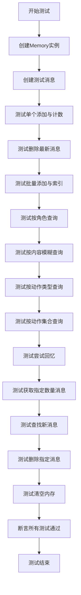

## 类结构

```
Memory (被测试类)
├── 字段: storage, index
├── 方法: add, add_batch, get, get_by_role, get_by_content, get_by_action, get_by_actions, try_remember, find_news, delete, delete_newest, clear, count
Message (数据结构)
├── 字段: content, role, cause_by
UserRequirement (动作类型)
test_memory (全局测试函数)
```

## 全局变量及字段


### `memory`
    
Memory类的实例，用于存储和管理消息记录

类型：`Memory`
    


### `message1`
    
第一条测试消息，内容为'test message1'，角色为'user1'

类型：`Message`
    


### `message2`
    
第二条测试消息，内容为'test message2'，角色为'user2'

类型：`Message`
    


### `message3`
    
第三条测试消息，内容为'test message3'，角色为'user1'

类型：`Message`
    


### `messages`
    
用于存储从Memory中查询返回的消息列表

类型：`List[Message]`
    


### `Memory.storage`
    
存储所有消息记录的主列表

类型：`List[Message]`
    


### `Memory.index`
    
基于消息cause_by字段建立的索引，用于快速查找相关消息

类型：`Dict[str, List[Message]]`
    


### `Message.content`
    
消息的文本内容

类型：`str`
    


### `Message.role`
    
消息的发送者角色标识

类型：`str`
    


### `Message.cause_by`
    
消息产生的原因或触发动作，用于建立索引和分类

类型：`str`
    
    

## 全局函数及方法

### `test_memory`

该函数是 `Memory` 类的单元测试函数，用于验证 `Memory` 类的各项核心功能，包括消息的增删改查、按条件筛选、索引维护以及内存清理等操作。

参数：

- 无参数

返回值：`None`，该函数不返回任何值，仅通过断言语句验证测试结果。

#### 流程图

```mermaid
flowchart TD
    A[开始测试] --> B[初始化Memory对象]
    B --> C[创建测试消息message1, message2, message3]
    C --> D[测试单个消息添加<br>memory.add(message1)]
    D --> E[断言内存计数为1]
    E --> F[测试删除最新消息<br>memory.delete_newest()]
    F --> G[断言内存计数为0]
    G --> H[测试批量添加消息<br>memory.add_batch([message1, message2])]
    H --> I[断言内存计数为2<br>断言索引数量为2]
    I --> J[测试按角色查询<br>memory.get_by_role('user1')]
    J --> K[断言查询结果正确]
    K --> L[测试按内容模糊查询<br>memory.get_by_content('test message')]
    L --> M[断言查询结果数量为2]
    M --> N[测试按Action类型查询<br>memory.get_by_action(UserRequirement)]
    N --> O[断言查询结果数量为2]
    O --> P[测试按Action集合查询<br>memory.get_by_actions({UserRequirement})]
    P --> Q[断言查询结果数量为2]
    Q --> R[测试尝试回忆<br>memory.try_remember('test message')]
    R --> S[断言查询结果数量为2]
    S --> T[测试获取指定数量消息<br>memory.get(k=1)]
    T --> U[断言获取到1条消息]
    U --> V[测试获取超过数量的消息<br>memory.get(k=5)]
    V --> W[断言获取到全部2条消息]
    W --> X[测试查找新消息<br>memory.find_news([message3])]
    X --> Y[断言找到1条新消息]
    Y --> Z[测试删除指定消息<br>memory.delete(message1)]
    Z --> AA[断言内存计数为1]
    AA --> AB[验证剩余消息正确]
    AB --> AC[测试清空内存<br>memory.clear()]
    AC --> AD[断言内存计数为0<br>断言索引为空]
    AD --> AE[测试结束]
```

#### 带注释源码

```python
def test_memory():
    # 1. 初始化一个Memory对象，这是所有测试的基础
    memory = Memory()

    # 2. 创建三条测试用的Message对象，用于后续的增删改查操作
    message1 = Message(content="test message1", role="user1")
    message2 = Message(content="test message2", role="user2")
    message3 = Message(content="test message3", role="user1")

    # 3. 测试单个消息添加功能：将message1添加到内存中
    memory.add(message1)
    # 断言：添加后，内存中的消息总数应为1
    assert memory.count() == 1

    # 4. 测试删除最新消息功能：删除刚添加的message1
    memory.delete_newest()
    # 断言：删除后，内存中的消息总数应为0
    assert memory.count() == 0

    # 5. 测试批量添加消息功能：一次性添加message1和message2
    memory.add_batch([message1, message2])
    # 断言：批量添加后，内存中的消息总数应为2
    assert memory.count() == 2
    # 断言：根据message1的cause_by属性建立的索引中，应包含2条消息
    # (这里假设message1和message2的cause_by属性相同，都指向UserRequirement)
    assert len(memory.index.get(message1.cause_by)) == 2

    # 6. 测试按角色查询功能：查询所有角色为'user1'的消息
    messages = memory.get_by_role("user1")
    # 断言：查询到的第一条消息的内容应与message1的内容一致
    assert messages[0].content == message1.content

    # 7. 测试按内容模糊查询功能：查询内容包含"test message"的消息
    messages = memory.get_by_content("test message")
    # 断言：应查询到2条消息（message1和message2）
    assert len(messages) == 2

    # 8. 测试按Action类型查询功能：查询cause_by为UserRequirement的消息
    messages = memory.get_by_action(UserRequirement)
    # 断言：应查询到2条消息
    assert len(messages) == 2

    # 9. 测试按Action集合查询功能：查询cause_by在{UserRequirement}集合中的消息
    messages = memory.get_by_actions({UserRequirement})
    # 断言：应查询到2条消息
    assert len(messages) == 2

    # 10. 测试尝试回忆功能：根据关键词"test message"尝试回忆相关消息
    messages = memory.try_remember("test message")
    # 断言：应回忆到2条消息
    assert len(messages) == 2

    # 11. 测试获取指定数量消息功能：获取最近1条消息
    messages = memory.get(k=1)
    # 断言：应获取到1条消息（最近添加的message2）
    assert len(messages) == 1

    # 12. 测试获取超过数量的消息功能：请求获取5条消息，但内存中只有2条
    messages = memory.get(k=5)
    # 断言：应返回全部2条消息，不会报错
    assert len(messages) == 2

    # 13. 测试查找新消息功能：在现有内存中查找[message3]里哪些是“新”消息
    # (即不在内存中的消息，这里message3未被添加，所以是新消息)
    messages = memory.find_news([message3])
    # 断言：应找到1条新消息（message3）
    assert len(messages) == 1

    # 14. 测试删除指定消息功能：从内存中删除message1
    memory.delete(message1)
    # 断言：删除后，内存中的消息总数应为1（只剩下message2）
    assert memory.count() == 1
    # 验证：查询角色为'user2'的消息，应得到message2，且其内容正确
    messages = memory.get_by_role("user2")
    assert messages[0].content == message2.content

    # 15. 测试清空内存功能：清除内存中的所有消息和索引
    memory.clear()
    # 断言：清空后，内存中的消息总数应为0
    assert memory.count() == 0
    # 断言：清空后，内部索引字典也应为空
    assert len(memory.index) == 0
```

### `Memory.add`

将单个 `Message` 对象添加到内存中，并更新内存的索引结构以支持后续的查询和检索。

参数：
- `message`：`Message`，需要被添加到内存中的消息对象。

返回值：`None`，此方法不返回任何值。

#### 流程图

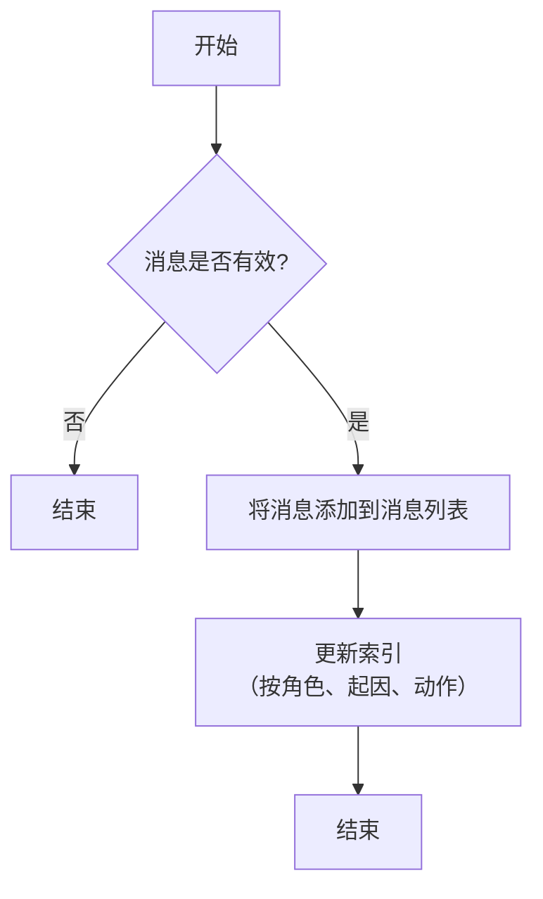

#### 带注释源码

```python
def add(self, message: Message):
    """
    将单个消息添加到内存中。
    如果消息有效（非空），则将其添加到内部消息列表 `self.messages` 中，
    并调用 `_update_index` 方法更新索引，以便后续可以根据角色、起因（cause_by）和动作（action）进行快速检索。
    """
    if not message:
        return
    self.messages.append(message)  # 将消息添加到消息列表
    self._update_index(message)    # 更新索引以支持快速查询
```

### `Memory.add_batch`

该方法用于批量添加消息到内存中，并更新索引以支持后续的查询操作。

参数：

- `messages`：`List[Message]`，要添加到内存中的消息列表

返回值：`None`，无返回值

#### 流程图

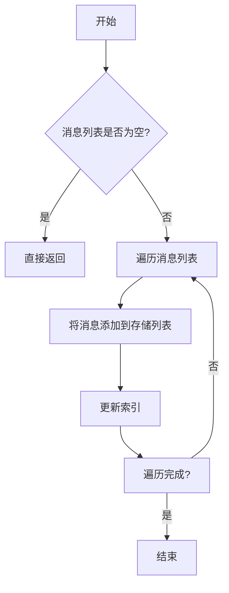

#### 带注释源码

```python
def add_batch(self, messages: List[Message]):
    """
    批量添加消息到内存中
    
    Args:
        messages: 要添加的消息列表
    """
    if not messages:
        return  # 如果消息列表为空，直接返回
    
    # 遍历所有消息
    for message in messages:
        self._storage.append(message)  # 将消息添加到存储列表
        
        # 更新索引，将消息按cause_by分类存储
        if message.cause_by not in self.index:
            self.index[message.cause_by] = []
        self.index[message.cause_by].append(message)
```

### `Memory.get`

从内存中获取指定数量的最新消息。如果请求的数量大于内存中存储的消息总数，则返回所有消息。

参数：

- `k`：`int`，可选参数，默认为None。指定要获取的消息数量。如果为None，则返回所有消息。

返回值：`list[Message]`，返回一个消息列表，包含从内存中获取的最新消息。

#### 流程图

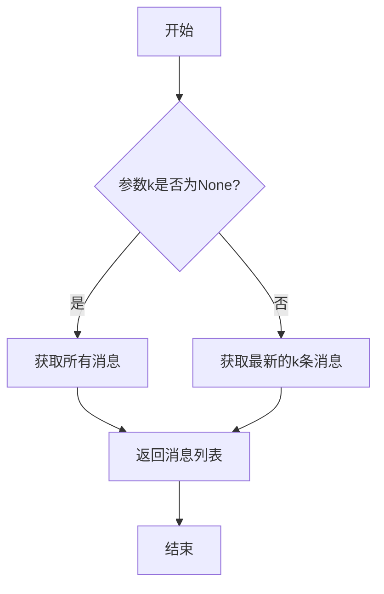

#### 带注释源码

```python
def get(self, k: int = None) -> list[Message]:
    """
    从内存中获取指定数量的最新消息。

    参数:
        k (int, 可选): 要获取的消息数量。如果为None，则返回所有消息。

    返回:
        list[Message]: 包含最新消息的列表。
    """
    # 如果k为None，返回所有消息
    if k is None:
        return self.messages
    
    # 否则，返回最新的k条消息
    return self.messages[-k:]
```

### `Memory.get_by_role`

根据指定的角色（role）从内存中筛选并返回所有匹配的 `Message` 对象。

参数：
- `role`：`str`，需要匹配的消息角色。

返回值：`list[Message]`，一个包含所有角色与指定 `role` 参数匹配的 `Message` 对象的列表。

#### 流程图

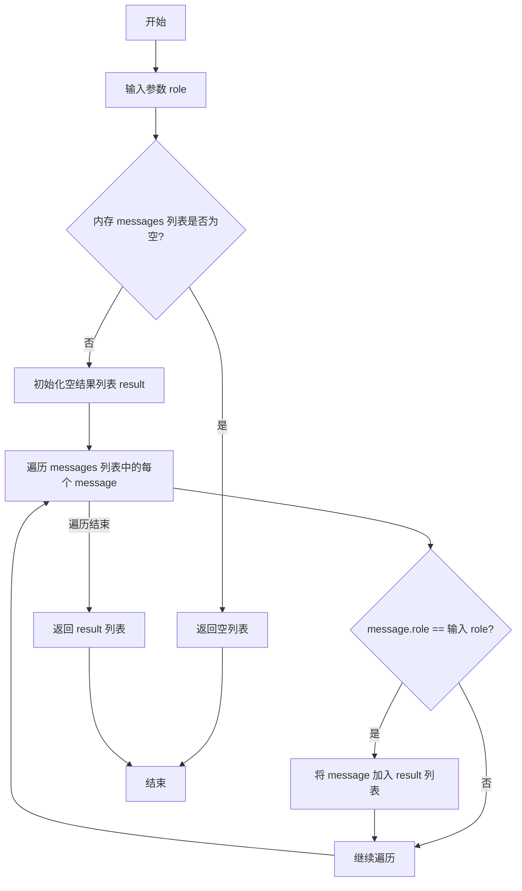

#### 带注释源码

```python
def get_by_role(self, role: str) -> list[Message]:
    """
    根据角色筛选消息。

    Args:
        role (str): 需要匹配的消息角色。

    Returns:
        list[Message]: 角色匹配的消息列表。
    """
    # 初始化一个空列表用于存放匹配的消息
    result = []
    # 遍历内存中存储的所有消息
    for message in self.messages:
        # 检查当前消息的角色是否与输入参数 role 相等
        if message.role == role:
            # 如果匹配，则将消息添加到结果列表中
            result.append(message)
    # 返回所有匹配的消息列表
    return result
```

### `Memory.get_by_content`

该方法根据内容关键词在内存中搜索并返回匹配的消息列表。它通过遍历内存中的所有消息，检查消息内容是否包含指定的关键词，从而筛选出符合条件的消息。

参数：

- `content`：`str`，用于搜索的关键词，将在消息内容中进行子串匹配。

返回值：`list[Message]`，返回一个消息列表，其中每个消息的内容都包含指定的关键词。

#### 流程图

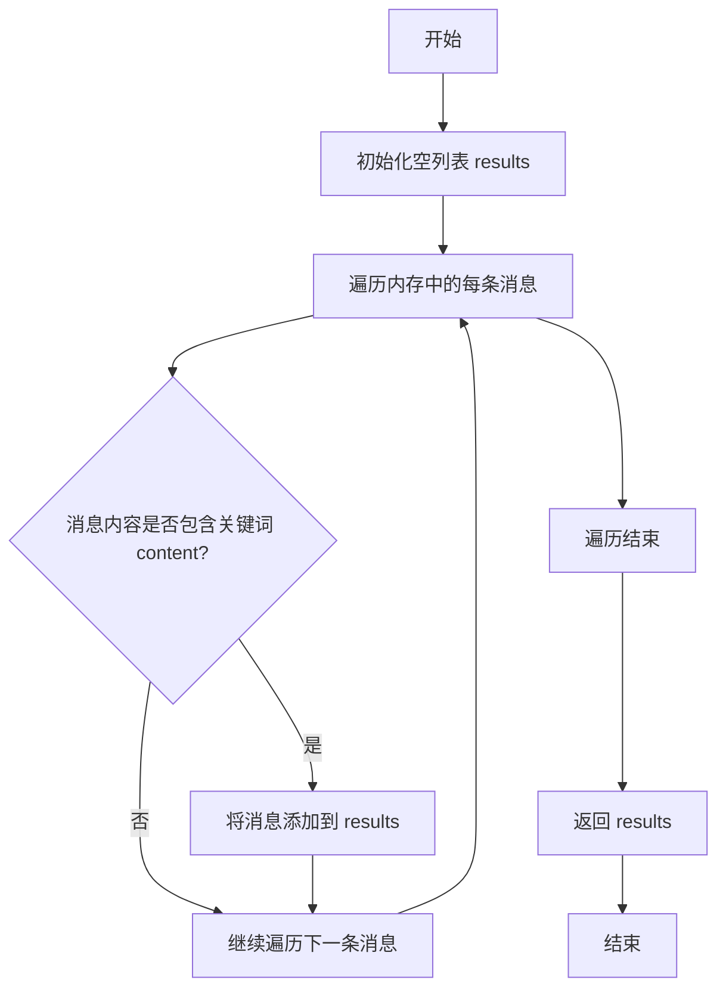

#### 带注释源码

```python
def get_by_content(self, content: str) -> list[Message]:
    """
    根据内容关键词搜索消息。

    Args:
        content (str): 用于搜索的关键词。

    Returns:
        list[Message]: 包含关键词的消息列表。
    """
    results = []  # 初始化结果列表
    for msg in self.storage:  # 遍历内存中的所有消息
        if content in msg.content:  # 检查消息内容是否包含关键词
            results.append(msg)  # 如果包含，则添加到结果列表
    return results  # 返回匹配的消息列表
```

### `Memory.get_by_action`

根据指定的动作类型从内存中筛选出由该动作触发的消息。

参数：

- `action`：`Type[Action]`，要筛选的动作类型，必须是`Action`类的子类。

返回值：`List[Message]`，返回一个消息列表，这些消息的`cause_by`字段与指定的动作类型匹配。

#### 流程图

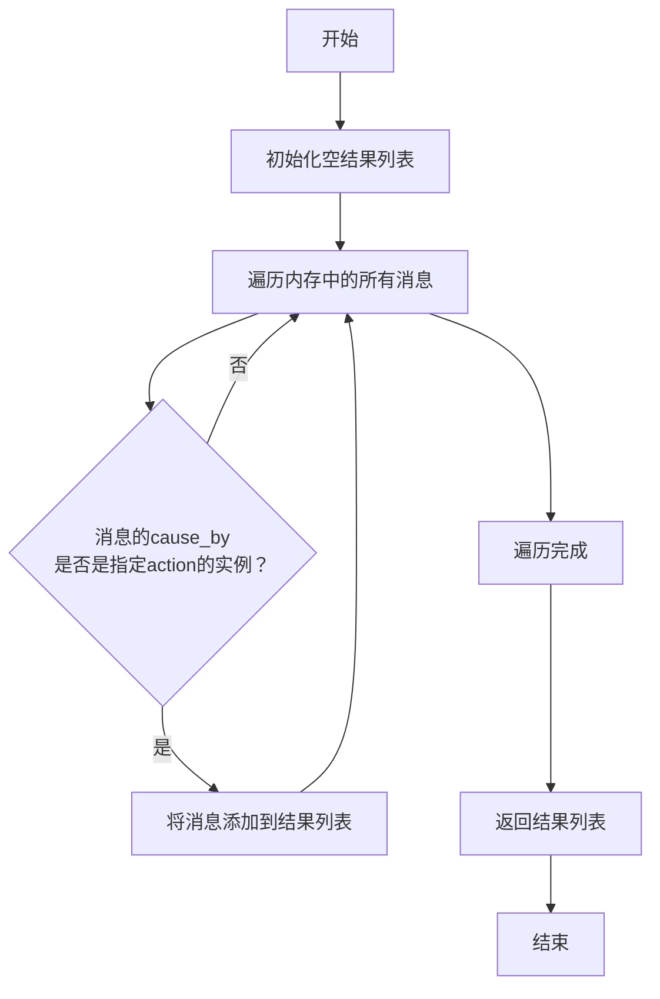

#### 带注释源码

```python
def get_by_action(self, action: Type[Action]) -> List[Message]:
    """
    根据指定的动作类型筛选消息。

    Args:
        action (Type[Action]): 要筛选的动作类型，必须是Action类的子类。

    Returns:
        List[Message]: 一个消息列表，这些消息的`cause_by`字段与指定的动作类型匹配。
    """
    # 初始化一个空列表用于存放匹配的消息
    found = []
    # 遍历内存中存储的所有消息
    for msg in self.storage:
        # 检查当前消息的`cause_by`属性是否是给定`action`类型的实例
        if isinstance(msg.cause_by, action):
            # 如果是，则将消息添加到结果列表中
            found.append(msg)
    # 返回所有匹配的消息
    return found
```

### `Memory.get_by_actions`

该方法用于从内存中检索与指定动作类型集合匹配的消息。它通过查询内部索引结构，高效地返回所有由这些动作触发的消息。

参数：

- `actions`：`Set[Type[Action]]`，一个动作类（`Action` 的子类）的集合，用于筛选消息。只有消息的 `cause_by` 字段类型在此集合中的消息才会被返回。

返回值：`List[Message]`，一个包含所有匹配指定动作类型的 `Message` 对象的列表。如果未找到匹配项，则返回空列表。

#### 流程图

```mermaid
flowchart TD
    A[开始: get_by_actions(actions)] --> B{actions 参数是否为空?}
    B -- 是 --> C[返回空列表]
    B -- 否 --> D[初始化空结果列表 results]
    D --> E[遍历 actions 集合中的每个动作类 action_cls]
    E --> F[从内存索引 memory.index 中<br>获取该动作类对应的消息列表 msgs]
    F --> G{msgs 是否存在?}
    G -- 是 --> H[将 msgs 中的所有消息<br>添加到 results 列表中]
    G -- 否 --> I[继续处理下一个动作类]
    H --> I
    I --> E
    E --> J[遍历结束]
    J --> K[返回结果列表 results]
    C --> L[结束]
    K --> L
```

#### 带注释源码

```python
def get_by_actions(self, actions: Set[Type[Action]]) -> List[Message]:
    """
    根据一组动作类型检索消息。

    该方法通过检查消息的 `cause_by` 字段是否属于给定的动作类型集合来筛选消息。
    它利用内存的索引结构（`self.index`）进行高效查找，避免遍历所有消息。

    Args:
        actions (Set[Type[Action]]): 用于筛选消息的动作类型集合。

    Returns:
        List[Message]: 匹配给定动作类型的消息列表。如果 `actions` 为空，则返回空列表。
    """
    if not actions:
        return []
    # 初始化一个空列表用于存储所有匹配的消息
    results = []
    # 遍历传入的动作类型集合
    for action_cls in actions:
        # 从索引字典中获取与该动作类关联的消息列表
        # 如果该动作类不在索引中，`get` 方法返回 `None`，后续的 `extend` 操作不会执行
        msgs = self.index.get(action_cls)
        if msgs:
            # 将找到的消息列表扩展到结果列表中
            results.extend(msgs)
    # 返回包含所有匹配消息的列表
    return results
```

### `Memory.try_remember`

该方法尝试从内存中检索与给定查询字符串相关的消息。它通过调用 `get_by_content` 方法，根据消息内容进行模糊匹配，返回所有包含查询字符串的消息列表。

参数：

- `query`：`str`，查询字符串，用于在消息内容中进行匹配

返回值：`list[Message]`，返回一个消息列表，包含所有内容中匹配查询字符串的消息

#### 流程图

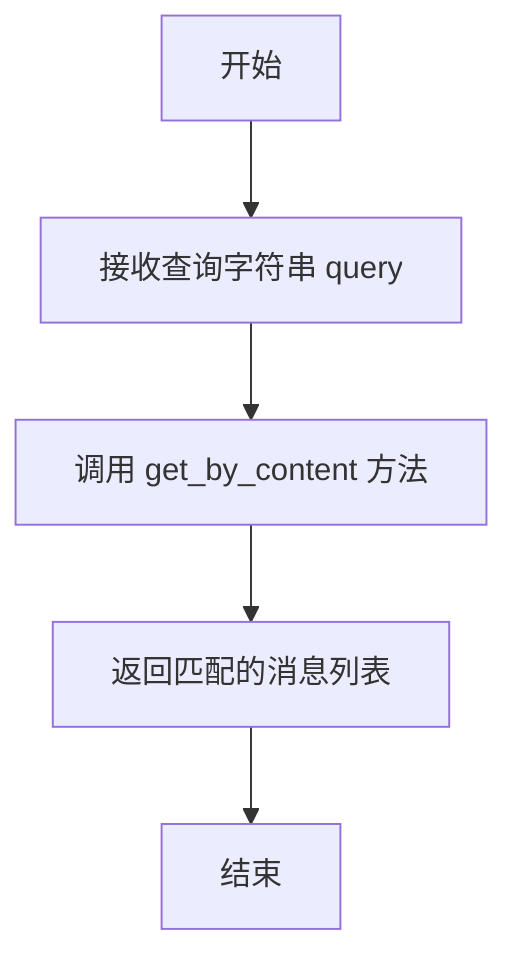

#### 带注释源码

```python
def try_remember(self, query: str) -> list[Message]:
    """
    尝试从内存中检索与给定查询字符串相关的消息。
    通过调用 get_by_content 方法，根据消息内容进行模糊匹配。

    Args:
        query (str): 查询字符串，用于在消息内容中进行匹配。

    Returns:
        list[Message]: 返回一个消息列表，包含所有内容中匹配查询字符串的消息。
    """
    return self.get_by_content(query)
```

### `Memory.find_news`

该方法用于从给定的消息列表中筛选出当前内存中不存在的新消息。它通过比较消息的ID来判断消息是否已存在于内存中，从而返回一个只包含新消息的列表。

参数：

- `messages`：`List[Message]`，待检查的消息列表，需要判断其中哪些消息是内存中尚未存在的。

返回值：`List[Message]`，返回一个列表，包含所有在内存中不存在的新消息。

#### 流程图

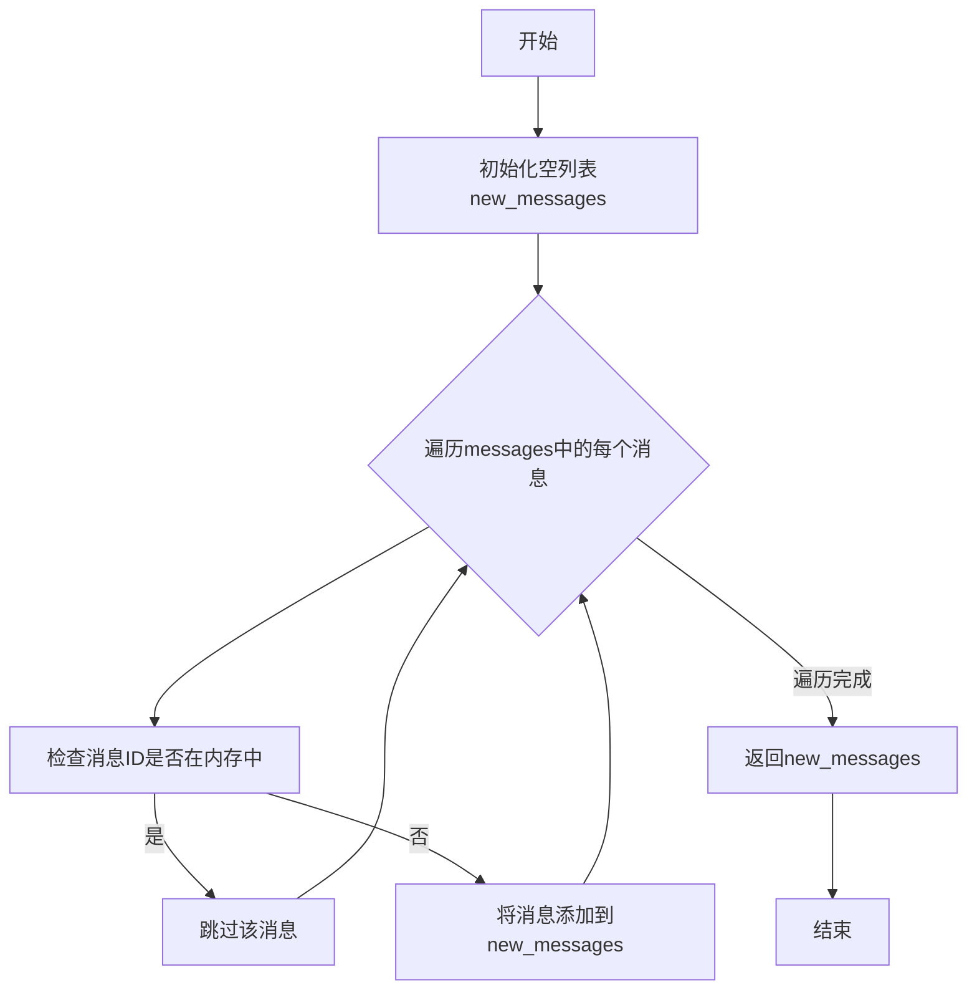

#### 带注释源码

```python
def find_news(self, messages: List[Message]) -> List[Message]:
    """
    从给定的消息列表中找出内存中不存在的新消息。
    
    参数:
        messages (List[Message]): 待检查的消息列表。
        
    返回:
        List[Message]: 包含所有新消息的列表。
    """
    # 初始化一个空列表，用于存储新消息
    new_messages = []
    
    # 遍历输入的消息列表
    for message in messages:
        # 检查当前消息的ID是否已存在于内存中
        if message.id not in self.storage:
            # 如果不存在，则将其添加到新消息列表中
            new_messages.append(message)
    
    # 返回包含所有新消息的列表
    return new_messages
```

### `Memory.delete`

从内存中删除指定的消息。该方法会从内部存储列表和索引中移除给定的消息对象，并更新内存中的消息计数。

参数：

- `message`：`Message`，要删除的消息对象

返回值：`None`，无返回值

#### 流程图

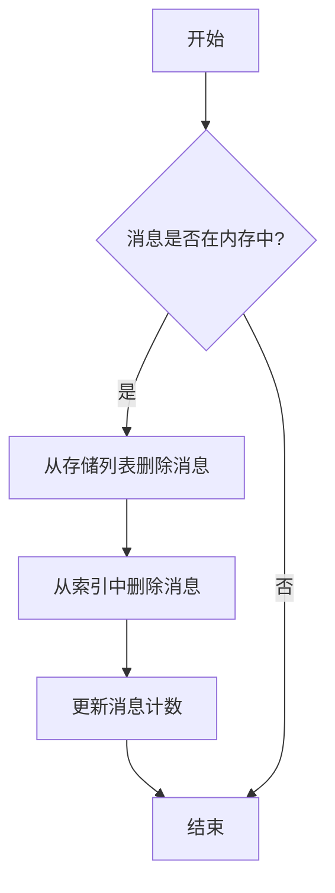

#### 带注释源码

```python
def delete(self, message: Message):
    """
    从内存中删除指定的消息
    
    Args:
        message (Message): 要删除的消息对象
    """
    # 检查消息是否在存储列表中
    if message in self.storage:
        # 从存储列表中移除消息
        self.storage.remove(message)
        # 从索引中移除消息
        self.index[message.cause_by].remove(message)
        # 如果该cause_by对应的消息列表为空，则删除该索引项
        if not self.index[message.cause_by]:
            del self.index[message.cause_by]
```

### `Memory.delete_newest`

从内存中删除最新添加的消息。如果内存为空，则不执行任何操作。

参数：无

返回值：`None`，无返回值

#### 流程图

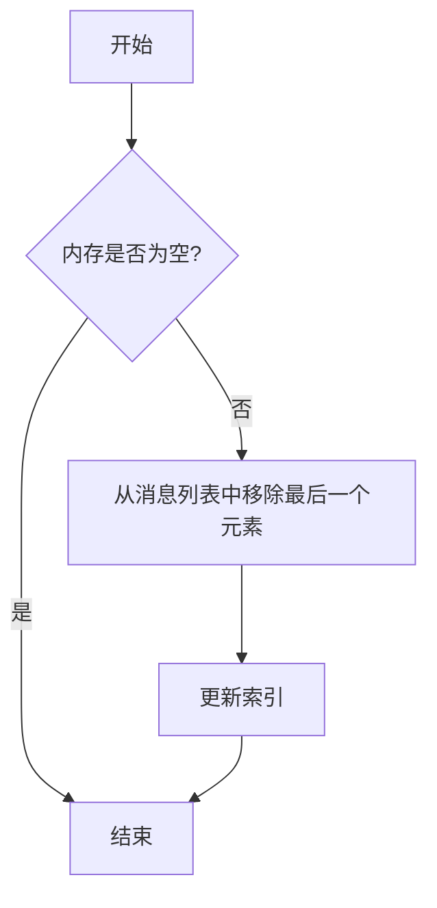

#### 带注释源码

```python
def delete_newest(self):
    """
    删除最新添加的消息。
    如果内存为空，则不执行任何操作。
    """
    if self.messages:  # 检查消息列表是否非空
        msg = self.messages.pop()  # 移除并返回列表中的最后一个消息
        self._del_index(msg)  # 从索引中删除该消息
```

### `Memory.clear`

清空内存中的所有消息及其索引，将内存重置为初始状态。

参数：无

返回值：`None`，无返回值

#### 流程图

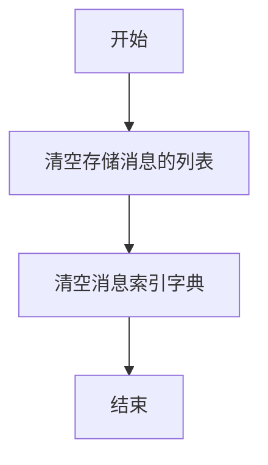

#### 带注释源码

```python
def clear(self):
    """
    清空内存中的所有消息及其索引。
    此方法将内部存储消息的列表和用于快速检索的索引字典都重置为空。
    """
    self.storage.clear()  # 清空存储消息的列表
    self.index.clear()    # 清空消息索引字典
```

### `Memory.count`

该方法用于获取当前内存中存储的消息总数。

参数：无

返回值：`int`，返回内存中存储的消息数量。

#### 流程图

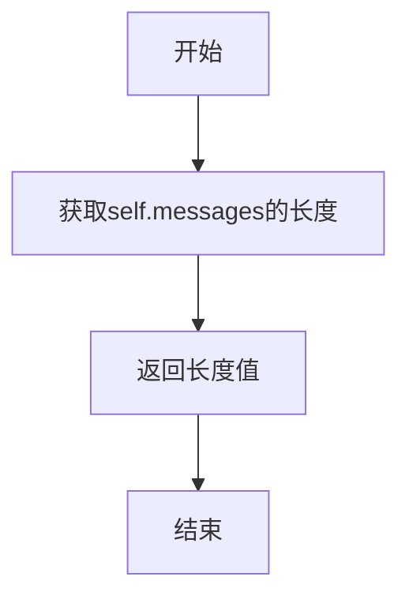

#### 带注释源码

```python
def count(self) -> int:
    """
    获取当前内存中存储的消息总数。

    Returns:
        int: 内存中存储的消息数量。
    """
    return len(self.messages)
```

## 关键组件


### Memory 类

Memory 类是系统的核心存储组件，负责管理对话或交互过程中产生的消息（Message）序列。它提供了消息的增删改查、按条件筛选、索引构建以及新旧消息比对等基础功能，是支持智能体（Agent）进行上下文记忆和决策的关键数据结构。

### 消息索引（Index）

消息索引是 Memory 类内部用于加速查询的数据结构，它根据消息的 `cause_by`（触发原因，通常关联到一个 Action 类）对消息进行分类存储。这使得系统能够快速检索由特定类型的动作（如 `UserRequirement`）产生的所有消息，而无需遍历整个消息历史。

### 惰性加载与按需查询

Memory 类通过 `get_by_role`, `get_by_content`, `get_by_action` 等方法支持多种维度的条件查询。这些方法实现了按需从内存中筛选消息的功能，避免了全量数据加载，是一种惰性查询策略，提高了在处理大量历史消息时的效率。

### 消息新旧比对（find_news）

`find_news` 方法是 Memory 类的一个关键功能，它通过比对传入的新消息列表与当前内存中的历史消息，识别出哪些是“新”消息（即不在历史记录中的消息）。这个功能对于增量处理、避免重复响应以及触发新的推理或行动至关重要。


## 问题及建议


### 已知问题

-   **测试用例覆盖不完整**：当前单元测试主要验证了`Memory`类在正常流程下的功能，但缺乏对边界条件、异常情况和并发访问的测试。例如，未测试当`memory`为空时调用`delete_newest()`、`get(k=0)`或`find_news([])`等方法的预期行为。
-   **测试数据耦合度高**：测试中创建了特定的`Message`对象（如`role="user1"`），并基于这些特定值进行断言（例如`assert messages[0].content == message1.content`）。这使得测试用例脆弱，一旦`Message`类的结构或`Memory`的内部索引逻辑发生变化，测试可能失败，即使核心功能正确。
-   **缺乏性能基准测试**：测试未对`Memory`类的方法（如`add_batch`、`get_by_content`、`index`操作）进行性能评估。随着存储消息数量的增长，某些操作（如基于内容的全文搜索）可能成为性能瓶颈，但目前没有测试数据来揭示这一点。
-   **未模拟外部依赖**：测试直接使用了`UserRequirement`等外部类。虽然当前测试可能通过，但若这些依赖类的行为发生变化，或需要进行隔离测试（例如测试`Memory`类本身时），当前测试方式不够灵活。

### 优化建议

-   **补充边界与异常测试**：增加测试用例以覆盖边界情况，例如：空内存的各种操作、无效输入参数（如`None`、负数`k`值）、查找不存在的内容或角色等。这有助于提高代码的健壮性。
-   **使用测试夹具和参数化**：利用`pytest`的`@pytest.fixture`来管理测试数据（如`Memory`实例和`Message`列表），并使用`@pytest.mark.parametrize`对关键方法（如`get`, `get_by_role`）进行参数化测试。这能减少重复代码，并使测试意图更清晰，降低与具体数据的耦合。
-   **引入性能测试**：对于`add_batch`（大批量插入）、`get_by_content`（模糊搜索）等可能涉及性能问题的方法，可以添加简单的性能测试或基准测试，例如使用`timeit`测量处理不同数量级消息时的耗时，为后续优化提供数据支持。
-   **使用Mock进行隔离测试**：对于测试`get_by_action`或`get_by_actions`等方法，可以考虑使用`unittest.mock`来模拟`Message.cause_by`属性或`UserRequirement`类，使测试更专注于`Memory`类自身的逻辑，提高测试的独立性和稳定性。
-   **增强测试可读性**：为每个测试用例添加更清晰的文档字符串，说明测试的目标和场景。考虑将长的测试函数拆分为多个更小、功能更聚焦的测试函数，每个函数测试一个特定的行为或方法。


## 其它


### 设计目标与约束

本模块旨在提供一个轻量级、可扩展的内存管理系统，用于存储、检索和管理智能体在运行过程中产生的消息（Message）。其核心设计目标包括：
1.  **高效存储与检索**：支持基于角色、内容、动作类型等多种维度快速查询消息。
2.  **内存管理**：提供消息的添加、删除、批量操作及容量控制（如获取最新K条消息）功能。
3.  **索引优化**：通过内部索引结构加速特定属性的查询，如按`cause_by`（动作类型）进行分组。
4.  **新旧消息识别**：能够比较内存中的历史消息与传入的新消息列表，识别出“新”消息（即历史中不存在的消息）。
主要约束包括保持接口简洁，与`metagpt.schema.Message`数据结构紧密集成，以及作为底层组件应具备较高的稳定性和性能。

### 错误处理与异常设计

当前代码示例（单元测试）未显式展示错误处理逻辑。基于其设计，预期的错误处理策略可能包括：
1.  **输入验证**：`add`, `delete`等方法在操作前应验证输入参数是否为有效的`Message`对象或ID，无效输入可能导致静默失败或抛出`TypeError`/`ValueError`。
2.  **边界条件处理**：`get(k)`方法在`k`大于当前消息总数时应返回所有消息而非出错，如测试所示(`k=5`时返回全部2条消息)。`delete_newest`在空内存中调用可能应定义为无操作或抛出`IndexError`。
3.  **索引一致性维护**：在`delete`, `clear`等修改操作中，必须同步更新内部`index`字典，以防止索引状态与真实数据不一致。此部分错误可能导致后续查询结果不准确。
4.  **资源管理**：虽然当前示例简单，但在生产环境中，若内存存储量极大，应考虑内存溢出风险，并通过`clear`方法或引入持久化机制来管理。
模块可能依赖Python标准异常，未定义自定义异常类。

### 数据流与状态机

1.  **核心数据流**：
    *   **输入**：`Message`对象，包含`content`, `role`, `cause_by`等属性。
    *   **处理**：`Memory`对象接收`Message`，将其存储到内部列表(`self.memory`)，并根据`Message`的属性（如`cause_by`）更新倒排索引(`self.index`)。
    *   **输出**：查询方法（如`get_by_role`, `get_by_content`, `get`）返回`Message`对象列表。
2.  **状态机**：
    *   **状态**：`Memory`对象的核心状态是`self.memory`（消息列表）和`self.index`（索引字典）。`count()`方法反映了当前状态的大小。
    *   **状态转移**：
        *   `add`, `add_batch` -> 状态增长（列表和索引更新）。
        *   `delete`, `delete_newest`, `clear` -> 状态缩减或重置（列表和索引同步更新）。
        *   查询方法（如`get_by_*`, `try_remember`, `find_news`）为只读操作，不改变状态。
    *   `find_news`是典型的状态依赖操作：它将当前内存状态（历史消息）与输入的新消息列表进行比较，输出差异（新消息）。

### 外部依赖与接口契约

1.  **外部依赖**：
    *   `metagpt.schema.Message`：内存系统存储和操作的基本数据单元。强依赖其结构（必须有`content`, `role`, `cause_by`等字段）。
    *   `metagpt.actions.Action`（如`UserRequirement`）：`get_by_action`等方法依赖`Message.cause_by`属性与这些动作类关联。需要`cause_by`字段的值是动作类或可哈希的标识符。
    *   `Python`标准库：主要依赖`list`, `dict`等内置数据结构。
2.  **接口契约**：
    *   **对上游（调用者）**：提供一套完整的CRUD和查询API（如`add`, `delete`, `get_by_*`, `try_remember`）。调用者需确保传入的`Message`格式正确。
    *   **对下游（被依赖者）**：无显式下游依赖。但`index`的构建逻辑隐式依赖`Message.cause_by`的可哈希性和一致性。
    *   **线程安全**：当前设计未提及线程安全。如果在多线程环境中使用，`add`, `delete`等修改操作可能需要加锁保护，或明确声明非线程安全。

    