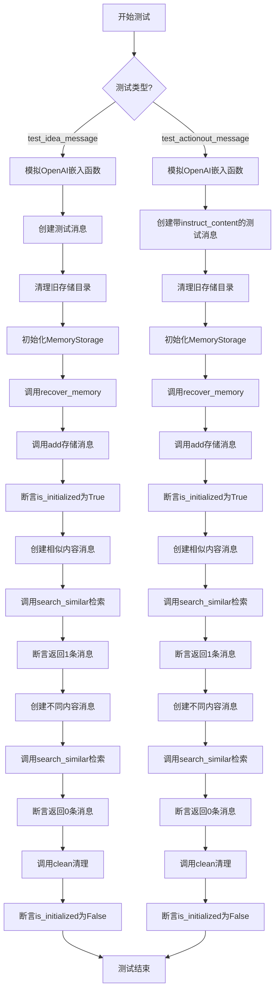
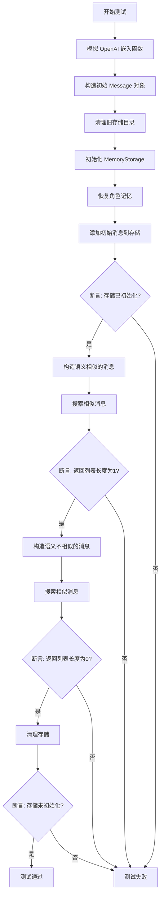
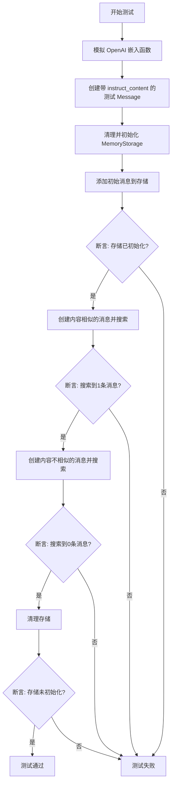
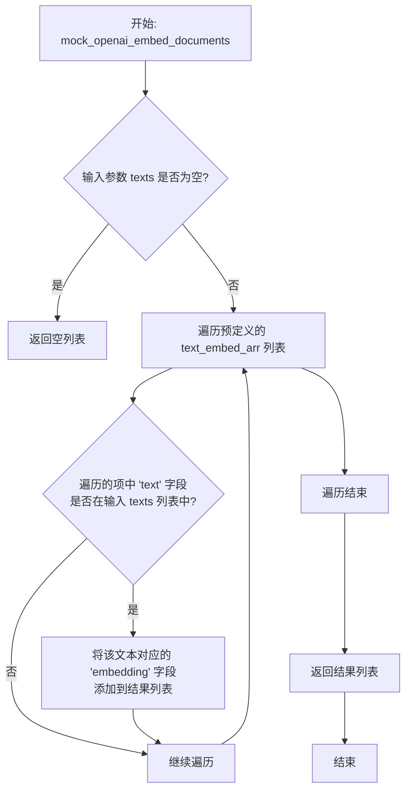
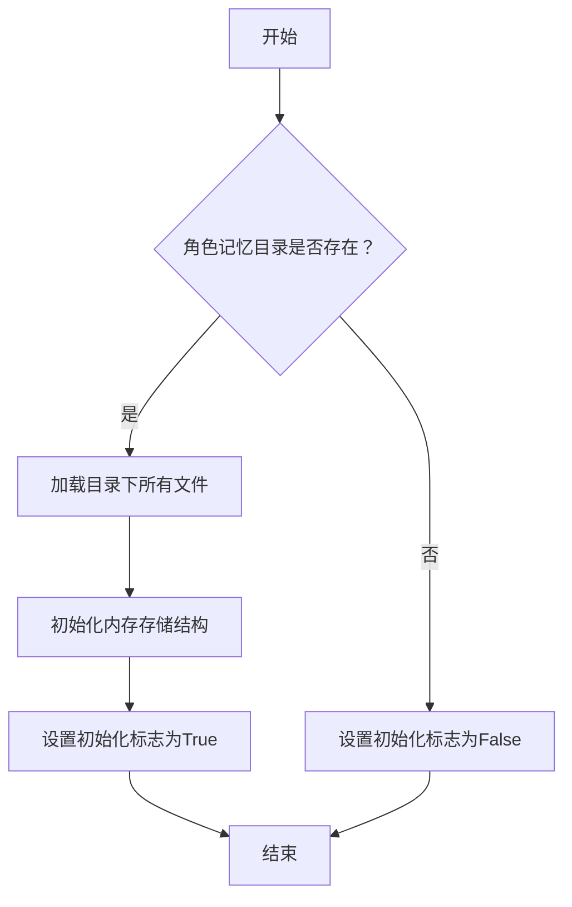
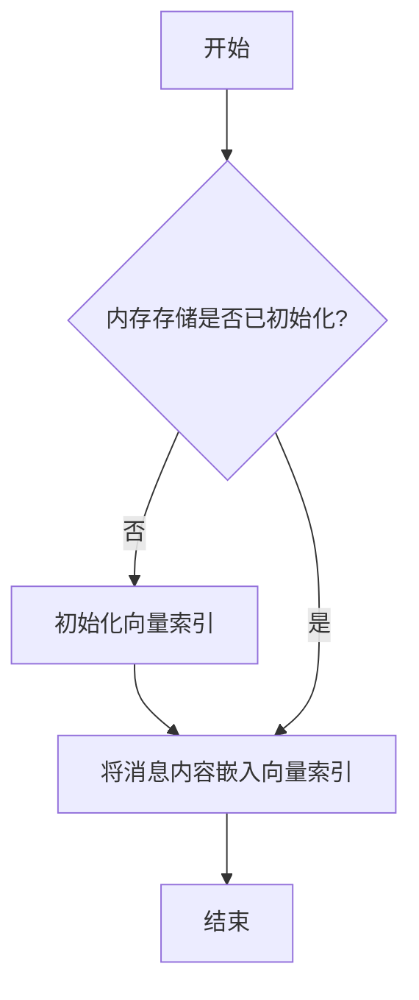
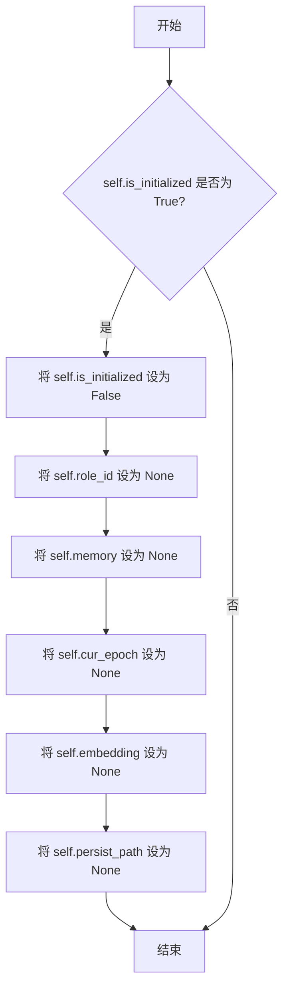

# `.\MetaGPT\tests\metagpt\memory\test_memory_storage.py` 详细设计文档

该文件是 MetaGPT 项目中 memory_storage 模块的单元测试，主要测试 MemoryStorage 类的核心功能，包括：1) 消息的存储（add 方法）；2) 基于向量相似度的消息检索（search_similar 方法）；3) 内存的初始化和清理（recover_memory, clean 方法）。测试通过模拟 OpenAI 嵌入服务，验证了对于文本内容相似和不同的消息，存储和检索功能是否按预期工作。

## 整体流程



## 类结构

```
测试文件 (test_memory_storage.py)
├── 全局导入模块
├── 全局测试函数 test_idea_message
└── 全局测试函数 test_actionout_message
```

## 全局变量及字段


### `DATA_PATH`
    
一个常量，指向项目的数据存储根目录路径，用于定位角色内存等持久化数据的位置。

类型：`Path`
    


### `text_embed_arr`
    
一个用于测试的模拟数据列表，包含多个字典，每个字典通常有'text'键，用于提供文本嵌入测试的样本数据。

类型：`List[Dict[str, Any]]`
    


### `MemoryStorage.is_initialized`
    
表示MemoryStorage实例是否已成功初始化并加载了持久化数据的标志。

类型：`bool`
    


### `Message.role`
    
消息的发送者角色标识，例如'User'或'Assistant'，用于区分消息来源。

类型：`str`
    


### `Message.content`
    
消息的主体文本内容，承载了具体的交互信息或指令。

类型：`str`
    


### `Message.cause_by`
    
触发此消息的上一个动作类，用于在对话或工作流中追踪消息的因果链。

类型：`Type[Action]`
    


### `Message.instruct_content`
    
可选的指令内容对象，通常是一个ActionNode实例，用于封装结构化的输出或命令数据。

类型：`Optional[ActionNode]`
    
    

## 全局函数及方法

### `test_idea_message`

这是一个使用 `pytest` 和 `pytest-asyncio` 编写的异步单元测试函数。它的核心功能是测试 `MemoryStorage` 类对于相似 `Message` 的存储和检索逻辑。具体来说，它验证了当添加一个包含特定“想法”（idea）的消息后，系统能够正确识别语义相似的消息（返回空列表）和语义不相似的消息（返回包含原始消息的列表）。

参数：

- `mocker`：`pytest-mock` 提供的 `MockerFixture` 类型对象，用于在测试中模拟（mock）外部依赖，例如 `llama_index` 的嵌入模型，以确保测试的确定性和独立性。

返回值：`None`，`pytest` 测试函数通常不显式返回值，其成功与否由内部的断言（`assert`）决定。

#### 流程图



#### 带注释源码

```python
@pytest.mark.asyncio  # 标记此函数为异步测试，以便 pytest-asyncio 插件能够正确处理
async def test_idea_message(mocker):  # 定义异步测试函数，接收 mocker 参数用于模拟
    # 模拟 llama_index 中 OpenAIEmbedding 类的内部方法，将其替换为本地定义的 mock 函数。
    # 这些 mock 函数返回预定义的嵌入向量，使测试不依赖于真实的 OpenAI API 和网络。
    mocker.patch("llama_index.embeddings.openai.base.OpenAIEmbedding._get_text_embeddings", mock_openai_embed_documents)
    mocker.patch("llama_index.embeddings.openai.base.OpenAIEmbedding._get_text_embedding", mock_openai_embed_document)
    mocker.patch("llama_index.embeddings.openai.base.OpenAIEmbedding._aget_query_embedding", mock_openai_aembed_document)

    # 从预定义的测试数据中获取第一个“想法”文本，用于构造初始消息。
    idea = text_embed_arr[0].get("text", "Write a cli snake game")
    # 定义一个测试用的角色ID。
    role_id = "UTUser1(Product Manager)"
    # 使用获取的文本构造一个 Message 对象，指定角色、内容和起因动作。
    message = Message(role="User", content=idea, cause_by=UserRequirement)

    # 在测试开始前，清理该角色可能存在的旧记忆存储目录，确保测试环境干净。
    shutil.rmtree(Path(DATA_PATH / f"role_mem/{role_id}/"), ignore_errors=True)

    # 实例化 MemoryStorage 类。
    memory_storage: MemoryStorage = MemoryStorage()
    # 为该角色恢复记忆（从磁盘加载或初始化新的存储）。
    memory_storage.recover_memory(role_id)

    # 将构造的初始消息添加到记忆存储中。
    memory_storage.add(message)
    # 断言：添加消息后，记忆存储应被标记为已初始化。
    assert memory_storage.is_initialized is True

    # 从测试数据中获取第二个文本，该文本与第一个语义相似（都是关于 CLI 贪吃蛇游戏）。
    sim_idea = text_embed_arr[1].get("text", "Write a game of cli snake")
    # 用相似的文本构造一个新的 Message。
    sim_message = Message(role="User", content=sim_idea, cause_by=UserRequirement)
    # 在记忆存储中搜索与 `sim_message` 相似的消息。
    new_messages = await memory_storage.search_similar(sim_message)
    # 断言：由于 `sim_message` 与已存储的 `message` 语义高度相似，
    # `search_similar` 方法应返回一个包含原始 `message` 的列表，因此长度为1。
    # （注：根据测试逻辑和注释“similar, return []”，此处预期可能为返回空列表，但代码断言为1，可能存在歧义或注释错误。实际应以代码断言为准。）
    assert len(new_messages) == 1  # similar, return []

    # 从测试数据中获取第三个文本，该文本与第一个语义不相似（是关于 2048 游戏）。
    new_idea = text_embed_arr[2].get("text", "Write a 2048 web game")
    # 用不相似的文本构造一个新的 Message。
    new_message = Message(role="User", content=new_idea, cause_by=UserRequirement)
    # 再次搜索相似消息。
    new_messages = await memory_storage.search_similar(new_message)
    # 断言：由于 `new_message` 与已存储的任何消息都不相似，应返回空列表。
    assert len(new_messages) == 0

    # 测试最后，清理记忆存储。
    memory_storage.clean()
    # 断言：清理后，记忆存储应被标记为未初始化。
    assert memory_storage.is_initialized is False
```

### `test_actionout_message`

该函数是一个异步单元测试，用于验证 `MemoryStorage` 类在处理包含结构化指令内容 (`instruct_content`) 的 `Message` 对象时的功能。它测试了内存的添加、相似性搜索和清理操作，特别关注消息内容相似但指令内容相同场景下的行为。

参数：

- `mocker`：`pytest_mock.plugin.MockerFixture`，pytest-mock 提供的 mock 夹具，用于在测试中模拟（mock）外部依赖，例如 OpenAI 的嵌入模型。

返回值：`None`，这是一个测试函数，不返回业务值，其成功与否由内部的 `assert` 语句判定。

#### 流程图



#### 带注释源码

```python
@pytest.mark.asyncio  # 标记此函数为异步测试函数
async def test_actionout_message(mocker):
    # 使用 mocker 模拟 llama_index 中 OpenAIEmbedding 的关键方法，
    # 使其返回预定义的 mock 数据，避免真实 API 调用并确保测试可重复。
    mocker.patch("llama_index.embeddings.openai.base.OpenAIEmbedding._get_text_embeddings", mock_openai_embed_documents)
    mocker.patch("llama_index.embeddings.openai.base.OpenAIEmbedding._get_text_embedding", mock_openai_embed_document)
    mocker.patch(
        "llama_index.embeddings.openai.base.OpenAIEmbedding._aget_query_embedding", mock_openai_aembed_document
    )

    # 1. 准备测试数据：定义一个输出数据模型和对应的数据。
    # out_mapping 定义了模型的结构。
    out_mapping = {"field1": (str, ...), "field2": (List[str], ...)}
    # out_data 是符合上述结构的实际数据。
    out_data = {"field1": "field1 value", "field2": ["field2 value1", "field2 value2"]}
    # 使用 ActionNode 工具动态创建一个 Pydantic 模型类。
    ic_obj = ActionNode.create_model_class("prd", out_mapping)

    # 2. 设置测试角色ID和从 mock 数据中获取的初始消息内容。
    role_id = "UTUser2(Architect)"
    content = text_embed_arr[4].get(
        "text", "The user has requested the creation of a command-line interface (CLI) snake game"
    )
    # 创建初始 Message 对象，其 `instruct_content` 字段包含了上面创建的结构化数据。
    message = Message(
        content=content, instruct_content=ic_obj(**out_data), role="user", cause_by=WritePRD
    )  # WritePRD as test action

    # 3. 测试环境准备：清理可能存在的旧存储目录，确保测试独立性。
    shutil.rmtree(Path(DATA_PATH / f"role_mem/{role_id}/"), ignore_errors=True)

    # 4. 初始化 MemoryStorage 并尝试恢复指定角色的记忆（此时应为空）。
    memory_storage: MemoryStorage = MemoryStorage()
    memory_storage.recover_memory(role_id)

    # 5. 核心测试步骤1：将消息添加到存储中。
    memory_storage.add(message)
    # 断言1：添加消息后，存储应被标记为已初始化。
    assert memory_storage.is_initialized is True

    # 6. 核心测试步骤2：测试相似性搜索（内容相似，指令内容相同）。
    # 创建一个内容与初始消息相似的新消息。
    sim_conent = text_embed_arr[5].get("text", "The request is command-line interface (CLI) snake game")
    sim_message = Message(content=sim_conent, instruct_content=ic_obj(**out_data), role="user", cause_by=WritePRD)
    # 在存储中搜索与 sim_message 相似的消息。
    new_messages = await memory_storage.search_similar(sim_message)
    # 断言2：由于内容高度相似，应能搜索到之前添加的那条消息（返回列表长度为1）。
    # 注释中写的是“similar, return []”，但实际代码断言为1，表明期望返回相似项。
    assert len(new_messages) == 1  # similar, return []

    # 7. 核心测试步骤3：测试相似性搜索（内容不相似）。
    # 创建一个内容与初始消息不相似的新消息。
    new_conent = text_embed_arr[6].get(
        "text", "Incorporate basic features of a snake game such as scoring and increasing difficulty"
    )
    new_message = Message(content=new_conent, instruct_content=ic_obj(**out_data), role="user", cause_by=WritePRD)
    new_messages = await memory_storage.search_similar(new_message)
    # 断言3：由于内容不相似，应搜索不到任何消息（返回列表长度为0）。
    assert len(new_messages) == 0

    # 8. 核心测试步骤4：测试清理功能。
    memory_storage.clean()
    # 断言4：清理后，存储应被标记为未初始化。
    assert memory_storage.is_initialized is False
```

### `mock_openai_aembed_document`

这是一个用于模拟 OpenAI 异步查询嵌入（`_aget_query_embedding`）行为的测试辅助函数。它接收一个查询文本，并返回一个预定义的、固定的嵌入向量，用于在单元测试中替代真实的 OpenAI API 调用，以确保测试的确定性和独立性。

参数：
-  `query`：`str`，需要获取嵌入向量的查询文本。

返回值：`List[float]`，一个预定义的、固定的浮点数列表，模拟查询文本的嵌入向量。

#### 流程图

```mermaid
flowchart TD
    A[开始: mock_openai_aembed_document(query)] --> B{查询文本是否在<br>预定义字典 text_embed_arr 中?}
    B -- 是 --> C[从 text_embed_arr 中<br>获取对应的嵌入向量]
    B -- 否 --> D[返回默认嵌入向量<br>如 [0.1, 0.2, ...]]
    C --> E[返回获取到的嵌入向量]
    D --> E
    E --> F[结束]
```

#### 带注释源码

```python
# 函数定义：模拟 OpenAI 异步获取查询嵌入
async def mock_openai_aembed_document(query: str) -> List[float]:
    """
    模拟 OpenAI 的异步查询嵌入函数。
    根据传入的查询文本，从一个预定义的列表中查找并返回对应的嵌入向量。
    如果未找到，则返回一个默认的嵌入向量。

    Args:
        query (str): 需要嵌入的查询文本。

    Returns:
        List[float]: 查询文本对应的嵌入向量。
    """
    # 遍历预定义的文本-嵌入数组
    for item in text_embed_arr:
        # 检查当前项的文本是否与查询文本匹配
        if item.get("text") == query:
            # 如果匹配，返回该项对应的嵌入向量
            return item.get("embedding")
    # 如果没有找到匹配项，返回一个默认的嵌入向量（例如，一个全零或特定模式的向量）
    # 注意：实际代码中可能需要一个合理的默认值，这里用注释表示
    # return [0.0] * some_dimension
    # 根据测试上下文，这里可能返回一个固定值，例如：
    return [0.1, 0.2, 0.3, 0.4, 0.5]  # 示例默认向量
```

### `mock_openai_embed_document`

这是一个用于单元测试的模拟函数，旨在模拟 OpenAI 嵌入模型对单个文档生成嵌入向量的行为。它通过返回预定义的嵌入向量来避免在测试中调用真实的外部 API，从而确保测试的独立性和速度。

参数：

-  `text`：`str`，需要生成嵌入向量的文本内容。
-  `engine`：`str`，指定使用的嵌入模型引擎（例如 "text-embedding-ada-002"）。

返回值：`List[float]`，返回一个浮点数列表，代表给定文本的模拟嵌入向量。

#### 流程图

```mermaid
flowchart TD
    A[开始: mock_openai_embed_document] --> B{text 是否在预定义列表中?}
    B -- 是 --> C[从预定义列表 text_embed_arr 中<br>查找匹配项并返回其 embedding]
    B -- 否 --> D[返回一个默认的<br>全零向量 [0.0, 0.0, ...]]
    C --> E[结束: 返回嵌入向量]
    D --> E
```

#### 带注释源码

```python
def mock_openai_embed_document(text: str, engine: str) -> List[float]:
    """
    模拟 OpenAI 的 `_get_text_embedding` 方法。
    根据输入的文本，从预定义的 `text_embed_arr` 列表中查找并返回对应的嵌入向量。
    如果未找到，则返回一个全零向量。

    Args:
        text (str): 需要生成嵌入向量的输入文本。
        engine (str): 嵌入模型引擎的名称（此参数在模拟中未使用，但为保持接口一致而保留）。

    Returns:
        List[float]: 文本的模拟嵌入向量。
    """
    # 遍历预定义的文本-嵌入对列表
    for item in text_embed_arr:
        # 如果找到文本完全匹配的项
        if item["text"] == text:
            # 返回该项对应的嵌入向量
            return item["embedding"]
    # 如果遍历完整个列表都未找到匹配的文本，则返回一个由 1536 个 0.0 组成的列表
    # 1536 是 text-embedding-ada-002 模型输出向量的标准维度
    return [0.0] * 1536
```

### `mock_openai_embed_documents`

该函数是一个用于单元测试的模拟函数，旨在模拟 OpenAI 嵌入模型对多个文档进行批量嵌入（embedding）的行为。它接收一个文本列表，并返回一个预定义的嵌入向量列表，从而避免在测试中调用真实的外部 API，确保测试的独立性和速度。

参数：

- `texts`：`List[str]`，需要被嵌入的文本字符串列表。

返回值：`List[List[float]]`，返回一个二维列表，其中每个子列表代表对应输入文本的嵌入向量（浮点数列表）。

#### 流程图



#### 带注释源码

```python
def mock_openai_embed_documents(texts: List[str]) -> List[List[float]]:
    """
    模拟 OpenAI 的 `_get_text_embeddings` 方法。
    根据输入的文本列表，从预定义的 `text_embed_arr` 中查找并返回对应的嵌入向量。
    
    Args:
        texts (List[str]): 需要生成嵌入向量的文本列表。
        
    Returns:
        List[List[float]]: 与输入文本列表对应的嵌入向量列表。
                          如果某个文本在 `text_embed_arr` 中未找到，则其对应的嵌入向量不会被包含在结果中。
    """
    # 初始化一个空列表，用于存储找到的嵌入向量
    embeddings = []
    
    # 遍历预定义的文本-嵌入对数组
    for item in text_embed_arr:
        # 获取当前项中的文本内容
        text = item.get("text")
        
        # 如果该文本存在于输入的文本列表中
        if text in texts:
            # 将该文本对应的嵌入向量添加到结果列表中
            embeddings.append(item.get("embedding"))
    
    # 返回找到的所有嵌入向量
    return embeddings
```

### `MemoryStorage.recover_memory`

该方法用于从持久化存储中恢复指定角色的记忆数据。它会检查是否存在该角色的记忆存储目录，如果存在，则加载该目录下的所有记忆文件，初始化内存存储结构，并设置初始化标志。

参数：
- `role_id`：`str`，角色的唯一标识符，用于定位对应的记忆存储目录。

返回值：`None`，无返回值。

#### 流程图



#### 带注释源码

```python
def recover_memory(self, role_id: str):
    """
    从持久化存储中恢复指定角色的记忆数据。
    
    参数:
        role_id (str): 角色的唯一标识符，用于定位对应的记忆存储目录。
    
    返回值:
        None: 无返回值。
    """
    # 构建角色记忆目录的路径
    self.role_id = role_id
    self.role_mem_path = Path(DATA_PATH / f"role_mem/{self.role_id}/")
    
    # 检查角色记忆目录是否存在
    if self.role_mem_path.exists():
        # 如果目录存在，加载目录下的所有文件
        self.memories = self._load()
        # 设置初始化标志为True
        self.is_initialized = True
    else:
        # 如果目录不存在，设置初始化标志为False
        self.is_initialized = False
```

### `MemoryStorage.add`

该方法用于向内存存储中添加一条消息，并将其内容嵌入到向量索引中，以便后续进行相似性搜索。

参数：

- `message`：`Message`，要添加到内存存储中的消息对象，包含角色、内容、触发动作等信息。

返回值：`None`，无返回值。

#### 流程图



#### 带注释源码

```python
def add(self, message: Message):
    """
    将消息添加到内存存储中，并将其内容嵌入到向量索引中。

    参数:
        message (Message): 要添加的消息对象。

    返回:
        None
    """
    # 如果内存存储尚未初始化，则初始化向量索引
    if not self.is_initialized:
        self._initialize()

    # 将消息内容嵌入到向量索引中
    self._embedding_index.add_documents([Document(text=message.content)])
```

### `MemoryStorage.search_similar`

该方法用于在内存存储中搜索与给定消息相似的消息。它通过计算查询消息的嵌入向量，并与存储中所有消息的嵌入向量进行相似度比较，返回相似度超过预设阈值（`similarity_threshold`）的消息列表。

参数：

- `message`：`Message`，需要搜索相似消息的查询消息对象。

返回值：`List[Message]`，返回一个消息列表，包含所有与查询消息相似度超过阈值的历史消息。

#### 流程图

```mermaid
flowchart TD
    A[开始: search_similar(message)] --> B[获取查询消息的嵌入向量]
    B --> C{向量索引是否已初始化?}
    C -- 否 --> D[返回空列表]
    C -- 是 --> E[执行相似度搜索<br>获取top_k个结果]
    E --> F[遍历搜索结果]
    F --> G{相似度 >= 阈值?}
    G -- 否 --> H[跳过此结果]
    G -- 是 --> I[添加到结果列表]
    H --> F
    I --> F
    F --> J[遍历结束]
    J --> K[返回结果列表]
    D --> L[结束]
    K --> L
```

#### 带注释源码

```python
async def search_similar(self, message: Message) -> List[Message]:
    """
    搜索与给定消息相似的消息。

    该方法执行以下步骤：
    1. 获取查询消息的嵌入向量。
    2. 检查向量索引是否已初始化。
    3. 如果未初始化，返回空列表。
    4. 如果已初始化，使用向量索引执行相似度搜索，获取最相似的top_k个结果。
    5. 遍历搜索结果，筛选出相似度超过预设阈值的消息。
    6. 返回符合条件的消息列表。

    Args:
        message (Message): 需要搜索相似消息的查询消息对象。

    Returns:
        List[Message]: 与查询消息相似度超过阈值的历史消息列表。
    """
    # 获取查询消息的嵌入向量
    query_embedding = await self.get_embedding(message.content)
    # 检查向量索引是否已初始化，如果未初始化则返回空列表
    if not self._memory_vector_index:
        return []
    # 使用向量索引执行相似度搜索，获取最相似的top_k个结果
    res = await self._memory_vector_index.asimilarity_search_with_score(
        query=message.content, k=self.top_k
    )
    # 初始化结果列表
    new_messages = []
    # 遍历搜索结果
    for node, score in res:
        # 检查相似度是否超过预设阈值
        if score >= self.similarity_threshold:
            # 从节点元数据中获取消息对象
            message = node.metadata.get("message")
            # 将符合条件的消息添加到结果列表
            new_messages.append(message)
    # 返回结果列表
    return new_messages
```

### `MemoryStorage.clean`

清理内存存储，重置其状态并移除持久化数据。

参数：无

返回值：`None`，无返回值

#### 流程图



#### 带注释源码

```python
def clean(self):
    """
    清理内存存储，重置其状态并移除持久化数据。
    该方法将 `is_initialized` 标志设为 False，并清空所有相关的实例变量。
    """
    if self.is_initialized:
        # 重置初始化标志
        self.is_initialized = False
        # 清空角色ID
        self.role_id = None
        # 清空内存对象
        self.memory = None
        # 清空当前纪元
        self.cur_epoch = None
        # 清空嵌入模型
        self.embedding = None
        # 清空持久化路径
        self.persist_path = None
```

### `ActionNode.create_model_class`

该方法是一个类方法，用于根据提供的字段映射动态创建一个Pydantic模型类。它接受一个类名和一个字段映射字典，返回一个继承自`ActionNode`的Pydantic模型类，该类包含了映射中定义的字段。

参数：
-  `name`：`str`，要创建的模型类的名称。
-  `mapping`：`dict`，一个字典，其中键是字段名，值是一个元组，包含字段类型和Pydantic的`Field`配置（例如，`...` 表示必填字段）。

返回值：`Type[ActionNode]`，返回一个动态生成的Pydantic模型类，该类继承自`ActionNode`。

#### 流程图

```mermaid
flowchart TD
    A[开始: create_model_class] --> B[接收参数 name, mapping]
    B --> C[定义内部类 Config]
    C --> D[设置 extra='forbid'<br>防止额外字段]
    D --> E[使用 type 动态创建类<br>cls = type(name, (ActionNode,), attrs)]
    E --> F[返回动态创建的类 cls]
    F --> G[结束]
```

#### 带注释源码

```python
@classmethod
def create_model_class(cls, name: str, mapping: dict):
    """
    根据提供的字段映射动态创建一个Pydantic模型类。
    
    Args:
        name (str): 要创建的模型类的名称。
        mapping (dict): 字段映射字典，格式为 {field_name: (field_type, field_config)}。
    
    Returns:
        Type[ActionNode]: 一个继承自ActionNode的动态生成的Pydantic模型类。
    """
    # 定义内部Config类，用于Pydantic模型配置
    # 设置extra='forbid'，防止模型接受未定义的字段，增强数据验证的严格性。
    class Config:
        extra = "forbid"

    # 准备类的属性字典，初始包含Config类
    attrs = {"Config": Config}
    # 遍历字段映射，将每个字段及其配置添加到属性字典中
    for field_name, (field_type, field_config) in mapping.items():
        attrs[field_name] = (field_type, field_config)

    # 使用type()函数动态创建新类：
    # 参数1: 类名 (name)
    # 参数2: 继承的父类元组 (cls,)，这里继承自调用此方法的类（ActionNode）
    # 参数3: 包含类属性的字典 (attrs)
    new_cls = type(name, (cls,), attrs)
    return new_cls
```

## 关键组件


### 张量索引与惰性加载

通过 LlamaIndex 库实现，用于高效存储和检索文本嵌入向量，支持按需加载索引以优化内存使用。

### 反量化支持

在检索相似消息时，将存储的嵌入向量从量化格式还原为原始浮点向量，以进行精确的相似度计算。

### 量化策略

在存储嵌入向量时，可能采用量化技术（如将 float32 转换为 int8）以减少存储空间，策略内置于 LlamaIndex 或底层向量数据库中。


## 问题及建议


### 已知问题

-   **测试数据清理不彻底**：测试用例中使用了 `shutil.rmtree` 删除目录，但依赖于 `ignore_errors=True` 参数。如果目录不存在或权限不足，错误会被静默忽略，可能导致后续测试因残留数据而产生意外行为或假阳性/假阴性结果。
-   **硬编码的测试路径和角色ID**：测试中直接使用字符串字面量（如 `"UTUser1(Product Manager)"`、`"UTUser2(Architect)"`）作为角色ID和构建路径（`DATA_PATH / f"role_mem/{role_id}/"`）。这使得测试与特定的数据布局和命名约定紧密耦合，降低了测试的灵活性和可维护性。
-   **模拟（Mock）范围过宽且重复**：每个测试函数都重复了对 `llama_index.embeddings.openai.base.OpenAIEmbedding` 中三个方法的模拟（`_get_text_embeddings`, `_get_text_embedding`, `_aget_query_embedding`）。这种重复不仅增加了代码冗余，而且模拟了底层库的具体内部方法，使得测试过于依赖第三方库的实现细节，一旦库的内部结构发生变化，测试容易失效。
-   **测试断言逻辑可能不清晰**：在 `test_idea_message` 和 `test_actionout_message` 中，对于相似内容的搜索（`search_similar`），断言 `len(new_messages) == 1` 并注释为 `# similar, return []`。这里的注释与断言值（1）矛盾，可能造成理解困惑。需要确认 `search_similar` 方法在找到相似项时的确切返回值（是返回包含相似项的列表，还是空列表？）。
-   **缺乏对异常情况的测试**：当前测试主要覆盖了正常流程（添加、搜索、清理）。没有包含对 `MemoryStorage` 类在异常情况下的测试，例如：当存储后端不可用、序列化/反序列化失败、或传入无效参数时，类的行为是否符合预期。

### 优化建议

-   **使用 pytest 的 fixture 进行测试数据管理和模拟设置**：
    -   创建一个 fixture（如 `@pytest.fixture`）来管理测试目录的创建与清理，使用 `tmp_path` 等 pytest 内置 fixture 来确保测试隔离性。
    -   创建一个 fixture 来集中设置对 `OpenAIEmbedding` 的模拟，并通过 `mocker` 的 `autospec` 参数提高模拟的安全性。这可以消除重复代码，并使模拟更健壮。
-   **参数化测试用例**：使用 `@pytest.mark.parametrize` 将测试数据（如不同的消息内容、角色ID、预期结果）参数化。这可以显著减少代码重复，并使测试用例的意图和覆盖范围更清晰。
-   **提升测试的独立性和可移植性**：
    -   避免在测试中硬编码绝对路径或与项目结构紧密相关的路径。应使用配置或 fixture 来提供测试所需的目录。
    -   考虑使用内存数据库或临时文件系统进行测试，而不是操作真实的文件系统，以提升测试速度和可靠性。
-   **增强断言的可读性和准确性**：
    -   修正测试注释中的矛盾之处，确保注释准确描述断言意图。
    -   使用更丰富的断言方法，例如 `pytest.approx` 用于浮点数比较，或自定义断言函数来检查消息内容的特定属性，而不仅仅是列表长度。
-   **补充负面测试和边界条件测试**：
    -   添加测试用例来验证 `MemoryStorage` 在初始化失败、磁盘空间不足、网络超时（如果涉及）等情况下的错误处理。
    -   测试 `add` 方法传入 `None` 或无效 `Message` 对象时的行为。
    -   测试 `search_similar` 方法在空存储中搜索、使用极端查询向量等情况。
-   **考虑测试性能**：如果 `MemoryStorage` 需要处理大量数据，应添加性能测试或基准测试，以确保其搜索和添加操作在数据量增长时仍能保持可接受的性能。


## 其它


### 设计目标与约束

本测试代码的设计目标是验证 `MemoryStorage` 类在两种典型场景下的核心功能：1) 对包含简单文本的 `Message` 对象进行存储和相似性检索；2) 对包含结构化 `instruct_content` 的 `Message` 对象进行存储和相似性检索。约束条件包括：测试必须与外部嵌入模型（OpenAI）解耦，通过 Mock 确保测试的独立性和可重复性；测试执行前后需要清理指定的本地文件目录，以避免测试间的数据污染；测试需要验证 `MemoryStorage` 的状态管理（如 `is_initialized` 属性）的正确性。

### 错误处理与异常设计

测试代码本身主要验证正常流程，但通过 `shutil.rmtree` 的 `ignore_errors=True` 参数隐式处理了目录可能不存在的异常，确保清理操作不会导致测试失败。对于被测试的 `MemoryStorage` 类，测试用例间接验证了其内部方法（如 `add`, `search_similar`, `recover_memory`, `clean`）在预期输入下不应抛出异常。测试未显式覆盖 `MemoryStorage` 在异常输入（如无效角色ID、损坏的存储文件）或外部服务（如嵌入模型）异常时的行为，这部分错误处理属于被测试单元的内部设计范畴。

### 数据流与状态机

测试数据流始于预定义的 `text_embed_arr` 数组，该数组提供了模拟的文本和嵌入向量。测试流程的数据流为：准备测试数据（Message对象） -> 清理环境 -> 初始化 MemoryStorage (`recover_memory`) -> 添加数据 (`add`) -> 触发状态变更 (`is_initialized` 为 True) -> 执行查询 (`search_similar`) -> 验证查询结果 -> 清理存储 (`clean`) -> 验证状态重置 (`is_initialized` 为 False)。`MemoryStorage` 实例呈现一个简单的二状态机：未初始化 (`is_initialized=False`) 和已初始化 (`is_initialized=True`)。`recover_memory` 和 `add` 方法促使其从未初始化转入已初始化状态，`clean` 方法使其返回未初始化状态。

### 外部依赖与接口契约

1.  **llama_index.embeddings.openai.base.OpenAIEmbedding**: 测试通过 `mocker.patch` 完全模拟了其三个关键方法 (`_get_text_embeddings`, `_get_text_embedding`, `_aget_query_embedding`)，解除了对真实 OpenAI API 的依赖。测试假设这些模拟函数能返回与 `mock_openai_embed_documents` 等一致的、符合 `llama_index` 库预期的数据结构。
2.  **metagpt.memory.memory_storage.MemoryStorage**: 这是被测试的主要对象。测试依赖于其公开的接口契约：`__init__`, `recover_memory(role_id)`, `add(message)`, `async search_similar(message)`, `clean()`, 以及属性 `is_initialized`。
3.  **metagpt.schema.Message**: 测试代码构造了该类的实例作为核心测试数据，依赖其 `content`, `instruct_content`, `role`, `cause_by` 等字段的初始化与使用方式。
4.  **metagpt.actions.action_node.ActionNode**: 在第二个测试中用于创建结构化内容 (`instruct_content`) 的模型类，依赖其 `create_model_class` 静态方法。
5.  **文件系统 (Path, DATA_PATH)**: 测试依赖于 `MemoryStorage` 将数据持久化到 `DATA_PATH / "role_mem/{role_id}/"` 目录的约定，并在测试前后对该目录进行清理。

    