# `.\MetaGPT\tests\metagpt\memory\test_role_zero_memory.py` 详细设计文档

该文件是一个使用pytest框架编写的单元测试文件，用于测试`RoleZeroLongTermMemory`类的功能。`RoleZeroLongTermMemory`是一个结合了短期内存（storage）和长期内存（通过RAG引擎实现）的记忆系统。测试覆盖了消息的添加、获取、向长期内存的转移、查询构建、以及各种条件判断逻辑，确保记忆系统在不同场景下（如消息数量阈值、消息来源）的行为符合预期。

## 整体流程

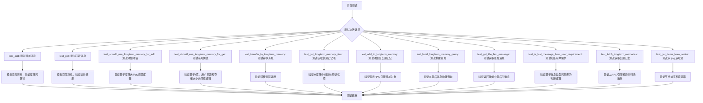

## 类结构

```
TestRoleZeroLongTermMemory (测试类)
├── mock_memory (fixture: 创建模拟内存实例)
├── test_add (方法: 测试添加消息)
├── test_get (方法: 测试获取消息)
├── test_should_use_longterm_memory_for_add (方法: 测试添加至长期记忆的条件)
├── test_should_use_longterm_memory_for_get (方法: 测试从长期记忆获取的条件)
├── test_transfer_to_longterm_memory (方法: 测试转移消息至长期记忆)
├── test_get_longterm_memory_item (方法: 测试获取长期记忆项)
├── test_add_to_longterm_memory (方法: 测试添加项至长期记忆)
├── test_build_longterm_memory_query (方法: 测试构建长期记忆查询)
├── test_get_the_last_message (方法: 测试获取最后一条消息)
├── test_is_last_message_from_user_requirement (方法: 测试判断最后消息是否来自用户需求)
├── test_fetch_longterm_memories (方法: 测试获取长期记忆)
└── test_get_items_from_nodes (方法: 测试从RAG节点获取记忆项)
```

## 全局变量及字段


### `RoleZeroLongTermMemory.storage`
    
存储短期消息的列表，用于缓存最近的消息记录。

类型：`List[Message]`
    


### `RoleZeroLongTermMemory.memory_k`
    
控制是否触发长期记忆存储和检索的阈值参数。

类型：`int`
    


### `RoleZeroLongTermMemory.rag_engine`
    
用于长期记忆存储和检索的检索增强生成引擎实例。

类型：`RAGEngine`
    
    

## 全局函数及方法

### `TestRoleZeroLongTermMemory.mock_memory`

这是一个用于测试的Pytest fixture函数，用于创建并返回一个经过模拟（mock）的`RoleZeroLongTermMemory`实例。它通过模拟`_resolve_rag_engine`方法，简化了内存对象的初始化过程，使其不依赖于实际的RAG引擎，从而便于进行单元测试。

参数：
-  `mocker`：`pytest-mock`库提供的`MockerFixture`类型对象，用于创建和管理模拟对象。

返回值：`RoleZeroLongTermMemory`，一个经过模拟的`RoleZeroLongTermMemory`实例，其`_resolve_rag_engine`方法已被替换为一个不执行任何操作的模拟对象。

#### 流程图

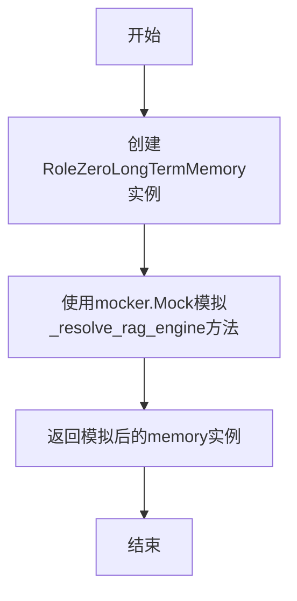

#### 带注释源码

```python
    @pytest.fixture
    # 定义一个Pytest fixture，名为`mock_memory`，用于在测试函数中注入依赖。
    def mock_memory(self, mocker) -> RoleZeroLongTermMemory:
        # 1. 创建RoleZeroLongTermMemory类的实例。
        memory = RoleZeroLongTermMemory()
        # 2. 使用mocker.Mock()替换实例的`_resolve_rag_engine`方法。
        #    这避免了在测试中实际初始化RAG引擎，简化了测试环境。
        memory._resolve_rag_engine = mocker.Mock()
        # 3. 返回这个经过模拟的memory实例，供测试用例使用。
        return memory
```

### `TestRoleZeroLongTermMemory.test_add`

该方法用于测试 `RoleZeroLongTermMemory` 类的 `add` 方法。它模拟了向内存中添加消息的场景，并验证了当满足特定条件时，消息是否被正确存储，以及是否触发了向长期记忆的转移操作。

参数：

- `mocker`：`pytest-mock` 提供的 `MockerFixture` 类型，用于创建和管理模拟对象。
- `mock_memory`：`RoleZeroLongTermMemory` 类型，一个经过模拟的 `RoleZeroLongTermMemory` 实例，用于测试。

返回值：`None`，这是一个测试方法，不返回任何值，主要通过断言来验证测试结果。

#### 流程图

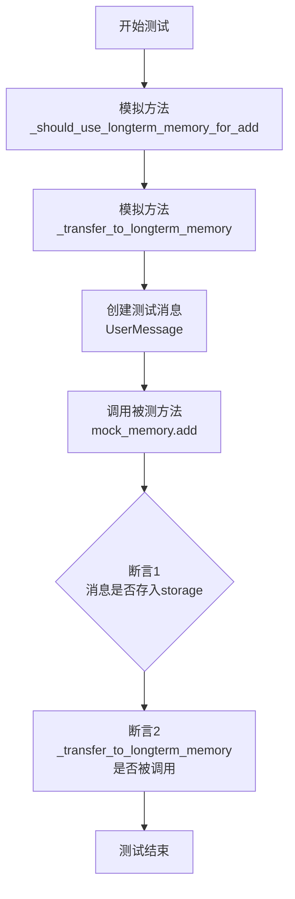

#### 带注释源码

```python
def test_add(self, mocker, mock_memory: RoleZeroLongTermMemory):
    # 1. 模拟（Mock）内部方法，控制其行为
    # 将 _should_use_longterm_memory_for_add 方法模拟为始终返回 True，
    # 表示当前条件满足，需要将消息转移到长期记忆。
    mock_memory._should_use_longterm_memory_for_add = mocker.Mock(return_value=True)
    # 将 _transfer_to_longterm_memory 方法模拟为一个空操作，以便后续验证其是否被调用。
    mock_memory._transfer_to_longterm_memory = mocker.Mock()

    # 2. 准备测试数据
    # 创建一个用户消息作为测试输入。
    message = UserMessage(content="test")

    # 3. 执行被测方法
    # 调用 RoleZeroLongTermMemory 实例的 add 方法，传入测试消息。
    mock_memory.add(message)

    # 4. 验证结果（断言）
    # 断言1：验证传入的消息是否被正确添加到了内存的 storage 列表的末尾。
    assert mock_memory.storage[-1] == message
    # 断言2：验证在满足条件时，_transfer_to_longterm_memory 方法被调用了一次。
    mock_memory._transfer_to_longterm_memory.assert_called_once()
```

### `TestRoleZeroLongTermMemory.test_get`

该方法用于测试 `RoleZeroLongTermMemory` 类的 `get` 方法。它模拟了在启用长期记忆的情况下，`get` 方法如何从长期记忆和短期存储中检索消息，并验证返回结果的正确性。

参数：

- `mocker`：`pytest_mock.plugin.MockerFixture`，用于创建和管理模拟对象。
- `mock_memory`：`RoleZeroLongTermMemory`，通过 `@pytest.fixture` 装饰器提供的模拟 `RoleZeroLongTermMemory` 实例。

返回值：`None`，这是一个测试方法，不返回任何值，仅通过断言验证测试结果。

#### 流程图

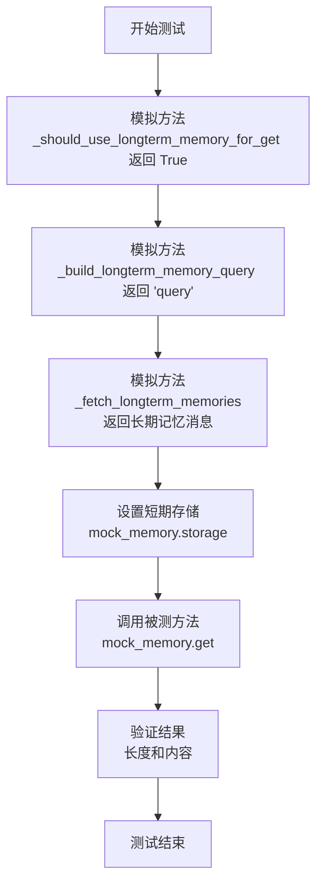

#### 带注释源码

```python
def test_get(self, mocker, mock_memory: RoleZeroLongTermMemory):
    # 模拟 _should_use_longterm_memory_for_get 方法，使其返回 True，表示应使用长期记忆进行检索
    mock_memory._should_use_longterm_memory_for_get = mocker.Mock(return_value=True)
    # 模拟 _build_longterm_memory_query 方法，使其返回一个固定的查询字符串 'query'
    mock_memory._build_longterm_memory_query = mocker.Mock(return_value="query")
    # 模拟 _fetch_longterm_memories 方法，使其返回一个包含长期记忆消息的列表
    mock_memory._fetch_longterm_memories = mocker.Mock(return_value=[Message(content="long-term")])

    # 设置短期存储，模拟其中已有一条短期消息
    mock_memory.storage = [Message(content="short-term")]

    # 调用被测的 get 方法
    result = mock_memory.get()

    # 断言：验证返回结果的长度应为2（长期记忆 + 短期存储）
    assert len(result) == 2
    # 断言：验证第一个元素是来自长期记忆的消息
    assert result[0].content == "long-term"
    # 断言：验证第二个元素是来自短期存储的消息
    assert result[1].content == "short-term"
```

### `TestRoleZeroLongTermMemory.test_should_use_longterm_memory_for_add`

该方法用于测试 `RoleZeroLongTermMemory` 类的 `_should_use_longterm_memory_for_add` 方法。它通过模拟不同的存储状态（`storage` 列表的长度）来验证当存储的消息数量超过设定的 `memory_k` 阈值时，是否应该触发向长期记忆的转移。

参数：

-   `mocker`：`pytest-mock` 提供的 `MockerFixture` 类型，用于创建模拟对象和打补丁。
-   `mock_memory`：`RoleZeroLongTermMemory`，通过 `@pytest.fixture` 装饰的 `mock_memory` 方法提供的测试夹具，是一个模拟的 `RoleZeroLongTermMemory` 实例。

返回值：`None`，这是一个测试方法，不返回任何值，其目的是通过断言来验证代码逻辑。

#### 流程图

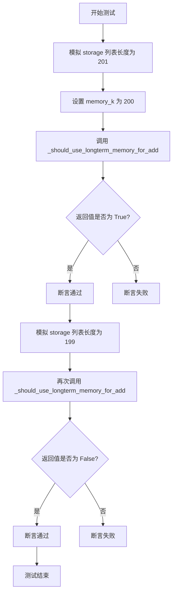

#### 带注释源码

```python
def test_should_use_longterm_memory_for_add(self, mocker, mock_memory: RoleZeroLongTermMemory):
    # 使用 mocker 模拟 mock_memory 对象的 storage 属性，将其设置为一个包含 201 个 None 的列表。
    # 这模拟了短期记忆存储已满（超过 memory_k 阈值）的情况。
    mocker.patch.object(mock_memory, "storage", [None] * 201)

    # 设置 memory_k 阈值为 200。这是触发向长期记忆转移的临界点。
    mock_memory.memory_k = 200

    # 断言：当 storage 长度 (201) > memory_k (200) 时，
    # _should_use_longterm_memory_for_add 方法应返回 True，表示需要转移。
    assert mock_memory._should_use_longterm_memory_for_add() == True

    # 再次使用 mocker 模拟 storage 属性，这次设置为包含 199 个 None 的列表。
    # 这模拟了短期记忆存储未满（未达到 memory_k 阈值）的情况。
    mocker.patch.object(mock_memory, "storage", [None] * 199)
    # 断言：当 storage 长度 (199) <= memory_k (200) 时，
    # _should_use_longterm_memory_for_add 方法应返回 False，表示不需要转移。
    assert mock_memory._should_use_longterm_memory_for_add() == False
```

### `TestRoleZeroLongTermMemory.test_should_use_longterm_memory_for_get`

这是一个单元测试方法，用于测试 `RoleZeroLongTermMemory` 类的 `_should_use_longterm_memory_for_get` 方法。它通过参数化测试验证在不同条件下（如最近消息来源、存储消息数量、查询数量k）是否应使用长期记忆进行查询。

参数：
-  `mocker`：`pytest-mock` 提供的 `MockerFixture` 类型，用于创建和管理模拟对象。
-  `mock_memory`：`RoleZeroLongTermMemory`，被测试的 `RoleZeroLongTermMemory` 类的模拟实例。
-  `k`：`int`，查询时希望获取的最近消息数量。
-  `is_last_from_user`：`bool`，模拟的“最后一条消息是否来自用户需求”的返回值。
-  `count`：`int`，模拟的 `storage` 列表中的消息数量。
-  `expected`：`bool`，期望的测试结果，即 `_should_use_longterm_memory_for_get` 方法应返回的值。

返回值：`None`，这是一个测试方法，不返回业务值，仅通过断言验证测试结果。

#### 流程图

```mermaid
flowchart TD
    A[开始测试] --> B[模拟 is_last_message_from_user_requirement 方法]
    B --> C[模拟 storage 列表长度]
    C --> D[设置 memory_k 阈值]
    D --> E[调用 _should_use_longterm_memory_for_get(k)]
    E --> F{断言返回值 == expected}
    F --> G[测试通过]
    F --> H[测试失败]
```

#### 带注释源码

```python
    @pytest.mark.parametrize(
        "k,is_last_from_user,count,expected",
        [
            (0, True, 201, False),   # 场景1: k=0，无论其他条件如何，都不应使用长期记忆
            (1, False, 201, False),  # 场景2: 最后一条消息非用户需求，不应使用长期记忆
            (1, True, 199, False),   # 场景3: 存储消息数未超过阈值，不应使用长期记忆
            (1, True, 201, True),    # 场景4: 所有条件满足，应使用长期记忆
        ],
    )
    def test_should_use_longterm_memory_for_get(
        self, mocker, mock_memory: RoleZeroLongTermMemory, k, is_last_from_user, count, expected
    ):
        # 模拟 _is_last_message_from_user_requirement 方法的返回值
        mock_memory._is_last_message_from_user_requirement = mocker.Mock(return_value=is_last_from_user)
        # 模拟 storage 属性，使其成为一个包含指定数量（count）个 None 元素的列表
        mocker.patch.object(mock_memory, "storage", [None] * count)
        # 设置 memory_k 属性，作为判断是否使用长期记忆的阈值
        mock_memory.memory_k = 200

        # 调用被测试的方法，并断言其返回值与预期值一致
        assert mock_memory._should_use_longterm_memory_for_get(k) == expected
```

### `TestRoleZeroLongTermMemory.test_transfer_to_longterm_memory`

这是一个单元测试方法，用于测试 `RoleZeroLongTermMemory` 类的 `_transfer_to_longterm_memory` 方法。它通过模拟（Mock）相关依赖，验证了当调用 `_transfer_to_longterm_memory` 时，内部方法 `_get_longterm_memory_item` 和 `_add_to_longterm_memory` 是否被正确调用。

参数：
-  `self`：`TestRoleZeroLongTermMemory`，测试类实例的引用。
-  `mocker`：`MockerFixture`，pytest-mock 提供的模拟对象，用于创建和管理 Mock。
-  `mock_memory`：`RoleZeroLongTermMemory`，一个通过 `@pytest.fixture` 创建的、部分方法被模拟的 `RoleZeroLongTermMemory` 实例。

返回值：`None`，单元测试方法通常不返回值，而是通过断言（assert）来验证测试结果。

#### 流程图

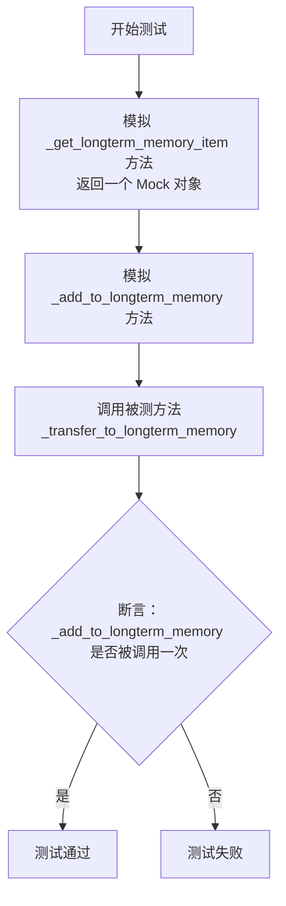

#### 带注释源码

```python
def test_transfer_to_longterm_memory(self, mocker, mock_memory: RoleZeroLongTermMemory):
    # 1. 模拟（Mock）内部方法 _get_longterm_memory_item，使其返回一个预定义的 Mock 对象。
    mock_item = mocker.Mock()
    mock_memory._get_longterm_memory_item = mocker.Mock(return_value=mock_item)
    # 2. 模拟（Mock）内部方法 _add_to_longterm_memory，以便后续验证其调用情况。
    mock_memory._add_to_longterm_memory = mocker.Mock()

    # 3. 执行被测方法：_transfer_to_longterm_memory
    mock_memory._transfer_to_longterm_memory()

    # 4. 断言：验证 _add_to_longterm_memory 方法被调用了一次，
    #    并且调用时传入的参数是 _get_longterm_memory_item 返回的 mock_item。
    #    这确保了 `_transfer_to_longterm_memory` 方法的内部逻辑正确连接了这两个步骤。
    mock_memory._add_to_longterm_memory.assert_called_once_with(mock_item)
```

### `TestRoleZeroLongTermMemory.test_get_longterm_memory_item`

该方法用于测试 `RoleZeroLongTermMemory` 类的 `_get_longterm_memory_item` 方法。它验证了当短期记忆存储（`storage`）中的消息数量超过设定的 `memory_k` 阈值时，该方法能够正确地从 `storage` 中提取最早的消息，并将其封装成一个 `LongTermMemoryItem` 对象返回。

参数：

- `mocker`：`pytest-mock` 提供的 `mocker` 对象，用于创建和管理测试中的模拟对象。
- `mock_memory`：`RoleZeroLongTermMemory`，一个经过模拟的 `RoleZeroLongTermMemory` 实例，用于隔离测试，避免依赖外部组件。

返回值：`None`，这是一个单元测试方法，其主要目的是通过断言（`assert`）来验证代码逻辑，不返回业务值。

#### 流程图

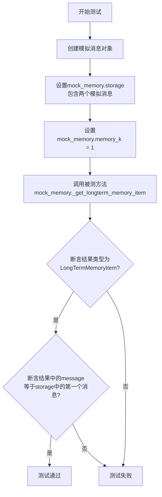

#### 带注释源码

```python
def test_get_longterm_memory_item(self, mocker, mock_memory: RoleZeroLongTermMemory):
    # 1. 准备测试数据：创建一个模拟的 Message 对象，内容为 "test"
    mock_message = Message(content="test")
    # 2. 设置被测对象的状态：将模拟的短期记忆存储设置为包含两个相同的消息对象
    mock_memory.storage = [mock_message, mock_message]
    # 3. 设置被测对象的配置：将 memory_k（触发长期记忆转移的阈值）设置为 1
    mock_memory.memory_k = 1

    # 4. 执行被测方法：调用 _get_longterm_memory_item 方法
    result = mock_memory._get_longterm_memory_item()

    # 5. 验证结果类型：断言返回的对象是 LongTermMemoryItem 类型
    assert isinstance(result, LongTermMemoryItem)
    # 6. 验证结果内容：断言返回的 LongTermMemoryItem 中的 message 字段等于我们最初创建的 mock_message
    #    根据方法逻辑，当 storage 长度 (2) > memory_k (1) 时，应返回 storage 中的第一个元素。
    assert result.message == mock_message
```

### `TestRoleZeroLongTermMemory.test_add_to_longterm_memory`

该方法用于测试 `RoleZeroLongTermMemory` 类的 `_add_to_longterm_memory` 方法，验证其能否正确地将一个 `LongTermMemoryItem` 对象添加到长期记忆的 RAG 引擎中。

参数：

-  `mock_memory`：`RoleZeroLongTermMemory`，一个通过 `@pytest.fixture` 创建的、带有模拟 RAG 引擎的 `RoleZeroLongTermMemory` 测试实例。

返回值：`None`，这是一个单元测试方法，不返回任何值，其目的是通过断言来验证功能。

#### 流程图

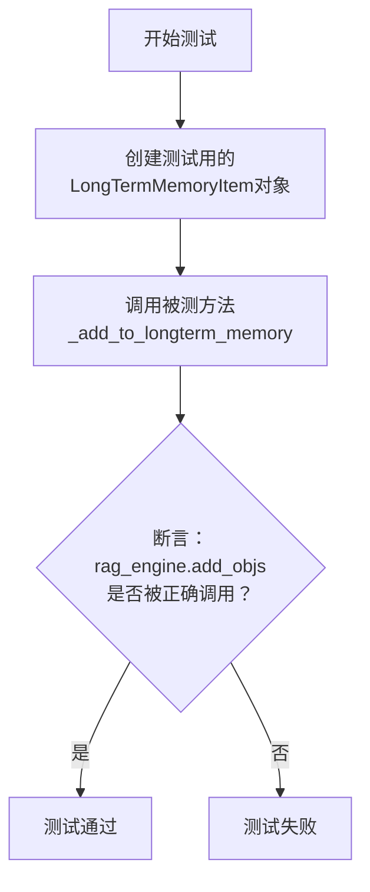

#### 带注释源码

```python
def test_add_to_longterm_memory(self, mock_memory: RoleZeroLongTermMemory):
    # 1. 准备测试数据：创建一个包含测试消息的 LongTermMemoryItem 对象
    item = LongTermMemoryItem(message=Message(content="test"))
    
    # 2. 执行被测方法：调用 RoleZeroLongTermMemory 实例的 _add_to_longterm_memory 方法
    mock_memory._add_to_longterm_memory(item)
    
    # 3. 验证结果：断言 mock_memory 的 rag_engine 的 add_objs 方法被调用了一次，
    #    并且传入的参数是包含我们创建的 item 的列表。
    #    这验证了 _add_to_longterm_memory 方法的核心功能——将项目添加到 RAG 引擎。
    mock_memory.rag_engine.add_objs.assert_called_once_with([item])
```

### `TestRoleZeroLongTermMemory.test_build_longterm_memory_query`

该方法用于测试 `RoleZeroLongTermMemory` 类中的 `_build_longterm_memory_query` 方法。它通过模拟 `_get_the_last_message` 方法的返回值，验证 `_build_longterm_memory_query` 方法是否能正确地从内存存储中获取最后一条消息的内容作为查询字符串。

参数：

- `mocker`：`pytest-mock` 提供的模拟对象，用于创建和管理测试中的模拟对象。
- `mock_memory`：`RoleZeroLongTermMemory`，一个经过模拟的 `RoleZeroLongTermMemory` 实例，用于隔离测试目标方法。

返回值：`None`，这是一个单元测试方法，不返回任何值，其目的是通过断言来验证代码行为。

#### 流程图

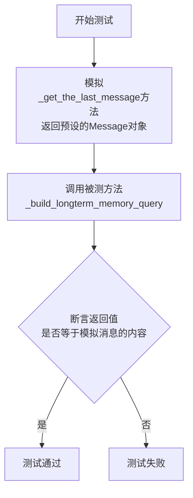

#### 带注释源码

```python
def test_build_longterm_memory_query(self, mocker, mock_memory: RoleZeroLongTermMemory):
    # 1. 准备测试数据：创建一个内容为"query"的Message对象作为模拟的最后一条消息
    mock_message = Message(content="query")
    # 2. 模拟行为：将mock_memory的_get_the_last_message方法替换为返回mock_message的模拟方法
    mock_memory._get_the_last_message = mocker.Mock(return_value=mock_message)

    # 3. 执行被测方法：调用_build_longterm_memory_query，该方法内部应调用_get_the_last_message
    result = mock_memory._build_longterm_memory_query()

    # 4. 验证结果：断言返回的查询字符串等于模拟消息的内容"query"
    assert result == "query"
```

### `TestRoleZeroLongTermMemory.test_get_the_last_message`

这是一个单元测试方法，用于测试 `RoleZeroLongTermMemory` 类的 `_get_the_last_message` 方法。它验证了当内存存储中有多个消息时，该方法能正确返回最后一个消息。

参数：

-   `mock_memory`：`RoleZeroLongTermMemory`，一个通过 `pytest.fixture` 创建的、带有模拟 `_resolve_rag_engine` 方法的 `RoleZeroLongTermMemory` 实例。

返回值：`None`，这是一个测试方法，不返回业务值，仅通过断言验证功能。

#### 流程图

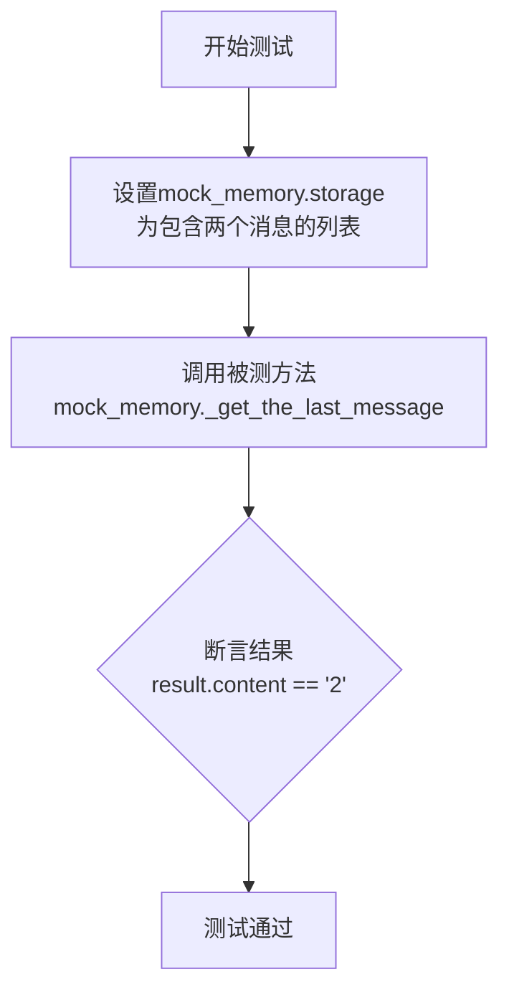

#### 带注释源码

```python
def test_get_the_last_message(self, mock_memory: RoleZeroLongTermMemory):
    # 1. 准备测试数据：为 mock_memory 的 storage 属性设置一个包含两个 Message 对象的列表。
    mock_memory.storage = [Message(content="1"), Message(content="2")]

    # 2. 执行：调用被测的私有方法 `_get_the_last_message`。
    result = mock_memory._get_the_last_message()

    # 3. 断言：验证返回的 Message 对象的内容是否为列表中最后一个元素的内容，即 "2"。
    assert result.content == "2"
```

### `TestRoleZeroLongTermMemory.test_is_last_message_from_user_requirement`

这是一个单元测试方法，用于验证 `RoleZeroLongTermMemory._is_last_message_from_user_requirement` 方法在不同输入下的行为是否符合预期。它通过参数化测试，检查当最后一条消息是不同类型的 `Message` 时，方法是否能正确判断其是否来自用户需求。

参数：

-   `mocker`：`pytest-mock` 提供的 `MockerFixture` 类型，用于创建和管理测试替身（如 Mock 对象）。
-   `mock_memory`：`RoleZeroLongTermMemory`，被测类 `RoleZeroLongTermMemory` 的模拟实例。
-   `message`：`Message`，通过 `@pytest.mark.parametrize` 注入的测试参数，代表 `_get_the_last_message` 方法返回的最后一条消息。
-   `expected`：`bool`，通过 `@pytest.mark.parametrize` 注入的测试参数，代表期望的测试结果。

返回值：`None`，单元测试方法通常不返回值，其通过断言（`assert`）来验证测试结果。

#### 流程图

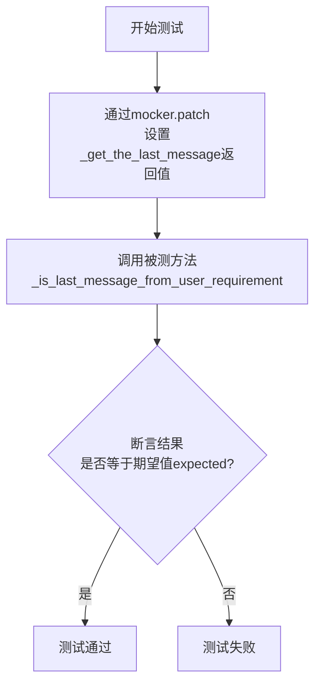

#### 带注释源码

```python
    @pytest.mark.parametrize(
        "message,expected",  # 定义参数化测试的参数名
        [
            # 测试用例1: 最后一条消息是UserMessage且cause_by为UserRequirement，应返回True
            (UserMessage(content="test", cause_by=UserRequirement), True),
            # 测试用例2: 最后一条消息是UserMessage且sent_from为TEAMLEADER_NAME，应返回True
            (UserMessage(content="test", sent_from=TEAMLEADER_NAME), True),
            # 测试用例3: 最后一条消息是普通的UserMessage，应返回True
            (UserMessage(content="test"), True),
            # 测试用例4: 最后一条消息是AIMessage，应返回False
            (AIMessage(content="test"), False),
            # 测试用例5: 最后一条消息为None，应返回False
            (None, False),
        ],
    )
    def test_is_last_message_from_user_requirement(
        self, mocker, mock_memory: RoleZeroLongTermMemory, message, expected
    ):
        # 模拟（Mock）被测对象mock_memory的_get_the_last_message方法，使其返回预设的message
        mock_memory._get_the_last_message = mocker.Mock(return_value=message)

        # 调用被测方法_is_last_message_from_user_requirement
        # 并断言其返回值是否与期望值expected相等
        assert mock_memory._is_last_message_from_user_requirement() == expected
```

### `TestRoleZeroLongTermMemory.test_fetch_longterm_memories`

这是一个单元测试方法，用于测试 `RoleZeroLongTermMemory` 类的 `_fetch_longterm_memories` 方法。它模拟了从长期记忆（RAG引擎）中检索记忆项的过程，并验证返回的记忆项是否正确。

参数：

- `mocker`：`pytest-mock` 提供的 `MockerFixture` 类型，用于创建和管理模拟对象。
- `mock_memory`：`RoleZeroLongTermMemory` 类型，一个被模拟的 `RoleZeroLongTermMemory` 实例，作为测试对象。

返回值：`None`，这是一个测试方法，不返回业务值，仅通过断言验证测试结果。

#### 流程图

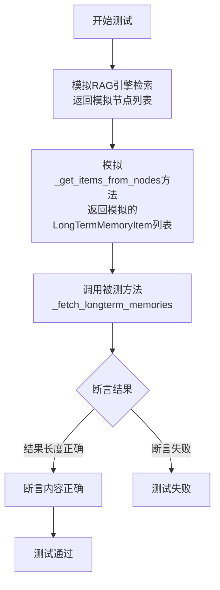

#### 带注释源码

```python
def test_fetch_longterm_memories(self, mocker, mock_memory: RoleZeroLongTermMemory):
    # 1. 模拟RAG引擎的retrieve方法，使其返回一个包含两个模拟节点的列表。
    mock_nodes = [mocker.Mock(), mocker.Mock()]
    mock_memory.rag_engine.retrieve = mocker.Mock(return_value=mock_nodes)
    
    # 2. 模拟_get_items_from_nodes方法，使其返回一个包含两个LongTermMemoryItem的列表。
    #    这些项分别包装了UserMessage和AIMessage。
    mock_items = [
        LongTermMemoryItem(message=UserMessage(content="user1")),
        LongTermMemoryItem(message=AIMessage(content="ai1")),
    ]
    mock_memory._get_items_from_nodes = mocker.Mock(return_value=mock_items)

    # 3. 调用被测试的私有方法 _fetch_longterm_memories，并传入查询字符串。
    result = mock_memory._fetch_longterm_memories("query")

    # 4. 进行断言验证：
    #    a. 返回的列表长度应为2。
    assert len(result) == 2
    #    b. 验证返回的第一个消息内容是"user1"。
    assert result[0].content == "user1"
    #    c. 验证返回的第二个消息内容是"ai1"。
    assert result[1].content == "ai1"
```

### `TestRoleZeroLongTermMemory.test_get_items_from_nodes`

这是一个单元测试方法，用于验证 `RoleZeroLongTermMemory` 类的 `_get_items_from_nodes` 方法的功能。它模拟了从 RAG 引擎检索到的节点数据，测试 `_get_items_from_nodes` 方法是否能正确地从这些节点中提取 `LongTermMemoryItem` 对象，并按照其创建时间（`created_at`）进行升序排序。

参数：

-   `self`：`TestRoleZeroLongTermMemory`，测试类实例的引用。
-   `mocker`：`pytest-mock` 提供的 `MockerFixture` 对象，用于创建和管理模拟对象。
-   `mock_memory`：`RoleZeroLongTermMemory`，一个被模拟的 `RoleZeroLongTermMemory` 实例，作为测试的目标对象。

返回值：`None`，这是一个测试方法，不返回任何值，其目的是通过断言来验证代码行为。

#### 流程图

```mermaid
flowchart TD
    A[开始测试] --> B[创建模拟节点列表<br>mock_nodes]
    B --> C[调用被测方法<br>mock_memory._get_items_from_nodes<br>传入 mock_nodes]
    C --> D[方法内部：<br>1. 从每个节点的 metadata['obj']<br>提取 LongTermMemoryItem<br>2. 按 item.created_at 升序排序]
    D --> E[返回排序后的<br>LongTermMemoryItem 列表]
    E --> F[断言：<br>1. 返回列表长度为3<br>2. 列表内容顺序为 '1', '2', '3']
    F --> G[测试通过]
```

#### 带注释源码

```python
def test_get_items_from_nodes(self, mocker, mock_memory: RoleZeroLongTermMemory):
    # 获取当前时间，用于构造具有不同时间戳的测试数据
    now = datetime.now()
    # 创建三个模拟的节点对象，每个节点的 metadata 字典中包含一个 LongTermMemoryItem
    # 每个 LongTermMemoryItem 包含一个 Message 和创建时间戳 (created_at)
    # 时间戳被设置为过去的不同时间点，以测试排序功能
    mock_nodes = [
        mocker.Mock(
            metadata={
                "obj": LongTermMemoryItem(
                    message=Message(content="2"), created_at=(now - timedelta(minutes=1)).timestamp()
                )
            }
        ),
        mocker.Mock(
            metadata={
                "obj": LongTermMemoryItem(
                    message=Message(content="1"), created_at=(now - timedelta(minutes=2)).timestamp()
                )
            }
        ),
        mocker.Mock(metadata={"obj": LongTermMemoryItem(message=Message(content="3"), created_at=now.timestamp())}),
    ]

    # 调用被测的私有方法 `_get_items_from_nodes`，传入模拟的节点列表
    result = mock_memory._get_items_from_nodes(mock_nodes)

    # 断言1：验证返回的列表包含3个元素
    assert len(result) == 3
    # 断言2：验证返回的 LongTermMemoryItem 列表是按照其内部 message 的 content 属性排序的。
    # 由于创建时间戳的顺序是：'1' (最早), '2', '3' (最晚)，排序后应为 ['1', '2', '3']。
    # 这里通过列表推导式提取每个 item 的 message.content 来验证顺序。
    assert [item.message.content for item in result] == ["1", "2", "3"]
```

## 关键组件


### RoleZeroLongTermMemory

RoleZeroLongTermMemory 是一个实现了长短期记忆混合存储机制的类，它结合了内存中的短期存储（storage）和外部检索增强生成（RAG）引擎的长期存储，用于智能地管理对话历史或任务上下文信息。

### 长短期记忆混合策略

该类通过 `memory_k` 阈值和消息来源（如用户需求）等条件，动态决定何时将短期记忆转移到长期存储（`_should_use_longterm_memory_for_add`），以及何时从长期存储中检索记忆以补充短期记忆（`_should_use_longterm_memory_for_get`）。

### 记忆转移与检索流程

包含将短期记忆项封装为 `LongTermMemoryItem` 并存入 RAG 引擎的流程（`_transfer_to_longterm_memory`），以及根据查询从 RAG 引擎检索、排序并返回相关记忆项的流程（`_fetch_longterm_memories`）。

### RAG 引擎集成

作为关键的外部依赖组件，RAG 引擎（`rag_engine`）负责长期记忆的向量化存储与语义检索。`RoleZeroLongTermMemory` 通过 `_resolve_rag_engine` 方法初始化该引擎，并调用其 `add_objs` 和 `retrieve` 方法进行数据的持久化与查询。

### 记忆项封装与排序

`LongTermMemoryItem` 作为长期记忆的封装单元，包含原始消息和创建时间戳。`_get_items_from_nodes` 方法负责从 RAG 引擎返回的节点中提取这些记忆项，并按照创建时间进行升序排序，以维持上下文的时间连贯性。

### 用户意图识别

通过 `_is_last_message_from_user_requirement` 方法判断最新消息是否源自用户需求（例如，消息的 `cause_by` 为 `UserRequirement` 或发送者为团队领导），此判断是触发长期记忆检索的关键条件之一。


## 问题及建议


### 已知问题

-   **测试用例对内部实现细节依赖过强**：多个测试方法（如 `test_add`, `test_get`, `test_transfer_to_longterm_memory`）直接模拟（Mock）了被测试类的私有方法（如 `_should_use_longterm_memory_for_add`, `_transfer_to_longterm_memory`）。这使得测试与具体实现紧密耦合，一旦内部逻辑（如方法名、调用时机）发生变化，即使类的对外行为不变，测试也需要同步修改，降低了测试的健壮性和作为“行为契约”的价值。
-   **测试数据构造存在潜在风险**：在 `test_should_use_longterm_memory_for_add` 和 `test_should_use_longterm_memory_for_get` 测试中，使用 `[None] * count` 来模拟存储列表。虽然能快速创建指定长度的列表，但如果被测试代码依赖于列表中元素的具体属性（而非仅长度），这种构造方式可能掩盖潜在的空指针或类型错误。
-   **部分测试断言不够精确**：例如在 `test_add` 中，断言 `mock_memory._transfer_to_longterm_memory.assert_called_once()` 仅验证了方法被调用，但未验证其调用参数（虽然当前方法无参）。在 `test_get_longterm_memory_item` 中，断言 `result.message == mock_message` 比较的是对象引用，如果 `_get_longterm_memory_item` 方法内部创建了新的 `Message` 对象副本，此断言将失败，尽管功能可能正确。
-   **时间敏感测试的潜在不稳定性**：`test_get_items_from_nodes` 测试依赖于 `datetime.now()` 生成测试数据，并断言排序结果。虽然当前逻辑是稳定的，但如果排序算法或时间戳处理逻辑稍有变化（例如精度到微秒），或者测试在极短时间内运行，可能因时间戳相同导致排序结果不确定，从而使测试间歇性失败。

### 优化建议

-   **重构测试以面向行为而非实现**：建议将测试重点从“验证私有方法是否被调用”转向“验证公开方法（如 `add`, `get`）在给定输入下产生预期的输出或状态变化”。例如，`test_add` 可以通过设置 `memory_k` 和填充 `storage` 来触发内部转移逻辑，然后验证 `storage` 状态和 `rag_engine.add_objs` 是否被调用，而不是直接模拟 `_transfer_to_longterm_memory`。
-   **使用更真实的测试数据**：在需要模拟 `storage` 内容时，应创建真实的 `Message` 对象或其简化版，而不是使用 `None`。这有助于发现与数据内容相关的边界条件错误。
-   **增强断言的精确性和可读性**：
    -   对于模拟调用，应使用 `assert_called_once_with(...)` 来验证调用参数。
    -   对于对象比较，考虑比较关键属性（如 `content`）或使用 `unittest.mock.ANY` 来忽略不关心的部分。
    -   使用 `pytest` 的参数化功能来更清晰地表达多种测试场景。
-   **隔离时间依赖**：对于 `test_get_items_from_nodes`，可以将时间生成逻辑提取为一个可配置的函数或使用 `unittest.mock.patch` 来固定 `datetime.now()` 的返回值，确保测试数据完全可控，消除因系统时间变化导致的不确定性。
-   **补充关键场景的测试用例**：
    -   `memory_k` 为 0 或负数时的边界情况。
    -   `storage` 为空时 `_get_the_last_message` 和 `_is_last_message_from_user_requirement` 的行为。
    -   `rag_engine.retrieve` 返回空列表或 `None` 时 `_fetch_longterm_memories` 的行为。
    -   验证长短期记忆合并后的顺序是否符合业务预期（长期在前，短期在后）。
-   **考虑测试结构的清晰度**：当前测试类包含了从单元到集成（涉及 `rag_engine`）的多种测试。可以考虑按测试层次（纯逻辑单元测试 vs. 依赖外部组件的集成测试）或功能模块进行更细粒度的组织，使测试意图更明确。


## 其它


### 设计目标与约束

本模块 `TestRoleZeroLongTermMemory` 是一个针对 `RoleZeroLongTermMemory` 类的单元测试套件。其核心设计目标是验证 `RoleZeroLongTermMemory` 类中长短期内存管理、消息转移、检索等核心逻辑的正确性。约束条件包括：1) 必须使用 `pytest` 框架；2) 测试应完全隔离，通过 `mocker` 模拟所有外部依赖（如 `rag_engine`）；3) 测试用例需覆盖正常流程、边界条件及参数化场景；4) 测试数据应自包含，不依赖外部系统状态。

### 错误处理与异常设计

当前测试代码主要验证功能逻辑的正确性，并未显式测试 `RoleZeroLongTermMemory` 类的错误处理或异常抛出。例如，未测试当 `rag_engine` 未初始化或 `storage` 为空时相关方法（如 `_get_the_last_message`）的行为。测试本身通过 `mocker` 确保了依赖对象的可控性，避免了因外部依赖失败导致的测试中断。测试用例的设计侧重于“快乐路径”和特定条件分支，而非异常流。

### 数据流与状态机

测试数据流围绕 `mock_memory` 对象的状态变化展开：
1.  **初始化**：通过 `@pytest.fixture` 创建并注入模拟的 `RoleZeroLongTermMemory` 实例，其 `_resolve_rag_engine` 方法被模拟。
2.  **状态设置**：在每个测试方法中，通过 `mocker.patch.object` 或直接赋值来设置 `mock_memory` 的内部状态（如 `storage`, `memory_k`）和行为（如模拟 `_should_use_longterm_memory_for_add` 的返回值）。
3.  **操作与验证**：调用被测方法（如 `add`, `get`），然后使用 `assert` 语句验证：a) 对象状态是否符合预期（如 `storage` 内容）；b) 模拟的依赖方法是否按预期被调用（如 `assert_called_once`）；c) 方法返回值是否正确。
4.  **参数化数据流**：`@pytest.mark.parametrize` 用于向测试方法注入多组输入参数和期望结果，验证方法在不同输入组合下的行为，覆盖了 `_should_use_longterm_memory_for_get` 和 `_is_last_message_from_user_requirement` 的逻辑分支。

### 外部依赖与接口契约

测试明确识别并模拟了 `RoleZeroLongTermMemory` 的所有关键外部依赖：
1.  **`rag_engine` 对象**：在 `_add_to_longterm_memory` 和 `_fetch_longterm_memories` 测试中被模拟。测试验证了 `add_objs` 和 `retrieve` 方法的调用参数符合预期接口契约。
2.  **`Message` 及其子类 (`UserMessage`, `AIMessage`)**：作为核心数据结构被直接使用，测试验证了代码对不同消息类型的处理逻辑。
3.  **`LongTermMemoryItem`**：作为长时记忆的存储单元被使用和验证。
4.  **`UserRequirement` 和 `TEAMLEADER_NAME`**：作为常量用于判断消息来源，测试验证了基于这些常量的条件逻辑。
测试通过完全模拟这些依赖，确保了测试的独立性和可重复性，不依赖于这些外部组件的具体实现或运行环境。

    