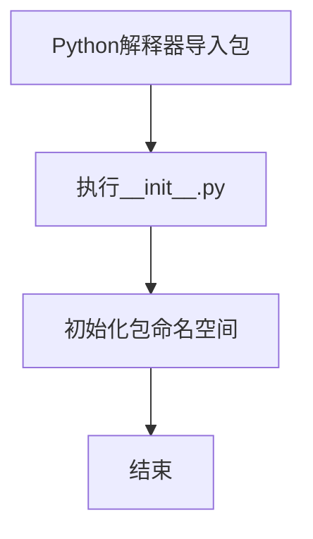

# `.\MetaGPT\tests\metagpt\provider\__init__.py` 详细设计文档

该文件是一个Python包的初始化文件，通常用于定义包的公共接口、执行初始化代码或声明包的元数据。从提供的代码片段来看，它仅包含标准的文件头注释（如作者、创建时间等），没有定义任何类、函数、变量或可执行逻辑。因此，其核心功能是标记当前目录为一个Python包，并可能在未来用于组织模块或定义包级别的配置。

## 整体流程



## 类结构

```
无类层次结构
当前文件未定义任何类
```

## 全局变量及字段


    

## 全局函数及方法


## 关键组件


### 初始化模块

此文件是一个Python包的初始化模块（__init__.py），用于定义包的公共接口和初始化行为。当前版本为空，表明该包在导入时无需执行特殊初始化，其功能由包内的其他模块提供。


## 问题及建议


### 已知问题

-   **空文件问题**：当前 `__init__.py` 文件为空，仅包含元信息注释。这通常意味着该包（模块）尚未定义任何需要导出的公共接口、类或函数，可能导致其他代码在导入此模块时无法获得预期的功能或对象。
-   **缺乏明确导出**：空白的 `__init__.py` 文件使得包的公共 API 不清晰。使用者需要深入查看子模块才能了解可用内容，增加了使用复杂度和出错风险。
-   **潜在的结构不完整**：这可能表明项目结构尚在早期阶段，或者该目录本不应作为一个Python包，但被 `__init__.py` 文件意外标记成了包。

### 优化建议

-   **定义包级导出**：如果此目录应作为一个Python包，应在 `__init__.py` 中使用 `__all__` 列表或显式导入语句，清晰地导出希望对外公开的类、函数或变量。例如：
    ```python
    # 示例：从当前目录的模块中导入并公开特定内容
    from .some_module import MyClass, my_function
    __all__ = ['MyClass', 'my_function']
    ```
-   **明确包用途**：添加包级别的文档字符串（docstring），简要说明此包的目的、主要功能或包含的子模块，提高代码可读性和可维护性。
-   **评估包的必要性**：如果此目录下没有需要共享的代码，或者其内容应完全由上层模块管理，考虑移除 `__init__.py` 文件，将其视为普通目录而非Python包。
-   **遵循项目规范**：确保 `__init__.py` 的编写风格（如导入方式、`__all__` 的使用）与项目中其他包保持一致。


## 其它


### 设计目标与约束

该代码文件是一个Python包的初始化文件（`__init__.py`），其主要设计目标是定义当前目录为一个Python包，并可能用于初始化包的命名空间、控制包的导入行为或执行包的启动代码。在当前代码片段中，该文件仅包含元数据注释（如作者、时间），未包含任何可执行代码或变量定义，因此其核心功能仅限于标识包的存在。约束包括必须遵循Python的包结构规范，且通常应保持轻量级，避免在此处执行复杂的逻辑或导入大量模块，以防止循环导入或启动性能问题。

### 错误处理与异常设计

由于当前`__init__.py`文件不包含任何函数、类或可执行语句，因此不存在显式的错误处理或异常设计。任何错误（如语法错误、导入错误）将由Python解释器在加载包时直接抛出。未来若在此文件中添加代码，应考虑适当的异常捕获和处理机制，例如在导入子模块时使用`try-except`块处理`ImportError`，确保包的健壮性。

### 数据流与状态机

当前文件不涉及任何数据处理或状态管理，因此没有数据流或状态机设计。它仅作为包的入口点，不维护内部状态或处理输入/输出数据。如果未来扩展功能（如包级配置加载），可能需要定义数据流（如从配置文件读取设置）或简单状态（如初始化标志），但目前均为空。

### 外部依赖与接口契约

该文件本身没有外部依赖（未导入任何模块），也不定义任何外部接口（如函数、类）。其接口契约隐含于Python包机制中：它允许其他代码通过`import`语句导入该包或其子模块。任何对该包的依赖应通过标准导入方式实现，且当前未暴露任何公共API。

### 安全与合规性考虑

当前代码仅包含注释和空结构，无安全风险。但作为包入口，未来添加代码时应考虑安全性，例如避免执行未经验证的外部数据、保护敏感配置信息。合规性方面，需确保代码符合Python编码规范（PEP 8），且注释中的元数据（如作者信息）符合项目要求。

### 测试策略

由于文件为空，无需编写测试用例。但若未来添加逻辑（如初始化函数），应设计单元测试以验证其行为，例如测试包导入是否成功、初始化代码是否按预期执行。测试应覆盖正常情况和异常情况（如依赖缺失）。

### 部署与运维说明

该文件作为Python包的一部分，部署时需随整个包目录一起分发。无需特殊运维操作，但应确保在目标环境中Python解释器版本兼容。如果未来包含初始化逻辑，需在部署文档中说明其影响（如启动时资源消耗）。

### 扩展性与维护性

当前设计高度简单，易于维护。扩展性方面，可通过在`__init__.py`中添加`__all__`列表控制公开接口，或定义包级变量/函数以提供统一入口。建议保持代码简洁，避免过度复杂化，以支持长期维护。

    