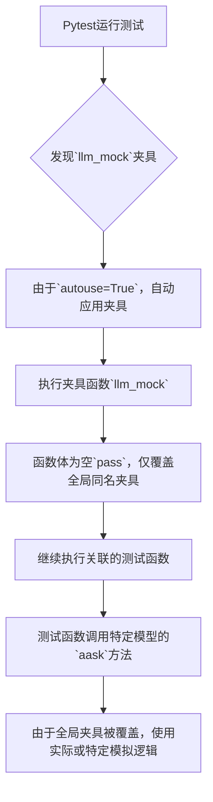
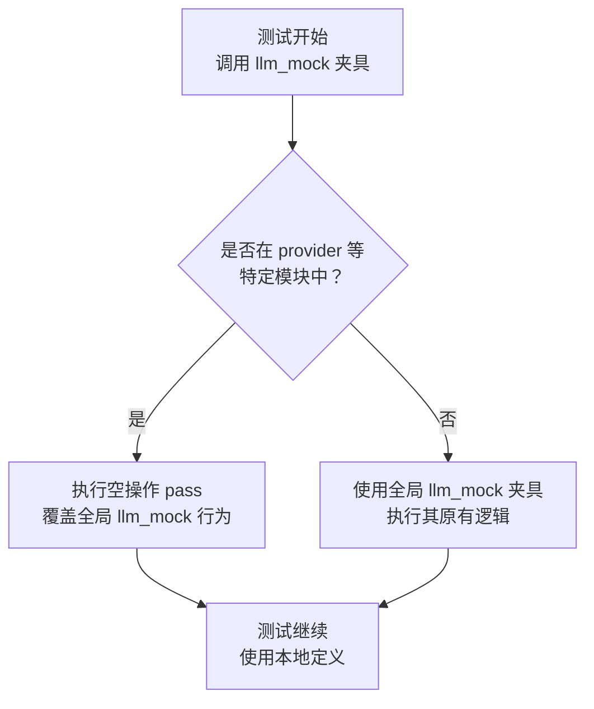

# `.\MetaGPT\tests\metagpt\provider\conftest.py` 详细设计文档

该代码是一个Pytest测试文件，其核心功能是定义一个名为`llm_mock`的测试夹具（fixture），该夹具通过`autouse=True`参数自动应用于同一模块内的所有测试函数。其主要目的是在特定的测试上下文（如`provider`文件夹）中，覆盖一个全局的同名`llm_mock`夹具，以确保测试能够针对特定模型（如Llama、GPT-2等）的`aask`函数进行，而不受全局模拟的影响。

## 整体流程



## 类结构

```
Pytest Fixture (测试夹具)
└── llm_mock (特定上下文覆盖夹具)
```

## 全局变量及字段


    

## 全局函数及方法

### `llm_mock`

这是一个使用 `pytest` 框架定义的测试夹具（fixture）。它的核心功能是作为一个“空”的占位符，用于在特定的测试模块（例如 `provider` 文件夹下的测试）中覆盖（override）一个全局的同名 `llm_mock` 夹具。这样做的目的是允许在特定上下文中测试 `aask` 等函数，而不受全局夹具行为的影响。

参数：

- `rsp_cache`：`Any`，一个用于缓存响应的夹具或对象，具体类型由上游夹具定义。
- `mocker`：`MockerFixture`，`pytest-mock` 插件提供的 `mocker` 对象，用于模拟（mock）函数或对象。
- `request`：`SubRequest`，`pytest` 提供的 `request` 对象，包含当前测试请求的上下文信息（如测试函数、模块等）。

返回值：`None`，此夹具不返回任何值。

#### 流程图



#### 带注释源码

```python
import pytest  # 导入 pytest 测试框架

# 使用 @pytest.fixture 装饰器声明一个测试夹具
# autouse=True 表示该夹具会自动应用于同一模块中的所有测试函数，无需显式请求
@pytest.fixture(autouse=True)
def llm_mock(rsp_cache, mocker, request):  # 定义夹具函数，接收三个参数
    # 一个空的夹具，用于覆盖全局的 llm_mock 夹具
    # 因为在 provider 文件夹中，我们希望测试特定模型的 aask 和 aask 函数
    # （原文注释中的 'aask and aask functions' 可能为笔误，应为 'aask 等函数'）
    pass  # 函数体为空，仅作为占位符，不执行任何操作
```

## 关键组件


### pytest 测试框架

用于编写和运行单元测试的 Python 测试框架，提供了测试发现、夹具（fixture）管理、断言等功能。

### pytest.fixture 装饰器

用于定义测试夹具（fixture），这是一种在测试函数运行前后提供预置条件和清理工作的机制。`autouse=True` 参数表示该夹具会自动应用于所有测试，无需显式请求。

### rsp_cache 夹具

一个预定义的夹具，推测用于缓存或模拟 LLM（大语言模型）的响应，以提高测试速度或实现离线测试。

### mocker 夹具

一个预定义的夹具，通常来自 `pytest-mock` 插件，用于在测试中创建模拟对象（mock），以隔离被测代码与其依赖项。

### request 夹具

一个内建的 pytest 夹具，提供关于当前测试请求的上下文信息，例如测试函数、夹具参数等。

### llm_mock 夹具

一个自定义的测试夹具，其目的是在特定的 `provider` 文件夹中覆盖全局的 `llm_mock` 夹具。它通过 `pass` 语句实现为空，以确保在该上下文中测试特定模型的 `aask` 函数时，不会使用全局的模拟逻辑，从而允许进行更精确的针对性测试。


## 问题及建议


### 已知问题

-   **空实现可能掩盖依赖问题**：`llm_mock` 函数体为空 (`pass`)，其目的是覆盖全局的 `llm_mock` fixture。如果全局 fixture 执行了关键的初始化、清理或模拟设置，此空实现将导致这些操作被跳过，可能使得当前测试文件中的测试用例依赖于未被正确模拟的外部服务（如 LLM），从而产生不可预知的测试行为或网络调用。
-   **意图不明确**：仅通过函数名和注释，难以精确理解“覆盖全局 fixture”的具体目的和范围。是希望完全禁用模拟，还是希望使用不同的模拟策略？这种模糊性增加了代码的维护和理解成本。
-   **潜在的测试污染风险**：由于此 fixture 使用了 `autouse=True`，它会自动应用于该文件中的所有测试。如果本意并非所有测试都需要此覆盖行为，这种全局性应用可能导致一些测试在不期望的环境下运行，造成测试结果的混淆。

### 优化建议

-   **明确覆盖行为并添加必要逻辑**：建议在 `llm_mock` fixture 内部实现明确的模拟逻辑，或者至少调用被它覆盖的全局 fixture 以确保基础环境一致。例如，可以获取并返回全局 fixture 的值（如果适用），或者显式地设置一个符合当前测试文件需求的、确定的模拟状态。这能确保测试环境的可控性和一致性。
-   **考虑使用更精确的作用域**：评估 `autouse=True` 的必要性。如果只有部分测试用例需要覆盖全局的 LLM 模拟，应将 `autouse` 改为 `False`，并仅在需要的测试函数或类上通过参数显式使用该 fixture。这可以提高测试的精确度和可读性。
-   **增强文档和命名**：在注释中更详细地说明覆盖全局 fixture 的原因、期望达成的测试状态（例如，“在本文件中，我们希望实际调用模型 X 的 API 进行集成测试”或“使用一个更简单的模拟器 Y 来替换复杂的全局模拟”）。如果可能，为 fixture 起一个更具描述性的名字，如 `disable_llm_mock_for_provider_tests`。
-   **评估架构设计**：从更高层面审视，是否存在大量测试文件需要类似“特殊处理”的情况。如果是，这可能表明全局的 `llm_mock` fixture 设计过于僵化或职责过重。考虑将其重构为更模块化、可组合的 fixture 集合，允许测试文件通过导入和组合所需的部分，而不是通过空覆盖来“破坏”全局行为。


## 其它


### 设计目标与约束

本代码片段的设计目标是提供一个测试级别的“空”pytest fixture，用于在特定的测试模块（provider文件夹）中覆盖一个全局的同名fixture。其核心约束是：必须使用`@pytest.fixture(autouse=True)`装饰器，确保该fixture在每个测试用例中自动执行；同时，它必须接收`rsp_cache`、`mocker`和`request`这三个参数，以保持与上层fixture的接口兼容性，但其函数体为空，目的是“屏蔽”或“重置”全局fixture的行为，以便在特定上下文中测试模型原生的`aask`等功能。

### 错误处理与异常设计

本代码片段不包含任何显式的错误处理逻辑。其功能是声明性的，依赖于pytest框架自身的fixture生命周期管理和依赖注入机制。如果传入的参数（`rsp_cache`、`mocker`、`request`）不符合pytest fixture的约定或不存在，pytest框架会在测试收集或执行阶段抛出相应的异常（如`FixtureLookupError`）。代码本身没有抛出或捕获自定义异常的意图。

### 数据流与状态机

数据流非常简单且单向：
1.  **输入**：在测试执行前，pytest框架根据fixture定义，将`rsp_cache`、`mocker`和`request`三个对象注入到`llm_mock`函数中。
2.  **处理**：`llm_mock`函数体为空（`pass`），不进行任何数据处理或状态变更。它不修改传入的参数，也不产生新的数据。
3.  **输出/影响**：该fixture的主要“输出”是其副作用——由于`autouse=True`且其名称与全局fixture相同，它有效地覆盖了全局fixture，使得后续在同一个测试模块中，对`llm_mock`的引用指向这个空实现，从而改变了测试环境（即禁用了全局的LLM模拟行为）。没有显式的返回值。

不存在复杂的状态机。fixture的执行是pytest测试生命周期中的一个确定环节。

### 外部依赖与接口契约

1.  **外部依赖**：
    *   **pytest框架**：核心依赖，提供了`@pytest.fixture`装饰器、`autouse`参数、以及fixture参数注入机制。
    *   **`rsp_cache` fixture**：一个假设存在于pytest fixture作用域中的对象，其具体类型和功能由外部定义，本代码仅声明对其的依赖。
    *   **`mocker` fixture**：通常指`pytest-mock`插件提供的`mocker` fixture，用于模拟对象。本代码仅声明依赖。
    *   **`request` fixture**：pytest内置的fixture，提供当前测试请求的上下文信息。本代码仅声明依赖。

2.  **接口契约**：
    *   **函数签名**：`def llm_mock(rsp_cache, mocker, request):`。这是一个严格的契约，调用方（pytest）必须能够提供这三个参数。
    *   **装饰器契约**：必须使用`@pytest.fixture(autouse=True)`进行装饰，这定义了其作为自动应用fixture的行为。
    *   **行为契约**：函数体为`pass`，承诺不执行任何操作，其唯一目的是通过覆盖来影响测试环境。

    