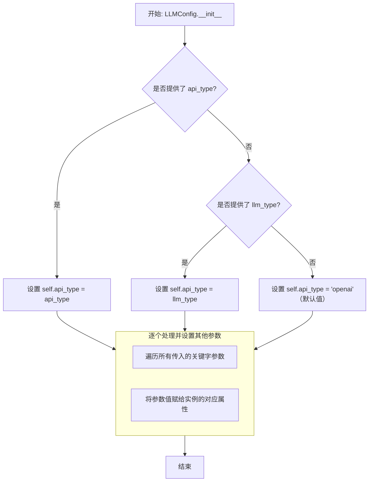

# `.\MetaGPT\tests\metagpt\provider\mock_llm_config.py` 详细设计文档

该文件是一个用于测试和开发的配置文件，它创建了多个不同大语言模型（LLM）服务提供商（如OpenAI、Azure、智谱、讯飞星火等）的模拟配置实例。这些实例基于一个统一的配置类（LLMConfig），通过传入不同的参数（如API类型、密钥、基础URL、模型名称等）来模拟各种真实场景下的LLM配置，方便在不连接真实API的情况下进行代码测试和功能验证。

## 整体流程

```mermaid
graph TD
    A[开始执行脚本] --> B[导入LLMConfig类]
    B --> C[创建第一个mock配置 (mock_llm_config)]
    C --> D[创建带代理的mock配置 (mock_llm_config_proxy)]
    D --> E[创建Azure配置 (mock_llm_config_azure)]
    E --> F[创建智谱AI配置 (mock_llm_config_zhipu)]
    F --> G[创建讯飞星火配置 (mock_llm_config_spark)]
    G --> H[创建百度千帆配置 (mock_llm_config_qianfan)]
    H --> I[创建阿里灵积配置 (mock_llm_config_dashscope)]
    I --> J[创建Anthropic配置 (mock_llm_config_anthropic)]
    J --> K[创建AWS Bedrock配置 (mock_llm_config_bedrock)]
    K --> L[创建ARK配置 (mock_llm_config_ark)]
    L --> M[脚本执行结束，所有配置变量可用]
```

## 类结构

```
LLMConfig (配置类，来自metagpt.configs.llm_config)
├── 不直接继承，但被用于实例化多个配置对象
└── 每个mock_llm_config_* 变量都是LLMConfig的一个实例
```

## 全局变量及字段


### `mock_llm_config`
    
用于测试的通用Mock LLM配置对象，包含基本的API认证和模型信息

类型：`LLMConfig`
    


### `mock_llm_config_proxy`
    
包含代理服务器设置的Mock LLM配置对象

类型：`LLMConfig`
    


### `mock_llm_config_azure`
    
模拟Azure OpenAI服务配置，包含API版本和代理设置

类型：`LLMConfig`
    


### `mock_llm_config_zhipu`
    
模拟智谱AI（Zhipu）服务配置，包含特定模型和代理设置

类型：`LLMConfig`
    


### `mock_llm_config_spark`
    
模拟讯飞星火（Spark）服务配置，包含WebSocket连接和特定领域参数

类型：`LLMConfig`
    


### `mock_llm_config_qianfan`
    
模拟百度千帆（Qianfan）服务配置，使用访问密钥和特定模型

类型：`LLMConfig`
    


### `mock_llm_config_dashscope`
    
模拟阿里云灵积（DashScope）服务配置，包含API密钥和模型名称

类型：`LLMConfig`
    


### `mock_llm_config_anthropic`
    
模拟Anthropic Claude服务配置，包含官方API端点

类型：`LLMConfig`
    


### `mock_llm_config_bedrock`
    
模拟AWS Bedrock服务配置，包含区域、访问密钥和最大令牌数

类型：`LLMConfig`
    


### `mock_llm_config_ark`
    
模拟ARK（未知服务商）配置，包含自定义API密钥和模型标识

类型：`LLMConfig`
    


### `LLMConfig.llm_type`
    
LLM服务类型标识符，用于区分不同的LLM提供商

类型：`str`
    


### `LLMConfig.api_key`
    
访问LLM API所需的主要认证密钥

类型：`str`
    


### `LLMConfig.base_url`
    
LLM API服务的基础URL端点

类型：`str`
    


### `LLMConfig.app_id`
    
某些LLM服务（如讯飞星火）所需的应用程序标识符

类型：`str`
    


### `LLMConfig.api_secret`
    
某些LLM服务所需的额外API密钥或密钥

类型：`str`
    


### `LLMConfig.domain`
    
指定LLM服务的领域或版本，如讯飞星火的'generalv2'

类型：`str`
    


### `LLMConfig.model`
    
请求LLM服务时使用的具体模型名称

类型：`str`
    


### `LLMConfig.proxy`
    
HTTP/HTTPS代理服务器地址，用于网络请求转发

类型：`str`
    


### `LLMConfig.api_version`
    
特定API的版本号，如Azure OpenAI服务

类型：`str`
    


### `LLMConfig.api_type`
    
API类型标识符，可能与llm_type功能重叠，用于进一步分类

类型：`str`
    


### `LLMConfig.access_key`
    
某些云服务（如AWS、百度）的访问密钥ID

类型：`str`
    


### `LLMConfig.secret_key`
    
与访问密钥配对的秘密访问密钥，用于签名认证

类型：`str`
    


### `LLMConfig.region_name`
    
云服务提供商的数据中心区域名称

类型：`str`
    


### `LLMConfig.max_token`
    
LLM请求或响应的最大令牌数限制

类型：`int`
    
    

## 全局函数及方法

### `LLMConfig.__init__`

该方法用于初始化一个LLMConfig对象，根据传入的参数配置大语言模型（LLM）的连接和认证信息。它支持多种LLM服务提供商（如OpenAI、Azure、Zhipu等），通过`api_type`或`llm_type`参数来区分，并为不同的提供商设置相应的必需和可选字段。

参数：
-  `self`：`LLMConfig`，LLMConfig类的实例
-  `api_type`：`str`，指定LLM服务的API类型，例如"openai", "azure", "zhipu"等。此参数与`llm_type`互斥，优先使用`api_type`。
-  `llm_type`：`str`，指定LLM服务的类型，功能与`api_type`相同，用于向后兼容。如果同时提供了`api_type`和`llm_type`，`api_type`优先级更高。
-  `api_key`：`str`，用于访问LLM服务的API密钥。
-  `base_url`：`str`，LLM服务的API基础URL。
-  `api_version`：`str`，特定API的版本号，主要用于Azure OpenAI服务。
-  `app_id`：`str`，某些LLM服务（如讯飞星火）所需的应用程序ID。
-  `api_secret`：`str`，某些LLM服务（如讯飞星火）所需的API密钥。
-  `domain`：`str`，某些LLM服务（如讯飞星火）的领域或模型版本标识。
-  `model`：`str`，要使用的具体LLM模型名称。
-  `proxy`：`str`，用于网络请求的代理服务器地址。
-  `access_key`：`str`，某些云服务（如百度千帆、AWS Bedrock）的访问密钥ID。
-  `secret_key`：`str`，某些云服务（如百度千帆、AWS Bedrock）的秘密访问密钥。
-  `region_name`：`str`，云服务（如AWS Bedrock）的区域名称。
-  `max_token`：`int`，模型生成的最大令牌数限制。
-  `**kwargs`：`dict`，用于接收其他未明确列出的关键字参数，提供扩展性。

返回值：`None`，此方法为构造函数，不返回任何值，仅初始化对象状态。

#### 流程图



#### 带注释源码

```python
def __init__(self,
             api_type: str = None,
             llm_type: str = None,
             api_key: str = None,
             base_url: str = None,
             api_version: str = None,
             app_id: str = None,
             api_secret: str = None,
             domain: str = None,
             model: str = None,
             proxy: str = None,
             access_key: str = None,
             secret_key: str = None,
             region_name: str = None,
             max_token: int = None,
             **kwargs):
    """
    初始化LLM配置。

    Args:
        api_type (str, optional): API类型，如'openai', 'azure'。优先于llm_type。
        llm_type (str, optional): LLM类型，向后兼容参数。如果提供了api_type则忽略。
        api_key (str, optional): API密钥。
        base_url (str, optional): API基础URL。
        api_version (str, optional): API版本（主要用于Azure）。
        app_id (str, optional): 应用ID（如星火）。
        api_secret (str, optional): API密钥（如星火）。
        domain (str, optional): 领域/模型版本（如星火）。
        model (str, optional): 模型名称。
        proxy (str, optional): 代理地址。
        access_key (str, optional): 访问密钥（如千帆、Bedrock）。
        secret_key (str, optional): 秘密密钥（如千帆、Bedrock）。
        region_name (str, optional): 区域名称（如Bedrock）。
        max_token (int, optional): 最大令牌数。
        **kwargs: 其他关键字参数，将被设置为实例属性。
    """
    # 确定并设置api_type。api_type参数优先级最高。
    if api_type:
        self.api_type = api_type
    elif llm_type:
        self.api_type = llm_type  # 向后兼容
    else:
        self.api_type = 'openai'  # 默认类型

    # 将传入的所有命名参数（包括通过**kwargs传入的）设置为实例属性。
    # locals()包含了函数的所有局部变量，我们排除掉'self'和'kwargs'本身。
    local_vars = locals()
    for key, value in local_vars.items():
        if key not in ['self', 'kwargs'] and value is not None:
            setattr(self, key, value)
    # 单独处理**kwargs中的额外参数
    for key, value in kwargs.items():
        setattr(self, key, value)
```

## 关键组件

### mock_llm_config

用于创建模拟的通用LLM配置对象，作为测试或开发时的默认配置。

### mock_llm_config_proxy

用于创建包含代理服务器设置的模拟LLM配置对象，用于测试网络代理场景。

### mock_llm_config_azure

用于创建模拟的Azure OpenAI服务LLM配置对象，包含特定的API版本。

### mock_llm_config_zhipu

用于创建模拟的智谱AI（Zhipu）LLM配置对象。

### mock_llm_config_spark

用于创建模拟的讯飞星火（Spark）LLM配置对象，包含WebSocket连接信息。

### mock_llm_config_qianfan

用于创建模拟的百度千帆（Qianfan）LLM配置对象。

### mock_llm_config_dashscope

用于创建模拟的阿里云灵积（DashScope）LLM配置对象。

### mock_llm_config_anthropic

用于创建模拟的Anthropic Claude LLM配置对象。

### mock_llm_config_bedrock

用于创建模拟的AWS Bedrock LLM配置对象，包含AWS区域和认证信息。

### mock_llm_config_ark

用于创建模拟的ARK（方舟）LLM配置对象。

## 问题及建议


### 已知问题

-   **硬编码的敏感信息**：代码中直接硬编码了多个API密钥、访问密钥和密钥（如 `"mock_api_key"`, `"xxx"`, `"123abc"`）。这存在严重的安全风险，如果代码被提交到版本控制系统，这些敏感信息将会泄露。
-   **配置数据分散且重复**：多个Mock配置对象分散在同一个文件中，缺乏统一的管理。例如，`base_url="mock_base_url"` 和 `proxy="http://localhost:8080"` 等值在多处重复定义，一旦需要修改，需要在多个地方进行更改，容易出错且维护困难。
-   **配置值不一致**：不同配置实例中，相同含义的字段使用了不同的值（例如，`mock_llm_config` 使用 `llm_type`，而 `mock_llm_config_spark` 使用 `api_type`，但都传递给 `LLMConfig` 的相同参数），这可能导致使用时的混淆和理解成本增加。`LLMConfig` 构造函数可能对这两个参数的处理逻辑不清晰。
-   **缺乏验证**：代码直接创建 `LLMConfig` 对象，但没有对传入的配置值进行任何有效性或完整性检查。例如，某些LLM类型（如 `spark`, `qianfan`）可能需要特定的字段组合，但当前代码无法保证这些约束。
-   **可测试性受限**：由于配置值是硬编码的，在需要测试不同配置场景（如不同的代理地址、模型版本）时，必须修改源代码，而不是通过外部配置或依赖注入来灵活切换，降低了测试的灵活性。

### 优化建议

-   **移除硬编码的敏感信息**：将所有的API密钥、访问密钥等敏感信息移出代码。建议使用环境变量、加密的配置文件或安全的密钥管理服务（如AWS Secrets Manager, HashiCorp Vault）来管理这些信息。Mock配置可以使用无害的占位符（如 `"sk-test-..."`）或从测试专用的环境变量中读取。
-   **集中化管理Mock配置**：创建一个配置工厂函数或类来统一生成各种类型的Mock配置。这样可以减少重复代码，确保默认值的一致性，并提供一个单一的修改点。例如，可以定义一个 `MockLLMConfigFactory`，提供如 `create_mock_openai()`, `create_mock_azure()` 等方法。
-   **明确配置字段语义**：与 `LLMConfig` 类的定义保持一致，明确 `llm_type` 和 `api_type` 等字段的用途和区别。如果 `LLMConfig` 内部处理逻辑允许，应在创建Mock配置时使用更准确、一致的字段名，或在工厂函数中添加注释说明。
-   **添加配置验证逻辑**：在创建配置对象的层面（或在其工厂方法中），可以添加简单的验证逻辑，确保必填字段存在，或者字段组合符合特定LLM提供商的要求。这可以在测试的早期发现配置错误。
-   **提升配置的灵活性**：设计Mock配置的生成方式，使其能够方便地接受覆盖参数。例如，工厂函数可以接受关键字参数，用于覆盖默认的Mock值，这样在测试中就可以轻松定制特定配置，而无需定义全新的全局变量。
-   **考虑使用Pytest Fixtures**：如果此模块主要用于Pytest测试，可以考虑将主要的Mock配置对象定义为Pytest Fixtures。这样可以利用Fixtures的依赖注入、作用域管理和参数化功能，使测试代码更清晰、更易维护。


## 其它


### 设计目标与约束

本模块的设计目标是提供一个用于单元测试和开发的、预配置的LLM（大语言模型）配置对象集合。它通过创建多个`LLMConfig`类的实例，模拟了对接不同LLM服务提供商（如OpenAI、Azure、智谱、讯飞等）时所需的配置参数。核心约束包括：1) 所有配置均为模拟数据（Mock Data），不包含真实的API密钥或敏感信息，确保代码安全性和可共享性；2) 配置参数需与`LLMConfig`类的定义保持一致，以正确模拟不同服务商的接口要求；3) 模块本身不包含业务逻辑，仅作为静态配置数据的提供者。

### 错误处理与异常设计

由于本模块仅包含静态变量的定义与初始化，不涉及运行时逻辑或外部调用，因此没有显式的错误处理或异常设计。潜在的异常仅可能发生在`LLMConfig`类的实例化过程中，如果传入的参数不符合其`__init__`方法的定义（例如类型错误、缺少必需参数），Python解释器将抛出`TypeError`等标准异常。这些异常属于上游`LLMConfig`类的职责范围。本模块的使用者（如测试代码）应确保正确导入并使用这些配置常量。

### 数据流与状态机

本模块无运行时数据流或状态机。它是在模块导入时一次性执行的脚本，其“数据流”是单向且静态的：在Python解释器加载此模块文件时，会顺序执行顶层的赋值语句，创建一系列`LLMConfig`对象并赋值给相应的全局变量（如`mock_llm_config`, `mock_llm_config_azure`等）。此后，这些变量成为模块的命名空间中的常量，可供其他模块导入使用。整个生命周期内不存在状态变化。

### 外部依赖与接口契约

1.  **外部依赖**：
    *   **强依赖**：`metagpt.configs.llm_config.LLMConfig`类。模块的功能完全建立在实例化此类的基础上。
    *   **无其他运行时依赖**（如网络、数据库）。

2.  **接口契约**：
    *   **提供方契约**：本模块作为提供方，对外（即其他导入此模块的代码）承诺提供一系列名称固定、类型为`LLMConfig`的全局变量。这些变量的名称和其模拟的LLM服务类型是契约的一部分（例如，`mock_llm_config_azure`变量模拟Azure配置）。
    *   **消费方契约**：消费方（导入模块的代码）应通过变量名直接访问这些配置对象，例如`from mock_llm_config import mock_llm_config`。消费方不应修改这些对象，因为它们被设计为测试用的常量。
    *   **与LLMConfig的契约**：每个`LLMConfig`实例的初始化参数必须符合目标LLM服务商的实际配置要求（尽管值是模拟的），例如`api_type`、`api_key`、`model`等字段的键必须有效。这确保了模拟配置在结构上与真实配置一致。

    