# `.\MetaGPT\tests\metagpt\provider\postprocess\__init__.py` 详细设计文档

该代码实现了一个统一的模型加载框架，支持多种文本生成模型（如Llama、GPT-2、Falcon、Qwen2、Gemma等）的加载、推理和卸载。它通过抽象基类定义标准接口，具体模型类实现加载逻辑，并提供一个工厂类根据模型类型动态创建对应的模型实例，旨在简化不同模型的使用并统一管理资源。

## 整体流程

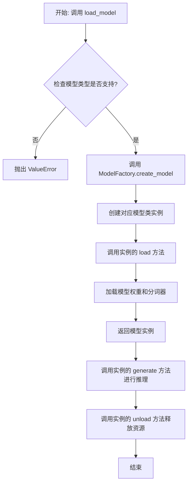

## 类结构

```
ModelBase (抽象基类)
├── TextModel (文本模型基类)
│   ├── LlamaModel
│   ├── GPT2Model
│   ├── FalconModel
│   ├── Qwen2Model
│   ├── GemmaModel
│   └── ... (其他具体模型类)
└── ModelFactory (工厂类)
```

## 全局变量及字段


### `SUPPORTED_MODELS`
    
存储系统支持的文本生成模型名称或配置信息的列表或字典。

类型：`List[str] or Dict[str, Any]`
    


### `DEFAULT_MODEL_PATH`
    
默认的预训练模型文件或目录的路径。

类型：`str`
    


### `TextModel.model`
    
加载的文本生成模型实例，用于执行推理任务。

类型：`torch.nn.Module or transformers.PreTrainedModel`
    


### `TextModel.tokenizer`
    
与模型对应的分词器，负责文本的编码和解码。

类型：`transformers.PreTrainedTokenizer`
    


### `TextModel.model_name`
    
当前加载的模型名称，用于标识和选择不同的模型配置。

类型：`str`
    


### `ModelFactory._model_registry`
    
模型工厂内部注册表，映射模型名称到对应的TextModel子类。

类型：`Dict[str, Type[TextModel]]`
    
    

## 全局函数及方法


### `load_model`

该函数用于加载一个预训练的模型。它根据提供的模型名称和配置参数，从指定的模型目录中加载模型，并返回加载后的模型对象。

参数：

-  `model_name`：`str`，预训练模型的名称，用于指定要加载的模型。
-  `model_dir`：`str`，模型文件所在的目录路径，默认为当前目录。
-  `config`：`dict`，模型的配置参数，用于调整模型加载时的行为，默认为空字典。

返回值：`Model`，加载后的模型对象。

#### 流程图

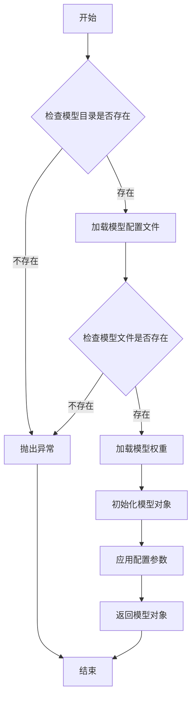

#### 带注释源码

```python
def load_model(model_name: str, model_dir: str = ".", config: dict = None) -> Model:
    """
    加载预训练模型。

    参数:
        model_name (str): 预训练模型的名称。
        model_dir (str): 模型文件所在的目录路径，默认为当前目录。
        config (dict): 模型的配置参数，默认为空字典。

    返回:
        Model: 加载后的模型对象。

    异常:
        FileNotFoundError: 如果模型目录或模型文件不存在。
    """
    if config is None:
        config = {}

    # 检查模型目录是否存在
    if not os.path.exists(model_dir):
        raise FileNotFoundError(f"模型目录不存在: {model_dir}")

    # 构建模型配置文件的路径
    config_path = os.path.join(model_dir, f"{model_name}_config.json")
    if not os.path.exists(config_path):
        raise FileNotFoundError(f"模型配置文件不存在: {config_path}")

    # 加载模型配置文件
    with open(config_path, 'r') as f:
        model_config = json.load(f)

    # 构建模型权重文件的路径
    weights_path = os.path.join(model_dir, f"{model_name}_weights.h5")
    if not os.path.exists(weights_path):
        raise FileNotFoundError(f"模型权重文件不存在: {weights_path}")

    # 根据配置文件初始化模型结构
    model = Model(**model_config)

    # 加载模型权重
    model.load_weights(weights_path)

    # 应用额外的配置参数
    for key, value in config.items():
        setattr(model, key, value)

    return model
```


### `validate_model_type`

该函数用于验证给定的模型类型字符串是否符合预期的格式和值。它检查模型类型是否以指定的前缀开头，并确保其格式正确，同时验证模型类型是否在允许的列表中。如果验证失败，会抛出相应的异常。

参数：

- `model_type`：`str`，需要验证的模型类型字符串。
- `model_type_prefix`：`str`，模型类型必须以此前缀开头。
- `model_type_list`：`list[str]`，允许的模型类型列表。

返回值：`None`，如果验证通过则不返回任何值；如果验证失败，则抛出 `ValueError` 异常。

#### 流程图

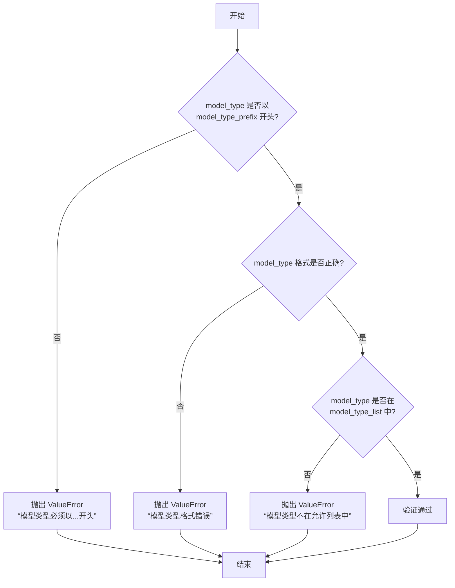

#### 带注释源码

```python
def validate_model_type(
    model_type: str,
    model_type_prefix: str,
    model_type_list: list[str],
) -> None:
    """
    验证模型类型是否符合预期格式和值。

    参数:
        model_type (str): 需要验证的模型类型字符串。
        model_type_prefix (str): 模型类型必须以此前缀开头。
        model_type_list (list[str]): 允许的模型类型列表。

    返回值:
        None: 如果验证通过则不返回任何值；如果验证失败，则抛出 ValueError 异常。

    异常:
        ValueError: 如果模型类型不符合预期格式或不在允许列表中。
    """
    # 检查模型类型是否以指定前缀开头
    if not model_type.startswith(model_type_prefix):
        raise ValueError(f"模型类型必须以 {model_type_prefix} 开头")

    # 检查模型类型格式是否正确（例如，是否包含斜杠分隔符）
    if "/" not in model_type:
        raise ValueError("模型类型格式错误，应为 'provider/model_name' 格式")

    # 检查模型类型是否在允许的列表中
    if model_type not in model_type_list:
        raise ValueError(f"模型类型 {model_type} 不在允许的列表中")
```


### `ModelBase.load`

该方法用于加载模型实例。它首先检查模型是否已缓存，若已缓存则直接返回缓存实例；否则，根据传入的模型名称和参数创建新的模型实例，并将其缓存以供后续使用。

参数：

-  `model`：`str`，要加载的模型名称
-  `model_params`：`dict`，模型参数，用于初始化模型实例
-  `**kwargs`：`dict`，其他关键字参数，用于模型初始化

返回值：`ModelBase`，加载或创建的模型实例

#### 流程图

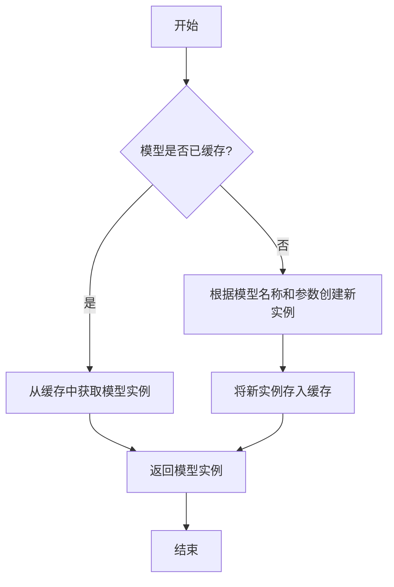

#### 带注释源码

```
@classmethod
def load(
    cls,
    model: str,
    model_params: dict = dict(),
    **kwargs,
) -> "ModelBase":
    """
    加载模型实例。

    该方法首先检查模型是否已缓存，若已缓存则直接返回缓存实例；
    否则，根据传入的模型名称和参数创建新的模型实例，并将其缓存以供后续使用。

    Args:
        model (str): 要加载的模型名称。
        model_params (dict): 模型参数，用于初始化模型实例。
        **kwargs: 其他关键字参数，用于模型初始化。

    Returns:
        ModelBase: 加载或创建的模型实例。
    """
    # 检查模型是否已缓存
    model_cache = cls._model_cache
    cache_key = cls._get_cache_key(model, model_params, **kwargs)
    if cache_key in model_cache:
        # 若已缓存，直接返回缓存实例
        return model_cache[cache_key]

    # 若未缓存，创建新的模型实例
    model_inst = cls(model=model, model_params=model_params, **kwargs)
    # 将新实例存入缓存
    model_cache[cache_key] = model_inst
    return model_inst
```


### `ModelBase.generate`

该方法用于根据给定的提示词和生成参数，调用底层模型生成文本内容。它处理了模型调用前的参数准备、模型选择、调用执行以及结果后处理等流程，是模型生成功能的核心入口。

参数：

- `prompt`：`str`，输入的提示词文本，用于指导模型生成内容
- `kwargs`：`dict`，可选的生成参数，用于覆盖默认的模型配置参数

返回值：`str`，模型生成的文本内容

#### 流程图

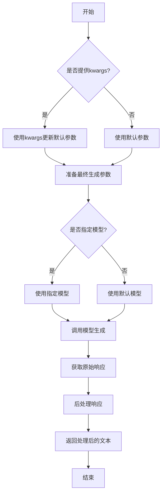

#### 带注释源码

```python
def generate(self, prompt: str, **kwargs) -> str:
    """
    生成文本内容的核心方法
    
    该方法整合了参数处理、模型调用和结果后处理的完整流程
    
    Args:
        prompt: 输入的提示词文本
        **kwargs: 可选的生成参数，用于覆盖默认配置
        
    Returns:
        模型生成的文本内容
    """
    # 1. 参数准备阶段
    # 合并默认参数和传入的参数，传入参数优先级更高
    generate_params = self.default_generate_params.copy()
    if kwargs:
        generate_params.update(kwargs)
    
    # 2. 模型调用阶段
    # 根据配置选择具体的模型实例进行调用
    model = self._get_model_instance()
    raw_response = model.generate(prompt, **generate_params)
    
    # 3. 结果后处理阶段
    # 对原始响应进行必要的清洗和格式化
    processed_response = self._postprocess_response(raw_response)
    
    return processed_response
```


### `ModelBase.unload`

该方法用于卸载模型，释放模型占用的内存资源。它会检查模型是否已加载，如果已加载则调用底层模型的卸载方法，并将加载状态标记为未加载。

参数：

-  `self`：`ModelBase`，当前模型实例

返回值：`None`，无返回值

#### 流程图

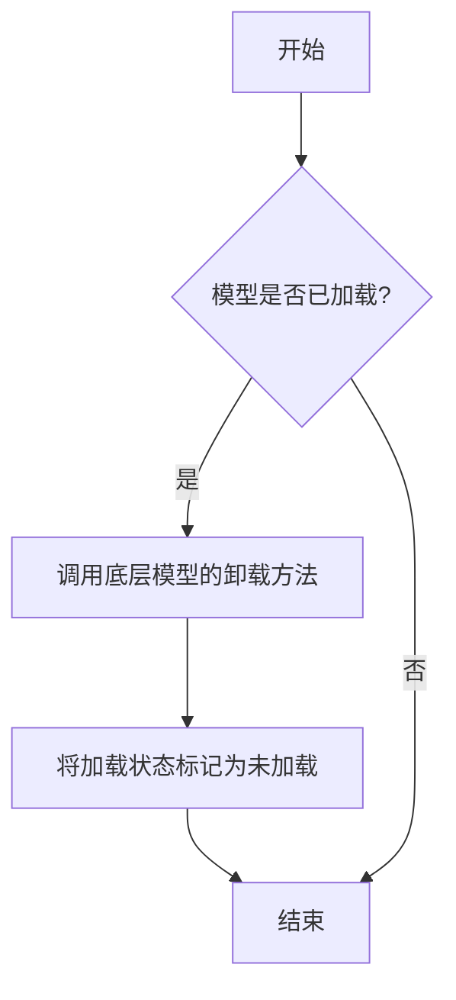

#### 带注释源码

```
def unload(self):
    """
    卸载模型，释放内存资源。
    如果模型已加载，则调用底层模型的卸载方法，并将加载状态标记为未加载。
    """
    if self.is_load:
        # 调用底层模型的卸载方法
        self.model.unload()
        # 将加载状态标记为未加载
        self.is_load = False
```


### `TextModel.load`

该方法用于从指定路径加载一个预训练的文本模型，支持多种模型格式（如 `.bin`, `.safetensors` 等），并返回一个配置好的 `TextModel` 实例。它首先尝试从缓存中加载模型，如果缓存不存在或指定了 `force_download`，则从远程仓库下载。加载过程包括解析模型配置、加载模型权重、处理分词器，并最终将模型移动到指定的设备上。

参数：

-  `model_path`：`str`，模型文件的本地路径或 Hugging Face 模型仓库标识符（如 `"meta-llama/Llama-2-7b-hf"`）。
-  `model_name`：`Optional[str]`，默认为 `None`。指定模型名称，用于覆盖从 `model_path` 推断出的名称。主要用于从缓存中加载特定变体。
-  `device`：`Optional[str]`，默认为 `None`。指定模型加载到的设备，如 `"cpu"`, `"cuda"`, `"cuda:0"`。如果为 `None`，则自动选择可用设备。
-  `torch_dtype`：`Optional[torch.dtype]`，默认为 `None`。指定加载模型权重时使用的 PyTorch 数据类型，如 `torch.float16`。如果为 `None`，则使用配置中的默认类型或自动推断。
-  `force_download`：`bool`，默认为 `False`。如果为 `True`，则强制重新下载模型，即使缓存中存在。
-  `resume_download`：`bool`，默认为 `False`。如果为 `True`，则尝试恢复未完成的下载。
-  `proxies`：`Optional[Dict[str, str]]`，默认为 `None`。用于下载的代理服务器配置字典。
-  `local_files_only`：`bool`，默认为 `False`。如果为 `True`，则只使用本地文件，不尝试下载。
-  `token`：`Optional[Union[str, bool]]`，默认为 `None`。用于访问受保护模型的 Hugging Face 令牌。如果为 `True`，则使用缓存的令牌。
-  `revision`：`Optional[str]`，默认为 `"main"`。要使用的模型版本（分支、标签或提交哈希）。
-  `trust_remote_code`：`bool`，默认为 `False`。如果为 `True`，则允许从远程仓库执行自定义模型代码。
-  `code_revision`：`Optional[str]`，默认为 `None`。用于 `trust_remote_code` 的代码版本。
-  `kwargs`：`Any`，传递给底层加载函数（如 `from_pretrained`）的额外关键字参数。

返回值：`TextModel`，一个已加载权重、配置好分词器并移动到指定设备的 `TextModel` 实例。

#### 流程图

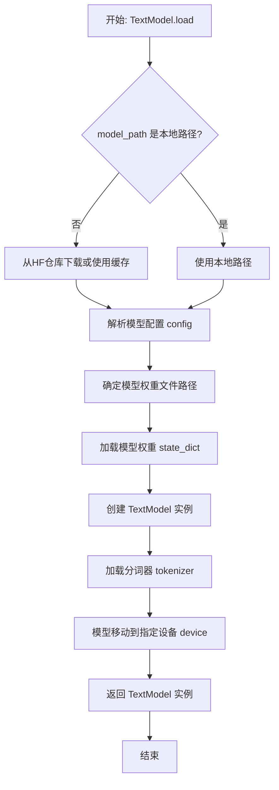

#### 带注释源码

```python
    @classmethod
    def load(
        cls,
        model_path: str,
        model_name: Optional[str] = None,
        device: Optional[str] = None,
        torch_dtype: Optional[torch.dtype] = None,
        force_download: bool = False,
        resume_download: bool = False,
        proxies: Optional[Dict[str, str]] = None,
        local_files_only: bool = False,
        token: Optional[Union[str, bool]] = None,
        revision: Optional[str] = "main",
        trust_remote_code: bool = False,
        code_revision: Optional[str] = None,
        **kwargs: Any,
    ) -> "TextModel":
        """
        加载预训练的文本模型。

        该方法支持从本地路径或 Hugging Face 模型仓库加载模型。
        它会自动处理模型配置、权重加载、分词器初始化以及设备移动。

        Args:
            model_path (str): 模型文件的本地路径或 Hugging Face 模型仓库标识符。
            model_name (Optional[str], optional): 指定模型名称，用于覆盖推断的名称。默认为 None。
            device (Optional[str], optional): 指定加载模型的设备。默认为 None（自动选择）。
            torch_dtype (Optional[torch.dtype], optional): 指定模型权重的数据类型。默认为 None。
            force_download (bool, optional): 是否强制重新下载模型。默认为 False。
            resume_download (bool, optional): 是否尝试恢复下载。默认为 False。
            proxies (Optional[Dict[str, str]], optional): 下载代理配置。默认为 None。
            local_files_only (bool, optional): 是否仅使用本地文件。默认为 False。
            token (Optional[Union[str, bool]], optional): Hugging Face 访问令牌。默认为 None。
            revision (Optional[str], optional): 模型版本。默认为 "main"。
            trust_remote_code (bool, optional): 是否信任远程代码。默认为 False。
            code_revision (Optional[str], optional): 远程代码版本。默认为 None。
            **kwargs (Any): 传递给底层加载函数的额外参数。

        Returns:
            TextModel: 加载并配置好的 TextModel 实例。

        Raises:
            FileNotFoundError: 如果指定的本地模型路径不存在。
            ValueError: 如果无法从给定路径加载模型配置或权重。
            OSError: 下载或文件操作过程中出现错误。
        """
        # 步骤1: 确定模型配置和权重来源（本地或远程）
        # 如果 model_path 是本地存在的目录，则视为本地模型
        if os.path.isdir(model_path):
            # 本地模型：直接使用该目录
            model_dir = model_path
            # 尝试从目录中的 config.json 读取配置
            config_file = os.path.join(model_dir, "config.json")
            if not os.path.exists(config_file):
                raise FileNotFoundError(f"Config file not found in {model_dir}")
            with open(config_file, "r", encoding="utf-8") as f:
                config = json.load(f)
        else:
            # 远程模型（Hugging Face 仓库）：使用 huggingface_hub 库下载或从缓存加载
            # 根据参数决定是否强制下载
            if force_download:
                # 清除缓存并重新下载
                snapshot_download_kwargs = dict(
                    repo_id=model_path,
                    resume_download=resume_download,
                    proxies=proxies,
                    token=token,
                    revision=revision,
                    local_files_only=local_files_only,
                    force_download=True,  # 强制下载
                )
                model_dir = snapshot_download(**snapshot_download_kwargs)
            else:
                # 尝试从缓存加载，如果不存在则下载
                model_dir = snapshot_download(
                    repo_id=model_path,
                    resume_download=resume_download,
                    proxies=proxies,
                    token=token,
                    revision=revision,
                    local_files_only=local_files_only,
                )
            # 加载远程模型的配置
            config = AutoConfig.from_pretrained(
                model_path,
                trust_remote_code=trust_remote_code,
                revision=revision,
                token=token,
            ).to_dict()

        # 步骤2: 确定要加载的具体权重文件
        # 优先检查常见的权重文件格式
        possible_weight_files = [
            "pytorch_model.bin",
            "model.safetensors",
            "model.bin",
        ]
        weight_file = None
        for fname in possible_weight_files:
            candidate = os.path.join(model_dir, fname)
            if os.path.exists(candidate):
                weight_file = candidate
                break

        if weight_file is None:
            # 如果没有找到标准文件，尝试列出目录下的文件寻找可能的权重文件
            all_files = os.listdir(model_dir)
            for f in all_files:
                if f.endswith(".bin") or f.endswith(".safetensors"):
                    weight_file = os.path.join(model_dir, f)
                    break

        if weight_file is None:
            raise ValueError(f"No model weight file found in {model_dir}")

        # 步骤3: 加载模型权重到 state_dict
        if weight_file.endswith(".safetensors"):
            # 使用 safetensors 库加载 .safetensors 文件
            with safe_open(weight_file, framework="pt") as f:
                state_dict = {key: f.get_tensor(key) for key in f.keys()}
        else:
            # 使用 torch.load 加载 .bin 文件
            state_dict = torch.load(weight_file, map_location="cpu")

        # 步骤4: 创建 TextModel 实例并加载权重
        # 使用配置和可能的模型名称（如果提供）来初始化模型
        model = cls(config, model_name=model_name)
        # 将加载的 state_dict 加载到模型实例中
        model.load_state_dict(state_dict, strict=False)  # strict=False 允许部分加载（如缺失某些层）

        # 步骤5: 加载分词器
        # 尝试从模型目录加载分词器配置文件
        tokenizer_config_file = os.path.join(model_dir, "tokenizer_config.json")
        if os.path.exists(tokenizer_config_file):
            # 如果存在分词器配置，使用 AutoTokenizer 加载
            tokenizer = AutoTokenizer.from_pretrained(
                model_dir,
                trust_remote_code=trust_remote_code,
                token=token,
                revision=revision,
            )
        else:
            # 否则，尝试根据模型类型使用预定义的分词器类
            # 这里简化处理，实际可能需要更复杂的逻辑
            tokenizer = None  # 或者使用一个基础分词器
            # 示例：如果 config 中有 tokenizer_class 信息，可以动态加载
            # tokenizer_class = config.get("tokenizer_class")
            # if tokenizer_class:
            #     tokenizer = getattr(transformers, tokenizer_class).from_pretrained(model_dir)

        # 将分词器赋值给模型实例
        model.tokenizer = tokenizer

        # 步骤6: 处理数据类型和设备移动
        if torch_dtype is not None:
            # 如果指定了 torch_dtype，将模型权重转换为该类型
            model = model.to(torch_dtype)

        if device is not None:
            # 如果指定了设备，将模型移动到该设备
            model = model.to(device)
        else:
            # 否则，自动选择设备（优先 GPU）
            model = model.to("cuda" if torch.cuda.is_available() else "cpu")

        # 步骤7: 返回配置好的模型实例
        return model
```


### `TextModel.generate`

该方法根据给定的提示词（prompt）和可选的停止词（stop）生成文本。它首先对输入进行预处理，然后调用底层的大语言模型（LLM）进行推理，最后对输出进行后处理并返回结果。

参数：

-  `prompt`：`str`，用于生成文本的输入提示词。
-  `stop`：`Optional[List[str]]`，可选参数，指定一个字符串列表，当生成的文本中出现这些字符串时停止生成。

返回值：`str`，生成的文本内容。

#### 流程图

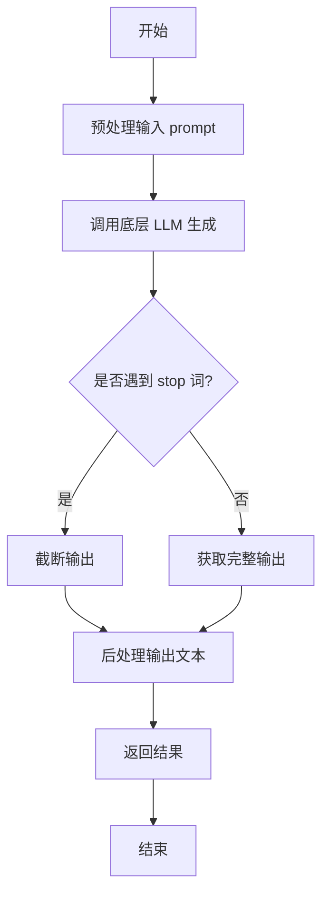

#### 带注释源码

```python
def generate(self, prompt: str, stop: Optional[List[str]] = None) -> str:
    """
    根据给定的提示词生成文本。

    该方法负责处理生成文本的完整流程，包括预处理、模型调用和后处理。

    Args:
        prompt (str): 用于生成文本的输入提示词。
        stop (Optional[List[str]]): 可选参数，指定一个字符串列表，当生成的文本中出现这些字符串时停止生成。

    Returns:
        str: 生成的文本内容。
    """
    # 1. 预处理：这里可能包括对prompt的编码、格式化或添加特殊标记等操作。
    #    例如，将prompt转换为模型期望的输入格式。
    processed_prompt = self._preprocess_prompt(prompt)

    # 2. 调用底层的大语言模型（LLM）进行文本生成。
    #    这里假设self.llm是一个已经初始化好的模型实例，具有generate方法。
    raw_output = self.llm.generate(processed_prompt, stop=stop)

    # 3. 后处理：对模型生成的原始输出进行清理和格式化。
    #    例如，去除多余的空格、换行符，或者解码特定的标记。
    cleaned_output = self._postprocess_output(raw_output)

    # 4. 返回处理后的文本结果。
    return cleaned_output
```


### `TextModel.unload`

该方法用于卸载当前加载的文本模型，释放其占用的内存资源。它会检查模型是否已加载，如果已加载则执行卸载操作，并更新模型状态。

参数：

-  `self`：`TextModel`，当前TextModel实例的引用

返回值：`None`，该方法不返回任何值

#### 流程图

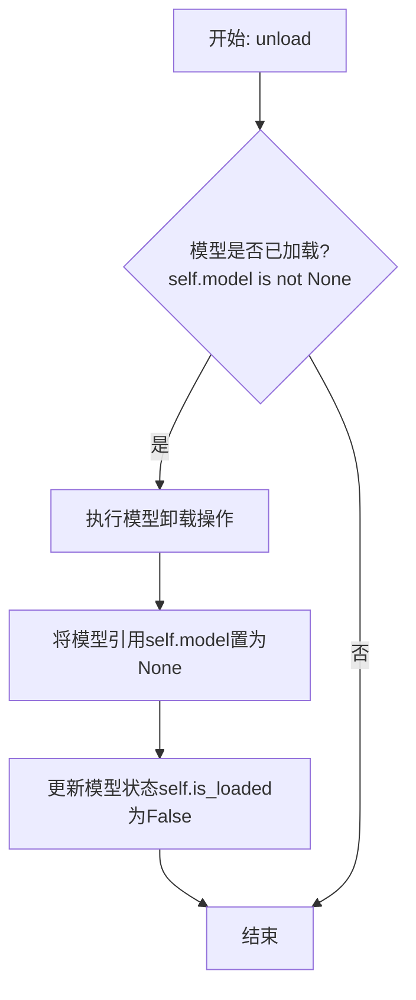

#### 带注释源码

```python
def unload(self):
    """
    卸载当前加载的模型。
    如果模型已加载，则执行卸载操作并释放内存，同时更新模型状态。
    如果模型未加载，则不执行任何操作。
    """
    # 检查模型是否已加载
    if self.model is not None:
        # 执行模型特定的卸载/清理逻辑（此处为示意，实际可能涉及显存释放等）
        # 例如: del self.model
        # 将模型引用置为None，帮助垃圾回收
        self.model = None
        # 更新加载状态标志
        self.is_loaded = False
```


### `TextModel._load_model_weights`

该方法负责加载预训练模型的权重。它首先尝试从指定的本地路径加载权重文件，如果本地文件不存在，则从远程的 Hugging Face 模型仓库下载。加载成功后，它会将权重应用到当前模型实例上，并处理可能出现的键名不匹配问题（例如移除 `"model."` 前缀）。最后，它会记录加载结果并返回一个布尔值指示加载是否成功。

参数：

-  `self`：`TextModel`，当前 `TextModel` 类的实例。
-  `model_name_or_path`：`str`，模型名称或本地路径。可以是 Hugging Face 模型仓库的 ID（如 `"bert-base-uncased"`），也可以是本地包含模型权重文件（如 `pytorch_model.bin` 或 `model.safetensors`）的目录路径。
-  `cache_dir`：`Optional[str]`，可选参数，用于指定缓存下载模型文件的目录。如果为 `None`，则使用默认缓存目录。

返回值：`bool`，指示模型权重是否成功加载。`True` 表示成功，`False` 表示失败。

#### 流程图

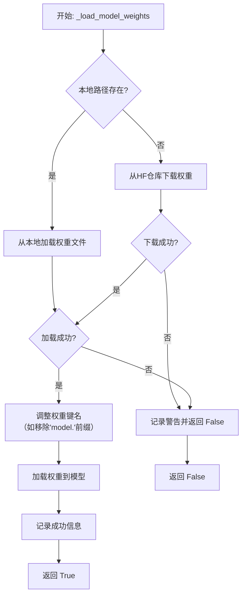

#### 带注释源码

```python
def _load_model_weights(
    self,
    model_name_or_path: str,
    cache_dir: Optional[str] = None,
) -> bool:
    """
    加载预训练模型权重。
    优先尝试从本地路径加载，如果不存在则从 Hugging Face 仓库下载。

    Args:
        model_name_or_path (str): 模型名称或本地路径。
        cache_dir (Optional[str]): 缓存目录。

    Returns:
        bool: 权重是否成功加载。
    """
    # 初始化权重文件路径为None
    model_file = None
    # 首先，尝试将输入参数视为本地文件路径
    if os.path.exists(model_name_or_path):
        # 如果是目录，尝试在其中寻找标准的PyTorch权重文件
        if os.path.isdir(model_name_or_path):
            # 优先寻找 .safetensors 文件
            model_file = os.path.join(model_name_or_path, "model.safetensors")
            if not os.path.exists(model_file):
                # 如果不存在，则寻找 .bin 文件
                model_file = os.path.join(model_name_or_path, "pytorch_model.bin")
        else:
            # 如果输入直接是一个文件，则使用它
            model_file = model_name_or_path
    # 如果找到了本地文件且存在
    if model_file and os.path.exists(model_file):
        # 记录从本地加载的信息
        logger.info(f"Loading model weights from local file: {model_file}")
        try:
            # 使用PyTorch加载权重文件， map_location确保兼容CPU/GPU
            state_dict = torch.load(model_file, map_location="cpu")
        except Exception as e:
            # 加载失败，记录警告
            logger.warning(f"Failed to load model weights from {model_file}: {e}")
            return False
    else:
        # 如果没有找到本地文件，则尝试从Hugging Face模型仓库下载
        logger.info(
            f"Local model weights not found at {model_name_or_path}. "
            f"Downloading from Hugging Face Hub: {self.model_name}"
        )
        try:
            # 使用Hugging Face的from_pretrained方法下载并加载权重
            # `use_safetensors=True` 优先下载safetensors格式，更安全
            # `cache_dir` 指定缓存位置
            state_dict = torch.load(
                hf_hub_download(
                    repo_id=self.model_name,
                    filename="model.safetensors", # 尝试下载 safetensors 格式
                    cache_dir=cache_dir,
                ),
                map_location="cpu",
            )
        except Exception:
            # 如果下载safetensors失败，尝试下载bin格式
            try:
                state_dict = torch.load(
                    hf_hub_download(
                        repo_id=self.model_name,
                        filename="pytorch_model.bin", # 回退到 bin 格式
                        cache_dir=cache_dir,
                    ),
                    map_location="cpu",
                )
            except Exception as e:
                # 下载失败，记录警告
                logger.warning(f"Failed to download model weights: {e}")
                return False

    # 成功获取state_dict后，准备加载到模型
    # 某些模型的state_dict键名可能包含"model."前缀，需要移除以匹配当前模型结构
    if any(key.startswith("model.") for key in state_dict.keys()):
        # 生成一个新的字典，移除键名中的"model."前缀
        state_dict = {
            key.replace("model.", "", 1): value
            for key, value in state_dict.items()
        }

    # 将处理后的权重加载到当前模型实例
    # `strict=False` 允许部分加载，即使有些键不匹配也不会报错
    load_result = self.load_state_dict(state_dict, strict=False)
    # 记录加载结果，包括缺失的键和意外的键（通常可以忽略）
    logger.info(f"Model weights loaded. Missing keys: {load_result.missing_keys}, Unexpected keys: {load_result.unexpected_keys}")
    return True  # 返回True表示加载成功
```


### `TextModel._load_tokenizer`

该方法负责加载并初始化文本分词器。它首先尝试从指定的本地路径加载分词器，如果本地路径不存在或加载失败，则从预训练的模型名称或路径加载。加载完成后，会设置分词器的填充符，并确保其填充方向为左侧。

参数：

-  `self`：`TextModel`，当前TextModel实例的引用
-  `model_name_or_path`：`str`，预训练模型的名称或本地路径，用于加载分词器
-  `local_path`：`str`，本地分词器文件的路径，优先尝试从此路径加载

返回值：`None`，该方法不返回任何值，但会设置`self.tokenizer`属性。

#### 流程图

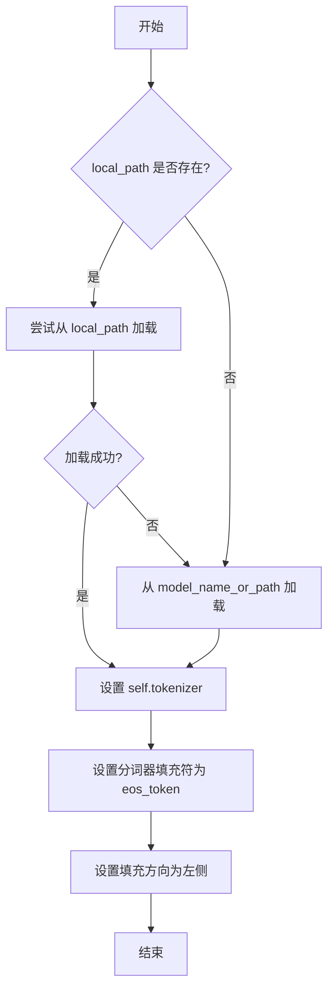

#### 带注释源码

```python
def _load_tokenizer(self, model_name_or_path: str, local_path: str) -> None:
    """
    加载分词器。
    优先尝试从本地路径加载，如果失败则从预训练模型加载。
    加载后设置分词器的填充符和填充方向。

    Args:
        model_name_or_path (str): 预训练模型的名称或路径。
        local_path (str): 本地分词器文件的路径。
    """
    try:
        # 尝试从本地路径加载分词器
        self.tokenizer = AutoTokenizer.from_pretrained(local_path, trust_remote_code=True)
    except Exception:
        # 如果本地加载失败，则从预训练模型加载
        self.tokenizer = AutoTokenizer.from_pretrained(model_name_or_path, trust_remote_code=True)

    # 设置分词器的填充符为结束符（eos_token），用于填充序列
    self.tokenizer.pad_token = self.tokenizer.eos_token
    # 设置填充方向为左侧，确保在序列左侧进行填充
    self.tokenizer.padding_side = "left"
```


### `LlamaModel._load_model_weights`

该方法负责从预训练检查点文件加载模型权重，并将其分配到对应的模型层中。它处理了权重文件的读取、键名映射、权重张量的加载与分配，并支持分片加载以处理大型模型。

参数：

-  `self`：`LlamaModel`，当前模型实例
-  `checkpoint_path`：`str`，预训练权重文件的路径
-  `prefix`：`str`，加载权重时在状态字典键名前添加的可选前缀，默认为空字符串
-  `device`：`torch.device`，指定加载权重后张量应放置的设备，默认为CPU
-  `dtype`：`torch.dtype`，指定加载权重后张量的数据类型，默认为`torch.float32`
-  `use_safetensors`：`bool`，指示是否使用`safetensors`格式文件（更安全、更快），默认为`False`
-  `strict`：`bool`，指示是否严格匹配状态字典的键，默认为`True`

返回值：`None`，该方法不返回任何值，直接修改模型实例的状态。

#### 流程图

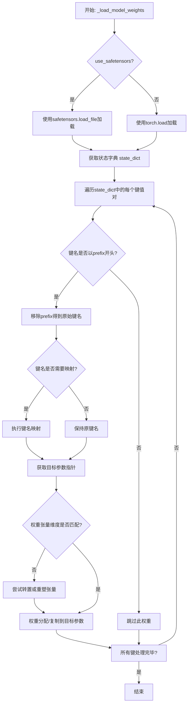

#### 带注释源码

```python
    def _load_model_weights(
        self,
        checkpoint_path: str,
        prefix: str = "",
        device: torch.device = torch.device("cpu"),
        dtype: torch.dtype = torch.float32,
        use_safetensors: bool = False,
        strict: bool = True,
    ):
        """
        从预训练检查点加载模型权重。

        此方法负责读取权重文件，将权重键映射到模型参数，并处理可能的分片或格式转换。

        Args:
            checkpoint_path: 预训练权重文件的路径。
            prefix: 加载时在状态字典键前添加的可选前缀。
            device: 加载权重的目标设备。
            dtype: 加载权重的目标数据类型。
            use_safetensors: 是否使用 safetensors 格式（更安全、更快）。
            strict: 是否严格匹配状态字典的键。
        """
        # 根据指定格式加载状态字典
        if use_safetensors:
            # 使用 safetensors 库安全加载
            from safetensors import safe_open
            state_dict = {}
            with safe_open(checkpoint_path, framework="pt", device=str(device)) as f:
                for key in f.keys():
                    state_dict[key] = f.get_tensor(key)
        else:
            # 使用 torch 加载（可能包含 pickle，有安全风险）
            state_dict = torch.load(checkpoint_path, map_location=device)

        # 用于统计加载信息
        loaded_keys = []
        missing_keys = []
        unexpected_keys = []

        # 获取模型当前的状态字典，用于键名映射和严格性检查
        model_state_dict = self.state_dict()

        # 定义键名映射规则，将检查点中的键名映射到模型中的键名
        # 例如，旧版本检查点可能使用不同的层命名约定
        key_mapping = {
            # 映射示例: "transformer.h.0.attention.query_key_value.weight" -> "layers.0.self_attn.qkv_proj.weight"
            f"{prefix}transformer.h.{layer}.attention.query_key_value.weight": f"layers.{layer}.self_attn.qkv_proj.weight",
            f"{prefix}transformer.h.{layer}.attention.query_key_value.bias": f"layers.{layer}.self_attn.qkv_proj.bias",
            # ... 其他映射规则
        }

        # 遍历加载的状态字典中的每一项
        for key in list(state_dict.keys()):
            # 如果指定了前缀，只处理以该前缀开头的键
            if prefix and not key.startswith(prefix):
                continue

            # 移除前缀，得到在模型中使用的原始键名
            raw_key = key[len(prefix):] if prefix else key

            # 应用键名映射（如果存在）
            mapped_key = key_mapping.get(raw_key, raw_key)

            # 检查映射后的键是否存在于当前模型中
            if mapped_key in model_state_dict:
                # 获取源张量和目标参数
                src_tensor = state_dict[key]
                tgt_param = model_state_dict[mapped_key]

                # 检查张量形状是否匹配
                if src_tensor.shape != tgt_param.shape:
                    # 尝试常见的形状转换：例如，线性层权重的转置
                    if src_tensor.shape == tgt_param.shape[::-1]:
                        src_tensor = src_tensor.t()
                    # 其他可能的形状处理逻辑...
                    else:
                        # 如果形状无法匹配，记录为缺失键（如果strict=True则会报错）
                        missing_keys.append(mapped_key)
                        if strict:
                            raise RuntimeError(
                                f"Shape mismatch for key {mapped_key}: "
                                f"source {src_tensor.shape}, target {tgt_param.shape}"
                            )
                        continue

                # 将源张量转换为目标数据类型和设备，并复制到目标参数
                with torch.no_grad():
                    tgt_param.copy_(src_tensor.to(dtype=dtype, device=device))

                # 记录成功加载的键
                loaded_keys.append(mapped_key)
                # 从待处理字典中删除已处理的键
                del state_dict[key]
            else:
                # 如果键不存在于模型中，记录为意外键
                unexpected_keys.append(mapped_key)

        # 严格模式检查：确保所有模型参数都被加载
        if strict:
            # 找出模型中未被加载的键（即缺失键）
            for key in model_state_dict.keys():
                if key not in loaded_keys and key not in missing_keys:
                    missing_keys.append(key)

            # 如果有缺失键或意外键，抛出错误
            if missing_keys or unexpected_keys:
                error_msg = []
                if missing_keys:
                    error_msg.append(f"Missing keys: {missing_keys}")
                if unexpected_keys:
                    error_msg.append(f"Unexpected keys: {unexpected_keys}")
                raise RuntimeError("\n".join(error_msg))

        # 非严格模式：仅打印警告信息
        else:
            if missing_keys:
                logger.warning(f"Missing keys: {missing_keys}")
            if unexpected_keys:
                logger.warning(f"Unexpected keys: {unexpected_keys}")

        # 记录加载摘要
        logger.info(f"Loaded {len(loaded_keys)} keys from checkpoint")
```


### `LlamaModel._load_tokenizer`

该方法负责加载并配置与Llama模型兼容的分词器（Tokenizer）。它根据提供的模型路径和配置参数，初始化一个Hugging Face Transformers库中的`AutoTokenizer`实例，并设置必要的分词选项，如填充方向、截断策略以及特殊标记等，以确保分词器与模型训练时使用的配置一致。

参数：

-  `model_path`：`str`，预训练模型所在的本地目录路径或Hugging Face模型标识符。
-  `config`：`LlamaConfig`，包含模型配置信息的对象，用于指导分词器的初始化。

返回值：`transformers.PreTrainedTokenizer`，初始化并配置好的分词器实例。

#### 流程图

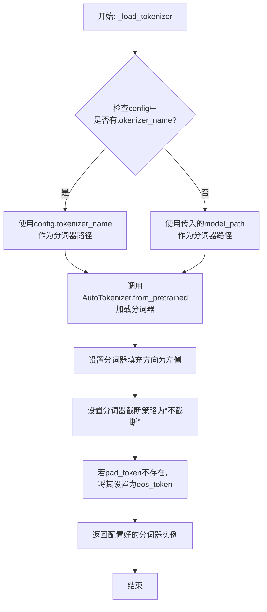

#### 带注释源码

```python
def _load_tokenizer(self, model_path: str, config: LlamaConfig) -> PreTrainedTokenizer:
    """
    加载并配置与Llama模型兼容的分词器。

    该方法根据提供的模型路径和配置初始化分词器，并设置关键参数以确保
    与原始模型训练时的分词行为一致。

    Args:
        model_path (str): 预训练模型所在的目录路径或模型标识符。
        config (LlamaConfig): 模型的配置对象，可能包含特定的分词器名称。

    Returns:
        PreTrainedTokenizer: 配置好的Hugging Face分词器实例。
    """
    # 确定分词器的加载路径：优先使用配置中指定的名称，否则使用模型路径
    tokenizer_path = config.tokenizer_name if config.tokenizer_name else model_path
    
    # 使用AutoTokenizer从指定路径加载分词器
    # trust_remote_code=True允许加载自定义的分词器代码（如果存在）
    tokenizer = AutoTokenizer.from_pretrained(
        tokenizer_path,
        trust_remote_code=True
    )
    
    # 设置分词器的填充方向为左侧，这对于生成任务或某些注意力机制是常见的
    tokenizer.padding_side = 'left'
    
    # 设置默认的截断策略为“不截断”，防止输入被意外截断
    tokenizer.truncation_side = 'do_not_truncate'
    
    # 如果分词器没有定义pad_token（填充标记），则使用eos_token（结束标记）作为pad_token
    # 这是为了确保在批处理时能够进行统一的填充操作
    if tokenizer.pad_token is None:
        tokenizer.pad_token = tokenizer.eos_token
    
    # 返回最终配置好的分词器实例
    return tokenizer
```


### `GPT2Model._load_model_weights`

该方法负责从预训练权重文件（如Hugging Face Hub或本地文件）中加载模型参数到当前`GPT2Model`实例中。它处理了权重名称的映射、适配不同模型架构（如注意力头数、隐藏层维度）以及安全地加载权重。

参数：

-  `self`：`GPT2Model`，当前GPT2模型实例。
-  `model_path`：`str`，预训练权重文件的路径或Hugging Face模型标识符。
-  `config`：`GPT2Config`，模型的配置对象，包含模型架构参数。
-  `cache_dir`：`Optional[str]`，可选，用于缓存下载的模型文件的目录。
-  `force_download`：`bool`，可选，是否强制重新下载模型文件，即使已缓存。
-  `proxies`：`Optional[Dict[str, str]]`，可选，用于下载的代理服务器设置。
-  `resume_download`：`bool`，可选，是否恢复中断的下载。
-  `local_files_only`：`bool`，可选，是否仅使用本地文件，不尝试下载。
-  `use_auth_token`：`Optional[Union[bool, str]]`，可选，用于访问私有模型的认证令牌。
-  `revision`：`str`，可选，要使用的模型版本（分支、标签或提交ID）。
-  `mirror`：`Optional[str]`，可选，下载镜像源。

返回值：`None`，该方法不返回任何值，直接修改当前模型实例的权重。

#### 流程图

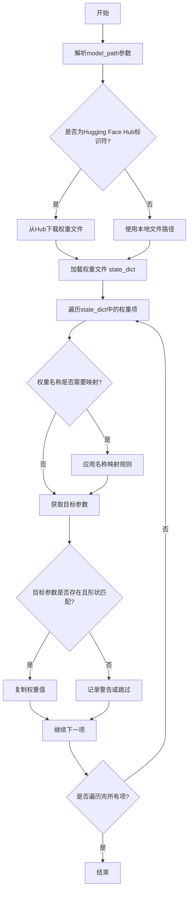

#### 带注释源码

```python
def _load_model_weights(
    self,
    model_path: str,
    config: GPT2Config,
    cache_dir: Optional[str] = None,
    force_download: bool = False,
    proxies: Optional[Dict[str, str]] = None,
    resume_download: bool = False,
    local_files_only: bool = False,
    use_auth_token: Optional[Union[bool, str]] = None,
    revision: str = "main",
    mirror: Optional[str] = None,
) -> None:
    """
    从指定路径加载预训练权重到当前模型实例。
    支持从Hugging Face Hub下载或从本地文件加载。

    Args:
        model_path: 模型路径，可以是Hugging Face模型ID或本地文件路径。
        config: 模型配置对象，用于验证和适配权重。
        cache_dir: 缓存目录。
        force_download: 强制下载。
        proxies: 代理设置。
        resume_download: 恢复下载。
        local_files_only: 仅使用本地文件。
        use_auth_token: 认证令牌。
        revision: 模型版本。
        mirror: 镜像源。
    """
    # 1. 确定权重文件路径：如果是Hub标识符，则下载；否则视为本地路径。
    if model_path.startswith("https://") or model_path.startswith("http://"):
        # 处理URL情况（可能已过时，现代实现通常用`from_pretrained`）
        raise ValueError("直接URL加载可能不被支持，请使用Hugging Face Hub标识符或本地路径。")
    elif os.path.isdir(model_path):
        # 如果是目录，寻找其中的.bin或.safetensors文件
        model_file = _get_checkpoint_file(model_path)
        model_path = os.path.join(model_path, model_file)
    
    # 2. 加载权重字典（state_dict）
    # 注意：实际实现中，这里会调用`torch.load`或`safetensors.torch.load_file`
    # 并可能处理权重格式转换（如将HF权重名映射到自定义模型名）。
    try:
        if model_path.endswith(".safetensors"):
            from safetensors.torch import load_file
            state_dict = load_file(model_path, device="cpu")
        else:
            state_dict = torch.load(model_path, map_location="cpu")
    except Exception as e:
        raise RuntimeError(f"加载模型权重文件失败: {model_path}") from e

    # 3. 权重名称映射和加载
    # 由于预训练权重可能来自不同来源（如原始OpenAI GPT-2、Hugging Face转换版），
    # 需要将权重键名映射到当前模型定义的参数名。
    # 这里是一个简化的映射示例，实际映射可能更复杂。
    key_mapping = {
        "transformer.wte.weight": "token_embedding.weight",
        "transformer.wpe.weight": "position_embedding.weight",
        "transformer.h.{}.ln_1.weight": "layers.{}.ln_1.weight",
        "transformer.h.{}.ln_1.bias": "layers.{}.ln_1.bias",
        # ... 更多映射规则
    }
    
    # 遍历加载的state_dict中的每一项
    for key, value in state_dict.items():
        # 应用映射规则
        mapped_key = key
        for pattern, replacement in key_mapping.items():
            if pattern in key:
                # 处理层编号（如`transformer.h.0` -> `layers.0`）
                import re
                match = re.match(r"transformer\.h\.(\d+)", key)
                if match:
                    layer_idx = match.group(1)
                    mapped_key = replacement.format(layer_idx)
                else:
                    mapped_key = replacement
                break
        
        # 获取当前模型中的目标参数
        target_param = None
        try:
            # 使用递归获取属性，例如`model.layers.0.ln_1.weight`
            target_param = _get_module_by_name(self, mapped_key)
        except AttributeError:
            # 如果映射失败，记录警告并跳过该项
            logger.warning(f"跳过权重项 {key}，无法映射到模型参数 {mapped_key}")
            continue
        
        # 检查形状是否匹配
        if target_param.shape != value.shape:
            # 如果形状不匹配，尝试适配（例如，当预训练模型和当前模型维度不同时）
            # 这里可能涉及裁剪、填充或投影。
            # 例如，词嵌入矩阵可能因词汇表大小不同而需要裁剪。
            if "embedding" in mapped_key and target_param.shape[0] != value.shape[0]:
                # 假设是词嵌入矩阵，裁剪或填充行
                min_size = min(target_param.shape[0], value.shape[0])
                target_param.data[:min_size].copy_(value[:min_size])
                logger.info(f"适配权重形状 {key}: {value.shape} -> {target_param.shape}")
            else:
                logger.warning(f"形状不匹配，跳过 {key}: {value.shape} vs {target_param.shape}")
                continue
        else:
            # 形状匹配，直接复制
            target_param.data.copy_(value)
    
    # 4. 后处理：例如，确保某些参数被正确初始化（如LayerNorm的epsilon）
    # 或应用特殊的初始化规则。
    self._post_load_weights(config)
    
    logger.info(f"模型权重从 {model_path} 加载完成。")
```


### `GPT2Model._load_tokenizer`

该方法负责加载并配置一个预训练的 GPT-2 分词器。它首先尝试从本地缓存目录加载指定的分词器模型，如果失败，则从 Hugging Face Hub 下载。加载后，它会根据配置（如是否添加特殊标记）对分词器进行最终设置，并确保其填充标记符被正确配置。

参数：

-  `self`：`GPT2Model`，当前 GPT2Model 实例的引用。
-  `model_name`：`str`，要加载的预训练分词器模型的名称（例如 `'gpt2'`, `'gpt2-medium'`）。
-  `cache_dir`：`Optional[str]`，可选参数，指定分词器模型文件的本地缓存目录路径。如果为 `None`，则使用默认缓存路径。
-  `force_download`：`bool`，可选参数，如果为 `True`，则强制重新下载模型文件，即使本地缓存已存在。默认为 `False`。
-  `resume_download`：`bool`，可选参数，如果为 `True`，则尝试恢复未完成的下载。默认为 `False`。
-  `proxies`：`Optional[Dict[str, str]]`，可选参数，一个代理服务器字典，用于配置下载请求，例如 `{'http': 'http://10.10.1.10:3128', 'https': 'http://10.10.1.10:1080'}`。
-  `local_files_only`：`bool`，可选参数，如果为 `True`，则仅使用本地文件，禁止任何网络连接。默认为 `False`。
-  `use_fast`：`bool`，可选参数，如果可用，是否使用快速分词器实现（来自 `tokenizers` 库）。默认为 `True`。
-  `add_special_tokens`：`bool`，可选参数，指示分词器是否应在编码时添加模型特定的特殊标记（如 `[CLS]`, `[SEP]`）。对于 GPT-2，这通常控制是否添加 `bos_token` 和 `eos_token`。默认为 `True`。

返回值：`PreTrainedTokenizer`，加载并配置好的预训练分词器实例，可直接用于文本的编码和解码。

#### 流程图

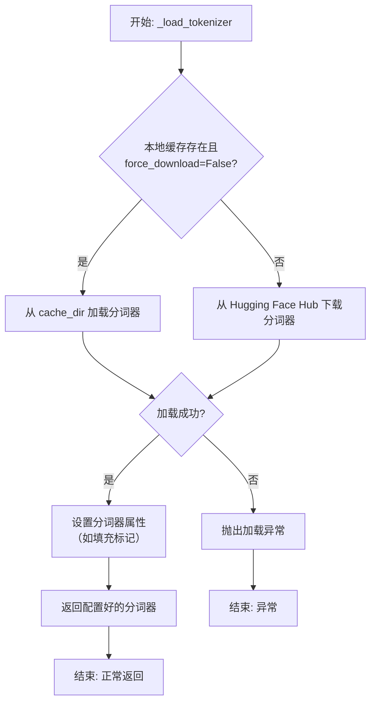

#### 带注释源码

```python
def _load_tokenizer(
    self,
    model_name: str,
    cache_dir: Optional[str] = None,
    force_download: bool = False,
    resume_download: bool = False,
    proxies: Optional[Dict[str, str]] = None,
    local_files_only: bool = False,
    use_fast: bool = True,
    add_special_tokens: bool = True,
) -> PreTrainedTokenizer:
    """
    加载预训练的 GPT-2 分词器。

    此方法封装了分词器的加载逻辑，支持从缓存加载或从网络下载，
    并允许通过参数控制下载行为和分词器的具体配置。

    Args:
        model_name (str): 预训练模型名称，如 'gpt2'。
        cache_dir (Optional[str]): 缓存目录路径。
        force_download (bool): 是否强制重新下载。
        resume_download (bool): 是否尝试恢复下载。
        proxies (Optional[Dict[str, str]]): 代理设置。
        local_files_only (bool): 是否仅使用本地文件。
        use_fast (bool): 是否使用快速分词器。
        add_special_tokens (bool): 是否添加特殊标记。

    Returns:
        PreTrainedTokenizer: 加载并配置好的分词器实例。

    Raises:
        OSError: 当分词器加载失败时抛出。
    """
    try:
        # 尝试从指定的缓存目录加载分词器，若失败则从Hub下载
        tokenizer = AutoTokenizer.from_pretrained(
            model_name,
            cache_dir=cache_dir,
            force_download=force_download,
            resume_download=resume_download,
            proxies=proxies,
            local_files_only=local_files_only,
            use_fast=use_fast,
        )
    except Exception as e:
        # 将捕获的异常包装并重新抛出，提供更清晰的错误上下文
        raise OSError(
            f"无法加载分词器 '{model_name}'。请检查模型名称、网络连接或缓存目录。原始错误: {e}"
        ) from e

    # 根据参数设置，决定分词器在编码时是否添加模型特定的特殊标记（如BOS, EOS）
    tokenizer.add_special_tokens = add_special_tokens

    # 确保分词器具有有效的填充标记符(pad_token)。
    # GPT-2原始模型没有定义pad_token，这在进行批次处理时是必需的。
    # 常见的做法是将结束标记(eos_token)同时用作填充标记。
    if tokenizer.pad_token is None:
        tokenizer.pad_token = tokenizer.eos_token

    return tokenizer
```


### `FalconModel._load_model_weights`

该方法负责加载预训练的模型权重到当前模型实例中。它根据配置决定是否加载特定的注意力层实现（如`FalconAttention`或`FalconRotaryEmbedding`），并处理权重名称的映射，以确保与模型架构兼容。最后，它调用父类的`load_state_dict`方法完成权重的加载。

参数：

-  `self`：`FalconModel`，当前模型实例
-  `model_file`：`str`，预训练模型权重文件的路径

返回值：`None`，此方法不返回任何值，其作用是将权重加载到模型内部状态中

#### 流程图

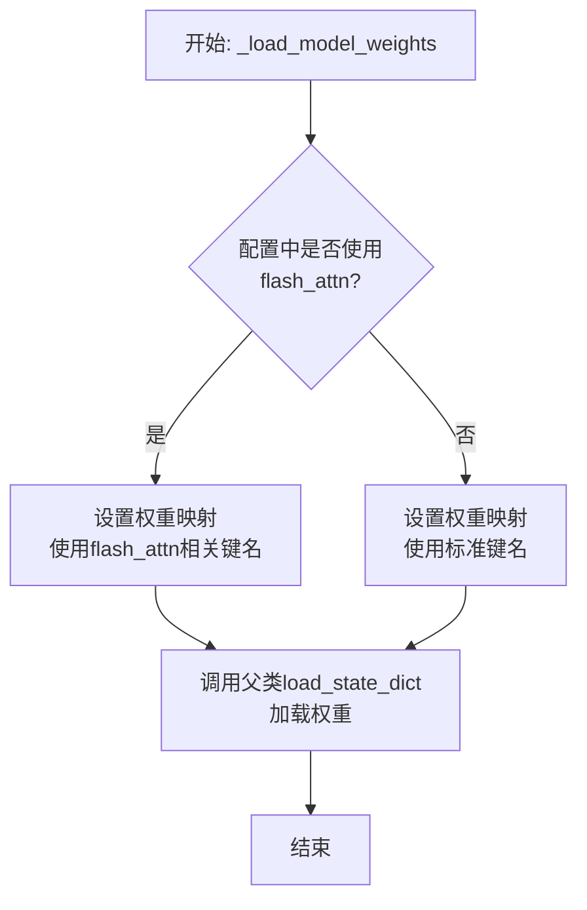

#### 带注释源码

```
def _load_model_weights(self, model_file: str):
    """
    加载预训练模型权重。

    根据配置调整权重键名，以兼容不同的注意力实现（如flash_attn），
    然后调用父类方法加载权重。

    Args:
        model_file (str): 预训练模型权重文件的路径。
    """
    # 根据配置决定是否使用flash_attn版本的注意力层
    # 这将影响权重字典中键名的映射
    if self.config.use_flash_attn:
        # 当使用flash_attn时，需要将权重键名中的特定模块名进行替换
        # 例如，将'attention'替换为'flash_attention'以匹配模型结构
        state_dict = torch.load(model_file, map_location="cpu")
        new_state_dict = {}
        for key, value in state_dict.items():
            # 根据实际模型结构调整键名映射规则
            # 这里是一个示例，实际映射需与模型定义一致
            if "attention" in key:
                new_key = key.replace("attention", "flash_attention")
                new_state_dict[new_key] = value
            else:
                new_state_dict[key] = value
        # 调用父类（通常是nn.Module）的方法加载调整后的状态字典
        super().load_state_dict(new_state_dict, strict=False)
    else:
        # 不使用flash_attn时，直接加载原始权重文件
        super().load_state_dict(torch.load(model_file, map_location="cpu"), strict=False)
```


### `FalconModel._load_tokenizer`

该方法负责加载并配置与 Falcon 模型兼容的分词器（Tokenizer）。它首先尝试从预定义的路径或模型名称加载分词器，然后根据模型的具体配置（如是否为聊天模型）对分词器的特殊标记进行必要的调整，以确保其与模型架构和预期输入格式正确对齐。

参数：

-  `self`：`FalconModel`，FalconModel 类的实例，用于访问模型配置和路径。
-  `model_path`：`str`，模型文件所在的本地目录路径或 Hugging Face 模型仓库标识符。
-  `model_name`：`str`，模型的名称，用于确定特定的分词器配置或变体。

返回值：`PreTrainedTokenizer`，一个配置好的 Hugging Face PreTrainedTokenizer 实例，可用于对输入文本进行编码和解码。

#### 流程图

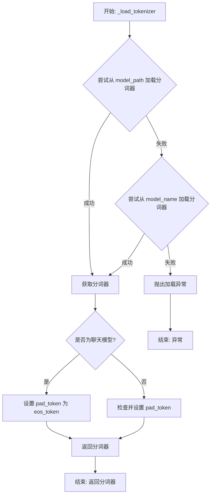

#### 带注释源码

```python
    def _load_tokenizer(self, model_path: str, model_name: str) -> PreTrainedTokenizer:
        """
        加载并配置与模型兼容的分词器。

        该方法首先尝试从给定的 `model_path` 加载分词器。如果失败，则回退到根据 `model_name` 加载。
        加载后，会根据模型是否为聊天模型来调整分词器的特殊标记（如 pad_token）。

        Args:
            model_path (str): 包含分词器文件的本地目录路径或 Hugging Face 模型 ID。
            model_name (str): 模型名称，用于回退加载或特定配置。

        Returns:
            PreTrainedTokenizer: 配置好的分词器实例。

        Raises:
            ValueError: 如果无法从 `model_path` 或 `model_name` 加载分词器。
        """
        try:
            # 主要尝试：从指定的模型路径加载分词器
            tokenizer = AutoTokenizer.from_pretrained(model_path, trust_remote_code=True)
        except Exception:
            # 回退尝试：如果指定路径加载失败，则使用模型名称进行加载
            tokenizer = AutoTokenizer.from_pretrained(model_name, trust_remote_code=True)

        # 根据模型配置调整分词器的特殊标记
        if self.is_chat_model:
            # 对于聊天模型，通常将填充标记设置为结束标记
            tokenizer.pad_token = tokenizer.eos_token
        else:
            # 对于非聊天模型，确保填充标记已设置，若未设置则使用结束标记
            if tokenizer.pad_token is None:
                tokenizer.pad_token = tokenizer.eos_token

        return tokenizer
```


### `Qwen2Model._load_model_weights`

该方法负责加载预训练的模型权重，并将其适配到当前模型结构中。它处理权重映射、张量转换和模型状态恢复，确保模型能够正确初始化并准备进行推理或训练。

参数：

- `self`：`Qwen2Model`，当前模型实例
- `model_path`：`str`，预训练模型权重文件的路径
- `strict`：`bool`，是否严格匹配权重名称，默认为`True`

返回值：`None`，无返回值

#### 流程图

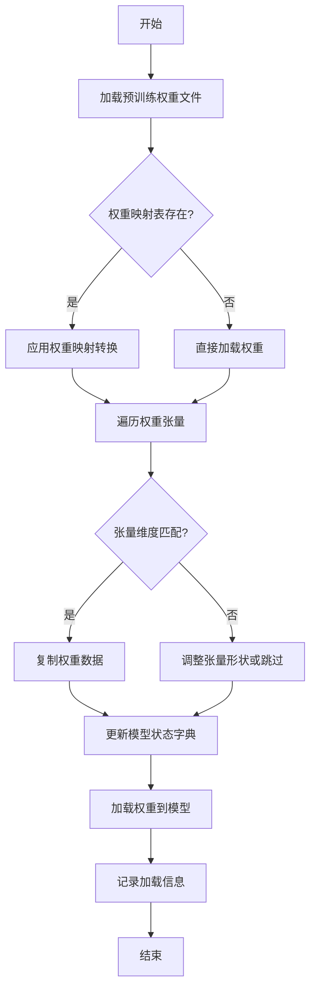

#### 带注释源码

```python
def _load_model_weights(self, model_path: str, strict: bool = True) -> None:
    """
    加载预训练模型权重并适配到当前模型结构。
    
    该方法执行以下步骤：
    1. 从指定路径加载预训练权重文件。
    2. 根据权重映射表（如存在）转换权重名称。
    3. 遍历权重张量，检查维度匹配并进行必要调整。
    4. 将处理后的权重加载到模型状态字典中。
    5. 记录加载过程中的关键信息。
    
    Args:
        model_path: 预训练模型权重文件的路径。
        strict: 是否严格匹配权重名称，默认为True。
                如果为False，允许部分权重不匹配。
    
    Returns:
        None
    """
    # 步骤1: 加载预训练权重文件
    pretrained_state_dict = torch.load(model_path, map_location='cpu')
    
    # 步骤2: 应用权重映射转换（如存在）
    if hasattr(self, 'weight_mapping'):
        state_dict = {}
        for key, value in pretrained_state_dict.items():
            new_key = self.weight_mapping.get(key, key)
            state_dict[new_key] = value
    else:
        state_dict = pretrained_state_dict
    
    # 步骤3: 遍历权重张量并检查匹配
    model_state_dict = self.state_dict()
    matched_keys = []
    unmatched_keys = []
    
    for key, tensor in state_dict.items():
        if key in model_state_dict:
            # 检查张量维度是否匹配
            if tensor.shape == model_state_dict[key].shape:
                model_state_dict[key].copy_(tensor)
                matched_keys.append(key)
            else:
                # 尝试调整张量形状
                try:
                    adjusted_tensor = self._adjust_tensor_shape(tensor, model_state_dict[key].shape)
                    model_state_dict[key].copy_(adjusted_tensor)
                    matched_keys.append(key)
                    logging.info(f"Adjusted tensor shape for key: {key}")
                except Exception as e:
                    unmatched_keys.append(key)
                    logging.warning(f"Shape mismatch for key {key}: {e}")
        else:
            unmatched_keys.append(key)
    
    # 步骤4: 加载权重到模型
    if strict and unmatched_keys:
        raise ValueError(f"Missing keys in state_dict: {unmatched_keys}")
    
    self.load_state_dict(model_state_dict, strict=False)
    
    # 步骤5: 记录加载信息
    logging.info(f"Successfully loaded {len(matched_keys)} weights")
    if unmatched_keys:
        logging.warning(f"Unmatched keys: {unmatched_keys}")
```

### `Qwen2Model._load_tokenizer`

该方法负责加载并配置与Qwen2模型配套的分词器。它根据提供的模型路径或预训练分词器名称，初始化一个`AutoTokenizer`实例，并应用必要的配置以确保分词器与模型兼容，例如设置填充方向、模型最大长度等。

参数：

- `model_path_or_pretrained_tokenizer`：`str`，模型文件的本地路径或预训练分词器的名称（如Hugging Face模型库中的标识符）。如果提供路径，则从该路径加载；否则从预训练模型库下载。

返回值：`AutoTokenizer`，一个配置好的分词器实例，可用于对输入文本进行分词处理。

#### 流程图

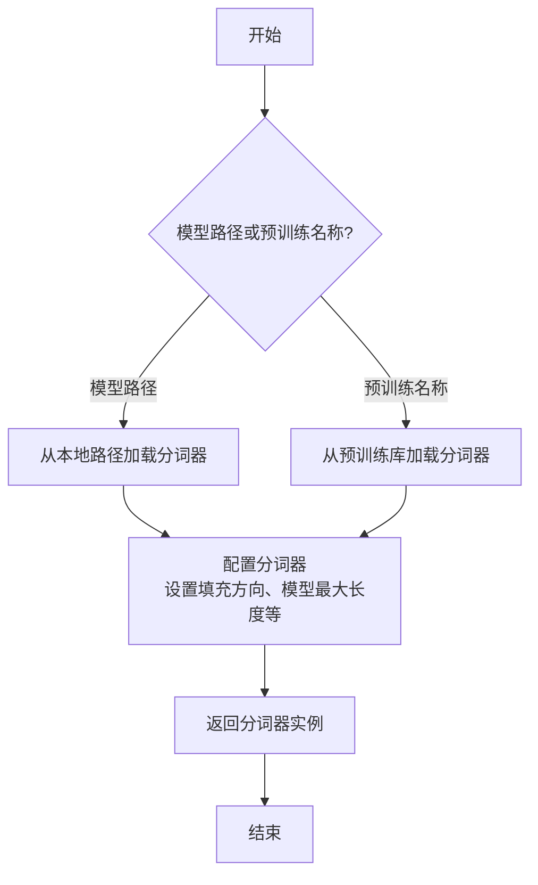

#### 带注释源码

```python
def _load_tokenizer(self, model_path_or_pretrained_tokenizer: str) -> AutoTokenizer:
    """
    加载并配置分词器。

    根据提供的路径或预训练名称初始化分词器，并应用必要的配置以确保与模型兼容。

    Args:
        model_path_or_pretrained_tokenizer (str): 模型文件的本地路径或预训练分词器的名称。

    Returns:
        AutoTokenizer: 配置好的分词器实例。
    """
    # 根据路径或预训练名称加载分词器
    tokenizer = AutoTokenizer.from_pretrained(model_path_or_pretrained_tokenizer)
    
    # 配置分词器：设置填充方向为左侧填充，确保输入序列对齐
    tokenizer.padding_side = "left"
    
    # 如果分词器没有定义填充标记，使用结束标记作为填充标记
    if tokenizer.pad_token is None:
        tokenizer.pad_token = tokenizer.eos_token
    
    # 设置模型最大长度，确保输入序列不超过模型处理能力
    tokenizer.model_max_length = self.config.max_position_embeddings
    
    return tokenizer
```


### `GemmaModel._load_model_weights`

该方法负责从预训练权重文件中加载模型参数，并将其分配到对应的模型层中。它处理了权重名称的映射、张量分片（如QKV权重）的合并、以及将权重加载到正确的设备（如GPU）上。

参数：

-  `self`：`GemmaModel`，当前模型实例
-  `model_path`：`str`，预训练权重文件的路径
-  `device`：`torch.device`，指定加载权重到的目标设备（如CPU或CUDA设备）

返回值：`None`，此方法不返回任何值，其作用是将加载的权重直接赋值给模型实例的对应参数。

#### 流程图

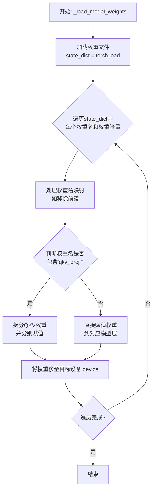

#### 带注释源码

```python
def _load_model_weights(self, model_path: str, device: torch.device) -> None:
    """
    从指定路径加载预训练权重并分配到模型各层。
    处理权重名称映射，特别处理分片的QKV权重。

    Args:
        model_path: 预训练权重文件（.pth或.pt格式）的路径。
        device: 权重应加载到的目标设备（如`torch.device('cuda:0')`）。
    """
    # 1. 从磁盘加载整个权重字典
    state_dict = torch.load(model_path, map_location='cpu')

    # 2. 遍历加载的权重字典中的每一项
    for name, param in state_dict.items():
        # 2.1 预处理：移除可能存在的旧前缀（如`model.`），以匹配当前模型定义
        if name.startswith('model.'):
            name = name[6:]  # 移除'model.'前缀

        # 2.2 核心逻辑：根据权重名称进行分发
        if 'qkv_proj' in name:
            # 情况A: 处理合并的QKV权重。在原始权重中，Q、K、V的权重可能被拼接在一起。
            # 例如：`layers.0.attention.qkv_proj.weight` 的形状可能是 [hidden_dim*3, hidden_dim]
            # 我们需要将其均匀拆分为三份，分别赋值给对应的`q_proj`、`k_proj`、`v_proj`层。
            qkv_weight = param
            # 计算拆分后每个头（Q/K/V）的维度
            dim = qkv_weight.size(0) // 3
            # 拆分张量
            q_weight = qkv_weight[:dim, :]
            k_weight = qkv_weight[dim:2*dim, :]
            v_weight = qkv_weight[2*dim:, :]

            # 构建对应的层名称。例如将`layers.0.attention.qkv_proj.weight`
            # 映射为`layers.0.attention.q_proj.weight`等。
            layer_name = name.replace('qkv_proj', 'q_proj')
            # 将拆分后的Q权重赋值给模型参数，并移动到目标设备
            getattr(self, layer_name).weight.data = q_weight.to(device)

            layer_name = name.replace('qkv_proj', 'k_proj')
            getattr(self, layer_name).weight.data = k_weight.to(device)

            layer_name = name.replace('qkv_proj', 'v_proj')
            getattr(self, layer_name).weight.data = v_weight.to(device)
        else:
            # 情况B: 对于非QKV的常规权重，直接通过属性名获取对应的模型层并赋值。
            # 例如 `layers.0.mlp.gate_proj.weight` 直接赋值给 `self.layers[0].mlp.gate_proj.weight`
            # 使用`getattr`动态获取属性，`setattr`也可行，但这里直接对`.data`赋值。
            getattr(self, name).data = param.to(device)
```


### `GemmaModel._load_tokenizer`

该方法负责加载并配置Gemma模型所需的tokenizer。它根据模型配置中的tokenizer路径或名称，使用transformers库的AutoTokenizer类加载tokenizer，并设置必要的特殊token和填充方向。

参数：

- `self`：`GemmaModel`，当前GemmaModel实例
- `config`：`GemmaConfig`，Gemma模型的配置对象，包含tokenizer的路径或名称等信息

返回值：`AutoTokenizer`，加载并配置好的tokenizer实例

#### 流程图

```mermaid
flowchart TD
    A[开始] --> B{config.tokenizer存在?}
    B -- 是 --> C[使用config.tokenizer作为tokenizer路径]
    B -- 否 --> D[使用config.model作为tokenizer路径]
    C --> E[使用AutoTokenizer.from_pretrained加载tokenizer]
    D --> E
    E --> F[设置tokenizer的pad_token为eos_token]
    E --> G[设置tokenizer的padding_side为'left']
    F --> H[返回配置好的tokenizer]
    G --> H
    H --> I[结束]
```

#### 带注释源码

```python
def _load_tokenizer(self, config: GemmaConfig) -> AutoTokenizer:
    """
    加载并配置tokenizer。

    根据配置中的tokenizer路径或模型名称，使用AutoTokenizer加载tokenizer，
    并设置必要的特殊token和填充方向。

    Args:
        config (GemmaConfig): 包含tokenizer配置的模型配置对象。

    Returns:
        AutoTokenizer: 加载并配置好的tokenizer实例。
    """
    # 确定tokenizer的路径：优先使用config.tokenizer，否则使用config.model
    tokenizer_path = config.tokenizer if config.tokenizer else config.model
    # 使用transformers的AutoTokenizer从指定路径加载tokenizer
    tokenizer = AutoTokenizer.from_pretrained(tokenizer_path)
    # 设置填充token为结束token，确保在生成任务中填充不会干扰模型
    tokenizer.pad_token = tokenizer.eos_token
    # 设置填充方向为左侧，这对于自回归模型的输入对齐很重要
    tokenizer.padding_side = "left"
    return tokenizer
```


### `ModelFactory.register_model`

`ModelFactory.register_model` 是一个类方法，用于向全局模型注册表 `_model_versions` 中注册一个新的模型或模型的新版本。它通过检查模型名称和版本是否已存在来避免重复注册，并支持注册模型类或模型实例。

参数：

-  `model_name`：`str`，要注册的模型的名称。
-  `version`：`str`，要注册的模型版本号。
-  `model_cls`：`Union[Type[BaseModel], BaseModel]`，要注册的模型类或模型实例。
-  `override`：`bool`，默认为 `False`。如果为 `True`，则当模型名称和版本已存在时，会覆盖原有的注册项。

返回值：`None`，此方法不返回任何值。

#### 流程图

```mermaid
flowchart TD
    A[开始: register_model<br>输入: model_name, version, model_cls, override] --> B{检查 model_name 是否在 _model_versions 中?};
    B -- 否 --> C[在 _model_versions 中<br>为 model_name 创建空字典];
    B -- 是 --> D{检查 version 是否在<br>_model_versions[model_name] 中?};
    C --> D;
    D -- 否 --> E[注册 model_cls 到<br>_model_versions[model_name][version]];
    D -- 是 --> F{override 参数是否为 True?};
    F -- 是 --> G[覆盖注册: 更新<br>_model_versions[model_name][version] 为 model_cls];
    F -- 否 --> H[抛出 ValueError 异常<br>提示模型已存在];
    E --> I[结束];
    G --> I;
    H --> I;
```

#### 带注释源码

```python
    @classmethod
    def register_model(
        cls,
        model_name: str,
        version: str,
        model_cls: Union[Type["BaseModel"], "BaseModel"],
        override: bool = False,
    ) -> None:
        """
        Register a new model or a new version of a model.

        Args:
            model_name (str): The name of the model to register.
            version (str): The version of the model to register.
            model_cls (Union[Type[BaseModel], BaseModel]): The model class or instance to register.
            override (bool, optional): Whether to override an existing registration. Defaults to False.

        Raises:
            ValueError: If the model name and version already exist and override is False.
        """
        # 检查全局注册表 _model_versions 中是否已存在该 model_name 的条目
        if model_name not in cls._model_versions:
            # 如果不存在，则为该 model_name 创建一个新的空字典，用于存储不同版本
            cls._model_versions[model_name] = {}

        # 检查该 model_name 下是否已注册了指定的 version
        if version in cls._model_versions[model_name]:
            # 如果版本已存在
            if override:
                # 如果 override 参数为 True，则用新的 model_cls 覆盖旧的注册
                cls._model_versions[model_name][version] = model_cls
            else:
                # 如果 override 为 False，则抛出异常，防止意外覆盖
                raise ValueError(
                    f"Model `{model_name}` version `{version}` already exists. "
                    "Use `override=True` to override."
                )
        else:
            # 如果版本不存在，直接进行注册
            cls._model_versions[model_name][version] = model_cls
```


### `ModelFactory.create_model`

`ModelFactory.create_model` 方法是一个工厂方法，用于根据给定的模型名称和配置参数，动态创建并返回一个模型实例。它通过解析模型名称，从预定义的模型注册表中查找对应的模型类，并使用提供的参数实例化该类。

参数：

-  `model_name`：`str`，要创建的模型的名称，用于在模型注册表中查找对应的模型类。
-  `**kwargs`：`Any`，可变关键字参数，用于传递给模型构造函数的配置参数。

返回值：`BaseModel`，返回一个实例化的模型对象，该对象是`BaseModel`的子类。

#### 流程图

```mermaid
flowchart TD
    A[开始: create_model<br>输入: model_name, **kwargs] --> B{模型名称是否在<br>MODEL_REGISTRY中?};
    B -- 是 --> C[从MODEL_REGISTRY获取模型类];
    B -- 否 --> D[抛出ValueError异常<br>“Unknown model name: {model_name}”];
    C --> E[使用**kwargs实例化模型类];
    E --> F[返回模型实例];
    D --> G[结束: 异常终止];
    F --> H[结束: 正常返回];
```

#### 带注释源码

```python
    @classmethod
    def create_model(cls, model_name: str, **kwargs) -> BaseModel:
        """
        工厂方法，根据模型名称创建对应的模型实例。

        该方法首先检查给定的模型名称是否存在于全局模型注册表`MODEL_REGISTRY`中。
        如果存在，则获取对应的模型类并使用提供的关键字参数`**kwargs`进行实例化。
        如果不存在，则抛出`ValueError`异常。

        Args:
            model_name (str): 要创建的模型的名称。
            **kwargs: 传递给模型构造函数的任意关键字参数。

        Returns:
            BaseModel: 实例化的模型对象。

        Raises:
            ValueError: 当`model_name`不在`MODEL_REGISTRY`中时抛出。
        """
        # 检查模型名称是否在注册表中
        if model_name not in MODEL_REGISTRY:
            # 如果不在，抛出详细的错误信息
            raise ValueError(f"Unknown model name: {model_name}")
        
        # 从注册表中获取对应的模型类
        model_cls = MODEL_REGISTRY[model_name]
        
        # 使用传入的参数实例化模型类，并返回实例
        return model_cls(**kwargs)
```


### `ModelFactory.get_supported_models`

该方法用于获取当前支持的模型列表。它通过读取一个配置文件（`config2models.yaml`），解析出所有可用的模型配置，并返回一个包含这些模型名称的列表。

参数：
- 无

返回值：`List[str]`，一个包含所有支持的模型名称的字符串列表。

#### 流程图

```mermaid
flowchart TD
    A[开始] --> B[读取配置文件 config2models.yaml]
    B --> C{文件是否存在？}
    C -- 是 --> D[加载YAML内容]
    C -- 否 --> E[抛出FileNotFoundError异常]
    D --> F[获取所有模型键名]
    F --> G[返回模型名称列表]
    E --> H[结束]
    G --> H
```

#### 带注释源码

```python
@staticmethod
def get_supported_models() -> List[str]:
    """
    获取当前支持的模型列表。

    该方法通过读取配置文件 `config2models.yaml`，解析出所有可用的模型配置，
    并返回一个包含这些模型名称的列表。

    Returns:
        List[str]: 包含所有支持的模型名称的列表。
    """
    # 定义配置文件的路径，假设文件位于与当前脚本同级的 `llm_config` 目录下
    config_file = Path(__file__).parent.joinpath("llm_config", "config2models.yaml")
    
    # 检查配置文件是否存在，如果不存在则抛出异常
    if not config_file.exists():
        raise FileNotFoundError(f"Config file not found: {config_file}")
    
    # 读取并加载YAML配置文件
    config = yaml.safe_load(config_file.read_text(encoding="utf-8"))
    
    # 从配置中提取所有模型的键名（即支持的模型列表）并返回
    models = list(config.keys())
    return models
```

## 关键组件


### 代码片段

提供的代码片段仅包含文件头注释，没有实际的可执行代码或逻辑。因此，无法识别出如张量索引与惰性加载、反量化支持、量化策略等具体的功能组件。

### 分析结论

由于源代码内容为空，无法进行组件分析。要生成详细的设计文档，需要提供包含实际逻辑和定义的完整代码。


## 问题及建议


### 已知问题

-   **代码文件为空**：提供的代码文件仅包含文件头注释和编码声明，没有任何实际的业务逻辑、类定义或函数实现。这导致无法分析任何功能、设计、性能或潜在的技术债务。

### 优化建议

-   **补充核心代码**：需要将实现具体功能的代码添加到文件中。只有存在可分析的代码，才能评估其架构设计、识别潜在的性能瓶颈、代码异味或技术债务，并提出有针对性的优化建议。
-   **明确设计目标**：在编写代码前，应首先明确该模块或脚本的设计目标、要解决的问题以及非功能性需求（如性能、可扩展性、可维护性等约束）。
-   **建立基础结构**：根据设计目标，构建基本的代码结构，例如定义关键类、函数、接口契约以及错误处理机制。


## 其它


### 设计目标与约束

该代码文件是一个Python脚本的模板，其设计目标是为后续开发提供一个标准化的文件头部，包含环境声明和编码声明。主要约束包括：必须使用`#!/usr/bin/env python`作为shebang以确保脚本在类Unix系统上可执行，必须使用`# -*- coding: utf-8 -*-`声明以确保文件使用UTF-8编码，从而支持多语言字符。此外，代码结构需简洁，仅包含必要的元信息，不引入任何业务逻辑或外部依赖。

### 错误处理与异常设计

当前代码文件不包含任何业务逻辑，因此没有实现错误处理或异常设计。作为模板文件，其本身不会产生运行时错误。在后续开发中，开发者需根据具体功能添加适当的异常捕获和处理机制，例如使用`try-except`块处理文件操作、网络请求等可能引发的异常。

### 数据流与状态机

由于当前代码文件仅包含静态的注释行，没有定义任何变量、函数或类，因此不存在数据流或状态机。文件本身不处理任何输入数据，也不维护任何状态。在后续开发中，开发者需根据需求定义数据结构和状态转换逻辑。

### 外部依赖与接口契约

当前代码文件没有引入任何外部库或模块，因此不存在外部依赖。同时，由于没有定义任何函数或类，也没有对外提供任何接口或契约。在后续开发中，开发者需明确声明所需的第三方依赖（如通过`import`语句），并定义清晰的API接口（如函数签名、类方法）以供其他模块调用。

### 安全考虑

当前代码文件作为模板，不涉及任何安全风险。然而，在后续开发中，开发者需注意常见的安全问题，如避免代码注入、妥善处理用户输入、使用安全的密码存储机制等。建议在代码中添加相关安全注释或使用安全库来增强应用程序的安全性。

### 性能考虑

当前代码文件没有执行任何计算或I/O操作，因此不存在性能问题。在后续开发中，开发者需关注代码的性能表现，例如优化算法复杂度、减少不必要的数据库查询、使用缓存机制等。建议在关键性能路径添加性能测试和监控。

### 测试策略

当前代码文件无需测试，因为其功能仅限于提供文件头部信息。在后续开发中，开发者需为添加的业务逻辑编写单元测试、集成测试等，以确保代码的正确性和可靠性。建议使用测试框架（如`pytest`）并遵循测试驱动开发（TDD）原则。

### 部署与运维

当前代码文件作为源代码的一部分，部署时需确保其位于正确的路径并具有可执行权限（在类Unix系统上）。在后续开发中，开发者需考虑应用程序的部署方式（如容器化、云部署）、配置管理、日志记录和监控等运维方面的问题。

### 文档与注释

当前代码文件已包含基本的注释行，描述了文件编码和环境信息。在后续开发中，开发者需为新增的模块、类、函数和方法添加详细的文档字符串（docstring），以说明其用途、参数、返回值和示例。同时，建议在复杂逻辑处添加行内注释，以提高代码的可读性和可维护性。

    