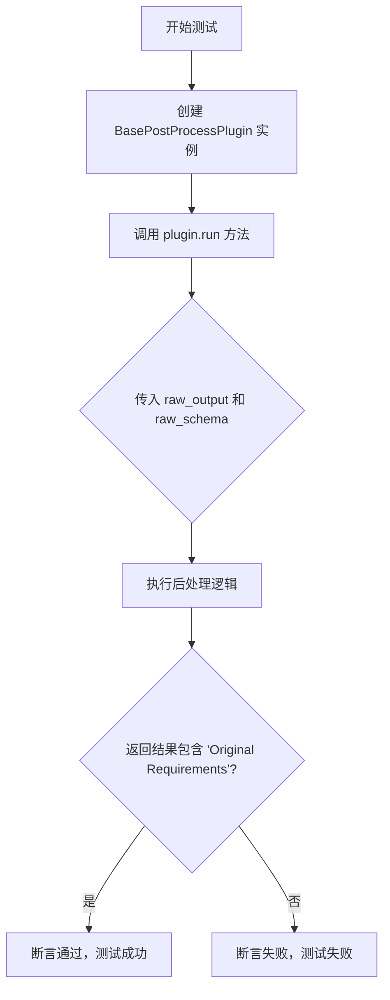
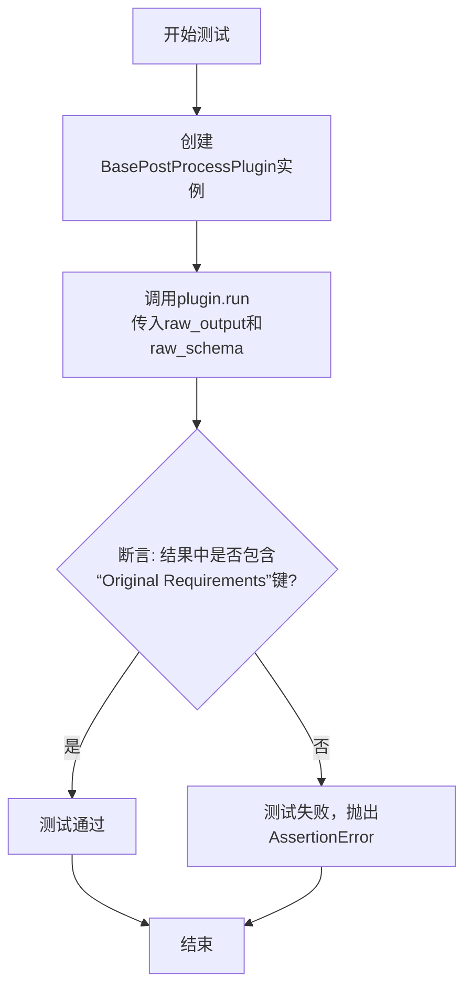

# `.\MetaGPT\tests\metagpt\provider\postprocess\test_base_postprocess_plugin.py` 详细设计文档

该代码是一个测试文件，用于验证 BasePostProcessPlugin 类的后处理功能。它模拟了一个 LLM 的原始输出，包含结构化的 JSON 内容，并使用一个预定义的 JSON Schema 来提取和验证输出中的特定字段（'Original Requirements'）。

## 整体流程



## 类结构

```
BasePostProcessPlugin (来自 metagpt.provider.postprocess.base_postprocess_plugin)
└── (测试代码中未定义新类，仅使用和测试现有类)
```

## 全局变量及字段


### `raw_output`
    
包含结构化内容的原始字符串输出，用于测试后处理插件的输入数据。

类型：`str`
    


### `raw_schema`
    
定义PRD（产品需求文档）结构的JSON Schema，用于验证和解析原始输出。

类型：`dict`
    


    

## 全局函数及方法


### `test_llm_post_process_plugin`

这是一个测试函数，用于验证 `BasePostProcessPlugin` 类的 `run` 方法是否能正确地从给定的原始输出字符串中，根据指定的 JSON Schema 提取出结构化的数据，并确保提取结果中包含 "Original Requirements" 字段。

参数：

-  `raw_output`：`str`，包含待处理内容的原始字符串，格式为 `[CONTENT]` 和 `[/CONTENT]` 标签包裹的 JSON 数据。
-  `raw_schema`：`dict`，定义期望输出数据结构的 JSON Schema 字典，用于指导后处理插件如何解析 `raw_output`。

返回值：`None`，该函数为测试函数，不返回任何值，仅通过断言（`assert`）来验证测试结果。

#### 流程图



#### 带注释源码

```python
def test_llm_post_process_plugin():
    # 实例化后处理插件基类
    post_process_plugin = BasePostProcessPlugin()

    # 调用插件的run方法，传入原始输出字符串和JSON Schema
    # 期望该方法能解析raw_output，并根据schema返回一个字典
    output = post_process_plugin.run(output=raw_output, schema=raw_schema)
    
    # 断言：验证返回的字典output中是否包含键"Original Requirements"
    # 这是测试的核心，用于确认后处理功能按预期工作
    assert "Original Requirements" in output
```


### `BasePostProcessPlugin.run`

该方法是一个后处理插件的核心执行方法，负责对大型语言模型（LLM）的原始输出进行解析、验证和格式化，以确保其符合预定义的数据结构（JSON Schema）要求，并返回处理后的结构化数据。

参数：

- `output`：`str`，大型语言模型（LLM）生成的原始文本输出。
- `schema`：`dict`，一个JSON Schema字典，定义了期望的输出数据结构，用于验证和指导解析过程。

返回值：`dict`，一个符合`schema`定义的、经过验证和格式化的字典对象。

#### 流程图

```mermaid
flowchart TD
    A[开始: run(output, schema)] --> B[解析原始输出<br>提取结构化内容]
    B --> C{内容是否符合<br>schema定义?}
    C -- 是 --> D[返回格式化后的<br>字典对象]
    C -- 否 --> E[进行数据修正或<br>抛出验证异常]
    E --> D
```

#### 带注释源码

```python
def run(self, output: str, schema: dict) -> dict:
    """
    执行后处理流程。

    该方法接收LLM的原始输出和一个JSON Schema，执行以下步骤：
    1. 解析原始输出，尝试提取其中的结构化数据（通常是JSON）。
    2. 使用提供的`schema`验证提取出的数据。
    3. 根据验证结果，返回格式化后的数据或处理验证错误。

    Args:
        output (str): LLM的原始文本输出。
        schema (dict): 用于验证输出数据的JSON Schema。

    Returns:
        dict: 符合`schema`的、经过验证的字典数据。

    Raises:
        ValidationError: 如果数据无法通过`schema`验证且无法自动修正。
        ParseError: 如果无法从`output`中解析出有效的结构化数据。
    """
    # 1. 解析阶段：从原始文本中提取JSON或结构化内容
    #    这里可能涉及正则匹配、分隔符识别（如代码中的`[CONTENT]`标记）等。
    parsed_data = self._parse_output(output)

    # 2. 验证与修正阶段：使用schema验证解析出的数据
    #    如果验证失败，可能尝试启发式修正（如类型转换、字段映射）。
    validated_data = self._validate_and_fix(parsed_data, schema)

    # 3. 返回最终处理结果
    return validated_data
```


## 关键组件


### BasePostProcessPlugin

一个用于对LLM输出进行后处理的基类插件，它定义了处理原始输出和模式（schema）的核心接口。

### 运行流程

该代码首先定义了一个包含结构化内容的原始输出字符串和一个JSON Schema。然后，它实例化`BasePostProcessPlugin`并调用其`run`方法，传入原始输出和模式，最后验证处理后的输出是否包含预期的字段。

### 类详细信息

#### BasePostProcessPlugin

**类方法：**
*   **run**
    *   **参数：**
        *   `output` (类型: `str`): 待处理的原始输出字符串。
        *   `schema` (类型: `dict`): 用于验证或指导输出处理的JSON Schema。
    *   **返回值类型：** `dict`
    *   **返回值描述：** 处理后的结构化数据。
    *   **Mermaid 流程图：**
        ```mermaid
        graph TD
            A[开始: run方法] --> B[接收原始输出和模式]
            B --> C[执行后处理逻辑]
            C --> D[返回结构化数据]
            D --> E[结束]
        ```
    *   **带注释源码：**
        ```python
        def run(self, output: str, schema: dict) -> dict:
            """
            执行后处理的核心方法。
            参数:
                output: 从LLM获取的原始文本输出。
                schema: 定义期望输出结构的JSON模式。
            返回:
                一个符合或基于给定模式处理后的字典。
            """
            # 注意：基类方法的具体实现未在提供代码中展示。
            # 预期子类会重写此方法以实现具体的解析、清洗、验证或转换逻辑。
            pass
        ```

### 关键组件信息

*   **原始输出 (raw_output):** 一个包含`[CONTENT]`和`[/CONTENT]`标签的字符串，内部包裹着JSON格式的文本，模拟了LLM的原始响应。
*   **JSON Schema (raw_schema):** 一个字典，定义了期望从原始输出中提取和处理后的数据结构，包括字段名、类型和必填项。

### 潜在的技术债务或优化空间

1.  **基类实现为空:** `BasePostProcessPlugin.run` 方法在基类中仅为`pass`，强制所有子类必须实现。这确保了接口一致性，但如果某些通用处理逻辑（如标签剥离）能放在基类中，可以减少子类的重复代码。
2.  **错误处理缺失:** 当前测试代码和基类定义中未展示对后处理过程中可能发生的错误的处理机制，例如JSON解析失败、输出不符合schema等。在实际应用中需要增强鲁棒性。
3.  **硬编码的测试数据:** 测试用例中的`raw_output`和`raw_schema`是硬编码的，对于测试更复杂或动态的后处理场景可能不够灵活。

### 其它项目

*   **设计目标与约束:** 该组件的设计目标是为LLM输出提供一个可插拔的后处理框架，允许通过不同的插件实现（继承`BasePostProcessPlugin`）来适应不同的输出格式和解析需求。约束是必须实现`run(output, schema)`接口。
*   **错误处理与异常设计:** 代码片段中未体现，但合理的实现应包含对无效输入、解析异常和验证失败的处理，可能抛出定义良好的异常或返回错误指示。
*   **数据流:** 数据流为：原始文本输出 -> `BasePostProcessPlugin.run` 方法 -> 结构化字典。Schema作为控制流，指导处理过程。
*   **外部依赖与接口契约:** 依赖于Python标准库。`run`方法的签名（输入`str`和`dict`，输出`dict`）是其核心接口契约。与调用者（如测试或主应用）的契约是基于此接口进行交互。


## 问题及建议


### 已知问题

-   **测试用例不完整**：当前测试仅验证了输出结果中是否包含 `"Original Requirements"` 这个键，但没有验证其对应的值是否正确，也没有验证当输出格式不符合预期或 `schema` 不匹配时，插件的处理行为是否正确。这可能导致一些边界情况或错误情况未被覆盖。
-   **硬编码的测试数据**：测试数据 `raw_output` 和 `raw_schema` 直接硬编码在测试函数中，这使得测试用例不够灵活，难以扩展以测试更多样化的输入场景。
-   **缺乏对 `BasePostProcessPlugin.run` 方法内部逻辑的验证**：测试仅关注了最终输出，但没有验证插件在处理过程中是否正确调用了必要的解析或验证步骤。如果 `run` 方法内部有复杂的逻辑（如字符串解析、JSON 加载、模式验证），这些逻辑的正确性未被充分测试。
-   **潜在的异常处理缺失**：测试代码没有包含任何异常处理或断言来验证当输入无效（例如，`raw_output` 格式错误，`schema` 不合法）时，插件是否会抛出预期的异常或返回预期的错误结果。

### 优化建议

-   **增强测试覆盖范围**：建议增加更多测试用例，包括：
    -   验证 `output` 中 `"Original Requirements"` 的值是否与 `raw_output` 中的内容一致。
    -   测试当 `raw_output` 格式不符合 `schema` 要求（例如，缺少 `[CONTENT]` 标签，JSON 格式错误）时，插件的处理行为（如是否抛出异常、返回默认值或错误信息）。
    -   测试当 `schema` 中定义更多或更少字段时，插件的处理是否正确。
-   **参数化测试数据**：使用 `pytest` 的参数化功能 (`@pytest.mark.parametrize`) 将测试数据（`raw_output`, `raw_schema`, 期望输出）提取为参数，使得可以轻松添加和运行多个测试场景，提高测试的可维护性和可读性。
-   **模拟和验证内部调用**：如果 `BasePostProcessPlugin.run` 方法依赖其他辅助方法（如 `_extract_content`, `_validate_schema`），可以使用 `unittest.mock` 来模拟这些方法，并验证它们是否被以正确的参数调用。这有助于单元测试的隔离性。
-   **添加异常处理测试**：编写测试用例来验证插件在遇到无效输入时的行为。例如，使用 `pytest.raises` 来断言在特定错误输入下应抛出特定的异常。
-   **重构测试以提高可读性**：将测试数据（`raw_output`, `raw_schema`）和断言逻辑分离，可能的话使用更明确的变量名，并添加注释说明每个测试用例的目的。
-   **考虑集成测试**：除了单元测试外，可以考虑编写集成测试，将 `BasePostProcessPlugin` 与它可能依赖的其他组件（如特定的解析器或验证器）一起测试，以确保整个处理流程在真实环境中工作正常。


## 其它


### 设计目标与约束

本代码片段的核心设计目标是提供一个基础的后处理插件基类（`BasePostProcessPlugin`），用于对大型语言模型（LLM）的原始输出进行结构化解析和验证，确保其符合预定义的JSON Schema格式。主要约束包括：1) 插件需要具备通用性，能够处理不同LLLM返回的、可能包含非结构化文本（如标记、说明）的原始输出；2) 必须能够从原始文本中提取出符合指定`schema`的JSON对象；3) 设计需保持简洁和可扩展性，为具体后处理逻辑（如针对特定标记的解析）提供子类化基础。

### 错误处理与异常设计

当前代码片段（测试函数）未展示`BasePostProcessPlugin.run`方法内部的错误处理机制。基于其设计目标，预期的错误处理应包含：
1.  **解析失败**：当无法从`output`字符串中提取出有效的JSON内容时，应抛出明确的异常（如`ValueError`或自定义的`ParseError`），并包含原始输出片段以供调试。
2.  **验证失败**：当提取出的JSON对象不符合提供的`schema`约束（如缺少必需字段、字段类型不匹配）时，应抛出验证异常（如`jsonschema.ValidationError`）。
3.  **输入异常**：对`output`或`schema`参数进行基础检查（如非空、正确类型），并在参数无效时抛出`TypeError`或`ValueError`。
测试用例通过断言验证了功能的核心成功路径，但未覆盖上述异常路径的测试。

### 数据流与状态机

1.  **数据流**：
    *   **输入**：原始文本字符串 `raw_output`（包含`[CONTENT]`标记和JSON）和JSON Schema字典 `raw_schema`。
    *   **处理**：`BasePostProcessPlugin.run` 方法接收输入，其内部逻辑（未展示）需执行：a) 从`raw_output`中定位并提取JSON字符串；b) 将JSON字符串反序列化为Python字典；c) 使用`raw_schema`验证该字典。
    *   **输出**：验证通过后的Python字典对象，如 `{"Original Requirements": "xxx"}`。测试中将其用于断言。
2.  **状态机**：该插件逻辑是纯函数的，无内部状态。其行为完全由输入参数决定，相同的输入必然产生相同的输出或异常。

### 外部依赖与接口契约

1.  **外部依赖**：
    *   `metagpt.provider.postprocess.base_postprocess_plugin.BasePostProcessPlugin`：这是代码直接依赖的核心类，其实现（尤其是`run`方法）是功能的关键。
    *   **潜在的间接依赖**：`BasePostProcessPlugin.run` 方法的实现很可能依赖于JSON解析库（如Python内置的`json`模块）和JSON Schema验证库（如`jsonschema`）。这些是隐式依赖。
2.  **接口契约**：
    *   `BasePostProcessPlugin.run(output: str, schema: dict) -> dict`：这是定义的主要接口。它约定接收一个字符串和一个JSON Schema字典，并返回一个符合该schema的字典。调用方（如测试函数）依赖此契约进行开发。
    *   测试函数 `test_llm_post_process_plugin` 本身也是一个契约，它定义了插件在给定特定输入（`raw_output`, `raw_schema`）下应满足的预期行为（输出字典包含"Original Requirements"键）。

### 测试策略与覆盖范围

当前代码展示了一个单元测试。其策略是：
*   **测试对象**：`BasePostProcessPlugin` 类的 `run` 方法。
*   **测试用例**：提供了一个包含`[CONTENT]`标记和简单JSON的典型原始输出，以及一个匹配的、仅包含必需字段的schema。
*   **验证点**：断言输出结果是一个字典，并且该字典包含`schema`中定义的必需键"Original Requirements"。这验证了基本的数据提取和验证功能。
*   **覆盖缺口**：未测试异常场景（如非法JSON、缺失标记、schema验证失败）、边界情况（空输出、复杂嵌套schema）以及`run`方法可能存在的其他功能（如文本清理、多格式支持）。一个完整的测试套件应补充这些用例。

### 配置与扩展点

1.  **配置**：当前代码未显示任何运行时配置。`BasePostProcessPlugin` 的实例化无需参数，表明其行为可能是硬编码的或完全由输入参数驱动。在实际应用中，可能需要配置项来控制例如：是否严格验证、默认错误处理方式、日志级别等。
2.  **扩展点**：
    *   `BasePostProcessPlugin` 类本身是一个主要的扩展点。其设计意图是让子类重写`run`方法或其中的某些步骤（例如，重写一个`_extract_json`方法）来实现针对不同LLM输出格式或标记（如`[/CONTENT]`）的自定义解析逻辑。
    *   `run` 方法的 `schema` 参数也是一个动态扩展点，允许调用方根据需要定义和传入任何有效的JSON Schema，从而灵活地约束和验证不同结构的输出。

### 安全性与合规性考虑

1.  **输入验证**：`run`方法必须对`output`字符串进行安全处理，防止因解析畸形或恶意构造的JSON导致的漏洞，例如JSON注入或通过超深嵌套结构引发的拒绝服务（DoS）攻击。
2.  **Schema安全**：当`schema`来自不可信来源时，需警惕其复杂性。过于复杂的schema（如包含递归定义）可能在验证时消耗大量资源。应考虑对schema的深度或复杂度进行限制。
3.  **数据泄露**：该插件处理的是LLM的原始输出，可能包含敏感信息。实现应确保在日志记录或错误信息中不会意外泄露完整的原始输出内容。错误信息应进行适当的脱敏处理。
4.  **合规性**：如果处理的数据涉及个人隐私（如GDPR）、医疗信息（如HIPAA）或其他受监管数据，整个数据处理流程（包括此插件）需要满足相应的数据保护和加密标准。

    