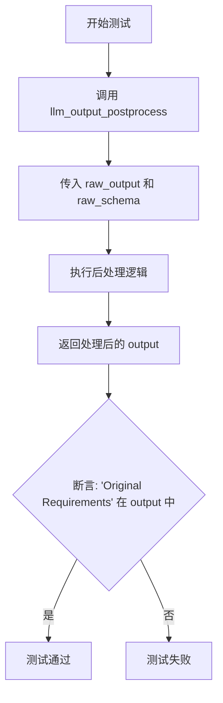
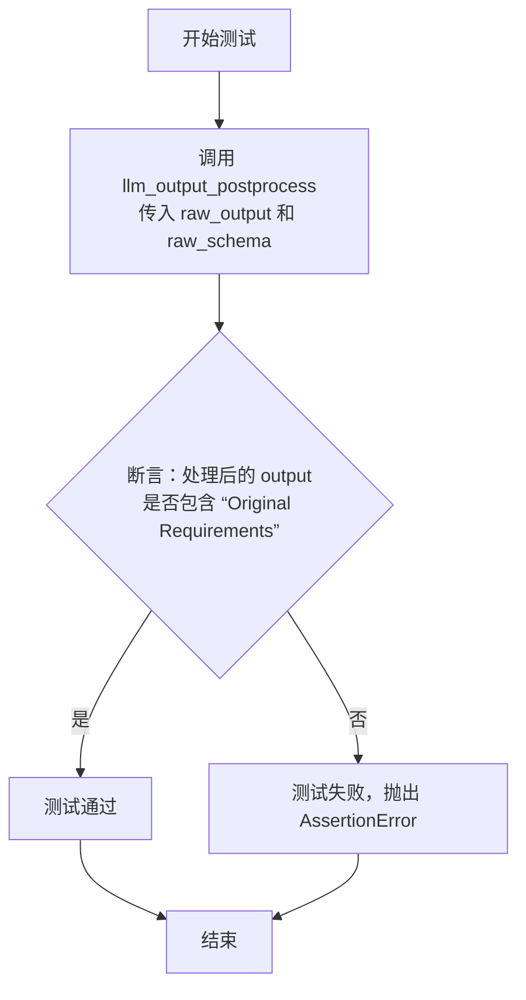
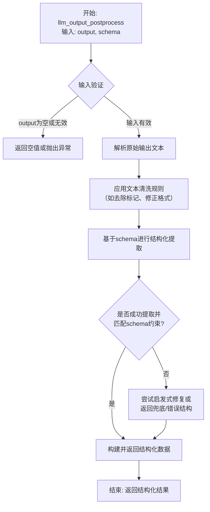

# `.\MetaGPT\tests\metagpt\provider\postprocess\test_llm_output_postprocess.py` 详细设计文档

该代码是一个单元测试，用于验证 `llm_output_postprocess` 函数的功能。该函数接收原始的LLM输出和一个模式（schema），对其进行后处理，并返回处理后的结果。测试断言处理后的输出中包含特定字符串 'Original Requirements'，以验证后处理逻辑的正确性。

## 整体流程



## 类结构

```
无显式类定义
├── 全局函数: test_llm_output_postprocess
├── 导入函数: llm_output_postprocess
└── 导入变量: raw_output, raw_schema
```

## 全局变量及字段


### `raw_output`
    
原始LLM输出字符串，包含待处理的文本内容。

类型：`str`
    


### `raw_schema`
    
定义输出格式的规范，可以是字典、JSON字符串或Pydantic模型等对象。

类型：`dict | str | object`
    


    

## 全局函数及方法


### `test_llm_output_postprocess`

这是一个单元测试函数，用于测试 `llm_output_postprocess` 函数。它调用 `llm_output_postprocess` 函数处理给定的原始输出和模式，并断言处理后的输出中包含特定的字符串，以验证函数的基本功能是否正常。

参数：

- `output`：`str`，待处理的原始LLM输出文本。
- `schema`：`dict` 或 `object`，定义输出结构的模式或约束。

返回值：`None`，这是一个测试函数，不返回业务值，其目的是通过断言来验证功能。

#### 流程图



#### 带注释源码

```python
def test_llm_output_postprocess():
    # 调用核心处理函数 llm_output_postprocess，传入从测试工具导入的
    # 原始输出数据 `raw_output` 和原始模式数据 `raw_schema` 进行测试。
    output = llm_output_postprocess(output=raw_output, schema=raw_schema)
    
    # 断言：检查处理后的 output 字符串中是否包含 "Original Requirements" 子串。
    # 这是一个功能性的冒烟测试，用于验证 postprocess 函数的基本解析或格式化能力。
    assert "Original Requirements" in output
```


### `llm_output_postprocess`

该函数是大型语言模型（LLM）输出后处理的核心函数。它接收原始的LLM输出文本和一个目标数据结构模式（schema），然后对原始输出进行解析、清洗、转换和结构化，最终返回一个符合给定模式要求的、结构化的数据对象（通常是字典或列表）。其主要目的是将非结构化的自然语言文本输出，可靠地转换为程序可直接使用的结构化数据。

参数：

-  `output`：`str`，原始的、未经处理的LLM生成的文本输出。
-  `schema`：`Any`（通常为`dict`, `list`, `pydantic.BaseModel`或相关类型），定义期望输出结构的数据模式。它指导后处理过程如何解析和格式化原始文本。

返回值：`Any`（通常与`schema`类型兼容，如`dict`, `list`等），经过后处理并结构化后的数据，其形态严格遵循输入`schema`的定义。

#### 流程图



#### 带注释源码

```python
# 注：以下为基于函数名和上下文推断的核心逻辑伪代码，并非原始库的完整实现。
# 它展示了 `llm_output_postprocess` 函数可能的核心处理步骤。

def llm_output_postprocess(output: str, schema: Any) -> Any:
    """
    对LLM的原始输出进行后处理，将其转换为符合给定模式的结构化数据。

    Args:
        output: 原始LLM输出字符串。
        schema: 期望的输出数据结构定义。

    Returns:
        符合schema结构的处理后的数据。
    """
    # 1. 输入验证与初始化
    if not output or not isinstance(output, str):
        # 处理无效输入，可能返回None、空结构或抛出异常
        return _handle_invalid_input(schema)

    processed_text = output.strip()

    # 2. 通用文本预处理
    # 例如：移除常见的LLM响应包装标记（如```json ... ```）
    processed_text = _remove_response_wrappers(processed_text)
    # 例如：修复常见的JSON格式错误（如尾随逗号、未转义字符）
    processed_text = _fix_common_format_issues(processed_text)

    # 3. 模式驱动的解析与结构化
    # 核心：根据schema的类型（如Dict, List, Pydantic Model）调用相应的解析器
    if _is_dict_schema(schema):
        # 尝试将文本解析为字典，并校验/适配到schema
        result = _parse_to_dict_and_validate(processed_text, schema)
    elif _is_list_schema(schema):
        # 尝试将文本解析为列表，并校验/适配到schema
        result = _parse_to_list_and_validate(processed_text, schema)
    elif _is_pydantic_model_schema(schema):
        # 尝试解析并实例化Pydantic模型
        result = _parse_to_pydantic_model(processed_text, schema)
    else:
        # 未知模式类型，可能进行兜底处理或报错
        result = _fallback_processing(processed_text, schema)

    # 4. 返回结果
    return result

# --- 假设的辅助函数（示意） ---
def _remove_response_wrappers(text: str) -> str:
    """移除代码块标记等包装。"""
    import re
    # 移除 ```json 和 ``` 标记
    pattern = r'^```(?:json)?\s*\n?(.*?)\n?```$'
    match = re.search(pattern, text, re.DOTALL)
    if match:
        return match.group(1).strip()
    return text

def _parse_to_dict_and_validate(text: str, schema: dict) -> dict:
    """解析文本为字典并尝试匹配schema。"""
    import json
    try:
        data = json.loads(text)
    except json.JSONDecodeError:
        # JSON解析失败，可能尝试其他格式或启发式修复
        data = _heuristic_parse_to_dict(text)

    # 此处应有根据schema校验和转换data的逻辑
    # 例如：确保必要的键存在，类型转换，过滤多余键等
    validated_data = _validate_and_convert_dict(data, schema)
    return validated_data
```


## 关键组件


### llm_output_postprocess 函数

一个用于对大型语言模型（LLM）的原始输出进行后处理的函数，它根据给定的模式（schema）对输出进行解析、格式化或转换，以提取结构化的信息或满足特定的输出格式要求。

### 测试用例 test_llm_output_postprocess

一个用于验证 `llm_output_postprocess` 函数正确性的单元测试，它通过提供预设的原始输出（raw_output）和模式（raw_schema）来调用该函数，并断言处理后的结果中包含预期的关键字段（如“Original Requirements”），以确保后处理逻辑按预期工作。

### 原始数据 raw_output

一个预设的、模拟LLM生成的原始文本输出，作为 `llm_output_postprocess` 函数的输入数据，用于测试其处理能力。

### 模式定义 raw_schema

一个预设的模式定义，用于指导 `llm_output_postprocess` 函数如何解析和结构化 `raw_output` 数据，它定义了期望的输出格式或数据字段。


## 问题及建议


### 已知问题

-   **测试用例过于简单且依赖外部数据**：当前测试用例 `test_llm_output_postprocess` 仅验证了输出字符串中是否包含特定子串 `"Original Requirements"`。这种断言过于宽泛，无法有效验证 `llm_output_postprocess` 函数的核心逻辑（如格式转换、数据提取、模式验证等）是否正确执行。测试的健壮性和价值较低。
-   **测试数据定义不明确**：测试中使用的 `raw_output` 和 `raw_schema` 是从外部模块 `tests.metagpt.provider.postprocess.test_base_postprocess_plugin` 导入的。这使得测试用例本身不完整，无法独立理解其测试意图和上下文。测试数据的来源和具体内容对阅读者来说是黑盒，降低了测试的可读性和可维护性。
-   **缺乏边界和异常情况测试**：测试用例仅覆盖了“正常路径”（happy path）。没有对 `llm_output_postprocess` 函数处理异常输入（如 `None`、空字符串、无效的 `schema`、不符合 `schema` 的 `output`）时的行为进行测试，无法保证函数的鲁棒性。

### 优化建议

-   **增强测试断言**：将简单的字符串包含断言替换为更精确的断言。例如，验证返回的 `output` 是一个符合 `raw_schema` 结构的字典，并检查其中关键字段（如 `"Original Requirements"`）的值是否与预期匹配。可以使用 `pytest` 的 `assert` 结合字典比较或专门的模式验证库。
-   **内联或明确测试数据**：考虑将关键的测试数据（`raw_output` 和 `raw_schema`）直接定义在测试文件内部，或者至少提供清晰的注释说明其结构和测试目的。如果必须从外部导入，应确保导入路径清晰，并且被导入的模块名称（如 `test_base_postprocess_plugin`）能明确表明这是为测试准备的夹具（fixture）。
-   **补充测试用例**：增加多个测试用例以覆盖不同的场景：
    -   **正常用例**：测试不同结构和内容的 `raw_output` 与 `raw_schema`。
    -   **边界用例**：测试 `output` 为空字符串、`schema` 为空字典等情况。
    -   **异常用例**：测试当 `output` 无法被 `schema` 解析时，函数是抛出可预期的异常、返回默认值还是进行其他处理。使用 `pytest.raises` 来测试异常。
    -   **类型测试**：验证函数返回值的类型是否符合预期（例如，始终返回字符串或字典）。
-   **重构测试结构**：使用 `pytest` 的夹具（`@pytest.fixture`）来管理 `raw_output` 和 `raw_schema` 等测试数据，使测试逻辑更清晰，并支持参数化测试（`@pytest.mark.parametrize`）来轻松运行多组数据。


## 其它


### 设计目标与约束

本代码是一个单元测试，旨在验证 `llm_output_postprocess` 函数的功能。其核心设计目标是确保该函数能够根据给定的 `schema` 对 `raw_output` 进行正确的后处理，并返回包含特定关键词（如“Original Requirements”）的结果。约束条件包括：依赖外部定义的 `raw_output` 和 `raw_schema` 测试数据；测试逻辑简单，仅包含一个断言；作为测试代码，不涉及生产环境的性能、安全性等要求。

### 错误处理与异常设计

当前代码未显式包含错误处理逻辑。测试执行过程中可能发生的异常包括：`llm_output_postprocess` 函数内部抛出的异常（如输入数据格式错误）、断言失败（AssertionError）以及模块导入错误。这些异常将由测试运行框架（如pytest）捕获并报告，以指示测试失败。测试本身不设计恢复或重试机制。

### 数据流与状态机

数据流非常简单且线性：
1.  **输入**：从导入的测试模块中获取预定义的 `raw_output`（原始LLM输出字符串）和 `raw_schema`（后处理模式定义）。
2.  **处理**：调用 `llm_output_postprocess(output=raw_output, schema=raw_schema)` 函数。函数内部根据 `schema` 解析和转换 `raw_output`。
3.  **输出/验证**：函数返回处理后的字符串 `output`。测试断言该字符串包含子串“Original Requirements”。整个流程无循环或状态转移。

### 外部依赖与接口契约

1.  **函数依赖**：核心依赖 `metagpt.provider.postprocess.llm_output_postprocess.llm_output_postprocess` 函数。测试假设该函数接受 `output` 和 `schema` 参数，并返回一个字符串。
2.  **数据依赖**：依赖 `tests.metagpt.provider.postprocess.test_base_postprocess_plugin` 模块中定义的 `raw_output` 和 `raw_schema` 全局变量。测试假设这些变量已正确定义且适用于 `llm_output_postprocess` 函数。
3.  **框架依赖**：依赖 Python 的 `assert` 语句及外部的测试运行器（如 `pytest`）来执行和判定测试结果。

    