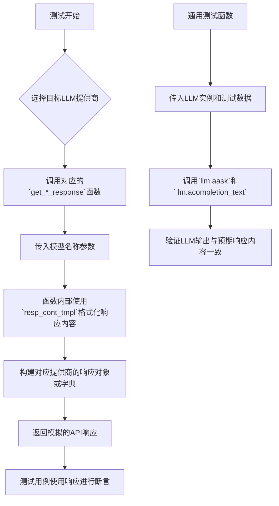
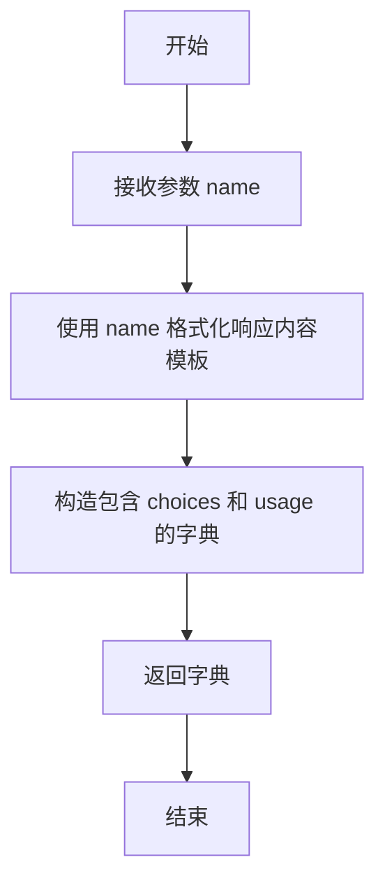
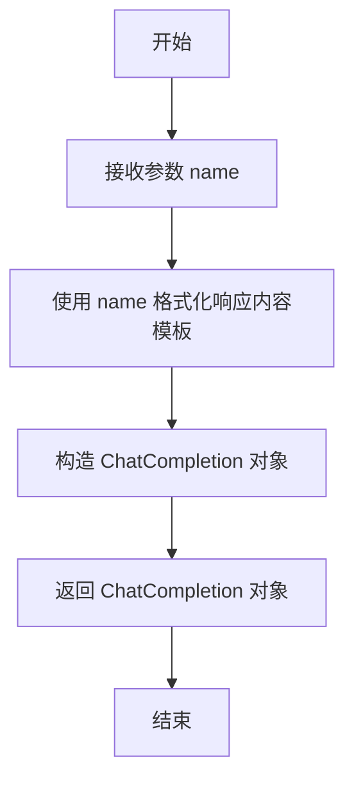
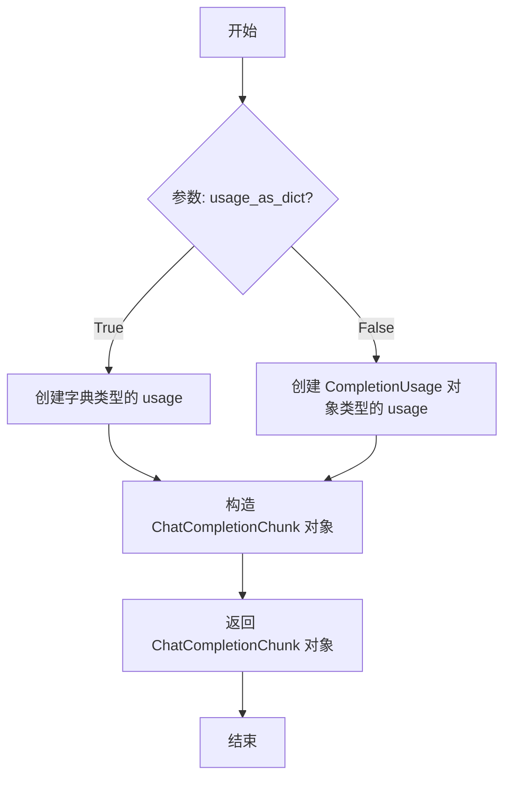
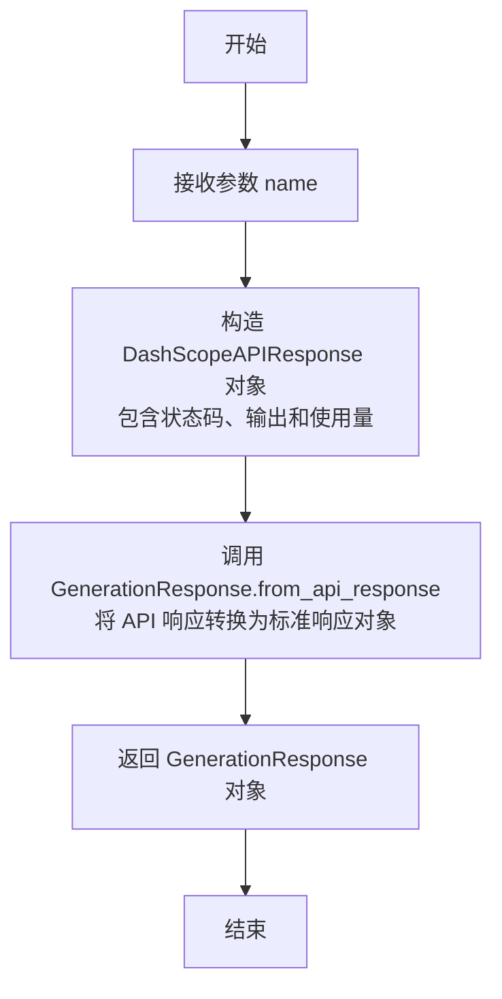
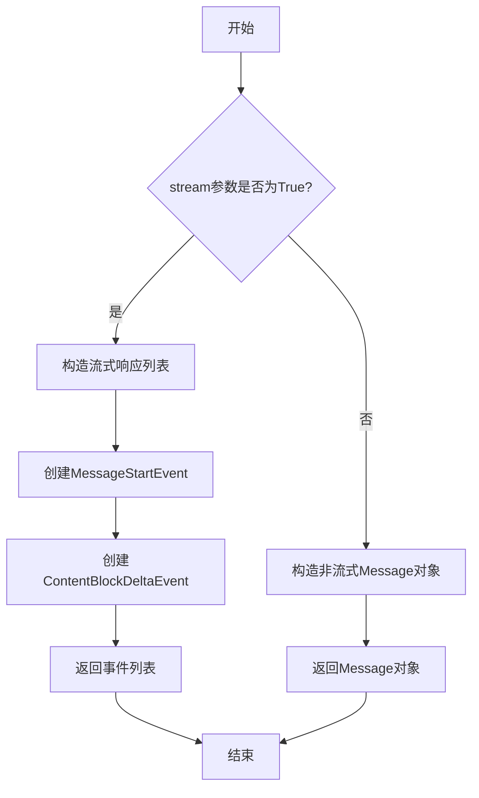
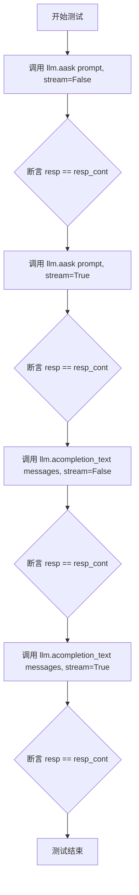

# `.\MetaGPT\tests\metagpt\provider\req_resp_const.py` 详细设计文档

该文件是一个用于大语言模型（LLM）提供商单元测试的测试数据生成模块。它为核心功能是创建和返回模拟不同LLM提供商（如OpenAI、Anthropic、DashScope、QianFan、Amazon Bedrock等）API响应的标准化数据结构，以便在测试中验证LLM抽象层（BaseLLM）与各提供商接口的兼容性和正确性。

## 整体流程



## 类结构

```
本文件不包含类层次结构，主要由全局函数和全局变量构成。
├── 全局变量 (用于配置和模板)
└── 全局函数 (用于生成各提供商的模拟响应)
```

## 全局变量及字段


### `prompt`
    
用于测试的默认用户提示文本，询问模型的身份

类型：`str`
    


### `messages`
    
用于测试的默认消息列表，包含一个用户角色的消息

类型：`list[dict]`
    


### `resp_cont_tmpl`
    
模型响应内容的模板字符串，用于生成包含模型名称的响应

类型：`str`
    


### `default_resp_cont`
    
使用默认名称'GPT'填充模板后的模型响应内容

类型：`str`
    


### `gemini_messages`
    
用于Google Gemini模型测试的特定格式消息列表

类型：`list[dict]`
    


### `qf_jsonbody_dict`
    
用于百度千帆模型测试的模拟响应JSON结构

类型：`dict`
    


### `BEDROCK_PROVIDER_REQUEST_BODY`
    
Amazon Bedrock服务中不同模型提供商的请求体结构模板

类型：`dict`
    


### `BEDROCK_PROVIDER_RESPONSE_BODY`
    
Amazon Bedrock服务中不同模型提供商的响应体结构模板

类型：`dict`
    


    

## 全局函数及方法

### `get_part_chat_completion`

该函数用于生成一个模拟的、符合 OpenAI ChatCompletion 格式的部分响应字典。它接收一个模型名称作为参数，并返回一个包含“choices”和“usage”信息的字典，主要用于单元测试。

参数：
- `name`：`str`，用于填充响应内容的模型名称。

返回值：`dict`，一个模拟的 OpenAI ChatCompletion 响应字典，包含助手回复和令牌使用情况。

#### 流程图



#### 带注释源码

```python
def get_part_chat_completion(name: str) -> dict:
    # 构造一个模拟的 OpenAI ChatCompletion 响应字典
    part_chat_completion = {
        "choices": [
            {
                "index": 0,
                "message": {
                    "role": "assistant",
                    "content": resp_cont_tmpl.format(name=name),  # 使用传入的 name 填充响应内容
                },
                "finish_reason": "stop",  # 表示正常结束
            }
        ],
        "usage": {"completion_tokens": 22, "prompt_tokens": 19, "total_tokens": 41},  # 模拟的令牌使用统计
    }
    return part_chat_completion
```

### `get_openai_chat_completion`

该函数用于生成一个模拟的 OpenAI ChatCompletion 对象，主要用于单元测试。它接收一个模型名称，并返回一个结构完整的 ChatCompletion 对象，其中包含预设的响应内容、使用量统计和元数据。

参数：

- `name`：`str`，用于填充响应内容的模型名称。

返回值：`ChatCompletion`，一个模拟的 OpenAI 聊天完成响应对象。

#### 流程图



#### 带注释源码

```python
def get_openai_chat_completion(name: str) -> ChatCompletion:
    # 创建一个 ChatCompletion 对象，模拟 OpenAI API 的响应
    openai_chat_completion = ChatCompletion(
        # 预设的请求ID
        id="cmpl-a6652c1bb181caae8dd19ad8",
        # 模型名称，此处使用传入的 name 参数
        model="xx/xxx",
        # 对象类型，表示这是一个聊天完成响应
        object="chat.completion",
        # 创建时间戳
        created=1703300855,
        # 响应选项列表，包含一个 Choice 对象
        choices=[
            Choice(
                # 完成原因，'stop' 表示正常结束
                finish_reason="stop",
                # 选项索引
                index=0,
                # 助手返回的消息，内容根据 name 参数格式化
                message=ChatCompletionMessage(role="assistant", content=resp_cont_tmpl.format(name=name)),
                # 对数概率，此处为 None
                logprobs=None,
            )
        ],
        # 使用量统计，包括完成令牌数、提示令牌数和总令牌数
        usage=CompletionUsage(completion_tokens=110, prompt_tokens=92, total_tokens=202),
    )
    # 返回构造好的 ChatCompletion 对象
    return openai_chat_completion
```

### `get_openai_chat_completion_chunk`

该函数用于生成一个模拟的 OpenAI 流式聊天完成响应块（`ChatCompletionChunk`），主要用于单元测试。它根据传入的 `name` 参数构造一个包含特定内容的响应块，并允许选择是否将使用量信息（`usage`）以字典形式返回。

参数：

- `name`：`str`，用于填充响应内容中的占位符，表示模型名称或身份。
- `usage_as_dict`：`bool`，默认为 `False`。当为 `True` 时，返回的 `ChatCompletionChunk` 对象中的 `usage` 字段为字典类型；为 `False` 时，为 `CompletionUsage` 对象。

返回值：`ChatCompletionChunk`，一个模拟的 OpenAI 流式聊天完成响应块对象。

#### 流程图



#### 带注释源码

```python
def get_openai_chat_completion_chunk(name: str, usage_as_dict: bool = False) -> ChatCompletionChunk:
    # 创建一个标准的 CompletionUsage 对象，包含预设的 token 使用量
    usage = CompletionUsage(completion_tokens=110, prompt_tokens=92, total_tokens=202)
    # 根据 usage_as_dict 参数决定 usage 的最终形式
    usage = usage if not usage_as_dict else usage.model_dump()
    
    # 构造并返回一个 ChatCompletionChunk 对象
    openai_chat_completion_chunk = ChatCompletionChunk(
        id="cmpl-a6652c1bb181caae8dd19ad8",  # 固定的模拟 ID
        model="xx/xxx",                      # 模拟的模型名称
        object="chat.completion.chunk",      # 对象类型标识
        created=1703300855,                  # 固定的创建时间戳
        choices=[
            AChoice(
                delta=ChoiceDelta(role="assistant", content=resp_cont_tmpl.format(name=name)),  # 响应内容，使用传入的 name 填充模板
                finish_reason="stop",        # 完成原因
                index=0,                     # 选择索引
                logprobs=None,               # 日志概率（无）
            )
        ],
        usage=usage,                         # 使用量信息，可能是对象或字典
    )
    return openai_chat_completion_chunk
```

### `get_qianfan_response`

该函数用于生成一个模拟的千帆（QianFan）API响应对象，主要用于单元测试。它接收一个名称参数，将其格式化到响应模板中，并返回一个包含预设响应体和状态码的QfResponse对象。

参数：

- `name`：`str`，用于填充响应模板的名称，例如模型名称或提供者名称

返回值：`QfResponse`，一个模拟的千帆API响应对象，包含状态码200和格式化后的响应体

#### 流程图

```mermaid
flowchart TD
    A[开始] --> B[接收参数 name]
    B --> C[格式化响应模板<br>resp_cont_tmpl.format(name=name)]
    C --> D[更新全局变量<br>qf_jsonbody_dict['result']]
    D --> E[创建 QfResponse 对象<br>code=200, body=qf_jsonbody_dict]
    E --> F[返回 QfResponse 对象]
    F --> G[结束]
```

#### 带注释源码

```python
def get_qianfan_response(name: str) -> QfResponse:
    # 使用传入的name参数格式化预设的响应模板字符串
    # 模板为: "I'm {name}"
    qf_jsonbody_dict["result"] = resp_cont_tmpl.format(name=name)
    
    # 返回一个QfResponse对象，状态码固定为200（表示成功）
    # 响应体为预设的字典结构qf_jsonbody_dict，其中'result'字段已被更新
    return QfResponse(code=200, body=qf_jsonbody_dict)
```

### `get_dashscope_response`

该函数用于生成一个模拟的 DashScope（阿里云灵积）API 响应对象，主要用于单元测试。它接收一个模型名称，并将其格式化到响应内容中，最终返回一个符合 `GenerationResponse` 类型的对象。

参数：
- `name`：`str`，用于填充响应内容的模型名称。

返回值：`GenerationResponse`，一个模拟的 DashScope API 响应对象，包含状态码、输出内容和使用量信息。

#### 流程图



#### 带注释源码

```python
def get_dashscope_response(name: str) -> GenerationResponse:
    # 函数功能：生成一个模拟的 DashScope API 响应，用于测试。
    # 参数 name: 模型名称，将被格式化为响应内容的一部分。
    # 返回值: 一个 GenerationResponse 对象，模拟了成功的 API 调用响应。

    return GenerationResponse.from_api_response(
        # 创建一个 DashScopeAPIResponse 对象，模拟 API 的原始响应。
        DashScopeAPIResponse(
            status_code=200,  # 状态码，200 表示成功。
            output=GenerationOutput(
                **{  # 使用字典解包方式创建 GenerationOutput 对象。
                    "text": "",  # 文本字段，此处为空，实际内容在 choices 中。
                    "finish_reason": "",  # 完成原因，此处为空。
                    "choices": [  # 选择列表，包含一个消息。
                        {
                            "finish_reason": "stop",  # 该条消息的完成原因为“停止”。
                            "message": {
                                "role": "assistant",  # 消息角色为助手。
                                "content": resp_cont_tmpl.format(name=name),  # 消息内容，使用模板格式化 name。
                            },
                        }
                    ],
                }
            ),
            usage=GenerationUsage(  # 使用量信息。
                **{"input_tokens": 12, "output_tokens": 98, "total_tokens": 110}  # 模拟的 token 使用数量。
            ),
        )
    )
```

### `get_anthropic_response`

该函数用于生成模拟的Anthropic API响应，用于单元测试。根据`stream`参数，它可以返回一个完整的`Message`对象（非流式响应）或一个包含流式事件（`MessageStartEvent`和`ContentBlockDeltaEvent`）的列表（流式响应）。返回的内容使用模板字符串格式化，其中包含传入的`name`参数。

参数：
- `name`：`str`，用于填充响应内容模板的名称。
- `stream`：`bool`，默认为`False`。指示是否返回流式响应。如果为`True`，则返回事件列表；如果为`False`，则返回完整的`Message`对象。

返回值：`Union[Message, List[Union[MessageStartEvent, ContentBlockDeltaEvent]]]`，根据`stream`参数，返回一个Anthropic `Message`对象或一个包含流式事件的列表。

#### 流程图



#### 带注释源码

```python
def get_anthropic_response(name: str, stream: bool = False) -> Message:
    # 检查是否请求流式响应
    if stream:
        # 返回一个列表，包含流式响应的开始事件和内容块增量事件
        return [
            MessageStartEvent(
                message=Message(
                    id="xxx",  # 模拟消息ID
                    model=name,  # 模型名称，使用传入的name参数
                    role="assistant",  # 角色为助手
                    type="message",  # 类型为消息
                    content=[ContentBlock(text="", type="text")],  # 初始内容块为空文本
                    usage=AnthropicUsage(input_tokens=10, output_tokens=10),  # 模拟使用量统计
                ),
                type="message_start",  # 事件类型为消息开始
            ),
            ContentBlockDeltaEvent(
                index=0,  # 内容块索引
                delta=TextDelta(text=resp_cont_tmpl.format(name=name), type="text_delta"),  # 文本增量，包含格式化的响应内容
                type="content_block_delta",  # 事件类型为内容块增量
            ),
        ]
    else:
        # 返回一个完整的非流式Message对象
        return Message(
            id="xxx",  # 模拟消息ID
            model=name,  # 模型名称，使用传入的name参数
            role="assistant",  # 角色为助手
            type="message",  # 类型为消息
            content=[ContentBlock(text=resp_cont_tmpl.format(name=name), type="text")],  # 内容块，包含格式化的响应内容
            usage=AnthropicUsage(input_tokens=10, output_tokens=10),  # 模拟使用量统计
        )
```

### `llm_general_chat_funcs_test`

这是一个用于测试`BaseLLM`类通用聊天功能的异步函数。它通过调用LLM实例的`aask`和`acompletion_text`方法（包括流式和非流式模式），并断言返回内容与预期一致，来验证LLM提供者的基本功能是否正常工作。

参数：

- `llm`：`BaseLLM`，待测试的LLM实例，必须实现`aask`和`acompletion_text`方法。
- `prompt`：`str`，作为字符串输入的提示词，用于测试`aask`方法。
- `messages`：`list[dict]`，作为消息列表输入的提示词，用于测试`acompletion_text`方法。
- `resp_cont`：`str`，预期的响应内容，用于与LLM的实际输出进行比较断言。

返回值：`None`，此函数不返回任何值，其功能通过内部的`assert`语句来验证。

#### 流程图



#### 带注释源码

```python
async def llm_general_chat_funcs_test(llm: BaseLLM, prompt: str, messages: list[dict], resp_cont: str):
    # 测试非流式模式的 aask 方法
    resp = await llm.aask(prompt, stream=False)
    # 断言返回内容与预期一致
    assert resp == resp_cont

    # 测试流式模式的 aask 方法 (stream参数默认为True)
    resp = await llm.aask(prompt)
    assert resp == resp_cont

    # 测试非流式模式的 acompletion_text 方法
    resp = await llm.acompletion_text(messages, stream=False)
    assert resp == resp_cont

    # 测试流式模式的 acompletion_text 方法
    resp = await llm.acompletion_text(messages, stream=True)
    assert resp == resp_cont
```

## 关键组件

### 多模型响应构造器

该组件包含一系列用于为不同大语言模型（LLI）提供者（如OpenAI、Anthropic、DashScope、QianFan、Amazon Bedrock等）生成标准化测试响应数据的函数。它通过统一的模板（`resp_cont_tmpl`）来模拟不同提供者的API响应结构，旨在为`BaseLLM`及其子类的单元测试提供一致的、可预测的模拟数据。

### 通用LLM测试函数

该组件提供了一个异步测试函数 `llm_general_chat_funcs_test`，用于对实现了`BaseLLM`接口的LLM对象进行通用功能测试。它通过调用`aask`和`acompletion_text`方法（包括流式和非流式模式）来验证LLM是否能正确处理输入并返回预期的响应内容，从而确保不同LLM提供者接口的一致性。

## 问题及建议


### 已知问题

-   **硬编码的测试数据**：代码中大量使用了硬编码的字符串（如 `"Hello World"`、`"cmpl-a6652c1bb181caae8dd19ad8"`）和数值（如 `1703300855`）。这些数据缺乏上下文，使得测试用例难以理解和维护，且无法灵活地适应不同测试场景。
-   **重复的模板逻辑**：多个函数（如 `get_openai_chat_completion`、`get_qianfan_response`、`get_dashscope_response`）都使用相同的 `resp_cont_tmpl.format(name=name)` 模式来生成响应内容。这种重复增加了维护成本，如果响应模板需要修改，必须在多个地方进行同步更新。
-   **不一致的数据结构**：`BEDROCK_PROVIDER_REQUEST_BODY` 和 `BEDROCK_PROVIDER_RESPONSE_BODY` 字典中的键（如 `"mistral"`, `"meta"`, `"ai21-j2"`）与实际的提供商或模型名称可能不完全对应，且结构复杂，容易在扩展或修改时引入错误。
-   **脆弱的断言依赖**：`llm_general_chat_funcs_test` 函数中的断言 `assert resp == resp_cont` 依赖于外部传入的 `resp_cont` 参数与内部生成的响应内容完全一致。如果LLM提供商的响应格式稍有变化（例如添加了额外的空格或换行），测试就会失败，降低了测试的健壮性。
-   **缺乏类型安全**：`BEDROCK_PROVIDER_REQUEST_BODY` 和 `BEDROCK_PROVIDER_RESPONSE_BODY` 是普通的Python字典，其内部结构没有类型提示。这增加了在编写或修改相关代码时出错的风险，IDE也无法提供有效的自动补全或错误检查。

### 优化建议

-   **使用工厂模式或配置化数据**：建议将测试数据（如固定的ID、时间戳、默认响应内容）提取到配置文件（如JSON、YAML）或使用工厂函数/类来集中管理。这样可以提高数据的可读性、可维护性，并方便在不同测试用例间复用和修改。
-   **抽象公共的响应构建逻辑**：创建一个通用的响应构建器（例如一个`ResponseFactory`类），根据提供商类型和参数动态生成对应的响应对象。这可以消除代码重复，使添加新的提供商支持变得更加容易。
-   **为Bedrock数据结构定义Pydantic模型或TypedDict**：将 `BEDROCK_PROVIDER_REQUEST_BODY` 和 `BEDROCK_PROVIDER_RESPONSE_BODY` 中的嵌套字典结构定义为Pydantic模型或使用`TypedDict`。这可以带来类型检查、自动补全、数据验证和序列化/反序列化的便利，显著提升代码的健壮性和开发体验。
-   **增强测试的健壮性**：在 `llm_general_chat_funcs_test` 函数中，将严格的字符串相等断言（`==`）改为更灵活的检查，例如使用 `in` 操作符检查关键内容是否包含在响应中，或者使用正则表达式匹配。这可以使测试对提供商响应的非关键性变化（如格式微调）更具容忍度。
-   **添加文档字符串和示例**：为每个数据生成函数（如 `get_openai_chat_completion`）和大型数据结构（如 `BEDROCK_PROVIDER_REQUEST_BODY`）添加详细的文档字符串，说明其用途、返回的数据结构以及如何使用。这能极大地方便其他开发者理解和使用这些测试工具。
-   **考虑使用Mock库**：评估是否可以用更专业的测试工具（如`unittest.mock`）来模拟LLM响应，而不是手动构建完整的、可能很复杂的响应对象。Mock对象可以更灵活地控制返回值和行为，简化测试设置。


## 其它


### 设计目标与约束

本模块的核心设计目标是提供一个统一的、可扩展的测试数据工厂，用于生成模拟不同大语言模型（LLM）提供商API的响应数据。其核心约束包括：1) **接口一致性**：所有生成函数需返回对应提供商SDK的原生响应对象（如OpenAI的`ChatCompletion`），以确保测试代码与生产代码使用相同的数据结构。2) **数据可控性**：响应内容（如`resp_cont_tmpl`）和关键参数（如`name`）应可定制，以支持断言验证。3) **最小依赖**：仅导入必要的类型定义，避免引入业务逻辑，保持模块的纯粹性和测试的独立性。4) **向后兼容**：当提供商SDK更新时，需同步更新对应的模拟数据结构和生成逻辑。

### 错误处理与异常设计

当前模块作为测试数据生成器，本身不包含复杂的业务逻辑，因此未显式定义错误处理。其潜在错误场景及设计包括：1) **输入参数错误**：如`get_openai_chat_completion_chunk`函数的`usage_as_dict`参数若为True，返回对象的`usage`字段将是字典而非`CompletionUsage`对象，这可能违反调用方预期。此设计依赖于调用者理解其行为，属于“契约式”设计而非防御式编程。2) **外部类型变更**：如果导入的第三方SDK（如`openai.types`）中的类型定义发生不兼容变更，本模块的生成函数将因构造参数不匹配而抛出`TypeError`。这属于测试环境与依赖版本同步问题，需通过依赖管理和测试发现。模块本身未捕获此类异常，旨在快速暴露兼容性问题。

### 数据流与状态机

本模块无内部状态，所有函数均为纯函数，其数据流是静态和单向的。核心数据流围绕模板`resp_cont_tmpl = "I'm {name}"`展开：1) **输入**：各生成函数（如`get_openai_chat_completion`）接收一个字符串参数`name`。2) **处理**：函数内部使用`resp_cont_tmpl.format(name=name)`将模板与输入参数结合，生成确定的响应内容字符串。3) **输出**：使用该内容字符串，结合硬编码的其他字段（如`id`, `usage`），构造出符合特定提供商API响应格式的对象（如`ChatCompletion`）。整个流程无分支状态（除了`get_anthropic_response`根据`stream`参数返回不同类型），数据从输入参数流经模板格式化，最终封装为结构化输出对象。

### 外部依赖与接口契约

本模块严重依赖多个外部LLM提供商SDK的类型定义，其接口契约体现在函数签名和返回对象上：1) **OpenAI**：依赖`openai.types.chat`中的`ChatCompletion`, `ChatCompletionChunk`, `Choice`等类型。`get_openai_chat_completion`等函数契约是返回一个完全填充的、符合OpenAI API文档结构的对象实例。2) **Anthropic**：依赖`anthropic.types`中的`Message`, `MessageStartEvent`等类型。`get_anthropic_response`契约是当`stream=False`时返回`Message`对象，`stream=True`时返回包含事件对象的列表。3) **DashScope**、**QianFan**：类似地，依赖其SDK的响应类型（`GenerationResponse`, `QfResponse`），并返回对应的对象实例。4) **Bedrock**：不直接依赖SDK类型，而是以字典形式定义了各模型（如`"mistral"`, `"anthropic"`）的请求与响应体结构，其契约是提供符合AWS Bedrock服务文档的JSON结构模板。这些依赖要求测试环境必须安装相应的SDK包，且版本需与生产环境兼容。

    