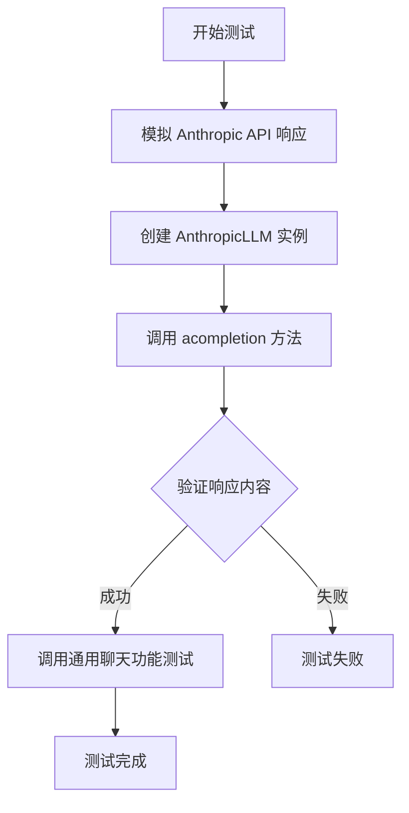
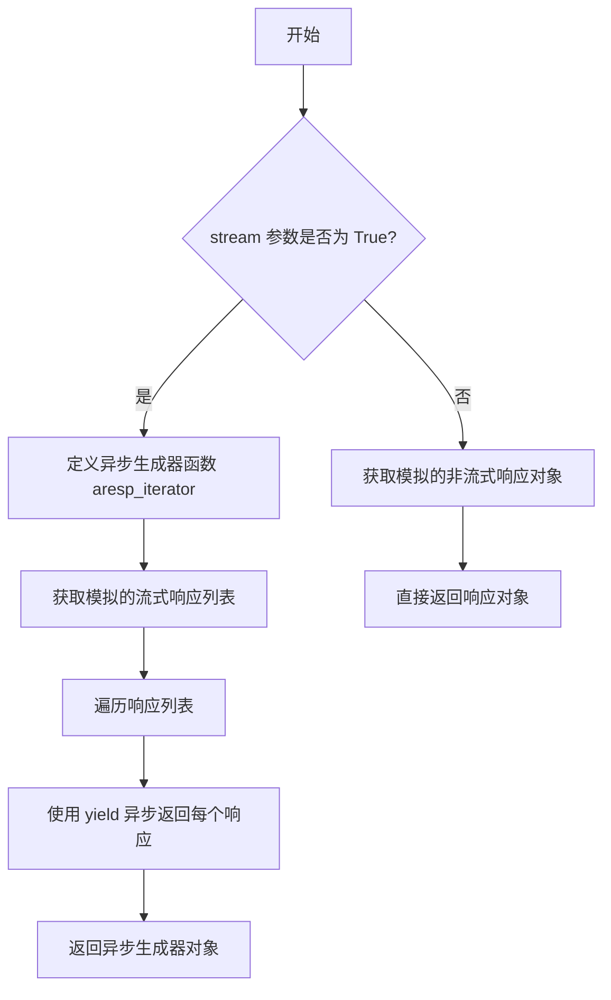
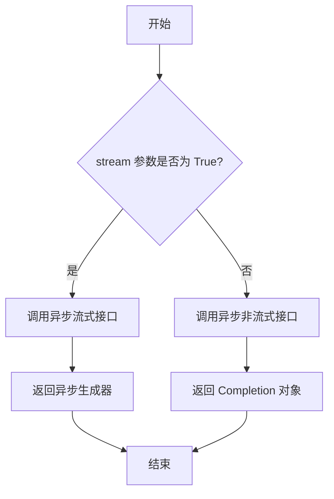

# `.\MetaGPT\tests\metagpt\provider\test_anthropic_api.py` 详细设计文档

该文件是一个针对 Anthropic Claude API 的单元测试，主要测试 AnthropicLLM 类的异步完成功能。它通过模拟 Anthropic API 的响应来验证 acompletion 方法是否能正确处理消息并返回预期的响应内容，同时测试通用的聊天功能。

## 整体流程



## 类结构

```
测试文件结构
├── 全局变量
│   ├── name
│   └── resp_cont
├── 全局函数
│   ├── mock_anthropic_messages_create
│   └── test_anthropic_acompletion
└── 外部依赖
    ├── AnthropicLLM
    ├── Completion
    └── 测试工具函数
```

## 全局变量及字段


### `name`
    
Anthropic Claude模型名称，用于测试中指定要使用的模型版本

类型：`str`
    


### `resp_cont`
    
预期的响应内容模板，用于验证Anthropic API返回的响应是否符合预期

类型：`str`
    


    

## 全局函数及方法


### `mock_anthropic_messages_create`

这是一个用于单元测试的模拟函数，用于模拟 Anthropic API 的 `AsyncMessages.create` 方法。它根据传入的 `stream` 参数决定返回一个异步迭代器（用于流式响应）还是一个完整的响应对象，从而在不实际调用外部 API 的情况下测试 `AnthropicLLM` 类的异步完成功能。

参数：

-   `self`：`Any`，模拟方法的实例参数（通常为 `AsyncMessages` 类的实例）。
-   `messages`：`list[dict]`，要发送给模型的消息列表。
-   `model`：`str`，要使用的模型名称。
-   `stream`：`bool`，默认为 `True`。指示是否以流式方式返回响应。
-   `max_tokens`：`int`，可选。响应中生成的最大令牌数。
-   `system`：`str`，可选。系统提示信息。

返回值：`Union[AsyncIterator[Completion], Completion]`，如果 `stream` 为 `True`，则返回一个异步迭代器，每次迭代产生一个 `Completion` 对象；否则，直接返回一个 `Completion` 对象。

#### 流程图



#### 带注释源码

```python
async def mock_anthropic_messages_create(
    self, messages: list[dict], model: str, stream: bool = True, max_tokens: int = None, system: str = None
) -> Completion:
    # 检查是否请求流式响应
    if stream:
        # 定义一个异步生成器函数，用于模拟流式响应
        async def aresp_iterator():
            # 调用辅助函数获取模拟的流式响应列表
            resps = get_anthropic_response(name, stream=True)
            # 遍历响应列表
            for resp in resps:
                # 异步生成（yield）每个响应，模拟数据分块到达
                yield resp
        # 返回异步生成器对象，调用者可以通过 `async for` 循环消费数据
        return aresp_iterator()
    else:
        # 非流式模式：直接调用辅助函数获取并返回完整的模拟响应对象
        return get_anthropic_response(name)
```


### `test_anthropic_acompletion`

这是一个使用 `pytest` 和 `mocker` 编写的异步单元测试函数，用于测试 `AnthropicLLM` 类的 `acompletion` 方法。它通过模拟（Mock）Anthropic API 的响应，验证 `AnthropicLLM` 能否正确处理聊天消息并返回预期的完成结果。

参数：

-   `mocker`：`pytest-mock` 提供的 `MockerFixture` 类型对象，用于在测试中创建和管理模拟对象（Mock）。

返回值：`None`，这是一个测试函数，其主要目的是通过断言（assert）来验证代码行为，不返回业务值。

#### 流程图

```mermaid
flowchart TD
    A[开始测试<br>test_anthropic_acompletion] --> B[mocker.patch<br>模拟AsyncMessages.create方法]
    B --> C[创建被测对象<br>AnthropicLLM实例]
    C --> D[调用被测方法<br>await anthropic_llm.acompletion]
    D --> E{模拟方法逻辑判断<br>stream参数是否为True?}
    E -- 是 --> F[创建并返回<br>异步生成器<br>模拟流式响应]
    E -- 否 --> G[直接返回<br>模拟的非流式响应]
    F --> H[获取响应内容<br>resp.content[0].text]
    G --> H
    H --> I[断言验证<br>响应内容与预期一致]
    I --> J[调用通用测试函数<br>llm_general_chat_funcs_test]
    J --> K[测试结束]
```

#### 带注释源码

```python
@pytest.mark.asyncio  # 标记此函数为异步测试函数，以便pytest-asyncio插件能够正确处理
async def test_anthropic_acompletion(mocker):  # 定义异步测试函数，接收mocker fixture
    # 使用mocker.patch替换`anthropic.resources.messages.AsyncMessages.create`方法
    # 将其替换为自定义的模拟函数`mock_anthropic_messages_create`
    # 这样在测试中调用真实的Anthropic API时，实际执行的是我们的模拟逻辑
    mocker.patch("anthropic.resources.messages.AsyncMessages.create", mock_anthropic_messages_create)

    # 使用模拟的LLM配置创建被测试的AnthropicLLM类实例
    anthropic_llm = AnthropicLLM(mock_llm_config_anthropic)

    # 调用被测试的异步方法`acompletion`，传入预定义的`messages`（聊天消息列表）
    # 由于AsyncMessages.create已被模拟，这里不会发起真实网络请求
    resp = await anthropic_llm.acompletion(messages)
    # 断言：验证返回的响应对象中，第一个内容块的文本是否等于预期的`resp_cont`
    assert resp.content[0].text == resp_cont

    # 调用另一个通用的LLM聊天功能测试函数，对`anthropic_llm`实例进行更多测试
    # 传入LLM实例、提示词、消息和预期响应内容，该函数内部可能包含更多断言
    await llm_general_chat_funcs_test(anthropic_llm, prompt, messages, resp_cont)
```

### `AnthropicLLM.acompletion`

该方法用于异步调用 Anthropic Claude 模型的聊天补全接口，支持流式和非流式响应，并处理消息列表以生成模型回复。

参数：

- `messages`：`list[dict]`，包含对话历史的消息列表，每个消息是一个字典，通常包含 `role` 和 `content` 字段。
- `stream`：`bool`，可选参数，默认为 `True`，指示是否使用流式响应。
- `timeout`：`int`，可选参数，请求超时时间（秒）。
- `system`：`str`，可选参数，系统提示信息，用于指导模型行为。
- `max_tokens`：`int`，可选参数，生成回复的最大令牌数。

返回值：`Union[AsyncGenerator, Completion]`，如果 `stream=True`，返回一个异步生成器，逐块生成响应；否则返回一个 `Completion` 对象，包含完整的响应内容。

#### 流程图



#### 带注释源码

```python
async def acompletion(
    self,
    messages: list[dict],
    stream: bool = True,
    timeout: int = 60,
    system: str = None,
    max_tokens: int = None,
) -> Union[AsyncGenerator, Completion]:
    """
    异步调用 Anthropic Claude 模型的聊天补全接口。

    Args:
        messages (list[dict]): 消息列表，每个消息是一个字典，包含 'role' 和 'content' 字段。
        stream (bool, optional): 是否使用流式响应。默认为 True。
        timeout (int, optional): 请求超时时间（秒）。默认为 60。
        system (str, optional): 系统提示信息。默认为 None。
        max_tokens (int, optional): 生成回复的最大令牌数。默认为 None。

    Returns:
        Union[AsyncGenerator, Completion]: 如果 stream=True，返回异步生成器；否则返回 Completion 对象。
    """
    # 构建请求参数
    kwargs = self._const_kwargs(messages, stream, timeout)
    if system:
        kwargs["system"] = system
    if max_tokens:
        kwargs["max_tokens"] = max_tokens

    # 根据 stream 参数选择调用方式
    if stream:
        # 调用流式接口，返回异步生成器
        return await self.aclient.messages.create(**kwargs)
    else:
        # 调用非流式接口，返回 Completion 对象
        return await self.aclient.messages.create(**kwargs)
```

## 关键组件


### AnthropicLLM 类

AnthropicLLM 类是 MetaGPT 框架中用于与 Anthropic Claude API 进行交互的核心组件，封装了异步完成请求的功能。

### 异步完成方法 (`acompletion`)

`acompletion` 方法是 AnthropicLLM 类的核心方法，负责将标准化的消息列表转换为 Anthropic API 所需的格式，并处理其流式与非流式响应。

### 模拟测试组件 (`mock_anthropic_messages_create`)

`mock_anthropic_messages_create` 函数是一个用于单元测试的模拟组件，它替换了真实的 Anthropic API 调用，根据测试需求返回预设的流式或非流式响应数据。

### 测试验证组件 (`test_anthropic_acompletion`)

`test_anthropic_acompletion` 函数是主要的测试用例，它通过模拟环境来验证 `AnthropicLLM.acompletion` 方法的正确性，包括响应内容断言和通用聊天功能测试。


## 问题及建议


### 已知问题

-   **测试用例与实现细节强耦合**：`test_anthropic_acompletion` 函数直接模拟了 `anthropic.resources.messages.AsyncMessages.create` 方法，这使得测试高度依赖于 Anthropic SDK 的内部实现细节。如果 SDK 更新了其内部结构（例如，重命名了类或方法），此测试将立即失败，即使被测试的 `AnthropicLLM` 类的核心逻辑没有变化。这增加了维护成本并降低了测试的健壮性。
-   **模拟数据生成逻辑重复且硬编码**：`get_anthropic_response` 函数被用于生成模拟的 API 响应。测试中直接使用了硬编码的模型名称 `"claude-3-opus-20240229"` 和响应内容模板 `resp_cont_tmpl`。如果未来需要测试更多模型或不同的响应结构，需要修改多处硬编码的值，这不利于测试的扩展性和可维护性。
-   **缺乏对错误和边界条件的测试**：当前的测试用例主要覆盖了正常的、成功的 API 调用路径。它没有测试 `AnthropicLLM` 类在遇到 API 错误（如网络问题、认证失败、速率限制、无效请求参数）时的行为，也没有测试其对不同输入（如空消息列表、超长消息）的边界处理。这可能导致生产环境中未预期的行为。
-   **测试函数职责不单一**：`test_anthropic_acompletion` 函数同时测试了 `acompletion` 方法和通过 `llm_general_chat_funcs_test` 测试的其他聊天功能。虽然这提高了测试效率，但当一个测试失败时，定位具体是哪个功能或哪个条件导致失败会变得更加困难。这违反了单元测试的“单一职责”原则。

### 优化建议

-   **重构测试以使用接口抽象**：建议为 LLM 提供商定义一个清晰的抽象接口或基类。`AnthropicLLM` 应实现此接口。测试则应针对该接口编写，并使用依赖注入（例如，通过 pytest fixture）来提供模拟的客户端实例，而不是直接修补 SDK 的内部方法。这样可以将测试与第三方 SDK 的具体实现解耦。
-   **集中化和参数化模拟数据**：创建一个专门的测试夹具（fixture）或工厂函数来生成模拟的请求和响应数据。使用 `pytest.mark.parametrize` 来参数化测试用例，使其能够轻松地使用不同的模型名称、消息内容和预期的响应进行测试。这提高了测试的覆盖率和可读性。
-   **补充负面测试和边界测试**：增加新的测试用例，专门测试 `AnthropicLLM` 类的错误处理能力。例如，模拟 `anthropic.APIConnectionError`、`anthropic.APIStatusError` 等异常，并验证 `AnthropicLLM` 是否正确地捕获并重新抛出了预期的异常类型。同时，添加对输入参数有效性的边界测试。
-   **拆分测试函数，提升可读性和可维护性**：将 `test_anthropic_acompletion` 拆分为多个更小、更专注的测试函数。例如：`test_acompletion_success`、`test_acompletion_streaming`、`test_acompletion_with_system_prompt`、`test_achat_success` 等。每个函数只测试一个特定的场景或功能点。这样可以使测试报告更清晰，便于快速定位问题。
-   **考虑集成测试与单元测试的分离**：当前测试更像是与模拟外部服务进行的集成测试。建议建立清晰的测试层级：1) **单元测试**：使用完全模拟的、可控的依赖，快速测试 `AnthropicLLM` 内部的业务逻辑（如消息格式转换、参数构建）。2) **集成测试**：使用像当前这样的模拟 HTTP 响应或测试专用 API 密钥，测试与 Anthropic SDK 的集成。这有助于更精确地定位缺陷的来源。


## 其它


### 设计目标与约束

本测试模块的设计目标是验证 `AnthropicLLM` 类与 Anthropic Claude API 的集成功能，特别是其异步完成 (`acompletion`) 方法。核心约束包括：1) 必须在不实际调用真实外部 API 的情况下进行测试（即单元测试隔离），这通过模拟（mocking）实现；2) 测试需要覆盖同步和异步两种响应模式（流式与非流式），但当前测试焦点是异步流式响应；3) 测试需验证 `AnthropicLLM` 能正确处理标准化的消息输入格式，并解析出预期的响应内容。

### 错误处理与异常设计

当前测试代码本身不直接包含生产环境的错误处理逻辑，它旨在验证正常路径。然而，它通过模拟机制间接测试了 `AnthropicLLM.acompletion` 方法对特定 API 响应结构的处理能力。潜在的异常测试点（未在本段代码中体现但应在完整测试套件中考虑）包括：模拟 API 返回错误状态码（如 429 限流、5xx 服务器错误）、返回非预期的 JSON 结构、网络超时等，并断言 `AnthropicLLM` 能抛出或处理相应的异常（如 `APIConnectionError`, `APIStatusError`）。

### 数据流与状态机

1.  **测试初始化流**：从 `mock_llm_config_anthropic` 获取配置 -> 实例化 `AnthropicLLM` 对象。
2.  **API 调用模拟流**：测试函数调用 `anthropic_llm.acompletion(messages)` -> 该方法内部调用 `anthropic.resources.messages.AsyncMessages.create` -> 此调用被 `mocker.patch` 重定向至 `mock_anthropic_messages_create` 函数。
3.  **模拟响应生成流**：
    *   `mock_anthropic_messages_create` 根据 `stream=True` 参数，返回一个异步生成器 `aresp_iterator()`。
    *   该生成器迭代预定义的 `get_anthropic_response(name, stream=True)` 返回的响应列表，模拟了 API 的流式返回。
4.  **断言验证流**：`acompletion` 返回的 `resp` 对象中的文本内容 (`resp.content[0].text`) 与预期模板 `resp_cont` 进行比较，验证功能正确性。
5.  **通用功能测试流**：调用 `llm_general_chat_funcs_test` 执行一组标准化的 LLM 功能测试（如 `achat`, `aask` 等），传入模拟的 LLM 实例、输入和预期输出，进行进一步集成验证。

### 外部依赖与接口契约

1.  **外部依赖**：
    *   `anthropic` 官方库：特别是 `anthropic.resources.messages.AsyncMessages.create` 方法。测试通过 mocking 解耦了对其实施的依赖。
    *   `pytest` 和 `pytest-asyncio`：测试框架和异步支持。
    *   `metagpt.provider.anthropic_api.AnthropicLLM`：被测系统（SUT）。
    *   `tests.metagpt.provider.mock_llm_config` 与 `tests.metagpt.provider.req_resp_const`：测试工具模块，提供模拟配置和固定的请求/响应数据。
2.  **接口契约**：
    *   **被模拟的 API 契约**：`mock_anthropic_messages_create` 函数模拟了 `AsyncMessages.create` 的接口，接受 `messages`, `model`, `stream`, `max_tokens`, `system` 参数，并返回一个 `Completion` 对象或一个异步生成器。这定义了测试中假定的 Anthropic API 行为。
    *   **LLM 提供者契约**：`AnthropicLLM.acompletion` 方法需接受 `messages` 列表，并返回一个包含可解析文本内容的响应对象。`llm_general_chat_funcs_test` 函数封装了对 `achat`, `aask` 等高层方法签名的通用验证。
    *   **测试数据契约**：`get_anthropic_response` 函数需根据给定的模型 `name` 和 `stream` 标志，返回结构正确的模拟 API 响应数据。

    