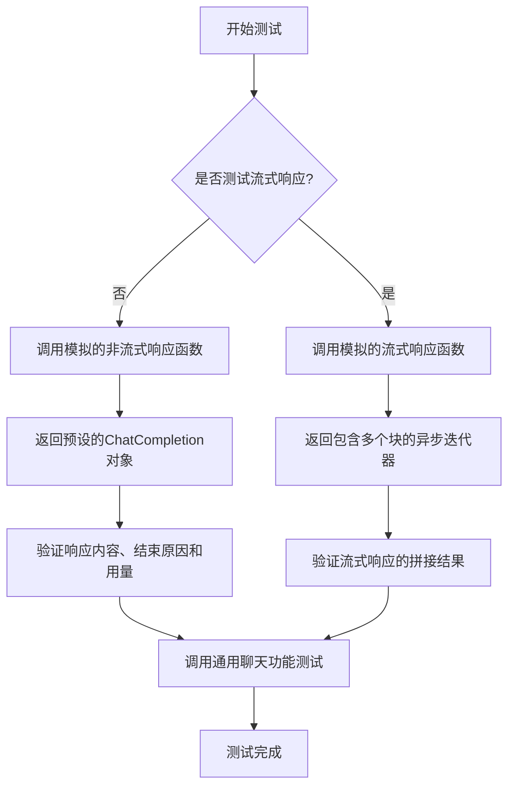
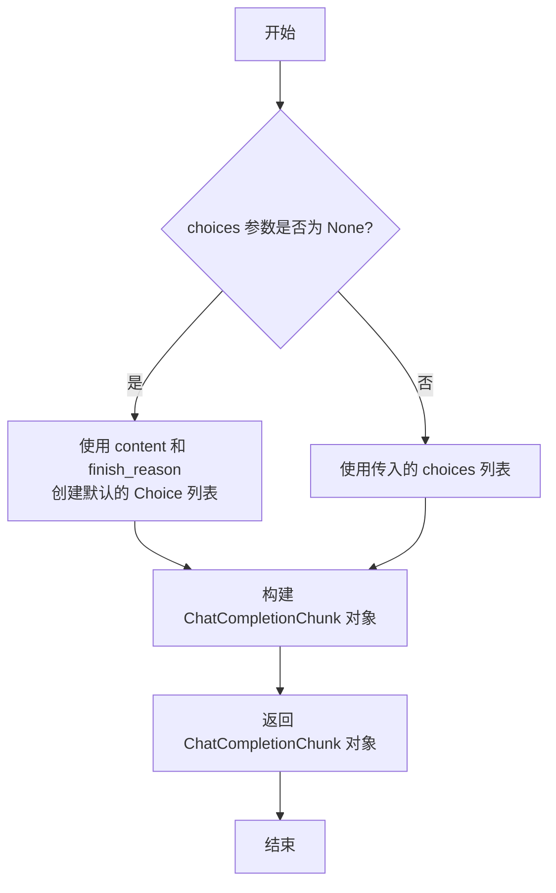
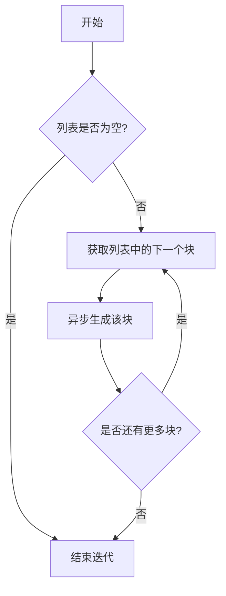
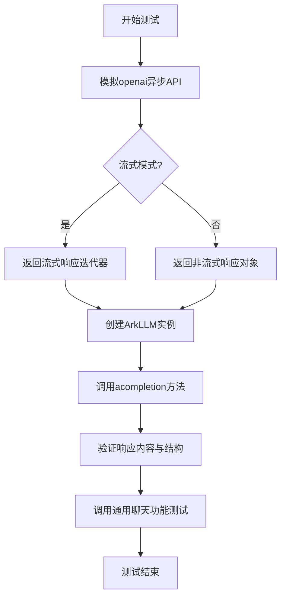

# `.\MetaGPT\tests\metagpt\provider\test_ark.py` 详细设计文档

该代码是火山方舟（Volcano Ark）Python SDK V3 的测试文件，核心功能是通过模拟（Mock）OpenAI API 的响应，对 ArkLLM 类的异步聊天补全（acompletion）方法进行单元测试，验证其能否正确处理流式和非流式响应，并与通用聊天功能测试工具集成。

## 整体流程



## 类结构

```
测试文件 (test_ark_api.py)
├── 全局函数
│   ├── create_chat_completion_chunk
│   ├── chunk_iterator
│   └── mock_ark_acompletions_create
├── 测试函数
│   └── test_ark_acompletion
└── 外部依赖类
    └── ArkLLM (来自 metagpt.provider.ark_api)
```

## 全局变量及字段


### `name`
    
AI助手的名称，用于格式化响应内容模板

类型：`str`
    


### `resp_cont`
    
格式化后的预期响应内容，用于测试断言

类型：`str`
    


### `USAGE`
    
模拟的token使用量统计，包含prompt_tokens、completion_tokens和total_tokens

类型：`dict`
    


### `default_resp`
    
模拟的非流式响应对象，包含模型名称和token使用量

类型：`openai.types.chat.ChatCompletion`
    


### `ark_resp_chunk`
    
模拟的流式响应起始chunk，内容为空

类型：`openai.types.chat.ChatCompletionChunk`
    


### `ark_resp_chunk_finish`
    
模拟的流式响应内容chunk，包含完整响应内容和停止原因

类型：`openai.types.chat.ChatCompletionChunk`
    


### `ark_resp_chunk_last`
    
模拟的流式响应结束chunk，choices为空列表，包含token使用量

类型：`openai.types.chat.ChatCompletionChunk`
    


    

## 全局函数及方法

### `create_chat_completion_chunk`

该函数用于创建一个符合 OpenAI Chat Completion Chunk 格式的数据块对象，主要用于模拟或构建流式聊天完成响应中的单个数据块。

参数：

- `content`：`str`，数据块中包含的文本内容。
- `finish_reason`：`str`，可选参数，表示生成结束的原因，例如 `"stop"`。
- `choices`：`List[Choice]`，可选参数，直接提供 `Choice` 对象列表；如果未提供，则函数会根据 `content` 和 `finish_reason` 创建一个默认的 `Choice` 列表。

返回值：`ChatCompletionChunk`，返回一个构建好的聊天完成数据块对象。

#### 流程图



#### 带注释源码

```python
def create_chat_completion_chunk(
    content: str, finish_reason: str = None, choices: List[Choice] = None
) -> ChatCompletionChunk:
    # 如果调用者没有提供 choices 列表，则创建一个默认的列表。
    # 默认列表包含一个 Choice 对象，其 delta 字段包含传入的 content 和 finish_reason。
    if choices is None:
        choices = [
            Choice(
                delta=ChoiceDelta(content=content, function_call=None, role="assistant", tool_calls=None),
                finish_reason=finish_reason,
                index=0,
                logprobs=None,
            )
        ]

    # 使用提供的或默认的 choices 列表，以及其他固定或计算出的字段，构建并返回一个 ChatCompletionChunk 对象。
    # `usage` 字段的逻辑是：如果 choices 列表为空，则返回 USAGE 字典；否则返回 None。
    # 这模拟了流式响应中最后一个数据块携带用量信息的行为。
    return ChatCompletionChunk(
        id="012",  # 固定的模拟 ID
        choices=choices,  # 传入或生成的 choices 列表
        created=1716278586,  # 固定的模拟时间戳
        model="doubao-pro-32k-240515",  # 固定的模型名称
        object="chat.completion.chunk",  # 固定的对象类型标识
        system_fingerprint=None,  # 系统指纹，此处为 None
        usage=None if choices else USAGE,  # 用量信息，choices 为空时返回 USAGE
    )
```

### `chunk_iterator`

该函数是一个异步生成器，用于将给定的 `ChatCompletionChunk` 列表转换为一个异步迭代器，按顺序逐个产生列表中的每个块。

参数：

- `chunks`：`List[ChatCompletionChunk]`，一个包含 `ChatCompletionChunk` 对象的列表，这些对象将按顺序被迭代。

返回值：`AsyncIterator[ChatCompletionChunk]`，一个异步迭代器，每次迭代返回列表中的一个 `ChatCompletionChunk` 对象。

#### 流程图



#### 带注释源码

```python
async def chunk_iterator(chunks: List[ChatCompletionChunk]) -> AsyncIterator[ChatCompletionChunk]:
    # 遍历传入的 chunks 列表
    for chunk in chunks:
        # 使用异步生成器语法，逐个产生列表中的每个 chunk
        yield chunk
```

### `mock_ark_acompletions_create`

这是一个用于模拟火山方舟（Ark）异步聊天补全API响应的测试函数。它根据传入的`stream`参数，返回一个模拟的流式响应迭代器或一个模拟的非流式响应对象，用于在单元测试中替代真实的API调用。

参数：

- `self`：`Any`，此参数在模拟方法中通常代表被模拟的类实例，但在此函数中未使用。
- `stream`：`bool`，默认为`False`。指示是否模拟流式响应。如果为`True`，则返回一个异步迭代器，依次产生预定义的响应块；如果为`False`，则返回一个完整的`ChatCompletion`对象。
- `**kwargs`：`Any`，用于接收其他关键字参数，在此函数中未使用。

返回值：`Union[AsyncIterator[ChatCompletionChunk], ChatCompletion]`，根据`stream`参数的值，返回一个异步迭代器（流式）或一个完整的聊天补全对象（非流式）。

#### 流程图

```mermaid
flowchart TD
    A[开始] --> B{stream参数是否为True?}
    B -- 是 --> C[创建模拟流式响应块列表<br>chunks = [ark_resp_chunk, ark_resp_chunk_finish, ark_resp_chunk_last]]
    C --> D[返回异步迭代器<br>chunk_iterator(chunks)]
    B -- 否 --> E[返回模拟的非流式响应<br>default_resp]
    D --> F[结束]
    E --> F
```

#### 带注释源码

```python
async def mock_ark_acompletions_create(
    self, stream: bool = False, **kwargs
) -> Union[ChatCompletionChunk, ChatCompletion]:
    # 检查是否请求流式响应
    if stream:
        # 定义模拟的流式响应块序列：
        # 1. 一个空的初始块 (ark_resp_chunk)
        # 2. 一个包含最终回复内容的块 (ark_resp_chunk_finish)
        # 3. 一个表示流结束的空块 (ark_resp_chunk_last)
        chunks = [ark_resp_chunk, ark_resp_chunk_finish, ark_resp_chunk_last]
        # 返回一个异步迭代器，该迭代器会按顺序产生上述响应块
        return chunk_iterator(chunks)
    else:
        # 如果请求非流式响应，则直接返回一个预定义的、完整的 ChatCompletion 对象
        return default_resp
```

### `test_ark_acompletion`

这是一个使用 `pytest` 和 `mocker` 编写的异步单元测试函数，用于测试 `ArkLLM` 类的 `acompletion` 方法。它通过模拟（Mock）火山方舟（Ark）的异步聊天补全 API 响应，验证 `ArkLLM` 在流式和非流式两种模式下是否能正确处理请求并返回预期的结果。

参数：

- `mocker`：`pytest-mock` 提供的 `MockerFixture` 类型对象，用于在测试中创建和管理模拟对象。

返回值：`None`，这是一个测试函数，不返回业务值，其成功与否由内部的断言（`assert`）决定。

#### 流程图



#### 带注释源码

```python
@pytest.mark.asyncio  # 标记此函数为异步测试函数，以便pytest-asyncio插件能正确处理
async def test_ark_acompletion(mocker):  # 定义异步测试函数，接收mocker fixture
    # 使用mocker.patch替换`openai.resources.chat.completions.AsyncCompletions.create`方法
    # 使其在测试中调用我们自定义的模拟函数`mock_ark_acompletions_create`
    mocker.patch("openai.resources.chat.completions.AsyncCompletions.create", mock_ark_acompletions_create)

    # 使用模拟的配置创建ArkLLM实例
    llm = ArkLLM(mock_llm_config_ark)

    # 1. 测试非流式（默认）响应
    # 调用被测试的异步方法`acompletion`
    resp = await llm.acompletion(messages)
    # 断言：验证响应中的finish_reason是否正确
    assert resp.choices[0].finish_reason == "stop"
    # 断言：验证响应内容是否与预期模板匹配
    assert resp.choices[0].message.content == resp_cont
    # 断言：验证使用量统计是否正确
    assert resp.usage == USAGE

    # 2. 调用通用的聊天功能测试套件，对流式和非流式模式进行更全面的验证
    # 该函数内部会测试`achat`, `aask`等方法
    await llm_general_chat_funcs_test(llm, prompt, messages, resp_cont)
```

### `ArkLLM.acompletion`

该方法用于异步调用火山方舟（Ark）大语言模型的聊天补全接口，支持流式和非流式两种响应模式。它封装了底层API调用，处理请求消息的格式化，并返回符合OpenAI格式的聊天完成对象或异步迭代器。

参数：

- `messages`：`List[Union[BaseMessage, Dict]]`，一个消息列表，可以是`BaseMessage`对象或字典格式，代表对话历史或用户输入。
- `stream`：`bool`，可选参数，默认为`False`。指示是否启用流式响应。如果为`True`，则返回一个异步迭代器，逐块生成响应；如果为`False`，则返回完整的聊天完成对象。
- `**kwargs`：`Any`，其他可选关键字参数，用于传递给底层API的额外配置，如模型参数、温度等。

返回值：`Union[ChatCompletion, AsyncIterator[ChatCompletionChunk]]`，如果`stream`为`False`，返回一个`ChatCompletion`对象，包含完整的聊天响应；如果`stream`为`True`，返回一个异步迭代器，每次迭代产生一个`ChatCompletionChunk`对象，代表响应的一部分。

#### 流程图

```mermaid
flowchart TD
    A[开始] --> B{stream 参数是否为 True?}
    B -- 是 --> C[调用底层API的异步流式接口]
    C --> D[返回异步迭代器<br>AsyncIterator[ChatCompletionChunk]]
    B -- 否 --> E[调用底层API的异步非流式接口]
    E --> F[返回完整的ChatCompletion对象]
    D --> G[结束]
    F --> G
```

#### 带注释源码

```python
async def acompletion(
    self,
    messages: List[Union[BaseMessage, Dict]],
    stream: bool = False,
    **kwargs,
) -> Union[ChatCompletion, AsyncIterator[ChatCompletionChunk]]:
    """
    异步调用火山方舟的聊天补全接口。

    Args:
        messages: 消息列表，可以是BaseMessage对象或字典。
        stream: 是否启用流式响应。
        **kwargs: 其他传递给底层API的参数。

    Returns:
        如果stream为False，返回ChatCompletion对象；如果为True，返回异步迭代器。
    """
    # 将输入的消息列表转换为火山方舟API所需的格式
    messages = self._convert_messages(messages)
    # 准备请求参数，合并默认配置和传入的关键字参数
    kwargs = self._get_chat_kwargs(messages, stream, **kwargs)
    
    # 根据stream参数选择调用方式
    if stream:
        # 调用异步流式接口，返回一个异步迭代器
        return await self.aclient.chat.completions.create(**kwargs)
    else:
        # 调用异步非流式接口，返回完整的响应对象
        return await self.aclient.chat.completions.create(**kwargs)
```

## 关键组件


### ArkLLM 类

用于与火山方舟大模型API进行交互的核心客户端类，封装了异步聊天补全等主要功能。

### 异步聊天补全 (acompletion 方法)

通过异步方式调用火山方舟API的聊天补全接口，支持流式和非流式两种响应模式。

### 模拟响应生成 (mock_ark_acompletions_create 函数)

在测试环境中模拟火山方舟API的响应行为，用于生成预定义的流式和非流式响应数据，以验证客户端逻辑。

### 流式响应迭代器 (chunk_iterator 函数)

一个异步生成器，用于模拟API的流式响应，按顺序产生预定义的响应数据块。

### 测试用例 (test_ark_acompletion 函数)

针对 `ArkLLM.acompletion` 方法的核心功能测试，验证其在模拟环境下处理非流式响应和流式响应的正确性。

### 配置与常量

包含测试所需的模拟配置（如 `mock_llm_config_ark`）和预定义的请求/响应数据（如 `messages`, `prompt`, `resp_cont_tmpl`），为测试提供一致的上下文和数据。


## 问题及建议


### 已知问题

-   **测试数据硬编码**：测试用例中的响应数据（如 `resp_cont`、`USAGE`、`ark_resp_chunk` 等）是硬编码的，这降低了测试的灵活性和可维护性。当被测试的 `ArkLLM` 类或底层 API 的行为发生变化时，需要手动更新这些硬编码值，容易出错且难以覆盖多种测试场景。
-   **Mock 对象耦合度高**：`mock_ark_acompletions_create` 函数直接模拟了 `openai.resources.chat.completions.AsyncCompletions.create` 方法，并将具体的响应数据（`default_resp` 和 `chunks`）内嵌在函数中。这种紧耦合使得测试用例难以复用，且当需要测试不同的响应（如错误响应、不同模型响应）时，需要创建多个类似的 Mock 函数或进行复杂的参数化。
-   **缺乏异常和边界测试**：当前测试主要覆盖了正常流（同步和异步流式响应）。没有包含对异常情况的测试，例如 API 调用失败、网络错误、无效的输入参数等。同时，也缺少对边界条件（如空消息列表、超长消息等）的测试。
-   **测试覆盖不完整**：测试用例 `test_ark_acompletion` 主要验证了 `acompletion` 方法，并通过 `llm_general_chat_funcs_test` 间接测试了其他聊天功能。但是，对于 `ArkLLM` 类可能存在的其他方法（如配置处理、特定参数处理等）没有进行直接和独立的测试。

### 优化建议

-   **使用 Fixture 或工厂函数生成测试数据**：将硬编码的测试响应数据（如 `default_resp`, `chunks` 列表）提取出来，定义为 `pytest.fixture` 或独立的工厂函数。这样可以在多个测试用例中共享和复用，并且更容易生成不同场景下的测试数据。
-   **解耦 Mock 逻辑**：将 Mock 函数 `mock_ark_acompletions_create` 重构为更通用、可配置的形式。可以考虑将其定义为一个类或使用闭包，使其能接受参数来控制返回的响应内容、是否流式、是否模拟错误等。这样，不同的测试用例可以通过传递不同的参数来获得所需的 Mock 行为，提高代码复用性。
-   **补充异常和边界测试**：增加新的测试用例，专门测试 `ArkLLM` 在异常和边界条件下的行为。例如：
    -   模拟 `openai.resources.chat.completions.AsyncCompletions.create` 抛出 `APIError` 或 `APIConnectionError`，验证 `ArkLLM` 是否正确地捕获并处理这些异常（例如，重试或抛出自定义异常）。
    -   测试传入无效的 `messages` 参数（如空列表、非字典列表元素）时，`ArkLLM` 或底层 SDK 的行为是否符合预期。
    -   测试流式响应中可能出现的特殊情况，如中途断开连接、收到格式错误的 chunk 等。
-   **提高测试粒度和独立性**：考虑为 `ArkLLM` 的各个公有方法编写独立的测试函数，而不是全部集中在 `test_ark_acompletion` 中。例如，可以分别测试 `acompletion_text`、`achat_completion` 等方法。同时，确保每个测试用例只关注一个特定的功能点，并使用 `pytest.mark.parametrize` 来参数化输入和期望输出，以覆盖更多场景。
-   **考虑使用更专业的 Mock 库**：虽然 `mocker.patch` 是 `pytest-mock` 提供的便捷方式，但对于复杂的异步接口模拟，可以考虑使用 `unittest.mock.AsyncMock` 或 `asynctest` 来创建更逼真和可控的异步 Mock 对象，特别是当需要模拟协程的特定行为（如延迟、异常）时。


## 其它


### 设计目标与约束

本测试代码的设计目标是验证 `ArkLLM` 类（火山方舟大语言模型SDK的封装）的核心功能，特别是其异步完成（`acompletion`）方法。其核心约束包括：
1.  **隔离性**：测试必须与真实的火山方舟API服务解耦，通过模拟（Mock）`openai.resources.chat.completions.AsyncCompletions.create` 方法来实现。
2.  **兼容性**：模拟的响应数据结构（`ChatCompletion` 和 `ChatCompletionChunk`）必须与OpenAI官方库的格式严格兼容，以确保 `ArkLLM` 类能正确解析。
3.  **覆盖性**：测试需要覆盖同步（非流式）和异步流式（streaming）两种响应模式，验证 `ArkLLM` 对两种模式的处理逻辑。
4.  **可维护性**：测试数据（如预设的回复内容、使用量统计）应集中管理，便于复用和修改。

### 错误处理与异常设计

当前测试代码主要关注正常路径（Happy Path）的验证，未显式设计错误处理测试用例。潜在的异常测试场景包括：
1.  **API请求失败**：模拟 `openai.resources.chat.completions.AsyncCompletions.create` 方法抛出网络异常（如 `APIConnectionError`）或API错误（如 `APIError`），验证 `ArkLLM.acompletion` 是否能够正确捕获并向上层抛出或处理。
2.  **响应格式异常**：模拟API返回非预期的、不符合 `ChatCompletion` 或 `ChatCompletionChunk` 结构的数据，验证 `ArkLLM` 的解析逻辑是否健壮，是否会抛出 `ValidationError` 或进行降级处理。
3.  **流式响应中断**：在流式响应（stream=True）的测试中，模拟迭代器提前终止或抛出异常，验证 `ArkLLM` 的流式处理循环是否能妥善结束，避免资源泄漏。

### 数据流与状态机

本测试的数据流清晰，主要围绕模拟请求和验证响应展开：
1.  **请求流**：测试函数 `test_ark_acompletion` 调用 `llm.acompletion(messages)` -> 被Mock拦截，路由至 `mock_ark_acompletions_create`。
2.  **响应流（非流式）**：`mock_ark_acompletions_create` 返回预构造的 `default_resp` (`ChatCompletion` 对象) -> `llm.acompletion` 接收并返回该对象 -> 测试用例对返回对象的字段（`finish_reason`, `content`, `usage`）进行断言验证。
3.  **响应流（流式）**：在 `llm_general_chat_funcs_test` 内部，当测试流式方法时，`mock_ark_acompletions_create` 返回一个异步迭代器 `chunk_iterator`，该迭代器依次产生预定义的 `ark_resp_chunk`, `ark_resp_chunk_finish`, `ark_resp_chunk_last` -> `ArkLLM` 的内部流式处理逻辑应能拼接这些块，最终生成完整的响应内容 -> 由 `llm_general_chat_funcs_test` 中的逻辑进行验证。
4.  **状态机（模拟函数）**：`mock_ark_acompletions_create` 函数根据传入的 `stream` 参数决定状态分支，返回不同类型的响应对象，模拟了API服务在不同调用模式下的行为。

### 外部依赖与接口契约

1.  **外部库依赖**：
    *   `openai`：测试的核心是模拟其 `AsyncCompletions.create` 方法的接口和行为。这是测试成功的关键前提。
    *   `pytest` & `pytest-asyncio`：提供测试框架和异步测试支持。
    *   `metagpt.provider.ark_api`：被测对象 `ArkLLM` 的来源。
2.  **接口契约（Mock契约）**：
    *   `mock_ark_acompletions_create` 函数必须接受 `(self, stream: bool = False, **kwargs)` 参数，以匹配被Mock的原方法签名。
    *   它必须返回 `Union[ChatCompletion, AsyncIterator[ChatCompletionChunk]]` 类型，以履行 `AsyncCompletions.create` 的返回值契约。
    *   返回的 `ChatCompletion` 和 `ChatCompletionChunk` 对象必须包含被测代码（`ArkLLM`）所依赖的字段（如 `choices`, `usage`, `model` 等）。
3.  **项目内部依赖**：
    *   `tests.metagpt.provider.mock_llm_config.mock_llm_config_ark`：提供 `ArkLLM` 初始化所需的配置。
    *   `tests.metagpt.provider.req_resp_const`：提供共享的测试常量（`messages`, `prompt`, `resp_cont_tmpl`）和工具函数（`get_openai_chat_completion`, `llm_general_chat_funcs_test`）。

### 测试策略与覆盖范围

1.  **策略**：采用基于Mock的单元测试策略，聚焦于验证 `ArkLLM` 类与下游OpenAI客户端库交互的逻辑，而非真实的网络调用。
2.  **覆盖范围**：
    *   **功能覆盖**：验证了 `acompletion` 方法在同步和流式模式下的基本调用成功。
    *   **数据覆盖**：验证了响应中关键业务字段（回复内容、终止原因、Token使用量）的正确性。
    *   **集成点覆盖**：通过Mock验证了 `ArkLLM` 对 `openai` 库特定接口的正确调用。
3.  **未覆盖范围（潜在补充）**：
    *   **`ArkLLM` 类的其他方法**（如 `achat_completion` 等）。
    *   **配置验证**：测试不同配置（如不同模型、参数）下的行为。
    *   **并发与性能**：多任务并发调用下的行为。
    *   **详细的错误路径**：如前所述的各种异常情况。

### 环境与配置

1.  **测试环境**：执行本测试需要安装 `pytest`, `pytest-asyncio`, `openai` 等依赖。`ArkLLM` 可能依赖特定的环境变量或配置文件来初始化，但在本测试中，这些细节被抽象到了 `mock_llm_config_ark` 配置对象中。
2.  **配置模拟**：`mock_llm_config_ark` 对象应包含 `ArkLLM` 初始化所需的所有字段（例如 `api_key`, `base_url`, `model` 等），其值在测试上下文中可以是无效的，因为网络请求已被Mock。这确保了测试的独立性和可重复性。

    