# `.\MetaGPT\tests\metagpt\provider\test_base_llm.py` 详细设计文档

该文件是一个针对 `BaseLLM` 抽象基类的单元测试文件。它通过一个模拟类 `MockBaseLLM` 来测试 `BaseLLM` 的核心功能，包括消息格式化、响应内容提取、消息压缩以及同步/异步的文本生成方法。测试覆盖了正常流程、边界情况和错误处理。

## 整体流程

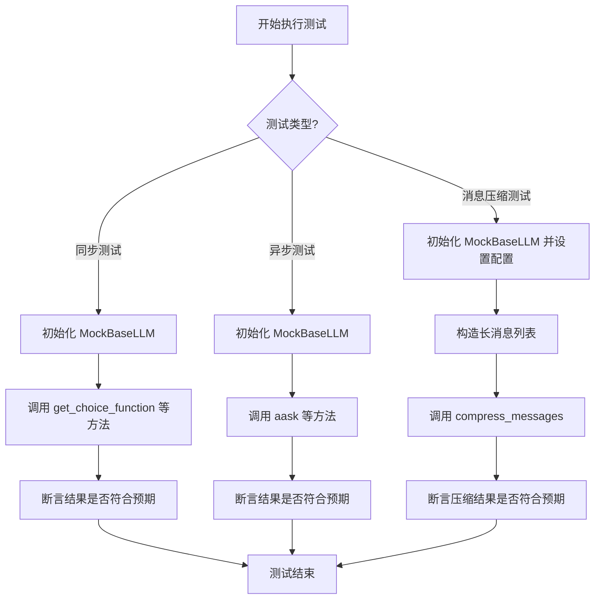

## 类结构

```
BaseLLM (抽象基类，来自 metagpt.provider.base_llm)
└── MockBaseLLM (测试用模拟类，继承自 BaseLLM)
```

## 全局变量及字段


### `name`
    
用于标识测试中使用的LLM名称的全局字符串变量，在测试中设置为'GPT'。

类型：`str`
    


### `MockBaseLLM.config`
    
MockBaseLLM类的配置对象，用于存储和管理LLM的配置参数，如模型名称、API密钥等。

类型：`LLMConfig`
    
    

## 全局函数及方法

### `test_base_llm`

该函数是用于测试`BaseLLM`类及其子类`MockBaseLLM`核心功能的单元测试。它通过模拟LLM响应，验证了`BaseLLM`类中处理OpenAI格式函数调用响应、提取文本内容、以及消息压缩等关键方法的正确性。

参数：
- 无

返回值：`None`，该函数为单元测试，不返回业务值，通过断言（`assert`）验证测试结果。

#### 流程图

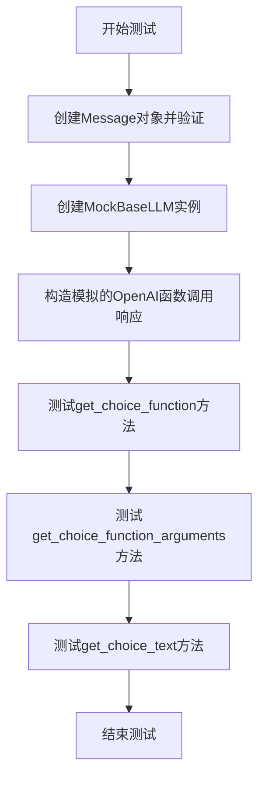

#### 带注释源码

```python
def test_base_llm():
    # 1. 测试基础Message对象的功能
    message = Message(role="user", content="hello")
    assert "role" in message.to_dict()  # 验证to_dict方法包含role字段
    assert "user" in str(message)       # 验证字符串表示包含用户角色

    # 2. 创建被测试的MockBaseLLM实例
    base_llm = MockBaseLLM()

    # 3. 构造一个模拟的OpenAI API函数调用响应结构
    openai_funccall_resp = {
        "choices": [
            {
                "index": 0,
                "message": {
                    "role": "assistant",
                    "content": "test",
                    "tool_calls": [  # 模拟函数调用信息
                        {
                            "id": "call_Y5r6Ddr2Qc2ZrqgfwzPX5l72",
                            "type": "function",
                            "function": {
                                "name": "execute",  # 函数名
                                "arguments": '{\n  "language": "python",\n  "code": "print(\'Hello, World!\')"\n}',  # 函数参数字符串
                            },
                        }
                    ],
                },
                "finish_reason": "stop",
            }
        ]
    }

    # 4. 测试从响应中提取函数调用信息的方法
    func: dict = base_llm.get_choice_function(openai_funccall_resp)
    # 断言提取的函数字典与预期一致
    assert func == {
        "name": "execute",
        "arguments": '{\n  "language": "python",\n  "code": "print(\'Hello, World!\')"\n}',
    }

    # 5. 测试从响应中提取并解析函数参数的方法
    func_args: dict = base_llm.get_choice_function_arguments(openai_funccall_resp)
    # 断言解析后的参数字典与预期一致
    assert func_args == {"language": "python", "code": "print('Hello, World!')"}

    # 6. 测试从响应中提取助手回复文本内容的方法
    choice_text = base_llm.get_choice_text(openai_funccall_resp)
    # 断言提取的文本与响应中的content字段一致
    assert choice_text == openai_funccall_resp["choices"][0]["message"]["content"]

    # 以下为被注释掉的测试，用于验证ask、ask_batch、ask_code等方法（在当前测试中未激活）
    # resp = base_llm.ask(prompt)
    # assert resp == default_resp_cont
    # resp = base_llm.ask_batch([prompt])
    # assert resp == default_resp_cont
    # resp = base_llm.ask_code([prompt])
    # assert resp == default_resp_cont
```

### `test_async_base_llm`

这是一个使用 `pytest` 编写的异步单元测试函数，用于测试 `MockBaseLLM` 类（`BaseLLM` 的模拟实现）的异步问答方法。它验证了 `aask` 和 `aask_batch` 方法在给定提示词时能返回预期的响应内容。

参数：

-  `无显式参数`：`N/A`，这是一个使用 `pytest.mark.asyncio` 装饰的测试函数，其参数由 `pytest` 框架隐式管理。

返回值：`None`，测试函数通常不显式返回值，其成功与否由 `assert` 语句决定。

#### 流程图

```mermaid
flowchart TD
    A[开始测试] --> B[创建 MockBaseLLM 实例]
    B --> C[调用 base_llm.aask(prompt)]
    C --> D{断言 resp == default_resp_cont?}
    D -- 是 --> E[调用 base_llm.aask_batch([prompt])]
    D -- 否 --> F[测试失败]
    E --> G{断言 resp == default_resp_cont?}
    G -- 是 --> H[测试通过]
    G -- 否 --> F
```

#### 带注释源码

```python
@pytest.mark.asyncio  # 标记此函数为异步测试，以便 pytest-asyncio 插件处理
async def test_async_base_llm():
    # 步骤1：创建被测试对象（MockBaseLLM 实例）
    base_llm = MockBaseLLM()

    # 步骤2：测试异步单次问答方法 `aask`
    # 调用 `aask` 方法并传入提示词 `prompt`，等待其异步完成
    resp = await base_llm.aask(prompt)
    # 断言：验证返回的响应内容与预定义的默认响应内容一致
    assert resp == default_resp_cont

    # 步骤3：测试异步批量问答方法 `aask_batch`
    # 调用 `aask_batch` 方法并传入包含单个提示词的列表，等待其异步完成
    resp = await base_llm.aask_batch([prompt])
    # 断言：验证返回的响应内容与预定义的默认响应内容一致
    assert resp == default_resp_cont

    # 注释掉的代码：可能用于测试 `aask_code` 方法，但当前未启用
    # resp = await base_llm.aask_code([prompt])
    # assert resp == default_resp_cont
```

### `test_compress_messages_no_effect`

该函数是一个参数化测试，用于验证 `BaseLLM.compress_messages` 方法在消息上下文较短时，无论使用何种压缩类型（`compress_type`），都不会对原始消息列表产生任何影响，即压缩操作应“无效果”。

参数：
-  `compress_type`：`CompressType`，枚举类型，表示要测试的消息压缩策略类型。

返回值：`None`，该函数为测试函数，不返回业务值，仅通过断言验证测试结果。

#### 流程图

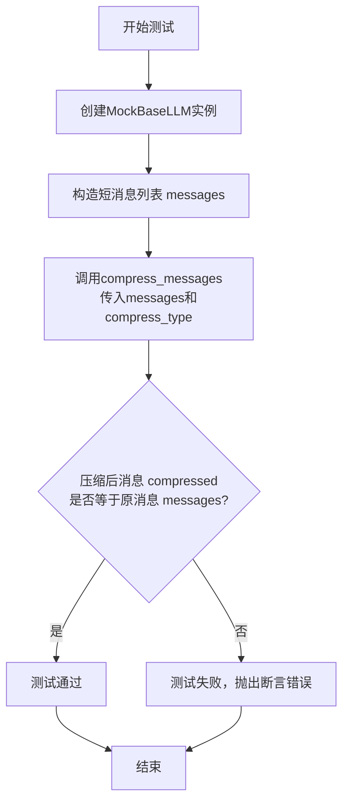

#### 带注释源码

```python
@pytest.mark.parametrize("compress_type", list(CompressType))  # 使用pytest参数化，遍历所有CompressType枚举值
def test_compress_messages_no_effect(compress_type):
    # 1. 准备阶段：创建被测试的LLM对象
    base_llm = MockBaseLLM()
    
    # 2. 准备阶段：构造一个较短的对话消息列表
    #    包含2条系统消息和5轮用户-助手对话
    messages = [
        {"role": "system", "content": "first system msg"},
        {"role": "system", "content": "second system msg"},
    ]
    for i in range(5):
        messages.append({"role": "user", "content": f"u{i}"})
        messages.append({"role": "assistant", "content": f"a{i}"})
    
    # 3. 执行阶段：调用待测试的压缩方法
    #    传入消息列表和当前参数化的压缩类型
    compressed = base_llm.compress_messages(messages, compress_type=compress_type)
    
    # 4. 断言验证阶段
    #    核心断言：对于短上下文，任何压缩策略都应返回原消息列表（无效果）
    #    这是测试的核心目标，验证压缩逻辑的边界条件
    assert compressed == messages
```

### `test_compress_messages_long`

该函数是一个参数化测试，用于验证 `BaseLLM.compress_messages` 方法在消息列表过长且超过最大令牌限制时，使用指定的压缩类型（`compress_type`）能够正确地对消息进行压缩。它模拟了一个包含大量用户和助手消息的对话历史，并断言压缩后的消息数量显著减少，同时保留了开头的系统消息。

参数：

- `compress_type`：`CompressType`，指定要测试的消息压缩策略类型（例如，截断、摘要等）。

返回值：`None`，这是一个测试函数，不返回业务值，仅通过断言（`assert`）来验证功能。

#### 流程图

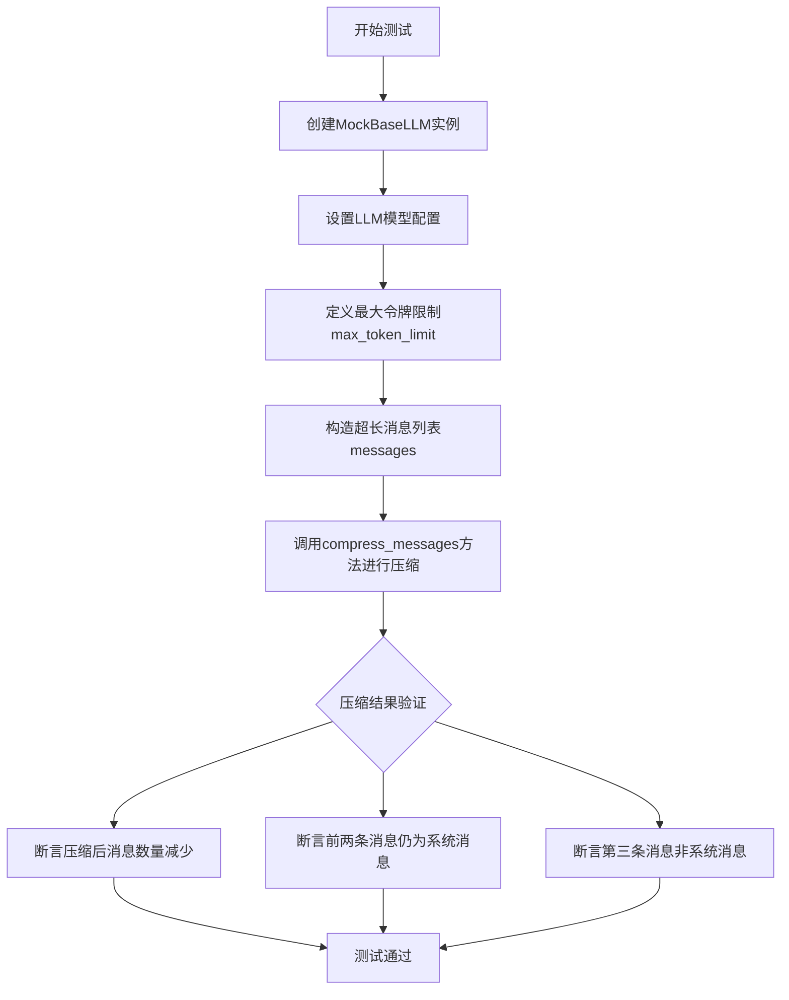

#### 带注释源码

```python
@pytest.mark.parametrize("compress_type", CompressType.cut_types()) # 使用pytest参数化，遍历所有“截断”类型的压缩策略
def test_compress_messages_long(compress_type):
    # 1. 准备测试环境：创建模拟的LLM实例
    base_llm = MockBaseLLM()
    # 设置一个测试用的模型名称，某些压缩逻辑可能依赖于此
    base_llm.config.model = "test_llm"
    # 定义压缩的目标最大令牌数
    max_token_limit = 100

    # 2. 构造测试数据：一个包含系统消息和大量用户/助手轮次的消息列表
    messages = [
        {"role": "system", "content": "first system msg"},
        {"role": "system", "content": "second system msg"},
    ]
    # 添加100轮对话，每轮包含一条用户消息和一条助手消息
    # 每条消息内容重复10次以增加令牌数，模拟长上下文
    for i in range(100):
        messages.append({"role": "user", "content": f"u{i}" * 10})  # ~2x10x0.5 = 10 tokens
        messages.append({"role": "assistant", "content": f"a{i}" * 10})
    
    # 3. 执行测试：调用被测试的压缩方法
    compressed = base_llm.compress_messages(messages, compress_type=compress_type, max_token=max_token_limit)

    # 4. 验证结果
    print(compressed) # 调试输出，便于查看压缩结果
    print(len(compressed)) # 调试输出，查看压缩后长度
    # 核心断言1：压缩后的消息数量应在3到原消息数之间（即确实被压缩了）
    assert 3 <= len(compressed) < len(messages)
    # 核心断言2：压缩后，前两条消息的角色必须仍然是“system”，确保系统提示未被意外移除
    assert compressed[0]["role"] == "system" and compressed[1]["role"] == "system"
    # 核心断言3：第三条消息的角色不能是“system”，表明压缩是从用户/助手对话部分开始的
    assert compressed[2]["role"] != "system"
```

### `test_long_messages_no_compress`

该函数是一个单元测试，用于验证当输入的消息列表非常长时，`BaseLLM.compress_messages` 方法在不指定压缩类型的情况下，是否不会对消息进行压缩，即返回的消息列表长度与输入保持一致。

参数：

-  `base_llm`：`MockBaseLLM`，一个模拟的 `BaseLLM` 实例，用于调用 `compress_messages` 方法。
-  `messages`：`list[dict]`，一个包含大量重复用户消息的列表，用于模拟超长的对话上下文。
-  `compressed`：`list[dict]`，调用 `compress_messages` 方法后返回的压缩（或不压缩）后的消息列表。

返回值：`None`，该函数是一个单元测试，不返回业务值，仅通过断言验证逻辑。

#### 流程图

```mermaid
graph TD
    A[开始测试] --> B[创建MockBaseLLM实例 base_llm]
    B --> C[构造超长消息列表 messages]
    C --> D[调用 base_llm.compress_messages(messages)]
    D --> E{断言 compressed 长度等于 messages 长度}
    E -->|通过| F[测试通过]
    E -->|失败| G[测试失败]
```

#### 带注释源码

```python
def test_long_messages_no_compress():
    # 1. 创建一个模拟的 BaseLLM 实例
    base_llm = MockBaseLLM()
    
    # 2. 构造一个超长的消息列表。
    #    列表包含 10000 个相同的用户消息，每个消息内容为 10000 个字符 '1'。
    #    这模拟了一个远超任何模型上下文长度限制的输入场景。
    messages = [{"role": "user", "content": "1" * 10000}] * 10000
    
    # 3. 调用 compress_messages 方法，不传入 compress_type 参数。
    #    根据 BaseLLM 的默认实现，当不指定压缩类型时，应跳过压缩逻辑。
    compressed = base_llm.compress_messages(messages)
    
    # 4. 断言：压缩后的消息列表长度应与原始列表长度相等。
    #    这验证了在未显式启用压缩时，即使消息很长，也不会触发压缩。
    assert len(compressed) == len(messages)
```

### `test_compress_messages_long_no_sys_msg`

这是一个参数化测试函数，用于测试 `BaseLLM.compress_messages` 方法在特定场景下的行为。该场景是：当输入的消息列表中没有系统消息（`system` role），且消息内容非常长（超过设定的最大token限制）时，验证压缩功能是否能够正常工作。测试会遍历所有“剪切”类型的压缩算法（如 `CUT_LAST`， `CUT_FIRST` 等），确保每种算法都能成功地将过长的消息内容压缩到指定的 `max_token` 限制以内。

参数：

-  `compress_type`：`CompressType`，指定要测试的压缩算法类型，来自 `CompressType.cut_types()` 枚举。
-  `base_llm`：`MockBaseLLM`，在函数内部创建的测试对象，模拟了 `BaseLLM` 的行为。
-  `max_token_limit`：`int`，在函数内部定义的常量，值为100，用于设定压缩时的最大token限制。
-  `messages`：`list[dict]`，在函数内部构造的测试数据，是一个包含一个超长用户消息的列表。

返回值：`None`，这是一个测试函数，其主要目的是通过断言（`assert`）来验证代码逻辑，不返回业务值。测试框架（如pytest）会根据断言的成功或失败来判断测试是否通过。

#### 流程图

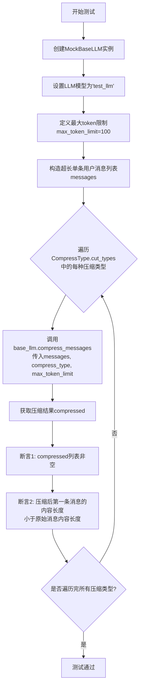

#### 带注释源码

```python
@pytest.mark.parametrize("compress_type", CompressType.cut_types()) # 使用pytest参数化，对CompressType.cut_types()返回的每一种压缩类型运行一次测试
def test_compress_messages_long_no_sys_msg(compress_type):
    # 1. 创建被测试的模拟LLM对象
    base_llm = MockBaseLLM()
    # 2. 设置LLM配置的模型名称（某些压缩算法可能需要模型信息来计算token）
    base_llm.config.model = "test_llm"
    # 3. 定义本次测试中压缩算法需要遵守的最大token数量限制
    max_token_limit = 100

    # 4. 构造测试数据：一个只包含一条超长用户消息的列表。
    #    内容为字符'1'重复10000次，模拟一个远超max_token_limit限制的长消息。
    #    这个列表中没有系统消息(`system` role)。
    messages = [{"role": "user", "content": "1" * 10000}]
    
    # 5. 执行核心测试动作：调用compress_messages方法进行消息压缩。
    #    传入参数：原始消息列表、当前参数化的压缩类型、最大token限制。
    compressed = base_llm.compress_messages(messages, compress_type=compress_type, max_token=max_token_limit)

    # 打印压缩结果，便于调试（在实际测试中通常注释掉）
    print(compressed)
    
    # 6. 验证断言1：压缩后的结果列表`compressed`应该非空。
    #    确保压缩函数没有返回None或空列表。
    assert compressed
    # 7. 验证断言2：压缩后列表中第一条消息（也是唯一一条）的内容长度，
    #    必须严格小于原始消息的长度。
    #    这证明了压缩算法确实对过长的内容进行了削减，以满足token限制。
    assert len(compressed[0]["content"]) < len(messages[0]["content"])
```

### `BaseLLM.format_msg`

该方法用于将消息对象列表转换为大语言模型（LLM）API 所需的标准化字典格式。它处理不同类型的消息（如用户消息、助手消息），并特别处理包含图像元数据的消息，将其转换为支持多模态输入的特定格式。

参数：

- `messages`：`list[Message]`，需要格式化的消息对象列表，通常包含 `UserMessage` 和 `AIMessage` 等。
- `...`：`...`，根据 `BaseLLM` 类的实际实现，可能还有其他参数，但在此测试中未显式使用。

返回值：`list[dict]`，返回一个字典列表，每个字典代表一条符合LLM API调用格式的消息，包含 `role` 和 `content` 等键。

#### 流程图

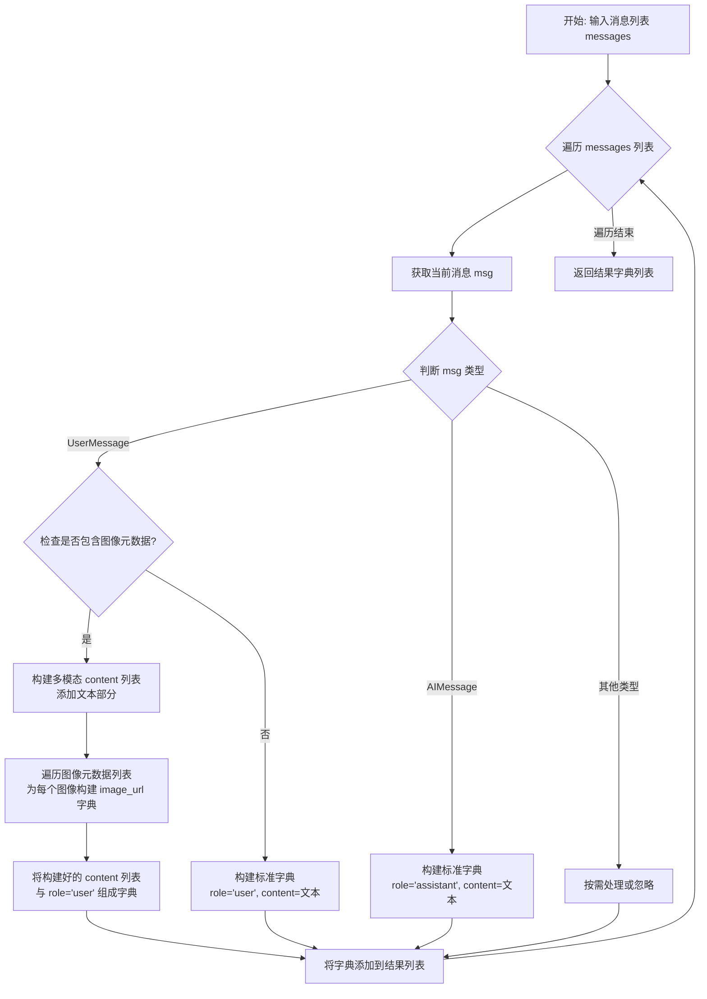

#### 带注释源码

```python
def test_format_msg(mocker):
    # 1. 创建 MockBaseLLM 实例，这是 BaseLLM 的一个测试替身
    base_llm = MockBaseLLM()
    
    # 2. 准备测试数据：一个包含 UserMessage 和 AIMessage 的列表
    messages = [UserMessage(content="req"), AIMessage(content="rsp")]
    
    # 3. 调用被测方法：将消息对象列表格式化为LLM API所需的字典格式
    formatted_msgs = base_llm.format_msg(messages)
    
    # 4. 断言验证：检查格式化后的结果是否符合预期
    #    预期 UserMessage 被转为 {'role': 'user', 'content': 'req'}
    #    预期 AIMessage 被转为 {'role': 'assistant', 'content': 'rsp'}
    assert formatted_msgs == [{"role": "user", "content": "req"}, {"role": "assistant", "content": "rsp"}]
```

### `BaseLLM.format_msg`

该方法用于将内部的消息对象列表转换为大语言模型（LLM）API 所需的格式。它处理不同类型的消息（如用户消息、助手消息），并特别处理包含图像元数据的用户消息，将其内容转换为包含文本和图像URL的混合格式。

参数：

- `messages`：`list[Message]`，需要格式化的内部消息对象列表。
- `mocker`：`pytest_mock.plugin.MockerFixture`，pytest的mock fixture，用于模拟测试环境中的依赖。

返回值：`list[dict]`，返回一个字典列表，每个字典代表一条符合LLM API格式要求的消息。

#### 流程图

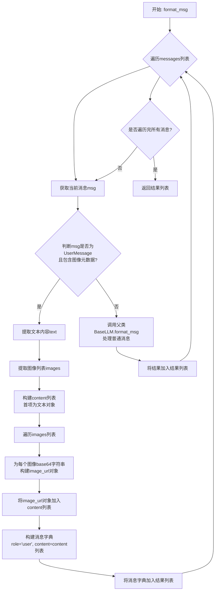

#### 带注释源码

```python
def test_format_msg_w_images(mocker):
    # 1. 创建MockBaseLLM实例，这是BaseLLM的一个测试替身
    base_llm = MockBaseLLM()
    # 2. 设置模型为支持多模态的"gpt-4o"，以触发图像处理逻辑
    base_llm.model = "gpt-4o"
    
    # 3. 创建第一条用户消息，并为其添加图像元数据
    msg_w_images = UserMessage(content="req1")
    msg_w_images.add_metadata(IMAGES, ["base64 string 1", "base64 string 2"])
    
    # 4. 创建第二条用户消息，添加空的图像元数据列表
    msg_w_empty_images = UserMessage(content="req2")
    msg_w_empty_images.add_metadata(IMAGES, [])
    
    # 5. 构建消息列表，包含带图像的消息、助手回复和带空图像列表的消息
    messages = [
        msg_w_images,  # 应该被转换为多模态格式
        AIMessage(content="rsp"),
        msg_w_empty_images,  # 不应该被转换（因为图像列表为空）
    ]
    
    # 6. 调用待测试的format_msg方法进行格式化
    formatted_msgs = base_llm.format_msg(messages)
    
    # 7. 断言格式化结果符合预期
    assert formatted_msgs == [
        {
            "role": "user",
            "content": [
                {"type": "text", "text": "req1"},  # 文本部分
                {"type": "image_url", "image_url": {"url": "data:image/jpeg;base64,base64 string 1"}},  # 第一张图像
                {"type": "image_url", "image_url": {"url": "data:image/jpeg;base64,base64 string 2"}},  # 第二张图像
            ],
        },
        {"role": "assistant", "content": "rsp"},  # 普通的助手消息
        {"role": "user", "content": "req2"},  # 图像列表为空，按普通用户消息处理
    ]
```

### `MockBaseLLM.__init__`

该方法用于初始化`MockBaseLLM`类的实例。它接受一个可选的`LLMConfig`配置对象，如果未提供，则使用一个预定义的模拟配置（`mock_llm_config`）作为默认值。该方法的主要目的是设置实例的`config`属性，为后续的模拟LLM操作提供配置基础。

参数：

- `config`：`LLMConfig`，可选的LLM配置对象。如果未提供，则使用`mock_llm_config`作为默认配置。

返回值：`None`，该方法不返回任何值。

#### 流程图

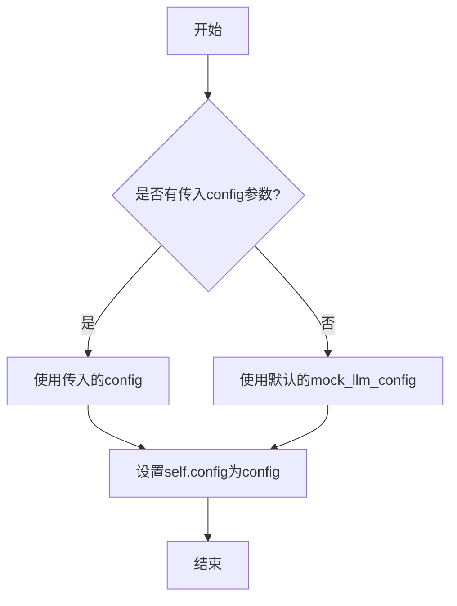

#### 带注释源码

```python
def __init__(self, config: LLMConfig = None):
    # 初始化方法，用于设置MockBaseLLM实例的配置。
    # 参数config是一个可选的LLMConfig对象，用于提供LLM的配置信息。
    # 如果config为None，则使用预定义的mock_llm_config作为默认配置。
    self.config = config or mock_llm_config
```

### `MockBaseLLM.completion`

该方法是一个同步方法，用于模拟大语言模型（LLM）的文本补全功能。它接收一个消息列表，并返回一个模拟的聊天完成响应。在测试环境中，它不实际调用外部API，而是返回一个预定义的响应。

参数：

- `messages`：`list[dict]`，一个字典列表，代表对话历史中的消息序列。每个字典通常包含`role`（如"user"、"assistant"）和`content`（消息内容）等键。
- `timeout`：`int`，可选参数，默认值为3。表示请求的超时时间（单位：秒）。在此模拟方法中，该参数未被实际使用。

返回值：`dict`，返回一个模拟的聊天完成响应字典。该字典的结构模拟了真实LLM API的响应格式，通常包含`choices`等字段。

#### 流程图

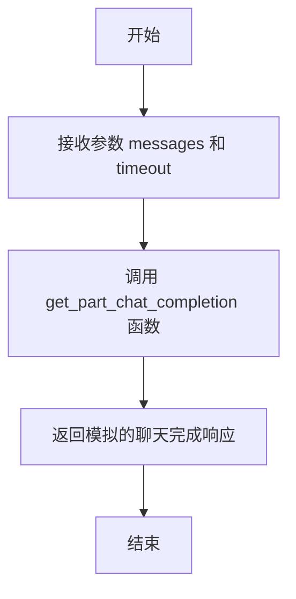

#### 带注释源码

```python
def completion(self, messages: list[dict], timeout=3):
    # 调用 get_part_chat_completion 函数，传入预定义的 name 变量（值为"GPT"）
    # 该函数返回一个模拟的、结构化的聊天完成响应
    return get_part_chat_completion(name)
```

### `MockBaseLLM._achat_completion`

这是一个模拟异步聊天完成方法，属于 `MockBaseLLM` 类。它被设计为 `BaseLLM` 抽象基类中 `_achat_completion` 方法的占位符实现。在当前的模拟实现中，它不执行任何操作，直接返回 `None`。其主要目的是在单元测试中提供一个不会真正调用外部 LLM API 的轻量级方法，以便测试依赖于 `BaseLLM` 接口的其他代码逻辑。

参数：

- `messages`：`list[dict]`，一个字典列表，代表要发送给语言模型的消息历史。每个字典通常包含 `role`（如 `"user"`, `"assistant"`, `"system"`）和 `content` 等键。
- `timeout`：`int`，请求的超时时间（以秒为单位）。此参数在当前实现中未被使用。

返回值：`None`，此方法不返回任何值。

#### 流程图

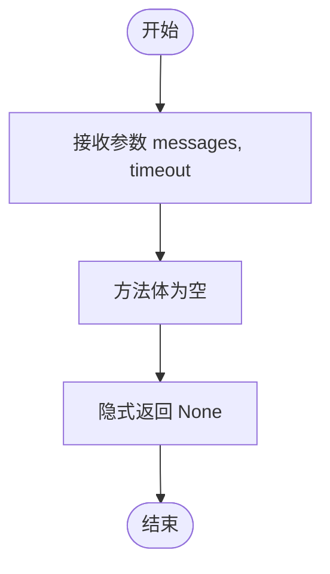

#### 带注释源码

```python
async def _achat_completion(self, messages: list[dict], timeout=3):
    # 这是一个模拟的异步聊天完成方法。
    # 在实际的 BaseLLM 子类中，此方法应包含调用具体 LLM API 的异步逻辑。
    # 在此 Mock 类中，它被实现为一个空函数，用于测试时避免真实网络调用。
    # 参数:
    #   messages: 消息列表，格式为 OpenAI API 兼容的格式。
    #   timeout: 请求超时时间（秒），当前未使用。
    # 返回值:
    #   None
    pass
```

### `MockBaseLLM.acompletion`

该方法是一个异步方法，用于模拟大语言模型（LLM）的异步文本补全功能。它接收一个消息列表作为输入，并返回一个模拟的聊天完成响应。该方法主要用于单元测试，以验证依赖于异步LLM调用的代码逻辑，而无需实际调用外部API。

参数：

- `messages`：`list[dict]`，一个字典列表，其中每个字典代表一条消息，通常包含`role`（如"user"、"assistant"、"system"）和`content`（消息内容）等键。这是模拟LLM请求的输入上下文。
- `timeout`：`int`，可选参数，默认值为3，表示请求的超时时间（秒）。在当前模拟实现中，此参数未被使用，但保留了接口一致性。

返回值：`dict`，返回一个模拟的聊天完成响应字典。该字典的结构模拟了真实LLM API的响应格式，通常包含`choices`等键。具体内容由辅助函数`get_part_chat_completion(name)`生成。

#### 流程图

```mermaid
flowchart TD
    A[开始: 调用 acompletion] --> B[接收参数: messages, timeout]
    B --> C[调用 get_part_chat_completion(name)]
    C --> D[返回模拟的LLM响应字典]
    D --> E[结束]
```

#### 带注释源码

```python
async def acompletion(self, messages: list[dict], timeout=3):
    # 调用辅助函数 `get_part_chat_completion`，传入全局变量 `name`（值为"GPT"），
    # 生成并返回一个模拟的聊天完成响应字典。
    # 参数 `messages` 和 `timeout` 在此模拟实现中未被进一步处理，
    # 但保留了与基类 `BaseLLM` 中对应抽象方法一致的接口。
    return get_part_chat_completion(name)
```

### `MockBaseLLM._achat_completion_stream`

该方法是一个异步方法，用于模拟大语言模型（LLM）的流式聊天完成功能。在当前的模拟实现中，它仅是一个占位符，直接返回一个空字符串，不执行任何实际的流式处理逻辑。这通常用于在测试环境中避免真实网络调用。

参数：

- `messages`：`list[dict]`，表示要发送给LLM的消息列表，通常包含角色（如"user"、"assistant"）和内容。
- `timeout`：`int`，可选参数，默认值为3，表示请求的超时时间（以秒为单位）。

返回值：`str`，返回一个空字符串，表示模拟的流式响应内容。

#### 流程图

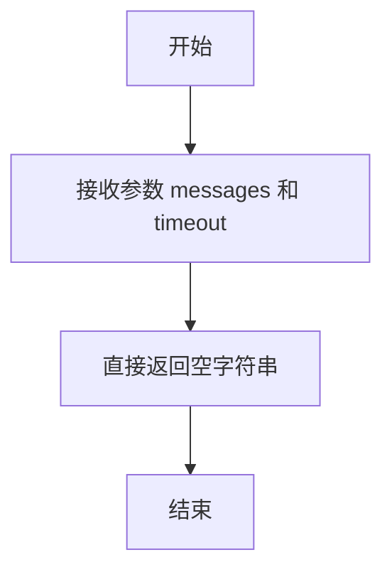

#### 带注释源码

```python
async def _achat_completion_stream(self, messages: list[dict], timeout: int = 3) -> str:
    """
    模拟异步流式聊天完成方法。
    当前实现为占位符，直接返回空字符串，不进行任何实际处理。
    
    参数:
        messages: 消息列表，每个消息是一个字典，包含角色和内容。
        timeout: 请求超时时间，单位为秒。
    
    返回:
        空字符串。
    """
    pass  # 占位符实现，无实际逻辑
```

### `MockBaseLLM.acompletion_text`

该方法是一个异步方法，用于模拟大语言模型（LLM）的文本补全功能。它接收一个消息列表，并直接返回一个预定义的默认响应字符串，不进行实际的网络调用或模型推理。这主要用于单元测试，以隔离和验证依赖于LLM响应的上层逻辑。

参数：

- `messages`：`list[dict]`，一个字典列表，其中每个字典代表一条消息，通常包含`role`（如"user"、"assistant"）和`content`字段。此参数在模拟方法中未被使用。
- `stream`：`bool`，一个布尔值，指示是否应以流式方式返回响应。此参数在模拟方法中未被使用。
- `timeout`：`int`，请求的超时时间（秒）。此参数在模拟方法中未被使用。

返回值：`str`，返回一个预定义的常量字符串`default_resp_cont`，作为模拟的LLM响应内容。

#### 流程图

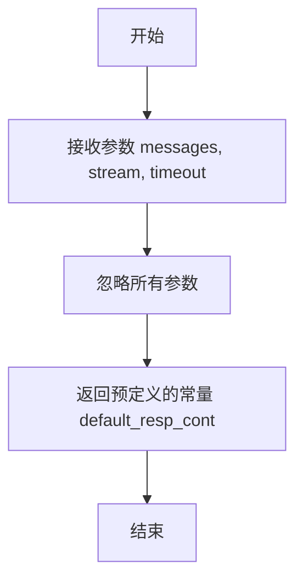

#### 带注释源码

```python
async def acompletion_text(self, messages: list[dict], stream=False, timeout=3) -> str:
    # 这是一个模拟方法，直接返回预定义的响应内容。
    # 参数 `messages` 是输入的消息列表，但在此模拟中不被处理。
    # 参数 `stream` 指示是否流式输出，在此模拟中不被支持。
    # 参数 `timeout` 是超时设置，在此模拟中不被遵守。
    # 返回值是一个固定的字符串，用于测试。
    return default_resp_cont
```

## 关键组件


### 消息压缩机制

该组件实现了对长对话消息列表的智能压缩功能，通过`compress_messages`方法，根据指定的压缩策略（如`CompressType`枚举）和最大令牌数限制，对超出上下文窗口的消息进行裁剪或摘要，以适配不同LLM模型的输入长度限制。

### 消息格式化与多模态支持

该组件负责将内部的消息对象（如`UserMessage`, `AIMessage`）转换为LLM API所需的标准化字典格式。它特别支持多模态输入，当消息包含图像元数据时，能够将文本和图像信息格式化为符合特定模型（如`gpt-4o`）API要求的复杂内容结构。

### 响应解析器

该组件提供了一系列工具方法（如`get_choice_function`, `get_choice_function_arguments`, `get_choice_text`），用于从LLM返回的原始响应（通常是包含`choices`列表的复杂JSON对象）中，提取出结构化的函数调用信息、参数或纯文本内容，简化了上层业务逻辑对API响应的处理。

### 异步与同步接口适配

该组件定义了统一的LLM调用接口，包括同步的`completion`方法和异步的`acompletion`、`_achat_completion`等方法。通过`MockBaseLLM`这样的测试替身（Test Double）类，展示了如何通过继承和重写核心方法来适配不同的具体LLM提供商或用于测试，实现了接口与实现的分离。


## 问题及建议


### 已知问题

-   **Mock类实现不完整**：`MockBaseLLM` 类中的 `_achat_completion` 和 `_achat_completion_stream` 方法仅定义了 `pass`，未提供任何模拟实现。这可能导致依赖这些异步底层方法的测试或功能在集成时失败或行为不符合预期。
-   **测试覆盖不完整**：部分测试用例（如 `test_base_llm` 中的 `ask`, `ask_batch`, `ask_code` 以及 `test_async_base_llm` 中的 `aask_code`）被注释掉了，导致对 `BaseLLM` 类中这些关键方法的测试覆盖缺失，无法验证其正确性。
-   **硬编码的模型名称**：在 `test_compress_messages_long` 和 `test_compress_messages_long_no_sys_msg` 测试中，直接设置了 `base_llm.config.model = "test_llm"`。这种硬编码方式使得测试与特定的模型名称耦合，降低了测试的通用性和可维护性。
-   **潜在的资源浪费**：`test_long_messages_no_compress` 测试用例创建了一个包含10000条重复消息的列表，每条消息内容长度为10000。虽然用于测试“不压缩”的逻辑，但会消耗大量内存，在资源受限的环境下可能引发问题。
-   **测试断言过于宽松**：`test_compress_messages_long` 测试中，断言 `assert 3 <= len(compressed) < len(messages)` 的下界（3）是硬编码的，其合理性依赖于特定的 `max_token_limit` (100) 和消息内容。如果压缩算法或令牌计算方式改变，此断言可能失效，且不能精确验证压缩后的令牌数是否在限制内。

### 优化建议

-   **完善Mock实现**：为 `MockBaseLLM` 中的 `_achat_completion` 和 `_achat_completion_stream` 方法提供最小化的模拟实现（例如返回一个固定的响应或空值），以确保测试套件的完整性和可靠性。
-   **启用并补充测试用例**：取消被注释掉的测试代码，并为 `ask`, `ask_batch`, `ask_code`, `aask_code` 等方法编写完整的测试，确保 `BaseLLM` 的所有公共接口都得到验证。
-   **使用配置或Fixture管理测试数据**：将测试中硬编码的模型名称（如 `"test_llm"`）提取到测试配置或 `pytest fixture` 中，使测试数据更集中、易于管理，并减少与具体值的耦合。
-   **优化测试性能与资源使用**：对于 `test_long_messages_no_compress` 测试，考虑减少消息数量或内容长度，或使用 `@pytest.mark.slow` 等标记将其归类为慢速测试。同时，可以添加测试来验证在达到真正的大消息量时，压缩逻辑是否会被正确触发。
-   **增强测试断言的精确性和健壮性**：在 `test_compress_messages_long` 测试中，可以改进断言，例如直接计算压缩后消息列表的预估令牌总数，并断言其小于等于 `max_token_limit`。同时，避免对压缩后的消息条数进行硬编码的范围断言，而是基于算法逻辑进行更本质的验证（如保留所有系统消息）。
-   **增加边界和异常测试**：补充测试用例，例如测试 `compress_messages` 方法在 `max_token` 参数为0或负数时的行为，传入空消息列表时的行为，以及消息格式不正确时的错误处理。


## 其它


### 设计目标与约束

本测试文件旨在验证 `BaseLLM` 抽象基类及其子类（此处为 `MockBaseLLM`）的核心功能与行为。其设计目标包括：1) 验证 `BaseLLM` 提供的通用方法（如消息格式化、响应解析、消息压缩）在不同场景下的正确性；2) 通过模拟实现（Mock）隔离外部 LLM 服务依赖，实现快速、稳定的单元测试；3) 覆盖同步与异步接口、不同消息压缩策略以及包含图像的多模态消息处理等关键路径。主要约束是测试范围限于 `BaseLLM` 的公共接口及其在 `MockBaseLLM` 中的实现，不涉及真实网络调用或具体 LLM 供应商的细节。

### 错误处理与异常设计

测试用例本身主要使用断言（`assert`）来验证预期行为，并未显式测试 `BaseLLM` 或 `MockBaseLLM` 内部的错误处理逻辑。例如，测试验证了 `get_choice_function` 等方法能正确解析特定结构的响应字典，但未测试当输入响应字典结构异常（如缺少 `choices` 键）时这些方法的行为。错误处理测试应作为 `BaseLLM` 实现类（非Mock）测试的一部分，涵盖网络超时、API错误响应、无效消息格式等场景。本测试文件通过 `pytest.mark.parametrize` 对 `compress_messages` 方法进行了参数化测试，覆盖了不同的压缩类型（`CompressType`），这是一种对输入枚举值完整性的测试。

### 数据流与状态机

测试中的数据流是单向且无状态的：1) **输入构造**：测试函数构造特定的输入数据，如模拟的 OpenAI 函数调用响应 (`openai_funccall_resp`)、长消息列表、包含图像元数据的 `UserMessage` 对象等。2) **方法调用**：调用 `MockBaseLLM` 实例的待测方法（如 `get_choice_function`, `compress_messages`, `format_msg`）。3) **输出验证**：将方法返回的结果与硬编码的预期值进行比较。整个测试过程不涉及对象内部状态的持续变化（`MockBaseLLM` 的 `config` 字段在部分测试中被修改，但这属于测试准备而非状态机流转）。测试重点在于验证给定输入下，方法的输出是否符合约定。

### 外部依赖与接口契约

1.  **`BaseLLM` 抽象基类**：`MockBaseLLM` 继承自 `BaseLLM`，并实现了其定义的抽象方法（如 `completion`, `_achat_completion` 等）。测试验证了 `MockBaseLLM` 遵守了 `BaseLLM` 的接口契约，能够正确响应 `ask`、`aask`、`compress_messages` 等公共方法的调用。
2.  **`LLMConfig` 与 `mock_llm_config`**：`MockBaseLLM` 的初始化依赖于 `LLMConfig` 对象。测试中使用了 `mock_llm_config` 作为默认配置，并在部分测试中修改了 `config.model` 属性以测试特定逻辑分支。
3.  **`pytest` 框架**：测试文件依赖于 `pytest` 框架来组织测试用例、使用装饰器（如 `@pytest.mark.asyncio`, `@pytest.mark.parametrize`）以及运行测试。
4.  **`metagpt.schema` 中的消息类**：测试使用了 `UserMessage`, `AIMessage`, `Message` 来构造输入，并验证 `format_msg` 方法能正确将这些对象转换为 LLM 接口预期的字典格式。这测试了 `BaseLLM` 与上层消息 schema 之间的适配契约。
5.  **`CompressType` 枚举**：`compress_messages` 方法的测试直接依赖于 `CompressType` 枚举来定义不同的压缩策略，验证了方法对此枚举值的处理能力。

### 测试策略与覆盖范围

测试策略主要包括：1) **单元测试**：针对 `BaseLLM`/`MockBaseLLM` 的单个方法进行隔离测试。2) **模拟与桩（Stub）**：使用 `MockBaseLLM` 模拟真实 LLM 响应，避免外部服务调用。`get_part_chat_completion` 和 `default_resp_cont` 作为测试桩提供预定义的返回值。3) **参数化测试**：对 `compress_messages` 方法使用 `@pytest.mark.parametrize`，高效覆盖多种压缩类型和输入场景。4) **异步测试**：使用 `@pytest.mark.asyncio` 测试异步方法 `aask` 和 `aask_batch`。覆盖范围包括：消息解析、批量询问、消息压缩（长短上下文、有无系统消息）、多模态消息格式化等核心功能。注释掉的测试（如 `ask_code`）表明可能存在尚未覆盖或待实现的功能区域。

    