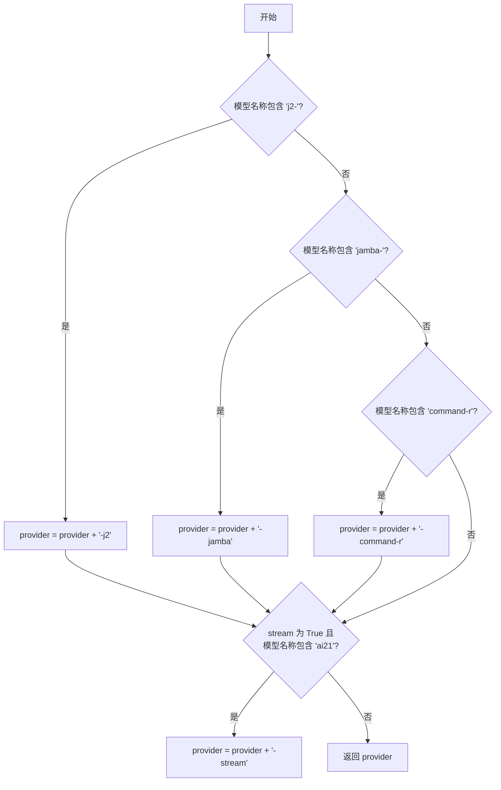
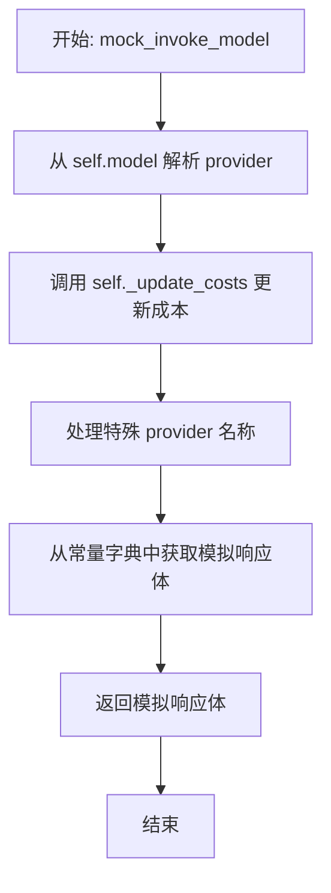
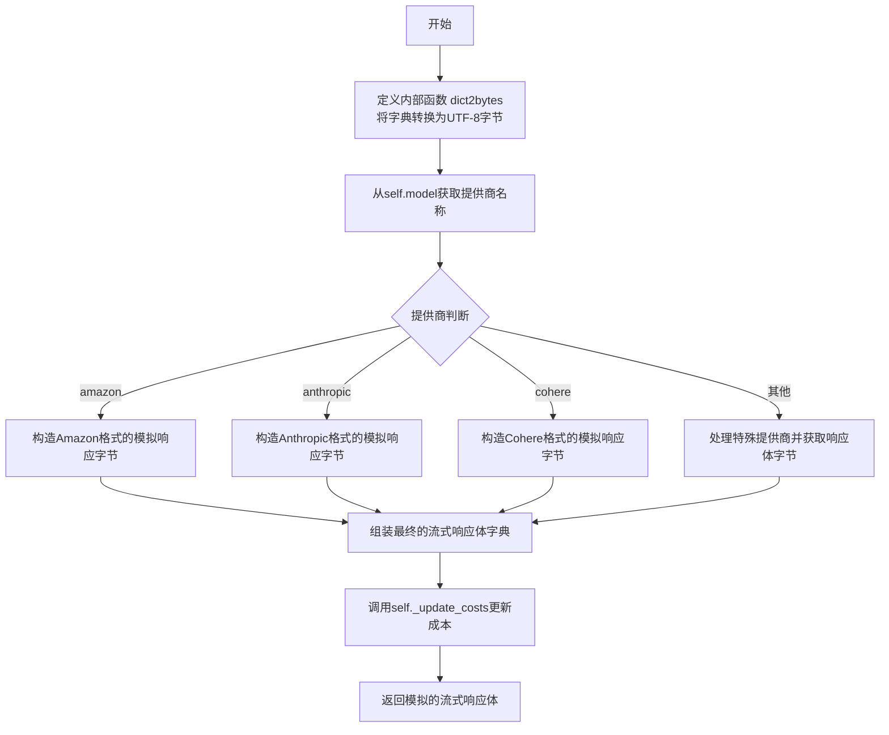
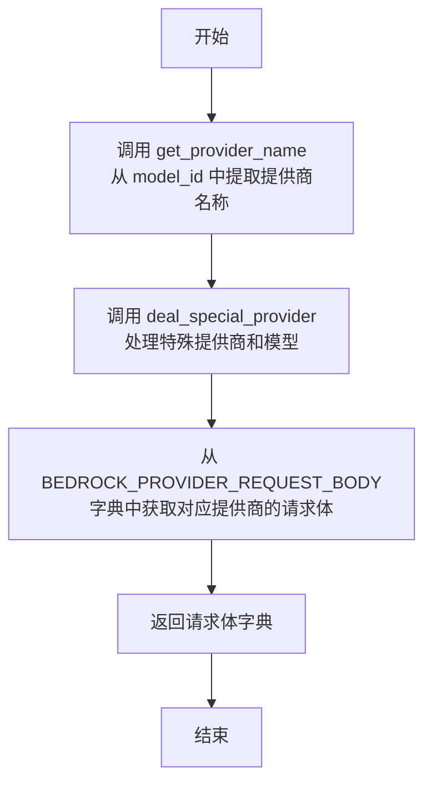
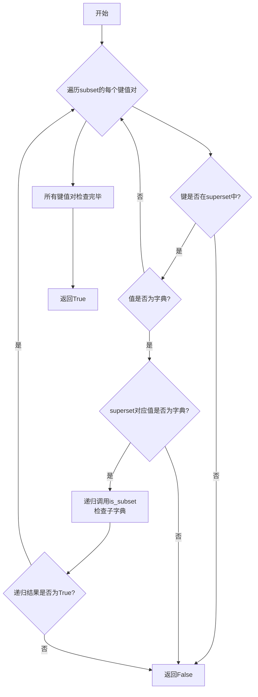
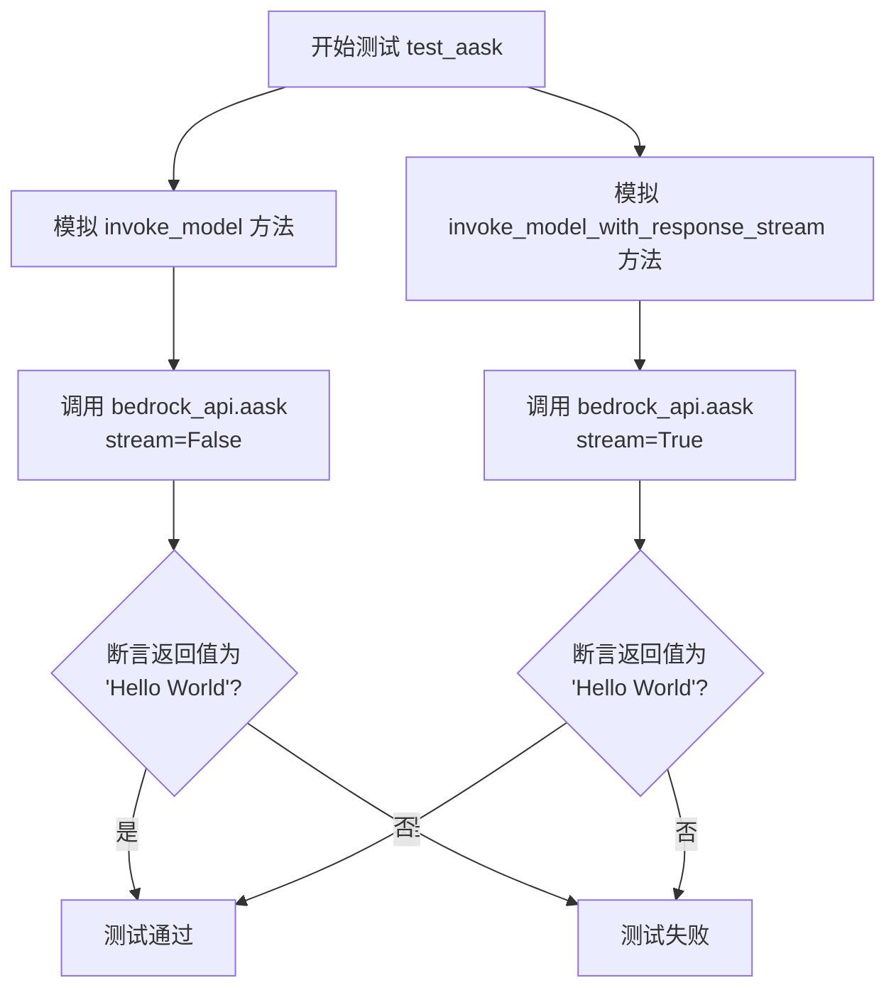
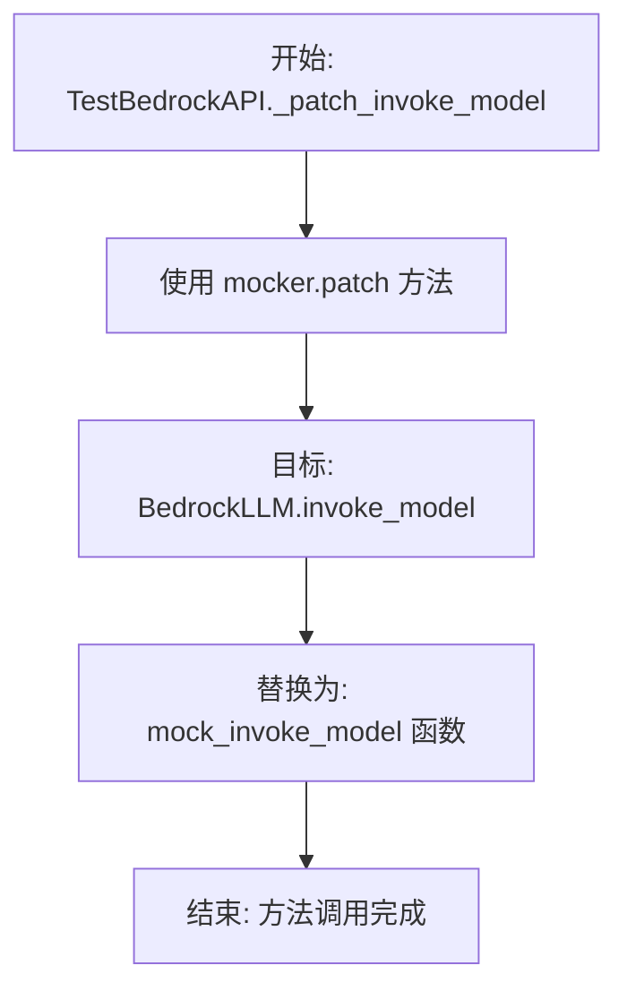
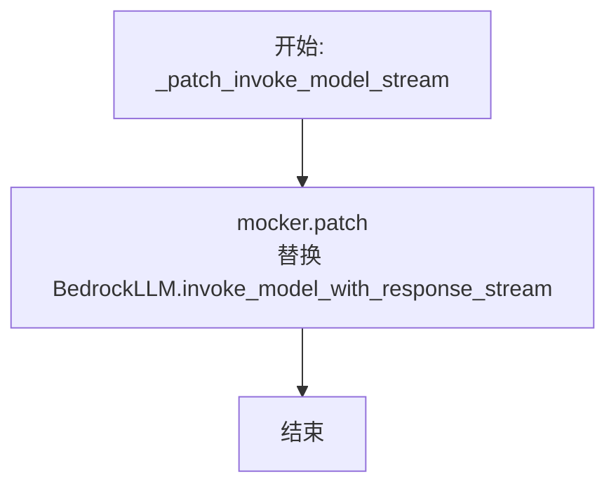
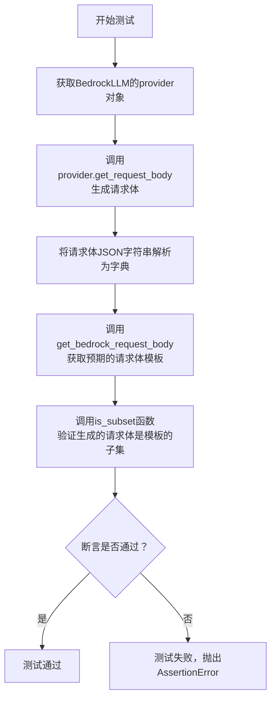
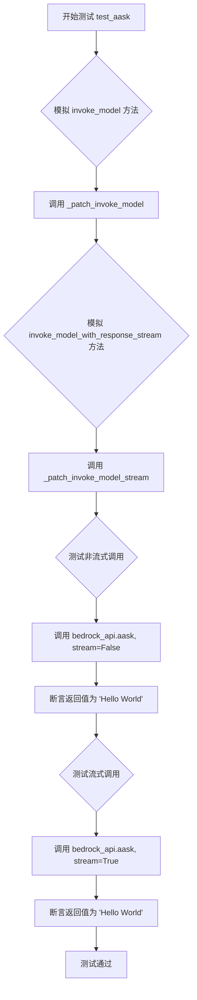

# `.\MetaGPT\tests\metagpt\provider\test_bedrock_api.py` 详细设计文档

该文件是一个针对 MetaGPT 框架中 BedrockLLM 类的单元测试文件。它通过模拟 AWS Bedrock 服务的 API 调用，测试 BedrockLLM 类在请求构造、非流式响应和流式响应处理等方面的功能是否正确。测试覆盖了所有支持的 Bedrock 模型，并验证了请求体格式的合规性以及响应的正确解析。

## 整体流程

```mermaid
graph TD
    A[开始执行测试] --> B{测试类型?}
    B -- test_get_request_body --> C[获取 BedrockLLM 实例]
    C --> D[调用 provider.get_request_body]
    D --> E[解析请求体为 JSON]
    E --> F[调用 get_bedrock_request_body 获取预期请求体]
    F --> G[使用 is_subset 比较请求体]
    G --> H[断言通过]
    B -- test_aask (非流式) --> I[获取 BedrockLLM 实例]
    I --> J[使用 mocker 替换 invoke_model 为 mock_invoke_model]
    J --> K[调用 bedrock_api.aask(stream=False)]
    K --> L[mock_invoke_model 模拟响应并更新成本]
    L --> M[断言返回内容为 'Hello World']
    B -- test_aask (流式) --> N[获取 BedrockLLM 实例]
    N --> O[使用 mocker 替换 invoke_model_with_response_stream 为 mock_invoke_model_stream]
    O --> P[调用 bedrock_api.aask(stream=True)]
    P --> Q[mock_invoke_model_stream 模拟流式响应并更新成本]
    Q --> R[断言返回内容为 'Hello World']
```

## 类结构

```
TestBedrockAPI (测试类)
├── _patch_invoke_model (方法)
├── _patch_invoke_model_stream (方法)
├── test_get_request_body (方法)
└── test_aask (方法)
```

## 全局变量及字段


### `models`
    
包含所有可用的Bedrock模型ID的集合，由支持流式传输和不支持流式传输的模型合并而成。

类型：`set[str]`
    


### `messages`
    
用于测试的模拟对话消息列表，包含一个用户角色和内容为'Hi!'的消息。

类型：`list[dict]`
    


### `usage`
    
模拟的令牌使用量字典，包含prompt_tokens和completion_tokens两个键，用于在测试中模拟API调用的成本计算。

类型：`dict`
    


    

## 全局函数及方法

### `get_provider_name`

该函数用于从给定的模型ID字符串中提取提供商名称。它通过分割模型ID字符串（通常以点号分隔）来识别提供商部分，并处理可能包含国家代码等额外字段的特殊情况。

参数：

- `model`：`str`，完整的模型ID字符串，例如“us.meta.llama3-8b-instruct”或“anthropic.claude-3-haiku”。

返回值：`str`，提取出的提供商名称，例如“meta”或“anthropic”。

#### 流程图

```mermaid
graph TD
    A[开始: 输入model字符串] --> B[按'.'分割字符串为arr]
    B --> C{arr长度?}
    C -- 2 --> D[arr[0]为provider, arr[1]为model_name]
    C -- 3 --> E[arr[1]为provider, arr[2]为model_name]
    D --> F[返回provider]
    E --> F
    F --> G[结束]
```

#### 带注释源码

```python
def get_provider_name(model: str) -> str:
    # 将模型ID字符串按点号分割成列表
    arr = model.split(".")
    # 判断分割后的列表长度
    if len(arr) == 2:
        # 如果长度为2，则直接解包为提供商和模型名
        provider, model_name = arr  # meta、mistral……
    elif len(arr) == 3:
        # 如果长度为3，则通常第一个元素是国家代码（如'us'），第二个是提供商，第三个是模型名
        # 这里忽略国家代码，只取提供商和模型名
        _, provider, model_name = arr
    # 返回提取出的提供商名称
    return provider
```

### `deal_special_provider`

该函数用于处理特定模型提供商的名称映射和流式传输标识。它根据输入的模型名称和流式传输标志，对提供商名称进行特殊处理，以适配不同的模型系列（如 `j2-`、`jamba-`、`command-r`）和流式传输需求（如 `ai21` 模型的流式传输）。

参数：

- `provider`：`str`，原始的提供商名称。
- `model`：`str`，模型名称，用于判断模型系列。
- `stream`：`bool`，默认为 `False`，指示是否为流式传输。

返回值：`str`，处理后的提供商名称。

#### 流程图



#### 带注释源码

```python
def deal_special_provider(provider: str, model: str, stream: bool = False) -> str:
    # 处理 ai21 模型的特定系列
    if "j2-" in model:
        provider = f"{provider}-j2"
    elif "jamba-" in model:
        provider = f"{provider}-jamba"
    elif "command-r" in model:
        provider = f"{provider}-command-r"
    # 处理 ai21 模型的流式传输
    if stream and "ai21" in model:
        provider = f"{provider}-stream"
    return provider
```

### `mock_invoke_model`

这是一个用于测试的异步模拟函数，它模拟了 `BedrockLLM` 类中 `invoke_model` 方法的行为。它根据给定的模型名称确定对应的云服务提供商，更新成本统计，并返回一个预定义的模拟响应体。

参数：

-  `self`：`BedrockLLM`，`BedrockLLM` 类的一个实例，用于获取模型信息和调用内部方法。
-  `*args`：`tuple`，可变位置参数，在此模拟函数中未使用。
-  `**kwargs`：`dict`，可变关键字参数，在此模拟函数中未使用。

返回值：`dict`，一个字典，表示模拟的 AWS Bedrock API 响应体。其具体结构取决于从 `self.model` 解析出的云服务提供商。

#### 流程图



#### 带注释源码

```python
async def mock_invoke_model(self: BedrockLLM, *args, **kwargs) -> dict:
    # 1. 从当前实例的模型ID中提取云服务提供商名称（如 'amazon', 'anthropic'）
    provider = get_provider_name(self.model)
    # 2. 使用预定义的 usage 数据更新该模型调用的成本统计
    self._update_costs(usage, self.model)
    # 3. 对某些特殊模型（如 ai21 的 j2, jamba 系列）的 provider 名称进行额外处理
    provider = deal_special_provider(provider, self.model)
    # 4. 根据处理后的 provider 名称，从预定义的常量字典中获取对应的模拟响应体并返回
    return BEDROCK_PROVIDER_RESPONSE_BODY[provider]
```

### `mock_invoke_model_stream`

这是一个用于模拟 AWS Bedrock 模型流式调用的异步函数。它根据给定的模型标识符（`self.model`）确定对应的提供商（如 Amazon、Anthropic、Cohere 等），并生成一个模拟的流式响应体。该函数主要用于单元测试，以验证 `BedrockLLM` 类在流式调用模式下的行为，而无需实际调用 AWS Bedrock 服务。

参数：

- `self`：`BedrockLLM`，`BedrockLLM` 类的实例，用于获取模型标识符和调用成本更新方法。
- `*args`：`tuple`，可变位置参数，在此函数中未使用。
- `**kwargs`：`dict`，可变关键字参数，在此函数中未使用。

返回值：`dict`，返回一个模拟的 AWS Bedrock 流式响应体。该字典包含一个 `'body'` 键，其值是一个列表，列表中的每个元素是一个包含 `'chunk'` 键的字典，`'chunk'` 的值是一个包含 `'bytes'` 键的字典，`'bytes'` 的值是经过 JSON 序列化并编码为 UTF-8 字节的模拟响应内容。

#### 流程图



#### 带注释源码

```python
async def mock_invoke_model_stream(self: BedrockLLM, *args, **kwargs) -> dict:
    # 定义一个内部函数，用于将字典对象序列化为JSON字符串，然后编码为UTF-8字节。
    # 这模拟了AWS SDK中EventStream数据块的处理方式。
    def dict2bytes(x):
        return json.dumps(x).encode("utf-8")

    # 从BedrockLLM实例的model属性中解析出提供商名称（如'amazon', 'anthropic'）。
    provider = get_provider_name(self.model)

    # 根据不同的提供商，构造符合其特定流式响应格式的模拟数据字节。
    if provider == "amazon":
        # Amazon Titan 模型的流式响应格式模拟。
        response_body_bytes = dict2bytes({"outputText": "Hello World"})
    elif provider == "anthropic":
        # Anthropic Claude 模型的流式响应格式模拟。
        response_body_bytes = dict2bytes(
            {"type": "content_block_delta", "index": 0, "delta": {"type": "text_delta", "text": "Hello World"}}
        )
    elif provider == "cohere":
        # Cohere 模型的流式响应格式模拟。
        response_body_bytes = dict2bytes({"is_finished": False, "text": "Hello World"})
    else:
        # 对于其他提供商（如AI21、Mistral等），调用deal_special_provider函数
        # 处理可能的特殊命名规则，并获取预设的模拟响应体，然后转换为字节。
        provider = deal_special_provider(provider, self.model, stream=True)
        response_body_bytes = dict2bytes(BEDROCK_PROVIDER_RESPONSE_BODY[provider])

    # 将生成的字节数据包装成AWS Bedrock流式响应（invoke_model_with_response_stream）返回的格式。
    # 结构为：{'body': [{'chunk': {'bytes': ...}}]}
    response_body_stream = {"body": [{"chunk": {"bytes": response_body_bytes}}]}
    
    # 调用BedrockLLM实例的内部方法，更新API调用的成本统计（使用预定义的usage常量）。
    self._update_costs(usage, self.model)
    
    # 返回模拟的流式响应体。
    return response_body_stream
```

### `get_bedrock_request_body`

该函数根据给定的模型ID，确定其对应的云服务提供商，并返回该提供商在调用Amazon Bedrock服务时所需的请求体模板。

参数：
- `model_id`：`str`，Amazon Bedrock支持的模型标识符，用于确定请求体模板。

返回值：`dict`，一个字典，包含了对应模型提供商在调用Amazon Bedrock服务时所需的请求体结构。

#### 流程图



#### 带注释源码

```python
def get_bedrock_request_body(model_id) -> dict:
    # 步骤1: 从模型ID中提取基础提供商名称（如 'meta', 'mistral' 等）
    provider = get_provider_name(model_id)
    # 步骤2: 处理特定提供商和模型的特殊情况（如 ai21-j2, ai21-stream 等）
    provider = deal_special_provider(provider, model_id)
    # 步骤3: 从预定义的全局常量字典中，获取该提供商的请求体模板并返回
    return BEDROCK_PROVIDER_REQUEST_BODY[provider]
```

### `is_subset`

该函数用于递归地检查一个字典（`subset`）是否是另一个字典（`superset`）的子集。它确保`subset`中的所有键都存在于`superset`中，并且对于嵌套字典，递归地检查其子字典是否也是子集关系。

参数：

- `subset`：`dict`，待检查的字典，即需要验证其所有键值对是否都包含在`superset`中。
- `superset`：`dict`，作为参考的字典，即需要验证`subset`是否为其子集。

返回值：`bool`，如果`subset`是`superset`的子集（即`subset`的所有键都存在于`superset`中，且对应的值也满足子集关系），则返回`True`；否则返回`False`。

#### 流程图



#### 带注释源码

```python
def is_subset(subset, superset) -> bool:
    """Ensure all fields in request body are allowed.

    ```python
    subset = {"prompt": "hello","kwargs": {"temperature": 0.9,"p": 0.0}}
    superset = {"prompt": "hello", "kwargs": {"temperature": 0.0, "top-p": 0.0}}
    is_subset(subset, superset)
    ```

    """
    # 遍历subset字典中的每一个键值对
    for key, value in subset.items():
        # 如果当前键不在superset中，则subset不是superset的子集
        if key not in superset:
            return False
        # 如果当前值是一个字典，则需要递归检查
        if isinstance(value, dict):
            # 如果superset中对应的值不是字典，则无法构成子集关系
            if not isinstance(superset[key], dict):
                return False
            # 递归检查子字典是否为子集
            if not is_subset(value, superset[key]):
                return False
    # 所有键值对都满足子集条件，返回True
    return True
```

### `TestBedrockAPI.test_aask`

该方法用于测试 `BedrockLLM` 类的 `aask` 方法，验证其在流式和非流式模式下是否能正确调用并返回预期的响应。它通过模拟 `invoke_model` 和 `invoke_model_with_response_stream` 方法，确保 `aask` 方法能正确处理不同供应商（如 Amazon、Anthropic、Cohere 等）的 Bedrock 模型请求，并返回统一的 "Hello World" 响应。

参数：

- `self`：`TestBedrockAPI`，测试类实例
- `bedrock_api`：`BedrockLLM`，通过 `pytest.fixture` 提供的 BedrockLLM 实例，已配置为测试特定模型
- `mocker`：`MockerFixture`，pytest-mock 提供的模拟对象，用于替换（mock）实际的方法调用

返回值：`None`，测试方法，通过断言（assert）验证结果，不返回具体值

#### 流程图



#### 带注释源码

```python
    @pytest.mark.asyncio  # 标记此测试为异步测试，需要异步执行环境
    async def test_aask(self, bedrock_api: BedrockLLM, mocker):
        # 步骤1：模拟（mock）非流式调用的底层方法
        # 将 BedrockLLM.invoke_model 方法替换为自定义的 mock_invoke_model 函数
        self._patch_invoke_model(mocker)
        # 步骤2：模拟（mock）流式调用的底层方法
        # 将 BedrockLLM.invoke_model_with_response_stream 方法替换为自定义的 mock_invoke_model_stream 函数
        self._patch_invoke_model_stream(mocker)
        # 步骤3：测试非流式调用
        # 调用 aask 方法，设置 stream=False，并断言其返回的字符串等于 "Hello World"
        assert await bedrock_api.aask(messages, stream=False) == "Hello World"
        # 步骤4：测试流式调用
        # 调用 aask 方法，设置 stream=True，并断言其返回的字符串等于 "Hello World"
        assert await bedrock_api.aask(messages, stream=True) == "Hello World"
```

### `TestBedrockAPI._patch_invoke_model`

该方法用于在单元测试中模拟（mock）`BedrockLLM.invoke_model` 方法，将其替换为一个预定义的模拟函数 `mock_invoke_model`，从而避免在测试过程中实际调用 AWS Bedrock API。

参数：

- `self`：`TestBedrockAPI`，`TestBedrockAPI` 类的实例。
- `mocker`：`MockerFixture`，pytest-mock 库提供的 mocker 对象，用于进行模拟操作。

返回值：`None`，此方法不返回任何值，其作用是通过 mocker 修改全局状态。

#### 流程图



#### 带注释源码

```python
def _patch_invoke_model(self, mocker):
    # 使用 pytest-mock 的 mocker 对象来打补丁（patch）
    # 将 `metagpt.provider.bedrock_api.BedrockLLM.invoke_model` 方法
    # 替换为自定义的模拟函数 `mock_invoke_model`
    mocker.patch("metagpt.provider.bedrock_api.BedrockLLM.invoke_model", mock_invoke_model)
```

### `TestBedrockAPI._patch_invoke_model_stream`

该方法用于在单元测试中模拟（mock）BedrockLLM类的`invoke_model_with_response_stream`方法。它通过`mocker`对象将原始方法替换为一个模拟函数，该模拟函数会根据不同的模型提供商（provider）返回预定义的流式响应数据，从而在不实际调用AWS Bedrock服务的情况下测试流式响应的处理逻辑。

参数：

- `self`：`TestBedrockAPI`，当前测试类实例
- `mocker`：`pytest_mock.plugin.MockerFixture`，pytest-mock插件提供的mock对象，用于动态替换（patch）目标方法

返回值：`None`，此方法不返回任何值，其作用是通过mocker修改全局状态（即替换方法）。

#### 流程图



#### 带注释源码

```python
def _patch_invoke_model_stream(self, mocker):
    # 使用 mocker.patch 方法，将 `metagpt.provider.bedrock_api.BedrockLLM` 类中的
    # `invoke_model_with_response_stream` 方法替换为自定义的模拟函数 `mock_invoke_model_stream`。
    # 这样，在后续的测试中，任何对 `BedrockLLM.invoke_model_with_response_stream` 的调用
    # 都将执行 `mock_invoke_model_stream` 函数，返回预设的模拟流式响应，而不会真正发起网络请求。
    mocker.patch(
        "metagpt.provider.bedrock_api.BedrockLLM.invoke_model_with_response_stream",
        mock_invoke_model_stream,
    )
```

### `TestBedrockAPI.test_get_request_body`

该方法是一个单元测试，用于验证 `BedrockLLM` 提供者（`provider`）生成的请求体格式是否正确。它通过比较生成的请求体与预期的请求体模板，确保所有必需的字段都存在且格式符合特定模型的要求。

参数：

- `self`：`TestBedrockAPI`，测试类实例自身。
- `bedrock_api`：`BedrockLLM`，一个配置好的 `BedrockLLM` 实例，用于测试。

返回值：`None`，这是一个测试方法，不返回任何值，通过断言（`assert`）来验证测试结果。

#### 流程图



#### 带注释源码

```python
def test_get_request_body(self, bedrock_api: BedrockLLM):
    """Ensure request body has correct format"""
    # 1. 从测试夹具 `bedrock_api` 中获取其内部的 `provider` 对象。
    #    这个 `provider` 是 `BedrockLLM` 内部用于处理特定模型请求逻辑的组件。
    provider = bedrock_api.provider

    # 2. 调用 `provider.get_request_body` 方法，传入消息列表 (`messages`) 和
    #    模型调用所需的常量参数 (`bedrock_api._const_kwargs`)，生成请求体JSON字符串。
    #    然后，使用 `json.loads` 将其解析为Python字典 (`request_body`)。
    request_body = json.loads(provider.get_request_body(messages, bedrock_api._const_kwargs))

    # 3. 调用辅助函数 `get_bedrock_request_body`，根据当前测试模型ID
    #    (`bedrock_api.config.model`) 获取该模型预期的、正确的请求体模板。
    expected_body_template = get_bedrock_request_body(bedrock_api.config.model)

    # 4. 使用 `is_subset` 函数验证生成的 `request_body` 是否是预期模板
    #    (`expected_body_template`) 的一个“子集”。
    #    `is_subset` 确保 `request_body` 中的所有键（包括嵌套字典的键）都存在于模板中，
    #    这用于检查请求体格式是否正确，且没有包含不被支持的字段。
    #    最后，使用 `assert` 语句进行断言。如果 `is_subset` 返回 `False`，测试将失败。
    assert is_subset(request_body, expected_body_template)
```

### `TestBedrockAPI.test_aask`

这是一个异步单元测试方法，用于测试 `BedrockLLM` 类的 `aask` 方法。它通过模拟（mock）底层API调用，验证在流式和非流式两种模式下，`aask` 方法都能正确返回预期的字符串 "Hello World"。

参数：
- `self`：`TestBedrockAPI`，测试类实例自身。
- `bedrock_api`：`BedrockLLM`，通过 `pytest.fixture` 注入的、针对不同模型配置的 `BedrockLLM` 实例。
- `mocker`：`MockerFixture`，`pytest-mock` 提供的模拟对象，用于替换（patch）被测试代码中的依赖项。

返回值：`None`，测试方法通常不显式返回值，其成功与否由断言（`assert`）决定。

#### 流程图



#### 带注释源码

```python
    @pytest.mark.asyncio  # 标记此测试为异步测试，需要异步运行环境
    async def test_aask(self, bedrock_api: BedrockLLM, mocker):
        # 步骤1：模拟（mock）非流式调用的底层方法
        # 将 BedrockLLM.invoke_model 替换为自定义的 mock_invoke_model 函数
        self._patch_invoke_model(mocker)
        # 步骤2：模拟（mock）流式调用的底层方法
        # 将 BedrockLLM.invoke_model_with_response_stream 替换为自定义的 mock_invoke_model_stream 函数
        self._patch_invoke_model_stream(mocker)
        # 步骤3：测试非流式（stream=False）调用
        # 调用 aask 方法，并断言其返回结果等于模拟数据中的 "Hello World"
        assert await bedrock_api.aask(messages, stream=False) == "Hello World"
        # 步骤4：测试流式（stream=True）调用
        # 调用 aask 方法，并断言其返回结果等于模拟数据中的 "Hello World"
        assert await bedrock_api.aask(messages, stream=True) == "Hello World"
```

## 关键组件


### BedrockLLM 类

用于与 AWS Bedrock 服务交互，封装了调用不同模型提供商（如 Amazon、Anthropic、Cohere、Meta、Mistral等）的通用接口，支持流式和非流式响应。

### 模型提供商识别与处理逻辑

通过解析模型ID字符串来识别具体的模型提供商（如 `meta.llama3-70b-instruct-v1:0` 中的 `meta`），并针对特定提供商或模型（如 AI21 Labs 的 J2、Jamba 系列，Cohere 的 Command R 系列）以及流式调用场景进行特殊处理，以确保请求体和响应体的格式正确。

### 请求/响应体模拟与测试

定义了模拟 AWS Bedrock `invoke_model` 和 `invoke_model_with_response_stream` API 调用的函数，用于在单元测试中返回预定义的响应数据，从而验证 `BedrockLLM` 类在不同模型和调用模式下的行为是否符合预期。

### 请求体验证工具

提供了一个工具函数 `is_subset`，用于在测试中验证生成的请求体是否是目标提供商所允许的请求格式的子集，确保请求参数的有效性和兼容性。

### 测试夹具与参数化测试

使用 `pytest.fixture` 创建了一个参数化的测试夹具 `bedrock_api`，该夹具会为 `SUPPORT_STREAM_MODELS` 和 `NOT_SUPPORT_STREAM_MODELS` 集合中的所有模型ID各生成一个 `BedrockLLM` 实例，用于驱动后续的测试用例，实现对所有支持模型的覆盖测试。

### 模型流式支持分类

通过 `SUPPORT_STREAM_MODELS` 和 `NOT_SUPPORT_STREAM_MODELS` 两个集合，明确区分了 AWS Bedrock 中哪些模型支持流式响应，哪些不支持，为 `BedrockLLM` 类的流式调用逻辑提供配置依据。


## 问题及建议


### 已知问题

-   **模型ID解析逻辑脆弱**：`get_provider_name` 函数通过分割点号(`.`)来解析模型ID，以提取提供商名称。这种硬编码的解析方式非常脆弱，如果AWS Bedrock引入新的模型ID命名规范（例如点号数量或位置发生变化），该函数将无法正确解析，导致后续的请求体构建和响应处理失败。
-   **特殊提供商处理逻辑复杂且易错**：`deal_special_provider` 函数通过字符串匹配（如 `"j2-" in model`）来处理特定提供商（如AI21、Cohere）的变体。这种逻辑是硬编码的，难以维护和扩展。每当Bedrock新增一个模型系列或现有系列有新的命名模式时，都需要手动更新此函数，容易遗漏并引入错误。
-   **模拟流式响应的构造方式不真实**：`mock_invoke_model_stream` 函数中构造的模拟流式响应结构过于简化。它直接将完整的响应内容编码为单个字节块返回，这与真实的流式响应（通常包含多个事件块，如 `content_block_start`, `content_block_delta`, `content_block_stop` 等）有显著差异。这可能导致测试无法覆盖客户端处理真实流式响应时的逻辑，例如增量拼接、中间状态处理等。
-   **测试覆盖不完整**：测试用例 `test_aask` 仅断言最终返回的字符串为 `"Hello World"`，没有验证成本更新 (`_update_costs`)、请求体格式等其他关键逻辑是否正确执行。同时，对于流式和非流式调用，都使用了相同的模拟返回值，未能测试两者在内部处理路径上的差异。
-   **硬编码的测试数据**：`usage` 字典和 `BEDROCK_PROVIDER_RESPONSE_BODY` 中的模拟响应数据是硬编码的。这些数据可能无法反映所有提供商或所有模型的实际响应格式，特别是对于可选字段或未来新增的字段，测试的健壮性不足。

### 优化建议

-   **重构模型ID解析逻辑**：建议将模型ID到提供商名称的映射关系配置化。可以创建一个配置文件或字典，明确列出所有支持的模型ID及其对应的提供商、模型系列等信息。这样，解析逻辑将变为简单的字典查找，更加健壮且易于维护和扩展。
-   **抽象并封装提供商特定逻辑**：将 `deal_special_provider` 中的逻辑以及请求/响应体的构建逻辑，抽象为每个提供商对应的策略类或模块。例如，为 `ai21`、`cohere`、`anthropic` 等分别创建 `ProviderHandler`。每个处理器负责处理其模型ID的识别、请求体格式化、响应体解析等。这符合开闭原则，新增提供商只需添加新的处理器，无需修改核心代码。
-   **改进流式响应模拟**：重写 `mock_invoke_model_stream` 函数，使其能够生成更贴近真实场景的流式事件序列。可以定义一个包含多种事件类型（如开始、数据块、停止）的列表，并按顺序将它们序列化为字节流返回。这将使测试更能覆盖客户端处理流式数据的完整逻辑。
-   **增强测试断言和覆盖范围**：
    -   在 `test_aask` 中，除了最终输出，还应使用 `mocker.spy` 或类似技术来验证 `_update_costs` 方法是否被以正确的参数调用。
    -   为流式和非流式调用分别设置不同的模拟返回值，以测试 `aask` 方法内部的条件分支。
    -   添加更多测试用例，例如测试无效模型ID、测试请求体构建异常、测试网络错误模拟等。
-   **使用更灵活的测试数据**：考虑使用参数化测试或从外部文件（如JSON）加载测试用例数据。可以为不同的提供商-模型组合定义不同的请求/响应示例、`usage` 数据等。这能提高测试数据的可管理性和覆盖度，便于添加新的测试场景。


## 其它


### 设计目标与约束

本测试模块的设计目标是验证 `BedrockLLM` 类与 AWS Bedrock 服务交互的正确性，特别是其请求体构造、成本更新以及流式与非流式响应的处理逻辑。核心约束包括：1) 在不实际调用 AWS Bedrock API 的情况下进行测试，通过 Mock 模拟所有外部依赖；2) 支持 Bedrock 服务中所有已定义模型（`SUPPORT_STREAM_MODELS` 和 `NOT_SUPPORT_STREAM_MODELS`）的测试覆盖；3) 确保测试代码能够正确处理不同模型提供商（如 Amazon、Anthropic、Cohere、AI21 等）在请求格式和响应格式上的差异。

### 错误处理与异常设计

测试代码本身主要关注正向功能验证，未显式包含错误处理逻辑。其设计依赖于 `pytest` 框架的断言机制来捕获测试失败。潜在的异常场景（如 Mock 数据缺失、模型提供商解析错误）可能导致测试直接失败，这符合单元测试的预期行为。`is_subset` 函数用于验证请求体格式，如果请求体包含不被允许的字段，测试将失败，这间接测试了 `BedrockLLM.get_request_body` 方法的边界情况。

### 数据流与状态机

1.  **测试初始化数据流**：`pytest.fixture` `bedrock_api` 为每个测试模型参数化创建 `BedrockLLM` 实例，并注入 Mock 配置 `mock_llm_config_bedrock`。
2.  **请求验证数据流**：`test_get_request_body` 方法中，调用 `bedrock_api.provider.get_request_body` 生成请求体，与预定义的 `BEDROCK_PROVIDER_REQUEST_BODY` 进行子集比对，验证格式正确性。
3.  **响应模拟数据流**：
    *   **非流式 (`test_aask`, stream=False)**：调用 `mock_invoke_model`，该函数根据 `self.model` 解析提供商，模拟成本更新 (`_update_costs`)，并返回预定义的 `BEDROCK_PROVIDER_RESPONSE_BODY` 字典。
    *   **流式 (`test_aask`, stream=True)**：调用 `mock_invoke_model_stream`，该函数根据提供商类型构造模拟的流式响应字节数据（封装在 `body` 列表中），并模拟成本更新。
4.  **状态变化**：核心状态是 `BedrockLLM` 实例内部的成本信息，通过 Mock 的 `_update_costs` 方法进行更新，但测试中未对此状态进行断言验证。

### 外部依赖与接口契约

1.  **被测试对象 (`metagpt.provider.bedrock_api.BedrockLLM`)**：测试依赖于其 `aask`, `provider.get_request_body`, `_update_costs`, `invoke_model`, `invoke_model_with_response_stream` 等方法的公开或内部接口。
2.  **Mock 数据源 (`tests.metagpt.provider.req_resp_const`)**：测试强依赖于 `BEDROCK_PROVIDER_REQUEST_BODY` 和 `BEDROCK_PROVIDER_RESPONSE_BODY` 这两个全局字典常量，它们定义了各模型提供商对应的请求和响应格式模板。这是测试的核心外部契约。
3.  **模型列表 (`metagpt.provider.bedrock.utils`)**：测试参数化依赖于 `SUPPORT_STREAM_MODELS` 和 `NOT_SUPPORT_STREAM_MODELS` 这两个集合，它们定义了待测试的模型范围。
4.  **配置 Mock (`tests.metagpt.provider.mock_llm_config`)**：依赖于 `mock_llm_config_bedrock` 来提供 `BedrockLLM` 初始化所需的配置对象。
5.  **测试框架 (`pytest`)**：依赖于 `pytest` 的 `fixture`, `parametrize`, `mocker` 插件等功能来组织测试、注入依赖和进行 Mock。
6.  **隐式接口**：`deal_special_provider` 和 `get_provider_name` 函数封装了从模型 ID 到提供商标识符的映射逻辑，这是测试内部与 Mock 数据键名之间的关键转换契约。

    