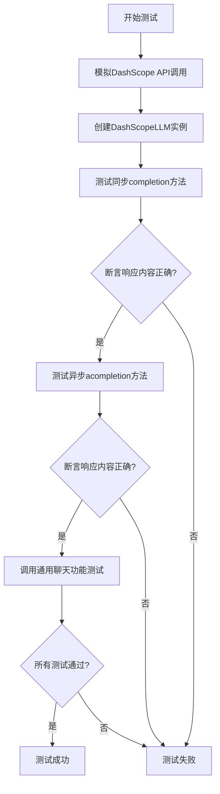
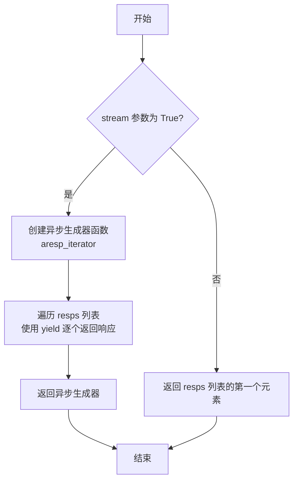
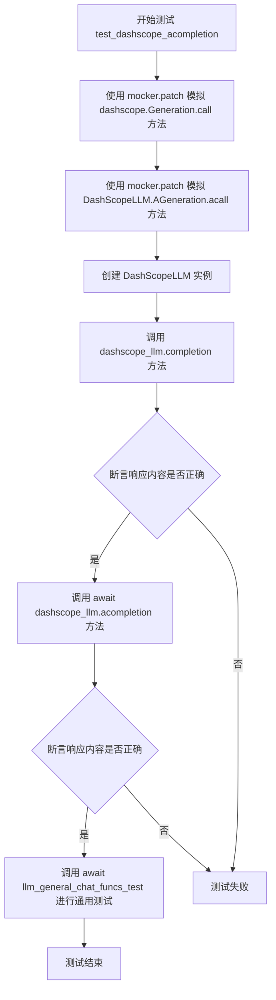
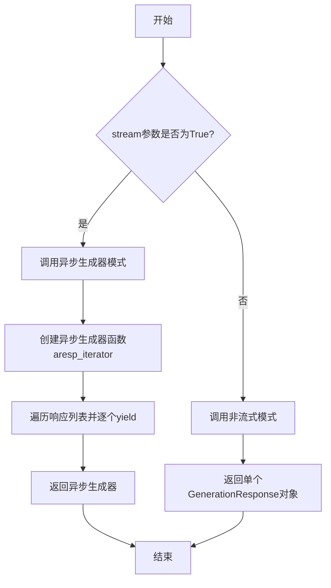
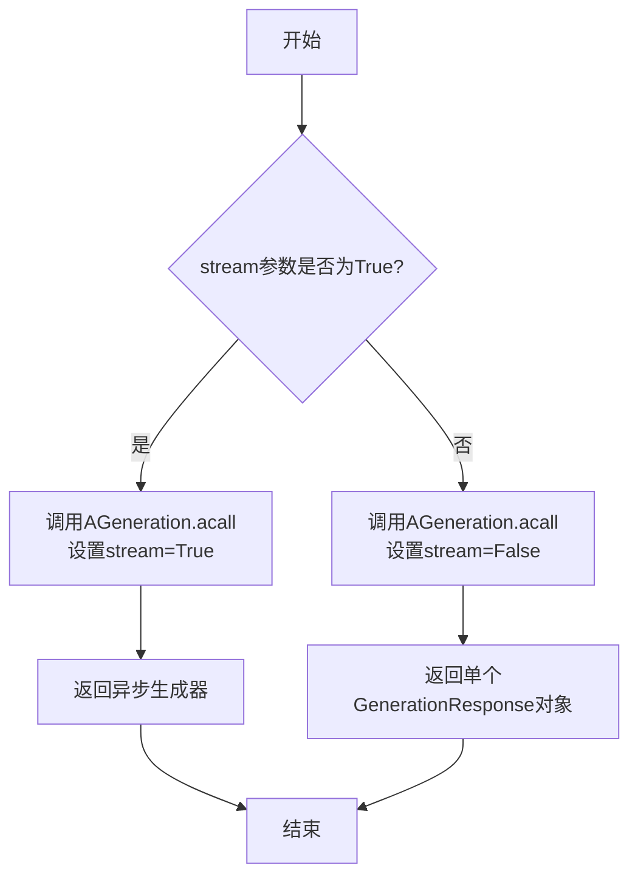

# `.\MetaGPT\tests\metagpt\provider\test_dashscope_api.py` 详细设计文档

该文件是 DashScopeLLM 类的单元测试，通过模拟（Mock）DashScope API 的调用，测试 DashScopeLLM 的同步（completion）和异步（acompletion）文本生成功能，以及通用的聊天功能。

## 整体流程



## 类结构

```
DashScopeLLM (被测试类)
├── __init__
├── completion (同步生成)
└── acompletion (异步生成)
```

## 全局变量及字段


### `name`
    
用于指定测试中使用的DashScope模型名称，例如'qwen-max'。

类型：`str`
    


### `resp_cont`
    
根据模型名称格式化的预期响应内容，用于断言测试结果。

类型：`str`
    


    

## 全局函数及方法

### `mock_dashscope_call`

这是一个用于单元测试的模拟函数，它模拟了 DashScope LLM API 的同步调用。它接收与真实 API 调用相同的参数，但忽略这些参数的具体内容，直接返回一个预定义的、固定的响应对象，用于在测试环境中验证调用逻辑的正确性，而无需依赖外部 API 服务。

参数：

- `cls`：`class`，类方法所属的类（通常为 `DashScopeLLM` 或其测试类）。
- `messages`：`list[dict]`，要发送给模型的消息列表，格式为字典列表。
- `model`：`str`，要调用的模型名称（例如 "qwen-max"）。
- `api_key`：`str`，用于 API 认证的密钥。
- `result_format`：`str`，指定 API 返回结果的格式。
- `incremental_output`：`bool`，默认为 `True`，指示是否启用增量输出。
- `stream`：`bool`，默认为 `False`，指示是否启用流式响应。

返回值：`GenerationResponse`，一个模拟的 DashScope API 响应对象，其内容由 `get_dashscope_response(name)` 函数生成。

#### 流程图

```mermaid
flowchart TD
    A[开始] --> B[接收所有参数<br>messages, model, api_key...]
    B --> C[调用 get_dashscope_response(name)<br>生成固定响应]
    C --> D[返回模拟的 GenerationResponse 对象]
    D --> E[结束]
```

#### 带注释源码

```python
@classmethod
def mock_dashscope_call(
    cls,
    messages: list[dict],
    model: str,
    api_key: str,
    result_format: str,
    incremental_output: bool = True,
    stream: bool = False,
) -> GenerationResponse:
    # 该函数是一个模拟函数，用于在单元测试中替代真实的 DashScope API 调用。
    # 它接收与真实调用相同的参数签名，但忽略所有输入参数的具体值。
    # 其核心逻辑是调用一个辅助函数 `get_dashscope_response`，
    # 并传入一个预定义的模型名称 `name`（在此上下文中为 "qwen-max"），
    # 以生成一个固定的、结构正确的 `GenerationResponse` 对象。
    # 这使得测试可以在不依赖网络和外部 API 的情况下，验证调用流程和响应处理逻辑。
    return get_dashscope_response(name)
```

### `mock_dashscope_acall`

这是一个用于单元测试的模拟异步方法，它模拟了 DashScope API 的异步调用行为。根据 `stream` 参数的值，它可以返回一个异步生成器（用于流式响应）或一个单一的 `GenerationResponse` 对象（用于非流式响应）。

参数：

- `cls`：`class`，类方法所属的类（隐式参数）。
- `messages`：`list[dict]`，要发送给模型的消息列表。
- `model`：`str`，要使用的模型名称。
- `api_key`：`str`，用于认证的 API 密钥。
- `result_format`：`str`，期望的响应格式。
- `incremental_output`：`bool`，默认为 `True`，指示是否启用增量输出。
- `stream`：`bool`，默认为 `False`，指示是否以流式方式返回响应。

返回值：`Union[AsyncGenerator[GenerationResponse, None], GenerationResponse]`，如果 `stream` 为 `True`，则返回一个异步生成器，该生成器逐个产生 `GenerationResponse` 对象；否则，直接返回一个 `GenerationResponse` 对象。

#### 流程图



#### 带注释源码

```python
@classmethod
async def mock_dashscope_acall(
    cls,
    messages: list[dict],
    model: str,
    api_key: str,
    result_format: str,
    incremental_output: bool = True,
    stream: bool = False,
) -> Union[AsyncGenerator[GenerationResponse, None], GenerationResponse]:
    # 创建一个包含单个模拟响应的列表
    resps = [get_dashscope_response(name)]

    if stream:
        # 如果 stream 为 True，定义一个异步生成器函数
        async def aresp_iterator(resps: list[GenerationResponse]):
            # 遍历响应列表
            for resp in resps:
                # 使用 yield 逐个产生响应，模拟流式输出
                yield resp

        # 返回异步生成器
        return aresp_iterator(resps)
    else:
        # 如果 stream 为 False，直接返回列表中的第一个（也是唯一一个）响应
        return resps[0]
```

### `test_dashscope_acompletion`

该函数是一个异步单元测试，用于验证 `DashScopeLLM` 类的异步完成功能。它通过模拟（mocking）外部API调用，测试 `DashScopeLLM` 实例的 `completion` 和 `acompletion` 方法是否能正确处理输入消息并返回预期的响应内容。测试还调用了通用的LLM聊天功能测试函数，以进行更全面的验证。

参数：

- `mocker`：`pytest_mock.plugin.MockerFixture`，pytest-mock插件提供的模拟对象，用于在测试中替换（mock）函数或方法。

返回值：`None`，该函数是一个测试函数，不返回业务值，而是通过断言（assert）来验证测试结果。

#### 流程图



#### 带注释源码

```python
@pytest.mark.asyncio  # 标记此测试函数为异步函数，以便在异步环境中运行
async def test_dashscope_acompletion(mocker):
    # 使用 mocker.patch 替换 `dashscope.aigc.generation.Generation.call` 方法
    # 将其替换为本地定义的 `mock_dashscope_call` 函数，以模拟API调用并返回预定义的响应
    mocker.patch("dashscope.aigc.generation.Generation.call", mock_dashscope_call)
    # 使用 mocker.patch 替换 `metagpt.provider.dashscope_api.AGeneration.acall` 方法
    # 将其替换为本地定义的 `mock_dashscope_acall` 函数，以模拟异步API调用
    mocker.patch("metagpt.provider.dashscope_api.AGeneration.acall", mock_dashscope_acall)

    # 使用模拟的LLM配置创建 DashScopeLLM 实例
    dashscope_llm = DashScopeLLM(mock_llm_config_dashscope)

    # 测试同步的 completion 方法
    resp = dashscope_llm.completion(messages)
    # 断言同步调用返回的响应内容与预期模板内容一致
    assert resp.choices[0]["message"]["content"] == resp_cont

    # 测试异步的 acompletion 方法
    resp = await dashscope_llm.acompletion(messages)
    # 断言异步调用返回的响应内容与预期模板内容一致
    assert resp.choices[0]["message"]["content"] == resp_cont

    # 调用通用的LLM聊天功能测试函数，对 dashscope_llm 实例进行更全面的测试
    # 传入 prompt, messages 和预期的响应内容 resp_cont
    await llm_general_chat_funcs_test(dashscope_llm, prompt, messages, resp_cont)
```

### `DashScopeLLM.completion`

该方法用于调用阿里云DashScope API进行文本生成，支持同步和异步两种调用方式，并处理了流式和非流式响应的差异。

参数：

- `messages`：`list[dict]`，包含对话历史的消息列表，每个消息是一个字典，通常包含"role"和"content"字段。
- `model`：`str`，指定使用的模型名称，例如"qwen-max"。
- `api_key`：`str`，DashScope API的访问密钥。
- `result_format`：`str`，指定返回结果的格式，例如"message"或"text"。
- `incremental_output`：`bool`，默认为True，指示是否启用增量输出（流式响应时有效）。
- `stream`：`bool`，默认为False，指示是否启用流式响应。

返回值：`Union[AsyncGenerator[GenerationResponse, None], GenerationResponse]`，如果`stream`为True，返回一个异步生成器，逐个生成`GenerationResponse`对象；否则返回单个`GenerationResponse`对象。

#### 流程图



#### 带注释源码

```python
@classmethod
async def mock_dashscope_acall(
    cls,
    messages: list[dict],
    model: str,
    api_key: str,
    result_format: str,
    incremental_output: bool = True,
    stream: bool = False,
) -> Union[AsyncGenerator[GenerationResponse, None], GenerationResponse]:
    # 模拟DashScope API的响应，这里使用预定义的响应列表
    resps = [get_dashscope_response(name)]

    if stream:
        # 如果启用流式响应，定义一个异步生成器函数
        async def aresp_iterator(resps: list[GenerationResponse]):
            # 遍历响应列表，逐个yield返回
            for resp in resps:
                yield resp

        # 返回异步生成器
        return aresp_iterator(resps)
    else:
        # 如果非流式响应，直接返回单个响应对象
        return resps[0]
```

### `DashScopeLLM.acompletion`

该方法用于异步调用DashScope（通义千问）的LLM API，以生成对话补全。它支持流式和非流式响应，并处理API调用过程中的参数传递和响应解析。

参数：

- `messages`：`list[dict]`，包含对话历史的消息列表，每个消息是一个字典，通常包含"role"和"content"字段。
- `stream`：`bool`，可选参数，默认为`False`。指示是否使用流式响应。如果为`True`，则返回异步生成器；否则返回完整的响应对象。
- `generator`：`bool`，可选参数，默认为`False`。指示是否以生成器形式返回响应。此参数在代码中未直接使用，可能用于内部逻辑或未来扩展。
- `**kwargs`：`dict`，可选关键字参数，用于传递额外的API调用参数，如模型名称、API密钥等。

返回值：`Union[AsyncGenerator[GenerationResponse, None], GenerationResponse]`，如果`stream`为`True`，则返回一个异步生成器，逐次生成`GenerationResponse`对象；否则返回单个`GenerationResponse`对象，包含完整的API响应。

#### 流程图



#### 带注释源码

```python
async def acompletion(
    self, messages: list[dict], stream: bool = False, generator: bool = False, **kwargs
) -> Union[AsyncGenerator[GenerationResponse, None], GenerationResponse]:
    """
    异步调用DashScope LLM API生成补全。

    Args:
        messages (list[dict]): 包含对话历史的消息列表。
        stream (bool, optional): 是否使用流式响应。默认为False。
        generator (bool, optional): 是否以生成器形式返回响应。默认为False。
        **kwargs: 额外的API调用参数。

    Returns:
        Union[AsyncGenerator[GenerationResponse, None], GenerationResponse]:
            如果stream为True，返回异步生成器；否则返回单个响应对象。
    """
    # 调用AGeneration.acall方法，传递消息、模型、API密钥等参数
    # incremental_output控制是否增量输出，stream控制是否流式响应
    resp = await self.ageneration.acall(
        messages=messages,
        model=self.model,
        api_key=self.api_key,
        result_format="message",
        incremental_output=True,
        stream=stream,
        **kwargs,
    )
    return resp  # 返回API响应
```

## 关键组件


### DashScopeLLM

DashScopeLLM 是 MetaGPT 框架中用于与阿里云 DashScope API 进行交互的 LLM 提供者类，负责封装同步和异步的文本生成请求。

### Mock 测试工具

提供用于单元测试的模拟函数和数据，包括模拟 DashScope API 的同步调用 (`mock_dashscope_call`) 和异步调用 (`mock_dashscope_acall`)，以及预定义的测试响应内容 (`resp_cont_tmpl`)。

### 测试用例 (`test_dashscope_acompletion`)

一个使用 `pytest` 和 `mocker` 的异步测试函数，用于验证 `DashScopeLLM` 的 `completion` 和 `acompletion` 方法在模拟环境下的功能正确性，包括对返回内容的基本断言。

### 通用 LLM 功能测试工具 (`llm_general_chat_funcs_test`)

一个通用的测试函数，用于对 LLM 提供者（如 `DashScopeLLM`）的多种聊天相关方法（如 `achat`, `ask` 等）进行集中测试，确保其行为符合预期。


## 问题及建议


### 已知问题

-   **测试代码与生产代码耦合度高**：测试文件 `mock_dashscope_call` 和 `mock_dashscope_acall` 函数直接模拟了 `dashscope.aigc.generation.Generation.call` 和 `metagpt.provider.dashscope_api.AGeneration.acall` 的内部调用。这种深度模拟使得测试非常脆弱，一旦生产代码中这些被模拟对象的接口或内部实现发生变化（例如方法名、参数列表或导入路径改变），测试就会失败，即使 `DashScopeLLM` 类的核心逻辑没有变化。
-   **测试覆盖不完整**：测试主要验证了正常情况下的同步和异步调用，但对于 `DashScopeLLM` 类的错误处理机制（如网络异常、API密钥无效、模型不可用、响应格式错误等）缺乏测试用例。这可能导致生产环境中未处理的异常。
-   **硬编码的模拟数据**：测试中使用的模拟响应 `resp_cont` 是硬编码的，基于固定的 `name` 变量（`"qwen-max"`）。这虽然对当前测试有效，但如果未来需要测试不同模型或不同响应内容时，代码复用性差，需要修改多处。
-   **异步流式响应测试过于简化**：在 `mock_dashscope_acall` 函数中，模拟流式响应（`stream=True`）时，只是将一个包含单个响应对象的列表转换为异步生成器。这没有真实模拟流式API可能返回多个分块（chunks）的场景，无法充分测试消费者（如 `acompletion` 方法）处理流式数据的能力。
-   **缺少对配置和初始化的测试**：测试用例 `test_dashscope_acompletion` 直接使用了 `mock_llm_config_dashscope`，但没有测试 `DashScopeLLM` 类在接收不同配置（如缺失 `api_key`、`model` 为空等）时的行为，也未测试其 `__init__` 方法。

### 优化建议

-   **重构模拟策略，提升测试健壮性**：建议使用更高级的模拟技术或依赖注入。例如，可以为 `DashScopeLLM` 类定义一个抽象的“客户端”接口，并在测试中提供该接口的模拟实现。或者，使用 `unittest.mock.patch` 在更高的抽象层次上进行模拟（如模拟 `DashScopeLLM` 内部用于发起请求的方法），而不是深入到第三方库的具体类和方法。这能降低测试与第三方库内部细节的耦合。
-   **补充错误处理和边界条件测试**：增加测试用例，模拟各种异常情况。例如，使用 `mocker` 让被模拟的 `call` 或 `acall` 方法抛出 `dashscope.common.error.AuthenticationError`、`dashscope.common.error.ServiceUnavailableError` 等异常，然后验证 `DashScopeLLM.completion` 和 `.acompletion` 方法是否按预期处理这些异常（例如，封装并抛出统一的 `MetagptProviderError`）。
-   **参数化测试数据**：使用 `pytest.mark.parametrize` 装饰器来参数化测试。可以将不同的模型名称、预期的响应内容、甚至模拟的错误类型作为参数传入测试函数，从而用一套测试逻辑覆盖多种场景，提高代码的清晰度和可维护性。
-   **增强流式响应模拟的真实性**：改进 `mock_dashscope_acall` 函数中处理 `stream=True` 的逻辑。可以模拟返回一个包含多个 `GenerationResponse` 对象的异步生成器，每个对象代表流式输出中的一个分块。这有助于验证 `DashScopeLLM.acompletion` 方法是否正确拼接了这些分块以形成完整的响应。
-   **增加单元测试的隔离性**：为 `DashScopeLLM` 的 `__init__` 方法、配置验证逻辑等编写独立的单元测试。确保每个测试只关注一个小的功能单元，并使用 `pytest.fixture` 来管理测试资源（如 `mock_llm_config_dashscope`）的生命周期，使测试更清晰、更易于维护。


## 其它


### 设计目标与约束

本代码模块的核心设计目标是提供一个针对 `DashScopeLLM` 类的单元测试套件，用于验证其同步（`completion`）和异步（`acompletion`）方法的功能正确性，以及与通用聊天功能测试的兼容性。主要约束包括：1) 必须通过模拟（Mock）外部API调用（`dashscope.aigc.generation.Generation.call` 和 `metagpt.provider.dashscope_api.AGeneration.acall`）来确保测试的隔离性和可重复性，避免依赖不稳定的网络服务或产生实际API费用。2) 测试需要覆盖流式（`stream=True`）和非流式两种响应模式。3) 测试断言应基于预定义的模拟响应内容，确保结果的一致性。

### 错误处理与异常设计

当前测试代码主要关注正常路径（Happy Path）的功能验证，并未显式包含对 `DashScopeLLM` 类中可能抛出的异常（如网络错误、认证失败、无效参数错误等）的测试用例。这是一个测试覆盖度的缺口。一个完整的设计文档应指出，为了确保代码的健壮性，需要补充针对以下场景的单元测试：1) 当模拟的 `dashscope` API返回错误状态码或异常时，`DashScopeLLM.completion` 和 `acompletion` 方法是否按预期抛出或处理了相应的异常（例如 `APIConnectionError`, `AuthenticationError`）。2) 传入无效的 `messages` 参数（如空列表、格式错误）时，是否进行了参数校验并抛出 `ValueError`。当前的测试设计未体现这些错误处理逻辑的验证。

### 数据流与状态机

本测试模块的数据流清晰且线性：1) **初始化**：使用 `mock_llm_config_dashscope` 配置创建 `DashScopeLLM` 实例。2) **模拟注入**：通过 `mocker.patch` 将实际的外部API调用替换为本地定义的 `mock_dashscope_call` 和 `mock_dashscope_acall` 函数。这些模拟函数根据输入参数（特别是 `stream` 标志）返回预构造的 `GenerationResponse` 对象或一个异步生成器。3) **测试执行**：调用被测对象（`dashscope_llm`）的 `completion` 和 `acompletion` 方法，传入预定义的 `messages`。4) **结果验证**：断言返回的响应内容与预期的 `resp_cont` 模板内容完全一致。整个流程不涉及复杂的状态转换，是一个典型的“准备-执行-断言”（Arrange-Act-Assert）测试模式。

### 外部依赖与接口契约

本测试代码明确声明并模拟了其外部依赖：1) **DashScope官方SDK**：具体为 `dashscope.aigc.generation.Generation.call` 同步接口和 `metagpt.provider.dashscope_api.AGeneration.acall` 异步接口（后者可能是项目内部对官方SDK的封装）。测试通过模拟这些接口，定义了与它们的**契约**：被测的 `DashScopeLLM` 类需要以特定的参数列表（`messages`, `model`, `api_key`, `result_format`, `incremental_output`, `stream`）调用这些接口。2) **测试工具**：依赖 `pytest` 框架和 `pytest-mock`（通过 `mocker` fixture）来进行测试组织、运行和模拟。3) **项目内部模块**：依赖 `metagpt.provider.dashscope_api.DashScopeLLM`（被测类）、`tests.metagpt.provider.mock_llm_config.mock_llm_config_dashscope`（测试配置）以及 `tests.metagpt.provider.req_resp_const` 中的各种常量（`get_dashscope_response`, `llm_general_chat_funcs_test`, `messages`, `prompt`, `resp_cont_tmpl`）。这些依赖共同构成了测试的环境和上下文。

    