# `.\MetaGPT\tests\metagpt\provider\test_general_api_base.py` 详细设计文档

该文件是一个针对 `metagpt.provider.general_api_base` 模块的单元测试文件，主要测试了API请求构建、响应解析、代理配置、日志记录等通用API基础功能，并包含了对同步和异步API请求器的测试。

## 整体流程

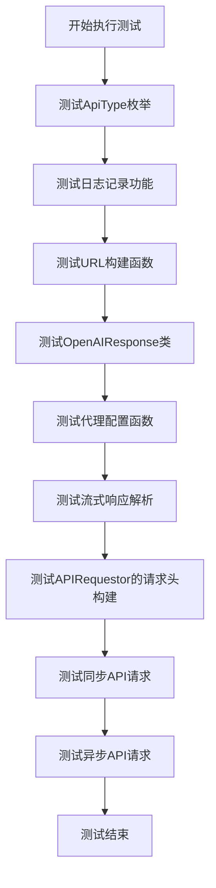

## 类结构

```
metagpt.provider.general_api_base (被测试模块)
├── ApiType (枚举类)
├── OpenAIResponse (数据类)
├── APIRequestor (API请求器类)
├── 全局函数
│   ├── _build_api_url
│   ├── _make_session
│   ├── _requests_proxies_arg
│   ├── _aiohttp_proxies_arg
│   ├── parse_stream
│   ├── parse_stream_helper
│   ├── log_debug
│   ├── log_info
│   ├── log_warn
│   └── logfmt
└── 测试文件函数
    ├── test_basic
    ├── test_openai_response
    ├── test_proxy
    ├── test_parse_stream
    ├── test_requestor_headers
    ├── test_api_requestor
    └── test_async_api_requestor
```

## 全局变量及字段


### `api_requestor`
    
APIRequestor类的全局实例，用于测试HTTP请求功能，其base_url被设置为'http://www.baidu.com'。

类型：`APIRequestor`
    


### `OpenAIResponse.data`
    
存储API响应返回的主要数据内容，通常是一个列表或字典结构。

类型：`List[Any]`
    


### `OpenAIResponse.headers`
    
存储HTTP响应头信息，用于获取如重试间隔等元数据。

类型：`Dict[str, str]`
    


### `OpenAIResponse.request_id`
    
标识本次API请求的唯一ID，用于追踪和调试。

类型：`Optional[str]`
    


### `OpenAIResponse.retry_after`
    
指示在请求被限流或失败后，客户端应等待多少秒后重试。

类型：`Optional[int]`
    


### `OpenAIResponse.operation_location`
    
对于异步操作，此字段提供用于查询操作状态的URL。

类型：`Optional[str]`
    


### `OpenAIResponse.organization`
    
标识发出请求的组织，通常用于多租户或计费场景。

类型：`Optional[str]`
    


### `OpenAIResponse.response_ms`
    
记录服务器处理请求所花费的时间（毫秒），用于性能监控。

类型：`Optional[int]`
    


### `APIRequestor.base_url`
    
API请求的基础URL，所有相对路径的请求都将基于此URL构建。

类型：`str`
    


### `APIRequestor.organization`
    
发起API请求的组织标识，会作为请求头的一部分发送。

类型：`Optional[str]`
    


### `APIRequestor.api_version`
    
指定所使用的API版本，用于控制请求的格式和行为。

类型：`Optional[str]`
    


### `APIRequestor.api_type`
    
枚举类型，标识API的类型（如openai, azure, azuread），影响认证和URL构建逻辑。

类型：`ApiType`
    
    

## 全局函数及方法

### `test_basic`

该函数是一个单元测试函数，主要用于测试`metagpt.provider.general_api_base`模块中的一些基础功能，包括`ApiType`枚举的字符串转换、日志记录、URL构建等。

参数：无

返回值：`None`，无返回值

#### 流程图

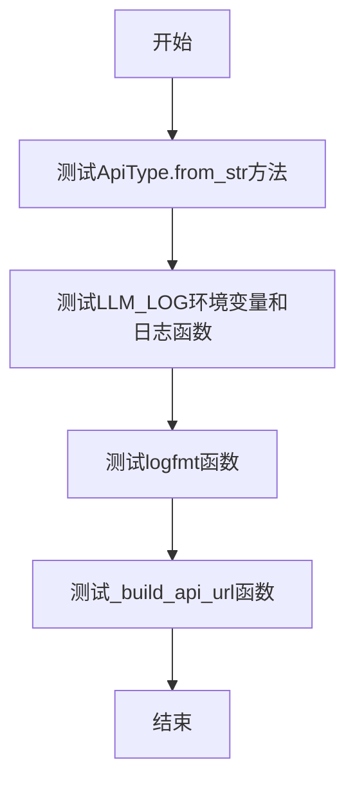

#### 带注释源码

```python
def test_basic():
    # 测试 ApiType.from_str 方法，验证其能正确解析 "azure", "azuread", "openai" 字符串
    _ = ApiType.from_str("azure")
    _ = ApiType.from_str("azuread")
    _ = ApiType.from_str("openai")
    # 测试传入非法字符串 "xx" 时，是否会抛出预期的 OpenAIError 异常
    with pytest.raises(OpenAIError):
        _ = ApiType.from_str("xx")

    # 设置环境变量 LLM_LOG 为 "debug"，并测试不同级别的日志函数
    os.environ.setdefault("LLM_LOG", "debug")
    log_debug("debug")  # 记录调试日志
    log_warn("warn")    # 记录警告日志
    log_info("info")    # 记录信息日志

    # 测试 logfmt 函数，传入一个包含不同类型值的字典
    logfmt({"k1": b"v1", "k2": 1, "k3": "a b"})

    # 测试 _build_api_url 函数，传入基础URL和查询参数
    _build_api_url(url="http://www.baidu.com/s?wd=", query="baidu")
```

### `test_openai_response`

该函数是一个单元测试函数，用于测试`OpenAIResponse`类的实例化及其部分属性的默认值。它创建一个`OpenAIResponse`对象，并断言其`request_id`、`retry_after`、`operation_location`、`organization`和`response_ms`属性在特定初始化参数下的值是否符合预期。

参数：
- 无显式参数。

返回值：`None`，该函数不返回任何值，仅执行断言测试。

#### 流程图

```mermaid
graph TD
    A[开始] --> B[创建OpenAIResponse对象<br>data=[], headers=&#123;'retry-after': 3&#125;]
    B --> C[断言 request_id 为 None]
    C --> D[断言 retry_after 为 3]
    D --> E[断言 operation_location 为 None]
    E --> F[断言 organization 为 None]
    F --> G[断言 response_ms 为 None]
    G --> H[结束]
```

#### 带注释源码

```python
def test_openai_response():
    # 创建一个 OpenAIResponse 对象，传入空数据列表和包含 'retry-after' 头的字典
    resp = OpenAIResponse(data=[], headers={"retry-after": 3})
    # 断言 request_id 属性为 None
    assert resp.request_id is None
    # 断言 retry_after 属性等于传入的 headers 字典中 'retry-after' 的值，即 3
    assert resp.retry_after == 3
    # 断言 operation_location 属性为 None
    assert resp.operation_location is None
    # 断言 organization 属性为 None
    assert resp.organization is None
    # 断言 response_ms 属性为 None
    assert resp.response_ms is None
```

### `test_proxy`

该函数是一个单元测试函数，用于测试代理（proxy）相关的辅助函数，包括 `_requests_proxies_arg`、`_aiohttp_proxies_arg` 和 `_make_session`。它验证了这些函数在不同输入（如 `None`、字符串代理、字典代理）下的行为是否符合预期，并检查了异常情况。

参数：无

返回值：无（`None`），该函数通过 `assert` 语句进行断言测试，不返回任何值。

#### 流程图

```mermaid
flowchart TD
    A[开始 test_proxy] --> B[断言 _requests_proxies_arg None 返回 None]
    B --> C[测试字符串代理 '127.0.0.1:80']
    C --> D[断言 _requests_proxies_arg 返回正确字典]
    D --> E[测试字典代理 {'http': proxy}]
    E --> F[断言 _requests_proxies_arg 返回相同字典]
    F --> G[断言 _aiohttp_proxies_arg 返回代理字符串]
    G --> H[测试字典代理 {'https': proxy}]
    H --> I[断言 _requests_proxies_arg 返回相同字典]
    I --> J[断言 _aiohttp_proxies_arg 返回代理字符串]
    J --> K[断言 _make_session 返回非 None 会话]
    K --> L[断言 _aiohttp_proxies_arg None 返回 None]
    L --> M[断言 _aiohttp_proxies_arg 'test' 返回 'test']
    M --> N[断言 _aiohttp_proxies_arg -1 抛出 ValueError]
    N --> O[结束 test_proxy]
```

#### 带注释源码

```python
def test_proxy():
    # 测试当代理参数为 None 时，_requests_proxies_arg 函数应返回 None
    assert _requests_proxies_arg(proxy=None) is None

    # 定义一个代理字符串
    proxy = "127.0.0.1:80"
    # 测试当代理参数为字符串时，_requests_proxies_arg 函数应返回包含 http 和 https 键的字典
    assert _requests_proxies_arg(proxy=proxy) == {"http": proxy, "https": proxy}
    # 定义一个只包含 http 代理的字典
    proxy_dict = {"http": proxy}
    # 测试当代理参数为字典时，_requests_proxies_arg 函数应返回相同的字典
    assert _requests_proxies_arg(proxy=proxy_dict) == proxy_dict
    # 测试 _aiohttp_proxies_arg 函数将字典代理转换为字符串代理
    assert _aiohttp_proxies_arg(proxy_dict) == proxy
    # 定义一个只包含 https 代理的字典
    proxy_dict = {"https": proxy}
    # 测试当代理参数为字典时，_requests_proxies_arg 函数应返回相同的字典
    assert _requests_proxies_arg(proxy=proxy_dict) == proxy_dict
    # 测试 _aiohttp_proxies_arg 函数将字典代理转换为字符串代理
    assert _aiohttp_proxies_arg(proxy_dict) == proxy

    # 测试 _make_session 函数返回一个非 None 的会话对象
    assert _make_session() is not None

    # 测试当代理参数为 None 时，_aiohttp_proxies_arg 函数应返回 None
    assert _aiohttp_proxies_arg(None) is None
    # 测试当代理参数为字符串 'test' 时，_aiohttp_proxies_arg 函数应返回 'test'
    assert _aiohttp_proxies_arg("test") == "test"
    # 测试当代理参数为无效值 -1 时，_aiohttp_proxies_arg 函数应抛出 ValueError 异常
    with pytest.raises(ValueError):
        _aiohttp_proxies_arg(-1)
```

### `test_parse_stream`

该函数是一个单元测试，用于验证 `parse_stream` 和 `parse_stream_helper` 函数处理流式响应数据的能力。它测试了多种输入场景，包括空数据、结束标记、有效数据行以及无效数据行，确保解析逻辑正确。

参数：

- 无参数

返回值：`None`，无返回值

#### 流程图

```mermaid
flowchart TD
    A[开始测试] --> B[调用 parse_stream_helper<br>输入 None]
    B --> C{返回 None?}
    C -->|是| D[通过断言]
    D --> E[调用 parse_stream_helper<br>输入 b'data: [DONE]']
    E --> F{返回 None?}
    F -->|是| G[通过断言]
    G --> H[调用 parse_stream_helper<br>输入 b'data: test']
    H --> I{返回 'test'?}
    I -->|是| J[通过断言]
    J --> K[调用 parse_stream_helper<br>输入 b'test']
    K --> L{返回 None?}
    L -->|是| M[通过断言]
    M --> N[调用 parse_stream<br>输入 [b'data: test']]
    N --> O[迭代解析结果]
    O --> P{每个元素为 'test'?}
    P -->|是| Q[通过断言]
    Q --> R[测试结束]
```

#### 带注释源码

```python
def test_parse_stream():
    # 测试 parse_stream_helper 函数处理 None 输入的情况，预期返回 None
    assert parse_stream_helper(None) is None
    # 测试 parse_stream_helper 函数处理流式响应结束标记 'data: [DONE]' 的情况，预期返回 None
    assert parse_stream_helper(b"data: [DONE]") is None
    # 测试 parse_stream_helper 函数处理有效数据行 'data: test' 的情况，预期返回字符串 'test'
    assert parse_stream_helper(b"data: test") == "test"
    # 测试 parse_stream_helper 函数处理无效数据行（不以 'data: ' 开头）的情况，预期返回 None
    assert parse_stream_helper(b"test") is None
    # 测试 parse_stream 函数处理包含一个有效数据行的字节列表的情况
    # 使用 for 循环迭代 parse_stream 返回的生成器，验证每个元素是否为 'test'
    for line in parse_stream([b"data: test"]):
        assert line == "test"
```

### `mock_interpret_response`

这是一个用于测试的模拟函数，它模拟了 `APIRequestor._interpret_response` 方法的行为。它接收一个 `requests.Response` 对象和一个布尔值 `stream`，并返回一个固定的元组 `(b"baidu", False)`，用于在单元测试中验证 `APIRequestor.request` 方法的逻辑。

参数：

- `self`：`APIRequestor` 实例，表示调用此方法的对象。
- `result`：`requests.Response`，模拟的 HTTP 响应对象。
- `stream`：`bool`，指示是否为流式响应。

返回值：`Tuple[Union[bytes, Iterator[Generator]], bytes]`，返回一个元组，第一个元素是固定的字节串 `b"baidu"`，第二个元素是布尔值 `False`。

#### 流程图

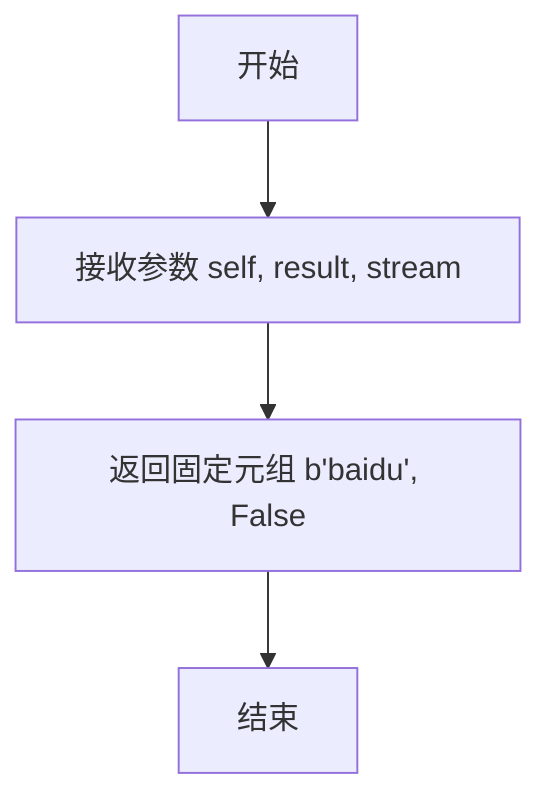

#### 带注释源码

```python
def mock_interpret_response(
    self, result: requests.Response, stream: bool
) -> Tuple[Union[bytes, Iterator[Generator]], bytes]:
    # 这是一个模拟函数，用于在测试中替代真实的 _interpret_response 方法。
    # 它忽略传入的 result 和 stream 参数，始终返回一个固定的响应。
    # 返回值是一个元组，包含模拟的响应数据和一个布尔值（表示是否流式）。
    return b"baidu", False
```

### `mock_interpret_async_response`

这是一个用于测试的模拟函数，它模拟了异步API响应解析过程。该函数接收一个`aiohttp.ClientResponse`对象和一个布尔值`stream`，并返回一个包含模拟响应数据（字节串）和流标志（True）的元组。

参数：

- `self`：`APIRequestor`，API请求器实例
- `result`：`aiohttp.ClientResponse`，异步HTTP客户端响应对象
- `stream`：`bool`，指示是否为流式响应的标志

返回值：`Tuple[Union[OpenAIResponse, AsyncGenerator[OpenAIResponse, None]], bool]`，返回一个元组，包含模拟的响应数据（字节串）和流标志（True）

#### 流程图

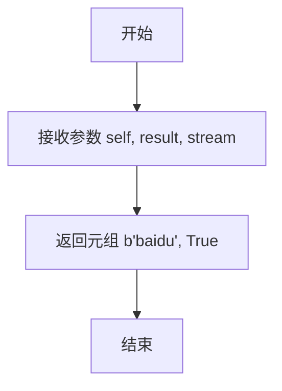

#### 带注释源码

```python
async def mock_interpret_async_response(
    self, result: aiohttp.ClientResponse, stream: bool
) -> Tuple[Union[OpenAIResponse, AsyncGenerator[OpenAIResponse, None]], bool]:
    # 模拟异步响应解析，直接返回固定的字节串和True
    return b"baidu", True
```

### `test_requestor_headers`

该函数是 `APIRequestor` 类的一个单元测试方法，用于测试请求头（headers）的验证和生成功能。它首先测试 `_validate_headers` 方法对各种非法输入的处理，然后测试 `request_headers` 方法能否正确生成包含组织、API版本和请求ID的标准请求头。

参数：

-  `self`：`APIRequestor` 实例，表示测试方法所属的 `APIRequestor` 对象实例。

返回值：`None`，该函数是一个单元测试，不返回任何值，仅通过断言（assert）来验证功能正确性。

#### 流程图

```mermaid
flowchart TD
    A[开始测试] --> B[测试 _validate_headers<br>输入 None]
    B --> C{断言: 返回空字典}
    C --> D[测试 _validate_headers<br>输入非法类型 -1]
    D --> E{断言: 抛出异常}
    E --> F[测试 _validate_headers<br>输入非法键类型 {1: 2}]
    F --> G{断言: 抛出异常}
    G --> H[测试 _validate_headers<br>输入非法值类型 {'test': 1}]
    H --> I{断言: 抛出异常}
    I --> J[测试 _validate_headers<br>输入合法字典]
    J --> K{断言: 返回原字典}
    K --> L[设置 api_requestor 实例属性]
    L --> M[调用 request_headers 方法]
    M --> N{断言: 生成的 headers<br>包含正确属性}
    N --> O[测试结束]
```

#### 带注释源码

```python
def test_requestor_headers():
    # validate_headers
    # 测试 _validate_headers 方法，传入 None 应返回空字典
    headers = api_requestor._validate_headers(None)
    assert not headers
    # 测试 _validate_headers 方法，传入非法类型（-1）应抛出异常
    with pytest.raises(Exception):
        api_requestor._validate_headers(-1)
    # 测试 _validate_headers 方法，传入键为非法类型的字典应抛出异常
    with pytest.raises(Exception):
        api_requestor._validate_headers({1: 2})
    # 测试 _validate_headers 方法，传入值为非法类型的字典应抛出异常
    with pytest.raises(Exception):
        api_requestor._validate_headers({"test": 1})
    # 测试 _validate_headers 方法，传入合法的字典应原样返回
    supplied_headers = {"test": "test"}
    assert api_requestor._validate_headers(supplied_headers) == supplied_headers

    # 设置 APIRequestor 实例的属性，用于后续测试 request_headers 方法
    api_requestor.organization = "test"
    api_requestor.api_version = "test123"
    api_requestor.api_type = ApiType.OPEN_AI
    request_id = "test123"
    # 调用 request_headers 方法生成请求头
    headers = api_requestor.request_headers(method="post", extra={}, request_id=request_id)
    # 断言生成的请求头中包含正确的组织信息
    assert headers["LLM-Organization"] == api_requestor.organization
    # 断言生成的请求头中包含正确的 API 版本信息
    assert headers["LLM-Version"] == api_requestor.api_version
    # 断言生成的请求头中包含正确的请求 ID
    assert headers["X-Request-Id"] == request_id
```

### `test_api_requestor`

该函数是一个测试函数，用于验证`APIRequestor`类的同步和异步请求功能。它通过模拟（mocking）响应解释方法，测试`APIRequestor`实例的`request`和`arequest`方法是否能正确处理GET和POST请求。

参数：

- `mocker`：`pytest_mock.plugin.MockerFixture`，pytest-mock插件提供的模拟对象，用于在测试中替换（patch）目标方法。

返回值：`None`，测试函数通常不返回具体值，而是通过断言（assert）来验证行为。

#### 流程图

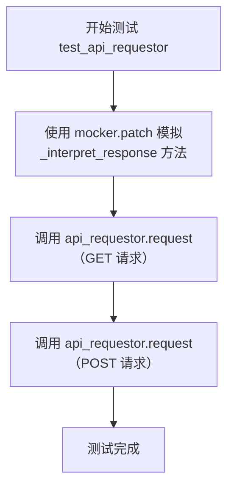

#### 带注释源码

```python
def test_api_requestor(mocker):
    # 使用 mocker.patch 替换 APIRequestor 类的 _interpret_response 方法
    # 将其替换为自定义的 mock_interpret_response 函数，以模拟响应处理逻辑
    mocker.patch("metagpt.provider.general_api_base.APIRequestor._interpret_response", mock_interpret_response)
    
    # 测试同步 GET 请求：调用 api_requestor 的 request 方法，并传入方法名和URL
    # 预期返回模拟的响应 (b"baidu")，以及流标志 (False)
    resp, _, _ = api_requestor.request(method="get", url="/s?wd=baidu")

    # 测试同步 POST 请求：调用 api_requestor 的 request 方法，并传入方法名和URL
    # 预期返回模拟的响应 (b"baidu")，以及流标志 (False)
    resp, _, _ = api_requestor.request(method="post", url="/s?wd=baidu")
```

### `test_async_api_requestor`

这是一个使用 `pytest` 框架编写的异步测试函数，用于测试 `APIRequestor` 类的异步请求方法 `arequest`。它通过模拟（mocking）`_interpret_async_response` 方法来验证异步请求流程的基本功能，确保在给定不同 HTTP 方法（GET 和 POST）时，`arequest` 方法能够被正确调用并返回预期的结果。

参数：

- `mocker`：`pytest-mock` 库提供的 `MockerFixture` 类型对象，用于在测试中创建和管理模拟对象（mock），以隔离被测试代码的外部依赖。

返回值：`None`，测试函数通常不返回具体值，其成功与否由 `pytest` 通过断言或异常来判断。

#### 流程图

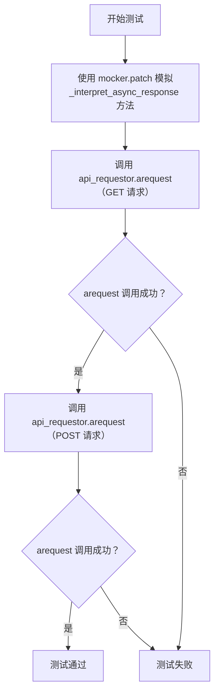

#### 带注释源码

```python
@pytest.mark.asyncio  # 标记此函数为异步测试，以便 pytest-asyncio 插件能够正确处理
async def test_async_api_requestor(mocker):
    # 使用 mocker.patch 模拟（替换）APIRequestor 类的 _interpret_async_response 方法。
    # 模拟后的方法将返回一个固定的元组 (b"baidu", True)，而不是执行真实的网络响应解析逻辑。
    # 这样做的目的是隔离测试，确保测试只关注 arequest 方法的调用流程，而不依赖外部API或网络状态。
    mocker.patch(
        "metagpt.provider.general_api_base.APIRequestor._interpret_async_response", mock_interpret_async_response
    )
    # 第一次调用：测试异步 GET 请求。
    # 调用 api_requestor 实例的 arequest 方法，传入 method="get" 和 url="/s?wd=baidu"。
    # 由于 _interpret_async_response 已被模拟，它将返回模拟值。
    # 返回值 resp 被接收（但在此测试中未进行断言），下划线 `_` 用于忽略不需要的返回值（如流标识和API密钥）。
    resp, _, _ = await api_requestor.arequest(method="get", url="/s?wd=baidu")
    # 第二次调用：测试异步 POST 请求。
    # 流程与GET请求相同，用于验证 arequest 方法对不同HTTP方法的处理。
    resp, _, _ = await api_requestor.arequest(method="post", url="/s?wd=baidu")
    # 测试函数结束。如果没有抛出异常，pytest 将认为此测试通过。
    # 此测试的核心是验证 arequest 方法能够被成功调用两次，而不关心其内部返回的具体内容。
```

### `ApiType.from_str`

该方法用于将字符串形式的API类型标识符转换为对应的`ApiType`枚举成员。它支持"azure"、"azuread"和"openai"三种类型。如果传入的字符串不匹配任何已知类型，则会抛出`OpenAIError`异常。

参数：

- `string`: `str`，表示API类型的字符串，例如"azure"、"azuread"或"openai"。

返回值：`ApiType`，与输入字符串对应的`ApiType`枚举成员。

#### 流程图

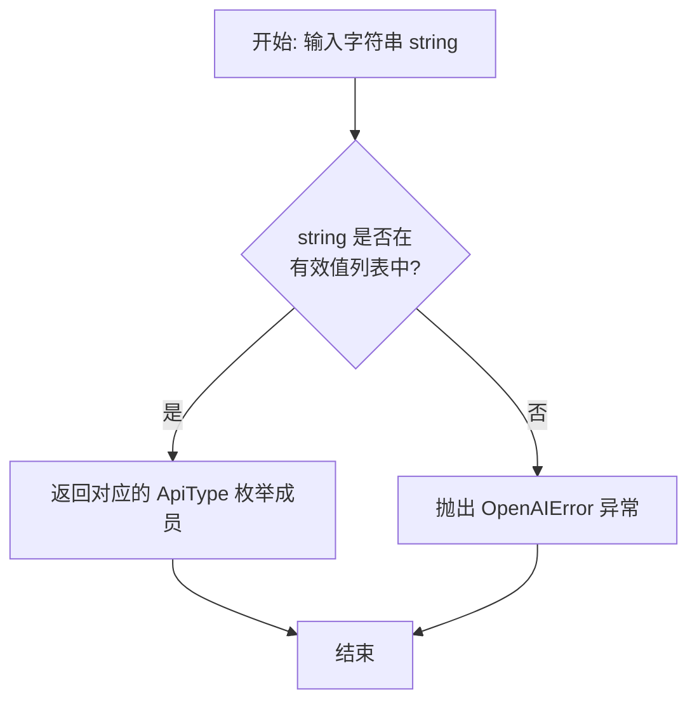

#### 带注释源码

```python
    @classmethod
    def from_str(cls, string: str) -> "ApiType":
        """
        将字符串转换为 ApiType 枚举。

        参数:
            string (str): 表示 API 类型的字符串。

        返回:
            ApiType: 对应的 ApiType 枚举成员。

        异常:
            OpenAIError: 如果字符串不是有效的 API 类型。
        """
        # 检查输入的字符串是否在预定义的映射字典中
        if string in cls._value2member_map_:
            # 如果在，则通过映射字典返回对应的枚举成员
            return cls._value2member_map_[string]
        # 如果不在，则抛出 OpenAIError 异常，提示无效的 API 类型
        raise OpenAIError(
            f"Unknown API type '{string}'. The supported API types are: {list(cls._value2member_map_.keys())}"
        )
```

### `APIRequestor._validate_headers`

该方法用于验证传入的HTTP请求头字典。它确保传入的`headers`参数要么是`None`（返回空字典），要么是一个字典类型，并且字典中的所有值都是字符串类型。如果验证失败，将抛出异常。

参数：

- `headers`：`Optional[Dict[str, str]]`，待验证的HTTP请求头字典。如果为`None`，则返回空字典。

返回值：`Dict[str, str]`，验证通过后的HTTP请求头字典。如果输入为`None`，则返回空字典。

#### 流程图

```mermaid
flowchart TD
    A[开始] --> B{headers 是否为 None?}
    B -- 是 --> C[返回空字典 {}]
    B -- 否 --> D{headers 是否为字典类型?}
    D -- 否 --> E[抛出异常: headers 必须是字典]
    D -- 是 --> F[遍历 headers 的每个键值对]
    F --> G{值是否为字符串类型?}
    G -- 否 --> H[抛出异常: 所有 header 值必须是字符串]
    G -- 是 --> I[继续遍历]
    I --> J{是否遍历完成?}
    J -- 否 --> F
    J -- 是 --> K[返回 headers 字典]
    C --> L[结束]
    K --> L
```

#### 带注释源码

```python
def _validate_headers(self, headers: Optional[Dict[str, str]]) -> Dict[str, str]:
    """
    验证传入的 headers 字典。
    确保 headers 要么是 None（返回空字典），要么是一个字典，并且字典中的所有值都是字符串。

    Args:
        headers (Optional[Dict[str, str]]): 待验证的 HTTP 请求头字典。

    Returns:
        Dict[str, str]: 验证通过后的 HTTP 请求头字典。

    Raises:
        Exception: 如果 headers 不是字典类型，或者包含非字符串的值。
    """
    if headers is None:
        # 如果 headers 为 None，返回一个空字典
        return {}
    if not isinstance(headers, dict):
        # 如果 headers 不是字典类型，抛出异常
        raise Exception("`headers` must be a dictionary")
    for k, v in headers.items():
        # 遍历字典的每个键值对，检查值是否为字符串
        if not isinstance(v, str):
            # 如果值不是字符串，抛出异常
            raise Exception(
                "`headers` values must be of type `str`. "
                f"Found {k}: {v} of type {type(v)}"
            )
    # 所有验证通过，返回原始的 headers 字典
    return headers
```

### `APIRequestor.request_headers`

该方法用于构建并返回一个HTTP请求头字典，包含API请求所需的认证、组织和版本信息，同时支持自定义额外请求头。

参数：

- `method`：`str`，HTTP请求方法（如"GET"、"POST"等）
- `extra`：`dict`，需要添加到请求头中的额外键值对
- `request_id`：`str`，可选的请求标识符，用于跟踪请求

返回值：`dict`，包含完整请求头的字典

#### 流程图

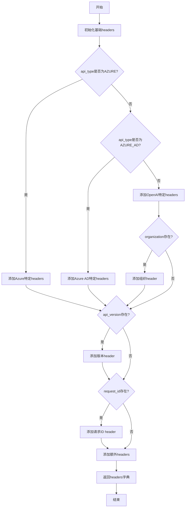

#### 带注释源码

```python
def request_headers(
    self, method: str, extra: dict, request_id: Optional[str] = None
) -> dict:
    """
    构建API请求的headers
    
    Args:
        method: HTTP请求方法
        extra: 额外的headers键值对
        request_id: 可选的请求ID，用于跟踪
    
    Returns:
        包含所有必要headers的字典
    """
    # 初始化基础headers
    headers = {}
    
    # 根据API类型添加特定headers
    if self.api_type is ApiType.AZURE:
        # Azure API需要特定的API密钥header
        headers["api-key"] = self.api_key
        # 设置内容类型为JSON
        headers["Content-Type"] = "application/json"
    elif self.api_type in [ApiType.AZURE_AD, ApiType.OPEN_AI]:
        # Azure AD和OpenAI使用Bearer token认证
        headers["Authorization"] = f"Bearer {self.api_key}"
        # 设置内容类型为JSON
        headers["Content-Type"] = "application/json"
    
    # 添加组织信息（如果存在）
    if self.organization is not None:
        # 使用LLM-Organization作为组织标识
        headers["LLM-Organization"] = self.organization
    
    # 添加API版本信息（如果存在）
    if self.api_version is not None:
        # 使用LLM-Version作为API版本标识
        headers["LLM-Version"] = self.api_version
    
    # 添加请求ID（如果提供）
    if request_id is not None:
        # 使用X-Request-Id作为请求跟踪标识
        headers["X-Request-Id"] = request_id
    
    # 添加用户提供的额外headers
    headers.update(extra)
    
    return headers
```

### `APIRequestor.request`

该方法用于向指定的API端点发送HTTP请求，并处理响应。它支持同步请求，能够处理普通响应和流式响应，并根据API类型和配置自动构建请求头。该方法还负责处理代理设置、会话管理以及响应的初步解析。

参数：

- `method`：`str`，HTTP请求方法，如 "get" 或 "post"。
- `url`：`str`，请求的URL路径，可以是相对路径或绝对路径。
- `params`：`Optional[Dict[str, Any]]`，默认为`None`，请求的查询参数。
- `headers`：`Optional[Dict[str, str]]`，默认为`None`，附加的HTTP请求头。
- `request_id`：`Optional[str]`，默认为`None`，用于标识请求的唯一ID。
- `request_timeout`：`Optional[Union[float, Tuple[float, float]]]`，默认为`None`，请求超时时间。
- `stream`：`bool`，默认为`False`，指示是否期望流式响应。
- `data`：`Optional[Dict[str, Any]]`，默认为`None`，请求体数据，通常用于POST请求。
- `files`：`Optional[Dict[str, Any]]`，默认为`None`，要上传的文件。
- `proxies`：`Optional[Union[str, Dict[str, str]]]`，默认为`None`，代理服务器配置。

返回值：`Tuple[Union[OpenAIResponse, Iterator[Generator]], bool, Dict[str, Any]]`，返回一个三元组，包含解析后的响应数据（可能是普通响应对象或流式迭代器）、一个布尔值指示是否为流式响应，以及响应头字典。

#### 流程图

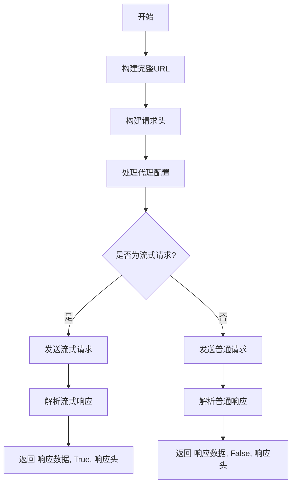

#### 带注释源码

```python
    def request(
        self,
        method: str,
        url: str,
        params: Optional[Dict[str, Any]] = None,
        headers: Optional[Dict[str, str]] = None,
        request_id: Optional[str] = None,
        request_timeout: Optional[Union[float, Tuple[float, float]]] = None,
        stream: bool = False,
        data: Optional[Dict[str, Any]] = None,
        files: Optional[Dict[str, Any]] = None,
        proxies: Optional[Union[str, Dict[str, str]]] = None,
    ) -> Tuple[Union[OpenAIResponse, Iterator[Generator]], bool, Dict[str, Any]]:
        """
        发送HTTP请求到指定的API端点。

        Args:
            method (str): HTTP方法，例如'get'或'post'。
            url (str): 请求的URL路径。
            params (Optional[Dict[str, Any]]): 查询参数字典。
            headers (Optional[Dict[str, str]]): 附加的HTTP头字典。
            request_id (Optional[str]): 请求的唯一标识符。
            request_timeout (Optional[Union[float, Tuple[float, float]]]): 请求超时时间。
            stream (bool): 是否期望流式响应。
            data (Optional[Dict[str, Any]]): 请求体数据。
            files (Optional[Dict[str, Any]]): 要上传的文件。
            proxies (Optional[Union[str, Dict[str, str]]]): 代理配置。

        Returns:
            Tuple[Union[OpenAIResponse, Iterator[Generator]], bool, Dict[str, Any]]:
                一个包含响应数据、流标志和响应头的元组。
        """
        # 构建完整的API URL
        request_url = self._build_api_url(url)
        # 构建请求头，包含认证、组织、版本等信息
        request_headers = self.request_headers(method, headers, request_id)
        # 处理代理配置，转换为requests库所需的格式
        proxies = _requests_proxies_arg(proxies) or self.proxies

        # 准备请求数据
        prepared_data = self._prepare_request_data(data, files)

        # 根据是否为流式请求，选择不同的请求和响应处理方式
        if stream:
            # 发送流式请求
            result = self._make_session().request(
                method,
                request_url,
                headers=request_headers,
                data=prepared_data,
                params=params,
                proxies=proxies,
                stream=stream,
                timeout=request_timeout,
            )
            # 解析流式响应
            resp, got_stream = self._interpret_response(result, stream=True)
        else:
            # 发送普通请求
            result = self._make_session().request(
                method,
                request_url,
                headers=request_headers,
                json=data,
                params=params,
                proxies=proxies,
                files=files,
                timeout=request_timeout,
            )
            # 解析普通响应
            resp, got_stream = self._interpret_response(result, stream=False)

        # 返回解析后的响应、流标志和响应头
        return resp, got_stream, result.headers
```

### `APIRequestor.arequest`

`APIRequestor.arequest` 是 `APIRequestor` 类的异步请求方法，用于向指定的 API 端点发送异步 HTTP 请求。它封装了请求头的构建、代理设置、会话管理以及响应的异步处理和解析，支持流式和非流式响应，旨在为上层调用者提供一个统一、健壮的异步 API 调用接口。

参数：

- `method`：`str`，HTTP 请求方法，例如 "get" 或 "post"。
- `url`：`str`，请求的 API 端点路径或完整 URL。
- `params`：`dict | None`，可选，要附加到 URL 的查询参数字典。
- `headers`：`Mapping[str, str] | None`，可选，要随请求发送的额外 HTTP 头字典。
- `request_id`：`str | None`，可选，用于追踪请求的唯一标识符。
- `request_timeout`：`float | Tuple[float, float] | None`，可选，请求超时时间（秒）。
- `stream`：`bool`，指示是否期望服务器返回流式响应。
- `files`：`dict | None`，可选，用于文件上传的字典。
- `proxy`：`str | dict | None`，可选，代理服务器配置。
- `api_key`：`str | None`，可选，用于认证的 API 密钥，若未提供则使用实例的 `api_key`。
- `api_type`：`ApiType | str | None`，可选，API 类型（如 "openai", "azure"），用于调整请求头。
- `api_version`：`str | None`，可选，API 版本号。
- `organization`：`str | None`，可选，组织标识符。
- `base_url`：`str | None`，可选，API 的基础 URL，若未提供则使用实例的 `base_url`。

返回值：`tuple[OpenAIResponse | AsyncGenerator[OpenAIResponse, None], bool, dict]`，返回一个三元组，包含：1) 解析后的响应数据（`OpenAIResponse` 对象或该对象的异步生成器）；2) 一个布尔值，指示是否使用了流式传输；3) 响应头字典。

#### 流程图

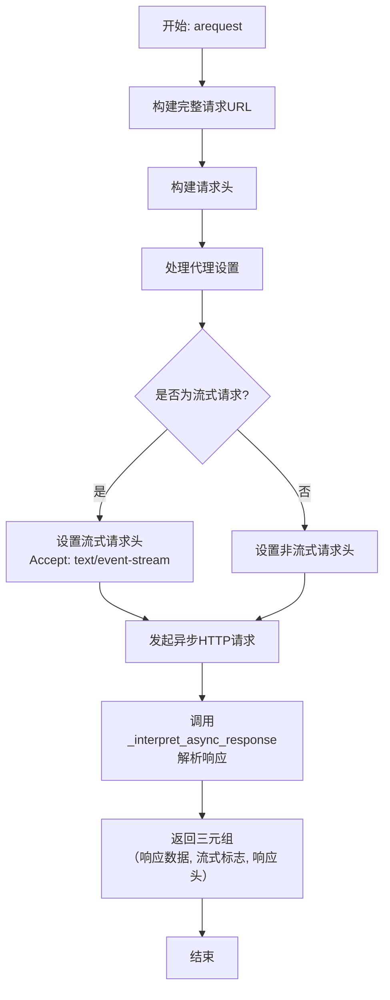

#### 带注释源码

```python
async def arequest(
    self,
    method: str,
    url: str,
    params: dict | None = None,
    headers: Mapping[str, str] | None = None,
    request_id: str | None = None,
    request_timeout: float | Tuple[float, float] | None = None,
    stream: bool = False,
    files: dict | None = None,
    proxy: str | dict | None = None,
    api_key: str | None = None,
    api_type: ApiType | str | None = None,
    api_version: str | None = None,
    organization: str | None = None,
    base_url: str | None = None,
) -> tuple[OpenAIResponse | AsyncGenerator[OpenAIResponse, None], bool, dict]:
    # 确定请求的基础URL，优先使用传入参数，其次使用实例变量
    base_url = base_url or self.base_url
    # 构建完整的请求URL，处理查询参数
    url = _build_api_url(url, base_url, params)

    # 确定API密钥，优先使用传入参数，其次使用实例变量
    api_key = api_key or self.api_key
    # 确定API类型，优先使用传入参数，其次使用实例变量
    supplied_api_type = api_type or self.api_type
    # 确定API版本，优先使用传入参数，其次使用实例变量
    api_version = api_version or self.api_version
    # 确定组织标识，优先使用传入参数，其次使用实例变量
    organization = organization or self.organization

    # 构建请求头，整合认证、API类型、版本、组织等信息
    headers = self.request_headers(
        method,
        extra=headers,
        request_id=request_id,
        api_key=api_key,
        api_type=supplied_api_type,
        api_version=api_version,
        organization=organization,
    )

    # 处理代理配置，转换为aiohttp库所需的格式
    proxy = _aiohttp_proxies_arg(proxy or self.proxy)

    # 如果是流式请求，设置相应的Accept头
    if stream:
        headers["Accept"] = "text/event-stream"

    # 记录调试日志，包含请求方法、URL和头信息（敏感信息如API密钥被掩码）
    log_debug(logfmt(dict(method=method, url=url, headers=headers, stream=stream)))

    # 使用aiohttp的ClientSession发起异步HTTP请求
    async with aiohttp.ClientSession() as session:
        # 根据请求方法（GET/POST）和是否包含文件，调用不同的session方法
        if method == "get":
            result = await session.get(
                url,
                headers=headers,
                proxy=proxy,
                timeout=request_timeout,
            )
        elif method == "post":
            # 对于POST请求，处理可能的文件上传和JSON数据
            data = aiohttp.FormData()
            if files:
                # 将files字典中的文件添加到表单数据中
                for k, v in files.items():
                    data.add_field(k, v[1], filename=v[0])
            if params:
                # 将params字典中的其他参数添加到表单数据中
                for k, v in params.items():
                    data.add_field(k, str(v))
            result = await session.post(
                url,
                headers=headers,
                data=data,
                proxy=proxy,
                timeout=request_timeout,
            )
        else:
            # 目前仅支持GET和POST方法
            raise NotImplementedError(f"Unsupported method: {method}")

        # 调用内部方法解析异步响应，处理流式和非流式情况
        resp, got_stream = await self._interpret_async_response(result, stream)
        # 返回解析后的响应数据、流式标志和响应头
        return resp, got_stream, result.headers
```

### `APIRequestor._interpret_response`

该方法用于解释和处理来自API的同步HTTP响应。它根据响应内容是否为流式数据，将原始响应体转换为适当的数据结构（`OpenAIResponse`对象或迭代器），并返回一个指示是否为流式响应的布尔值。

参数：

- `result`：`requests.Response`，原始的HTTP响应对象，包含状态码、头部和响应体等信息。
- `stream`：`bool`，指示请求是否为流式请求的标志。

返回值：`Tuple[Union[OpenAIResponse, Iterator[Generator]], bool]`，返回一个元组，第一个元素是处理后的响应数据（`OpenAIResponse`对象或迭代器），第二个元素是一个布尔值，指示响应是否为流式数据。

#### 流程图

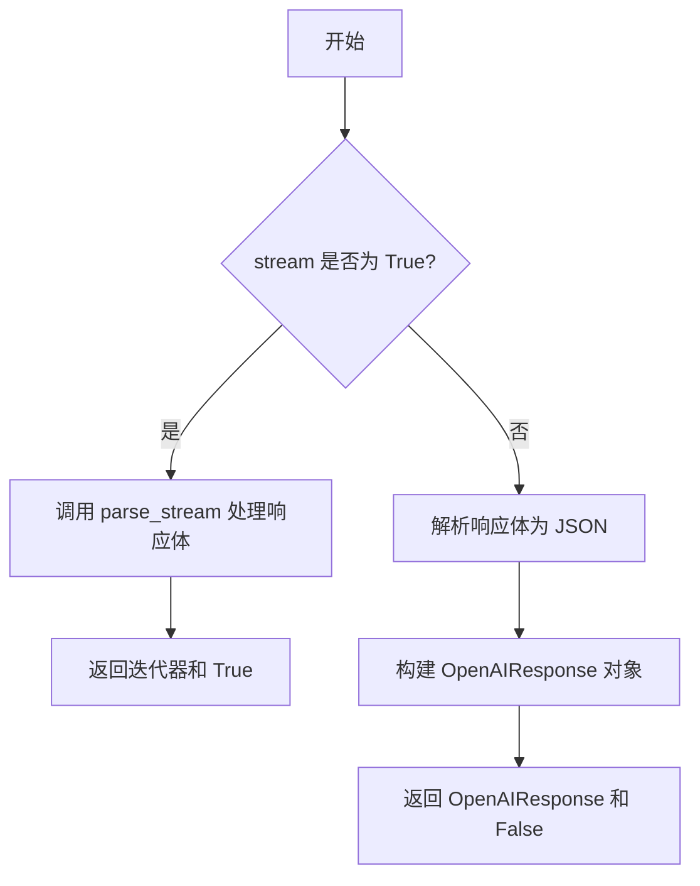

#### 带注释源码

```python
def _interpret_response(
    self, result: requests.Response, stream: bool
) -> Tuple[Union[OpenAIResponse, Iterator[Generator]], bool]:
    """Processes the API response."""
    # 获取响应体内容
    content = result.content
    # 如果请求是流式的，则使用 parse_stream 处理响应体
    if stream:
        return parse_stream(result.iter_lines()), True
    else:
        # 否则，将响应体解析为 JSON
        data = json.loads(content) if content else {}
        # 构建 OpenAIResponse 对象，包含数据和响应头部
        resp = OpenAIResponse(data, result.headers)
        # 返回 OpenAIResponse 对象和 False（表示非流式响应）
        return resp, False
```

### `APIRequestor._interpret_async_response`

该方法用于异步处理来自API的HTTP响应。它根据响应内容类型（如JSON或流式数据）和请求时指定的`stream`标志，将原始的`aiohttp.ClientResponse`对象解析为结构化的`OpenAIResponse`对象或一个异步生成器。该方法负责处理响应头、状态码，并解析响应体，是异步API请求流程中的核心数据处理环节。

参数：

- `self`：`APIRequestor`，APIRequestor类的实例，用于访问实例属性和其他方法。
- `result`：`aiohttp.ClientResponse`，从`aiohttp`客户端接收到的原始HTTP响应对象。
- `stream`：`bool`，一个布尔标志，指示请求是否期望流式响应。如果为`True`，则响应体应作为异步生成器处理；如果为`False`，则响应体应作为完整的JSON对象处理。

返回值：`Tuple[Union[OpenAIResponse, AsyncGenerator[OpenAIResponse, None]], bool]`，返回一个元组。第一个元素是解析后的结果，可能是一个`OpenAIResponse`对象（非流式）或一个生成`OpenAIResponse`对象的异步生成器（流式）。第二个元素是一个布尔值，指示响应是否为流式。

#### 流程图

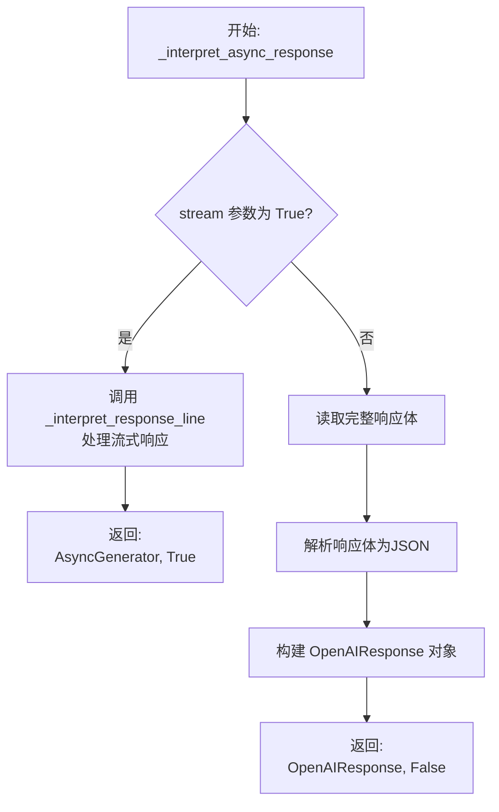

#### 带注释源码

```python
async def _interpret_async_response(
    self, result: aiohttp.ClientResponse, stream: bool
) -> Tuple[Union[OpenAIResponse, AsyncGenerator[OpenAIResponse, None]], bool]:
    """Processes an async HTTP response from the API.

    Args:
        result (aiohttp.ClientResponse): The raw HTTP response object.
        stream (bool): Whether the response is expected to be streamed.

    Returns:
        Tuple[Union[OpenAIResponse, AsyncGenerator[OpenAIResponse, None]], bool]:
            A tuple containing the processed response (either an OpenAIResponse
            object or an async generator yielding OpenAIResponse objects) and a
            boolean indicating if the response is streamed.
    """
    # 检查响应状态码，如果请求失败（非2xx状态码），则抛出OpenAIError异常。
    # 这确保了只有成功的响应才会进入后续的解析流程。
    if result.status >= 400:
        raise await self._handle_error_response(result)
    
    # 处理流式响应。
    # 如果请求时指定了stream=True，则响应体应该是一系列由换行符分隔的事件流。
    # 这里返回一个异步生成器，该生成器会逐行（或逐块）消费响应体，
    # 并通过_interpret_response_line方法将每一行解析成结构化的OpenAIResponse对象。
    if stream:
        # 注意：这里返回的是一个异步生成器函数（async generator），
        # 调用者可以通过`async for`循环来迭代获取解析后的数据块。
        return (
            self._interpret_response_line(await result.content.readline(), result),
            True,
        )
    
    # 处理非流式（普通）响应。
    # 对于非流式响应，直接读取整个响应体内容。
    content = await result.read()
    
    # 获取响应的Content-Type头部，用于判断如何解析数据。
    content_type = result.headers.get("content-type", "")
    
    # 如果响应内容是JSON格式，则将其解析为Python字典。
    # 这是与OpenAI API交互时最常见的情况。
    if content_type.startswith("application/json"):
        data = json.loads(content)
    else:
        # 如果响应不是JSON格式（例如纯文本或二进制数据），
        # 则直接将原始字节内容作为数据。这提供了处理非JSON响应的灵活性。
        data = content
    
    # 使用解析出的数据、原始的HTTP响应头构建一个OpenAIResponse对象。
    # 这个对象封装了API返回的数据和元数据（如请求ID、重试间隔等），便于后续使用。
    return (
        OpenAIResponse(
            data,
            headers=dict(result.headers),
        ),
        False,  # 明确标记此响应为非流式。
    )
```

## 关键组件


### APIRequestor

负责构建和发送HTTP请求到LLM API，处理同步和异步调用，并解析响应。它是与外部API交互的核心组件，封装了请求头管理、代理设置、URL构建和响应解释等通用逻辑。

### ApiType

一个枚举类，用于表示和验证所支持的API类型（如OpenAI、Azure、Azure AD）。它提供了从字符串到枚举值的转换方法，确保API类型的一致性和正确性。

### OpenAIResponse

一个数据类，用于封装从LLM API返回的响应。它标准化了响应数据的结构，包含数据体、响应头以及从头部提取的特定信息（如请求ID、重试间隔等），便于后续处理。

### 流式响应解析器 (parse_stream, parse_stream_helper)

一组用于处理服务器端事件（Server-Sent Events, SSE）流式响应的函数。它们负责从原始的字节流中解析出有效的数据行（格式为`data: ...`），并过滤掉控制消息（如`[DONE]`），将数据转换为可迭代的Python对象。

### 代理配置处理器 (_requests_proxies_arg, _aiohttp_proxies_arg)

用于处理不同HTTP客户端库（`requests` 和 `aiohttp`）的代理配置。它们将用户提供的代理字符串或字典转换为对应库所需的格式，确保网络请求能正确通过代理服务器。

### 日志记录器 (log_debug, log_info, log_warn, logfmt)

提供不同级别的日志记录功能（调试、信息、警告）和一个格式化工具（logfmt）。它们帮助在开发和调试过程中跟踪代码执行状态和API交互细节。

### 会话管理器 (_make_session)

创建并返回一个可复用的HTTP会话对象（`requests.Session`）。这有助于提高HTTP请求的性能，通过连接池复用和管理TCP连接。

### URL构建器 (_build_api_url)

一个辅助函数，用于将基础URL和查询参数安全地拼接成一个完整的请求URL。它处理了URL编码和参数拼接的细节。


## 问题及建议

### 已知问题

-   **测试代码与生产代码耦合**：测试文件 `test_general_api_base.py` 中直接导入了大量生产模块的内部函数（如 `_build_api_url`, `_make_session`, `_requests_proxies_arg` 等）进行测试。这违反了封装原则，使得测试高度依赖于实现细节，一旦内部函数重构或重命名，测试将大量失败，增加了维护成本。
-   **测试覆盖不完整**：测试用例主要集中在正向路径和简单的参数验证上。对于 `APIRequestor` 类的核心方法（如 `request`, `arequest`）以及 `_interpret_response`, `_interpret_async_response` 等关键方法，使用了 `mocker.patch` 进行了模拟，并未测试其真实的网络请求、错误处理（如超时、HTTP错误码、API错误响应）、流式响应解析等复杂逻辑。
-   **模拟测试的验证不足**：在 `test_api_requestor` 和 `test_async_api_requestor` 测试中，虽然模拟了 `_interpret_response` 等方法，但测试断言仅检查了函数是否被调用且未抛出异常，并未验证模拟函数返回的数据（`b"baidu"`）是否被后续逻辑正确处理，也未验证请求的构建（如URL、headers、body）是否正确。
-   **环境变量副作用**：`test_basic` 函数中设置了 `os.environ.setdefault("LLM_LOG", "debug")`，这会改变测试执行期间（甚至可能影响其他并行测试）的全局环境状态，可能导致测试结果不可预测或产生副作用。
-   **异常测试用例不精确**：在 `test_proxy` 中，测试 `_aiohttp_proxies_arg(-1)` 期望抛出 `ValueError`。然而，该测试依赖于函数内部实现，如果未来实现更改（例如改为抛出 `TypeError`），测试将错误地失败，而函数行为可能仍然是正确的。异常测试应基于公共接口契约，而非内部实现。

### 优化建议

-   **重构测试以面向公共接口**：建议将测试重点放在 `APIRequestor` 类的公共方法（如 `request`, `arequest`）以及模块级公开的辅助函数上。对于内部辅助函数（尤其是以下划线 `_` 开头的），应通过测试公共方法来间接覆盖其行为，或将其重构为更独立、可测试的单元（如工具函数类），并减少测试文件对其的直接导入。
-   **补充关键路径和异常测试**：为 `APIRequestor` 增加针对网络异常（如 `requests.exceptions.Timeout`, `aiohttp.ClientError`）、HTTP 非200状态码、OpenAI API 返回的错误 JSON、以及完整的流式响应（SSE）解析场景的测试。可以使用 `responses` 或 `aiohttp.test_utils` 库来模拟 HTTP 服务端行为，进行更真实和可控的集成测试。
-   **增强模拟测试的断言**：在使用 `mocker.patch` 时，应利用 `mocker.spy` 或检查模拟对象的调用参数（`call_args`）来验证请求构建的正确性。同时，测试应断言最终返回的结果是否符合预期，而不仅仅是函数执行不报错。
-   **隔离测试环境**：使用 `pytest` 的 `monkeypatch` fixture 来临时设置和恢复环境变量，避免测试间的污染。例如，将 `os.environ.setdefault(...)` 替换为 `monkeypatch.setenv("LLM_LOG", "debug")`。
-   **明确异常契约，改进异常测试**：审查并明确 `_aiohttp_proxies_arg` 等函数的输入参数契约。异常测试应基于文档化的契约（例如，“当 `proxy` 参数不是 `str`, `dict` 或 `None` 时，抛出 `ValueError`”），这样即使内部实现变化，只要契约不变，测试就依然有效。考虑为这类参数验证函数添加类型注解和更清晰的文档字符串。

## 其它


### 设计目标与约束

该模块旨在为大型语言模型（LLM）提供统一的、可扩展的API请求基础框架。其核心设计目标包括：1) 抽象化不同API提供商（如OpenAI、Azure OpenAI）的请求细节，提供一致的调用接口；2) 支持同步和异步两种请求模式；3) 内置代理、日志、流式响应解析等通用功能；4) 通过`APIRequestor`类封装请求头管理、URL构建、响应解释等逻辑，降低上层业务代码的复杂度。主要约束是需兼容`openai`库的部分接口和错误类型，以方便集成和迁移。

### 错误处理与异常设计

模块的错误处理主要围绕`OpenAIError`异常展开，用于标识API相关的错误（如`ApiType.from_str`遇到无效类型）。在内部函数中，通过`assert`语句（在测试中）和`raise`语句（如`_aiohttp_proxies_arg`对无效代理参数的检查）进行参数验证。`APIRequestor`的`_validate_headers`方法会检查请求头字典的键值类型，对非法输入抛出`Exception`。对于网络请求过程中可能出现的异常（如连接超时、HTTP错误），预计由底层的`requests`或`aiohttp`库抛出，并由调用者捕获和处理。流式响应解析函数`parse_stream_helper`对非标准数据行返回`None`，提供了静默处理机制。

### 数据流与状态机

模块的数据流相对线性，不涉及复杂的状态机。核心流程始于调用者通过`APIRequestor.request`或`arequest`方法发起请求。该方法内部依次执行：1) 构建请求头（`request_headers`）；2) 构建完整URL（依赖`_build_api_url`）；3) 创建HTTP会话（`_make_session`）并配置代理（`_requests_proxies_arg`或`_aiohttp_proxies_arg`）；4) 发送HTTP请求；5) 解释响应（`_interpret_response`或`_interpret_async_response`），其中可能涉及流式数据的解析（`parse_stream`）。`OpenAIResponse`类作为标准响应容器，封装了数据、头部信息及如`retry_after`等扩展字段，是数据流的终点输出格式之一。日志信息（通过`log_debug`等函数）作为旁路数据流，记录关键操作和调试信息。

### 外部依赖与接口契约

1.  **外部库依赖**：
    *   `requests`：用于同步HTTP请求。
    *   `aiohttp`：用于异步HTTP请求。
    *   `openai`：主要依赖其`OpenAIError`异常类，用于保持与OpenAI生态的兼容性。
    *   `pytest`：仅用于单元测试，不属于运行时依赖。

2.  **环境变量依赖**：
    *   `LLM_LOG`：控制日志输出级别（如`debug`），影响`log_debug`等函数的输出行为。

3.  **接口契约**：
    *   `APIRequestor`类提供了与`openai`库中`APIRequestor`类似的`request`和`arequest`方法接口，承诺返回一个三元组`(response, stream, api_key)`，其中`response`可能是`OpenAIResponse`对象或字节数据/生成器。这为替换或封装原生`openai`库的请求逻辑提供了契约基础。
    *   工具函数如`_build_api_url`、`_requests_proxies_arg`等，定义了清晰的输入参数和返回值类型，构成了模块内部的工具契约。

### 配置管理与扩展点

1.  **配置管理**：代理配置通过函数参数（`proxy`）传入，支持字符串格式或字典格式，提供了灵活性。API类型（`ApiType`）、基础URL（`base_url`）、组织ID（`organization`）和API版本（`api_version`）作为`APIRequestor`实例的属性进行管理，允许在实例化或运行时进行配置。
2.  **扩展点**：
    *   `ApiType`枚举：可以通过添加新的枚举值来支持更多的LLM API提供商。
    *   `_interpret_response`和`_interpret_async_response`方法：作为`APIRequestor`的关键方法，其行为可以被子类重写或通过mocking（如测试中所示）来定制不同API的响应解析逻辑，是主要的扩展点。
    *   `OpenAIResponse`类：可以扩展其字段以承载更多提供商特定的响应元数据。
    *   日志系统：通过`logfmt`函数格式化日志字典，可以适应不同的日志输出格式需求。

    