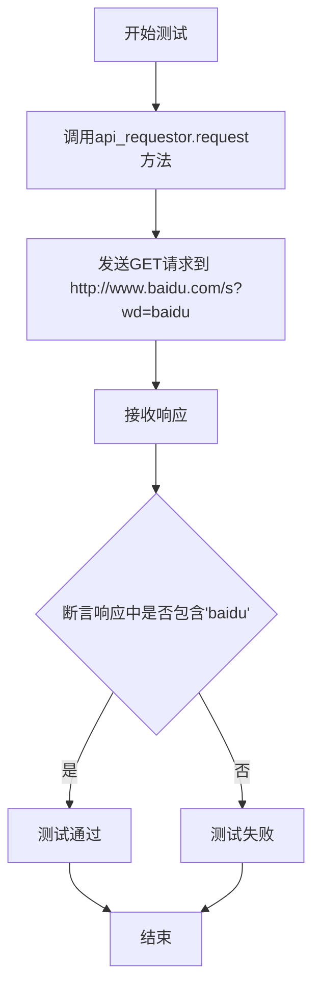
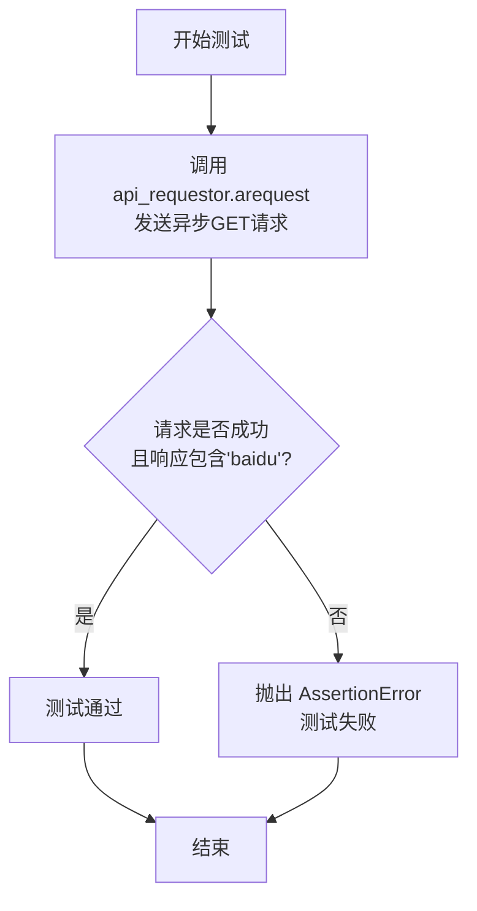
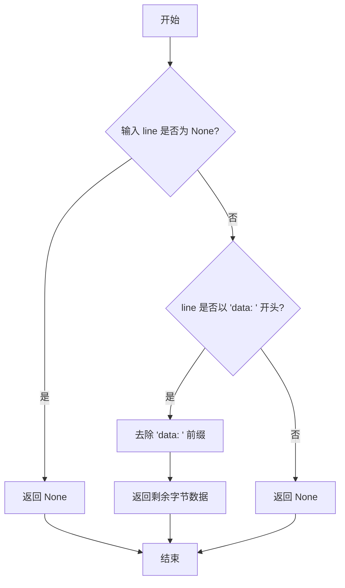
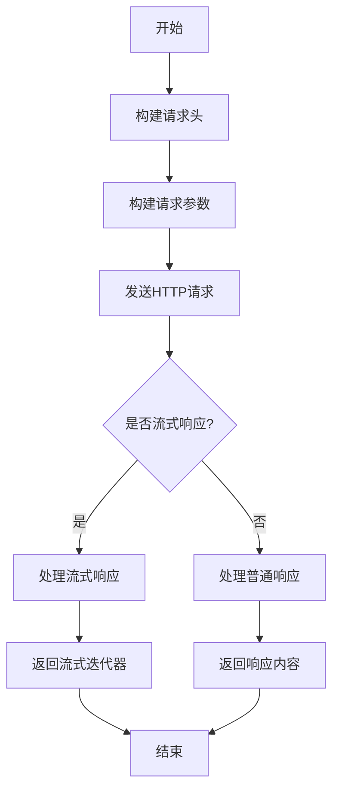
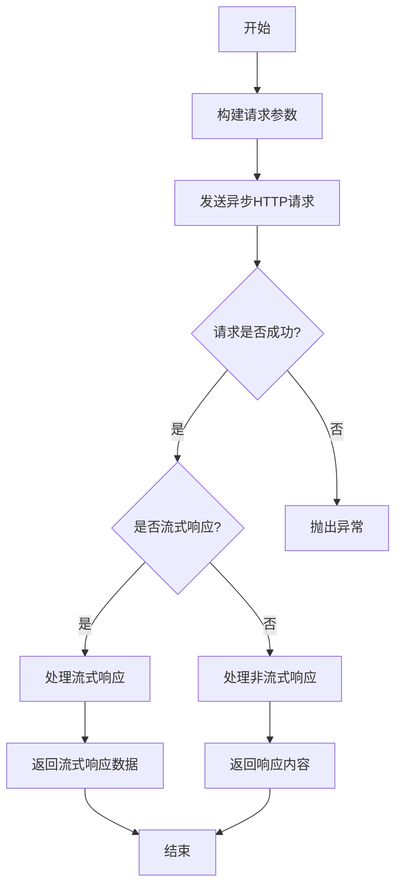

# `.\MetaGPT\tests\metagpt\provider\test_general_api_requestor.py` 详细设计文档

该文件是 GeneralAPIRequestor 类的单元测试，主要测试其同步和异步请求功能，以及用于处理流式响应数据的辅助函数 parse_stream 和 parse_stream_helper。

## 整体流程

```mermaid
graph TD
    A[开始执行测试] --> B{测试 parse_stream_helper?}
    B -- 是 --> C[测试 None 输入]
    C --> D[测试 'data: [DONE]' 输入]
    D --> E[测试 'data: test' 输入]
    E --> F[测试 'test' 输入]
    F --> G[测试 parse_stream 函数]
    G --> H{测试 api_requestor?}
    H -- 是 --> I[执行同步请求测试]
    I --> J[验证响应包含 'baidu']
    J --> K{测试 async_api_requestor?}
    K -- 是 --> L[执行异步请求测试]
    L --> M[验证响应包含 'baidu']
    M --> N[所有测试完成]
```

## 类结构

```
GeneralAPIRequestor (API请求器类)
├── request (同步请求方法)
├── arequest (异步请求方法)
parse_stream (全局函数)
parse_stream_helper (全局函数)
```

## 全局变量及字段


### `api_requestor`
    
GeneralAPIRequestor类的实例，用于发起HTTP请求，基础URL设置为'http://www.baidu.com'。

类型：`GeneralAPIRequestor`
    


    

## 全局函数及方法

### `test_parse_stream`

该函数是一个单元测试，用于验证 `parse_stream` 和 `parse_stream_helper` 函数在处理流式响应数据时的正确性。它通过一系列断言来测试不同的输入场景，确保函数能正确解析数据行并忽略非数据行或结束标记。

参数：

- 无显式参数。作为单元测试函数，它不接收外部参数，而是直接调用被测试函数并验证其行为。

返回值：`None`，该函数不返回任何值，其目的是通过断言（`assert`）来验证测试条件，若所有断言通过则测试成功，否则抛出异常。

#### 流程图

```mermaid
flowchart TD
    A[开始测试] --> B[调用 parse_stream_helper<br>输入 None]
    B --> C{断言返回 None}
    C --> D[调用 parse_stream_helper<br>输入 b'data: [DONE]']
    D --> E{断言返回 None}
    E --> F[调用 parse_stream_helper<br>输入 b'data: test']
    F --> G{断言返回 b'test'}
    G --> H[调用 parse_stream_helper<br>输入 b'test']
    H --> I{断言返回 None}
    I --> J[调用 parse_stream<br>输入 [b'data: test']]
    J --> K[迭代解析结果]
    K --> L{断言每行等于 b'test'}
    L --> M[测试结束]
```

#### 带注释源码

```python
def test_parse_stream():
    # 测试 parse_stream_helper 函数在输入为 None 时的行为，期望返回 None
    assert parse_stream_helper(None) is None
    # 测试 parse_stream_helper 函数在输入为结束标记 'data: [DONE]' 时的行为，期望返回 None
    assert parse_stream_helper(b"data: [DONE]") is None
    # 测试 parse_stream_helper 函数在输入为有效数据行 'data: test' 时的行为，期望返回数据部分 b'test'
    assert parse_stream_helper(b"data: test") == b"test"
    # 测试 parse_stream_helper 函数在输入为无效行（不以 'data: ' 开头）时的行为，期望返回 None
    assert parse_stream_helper(b"test") is None
    # 测试 parse_stream 函数处理包含单行数据的字节列表，迭代结果应等于 b'test'
    for line in parse_stream([b"data: test"]):
        assert line == b"test"
```

### `test_api_requestor`

该函数是一个同步测试函数，用于测试`GeneralAPIRequestor`类的`request`方法。它通过向百度搜索接口发送一个GET请求，并验证响应内容中是否包含“baidu”字符串，以此来测试API请求器的基本功能。

参数：

- `api_requestor`：`GeneralAPIRequestor`，一个已初始化的`GeneralAPIRequestor`实例，其基础URL设置为“http://www.baidu.com”。
- `method`：`str`，HTTP请求方法，此处为“get”。
- `url`：`str`，请求的路径，此处为“/s?wd=baidu”。

返回值：`None`，该函数是一个测试函数，不返回任何值，但通过断言来验证测试结果。

#### 流程图



#### 带注释源码

```python
def test_api_requestor():
    # 使用已初始化的api_requestor实例，调用其request方法发送一个GET请求
    # 请求的URL路径为“/s?wd=baidu”，即百度搜索“baidu”
    resp, _, _ = api_requestor.request(method="get", url="/s?wd=baidu")
    # 断言响应内容中是否包含“baidu”字符串，以验证请求是否成功并返回了预期内容
    assert b"baidu" in resp
```

### `test_async_api_requestor`

这是一个使用 `pytest` 框架编写的异步单元测试函数，用于测试 `GeneralAPIRequestor` 类的异步请求方法 `arequest` 的功能。它验证了向指定URL发送异步GET请求后，响应体中是否包含预期的关键字。

参数：

- 无显式参数。该函数是一个测试用例，由 `pytest` 运行时自动调用。

返回值：`None`，测试函数通常不显式返回值，其成功与否由 `assert` 语句决定。如果所有断言通过，则测试通过；否则，测试失败并抛出 `AssertionError`。

#### 流程图



#### 带注释源码

```python
@pytest.mark.asyncio  # 使用pytest的装饰器标记此函数为异步测试用例
async def test_async_api_requestor():
    # 调用GeneralAPIRequestor实例的异步请求方法，发送一个GET请求到"/s?wd=baidu"
    # resp: 响应体数据
    # _: 忽略的返回值（可能是响应头和/或API密钥信息，在此测试中不关心）
    resp, _, _ = await api_requestor.arequest(method="get", url="/s?wd=baidu")
    
    # 断言：检查响应体数据（resp）中是否包含字节序列 b"baidu"
    # 如果包含，测试通过；否则，测试失败。
    assert b"baidu" in resp
```

### `parse_stream`

`parse_stream` 是一个生成器函数，用于处理一个字节字符串列表（通常代表服务器发送的事件流）。它遍历列表中的每个元素，对每个元素调用 `parse_stream_helper` 函数进行解析。如果 `parse_stream_helper` 返回非 `None` 值，则通过 `yield` 将该值作为生成器的下一个元素产出。该函数主要用于从流式响应中提取有效的数据块，过滤掉无关或表示流结束的信号。

参数：

- `byte_list`：`list[bytes]`，包含服务器发送事件（Server-Sent Events, SSE）原始字节行的列表。

返回值：`Generator[bytes, None, None]`，一个生成器，每次迭代产出一个解析后的有效数据字节块。

#### 流程图

```mermaid
flowchart TD
    A[开始] --> B{遍历 byte_list 中的每个 byte_line}
    B --> C[调用 parse_stream_helper(byte_line)]
    C --> D{helper_result 是否为 None?}
    D -- 是 --> B
    D -- 否 --> E[yield helper_result]
    E --> B
    B --> F[遍历结束]
    F --> G[结束]
```

#### 带注释源码

```python
def parse_stream(byte_list: list[bytes]) -> Generator[bytes, None, None]:
    """
    解析一个字节字符串列表，通常来自服务器发送的事件流。
    对列表中的每个元素调用 `parse_stream_helper`，并产出所有非 None 的结果。

    Args:
        byte_list (list[bytes]): 包含服务器发送事件（SSE）行的字节字符串列表。

    Yields:
        bytes: 从每一行中解析出的数据块。
    """
    # 遍历输入的字节行列表
    for byte_line in byte_list:
        # 调用辅助函数解析当前行
        helper_result = parse_stream_helper(byte_line)
        # 如果辅助函数返回了有效数据（非None），则将其产出
        if helper_result is not None:
            yield helper_result
```

### `parse_stream_helper`

`parse_stream_helper` 是一个辅助函数，用于解析流式响应中的单行数据。它检查传入的字节数据是否以 `"data: "` 开头，如果是，则返回去除前缀后的数据；否则返回 `None`。该函数主要用于处理服务器端事件（Server-Sent Events, SSE）格式的流数据。

参数：

- `line`：`bytes`，表示从流中读取的一行字节数据。

返回值：`bytes | None`，如果行数据以 `"data: "` 开头，则返回去除前缀后的字节数据；否则返回 `None`。

#### 流程图



#### 带注释源码

```python
def parse_stream_helper(line: bytes) -> bytes | None:
    """
    解析流式响应中的单行数据。

    如果行以 'data: ' 开头，则返回去除前缀后的数据；否则返回 None。
    用于处理服务器端事件（SSE）格式的流数据。

    Args:
        line (bytes): 从流中读取的一行字节数据。

    Returns:
        bytes | None: 如果行数据以 'data: ' 开头，则返回去除前缀后的字节数据；否则返回 None。
    """
    if line is None:
        # 如果输入为 None，直接返回 None
        return None
    if line.startswith(b"data: "):
        # 如果行以 'data: ' 开头，去除前缀并返回剩余数据
        return line[len(b"data: "):]
    # 否则返回 None
    return None
```

### `GeneralAPIRequestor.request`

该方法用于执行同步HTTP请求，处理请求参数、发送请求、解析响应，并返回响应内容、会话对象和API密钥。

参数：

- `method`：`str`，HTTP请求方法，如"get"、"post"等
- `url`：`str`，请求的URL路径
- `params`：`Optional[Dict[str, Any]]`，可选，URL查询参数
- `headers`：`Optional[Dict[str, str]]`，可选，请求头信息
- `request_timeout`：`Optional[Union[float, Tuple[float, float]]]`，可选，请求超时时间
- `stream`：`bool`，可选，是否启用流式响应，默认为False
- `files`：`Optional[Dict[str, Any]]`，可选，上传的文件
- `request_id`：`Optional[str]`，可选，请求ID，用于标识请求
- `data`：`Optional[Any]`，可选，请求体数据

返回值：`Tuple[Union[str, bytes, Iterator[Any]], requests.Session, Optional[str]]`，返回一个元组，包含响应内容（字符串、字节或迭代器）、会话对象和API密钥

#### 流程图



#### 带注释源码

```python
def request(
    self,
    method: str,
    url: str,
    params: Optional[Dict[str, Any]] = None,
    headers: Optional[Dict[str, str]] = None,
    request_timeout: Optional[Union[float, Tuple[float, float]]] = None,
    stream: bool = False,
    files: Optional[Dict[str, Any]] = None,
    request_id: Optional[str] = None,
    data: Optional[Any] = None,
) -> Tuple[Union[str, bytes, Iterator[Any]], requests.Session, Optional[str]]:
    """
    执行同步HTTP请求
    
    Args:
        method: HTTP方法
        url: 请求URL
        params: URL参数
        headers: 请求头
        request_timeout: 请求超时时间
        stream: 是否流式响应
        files: 上传文件
        request_id: 请求ID
        data: 请求体数据
        
    Returns:
        响应内容、会话对象和API密钥的元组
    """
    # 构建请求头
    headers = self._build_headers(headers, request_id)
    
    # 构建请求参数
    data = self._build_request_data(data)
    
    # 发送请求
    resp = self.session.request(
        method,
        url,
        headers=headers,
        params=params,
        data=data,
        files=files,
        stream=stream,
        timeout=request_timeout,
    )
    
    # 处理响应
    if stream:
        # 流式响应处理
        return self._handle_stream_response(resp), self.session, self.api_key
    else:
        # 普通响应处理
        return self._handle_response(resp), self.session, self.api_key
```

### `GeneralAPIRequestor.arequest`

`GeneralAPIRequestor.arequest` 是 `GeneralAPIRequestor` 类的异步请求方法，用于向指定的 API 端点发送异步 HTTP 请求。它封装了请求的构建、发送、响应处理和错误处理逻辑，支持流式响应和非流式响应，并返回响应内容、字节流和最终的响应对象。

参数：

- `method`：`str`，HTTP 请求方法，如 "get"、"post"、"put"、"delete" 等。
- `url`：`str`，请求的 URL 路径，相对于 `base_url`。
- `params`：`Optional[Mapping[str, Any]]`，默认为 `None`，URL 查询参数。
- `headers`：`Optional[Mapping[str, str]]`，默认为 `None`，请求头。
- `data`：`Optional[Any]`，默认为 `None`，请求体数据。
- `input_body`：`Optional[Any]`，默认为 `None`，用于构建请求体的输入数据。
- `files`：`Optional[Any]`，默认为 `None`，上传的文件。
- `request_id`：`Optional[str]`，默认为 `None`，请求的唯一标识符。
- `request_timeout`：`Optional[Union[float, Tuple[float, float]]]`，默认为 `None`，请求超时时间。
- `stream`：`bool`，默认为 `False`，是否启用流式响应。
- `parse_stream`：`Optional[Callable[[Any], Any]]`，默认为 `None`，用于解析流式响应的回调函数。
- `kwargs`：`Any`，其他关键字参数，用于扩展请求配置。

返回值：`Tuple[Union[str, List, bytes, Iterator[Any]], Union[bytes, Iterator[Any]], httpx.Response]`，返回一个三元组，包含响应内容（或流式响应的迭代器）、字节流（或流式响应的迭代器）和最终的 `httpx.Response` 对象。

#### 流程图



#### 带注释源码

```python
async def arequest(
    self,
    method: str,
    url: str,
    params: Optional[Mapping[str, Any]] = None,
    headers: Optional[Mapping[str, str]] = None,
    data: Optional[Any] = None,
    input_body: Optional[Any] = None,
    files: Optional[Any] = None,
    request_id: Optional[str] = None,
    request_timeout: Optional[Union[float, Tuple[float, float]]] = None,
    stream: bool = False,
    parse_stream: Optional[Callable[[Any], Any]] = None,
    **kwargs: Any,
) -> Tuple[Union[str, List, bytes, Iterator[Any]], Union[bytes, Iterator[Any]], httpx.Response]:
    """
    发送异步HTTP请求。

    参数:
        method: HTTP方法，如'get'、'post'等。
        url: 请求的URL路径。
        params: URL查询参数。
        headers: 请求头。
        data: 请求体数据。
        input_body: 用于构建请求体的输入数据。
        files: 上传的文件。
        request_id: 请求的唯一标识符。
        request_timeout: 请求超时时间。
        stream: 是否启用流式响应。
        parse_stream: 解析流式响应的回调函数。
        **kwargs: 其他关键字参数。

    返回:
        三元组，包含响应内容、字节流和最终的响应对象。
    """
    # 构建请求参数
    request_params = self._build_request_params(
        method=method,
        url=url,
        params=params,
        headers=headers,
        data=data,
        input_body=input_body,
        files=files,
        request_id=request_id,
        request_timeout=request_timeout,
        stream=stream,
        **kwargs,
    )

    # 发送异步HTTP请求
    response = await self._client.arequest(**request_params)

    # 检查响应状态码
    if response.status_code != 200:
        raise self._handle_error_response(response)

    # 处理流式响应
    if stream:
        return self._handle_stream_response(response, parse_stream)

    # 处理非流式响应
    content, byte_stream = self._handle_non_stream_response(response)
    return content, byte_stream, response
```

## 关键组件


### GeneralAPIRequestor

一个通用的API请求器，用于同步和异步地发送HTTP请求，并处理响应。

### parse_stream

一个用于解析流式响应数据的函数，特别处理以"data: "开头的SSE（Server-Sent Events）格式数据。

### parse_stream_helper

parse_stream函数的辅助函数，负责解析单行流数据，提取有效数据内容或标识流结束。


## 问题及建议


### 已知问题

-   **测试用例依赖外部网络服务**：`test_api_requestor` 和 `test_async_api_requestor` 测试用例直接对 `http://www.baidu.com` 发起真实网络请求。这导致测试结果受网络连通性和外部服务状态影响，不符合单元测试的隔离性原则，可能导致测试不稳定、执行缓慢，并且在无网络环境下测试会失败。
-   **测试用例断言过于宽泛**：测试用例仅断言响应体中包含 `b"baidu"` 字节串。这种断言过于脆弱，无法有效验证 `GeneralAPIRequestor` 类的核心功能（如请求构造、响应处理、错误处理等），且容易因百度搜索页面内容变化而导致测试失败。
-   **缺少对关键功能的单元测试**：测试文件主要测试了 `parse_stream` 辅助函数和 `GeneralAPIRequestor` 的基本网络连通性，但缺少对 `GeneralAPIRequestor` 类核心方法（如 `_make_session`, `_interpret_response` 等）的独立单元测试，也缺少对各种异常场景（如网络错误、HTTP错误状态码、超时等）的测试覆盖。
-   **测试数据硬编码**：测试中使用的 `base_url` 和查询参数 (`/s?wd=baidu`) 是硬编码的，降低了测试的灵活性和可维护性。

### 优化建议

-   **使用 Mock 对象隔离外部依赖**：重构 `test_api_requestor` 和 `test_async_api_requestor`，使用 `unittest.mock` 或 `pytest-mock` 来模拟 `requests.Session` 和 `aiohttp.ClientSession` 的请求行为。这样可以模拟各种响应（成功、错误、超时）和返回数据，使测试快速、稳定且不依赖外部环境。
-   **增强测试断言**：针对 `GeneralAPIRequestor` 的功能，设计更精确的测试断言。例如，验证请求的URL、方法、头部是否正确构建；验证对不同HTTP状态码（如200, 404, 500）的响应处理逻辑；验证返回的响应对象、流数据或错误信息是否符合预期。
-   **补充单元测试用例**：
    -   为 `parse_stream` 和 `parse_stream_helper` 函数增加更多边界情况和错误输入的测试。
    -   为 `GeneralAPIRequestor` 的 `request` 和 `arequest` 方法编写独立的单元测试，覆盖正常流程、各种异常处理（连接错误、超时、JSON解析错误等）、重试逻辑（如果存在）以及流式响应处理。
    -   测试 `_make_session` 方法是否正确配置了会话参数（如超时、代理、认证等）。
-   **参数化测试数据**：使用 `@pytest.mark.parametrize` 装饰器对测试用例进行参数化，将测试数据（如不同的URL、方法、请求参数、模拟响应）与测试逻辑分离，提高测试代码的清晰度和可维护性。
-   **考虑使用测试夹具 (Fixture)**：对于需要共享的测试设置（如创建 `GeneralAPIRequestor` 实例、模拟会话），可以定义 `pytest` 夹具，以减少代码重复并使测试更模块化。


## 其它


### 设计目标与约束

该代码模块的核心设计目标是提供一个通用的、可重用的HTTP API请求器（`GeneralAPIRequestor`），用于同步和异步地发送HTTP请求。它旨在封装底层的网络通信细节，提供统一的请求接口和响应处理流程。主要约束包括：需要支持标准的HTTP方法（如GET、POST）、能够处理流式响应（如Server-Sent Events）、保持代码的简洁性和可测试性，以及作为底层工具，不涉及具体的业务逻辑。

### 错误处理与异常设计

当前代码片段（单元测试）未展示`GeneralAPIRequestor`类完整的错误处理机制。通常，此类组件应包含以下设计：
1.  **网络异常处理**：应能捕获并处理如连接超时、连接错误、DNS解析失败等网络层异常，可能将其封装为自定义异常（如`APIRequestError`）向上抛出。
2.  **HTTP错误状态码处理**：对于非2xx的HTTP响应状态码（如404、500），应进行统一处理，例如通过检查响应状态码并抛出包含状态码和错误信息的异常。
3.  **流解析错误处理**：`parse_stream`和`parse_stream_helper`函数在解析非标准或损坏的流数据时应具备鲁棒性，例如忽略无法解析的行或记录警告，而不是导致整个流程崩溃。
4.  **测试中的断言**：单元测试使用`assert`语句验证功能正确性，并利用`pytest`框架组织测试用例和异步测试。

### 数据流与状态机

1.  **请求发起数据流**：
    *   调用者通过`request`或`arequest`方法发起请求，传入方法、URL等参数。
    *   `GeneralAPIRequestor`内部构建完整的请求URL（拼接`base_url`），设置请求头、超时等参数。
    *   使用HTTP客户端（如`requests`或`aiohttp`）发送请求。
    *   接收原始响应（状态码、头部、字节流内容）。
2.  **流式响应处理数据流**：
    *   当处理流式响应时，响应体可能通过`parse_stream`函数处理。
    *   `parse_stream`接收一个字节流迭代器，对其中每一行调用`parse_stream_helper`。
    *   `parse_stream_helper`解析单行数据，识别并提取`data: `前缀后的有效数据，忽略`[DONE]`标记或无效行。
    *   解析出的有效数据块通过生成器（`yield`）逐个返回给调用者。
3.  **状态机**：该模块本身不维护复杂的业务状态机。其“状态”主要体现在HTTP请求的生命周期中（如初始化、发送中、已完成、错误），但这些状态通常由底层的HTTP客户端库管理。

### 外部依赖与接口契约

1.  **外部依赖库**：
    *   `pytest`：用于编写和运行单元测试，特别是支持异步测试（`@pytest.mark.asyncio`）。
    *   `requests` 和/或 `aiohttp`：虽然测试代码未直接导入，但`GeneralAPIRequestor`的实现很可能依赖于这些库来执行同步和异步HTTP请求。测试中使用了`base_url="http://www.baidu.com"`，表明其依赖外部网络服务进行集成测试。
2.  **接口契约（对调用者）**：
    *   `GeneralAPIRequestor`类：提供`request`（同步）和`arequest`（异步）方法。调用者需提供HTTP方法和相对URL。返回一个元组，通常包含响应内容、响应对象和可能的错误信息。
    *   `parse_stream`函数：接受一个字节流迭代器作为输入，返回一个生成器，产出解析后的数据块（字节）。
    *   `parse_stream_helper`函数：内部工具函数，接受单行字节数据，返回解析出的有效数据或`None`。
3.  **接口契约（对被测代码）**：单元测试假设`GeneralAPIRequestor`和流解析函数的行为符合上述描述。例如，测试验证了`parse_stream_helper`对特定输入的正确输出，以及`request/arequest`方法能成功向百度发送请求并收到包含“baidu”的响应。

### 安全考虑

1.  **敏感信息暴露**：在实际使用中，`GeneralAPIRequestor`可能用于请求需要认证的API（如携带API Key）。代码实现应确保不会在日志、错误信息或异常中泄露敏感信息（如密钥、令牌）。
2.  **输入验证**：应对传入的`url`参数进行基本的验证或净化，防止构造恶意URL导致的服务端安全风险（尽管主要风险在服务端）。在拼接`base_url`和相对URL时应注意处理边界情况，避免URL注入或解析错误。
3.  **SSL/TLS验证**：在生产环境中发起HTTPS请求时，应正确配置SSL/TLS证书验证，以防止中间人攻击。测试中使用的HTTP连接不涉及此问题。
4.  **测试环境隔离**：单元测试直接访问外部生产环境（百度），虽然简单，但在更严格的测试体系中，应考虑使用模拟（Mock）或测试专用桩（Stub）来隔离外部依赖，使测试更稳定、快速且不依赖网络。

### 性能考量

1.  **连接复用**：对于高频请求，`GeneralAPIRequestor`的实现应考虑利用HTTP连接池（如`requests.Session`或`aiohttp.ClientSession`）来复用TCP连接，减少建立连接的开销。
2.  **异步并发**：`arequest`方法支持异步操作，允许在异步框架中并发发送多个请求而不阻塞事件循环，这对于提高I/O密集型应用的吞吐量至关重要。
3.  **流式处理内存效率**：`parse_stream`函数以生成器方式工作，支持处理大型或无限的数据流而无需一次性将整个响应体加载到内存中，这对处理服务器推送事件（SSE）或大型文件下载非常有效。
4.  **测试性能**：直接对外部网络服务的测试用例执行时间受网络延迟影响，且可能因服务不可用而失败。在性能测试或需要快速反馈的CI/CD流水线中，这可能是需要优化的点。

    