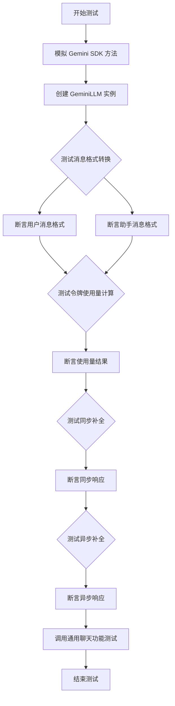
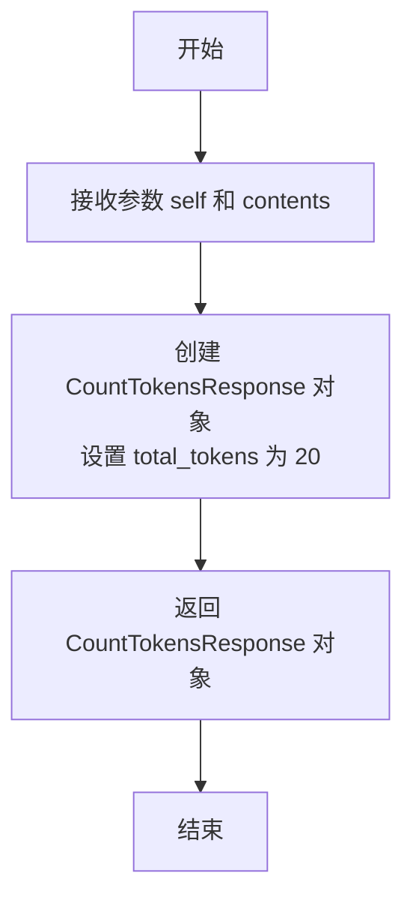
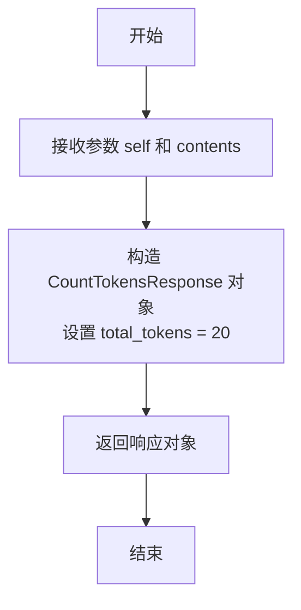
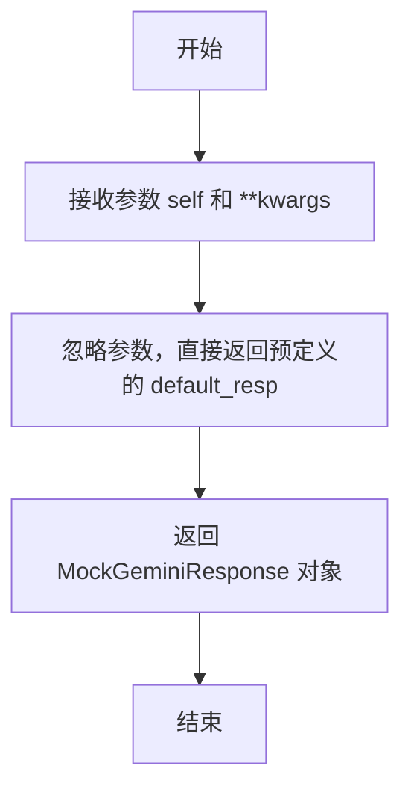
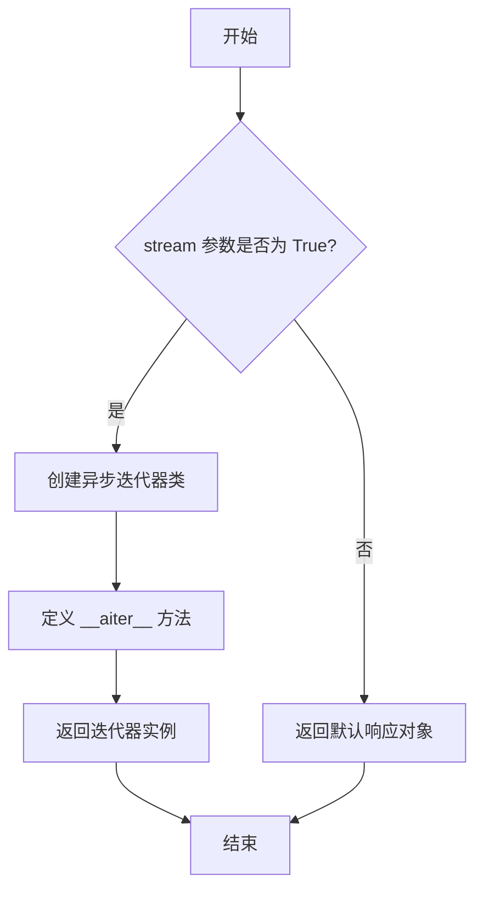
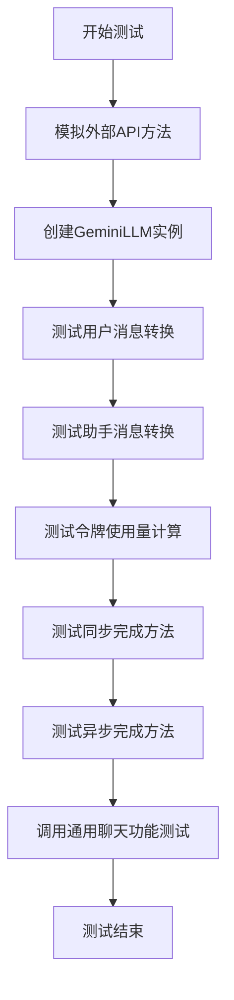

# `.\MetaGPT\tests\metagpt\provider\test_google_gemini_api.py` 详细设计文档

该文件是 Google Gemini API 的单元测试，核心功能是通过模拟（Mock）Google Generative AI SDK 的关键方法，测试 GeminiLLM 类的各种功能，包括同步/异步补全、消息格式转换、令牌使用量计算以及通用聊天功能，确保 GeminiLLM 在隔离外部依赖的情况下能按预期工作。

## 整体流程



## 类结构

```
MockGeminiResponse (模拟响应类)
├── text: str
GeminiLLM (被测试类，来自外部模块)
├── _user_msg
├── _assistant_msg
├── get_usage
├── completion
└── acompletion
```

## 全局变量及字段


### `resp_cont`
    
用于测试的响应内容字符串，通过格式化模板生成，模拟Gemini API的返回文本。

类型：`str`
    


### `default_resp`
    
默认的模拟响应对象，包含固定的响应文本，用于测试中模拟Gemini API的返回结果。

类型：`MockGeminiResponse`
    


### `MockGeminiResponse.text`
    
MockGeminiResponse类的字段，存储模拟的Gemini API响应文本内容。

类型：`str`
    
    

## 全局函数及方法

### `mock_gemini_count_tokens`

该函数是一个用于单元测试的模拟函数，用于模拟 Google Gemini API 的 `count_tokens` 方法。它接收一个内容参数，并返回一个固定的令牌计数响应，以简化测试过程，避免实际调用外部 API。

参数：

- `self`：`Any`，模拟方法的实例对象（通常为类实例）。
- `contents`：`content_types.ContentsType`，需要计算令牌数的内容数据。

返回值：`glm.CountTokensResponse`，返回一个包含固定令牌数（20）的 `CountTokensResponse` 对象。

#### 流程图



#### 带注释源码

```python
def mock_gemini_count_tokens(self, contents: content_types.ContentsType) -> glm.CountTokensResponse:
    # 模拟 Gemini API 的 count_tokens 方法，返回固定的令牌计数
    # 参数:
    #   self: 模拟方法的实例对象
    #   contents: 需要计算令牌数的内容
    # 返回值:
    #   glm.CountTokensResponse: 包含固定令牌数（20）的响应对象
    return glm.CountTokensResponse(total_tokens=20)
```

### `mock_gemini_count_tokens_async`

这是一个用于单元测试的模拟异步函数，它模拟了Google Gemini API的异步`count_tokens_async`方法。该函数接收一个内容参数，并始终返回一个固定的令牌计数（20个令牌），用于在测试环境中替代真实的API调用，以避免网络请求和依赖。

参数：

- `self`：`Any`，模拟方法的实例参数，在模拟函数中通常不使用。
- `contents`：`content_types.ContentsType`，需要计算令牌数的内容，其具体类型由`google.generativeai.types.content_types`定义。

返回值：`glm.CountTokensResponse`，返回一个`google.ai.generativelanguage`库中定义的`CountTokensResponse`对象，其中`total_tokens`字段被硬编码为20。

#### 流程图



#### 带注释源码

```python
async def mock_gemini_count_tokens_async(self, contents: content_types.ContentsType) -> glm.CountTokensResponse:
    # 此函数是 `GeminiGenerativeModel.count_tokens_async` 方法的模拟实现。
    # 它忽略传入的 `contents` 参数，始终返回一个总令牌数为20的响应对象。
    # 这用于在单元测试中隔离对真实Google Gemini API的依赖。
    return glm.CountTokensResponse(total_tokens=20)
```

### `mock_gemini_generate_content`

这是一个用于模拟Google Gemini API `generate_content` 方法的函数。它被设计用于单元测试中，以替代真实的API调用，返回一个预定义的模拟响应，从而避免在测试过程中产生网络请求和依赖外部服务。

参数：

- `self`：`Any`，表示调用该方法的对象实例（在模拟中通常为`GenerativeModel`实例）。
- `**kwargs`：`dict`，表示可变关键字参数，用于接收`generate_content`方法可能传入的各种参数（如`contents`、`generation_config`等），但在本模拟函数中未使用。

返回值：`MockGeminiResponse`，返回一个预定义的模拟响应对象，其`text`字段包含固定的响应内容。

#### 流程图



#### 带注释源码

```python
def mock_gemini_generate_content(self, **kwargs) -> MockGeminiResponse:
    # 该函数模拟 Gemini API 的 generate_content 方法。
    # 它忽略所有传入的参数（self 和 **kwargs），
    # 直接返回一个预定义的默认响应对象 default_resp。
    # 这样可以在单元测试中避免真实的 API 调用。
    return default_resp
```

### `mock_gemini_generate_content_async`

这是一个用于模拟 Google Gemini API 异步生成内容功能的函数。它主要用于单元测试，以模拟 `google.generativeai.generative_models.GenerativeModel.generate_content_async` 方法的行为。根据传入的 `stream` 参数，它返回一个同步的模拟响应对象或一个异步迭代器。

参数：

- `self`：`Any`，模拟方法的实例对象（通常为类实例）。
- `stream`：`bool`，默认为 `False`，指示是否以流式方式返回响应。
- `**kwargs`：`Any`，其他关键字参数，用于模拟原方法的灵活性。

返回值：`Union[MockGeminiResponse, AsyncIterator[MockGeminiResponse]]`，如果 `stream=False`，返回一个 `MockGeminiResponse` 对象；如果 `stream=True`，返回一个异步迭代器，每次迭代产生一个 `MockGeminiResponse` 对象。

#### 流程图



#### 带注释源码

```python
async def mock_gemini_generate_content_async(self, stream: bool = False, **kwargs) -> MockGeminiResponse:
    # 检查是否启用流式响应
    if stream:
        # 定义一个内部类，用于模拟异步迭代器
        class Iterator(object):
            # 异步迭代器必须实现 __aiter__ 方法
            async def __aiter__(self):
                # 使用 yield 返回一个模拟响应对象
                yield default_resp

        # 返回迭代器实例，模拟流式响应
        return Iterator()
    else:
        # 非流式模式下，直接返回默认的模拟响应对象
        return default_resp
```

### `test_gemini_acompletion`

该函数是一个异步单元测试，用于验证`GeminiLLM`类的异步完成功能。它通过模拟Google Gemini API的响应，测试`GeminiLLM`实例的`acompletion`方法是否能正确处理消息并返回预期的响应。

参数：

- `mocker`：`pytest_mock.plugin.MockerFixture`，pytest-mock插件提供的模拟对象，用于在测试中替换（mock）外部依赖。

返回值：`None`，该函数是一个测试函数，不返回任何值，但包含多个断言来验证测试结果。

#### 流程图



#### 带注释源码

```python
@pytest.mark.asyncio  # 标记此函数为异步测试函数
async def test_gemini_acompletion(mocker):
    # 模拟GeminiGenerativeModel的count_tokens方法，使其返回固定的令牌数
    mocker.patch("metagpt.provider.google_gemini_api.GeminiGenerativeModel.count_tokens", mock_gemini_count_tokens)
    # 模拟GeminiGenerativeModel的异步count_tokens_async方法
    mocker.patch(
        "metagpt.provider.google_gemini_api.GeminiGenerativeModel.count_tokens_async", mock_gemini_count_tokens_async
    )
    # 模拟GenerativeModel的generate_content方法，返回预定义的响应
    mocker.patch("google.generativeai.generative_models.GenerativeModel.generate_content", mock_gemini_generate_content)
    # 模拟GenerativeModel的异步generate_content_async方法
    mocker.patch(
        "google.generativeai.generative_models.GenerativeModel.generate_content_async",
        mock_gemini_generate_content_async,
    )

    # 使用模拟的LLM配置创建GeminiLLM实例
    gemini_llm = GeminiLLM(mock_llm_config)

    # 断言用户消息转换功能正确
    assert gemini_llm._user_msg(prompt) == {"role": "user", "parts": [prompt]}
    # 断言助手消息转换功能正确
    assert gemini_llm._assistant_msg(prompt) == {"role": "model", "parts": [prompt]}

    # 测试并断言令牌使用量计算功能正确
    usage = gemini_llm.get_usage(gemini_messages, resp_cont)
    assert usage == {"prompt_tokens": 20, "completion_tokens": 20}

    # 测试同步完成方法，断言返回预定义的响应
    resp = gemini_llm.completion(gemini_messages)
    assert resp == default_resp

    # 测试异步完成方法，断言返回的文本与预定义响应一致
    resp = await gemini_llm.acompletion(gemini_messages)
    assert resp.text == default_resp.text

    # 调用通用的LLM聊天功能测试，进一步验证GeminiLLM的功能
    await llm_general_chat_funcs_test(gemini_llm, prompt, gemini_messages, resp_cont)
```

## 关键组件


### GeminiLLM 类

Google Gemini API 的封装类，提供了与Gemini大语言模型进行同步和异步交互的核心功能，包括消息格式化、令牌计数和内容生成。

### MockGeminiResponse 类

一个用于模拟Google Gemini API响应的数据类，主要用于单元测试，以隔离对真实API的依赖。

### 消息格式化方法 (`_user_msg`, `_assistant_msg`)

负责将原始提示文本转换为符合Google Gemini API要求的消息格式字典，区分用户消息和模型助手消息的角色。

### 令牌计数功能 (`get_usage`)

通过调用Gemini API的`count_tokens`方法，计算给定消息列表和模型响应所消耗的提示令牌和完成令牌数量，用于监控使用量和成本。

### 内容生成功能 (`completion`, `acompletion`)

核心的模型调用方法，`completion`提供同步接口，`acompletion`提供异步接口，用于向Gemini模型发送消息并获取生成的文本响应，支持流式和非流式输出。

### 单元测试模拟函数 (`mock_gemini_count_tokens`, `mock_gemini_generate_content` 等)

一系列用于`pytest`单元测试的模拟函数，它们替换了真实的Google Gemini API客户端方法，返回预定义的响应，确保测试的可靠性和速度，不依赖外部网络和服务。


## 问题及建议


### 已知问题

-   **测试用例对实现细节依赖过强**：测试代码通过 `mocker.patch` 直接替换了 `google.generativeai.generative_models.GenerativeModel` 和 `metagpt.provider.google_gemini_api.GeminiGenerativeModel` 的内部方法。这种“猴子补丁”方式使得测试与GeminiLLM类的具体实现（如使用的内部类名）紧密耦合。如果未来GeminiLLM的实现方式改变（例如，更换了底层调用的类或方法名），这些测试用例将全部失效，需要同步修改，增加了维护成本。
-   **模拟响应对象定义不完整**：`MockGeminiResponse` 类仅包含一个 `text` 字段，用于模拟同步调用的返回。然而，Google Gemini API 的实际响应对象（如 `glm.GenerateContentResponse`）结构要复杂得多，可能包含 `candidates`、`usage_metadata` 等字段。当前的模拟对象过于简化，可能导致测试无法覆盖真实响应结构处理逻辑（如果 `GeminiLLM` 中有相关处理的话），或者在未来 `GeminiLLM` 增强功能（如解析响应中的其他元数据）时，测试无法提供有效的模拟数据。
-   **异步流式响应模拟过于简化**：在 `mock_gemini_generate_content_async` 函数中，当 `stream=True` 时，返回了一个自定义的异步迭代器。这个迭代器仅 `yield` 了一次 `default_resp`。真实的流式响应应该是一个包含多个部分（chunks）的序列。当前的模拟无法测试 `GeminiLLM` 处理多块流式数据、组装最终结果或处理流结束的正确性。
-   **缺少对异常和边缘情况的测试**：测试用例主要覆盖了正常路径（happy path）。没有模拟API调用可能发生的异常（如网络错误、认证失败、速率限制、内容安全策略违规等），也没有测试 `GeminiLLM` 类对这些异常的处理和封装（例如，是否将SDK异常转换为统一的内部异常）。同时，缺少对空消息列表、超长消息等边界条件的测试。

### 优化建议

-   **重构测试以减少实现耦合**：建议将测试的焦点从“替换内部方法”转移到“测试公共接口”。可以创建一个更高级的模拟，例如使用 `unittest.mock.MagicMock` 或 `pytest-mock` 的 `mocker.patch.object` 来替换 `GeminiLLM` 实例中某个被注入的客户端对象（如果设计允许依赖注入），或者使用 `responses` 或 `httpx` 等库在HTTP层进行模拟。这样，测试将针对 `GeminiLLM` 的 `completion` 和 `acompletion` 等公共方法的行为进行验证，而不关心其内部具体调用了哪个第三方类的哪个方法。
-   **完善模拟响应对象**：根据 `google.generativeai` SDK 的实际响应类型（如 `glm.GenerateContentResponse`），定义一个更完整的 `MockGeminiResponse` 数据类或使用 `unittest.mock.Mock` 来模拟，确保其具有与实际响应对象相同或至少被测试代码依赖的字段和属性（例如，除了 `text`，可能还需要 `candidates[0].content.parts[0].text` 或 `usage_metadata`）。这能使测试更贴近真实场景。
-   **增强流式响应模拟**：修改 `mock_gemini_generate_content_async` 中流式响应的模拟逻辑，使其能够返回一个包含多个模拟“块”（每个块可以是 `MockGeminiResponse` 的子集或特定结构）的异步迭代器。这样可以测试 `GeminiLLM.acompletion` 在流式模式下的数据累积和处理逻辑。
-   **补充异常和边界测试**：增加新的测试函数或参数化现有测试，以覆盖以下场景：
    -   **异常处理**：模拟底层 `generate_content` 调用抛出各种异常（如 `google.api_core.exceptions.GoogleAPIError` 的子类），断言 `GeminiLLM` 是否抛出了预期的自定义异常或进行了适当的错误日志记录。
    -   **边界条件**：测试传入空列表 `[]` 作为消息、包含极长字符串的消息、角色字段异常的消息等，验证 `GeminiLLM` 的鲁棒性。
    -   **配置测试**：测试不同的 `mock_llm_config` 配置（如不同的模型名称、参数）是否被正确传递到底层API调用中。
-   **考虑使用官方测试工具或Fixture**：如果 `google.generativeai` 库提供了测试工具（如内存传输适配器）或推荐的最佳测试实践，应优先采用，以获得更可靠和持久的测试效果。


## 其它


### 设计目标与约束

本代码模块的核心设计目标是提供一个针对 `GeminiLLM` 类的单元测试套件，用于验证其与 Google Gemini API 交互的核心功能（如消息格式化、令牌计数、同步/异步文本生成）的正确性。主要约束包括：1) 测试环境必须隔离，不能依赖真实的 Google Gemini API 服务，以避免网络依赖、成本消耗和测试结果的不确定性；2) 测试需要覆盖同步 (`completion`) 和异步 (`acompletion`) 两种调用模式；3) 测试需要模拟 API 的流式 (`stream`) 和非流式响应。

### 错误处理与异常设计

当前测试代码主要关注正常路径（Happy Path）的验证，未显式包含对 `GeminiLLM` 类或其底层依赖可能抛出的异常（如网络错误、认证失败、无效请求参数、API配额超限等）的测试用例。测试通过 `mocker.patch` 完全控制了外部依赖的行为，确保了测试的稳定性和可重复性，但这也意味着异常处理逻辑未被覆盖。一个更完备的测试套件应包含针对这些异常场景的测试，验证 `GeminiLLM` 是否按预期抛出或处理异常。

### 数据流与状态机

本测试模块的数据流是线性的、无状态的。流程始于测试函数 `test_gemini_acompletion` 的调用。首先，通过 `mocker.patch` 将 `GeminiLLM` 所依赖的四个外部方法（`count_tokens`, `count_tokens_async`, `generate_content`, `generate_content_async`）替换为本地定义的模拟函数 (`mock_gemini_*`)。这些模拟函数返回预定义的、固定的响应数据（如 `default_resp`）。然后，测试代码实例化 `GeminiLLM` 并依次调用其方法（`_user_msg`, `_assistant_msg`, `get_usage`, `completion`, `acompletion`），将实际输出与预期值进行断言比较。整个过程中，`GeminiLLM` 实例本身不维护跨方法调用的内部状态，其行为完全由输入参数和已被模拟的外部依赖决定。

### 外部依赖与接口契约

本测试代码模拟了以下关键外部依赖及其接口契约：
1.  **`google.generativeai.generative_models.GenerativeModel` 类**：这是 Google Gemini SDK 的核心类。测试模拟了它的 `generate_content` 和 `generate_content_async` 方法，契约是接收请求参数并返回一个包含生成文本的响应对象（或异步迭代器）。模拟函数 `mock_gemini_generate_content` 和 `mock_gemini_generate_content_async` 实现了此契约，始终返回 `MockGeminiResponse` 实例。
2.  **`metagpt.provider.google_gemini_api.GeminiGenerativeModel` (推测为 `GenerativeModel` 的别名或包装)**：测试模拟了它的 `count_tokens` 和 `count_tokens_async` 方法，契约是接收内容并返回一个包含总令牌数的 `glm.CountTokensResponse` 对象。模拟函数 `mock_gemini_count_tokens` 和 `mock_gemini_count_tokens_async` 实现了此契约，始终返回总令牌数为20的响应。
3.  **`MockGeminiResponse` 类**：这是一个本地定义的、简化的数据类，用于模拟真实的 Gemini API 响应对象。其契约是提供一个 `text` 属性来存放生成的文本内容。它作为模拟函数与 `GeminiLLM` 代码之间的接口。
4.  **`llm_general_chat_funcs_test` 函数**：这是一个来自测试工具集的共享测试函数。其契约是接收一个 LLM 实例、提示词、消息列表和预期响应内容，并执行一系列通用的聊天功能测试（如 `achat`, `ask` 等）。测试代码通过调用此函数来复用测试逻辑。

### 测试策略与覆盖范围

本测试采用了 **Mocking/Stubbing** 策略，使用 `pytest-mock` (通过 `mocker` fixture) 来隔离被测单元 (`GeminiLLM`) 与外部服务。覆盖范围包括：
*   **单元级测试**：聚焦于 `GeminiLLM` 类本身的方法。
*   **功能点覆盖**：
    *   消息格式转换 (`_user_msg`, `_assistant_msg`)。
    *   使用量计算 (`get_usage`)。
    *   同步文本生成 (`completion`)。
    *   异步文本生成 (`acompletion`)。
    *   通过共享测试函数验证更高级的聊天接口。
*   **路径覆盖**：在异步生成中，通过 `stream` 参数区分了流式和非流式响应路径，并进行了模拟测试。
*   **未覆盖区域**：如前所述，异常处理路径、不同输入参数（如空消息、超长消息）下的边界情况、以及 `GeminiLLM` 的配置初始化过程等未在本测试中体现。

    