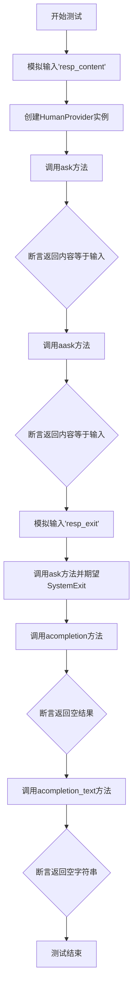
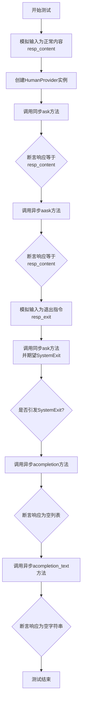
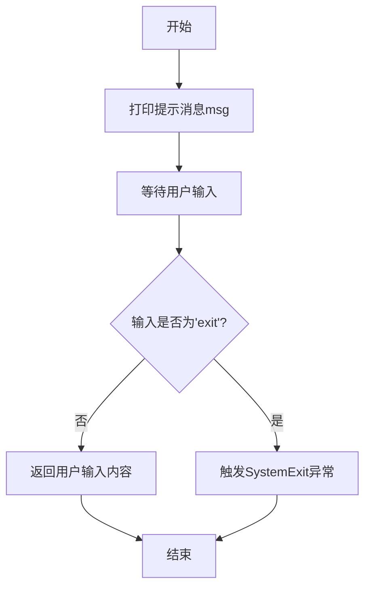
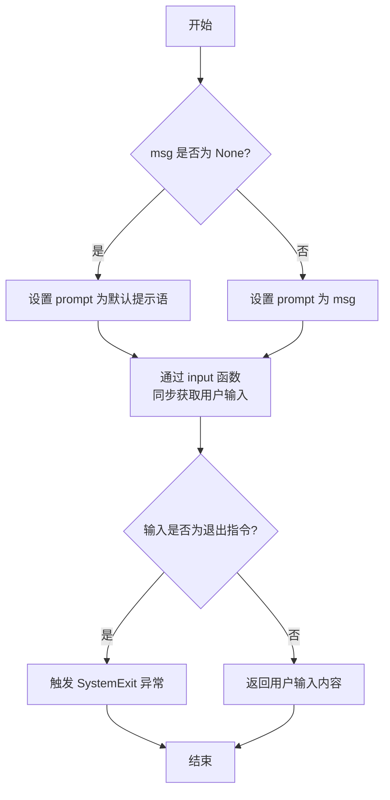
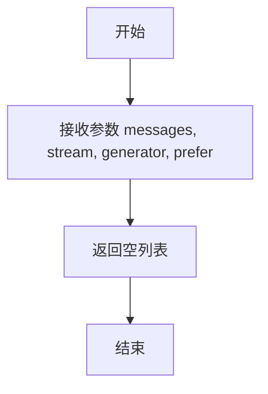
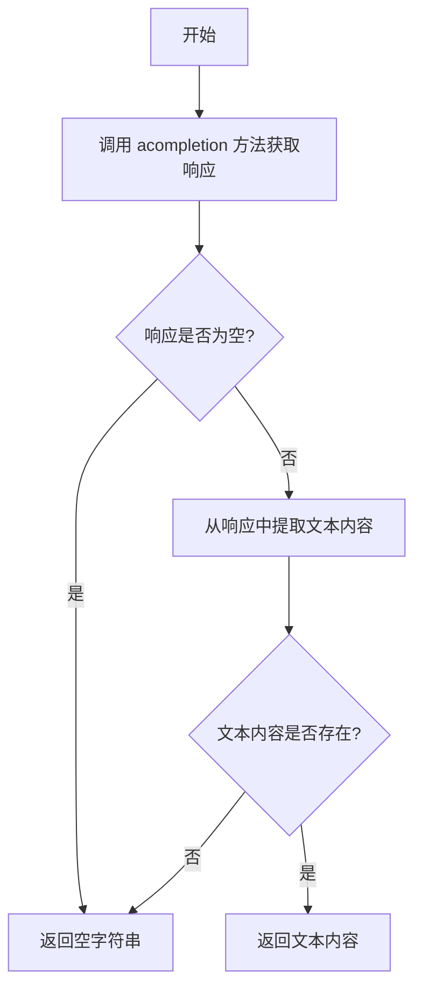

# `.\MetaGPT\tests\metagpt\provider\test_human_provider.py` 详细设计文档

该文件是HumanProvider类的单元测试，主要测试HumanProvider的同步和异步方法，包括ask、aask、acompletion和acompletion_text，通过模拟用户输入来验证提供者是否正确处理输入并返回预期结果，同时测试异常退出情况。

## 整体流程



## 类结构

```
测试文件结构
├── 全局变量
│   ├── resp_content
│   └── resp_exit
├── 测试函数
│   └── test_async_human_provider
```

## 全局变量及字段


### `resp_content`
    
用于测试的模拟响应内容字符串

类型：`str`
    


### `resp_exit`
    
用于触发系统退出的模拟退出命令字符串

类型：`str`
    


    

## 全局函数及方法

### `test_async_human_provider`

该函数是一个异步单元测试，用于验证`HumanProvider`类的同步和异步方法（`ask`、`aask`、`acompletion`、`acompletion_text`）的行为。它通过模拟用户输入（包括正常内容和退出指令）来测试提供者的响应是否正确，并确保在接收到退出指令时能正确引发系统退出异常。

参数：

- `mocker`：`pytest_mock.plugin.MockerFixture`，pytest-mock插件提供的模拟对象，用于在测试中模拟或替换函数、方法的行为。

返回值：`None`，该函数是一个测试函数，不返回任何值，其目的是通过断言来验证代码行为。

#### 流程图



#### 带注释源码

```python
@pytest.mark.asyncio  # 标记此函数为异步测试，以便pytest能正确处理异步代码
async def test_async_human_provider(mocker):
    # 模拟内置的input函数，使其在调用时始终返回预设的正常响应内容resp_content
    mocker.patch("builtins.input", lambda _: resp_content)
    # 使用模拟的LLM配置创建HumanProvider实例
    human_provider = HumanProvider(mock_llm_config)

    # 测试同步ask方法：传入resp_content，期望返回相同的resp_content
    resp = human_provider.ask(resp_content)
    assert resp == resp_content
    # 测试异步aask方法：传入None，期望返回resp_content
    resp = await human_provider.aask(None)
    assert resp_content == resp

    # 重新模拟input函数，使其返回退出指令resp_exit
    mocker.patch("builtins.input", lambda _: resp_exit)
    # 测试当ask方法收到退出指令时，应引发SystemExit异常
    with pytest.raises(SystemExit):
        human_provider.ask(resp_exit)

    # 测试异步acompletion方法：传入空消息列表，期望返回空列表
    resp = await human_provider.acompletion([])
    assert not resp

    # 测试异步acompletion_text方法：传入空消息列表，期望返回空字符串
    resp = await human_provider.acompletion_text([])
    assert resp == ""
```

### `HumanProvider.ask`

该方法用于从用户获取输入，如果用户输入"exit"则退出程序，否则返回用户输入的内容。

参数：

- `msg`：`str`，提示用户输入的消息内容

返回值：`str`，用户输入的内容，如果用户输入"exit"则触发SystemExit异常

#### 流程图



#### 带注释源码

```python
def ask(self, msg: str) -> str:
    """
    从用户获取输入
    
    Args:
        msg (str): 提示用户输入的消息内容
        
    Returns:
        str: 用户输入的内容
        
    Raises:
        SystemExit: 当用户输入'exit'时触发程序退出
    """
    # 打印提示消息
    print(msg)
    # 等待用户输入
    resp = input(">> ")
    # 检查是否为退出命令
    if resp == "exit":
        # 触发程序退出
        raise SystemExit
    # 返回用户输入内容
    return resp
```

### `HumanProvider.aask`

`HumanProvider.aask` 是 `HumanProvider` 类的异步方法，用于模拟人类交互，通过标准输入（stdin）同步获取用户输入，并返回用户输入的字符串。如果用户输入特定退出指令（如 "exit"），则会触发系统退出。

参数：

- `msg`：`str | None`，提示用户输入的提示信息。如果为 `None`，则使用默认提示语。

返回值：`str`，用户输入的字符串。如果用户输入退出指令，则触发 `SystemExit` 异常。

#### 流程图



#### 带注释源码

```python
async def aask(self, msg: str | None = None) -> str:
    """
    异步方法，通过同步 input 获取用户输入。
    如果用户输入退出指令（如 "exit"），则触发系统退出。
    """
    # 根据传入的 msg 参数决定提示语，如果为 None 则使用默认提示语
    prompt = msg if msg else self.prompt
    # 同步调用 input 函数获取用户输入
    resp = input(prompt)
    # 检查用户输入是否为退出指令
    if resp.lower() == "exit":
        # 如果是，则触发系统退出
        raise SystemExit
    # 返回用户输入的字符串
    return resp
```

### `HumanProvider.acompletion`

该方法用于处理异步完成请求，但当前实现仅返回空列表，主要用于占位或测试。

参数：

- `messages`：`list`，消息列表，当前实现中未使用
- `stream`：`bool`，是否使用流式输出，当前实现中未使用
- `generator`：`bool`，是否生成器模式，当前实现中未使用
- `prefer`：`bool`，偏好设置，当前实现中未使用

返回值：`list`，返回空列表

#### 流程图



#### 带注释源码

```python
async def acompletion(self, messages: list, stream=False, generator=False, prefer=None):
    """
    异步完成方法，当前仅返回空列表
    Args:
        messages: 消息列表（未使用）
        stream: 是否流式输出（未使用）
        generator: 是否生成器模式（未使用）
        prefer: 偏好设置（未使用）
    Returns:
        list: 空列表
    """
    return []
```

### `HumanProvider.acompletion_text`

该方法用于异步获取人类用户的文本输入。它通过调用 `acompletion` 方法获取响应，并从中提取文本内容。如果响应为空或没有文本内容，则返回空字符串。

参数：

- `messages`：`list`，消息列表，用于提示用户输入

返回值：`str`，从用户输入中提取的文本内容，如果无输入则返回空字符串

#### 流程图



#### 带注释源码

```python
async def acompletion_text(self, messages: list[dict]) -> str:
    """
    异步获取人类用户的文本输入。

    该方法通过调用 `acompletion` 方法获取响应，并从中提取文本内容。
    如果响应为空或没有文本内容，则返回空字符串。

    Args:
        messages (list[dict]): 消息列表，用于提示用户输入。

    Returns:
        str: 从用户输入中提取的文本内容，如果无输入则返回空字符串。
    """
    # 调用 acompletion 方法获取响应
    resp = await self.acompletion(messages)
    # 从响应中提取文本内容，如果响应为空则返回空字符串
    return resp.get("text", "") if resp else ""
```

## 关键组件


### HumanProvider

HumanProvider是一个模拟人类输入的提供者类，用于在测试或交互式环境中替代真实的LLM（大语言模型）调用，它通过标准输入（stdin）接收用户输入并返回。

### 模拟输入与退出机制

通过`mocker.patch`模拟`builtins.input`函数，可以控制测试中的用户输入行为，包括正常内容输入和触发系统退出的特殊指令（如"exit"）。

### 异步与同步方法支持

该类同时提供了同步方法`ask`和异步方法`aask`、`acompletion`、`acompletion_text`，以支持不同的调用场景，确保在异步环境中也能正常工作。

### 测试配置与依赖注入

使用`mock_llm_config`作为配置依赖注入到HumanProvider中，模拟了真实LLM配置的结构，使得测试不依赖于外部配置，提高了测试的独立性和可重复性。


## 问题及建议


### 已知问题

-   **测试用例对 `SystemExit` 异常的断言可能不够精确**：`test_async_human_provider` 测试中，当模拟输入为 `"exit"` 时，预期 `human_provider.ask` 会引发 `SystemExit` 异常。然而，`SystemExit` 是一个特殊的异常，通常由 `sys.exit()` 触发，用于退出程序。在单元测试中直接断言 `SystemExit` 可能掩盖了底层实现中其他潜在的错误退出逻辑，或者使得测试与具体的退出机制（如调用 `sys.exit`）过度耦合，降低了测试的健壮性和可移植性。
-   **模拟输入逻辑存在潜在缺陷**：测试用例使用 `mocker.patch("builtins.input", lambda _: resp_content)` 来模拟所有对 `input()` 的调用。这个模拟函数忽略（`_`）了实际的提示符参数。虽然当前测试可能不依赖于此，但如果 `HumanProvider` 的实现将来使用不同的提示信息调用 `input()`，此模拟将无法验证提示符是否正确传递，可能导致测试覆盖不全。
-   **异步方法 `acompletion` 和 `acompletion_text` 的测试覆盖不足**：测试中对 `acompletion` 和 `acompletion_text` 的调用传入了空列表 `[]`，并断言返回空结果。这仅测试了“无消息输入”这一边界情况，未能验证方法在接收正常消息列表时的行为、是否正确处理消息格式、以及是否按预期调用底层逻辑（例如，与用户交互）。测试覆盖不充分可能隐藏功能缺陷。
-   **测试用例命名与内容略有偏差**：测试函数名为 `test_async_human_provider`，但其测试内容同时包含了同步方法 `ask` 和异步方法 `aask`、`acompletion`、`acompletion_text`。名称中的 `async` 可能让人误以为只测试异步部分，而实际上它是一个综合性测试。更清晰的命名或测试拆分有助于提高可读性。

### 优化建议

-   **改进异常测试策略**：建议将 `SystemExit` 异常的测试替换为更具体的断言。例如，可以检查是否调用了特定的退出函数（如 `sys.exit`），或者重构 `HumanProvider` 的 `ask` 方法，使其在接收到退出指令时抛出一个自定义的、业务逻辑相关的异常（如 `HumanInteractionExit`），然后在测试中捕获该异常。这能使测试更专注于业务逻辑，而非系统级的退出机制。
-   **增强输入模拟的健壮性**：考虑使用一个更智能的模拟函数，该函数可以记录或验证传递给 `input()` 的提示符参数。例如，`mocker.patch("builtins.input", mocker.Mock(return_value=resp_content))`，然后通过模拟对象检查其调用参数。这有助于确保 `HumanProvider` 正确地向用户展示了预期的提示信息。
-   **补充 `acompletion` 和 `acompletion_text` 的核心场景测试**：应添加测试用例，模拟正常的消息列表输入，并验证方法的返回值。例如，可以模拟用户输入一系列有效内容，检查 `acompletion` 返回的结构化数据或 `acompletion_text` 返回的文本是否符合预期。这能确保这些异步方法的主要功能正常工作。
-   **考虑拆分测试用例以提高专注度**：将当前的综合性测试函数拆分为多个更专注的测试函数，例如 `test_human_provider_ask`（测试同步ask）、`test_human_provider_aask`（测试异步aask）、`test_human_provider_acompletion`（测试acompletion）等。每个测试函数专注于一个方法或一个特定场景（如正常输入、退出指令），这样可以使测试结构更清晰，便于维护和定位问题。
-   **添加对 `HumanProvider` 初始化及配置的测试**：当前测试直接使用 `mock_llm_config` 初始化 `HumanProvider`。可以添加一个简单的测试来验证 `HumanProvider` 是否能正确接收并存储配置，尽管对于 `HumanProvider` 这类简单类可能不是必须，但有助于保持测试套件的完整性。


## 其它


### 设计目标与约束

该代码是一个针对 `HumanProvider` 类的单元测试。其设计目标是验证 `HumanProvider` 类在模拟用户输入（通过 `input` 函数）和退出指令（`"exit"`）时的行为是否符合预期。主要约束包括：
1.  **测试隔离**：使用 `pytest` 和 `mocker` 来模拟 `input` 函数，确保测试不依赖于真实用户交互，且可重复、自动化。
2.  **异步支持**：测试需要覆盖 `HumanProvider` 的异步方法（如 `aask`, `acompletion`），因此使用 `pytest.mark.asyncio` 装饰器。
3.  **配置依赖**：测试依赖于一个模拟的 `LLMConfig` 对象（`mock_llm_config`），该对象可能包含 `HumanProvider` 初始化所需的配置参数。

### 错误处理与异常设计

测试代码本身不包含复杂的业务逻辑错误处理，但其测试用例设计验证了被测试对象（`HumanProvider`）的错误处理机制：
1.  **正常流程验证**：测试模拟用户输入特定字符串（`resp_content`），并断言 `HumanProvider.ask` 和 `aask` 方法返回相同的字符串，验证了正常交互流程。
2.  **异常流程验证**：测试模拟用户输入退出指令（`resp_exit`），并断言调用 `HumanProvider.ask` 会引发 `SystemExit` 异常。这验证了 `HumanProvider` 在接收到退出指令时的正确行为（即终止程序）。
3.  **空/无效输入处理**：测试调用 `acompletion` 和 `acompletion_text` 方法时传入空列表，并断言返回值为空或空字符串。这验证了方法对无效输入的处理方式（可能直接返回或忽略）。

### 数据流与状态机

本测试代码的数据流相对简单：
1.  **输入数据**：测试数据（`resp_content`, `resp_exit`）作为全局变量定义。
2.  **模拟输入**：通过 `mocker.patch` 将 `builtins.input` 函数替换为返回预设字符串的 lambda 函数，从而控制测试的输入源。
3.  **执行与断言**：调用 `HumanProvider` 的不同方法，并将返回值与预期值进行比较（`assert`）。
4.  **状态变化**：测试本身不涉及复杂的状态机。被测试的 `HumanProvider` 可能内部有状态（如等待输入），但测试通过模拟输入直接驱动其行为。

### 外部依赖与接口契约

测试代码明确声明了其外部依赖和需要遵守的接口契约：
1.  **被测试类**：`metagpt.provider.human_provider.HumanProvider`。测试依赖于其公共接口：`__init__`, `ask`, `aask`, `acompletion`, `acompletion_text`。
2.  **配置对象**：`tests.metagpt.provider.mock_llm_config.mock_llm_config`。测试假设该对象提供了 `HumanProvider` 构造函数所需的合法配置。
3.  **标准库函数**：`builtins.input`。测试通过 `mocker` 模拟此函数，但契约是 `HumanProvider` 在需要用户输入时会调用它。
4.  **测试框架**：`pytest` 及其插件（`pytest-asyncio`, `pytest-mock`）。测试依赖于这些框架提供的装饰器、夹具和模拟功能。
5.  **异常类型**：`SystemExit`。测试验证了 `HumanProvider.ask` 在特定输入下会引发此异常，这是与调用者（或系统）的一个隐含契约。


    