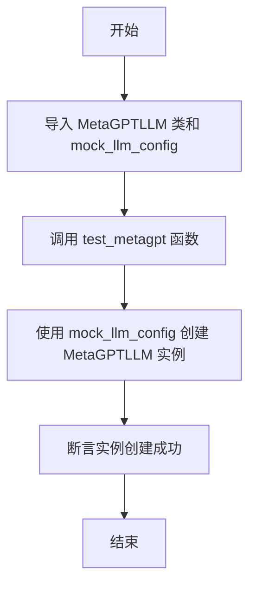
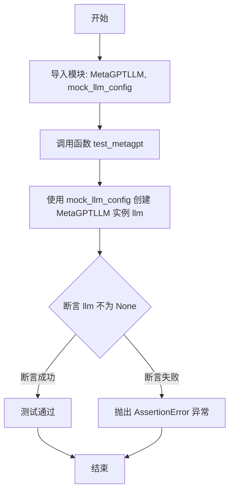

# `.\MetaGPT\tests\metagpt\provider\test_metagpt_llm.py` 详细设计文档

该代码是一个测试文件，用于验证 MetaGPTLLM 类的实例化功能。它通过导入 MetaGPTLLM 类和模拟配置，创建一个 MetaGPTLLM 实例，并使用断言确保实例创建成功。

## 整体流程



## 类结构

```
MetaGPTLLM (外部类，来自 metagpt.provider.metagpt_api)
mock_llm_config (外部配置，来自 tests.metagpt.provider.mock_llm_config)
```

## 全局变量及字段


### `mock_llm_config`
    
模拟的LLM配置对象，用于测试MetaGPTLLM类的初始化。

类型：`object`
    


    

## 全局函数及方法


### `test_metagpt`

该函数是一个单元测试函数，用于测试 `MetaGPTLLM` 类的实例化功能。它通过传入一个模拟的配置对象来创建 `MetaGPTLLM` 实例，并断言该实例创建成功（即不为 `None`）。

参数：

-  `无`：该函数不接受任何参数。

返回值：`None`，该函数不返回任何值，其主要目的是执行测试断言。

#### 流程图



#### 带注释源码

```python
#!/usr/bin/env python
# -*- coding: utf-8 -*-
"""
@Time    : 2023/8/30
@Author  : mashenquan
@File    : test_metagpt_llm.py
"""
# 从 metagpt.provider.metagpt_api 模块导入 MetaGPTLLM 类
from metagpt.provider.metagpt_api import MetaGPTLLM
# 从 tests.metagpt.provider.mock_llm_config 模块导入 mock_llm_config 对象
from tests.metagpt.provider.mock_llm_config import mock_llm_config


def test_metagpt():
    # 使用导入的 mock_llm_config 配置对象实例化 MetaGPTLLM 类
    llm = MetaGPTLLM(mock_llm_config)
    # 断言：检查 llm 对象是否被成功创建（即不为 None 或 False）
    assert llm


# 如果此脚本作为主程序运行，则执行 test_metagpt 函数
if __name__ == "__main__":
    test_metagpt()
```


## 关键组件


### MetaGPTLLM

MetaGPTLLM 是 `metagpt.provider.metagpt_api` 模块中定义的一个类，它作为与 MetaGPT 大语言模型服务进行交互的核心客户端或适配器。该类接收一个配置对象（`mock_llm_config`）进行初始化，用于设置与后端 LLM 服务通信所需的参数，如 API 端点、认证密钥、模型版本等。它是测试代码中直接实例化和验证的主要功能组件。

### mock_llm_config

`mock_llm_config` 是 `tests.metagpt.provider.mock_llm_config` 模块中定义的一个配置对象或函数。它的核心功能是为 `MetaGPTLLM` 类的实例化提供模拟的、预设的配置参数，从而使得单元测试（`test_metagpt`）可以在不依赖真实外部服务（如实际的 MetaGPT API）和敏感凭证的情况下运行。这体现了测试的隔离性和可重复性。


## 问题及建议


### 已知问题

-   **测试覆盖不足**：当前测试用例仅验证了`MetaGPTLLM`类的实例化，没有测试其核心功能（如`ask`、`acompletion`等方法）是否正常工作，无法保证代码的业务逻辑正确性。
-   **依赖模拟不完整**：测试依赖于`mock_llm_config`，但未展示其具体实现。如果该配置模拟不充分（例如缺少必要的认证信息或端点URL），可能导致测试通过但实际集成失败。
-   **缺乏异常场景测试**：代码没有测试网络错误、API认证失败、响应格式异常等边界和异常情况，系统的鲁棒性无法通过测试得到验证。
-   **测试结构单一**：只有一个测试函数，随着`MetaGPTLLM`类功能的增加，测试会变得臃肿且难以维护，不符合单元测试的最佳实践。

### 优化建议

-   **补充核心功能测试**：为`MetaGPTLLM`类的关键方法（如`ask`）添加单元测试，验证其能够正确调用底层API并处理响应。
-   **完善模拟对象**：确保`mock_llm_config`能够模拟所有必要的配置项，并考虑使用`unittest.mock`库来模拟网络请求，实现真正的单元隔离测试。
-   **增加异常测试用例**：编写测试用例来模拟和验证代码在遇到网络超时、无效响应、配置错误等异常情况下的处理逻辑。
-   **重构测试结构**：将测试拆分为多个独立的测试函数或测试类（例如使用`pytest`），每个测试专注于一个特定功能或场景，提高测试的可读性和可维护性。
-   **考虑集成测试**：在单元测试之外，可以补充少量的集成测试，使用真实的配置（但可能是测试环境的密钥和端点）来验证与MetaGPT API的实际连通性。


## 其它


### 设计目标与约束

本代码是一个单元测试文件，其设计目标是验证 `MetaGPTLLM` 类能够使用模拟配置 `mock_llm_config` 成功实例化。核心约束包括：
1.  **测试隔离性**：测试不应依赖外部网络服务或真实的 LLM API，因此使用模拟配置 `mock_llm_config`。
2.  **最小化验证**：当前测试仅验证构造函数调用成功（对象不为 `None`），是后续更复杂功能测试的基础。
3.  **可执行性**：文件可直接通过 `python test_metagpt_llm.py` 运行，执行 `test_metagpt` 函数。

### 错误处理与异常设计

当前测试代码本身不包含显式的错误处理逻辑，其错误处理依赖于 Python 的断言机制和单元测试框架（如 pytest）：
1.  **断言失败**：如果 `llm` 对象实例化失败（例如 `mock_llm_config` 无效导致 `MetaGPTLLM` 构造函数抛出异常，或返回 `None`），则 `assert llm` 语句将引发 `AssertionError`，测试标记为失败。
2.  **隐式异常**：在 `llm = MetaGPTLLM(mock_llm_config)` 执行过程中，如果 `MetaGPTLLM` 的构造函数或 `mock_llm_config` 的初始化过程抛出任何未捕获的异常（如 `TypeError`, `ValueError` 等），测试也会因异常而失败。
3.  **设计意图**：此测试旨在快速验证“在给定有效模拟配置下，能成功创建对象”这一基本前提。更详细的错误场景（如无效配置、网络异常等）应由 `MetaGPTLLM` 类自身的单元测试或集成测试覆盖。

### 数据流与状态机

本测试文件的数据流非常简单，不涉及复杂的状态转换：
1.  **数据输入**：测试的唯一数据输入是来自 `tests.metagpt.provider.mock_llm_config` 模块的 `mock_llm_config` 对象。该对象模拟了 LLM 配置，作为 `MetaGPTLLM` 构造函数的参数。
2.  **处理过程**：
    *   调用 `MetaGPTLLM` 构造函数，传入 `mock_llm_config`。
    *   构造函数内部使用该配置（可能包含模拟的 API 密钥、端点等）初始化内部状态。
3.  **数据输出/状态验证**：测试的输出是一个布尔断言结果。成功状态是 `llm` 对象被成功创建（非 `None`）。没有其他状态变化或数据输出。
4.  **状态机**：不适用。这是一个线性的、一次性的函数调用验证。

### 外部依赖与接口契约

本测试文件明确声明了以下外部依赖和接口契约：
1.  **模块依赖**：
    *   `metagpt.provider.metagpt_api.MetaGPTLLM`：这是被测试的核心类。测试依赖于其公开的构造函数接口 `__init__(config)`。
    *   `tests.metagpt.provider.mock_llm_config.mock_llm_config`：这是一个测试工具，提供符合 `MetaGPTLLM` 构造函数预期的模拟配置对象。其具体结构和字段由 `MetaGPTLLM` 类的需求定义。
2.  **接口契约**：
    *   `MetaGPTLLM.__init__` 契约：接受一个配置对象作为参数，并成功返回一个实例。测试假设 `mock_llm_config` 满足此契约所需的配置格式。
    *   `mock_llm_config` 契约：提供一个有效的、可用于实例化 `MetaGPTLLM` 的配置字典或对象。它必须模拟真实配置的关键属性，以避免在测试中触发对外部服务的调用。
3.  **隐式依赖**：Python 标准库（用于脚本执行和断言）。如果作为更大测试套件的一部分运行，可能还依赖测试运行器（如 `pytest`）。

### 测试策略与覆盖范围

1.  **测试类型**：这是一个**单元测试**，专注于验证单个类 (`MetaGPTLLM`) 在特定条件（模拟配置）下的最小功能单元（对象构造）。
2.  **覆盖范围**：
    *   **正面用例 (Happy Path)**：验证在提供有效模拟配置时，对象能成功实例化。这是当前测试覆盖的唯一场景。
    *   **未覆盖场景**：
        *   负面用例：如传入 `None`、空字典、格式错误的配置等，构造函数应如何反应（抛出何种异常）。
        *   边界条件：配置中特定字段的边界值测试。
        *   `MetaGPTLLM` 类的其他方法（如 `ask`, `achat` 等）的功能性测试。
        *   与真实 `metagpt` API 的集成测试。
3.  **测试独立性**：通过使用 `mock_llm_config`，该测试与外部网络和真实的 LLM 服务解耦，可以独立、快速、可重复地运行。

### 安全与合规考虑

1.  **敏感信息**：由于使用了 `mock_llm_config`（模拟配置），测试中不包含真实的 API 密钥、令牌或其他敏感信息，避免了在测试代码或日志中意外泄露凭证的风险。
2.  **网络隔离**：测试不发起任何真实的网络请求，因此不存在测试过程中意外产生 API 调用费用、触发速率限制或访问外部系统的问题。
3.  **合规性**：测试代码本身不涉及数据处理或用户隐私问题。其合规性依赖于 `MetaGPTLLM` 实现和 `mock_llm_config` 模拟的内容是否符合相关规范（如不模拟真实用户数据）。


    