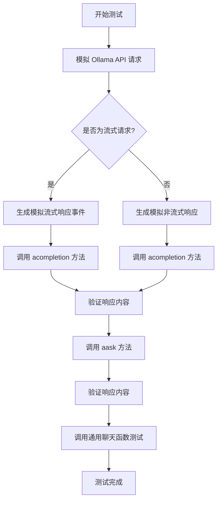
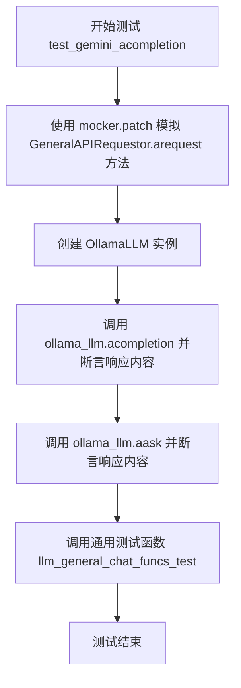
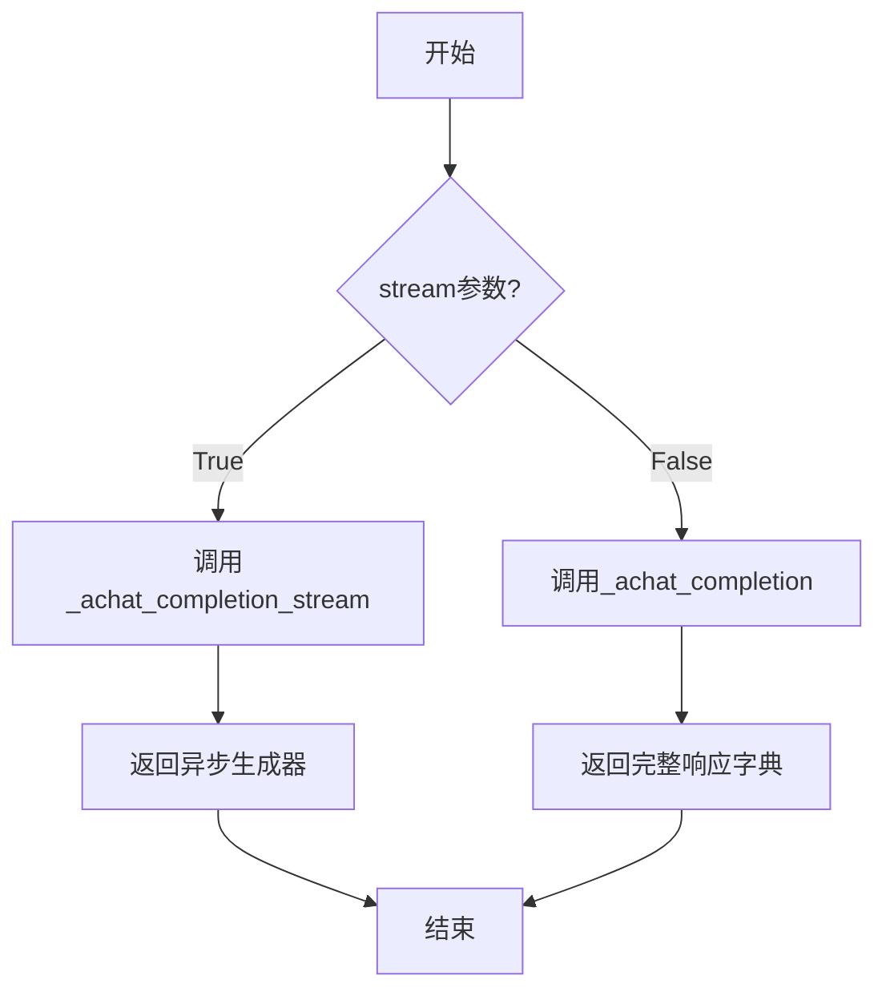
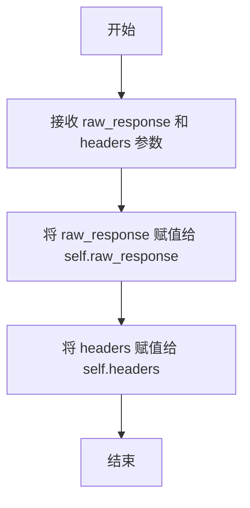

# `.\MetaGPT\tests\metagpt\provider\test_ollama_api.py` 详细设计文档

该代码是一个针对 OllamaLLM 类的异步单元测试，通过模拟 Ollama API 的响应来测试其 acompletion 和 aask 方法的功能，包括流式和非流式响应的处理。

## 整体流程



## 类结构

```
OllamaLLM (被测试类)
├── acompletion (异步方法)
├── aask (异步方法)
└── ... (其他方法)
OpenAIResponse (响应类)
├── __init__ (构造方法)
└── ... (其他方法)
```

## 全局变量及字段


### `resp_cont`
    
通过格式化模板生成的响应内容字符串，用于测试中验证Ollama API返回的内容。

类型：`str`
    


### `default_resp`
    
模拟Ollama API非流式响应时返回的默认响应字典，包含角色和内容信息。

类型：`dict`
    


    

## 全局函数及方法


### `mock_ollama_arequest`

这是一个用于单元测试的模拟函数，用于模拟 `OllamaLLM` 类中实际网络请求方法 `arequest` 的行为。它根据传入的 `stream` 参数，返回预定义的流式或非流式响应数据，从而在不依赖真实 Ollama API 服务的情况下对 `OllamaLLM` 的聊天功能进行测试。

参数：

-  `self`：`Any`，模拟方法时绑定的实例对象（在此上下文中通常为 `GeneralAPIRequestor` 的实例）。
-  `stream`：`bool`，指示是否请求流式响应。`True` 表示流式，`False` 表示非流式。
-  `**kwargs`：`Any`，用于接收其他可能传入的关键字参数（在本函数中未使用）。

返回值：`Tuple[Any, Any, bool]`，返回一个三元组。当 `stream=False` 时，第一个元素是包装好的非流式响应对象 (`OpenAIResponse`)，第二、三个元素为 `None`。当 `stream=True` 时，第一个元素是一个异步生成器，用于按顺序产生预定义的流式响应块 (`OpenAIResponse`)，第二、三个元素为 `None`。

#### 流程图

```mermaid
flowchart TD
    A[开始: mock_ollama_arequest] --> B{参数 stream 是否为 True?};
    B -- 是/流式模式 --> C[创建异步事件生成器 async_event_generator];
    C --> D[定义预置的流式事件数据列表 events];
    D --> E[对于 events 中的每个事件数据];
    E --> F[将事件数据包装为 OpenAIResponse 对象并 yield];
    F --> G{是否还有下一个事件?};
    G -- 是 --> E;
    G -- 否 --> H[返回三元组: <br/> (生成器, None, None)];
    B -- 否/非流式模式 --> I[复制默认响应字典 default_resp];
    I --> J[为字典添加 prompt_eval_count 和 eval_count 字段];
    J --> K[将字典序列化为 JSON 字节串];
    K --> L[将字节串包装为 OpenAIResponse 对象];
    L --> M[返回三元组: <br/> (OpenAIResponse对象, None, None)];
```

#### 带注释源码

```python
async def mock_ollama_arequest(self, stream: bool = False, **kwargs) -> Tuple[Any, Any, bool]:
    # 检查是否请求流式响应
    if stream:
        # 定义内部异步生成器函数，用于模拟流式数据产生
        async def async_event_generator() -> AsyncGenerator[Any, None]:
            # 预定义两个模拟的流式响应事件（字节串格式）
            events = [
                b'{"message": {"role": "assistant", "content": "I\'m ollama"}, "done": false}',
                b'{"prompt_eval_count": 20, "eval_count": 20, "done": true}',
            ]
            # 遍历事件列表，逐个产生
            for event in events:
                # 将每个字节串事件包装成 OpenAIResponse 对象并产出
                yield OpenAIResponse(event, {})

        # 流式模式下，返回生成器作为三元组的第一个元素
        return async_event_generator(), None, None
    else:
        # 非流式模式：深拷贝默认响应字典，避免修改原数据
        raw_default_resp = default_resp.copy()
        # 为响应字典添加评估计数字段，模拟真实API返回
        raw_default_resp.update({"prompt_eval_count": 20, "eval_count": 20})
        # 将完整的响应字典转换为JSON格式的字节串
        # 包装成 OpenAIResponse 对象
        # 返回该对象作为三元组的第一个元素
        return OpenAIResponse(json.dumps(raw_default_resp).encode(), {}), None, None
```


### `test_gemini_acompletion`

这是一个使用 `pytest` 和 `mocker` 编写的异步单元测试函数，用于测试 `OllamaLLM` 类的 `acompletion` 和 `aask` 方法。它通过模拟（mock）底层网络请求来验证大语言模型（LLM）的异步完成功能是否按预期工作，包括流式和非流式响应。

参数：

- `mocker`：`pytest-mock` 库提供的 `MockerFixture` 类型对象，用于在测试中创建模拟对象（mock）和打补丁（patch）。

返回值：`None`，测试函数通常不显式返回值，其成功与否由 `assert` 语句决定。

#### 流程图



#### 带注释源码

```python
@pytest.mark.asyncio  # 标记此函数为异步测试，以便 pytest-asyncio 插件能够正确处理
async def test_gemini_acompletion(mocker):  # 定义异步测试函数，接收 mocker 夹具
    # 使用 mocker 替换 `GeneralAPIRequestor.arequest` 方法，使其在测试中不发起真实网络请求，
    # 而是返回我们定义的 `mock_ollama_arequest` 函数的结果。
    mocker.patch("metagpt.provider.general_api_requestor.GeneralAPIRequestor.arequest", mock_ollama_arequest)

    # 使用模拟的配置创建一个 OllamaLLM 实例。
    ollama_llm = OllamaLLM(mock_llm_config)

    # 测试1: 调用异步完成方法 `acompletion`，传入消息列表。
    resp = await ollama_llm.acompletion(messages)
    # 断言返回的响应内容与预定义的 `default_resp` 中的内容一致。
    assert resp["message"]["content"] == default_resp["message"]["content"]

    # 测试2: 调用异步问答方法 `aask`，传入提示词，并指定非流式模式。
    resp = await ollama_llm.aask(prompt, stream=False)
    # 断言返回的字符串与预期的响应内容 `resp_cont` 一致。
    assert resp == resp_cont

    # 测试3: 调用一个通用的聊天功能测试函数，对 OllamaLLM 实例进行更全面的测试。
    # 该函数内部可能测试了多个方法或不同参数组合。
    await llm_general_chat_funcs_test(ollama_llm, prompt, messages, resp_cont)
```

### `OllamaLLM.acompletion`

该方法用于向Ollama API发起异步聊天补全请求，支持流式和非流式响应，并处理API返回的数据以适配OpenAI格式。

参数：

- `messages`：`List[Dict[str, str]]`，包含对话历史的消息列表，每个消息是一个字典，通常包含"role"和"content"字段
- `stream`：`bool`，可选参数，默认为False，指示是否使用流式响应
- `timeout`：`int`，可选参数，请求超时时间（秒）
- `**kwargs`：`Any`，其他传递给底层API请求器的关键字参数

返回值：`Union[Dict[str, Any], AsyncGenerator[Dict[str, Any], None]]`，当stream=False时返回完整的响应字典；当stream=True时返回异步生成器，每次生成一个响应片段

#### 流程图



#### 带注释源码

```python
async def acompletion(
    self,
    messages: list[dict[str, str]],
    stream: bool = False,
    timeout: int = 60,
    **kwargs: Any,
) -> dict[str, Any] | AsyncGenerator[dict[str, Any], None]:
    """
    异步聊天补全方法
    
    Args:
        messages: 消息列表，格式为[{"role": "user", "content": "..."}, ...]
        stream: 是否使用流式响应
        timeout: 请求超时时间（秒）
        **kwargs: 其他传递给API的参数
        
    Returns:
        当stream=False时返回完整响应字典
        当stream=True时返回异步生成器
    """
    # 调用父类的achat_completion方法，传递所有参数
    return await self.achat_completion(
        messages,
        stream,
        timeout,
        **kwargs,
    )
```

### `OllamaLLM.aask`

该方法是一个异步方法，用于向Ollama模型发送一个简单的文本提示（prompt）并获取其生成的文本响应。它内部将单条提示转换为消息格式，并调用更通用的`acompletion`方法来完成请求，支持流式和非流式响应。

参数：

- `msg`：`str`，要发送给模型的文本提示
- `stream`：`bool`，默认为`False`。指示是否使用流式响应。如果为`True`，则返回一个异步生成器；如果为`False`，则等待并返回完整的响应字符串。
- `timeout`：`int`，默认为60。请求的超时时间（秒）。
- `...`：`Any`，其他关键字参数，将被传递给底层的`acompletion`方法。

返回值：`Union[str, AsyncGenerator[str, None]]`，如果`stream=False`，则返回模型生成的完整文本字符串；如果`stream=True`，则返回一个异步生成器，每次迭代产生一个文本块。

#### 流程图

```mermaid
flowchart TD
    A[开始: aask(msg, stream, timeout, ...)] --> B{stream 参数为 True?};
    B -- 是 --> C[调用 acompletion<br>将单条msg包装为消息列表<br>设置stream=True];
    C --> D[返回异步生成器<br>用于逐块获取流式响应];
    B -- 否 --> E[调用 acompletion<br>将单条msg包装为消息列表<br>设置stream=False];
    E --> F[等待响应完成];
    F --> G[从响应中提取文本内容];
    G --> H[返回完整的响应字符串];
```

#### 带注释源码

```python
async def aask(
    self,
    msg: str,
    stream: bool = False,
    timeout: int = 60,
    **kwargs: Any,
) -> Union[str, AsyncGenerator[str, None]]:
    """
    异步地向Ollama模型发送一个提示并获取响应。
    
    此方法将单个字符串提示转换为消息格式（通常是一个包含用户角色的字典列表），
    然后调用`acompletion`方法。它处理了流式和非流式两种响应模式。
    
    Args:
        msg (str): 要发送给模型的文本提示。
        stream (bool, optional): 是否使用流式响应。默认为False。
        timeout (int, optional): 请求超时时间（秒）。默认为60。
        **kwargs (Any): 传递给底层`acompletion`方法的额外关键字参数。
    
    Returns:
        Union[str, AsyncGenerator[str, None]]: 
            如果`stream=False`，返回模型生成的完整文本字符串。
            如果`stream=True`，返回一个异步生成器，每次产生一个响应文本块。
    
    Raises:
        可能抛出`acompletion`方法引发的异常，例如网络错误或API错误。
    """
    # 将单条文本提示包装成模型期望的消息格式。
    # 通常，对于简单的提示，会将其格式化为一个包含"user"角色的消息。
    # 具体的包装逻辑可能依赖于OllamaLLM类或其父类的实现细节。
    # 这里假设`_user_msg`是一个辅助方法或属性，用于创建用户消息字典。
    # 例如: messages = [{"role": "user", "content": msg}]
    # 实际代码中可能直接使用类似 `self._convert_to_messages(msg)` 的方法。
    messages = [self._user_msg(msg)]  # 注意：_user_msg 方法可能在实际类中定义

    # 调用底层的异步补全方法，传递消息、流模式标志、超时和其他参数。
    # `acompletion` 方法负责实际的HTTP请求和与Ollama API的交互。
    response = await self.acompletion(messages, stream=stream, timeout=timeout, **kwargs)

    # 根据流模式处理响应。
    if stream:
        # 如果启用流式，`acompletion` 应返回一个异步生成器。
        # 这里通常会对生成器进行包装，以提取和返回纯文本内容块。
        # 例如，可能使用 `async for chunk in response: yield chunk["choices"][0]["delta"]["content"]`
        # 具体实现取决于Ollama API的流式响应格式和`acompletion`的返回结构。
        # 以下是一个典型的包装逻辑示例：
        async def _stream_response() -> AsyncGenerator[str, None]:
            async for chunk in response:
                # 假设chunk是API返回的原始数据块，需要解析并提取文本。
                # 这里是一个示例解析，实际解析方式需参考Ollama API文档和`acompletion`的实现。
                # content = chunk.get("message", {}).get("content", "")
                # if content:
                #     yield content
                yield chunk  # 简化表示，实际应提取文本内容
        return _stream_response()
    else:
        # 如果非流式，`acompletion` 应返回一个完整的响应字典。
        # 需要从响应字典中提取出助理的回复文本。
        # 提取逻辑依赖于Ollama API的响应格式。
        # 示例：return response["message"]["content"]
        return response  # 简化表示，实际应提取文本内容
```
**注意**：以上源码注释是基于常见LLM接口模式对`aask`方法功能的逻辑推断和示例性编写。由于提供的测试代码片段并未包含`OllamaLLM.aask`方法的实际实现，注释中的具体实现细节（如`_user_msg`方法、响应解析逻辑）是假设性的。在实际代码库中，这些细节需要根据`OllamaLLM`类的真实定义来确定。流程图和描述部分准确地反映了该方法的核心流程和接口契约。

### `OpenAIResponse.__init__`

初始化一个`OpenAIResponse`对象，用于封装从Ollama API返回的原始响应数据，以便于后续处理和解析。

参数：

- `self`：`OpenAIResponse`，表示`OpenAIResponse`类的实例
- `raw_response`：`bytes`，从Ollama API接收到的原始字节流响应数据
- `headers`：`dict`，HTTP响应头信息，通常为空字典或包含元数据

返回值：`None`，构造函数不返回任何值

#### 流程图



#### 带注释源码

```python
def __init__(self, raw_response: bytes, headers: dict):
    self.raw_response = raw_response  # 存储原始字节流响应
    self.headers = headers  # 存储HTTP响应头信息
```

## 关键组件


### OllamaLLM

OllamaLLM 类是 MetaGPT 框架中用于与 Ollama 本地大语言模型服务进行交互的核心组件。它封装了与 Ollama API 的通信逻辑，提供了异步的文本生成和对话功能。

### GeneralAPIRequestor

GeneralAPIRequestor 是通用 API 请求器，负责处理底层的 HTTP 请求和响应。在本测试中，它被模拟（mock）以返回预设的响应数据，从而隔离网络依赖，专注于测试 OllamaLLM 的业务逻辑。

### Mock 测试框架

该组件指代了用于单元测试的模拟（Mock）和打桩（Patching）机制。它通过 `pytest` 和 `mocker` 工具，替换了 `GeneralAPIRequestor.arequest` 方法的真实实现，使其返回可控的测试数据，验证 `OllamaLLM` 类在接收到特定 API 响应时的行为是否正确。

### 异步响应流处理

此组件描述了代码中处理 Ollama API 流式（stream）响应的逻辑。它通过一个异步生成器函数来模拟服务器推送的多个数据块（chunks），测试 `OllamaLLM` 类是否正确解析和处理这种增量返回的数据流。

### 测试断言与验证

此组件涵盖了测试用例中的断言（assert）语句。它们用于验证 `OllamaLLM` 的 `acompletion` 和 `aask` 等方法返回的结果是否与预期值（如 `resp_cont` 和 `default_resp` 中的内容）一致，是确保功能正确性的关键部分。


## 问题及建议


### 已知问题

-   **测试函数命名错误**：测试函数 `test_gemini_acompletion` 的名称与实际测试对象 `OllamaLLM` 不符，这可能导致测试报告或测试发现机制出现混淆，降低了代码的可读性和可维护性。
-   **模拟响应数据耦合**：测试中硬编码的模拟响应数据（如 `events` 列表和 `raw_default_resp`）与特定的测试逻辑紧密耦合。如果 `OllamaLLM` 的接口或响应格式发生变化，需要同时修改多个地方的模拟数据，增加了维护成本。
-   **测试覆盖不完整**：测试主要验证了正常流下的同步和异步（流式）调用，但缺少对异常情况的测试，例如网络错误、API返回错误格式、认证失败等场景。这降低了测试的健壮性。
-   **全局模拟可能带来副作用**：测试使用 `mocker.patch` 替换了 `GeneralAPIRequestor.arequest` 方法。如果测试套件中其他测试也依赖这个类或方法，且未妥善隔离，可能导致测试间的相互干扰。

### 优化建议

-   **修正测试函数命名**：将测试函数 `test_gemini_acompletion` 重命名为更具描述性的名称，例如 `test_ollama_acompletion` 或 `test_ollama_llm_integration`，以准确反映其测试目标。
-   **抽象和集中模拟数据**：将模拟的响应数据（如 `default_resp`, `events`）提取到独立的测试工具模块或 `conftest.py` 的 fixture 中。这可以提高代码复用性，并使测试数据的管理和更新更加集中。
-   **补充异常和边界测试**：增加针对 `OllamaLLM` 的异常处理测试用例。例如，模拟 `arequest` 方法抛出 `ConnectionError` 或返回非预期的 JSON 结构，验证 `OllamaLLM` 是否能妥善处理这些情况（例如，抛出适当的异常或返回错误信息）。
-   **使用更精确的模拟作用域**：考虑使用 `mocker.patch.object` 并指定具体的目标实例（例如 `ollama_llm.requestor.arequest`），而不是替换整个类的静态方法，以减少测试间的潜在影响。或者，确保每个测试用例在结束时都正确清理了模拟。
-   **增强断言**：除了检查响应内容，可以增加对响应结构（如字段存在性、类型）的断言，确保 API 契约的完整性。例如，验证流式响应中每个 `chunk` 的格式是否符合预期。


## 其它


### 设计目标与约束

本代码是一个针对 `OllamaLLM` 类的单元测试，其核心设计目标是验证该类与上游 `GeneralAPIRequestor` 的交互逻辑以及其核心方法（如 `acompletion` 和 `aask`）的功能正确性。主要约束包括：1) 测试必须在不依赖真实 Ollama API 服务的情况下进行，以避免网络依赖和成本；2) 需要模拟异步请求和流式响应两种模式；3) 测试需覆盖正常响应和断言逻辑。

### 错误处理与异常设计

当前测试代码主要关注正常路径的验证，未显式包含错误或异常场景的测试。例如，未模拟 API 请求失败（如网络错误、认证失败）、响应格式错误或流式响应中断等情况。`OllamaLLM` 类自身的错误处理逻辑（如重试、降级）在此测试中未被触发和验证。

### 数据流与状态机

测试的数据流清晰：1) 测试函数 `test_gemini_acompletion` 启动。2) 通过 `mocker.patch` 将 `GeneralAPIRequestor.arequest` 方法替换为自定义的 `mock_ollama_arequest` 函数。3) 根据 `stream` 参数，模拟函数返回静态的 JSON 响应数据或一个模拟的异步事件生成器。4) 测试用例调用 `ollama_llm.acompletion` 和 `ollama_llm.aask` 等方法。5) 这些方法内部调用被替换的请求函数，接收模拟数据。6) 最后，使用 `assert` 语句验证返回结果是否符合预期（`resp_cont` 和 `default_resp["message"]["content"]`）。

### 外部依赖与接口契约

1.  **直接依赖**：
    *   `metagpt.provider.ollama_api.OllamaLLM`: 被测类。
    *   `metagpt.provider.general_api_requestor.GeneralAPIRequestor`: 其 `arequest` 方法被模拟，是测试的关键切入点。
    *   `pytest` 和 `pytest-asyncio`: 测试框架。
    *   `mocker` (来自 `pytest-mock`): 用于模拟依赖对象。

2.  **接口契约（模拟）**：
    *   `mock_ollama_arequest` 函数模拟了 `GeneralAPIRequestor.arequest` 的接口。它必须返回一个三元组 `(response, _, _)`，其中 `response` 在非流模式下是 `OpenAIResponse` 对象，在流模式下是一个异步生成器。模拟数据（如 `default_resp`, `events`）的结构必须与 Ollama API 预期的真实响应格式一致，以确保 `OllamaLLM` 能正确解析。

3.  **间接依赖/数据**：
    *   `tests.metagpt.provider.mock_llm_config.mock_llm_config`: 提供模拟的 LLM 配置。
    *   `tests.metagpt.provider.req_resp_const`: 提供测试用的常量消息、提示词和响应模板。

### 测试策略与覆盖范围

测试策略是使用模拟（Mocking）进行隔离测试。覆盖范围包括：
*   **方法覆盖**：验证了 `OllamaLLM.acompletion` 和 `OllamaLLM.aask`（流式和非流式）的核心功能。
*   **路径覆盖**：覆盖了 `arequest` 的 `stream=True` 和 `stream=False` 两条执行路径。
*   **集成点验证**：验证了 `OllamaLLM` 与底层请求器 `GeneralAPIRequestor` 的集成，以及其对返回数据的解析逻辑。
*   **未覆盖项**：如前所述，错误处理路径、边界条件（如空消息、超长提示词）、以及 `OllamaLLM` 类中可能存在的其他方法或配置项未被测试。

    