# `.\MetaGPT\tests\metagpt\provider\test_openai.py` 详细设计文档

该文件是一个针对 MetaGPT 框架中 LLM（大语言模型）提供者（特别是 OpenAILLM）和通用 LLM 接口的单元测试文件。它测试了文本转语音、语音转文本、图像生成、OpenAI API 客户端配置、工具调用（function calling）参数解析、长上下文消息的令牌计数与压缩、以及基本的聊天补全功能。

## 整体流程

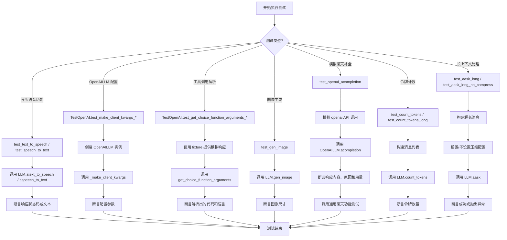

## 类结构

```
TestOpenAI (测试类)
├── test_make_client_kwargs_without_proxy (方法)
├── test_make_client_kwargs_with_proxy (方法)
├── test_get_choice_function_arguments_for_aask_code (方法)
└── test_aask_code_json_decode_error (方法)
```

## 全局变量及字段


### `name`
    
AI助手的名称，用于格式化响应内容模板

类型：`str`
    


### `resp_cont`
    
根据名称格式化后的预期响应内容，用于测试断言

类型：`str`
    


### `default_resp`
    
模拟的OpenAI聊天完成响应对象，用于测试

类型：`ChatCompletion`
    


### `default_resp_chunk`
    
模拟的OpenAI流式聊天完成响应块，用于测试流式响应

类型：`ChatCompletionChunk`
    


### `usage`
    
模拟的OpenAI API使用量统计对象，包含token计数

类型：`CompletionUsage`
    


    

## 全局函数及方法

### `test_text_to_speech`

这是一个使用 `pytest` 框架编写的异步单元测试函数，用于测试 `LLM` 类的 `atext_to_speech` 方法。该测试验证了文本转语音（TTS）功能的基本调用流程，确保 API 调用返回成功的 HTTP 状态码（200）。

参数：
- 无显式参数。作为 `pytest` 测试函数，它通过 `@pytest.mark.asyncio` 装饰器被识别为异步测试。

返回值：`None`，测试函数通常不返回值，而是通过 `assert` 语句验证测试结果。

#### 流程图

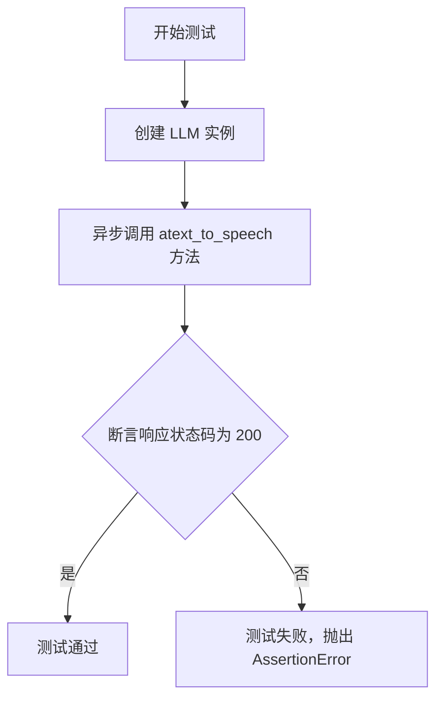

#### 带注释源码

```python
@pytest.mark.asyncio  # 标记此函数为异步测试，以便 pytest-asyncio 插件能够正确处理
async def test_text_to_speech():
    # 1. 实例化 LLM 类
    llm = LLM()
    
    # 2. 异步调用文本转语音方法
    #    - model: 指定使用的 TTS 模型（例如 "tts-1"）
    #    - voice: 指定语音音色（例如 "alloy"）
    #    - input: 提供要转换为语音的文本内容
    resp = await llm.atext_to_speech(
        model="tts-1",
        voice="alloy",
        input="人生说起来长，但直到一个岁月回头看，许多事件仅是仓促的。一段一段拼凑一起，合成了人生。苦难当头时，当下不免觉得是折磨；回头看，也不够是一段短短的人生旅程。",
    )
    
    # 3. 断言验证：检查 HTTP 响应状态码是否为 200（成功）
    #    这是测试的核心，确保 API 调用没有发生网络或服务端错误。
    assert 200 == resp.response.status_code
```

### `test_speech_to_text`

这是一个使用 `pytest` 框架编写的异步测试函数，用于测试 `LLM` 类的 `aspeech_to_text` 方法。该测试验证了语音转文本功能：它打开一个本地的 MP3 音频文件，调用语音识别模型进行处理，并断言返回的文本内容为“你好”。

参数：

- `无显式参数`：`N/A`，这是一个 `pytest` 测试函数，不直接接收外部参数。`pytest` 框架会自动发现并运行它。

返回值：`None`，测试函数通常不返回值，而是通过 `assert` 语句来验证测试结果。如果断言失败，测试将失败。

#### 流程图

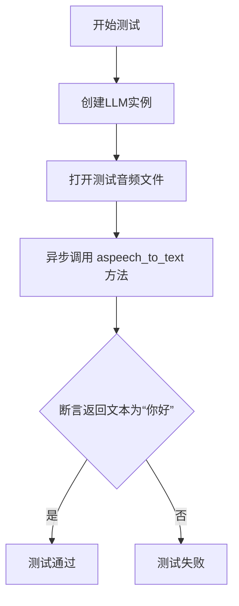

#### 带注释源码

```python
@pytest.mark.asyncio  # 标记此函数为异步测试函数，以便 pytest-asyncio 插件处理
async def test_speech_to_text():
    # 1. 实例化 LLM 类
    llm = LLM()
    
    # 2. 打开位于测试数据路径下的音频文件 'hello.mp3'
    #    TEST_DATA_PATH 是一个常量，指向项目中的测试数据目录
    audio_file = open(f"{TEST_DATA_PATH}/audio/hello.mp3", "rb")  # 以二进制读取模式打开文件
    
    # 3. 异步调用语音转文本方法
    #    file: 打开的音频文件对象
    #    model: 指定使用的语音识别模型为 'whisper-1' (OpenAI Whisper 模型)
    resp = await llm.aspeech_to_text(file=audio_file, model="whisper-1")
    
    # 4. 断言：验证识别结果 resp.text 是否等于字符串 "你好"
    #    如果相等，测试通过；如果不相等，测试失败并抛出 AssertionError
    assert "你好" == resp.text
```

### `tool_calls_rsp`

这是一个 Pytest 测试夹具（fixture），用于生成一个模拟的 OpenAI ChatCompletion 响应列表。该响应模拟了 LLM 在工具调用（Tool Calls）场景下的多种可能输出，包括：1）标准的工具调用响应；2）纯文本响应；3）模拟 OpenAI API 的一个已知“bug”，即代码内容出现在 `content` 字段而非 `function.arguments` 中。此夹具主要用于测试 `OpenAILLM.get_choice_function_arguments` 方法处理不同响应格式的能力。

参数：
- 无参数。

返回值：`list[openai.types.chat.ChatCompletion]`，一个包含多个模拟 ChatCompletion 对象的列表，每个对象代表一种可能的工具调用响应格式。

#### 流程图

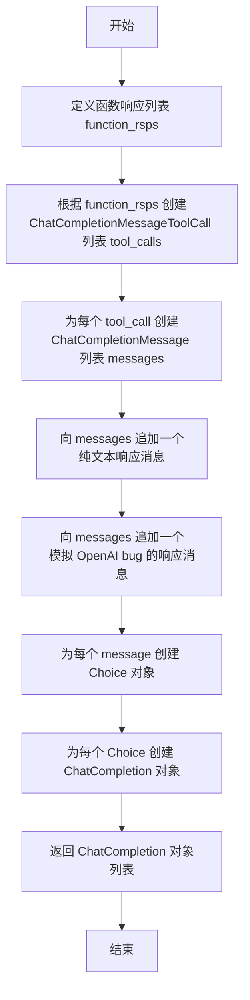

#### 带注释源码

```python
@pytest.fixture
def tool_calls_rsp():
    # 1. 定义一个函数响应列表，模拟 LLM 返回的工具调用参数。
    function_rsps = [
        Function(arguments='{\n"language": "python",\n"code": "print(\'hello world\')"}', name="execute"),
    ]
    # 2. 将函数响应包装成 Tool Call 对象。
    tool_calls = [
        ChatCompletionMessageToolCall(type="function", id=f"call_{i}", function=f) for i, f in enumerate(function_rsps)
    ]
    # 3. 为每个 Tool Call 创建一个助手消息，content 为 None，tool_calls 包含对应的调用。
    messages = [ChatCompletionMessage(content=None, role="assistant", tool_calls=[t]) for t in tool_calls]
    # 4. 添加一个纯文本响应，模拟 LLM 直接返回文本而非工具调用的情况。
    messages.append(
        ChatCompletionMessage(content="Completed a python code for hello world!", role="assistant", tool_calls=None)
    )
    # 5. 添加一个模拟 OpenAI API “bug” 的响应：代码内容出现在 content 字段中。
    messages.extend(
        [
            ChatCompletionMessage(content="```python\nprint('hello world')```", role="assistant", tool_calls=None),
        ]
    )
    # 6. 将每个消息包装成 Choice 对象。
    choices = [
        Choice(finish_reason="tool_calls", logprobs=None, index=i, message=msg) for i, msg in enumerate(messages)
    ]
    # 7. 为每个 Choice 创建一个完整的 ChatCompletion 响应对象，并放入列表返回。
    return [
        ChatCompletion(id=str(i), choices=[c], created=i, model="gpt-4", object="chat.completion")
        for i, c in enumerate(choices)
    ]
```

### `json_decode_error`

这是一个 Pytest 测试夹具（fixture），用于模拟一个包含 JSON 解码错误的 OpenAI ChatCompletion 响应。它构造了一个 `ChatCompletion` 对象，其中 `Function.arguments` 字段包含一个格式错误的 JSON 字符串（使用了单引号），用于测试 `OpenAILLM.get_choice_function_arguments` 方法处理 JSON 解码异常的能力。

参数：
- 无参数

返回值：`ChatCompletion`，一个模拟的、包含格式错误 JSON 参数的 OpenAI 聊天完成响应对象。

#### 流程图

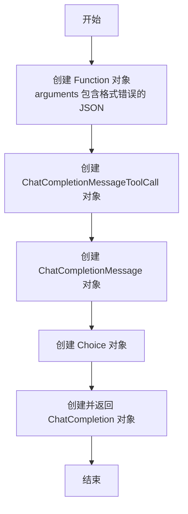

#### 带注释源码

```python
@pytest.fixture
def json_decode_error():
    # 创建一个 Function 对象，其 arguments 字段包含一个格式错误的 JSON 字符串。
    # 注意：JSON 标准要求字符串使用双引号，这里错误地使用了单引号包裹 'python'。
    function_rsp = Function(arguments='{\n"language": \'python\',\n"code": "print(\'hello world\')"}', name="execute")
    # 使用上面的 Function 对象创建一个工具调用（Tool Call）对象。
    tool_calls = [ChatCompletionMessageToolCall(type="function", id=f"call_{0}", function=function_rsp)]
    # 创建一个助手消息，内容为空，但包含上面的工具调用。
    message = ChatCompletionMessage(content=None, role="assistant", tool_calls=tool_calls)
    # 将消息包装到一个 Choice 对象中。
    choices = [Choice(finish_reason="tool_calls", logprobs=None, index=0, message=message)]
    # 创建并返回一个完整的 ChatCompletion 响应对象，其中包含了可能引发 JSON 解码错误的参数。
    return ChatCompletion(id="0", choices=choices, created=0, model="gpt-4", object="chat.completion")
```

### `test_gen_image`

这是一个使用 `pytest` 框架编写的异步测试函数，用于测试 `LLM` 类的 `gen_image` 方法。该测试验证了通过不同的响应格式（URL 和 base64 JSON）调用图像生成 API 时，能否成功返回指定尺寸的图像。

参数：

- `无显式参数`：`None`，这是一个 `pytest` 测试函数，不接收外部参数。它通过 `@pytest.mark.asyncio` 装饰器标记为异步测试。

返回值：`None`，测试函数通常不返回值，而是通过 `assert` 语句来验证测试结果。

#### 流程图

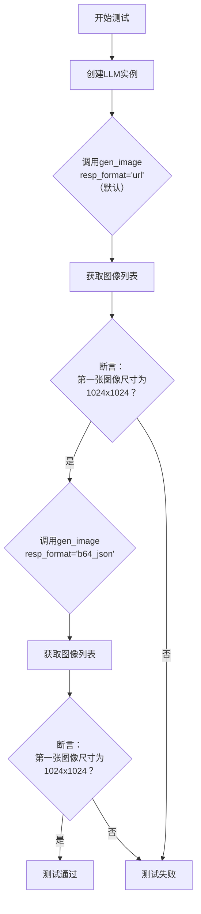

#### 带注释源码

```python
@pytest.mark.asyncio  # 标记此函数为异步测试，以便pytest-asyncio插件能正确处理
async def test_gen_image():  # 定义异步测试函数
    llm = LLM()  # 实例化LLM类，用于调用其图像生成方法
    model = "dall-e-3"  # 指定使用的图像生成模型
    prompt = 'a logo with word "MetaGPT"'  # 定义生成图像的文本提示词
    # 第一次调用：使用默认的响应格式（推测为'url'，返回图像URL）
    images: list[Image] = await llm.gen_image(model=model, prompt=prompt)
    # 断言：验证返回的第一张图像的尺寸是否为1024x1024像素
    assert images[0].size == (1024, 1024)

    # 第二次调用：显式指定响应格式为'b64_json'，返回base64编码的图像数据
    images: list[Image] = await llm.gen_image(model=model, prompt=prompt, resp_format="b64_json")
    # 断言：再次验证返回的第一张图像的尺寸是否为1024x1024像素
    assert images[0].size == (1024, 1024)
```

### `mock_openai_acompletions_create`

这是一个用于模拟 OpenAI 异步聊天补全 API 调用的辅助函数。它根据传入的 `stream` 参数，返回一个预定义的、模拟的 `ChatCompletionChunk` 对象或一个包含该对象的异步迭代器，用于在单元测试中替代真实的 API 调用。

参数：

- `self`：`Any`，此参数用于在类方法中绑定实例，但在本函数中未使用。
- `stream`：`bool`，默认为 `False`。指示是否以流式模式返回响应。如果为 `True`，则返回一个异步迭代器；如果为 `False`，则直接返回一个 `ChatCompletionChunk` 对象。
- `**kwargs`：`Any`，用于接收其他任意关键字参数，以模拟真实 API 调用中可能传入的各种参数，但在此函数中未使用。

返回值：`Union[ChatCompletionChunk, AsyncIterator]`，根据 `stream` 参数，返回一个模拟的聊天补全响应对象或一个包含该对象的异步迭代器。

#### 流程图

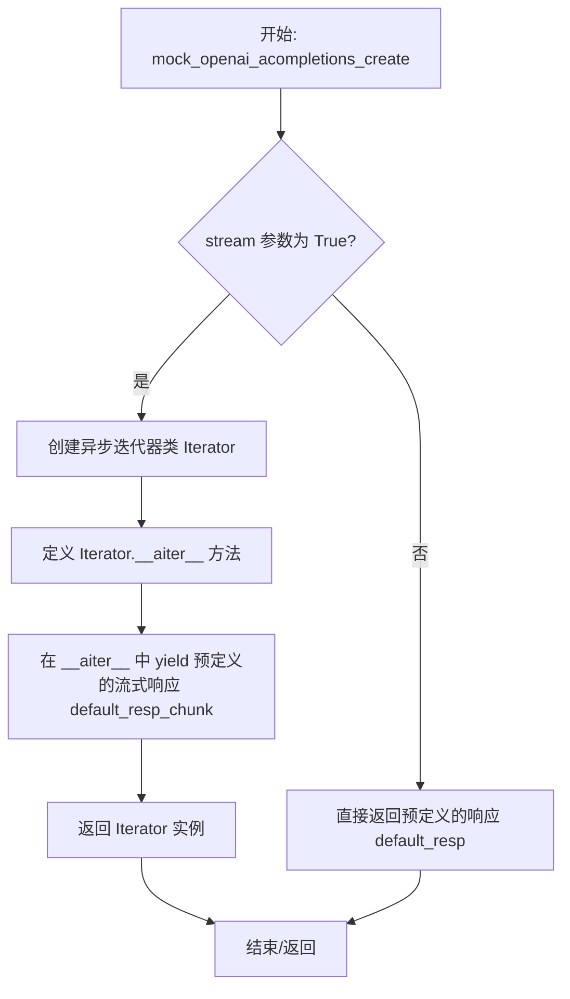

#### 带注释源码

```python
async def mock_openai_acompletions_create(self, stream: bool = False, **kwargs) -> ChatCompletionChunk:
    # 检查是否请求流式响应
    if stream:
        # 定义一个内部类来模拟异步迭代器
        class Iterator(object):
            # 实现异步迭代器协议
            async def __aiter__(self):
                # 每次迭代时，返回预定义的流式响应块
                yield default_resp_chunk
        # 返回迭代器实例，模拟流式 API 的响应
        return Iterator()
    else:
        # 非流式模式，直接返回预定义的完整响应对象
        return default_resp
```

### `test_openai_acompletion`

这是一个使用 `pytest` 和 `mocker` 编写的异步单元测试函数，用于测试 `OpenAILLM` 类的 `acompletion` 方法。它通过模拟（mock）OpenAI API 的异步响应，验证 `acompletion` 方法在接收到模拟的 API 响应后，能否正确解析并返回预期的结果。测试内容包括验证响应的内容、完成原因和令牌使用量。

参数：

- `mocker`：`pytest-mock` 提供的 `MockerFixture` 类型对象，用于在测试中创建和管理模拟（mock）对象。

返回值：`None`，这是一个测试函数，不返回任何值，其成功与否由内部的断言（`assert`）语句决定。

#### 流程图

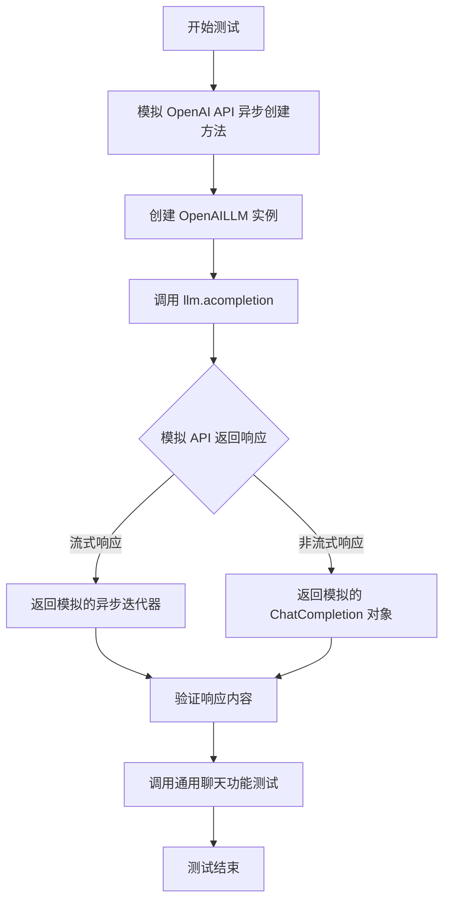

#### 带注释源码

```python
@pytest.mark.asyncio  # 标记此函数为异步测试函数
async def test_openai_acompletion(mocker):  # 定义异步测试函数，接收 mocker 参数用于模拟
    # 使用 mocker 模拟 `openai.resources.chat.completions.AsyncCompletions.create` 方法
    # 将其替换为自定义的 `mock_openai_acompletions_create` 函数
    mocker.patch("openai.resources.chat.completions.AsyncCompletions.create", mock_openai_acompletions_create)

    # 使用模拟的配置创建 OpenAILLM 实例
    llm = OpenAILLM(mock_llm_config)

    # 异步调用 llm 实例的 acompletion 方法，传入预定义的 messages
    resp = await llm.acompletion(messages)
    # 断言：验证响应中第一个选择项的完成原因为 "stop"
    assert resp.choices[0].finish_reason == "stop"
    # 断言：验证响应中第一个选择项的消息内容等于预期的 resp_cont
    assert resp.choices[0].message.content == resp_cont
    # 断言：验证响应的令牌使用量等于预定义的 usage
    assert resp.usage == usage

    # 调用另一个通用的聊天功能测试函数，对 llm 进行更多验证
    await llm_general_chat_funcs_test(llm, prompt, messages, resp_cont)
```

### `test_count_tokens`

这是一个单元测试函数，用于测试 `LLM` 类的 `count_tokens` 方法。它创建了一个包含多条系统消息、用户消息和助手消息的列表，然后调用 `count_tokens` 方法来计算这些消息的总令牌数，并验证计算结果是否符合预期。

参数：
- 无显式参数。该函数是一个测试用例，不接收外部参数。

返回值：`None`，该函数是一个测试用例，不返回业务值，仅通过断言（`assert`）来验证测试结果。

#### 流程图

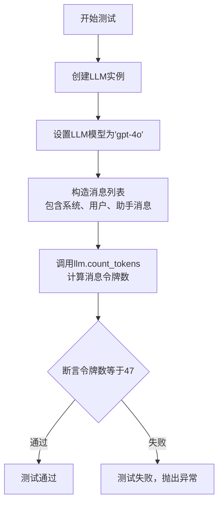

#### 带注释源码

```python
def test_count_tokens():
    # 1. 创建LLM类的实例
    llm = LLM()
    # 2. 设置要测试的模型为'gpt-4o'
    llm.model = "gpt-4o"
    # 3. 构造一个消息列表，用于测试令牌计数功能。
    #    列表包含两条系统消息、两条用户消息和两条助手消息。
    messages = [
        llm._system_msg("some system msg"),
        llm._system_msg("some system message 2"),
        llm._user_msg("user 1"),
        llm._assistant_msg("assistant 1"),
        llm._user_msg("user 1"),
        llm._assistant_msg("assistant 2"),
    ]
    # 4. 调用LLM实例的count_tokens方法，计算上述消息列表的总令牌数。
    cnt = llm.count_tokens(messages)
    # 5. 使用断言验证计算出的令牌数是否等于预期值47。
    #    这是测试的核心验证点，确保count_tokens方法逻辑正确。
    assert cnt == 47
```

### `test_count_tokens_long`

这是一个单元测试函数，用于测试 `LLM` 类的 `count_tokens` 方法在处理超长消息时的行为。它验证了当输入消息的令牌数远超模型上下文限制时，`count_tokens` 方法能否正确估算令牌数量，并且对于非OpenAI模型，能够回退到启发式估算方法。

参数：
- 无显式参数。作为 `pytest` 测试函数，它通过 `def` 定义，不接收外部参数。

返回值：`None`，这是一个测试函数，其主要目的是通过 `assert` 语句验证预期行为，不返回业务逻辑值。

#### 流程图

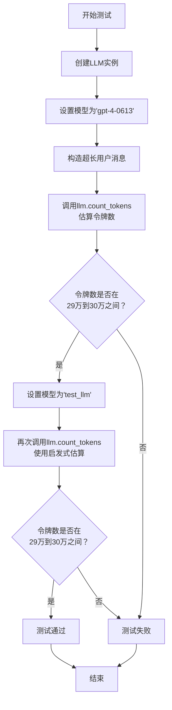

#### 带注释源码

```python
def test_count_tokens_long():
    # 1. 创建LLM类的一个实例
    llm = LLM()
    
    # 2. 将模型设置为一个特定的OpenAI模型（gpt-4-0613）
    llm.model = "gpt-4-0613"
    
    # 3. 构造一个超长的测试消息内容：将0到99999的数字用空格连接成一个长字符串
    test_msg_content = " ".join([str(i) for i in range(100000)])
    
    # 4. 构建消息列表，包含一个系统消息和一个包含超长内容的用户消息
    messages = [
        llm._system_msg("You are a helpful assistant"),
        llm._user_msg(test_msg_content + " what's the first number you see?"),
    ]
    
    # 5. 调用 count_tokens 方法估算消息的令牌数。
    #    对于OpenAI模型，此方法应使用tiktoken库进行精确估算。
    cnt = llm.count_tokens(messages)  # 预期结果约为299023，即~300k令牌
    
    # 6. 断言估算的令牌数在29万到30万之间，验证长文本处理能力
    assert 290000 <= cnt <= 300000

    # 7. 将模型切换为一个非OpenAI模型（'test_llm'）
    llm.model = "test_llm"  # 一个非openai模型
    
    # 8. 再次调用 count_tokens 方法。
    #    对于非OpenAI模型，预期会回退到启发式估算方法（例如，基于字符数/单词数）。
    cnt = llm.count_tokens(messages)  # 预期结果约为294474，与精确估算有约2%差异
    
    # 9. 断言启发式估算的结果也在29万到30万之间，验证回退逻辑的有效性
    assert 290000 <= cnt <= 300000
```

### `test_aask_long`

这是一个异步测试函数，用于验证 `LLM` 类的 `aask` 方法在处理超长上下文（远超模型限制）时，在启用了消息压缩功能（`CompressType.POST_CUT_BY_TOKEN`）的情况下能否正常工作，而不会因上下文过长而失败。

参数：
-  `llm`：`LLM`，被测试的 `LLM` 类实例。
-  `llm.model`：`str`，设置测试使用的模型为 `"deepseek-ai/DeepSeek-Coder-V2-Instruct"`，该模型有上下文长度限制（如32k）。
-  `llm.config.compress_type`：`CompressType`，设置消息压缩类型为 `POST_CUT_BY_TOKEN`，表示在请求后根据令牌数进行截断。
-  `test_msg_content`：`str`，通过连接0到99999的数字字符串生成一个超长的测试消息内容，模拟约30万个令牌的输入。
-  `messages`：`list`，构造的对话消息列表，包含一个系统消息和一个包含超长内容的用户消息。

返回值：`None`，这是一个测试函数，其主要目的是验证 `await llm.aask(messages)` 的调用不会抛出异常。它使用 `pytest.mark.skip` 装饰器，表示默认跳过此测试。

#### 流程图

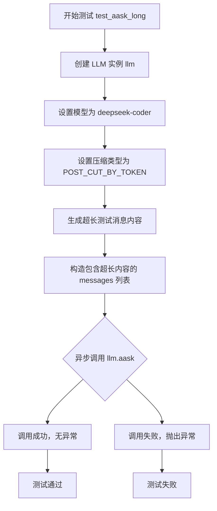

#### 带注释源码

```python
@pytest.mark.skip  # 标记此测试用例默认跳过，可能因为执行耗时、依赖特定环境或作为示例
@pytest.mark.asyncio  # 标记此函数为异步测试函数
async def test_aask_long():
    # 1. 创建被测试的 LLM 实例
    llm = LLM()
    # 2. 配置测试模型（此模型有上下文长度限制，如32k）
    llm.model = "deepseek-ai/DeepSeek-Coder-V2-Instruct"  # deepseek-coder on siliconflow, limit 32k
    # 3. 启用特定的消息压缩策略，以处理超长上下文
    llm.config.compress_type = CompressType.POST_CUT_BY_TOKEN
    # 4. 生成一个超长的字符串作为测试输入，模拟远超模型限制的令牌数
    test_msg_content = " ".join([str(i) for i in range(100000)])  # corresponds to ~300k tokens
    # 5. 构造对话消息列表，包含系统指令和超长的用户查询
    messages = [
        llm._system_msg("You are a helpful assistant"),
        llm._user_msg(test_msg_content + " what's the first number you see?"),
    ]
    # 6. 核心测试点：异步调用 aask 方法。期望在压缩功能启用后，即使输入超长也不会抛出异常。
    await llm.aask(messages)  # should not fail with context truncated
```

### `test_aask_long_no_compress`

这是一个异步测试函数，用于验证当不启用消息压缩功能时，向一个上下文窗口较小的LLM模型（如DeepSeek-Coder-V2-Instruct，限制32k tokens）发送远超其限制的超长消息时，是否会如预期般抛出异常。该测试旨在确保系统的错误处理机制在输入超出模型处理能力时能正确工作。

参数：
-   `无显式参数`：`N/A`，这是一个使用 `pytest.mark.asyncio` 装饰的测试函数，其参数由 `pytest` 框架自动注入（如 `mocker` 等），但函数定义本身未声明任何参数。

返回值：`None`，测试函数通常不返回有意义的值，其成功与否由 `assert` 语句或预期的异常（如本测试中的 `pytest.raises`）决定。

#### 流程图

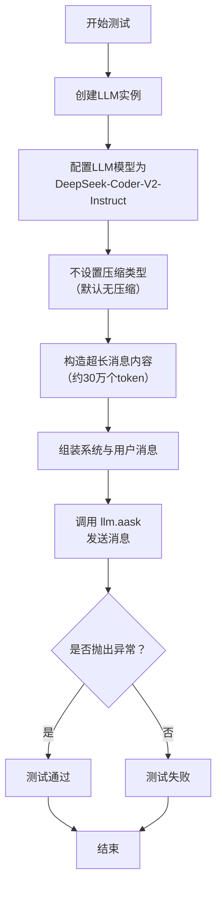

#### 带注释源码

```python
@pytest.mark.skip  # 标记此测试为跳过，通常因为依赖外部服务或耗时较长
@pytest.mark.asyncio  # 标记为异步测试函数
async def test_aask_long_no_compress():
    # 1. 创建LLM实例
    llm = LLM()
    # 2. 配置模型为DeepSeek-Coder-V2-Instruct，其上下文窗口限制为32k tokens
    llm.model = "deepseek-ai/DeepSeek-Coder-V2-Instruct"  # deepseek-coder on siliconflow, limit 32k
    # 3. 不指定压缩类型，即使用默认值（空字符串），表示不进行消息压缩
    # Not specifying llm.config.compress_type will use default "", no compress
    # 4. 构造一个超长的测试消息内容，由0到99999的数字字符串拼接而成，约对应30万个token
    test_msg_content = " ".join([str(i) for i in range(100000)])  # corresponds to ~300k tokens
    # 5. 组装消息列表，包含一条系统消息和一条包含超长内容的用户消息
    messages = [
        llm._system_msg("You are a helpful assistant"),
        llm._user_msg(test_msg_content + " what's the first number you see?"),
    ]
    # 6. 使用pytest.raises上下文管理器，断言调用llm.aask会抛出异常
    # 这是因为消息长度（~300k tokens）远超模型限制（32k tokens），且未启用压缩
    with pytest.raises(Exception):
        await llm.aask(messages)  # should fail
```

### `TestOpenAI.test_make_client_kwargs_without_proxy`

这是一个单元测试方法，用于测试`OpenAILLM`类的`_make_client_kwargs`方法在不使用代理配置时的行为。它验证了当传入不包含代理设置的模拟配置时，生成的客户端参数字典包含正确的API密钥和基础URL，并且不包含`http_client`键。

参数：
- `self`：`TestOpenAI`，测试类实例的引用。

返回值：`None`，这是一个测试方法，不返回任何值，仅通过断言进行验证。

#### 流程图

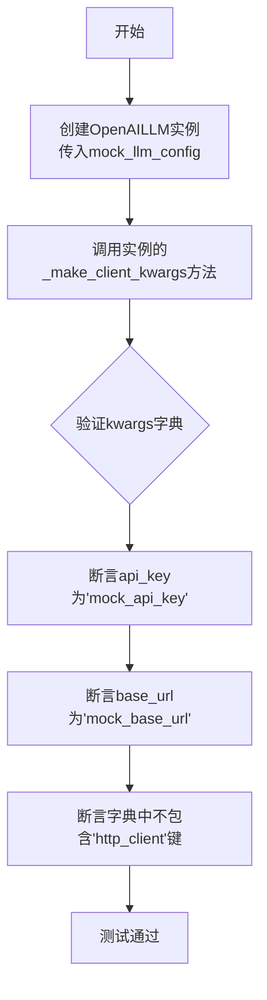

#### 带注释源码

```python
def test_make_client_kwargs_without_proxy(self):
    # 1. 创建OpenAILLM实例，传入不包含代理配置的模拟配置对象
    instance = OpenAILLM(mock_llm_config)
    # 2. 调用内部方法_make_client_kwargs来生成用于构建OpenAI客户端的参数字典
    kwargs = instance._make_client_kwargs()
    # 3. 断言生成的参数字典中，api_key字段的值与模拟配置中的一致
    assert kwargs["api_key"] == "mock_api_key"
    # 4. 断言生成的参数字典中，base_url字段的值与模拟配置中的一致
    assert kwargs["base_url"] == "mock_base_url"
    # 5. 断言生成的参数字典中不包含'http_client'键，因为模拟配置中没有设置代理
    assert "http_client" not in kwargs
```

### `TestOpenAI.test_make_client_kwargs_with_proxy`

该方法用于测试 `OpenAILLM` 类的 `_make_client_kwargs` 方法在配置了代理（proxy）时的行为。它验证当 `OpenAILLM` 实例使用包含代理配置的 `mock_llm_config_proxy` 初始化时，`_make_client_kwargs` 方法返回的字典中是否包含 `"http_client"` 键，该键用于配置HTTP客户端以通过代理进行网络请求。

参数：
- `self`：`TestOpenAI` 类的实例，用于访问测试类中的其他方法或属性。

返回值：`None`，这是一个测试方法，其主要目的是通过断言（assert）来验证代码行为，不返回具体值。

#### 流程图

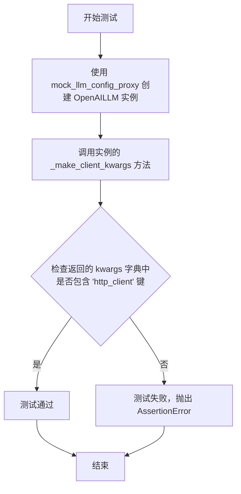

#### 带注释源码

```python
def test_make_client_kwargs_with_proxy(self):
    # 使用包含代理配置的模拟配置创建 OpenAILLM 实例
    instance = OpenAILLM(mock_llm_config_proxy)
    # 调用内部方法生成用于创建 OpenAI 客户端的参数字典
    kwargs = instance._make_client_kwargs()
    # 断言：验证返回的参数字典中包含 'http_client' 键，
    # 这表明代理配置已正确应用，将用于构建通过代理发送请求的HTTP客户端。
    assert "http_client" in kwargs
```

### `TestOpenAI.test_get_choice_function_arguments_for_aask_code`

该方法用于测试 `OpenAILLM.get_choice_function_arguments` 函数从 OpenAI 聊天完成响应中提取工具调用（Tool Call）参数的能力。它验证了函数能够正确处理包含工具调用、纯文本响应以及特殊格式内容的响应，并正确解析出代码和语言信息。

参数：

- `self`：`TestOpenAI`，测试类实例
- `tool_calls_rsp`：`list[ChatCompletion]`，通过 pytest fixture 提供的模拟 OpenAI 聊天完成响应列表，包含多种响应类型用于测试

返回值：`None`，这是一个测试方法，不返回业务值，通过断言验证功能

#### 流程图

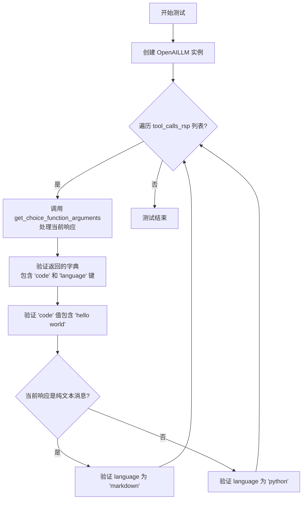

#### 带注释源码

```python
def test_get_choice_function_arguments_for_aask_code(self, tool_calls_rsp):
    # 1. 创建 OpenAILLM 实例，使用带代理的模拟配置
    instance = OpenAILLM(mock_llm_config_proxy)
    
    # 2. 遍历所有提供的模拟响应进行测试
    for i, rsp in enumerate(tool_calls_rsp):
        # 3. 调用核心方法，从响应中提取函数调用参数
        code = instance.get_choice_function_arguments(rsp)
        
        # 4. 记录日志用于调试
        logger.info(f"\ntest get function call arguments {i}: {code}")
        
        # 5. 验证返回的字典包含必要的键
        assert "code" in code
        assert "language" in code
        assert "hello world" in code["code"]
        logger.info(f'code is : {code["code"]}')

        # 6. 根据响应内容类型验证语言字段
        #    如果是纯文本完成消息，语言应为 markdown
        #    如果是工具调用或代码块，语言应为 python
        if "Completed a python code for hello world!" == code["code"]:
            code["language"] == "markdown"
        else:
            code["language"] == "python"
```

### `TestOpenAI.test_aask_code_json_decode_error`

这是一个单元测试方法，用于测试 `OpenAILLM.get_choice_function_arguments` 方法在解析包含JSON语法错误的函数调用参数时的行为。它模拟了一个来自OpenAI API的响应，其中 `arguments` 字段的JSON字符串使用了单引号（`'python'`），这不符合JSON规范，可能导致解析失败。该测试旨在验证 `get_choice_function_arguments` 方法能够优雅地处理此类错误，并返回一个包含有效 `code` 和 `language` 字段的字典。

参数：
- `self`：`TestOpenAI`，测试类实例的引用。
- `json_decode_error`：`pytest.fixture`，一个返回 `ChatCompletion` 对象的pytest fixture。该对象模拟了一个包含JSON语法错误的工具调用响应。

返回值：`None`，这是一个单元测试方法，不返回任何值，仅通过断言来验证代码行为。

#### 流程图

```mermaid
flowchart TD
    A[开始测试<br>test_aask_code_json_decode_error] --> B[调用fixture<br>json_decode_error]
    B --> C[创建OpenAILLM实例<br>instance = OpenAILLM(mock_llm_config)]
    C --> D[调用被测方法<br>code = instance.get_choice_function_arguments(json_decode_error)]
    D --> E{断言验证}
    E --> F[断言code字典包含'code'键]
    E --> G[断言code字典包含'language'键]
    E --> H[断言code['code']包含'hello world']
    F & G & H --> I[记录日志<br>logger.info]
    I --> J[测试结束]
```

#### 带注释源码

```python
def test_aask_code_json_decode_error(self, json_decode_error):
    # 1. 创建OpenAILLM实例，使用不包含代理的模拟配置
    instance = OpenAILLM(mock_llm_config)
    
    # 2. 调用核心测试方法：尝试从包含JSON语法错误的响应中提取函数参数
    #    参数 `json_decode_error` 是一个模拟的ChatCompletion对象，
    #    其 `arguments` 字段为 `'{\n"language": \'python\',\n"code": "print(\'hello world\')"}'`，
    #    其中 `'python'` 使用了单引号，是无效的JSON。
    code = instance.get_choice_function_arguments(json_decode_error)
    
    # 3. 验证 `get_choice_function_arguments` 方法成功处理了错误并返回了预期的字典结构。
    #    这些断言确保即使原始JSON有语法问题，方法也能提取或生成有效的代码信息。
    assert "code" in code        # 字典应包含'code'键
    assert "language" in code    # 字典应包含'language'键
    assert "hello world" in code["code"]  # 'code'字段的值应包含预期的字符串
    
    # 4. 记录提取到的代码内容，用于调试或验证输出。
    logger.info(f'code is : {code["code"]}')
```

## 关键组件


### LLM 类

作为与大型语言模型交互的核心抽象层，提供文本生成、语音合成与识别、图像生成、上下文长度管理等多种功能的统一接口。

### OpenAILLM 类

OpenAI 系列模型的具体实现类，负责处理与 OpenAI API 的通信，包括客户端配置、请求构造以及特定于 OpenAI 格式的响应解析（如工具调用参数提取）。

### 工具调用 (Tool Calls) 解析

用于解析和处理来自 LLM 的 `tool_calls` 响应，特别是从 `ChatCompletionMessageToolCall` 中提取 `Function` 的 `arguments` 字段（通常为 JSON 字符串），并将其转换为可用的字典结构，同时处理潜在的 JSON 解码错误。

### 上下文长度管理与压缩 (Context Length Management & Compression)

通过 `count_tokens` 方法估算消息的令牌消耗，并结合 `CompressType` 配置（如 `POST_CUT_BY_TOKEN`）对超出模型限制的长上下文进行后处理压缩，以防止请求失败。

### 多模态功能集成 (Multimodal Integration)

集成文本转语音 (`atext_to_speech`)、语音转文本 (`aspeech_to_text`) 和图像生成 (`gen_image`) 功能，展示了 LLM 类对 OpenAI 多模态 API 的封装能力。

### 测试框架与 Mock 机制

使用 `pytest` 框架和 `mocker` 工具构建了完整的单元测试和集成测试套件，通过模拟 API 响应 (`mock_openai_acompletions_create`) 和提供测试夹具 (`tool_calls_rsp`, `json_decode_error`) 来验证核心逻辑，确保代码的可靠性和隔离性。


## 问题及建议


### 已知问题

-   **测试代码中存在硬编码的路径和模型名称**：例如 `f"{TEST_DATA_PATH}/audio/hello.mp3"` 和 `model="tts-1"`。这降低了测试的可移植性和可维护性，当文件路径或模型名称变更时，需要手动修改多处代码。
-   **模拟响应数据构造复杂且分散**：测试用例中（如 `tool_calls_rsp` 和 `json_decode_error` fixture）手动构造了复杂的 `ChatCompletion` 对象来模拟LLM响应。这种构造方式容易出错，且与真实API响应的同步维护成本高。
-   **存在被跳过的集成测试**：`test_aask_long` 和 `test_aask_long_no_compress` 测试用例被 `@pytest.mark.skip` 装饰，这意味着涉及长上下文压缩的关键功能未在CI中持续验证，存在回归风险。
-   **部分测试断言过于宽松**：例如 `test_count_tokens_long` 中，断言令牌数在 `290000` 到 `300000` 之间，范围过宽（相差1万），可能掩盖了令牌计算逻辑的细微错误。
-   **测试用例职责不单一**：`test_openai_acompletion` 测试用例同时测试了 `acompletion` 方法和 `llm_general_chat_funcs_test` 辅助函数，违反了单元测试的单一职责原则，不利于问题定位。
-   **全局测试变量定义不清晰**：代码开头定义了 `name`、`resp_cont`、`default_resp` 等多个全局变量，它们被多个测试用例使用，但缺乏清晰的注释说明其用途和关联关系，增加了理解成本。

### 优化建议

-   **将硬编码值提取为配置或常量**：建议将测试音频文件路径、模型名称等硬编码字符串提取到测试配置文件或模块级常量中，便于统一管理和修改。
-   **使用工厂函数或Fixture集中管理模拟数据**：可以创建专门的工厂函数（如 `create_mock_chat_completion`）来生成各种场景下的模拟响应，减少重复代码，提高模拟数据的一致性和可维护性。
-   **启用并完善集成测试**：移除 `@pytest.mark.skip` 装饰器，并确保这些测试能在可控的环境（如使用测试专用的LLM API Key和端点）下运行。可以考虑使用 `pytest.mark.integration` 标记它们，以便在CI中与单元测试分开执行。
-   **收紧测试断言范围**：对于 `test_count_tokens_long` 这类测试，应基于确定的输入和已知的令牌化算法计算出一个更精确的期望值，或至少大幅缩小断言范围，以提高测试的敏感度和可靠性。
-   **拆分复合功能的测试用例**：将 `test_openai_acompletion` 拆分为两个独立的测试用例，一个专门测试 `acompletion` 方法，另一个测试 `llm_general_chat_funcs_test` 辅助函数。
-   **为全局测试变量添加文档注释**：在定义这些全局变量的地方，添加注释说明每个变量的用途、格式以及它们之间的依赖关系，提升代码可读性。
-   **考虑使用更专业的测试工具**：对于模拟OpenAI API响应，可以考虑使用像 `responses` 或 `pytest-httpx` 这样的库来拦截HTTP请求并返回预设的响应，这比手动修补内部方法（`mock_openai_acompletions_create`）更接近真实调用链路，也更稳定。
-   **增加错误和边界条件测试**：当前测试主要覆盖了正常路径和少数异常（如JSON解码错误）。建议增加更多边界条件测试，例如测试空消息列表、极大/极小的令牌数、网络超时、API返回非预期结构等情况。


## 其它


### 设计目标与约束

本测试套件的核心设计目标是验证`LLM`和`OpenAILLM`类中与OpenAI API交互相关的核心功能，包括文本生成、语音处理、图像生成、工具调用参数解析以及长上下文处理。约束条件包括：1) 依赖外部模拟数据（如`TEST_DATA_PATH`下的音频文件）和模拟响应（`mock_openai_acompletions_create`）；2) 部分测试（如`test_aask_long`）因依赖特定模型和网络环境而被标记为跳过(`@pytest.mark.skip`)；3) 测试设计需覆盖正常流程、边界条件（如JSON解析错误）和特定配置（如代理设置）。

### 错误处理与异常设计

测试代码中明确设计了针对异常情况的验证点：1) 在`test_get_choice_function_arguments_for_aask_code`中，测试了处理OpenAI工具调用响应中`content`字段异常包含代码的情况；2) 在`test_aask_code_json_decode_error`中，专门测试了`get_choice_function_arguments`方法处理JSON格式错误的`arguments`字符串时的健壮性，确保其能优雅降级或正确解析；3) 在`test_aask_long_no_compress`中，预期当不启用消息压缩且输入超出模型上下文限制时会抛出异常，并通过`pytest.raises(Exception)`进行断言。

### 数据流与状态机

测试的数据流主要围绕`LLM`/`OpenAILLM`实例的方法调用展开：1) **输入流**：测试数据来源于固定模板(`resp_cont_tmpl`)、模拟响应生成函数(`get_openai_chat_completion`)、本地文件(`hello.mp3`)以及动态生成的超长字符串。2) **处理流**：测试方法调用LLM实例的对应方法（如`acompletion`, `atext_to_speech`, `get_choice_function_arguments`），这些方法内部会处理输入并可能调用（或被模拟替换）底层API客户端。3) **输出验证流**：通过断言(`assert`)验证返回值的状态码、文本内容、结构（如`ChatCompletion`对象的字段）、图像尺寸或令牌数量是否符合预期。测试本身不涉及复杂的状态机，但验证了LLM类在不同配置（如是否启用代理、是否启用消息压缩）下的行为。

### 外部依赖与接口契约

1.  **外部服务依赖**：核心依赖OpenAI API（包括Chat Completions, TTS, STT, DALL-E）及其Python SDK(`openai`)。测试通过Mock（`mocker.patch`）和模拟响应来避免真实网络调用。
2.  **项目内部依赖**：
    *   `metagpt.llm.LLM`: 被测试的主要高层接口。
    *   `metagpt.provider.OpenAILLM`: 被测试的OpenAI特定实现。
    *   `metagpt.configs.compress_msg_config.CompressType`: 用于配置长消息处理策略。
    *   `metagpt.const.TEST_DATA_PATH`: 指向测试数据目录的路径常量。
    *   测试辅助模块：`tests.metagpt.provider.mock_llm_config`, `tests.metagpt.provider.req_resp_const`，提供模拟配置和响应数据。
3.  **接口契约**：测试验证了`LLM`类公共方法（如`aask`, `acompletion`, `atext_to_speech`, `aspeech_to_text`, `gen_image`, `count_tokens`）以及`OpenAILLM`类特定方法（如`_make_client_kwargs`, `get_choice_function_arguments`）的输入/输出契约是否符合预期。

    