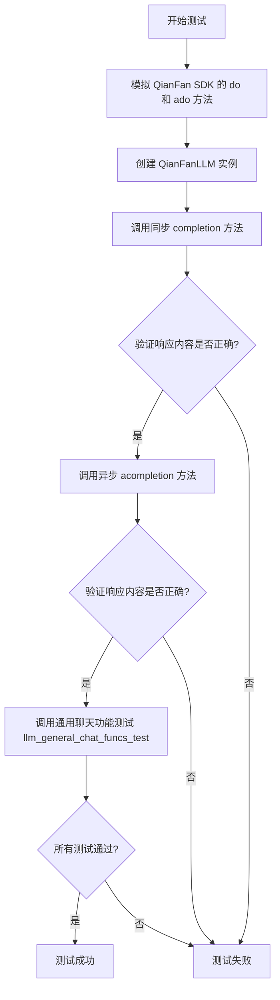
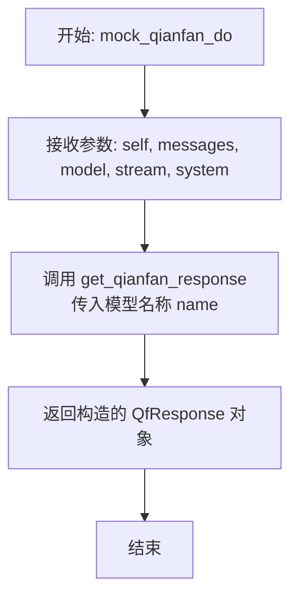
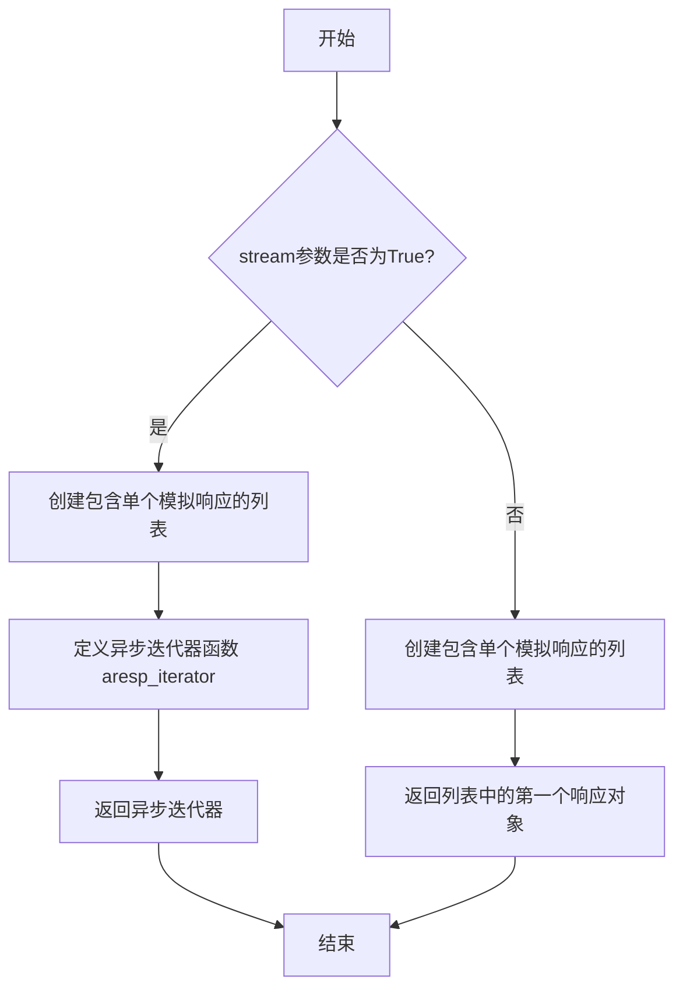
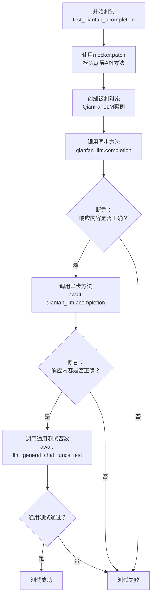

# `.\MetaGPT\tests\metagpt\provider\test_qianfan_api.py` 详细设计文档

该文件是一个针对 QianFanLLM 类的单元测试文件，核心功能是测试 QianFanLLM 的同步和异步聊天补全方法（completion 和 acompletion）。它通过模拟（mock） QianFan 官方 SDK 的 ChatCompletion.do 和 ChatCompletion.ado 方法，来验证 QianFanLLM 类在调用不同模型（如 ERNIE-Bot-turbo）时，能否正确处理请求并返回预期的响应内容，同时测试了通用的聊天功能。

## 整体流程



## 类结构

```
测试文件 (test_qianfan_api.py)
├── 全局函数
│   ├── mock_qianfan_do
│   ├── mock_qianfan_ado
│   └── test_qianfan_acompletion
├── 被测试类 (来自其他模块)
│   └── QianFanLLM
└── 外部依赖/模拟对象
    ├── ChatCompletion (qianfan.resources.llm.chat_completion)
    ├── mock_llm_config_qianfan
    ├── get_qianfan_response
    ├── llm_general_chat_funcs_test
    ├── messages
    ├── prompt
    └── resp_cont_tmpl
```

## 全局变量及字段


### `name`
    
用于指定测试中使用的千帆模型名称，例如 'ERNIE-Bot-turbo'。

类型：`str`
    


### `resp_cont`
    
根据模型名称格式化后的预期响应内容模板，用于断言验证。

类型：`str`
    


    

## 全局函数及方法

### `mock_qianfan_do`

该函数是一个用于单元测试的模拟函数，它模拟了百度千帆大模型平台（QianFan）的聊天补全（ChatCompletion）接口的同步调用（`do`方法）。其核心功能是拦截对真实千帆API的调用，并返回一个预定义的、固定的响应，从而在测试环境中实现依赖隔离和结果可预测性。

参数：

- `self`：`Any`，模拟方法的实例对象（通常为`ChatCompletion`类或其子类的实例），在单元测试的上下文中使用。
- `messages`：`list[dict]`，表示用户与模型交互的消息列表，格式通常为 `[{"role": "user", "content": "..."}]`。
- `model`：`str`，指定要调用的千帆模型名称。
- `stream`：`bool`，指示是否启用流式响应。在此模拟函数中该参数被忽略，始终返回非流式结果。
- `system`：`str`，可选的系统提示信息，用于设定模型的行为。在此模拟函数中该参数被忽略。

返回值：`QfResponse`，一个模拟的千帆API响应对象，其内容由辅助函数`get_qianfan_response`根据指定的模型名称`name`生成。

#### 流程图



#### 带注释源码

```python
def mock_qianfan_do(self, messages: list[dict], model: str, stream: bool = False, system: str = None) -> QfResponse:
    # 函数功能：模拟千帆API的同步调用（do方法）
    # 参数说明：
    #   - self: 模拟方法所属的实例（在测试中通常被mocker使用）
    #   - messages: 对话消息列表，格式为字典列表
    #   - model: 请求的模型名称（此参数在模拟中未使用，仅保持接口一致）
    #   - stream: 是否流式输出（此参数在模拟中被忽略，始终返回完整响应）
    #   - system: 系统提示词（此参数在模拟中被忽略）
    # 返回值：一个模拟的QfResponse对象
    
    # 调用外部辅助函数，根据预定义的模型名称`name`生成一个固定的响应对象。
    # 这使得测试不依赖于外部API的可用性和响应内容，保证了测试的稳定性和可重复性。
    return get_qianfan_response(name=name)
```

### `mock_qianfan_ado`

这是一个用于模拟百度千帆大模型平台异步聊天完成接口的测试函数。它根据传入的`stream`参数，模拟返回单个响应对象或一个异步响应迭代器，以测试上层异步调用逻辑。

参数：

- `self`：`Any`，模拟方法的实例对象（通常为`ChatCompletion`类实例）。
- `messages`：`list[dict]`，表示用户与模型的对话历史消息列表。
- `model`：`str`，指定要使用的千帆模型名称。
- `stream`：`bool`，默认为`True`，指示是否以流式模式返回响应。
- `system`：`str`，默认为`None`，可选的系统提示信息。

返回值：`Union[QfResponse, AsyncIterator[QfResponse]]`，如果`stream`为`False`，则返回一个`QfResponse`对象；如果`stream`为`True`，则返回一个异步迭代器，该迭代器逐个产生`QfResponse`对象。

#### 流程图



#### 带注释源码

```python
async def mock_qianfan_ado(
    self, messages: list[dict], model: str, stream: bool = True, system: str = None
) -> Union[QfResponse, AsyncIterator[QfResponse]]:
    # 创建一个包含单个模拟响应的列表。
    # 在实际测试中，`get_qianfan_response` 函数会根据模型名称生成一个结构化的模拟响应。
    resps = [get_qianfan_response(name=name)]
    
    # 判断是否请求流式响应。
    if stream:
        # 如果是流式模式，定义一个异步生成器函数。
        async def aresp_iterator(resps: list[JsonBody]):
            # 遍历响应列表（此处只有一个元素），逐个yield返回。
            for resp in resps:
                yield resp
        # 返回这个异步生成器，模拟流式输出的行为。
        return aresp_iterator(resps)
    else:
        # 如果是非流式模式，直接返回列表中的第一个（也是唯一一个）响应对象。
        return resps[0]
```

### `test_qianfan_acompletion`

这是一个使用 `pytest` 和 `mocker` 编写的异步单元测试函数，用于测试 `QianFanLLM` 类的 `acompletion` 方法（及其同步版本 `completion`）的功能。它通过模拟（Mock）百度千帆大模型API的底层调用，验证LLM封装类在同步、异步以及流式和非流式场景下的响应是否正确。

参数：

- `mocker`：`pytest-mock` 提供的 `MockerFixture` 类型对象，用于在测试中创建模拟对象（Mock）和打补丁（Patch）。

返回值：`None`，测试函数通常不显式返回值，其成功与否由 `assert` 语句决定。

#### 流程图



#### 带注释源码

```python
@pytest.mark.asyncio  # 标记此函数为异步测试函数，以便pytest-asyncio插件能够正确处理
async def test_qianfan_acompletion(mocker):
    # 1. 模拟（Mock）底层API调用
    # 将 `qianfan.resources.llm.chat_completion.ChatCompletion.do` 方法替换为自定义的 `mock_qianfan_do`
    # 这确保了测试时不进行真实的网络请求，而是返回预定义的模拟响应
    mocker.patch("qianfan.resources.llm.chat_completion.ChatCompletion.do", mock_qianfan_do)
    # 将 `qianfan.resources.llm.chat_completion.ChatCompletion.ado` 方法替换为自定义的 `mock_qianfan_ado`
    mocker.patch("qianfan.resources.llm.chat_completion.ChatCompletion.ado", mock_qianfan_ado)

    # 2. 创建被测对象（System Under Test, SUT）
    # 使用模拟的LLM配置初始化 `QianFanLLM` 类
    qianfan_llm = QianFanLLM(mock_llm_config_qianfan)

    # 3. 测试同步调用路径
    # 调用 `completion` 方法（内部应调用被模拟的 `do` 方法）
    resp = qianfan_llm.completion(messages)
    # 断言：验证同步调用返回的响应内容与预期模板 `resp_cont` 一致
    assert resp.get("result") == resp_cont

    # 4. 测试异步调用路径（非流式）
    # 调用 `acompletion` 方法（内部应调用被模拟的 `ado` 方法，`stream=False`）
    resp = await qianfan_llm.acompletion(messages)
    # 断言：验证异步调用返回的响应内容与预期模板 `resp_cont` 一致
    assert resp.get("result") == resp_cont

    # 5. 执行更通用的LLM功能测试
    # 调用一个通用的测试函数，该函数可能会测试 `achat`、`ask`、`aask` 等多种异步接口
    # 并验证它们的响应是否符合预期
    await llm_general_chat_funcs_test(qianfan_llm, prompt, messages, resp_cont)
```

### `QianFanLLM.completion`

该方法用于调用百度千帆大模型平台进行同步文本补全（对话生成）。它接收对话消息列表，调用底层的千帆API，并返回模型生成的响应。

参数：

- `messages`：`list[dict]`，一个字典列表，其中每个字典代表一条对话消息，通常包含"role"（如"user"、"assistant"）和"content"（消息内容）键。
- `model`：`str`，指定要使用的千帆模型名称，例如 "ERNIE-Bot-turbo"。
- `stream`：`bool`，默认为 `False`。指示是否以流式方式获取响应。当为 `True` 时，返回一个异步迭代器；当为 `False` 时，返回完整的响应对象。
- `system`：`str`，默认为 `None`。可选的系统提示词，用于设定对话的背景或角色。

返回值：`QfResponse`，一个代表千帆API响应的对象，通常包含 `result`（生成的文本内容）、`id`（请求ID）、`created`（创建时间戳）等字段。

#### 流程图

```mermaid
graph TD
    A[开始] --> B[输入参数: messages, model, stream, system]
    B --> C{stream 参数是否为 True?}
    C -- 是 --> D[调用底层 ChatCompletion.ado 方法<br/>（异步流式调用）]
    D --> E[返回 AsyncIterator[QfResponse] 异步迭代器]
    C -- 否 --> F[调用底层 ChatCompletion.do 方法<br/>（同步阻塞调用）]
    F --> G[返回 QfResponse 对象]
    E --> H[结束]
    G --> H
```

#### 带注释源码

```python
def completion(self, messages: list[dict], model: str, stream: bool = False, system: str = None) -> QfResponse:
    """
    同步调用千帆大模型进行文本补全。

    该方法封装了与百度千帆API的同步交互逻辑。根据 `stream` 参数的值，
    它决定是进行普通的阻塞调用还是流式调用（虽然方法签名返回 QfResponse，
    但流式调用时内部可能处理为迭代器，此处根据提供的测试代码，同步调用默认使用非流式）。

    Args:
        messages (list[dict]): 对话消息历史列表。
        model (str): 指定使用的千帆模型。
        stream (bool, optional): 是否使用流式响应。默认为 False。
        system (str, optional): 系统级别的提示信息。默认为 None。

    Returns:
        QfResponse: 包含模型生成结果的响应对象。
    """
    # 根据 stream 标志，选择调用同步的 do 方法或异步的 ado 方法（在同步上下文中可能通过其他方式调用）。
    # 注意：在提供的测试代码中，同步路径被模拟为调用 `ChatCompletion.do`。
    # 实际实现中，如果 stream=True，可能需要特殊处理来支持同步流式。
    # 以下是根据测试代码推断的核心逻辑：
    if stream:
        # 对于同步流式调用，可能需要使用特殊的同步流式接口或循环处理异步迭代器。
        # 示例代码中未展示具体实现，测试中同步调用 mock 的是非流式路径。
        # 实际代码可能类似：return self._sync_stream_call(messages, model, system)
        pass
    else:
        # 非流式同步调用：直接请求并等待完整响应。
        # 调用千帆 SDK 的 ChatCompletion.do 方法
        resp = self.chat_completion.do(messages=messages, model=model, system=system)
        return resp
    # 注意：由于测试代码中 mock 了 `ChatCompletion.do` 并返回 QfResponse，
    # 可以推断在非流式情况下，该方法直接返回 QfResponse。
```

### `QianFanLLM.acompletion`

该方法用于异步调用千帆大模型的聊天补全接口，支持流式和非流式响应。

参数：

- `messages`：`list[dict]`，包含对话消息的列表，每个消息是一个字典，通常包含"role"和"content"字段
- `model`：`str`，指定要使用的千帆模型名称
- `stream`：`bool`，默认为`True`，指示是否使用流式响应
- `system`：`str`，默认为`None`，系统提示信息

返回值：`Union[QfResponse, AsyncIterator[QfResponse]]`，返回千帆API的响应，如果是流式模式则返回异步迭代器，否则返回单个响应对象

#### 流程图

```mermaid
graph TD
    A[开始] --> B{stream参数是否为True?}
    B -->|是| C[调用ChatCompletion.ado方法<br/>启用流式模式]
    C --> D[返回AsyncIterator[QfResponse]<br/>异步响应迭代器]
    B -->|否| E[调用ChatCompletion.ado方法<br/>禁用流式模式]
    E --> F[返回QfResponse<br/>单个响应对象]
    D --> G[结束]
    F --> G
```

#### 带注释源码

```python
async def acompletion(
    self, 
    messages: list[dict], 
    model: str, 
    stream: bool = True, 
    system: str = None
) -> Union[QfResponse, AsyncIterator[QfResponse]]:
    """
    异步调用千帆大模型的聊天补全接口
    
    Args:
        messages: 对话消息列表，每个消息包含role和content
        model: 千帆模型名称
        stream: 是否使用流式响应，默认为True
        system: 系统提示信息，可选
        
    Returns:
        如果是流式模式，返回异步迭代器，否则返回单个响应对象
    """
    # 调用千帆SDK的异步聊天补全接口
    # 根据stream参数决定是否启用流式响应
    resp = await self.chat_completion.ado(
        messages=messages,
        model=model,
        stream=stream,
        system=system
    )
    return resp
```

## 关键组件


### QianFanLLM 类

封装了百度千帆大模型平台的 API 调用，提供了同步和异步的文本生成接口，是连接上层应用与千帆模型服务的核心桥梁。

### 消息处理与模型调用

定义了与千帆 API 交互的核心方法，负责将标准化的消息列表、模型名称等参数转换为千帆 API 所需的格式，并处理其返回的响应，支持流式和非流式两种输出模式。

### 异步迭代器响应

为支持千帆 API 的流式响应，实现了异步迭代器，允许以增量方式逐步获取模型生成的文本内容，适用于需要实时显示生成结果的场景。

### 单元测试与模拟

通过模拟（Mock）技术，在测试环境中替代真实的千帆 API 调用，验证 `QianFanLLM` 类的功能正确性，包括同步完成、异步完成以及通用聊天功能测试，确保代码逻辑的可靠性。


## 问题及建议


### 已知问题

-   **测试用例与实现耦合度高**：测试代码`test_qianfan_acompletion`通过`mocker.patch`直接模拟了`qianfan`库内部类`ChatCompletion`的`do`和`ado`方法。这使得测试高度依赖于`qianfan`库的内部实现细节，一旦库的接口或内部结构发生变化（例如方法名、类路径或参数列表改变），测试用例将立即失效，需要同步更新。
-   **模拟逻辑存在潜在缺陷**：在`mock_qianfan_ado`函数中，当`stream=True`时，返回的是一个异步生成器。然而，模拟的生成器内部直接`yield`了一个完整的`QfResponse`对象。这未能精确模拟真实流式响应中可能存在的分块（chunk）返回行为，可能导致对客户端流式处理逻辑的测试覆盖不足。
-   **测试数据硬编码**：测试中使用的预期响应内容`resp_cont`依赖于一个固定的模板`resp_cont_tmpl`和模型名称`name`。这种硬编码方式降低了测试的灵活性，当需要测试不同模型或不同响应格式时，需要修改测试代码本身，而不是通过配置或参数化驱动。

### 优化建议

-   **引入抽象层进行解耦**：建议为`QianFanLLM`依赖的外部服务（即`qianfan.ChatCompletion`）定义一个接口（Protocol）或抽象基类（ABC）。在测试中，可以创建该接口的模拟（Mock）对象，并将其注入到`QianFanLLM`中。这样可以将测试与第三方库的具体实现完全解耦，提高测试的稳定性和可维护性。
-   **增强流式响应模拟的真实性**：改进`mock_qianfan_ado`函数中流式响应的模拟逻辑。可以模拟将`resp_cont`内容拆分成多个有意义的片段（如按句子或令牌），然后通过异步生成器逐个`yield`这些片段包装成的`QfResponse`对象。这能更真实地测试客户端处理流式数据的能力。
-   **采用参数化测试**：使用`pytest`的`@pytest.mark.parametrize`装饰器对测试函数进行参数化。可以将不同的模型名称（`name`）、提示词（`prompt`）、消息列表（`messages`）和期望的响应模板作为参数传入。这样能用一个测试函数覆盖多种测试场景，提高测试用例的复用性和可读性，并更容易发现边界情况的问题。
-   **集中管理测试数据**：考虑将测试数据（如`resp_cont_tmpl`, `messages`, `prompt`等）抽取到独立的配置文件（如JSON、YAML）或测试数据类中。这样便于统一管理和维护测试数据，也使得数据驱动测试更加方便。


## 其它


### 设计目标与约束

本代码模块的核心设计目标是提供一个针对 `QianFanLLM` 类的单元测试套件，用于验证其与百度千帆大模型API的交互逻辑（包括同步和异步调用）的正确性。主要约束包括：1) 测试环境必须隔离，不能依赖真实的外部API服务，以避免网络波动、费用消耗和测试结果不确定性；2) 测试需要模拟（Mock）底层 `qianfan` SDK 的 `ChatCompletion.do` 和 `ChatCompletion.ado` 方法，以精确控制返回的测试数据；3) 测试用例需要覆盖同步调用 (`completion`)、异步调用 (`acompletion`) 以及通过通用聊天函数测试接口的流程。

### 错误处理与异常设计

当前测试代码本身不包含复杂的错误处理逻辑，因为它主要验证正常路径（Happy Path）。其错误处理体现在对 `pytest` 框架和 `mocker` 工具的运用上：1) 使用 `@pytest.mark.asyncio` 装饰器来支持异步测试函数的执行；2) 使用 `mocker.patch` 来安全地替换目标方法，确保测试结束后原始方法被恢复，避免副作用。测试断言（`assert`）用于验证调用结果是否符合预期，如果不符合，`pytest` 将抛出 `AssertionError` 并终止测试，这本身就是一种错误检测机制。然而，测试用例并未显式设计针对网络错误、API限流、认证失败等异常场景的测试，这部分属于潜在的测试覆盖缺口。

### 数据流与状态机

本测试模块的数据流清晰且线性：1) **准备阶段**：定义模拟的响应内容 (`resp_cont`)，并创建两个模拟函数 (`mock_qianfan_do`, `mock_qianfan_ado`) 来替代真实的API调用。模拟函数根据输入参数（特别是 `stream` 标志）返回预设的 `QfResponse` 对象或一个异步迭代器。2) **执行阶段**：在 `test_qianfan_acompletion` 函数中，首先通过 `mocker.patch` 应用模拟函数，然后实例化 `QianFanLLM`。接着，依次调用 `completion`（同步）和 `acompletion`（异步）方法，传入预定义的 `messages` 测试数据。3) **验证阶段**：每个调用后，使用 `assert` 语句检查返回的响应字典中 `result` 字段的值是否与预期的 `resp_cont` 完全匹配。最后，调用一个通用的测试函数 `llm_general_chat_funcs_test` 进行更广泛的接口行为验证。整个过程中没有复杂的状态迁移，是一个典型的“准备-执行-断言”测试流程。

### 外部依赖与接口契约

本测试代码明确声明并管理了其外部依赖：1) **被测对象依赖**：`metagpt.provider.qianfan_api.QianFanLLM` 类，测试验证其 `completion` 和 `acompletion` 方法的公开接口。2) **测试工具依赖**：`pytest` 测试框架及其 `mocker` 插件（来自 `pytest-mock`），用于构建和组织测试用例并进行方法模拟。3) **模拟数据依赖**：从 `tests.metagpt.provider.req_resp_const` 模块导入的常量（如 `messages`, `prompt`, `resp_cont_tmpl`）和函数（`get_qianfan_response`, `llm_general_chat_funcs_test`），这些构成了测试的输入和预期输出。4) **SDK接口契约**：测试通过模拟 `qianfan.resources.llm.chat_completion.ChatCompletion.do` 和 `.ado` 方法，隐式地依赖并定义了与 `qianfan` SDK 的交互契约。模拟函数必须遵循真实方法的签名（参数类型、数量）和返回类型（`QfResponse` 或 `AsyncIterator[QfResponse]`），否则测试将无法正确模拟或可能掩盖集成问题。

    