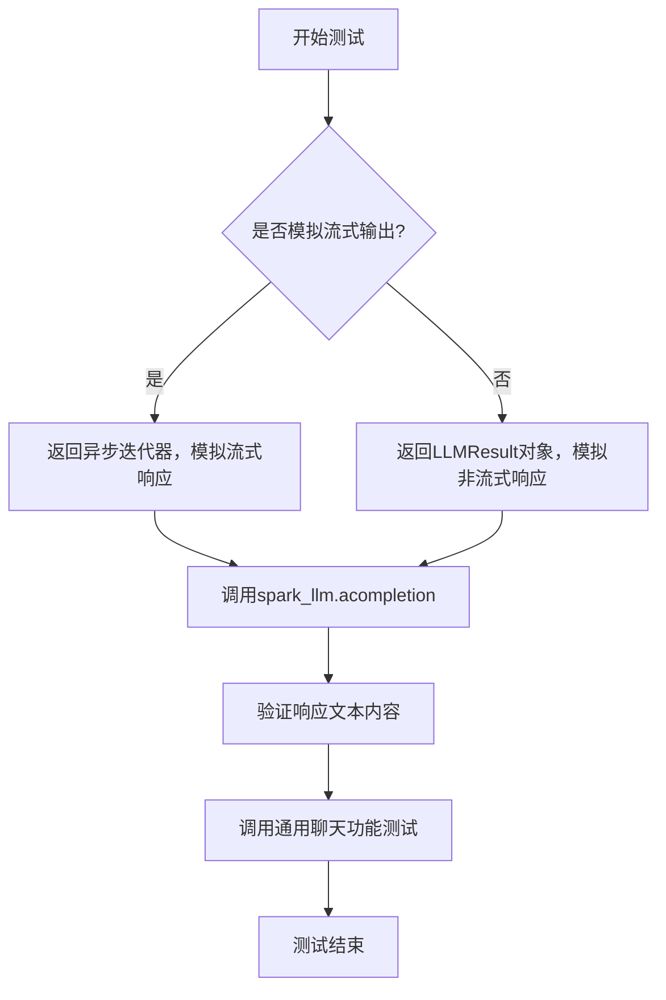
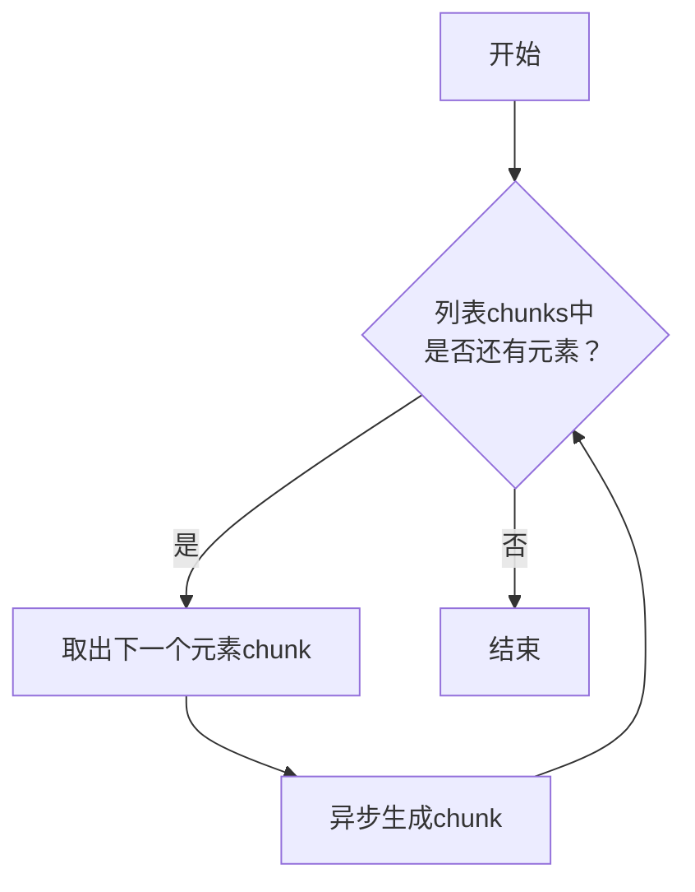
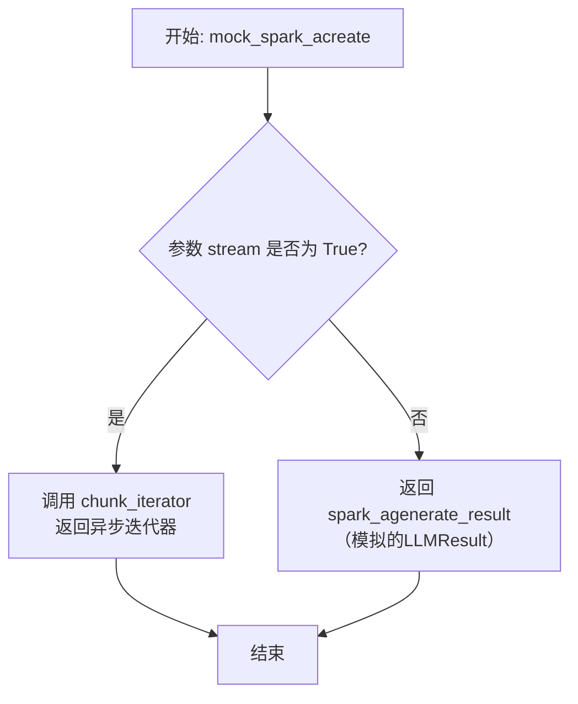
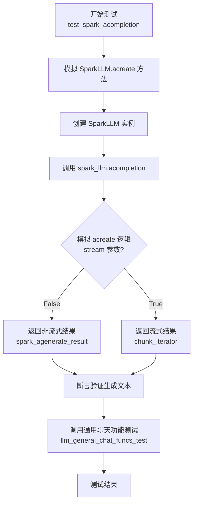
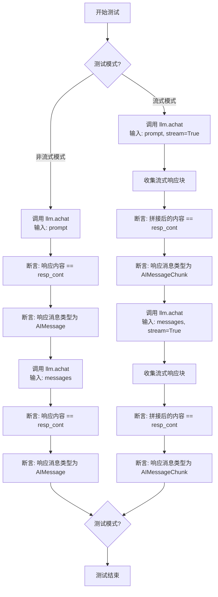
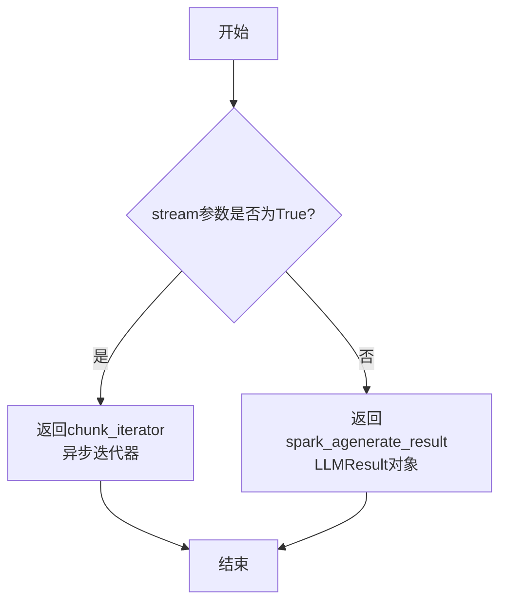

# `.\MetaGPT\tests\metagpt\provider\test_spark_api.py` 详细设计文档

该代码是一个针对讯飞星火大模型SDK的异步接口测试用例，主要功能是通过模拟（Mock）SparkLLM的`acreate`方法，测试其`acompletion`方法在流式和非流式两种模式下的正确性，并验证其文本生成和通用聊天功能的响应是否符合预期。

## 整体流程



## 类结构

```
测试文件 (test_spark_api.py)
├── 全局变量 (resp_cont, USAGE, spark_agenerate_result, chunks)
├── 全局函数 (chunk_iterator, mock_spark_acreate)
└── 测试函数 (test_spark_acompletion)
```

## 全局变量及字段


### `resp_cont`
    
用于测试的模拟响应内容，通过格式化resp_cont_tmpl模板字符串生成，包含'Spark'标识。

类型：`str`
    


### `USAGE`
    
模拟的令牌使用情况字典，包含question_tokens、prompt_tokens、completion_tokens和total_tokens等键值对，用于测试LLM的令牌统计功能。

类型：`dict`
    


### `spark_agenerate_result`
    
模拟的LLMResult对象，包含一个ChatGeneration列表，其中封装了AIMessage和模拟的响应内容及令牌使用情况，用于测试非流式响应的场景。

类型：`LLMResult`
    


### `chunks`
    
模拟的AIMessageChunk对象列表，包含两个消息块，第一个块携带响应内容，第二个块携带令牌使用情况，用于测试流式响应的场景。

类型：`List[AIMessageChunk]`
    


    

## 全局函数及方法

### `chunk_iterator`

该函数是一个异步生成器，用于模拟流式响应场景。它接收一个 `AIMessageChunk` 列表，并异步地逐个生成其中的元素，从而模拟从大语言模型获取流式响应的过程。

参数：

- `chunks`：`List[AIMessageChunk]`，包含要逐个生成的 `AIMessageChunk` 对象的列表。

返回值：`AsyncIterator[AIMessageChunk]`，一个异步迭代器，每次迭代返回一个 `AIMessageChunk` 对象。

#### 流程图



#### 带注释源码

```python
async def chunk_iterator(chunks: List[AIMessageChunk]) -> AsyncIterator[AIMessageChunk]:
    # 遍历输入的chunks列表
    for chunk in chunks:
        # 使用异步生成器语法，逐个生成列表中的元素
        yield chunk
```

### `mock_spark_acreate`

这是一个用于模拟 `SparkLLM.acreate` 异步方法的测试辅助函数。它根据 `stream` 参数的值，返回一个模拟的流式响应迭代器或一个模拟的批量生成结果，用于在单元测试中隔离外部API调用。

参数：

- `self`：`Any`，此参数用于模拟类方法，在函数内部未使用。
- `messages`：`Any`，模拟的输入消息列表，在函数内部未使用。
- `stream`：`bool`，控制返回类型的标志。如果为 `True`，则返回一个异步迭代器以模拟流式响应；如果为 `False`，则返回一个模拟的批量生成结果。

返回值：`Union[AsyncIterator[AIMessageChunk], LLMResult]`，根据 `stream` 参数，返回模拟的流式响应或批量生成结果。

#### 流程图



#### 带注释源码

```python
async def mock_spark_acreate(self, messages, stream):
    # 判断是否模拟流式输出
    if stream:
        # 如果是流式模式，返回一个异步迭代器，该迭代器会依次产生预定义的 `chunks` 列表中的消息块。
        return chunk_iterator(chunks)
    else:
        # 如果是非流式（批量）模式，直接返回预定义的模拟生成结果 `spark_agenerate_result`。
        return spark_agenerate_result
```

### `test_spark_acompletion`

这是一个使用 `pytest` 和 `mocker` 编写的异步测试函数，用于测试 `SparkLLM` 类的 `acompletion` 方法。它通过模拟（Mock）`SparkLLM.acreate` 方法的返回值，验证 `acompletion` 方法在流式和非流式场景下的功能是否正确，包括文本生成和通用聊天功能。

参数：

- `mocker`：`pytest_mock.plugin.MockerFixture`，`pytest-mock` 插件提供的模拟对象，用于在测试中替换（patch）目标函数或方法。

返回值：`None`，测试函数通常不返回有意义的值，其核心功能是通过断言（assert）来验证代码行为。

#### 流程图



#### 带注释源码

```python
@pytest.mark.asyncio  # 标记此函数为异步测试函数，以便 pytest-asyncio 插件能够正确处理
async def test_spark_acompletion(mocker):
    # 使用 mocker 替换 `metagpt.provider.spark_api.SparkLLM.acreate` 方法
    # 将其行为替换为自定义的 `mock_spark_acreate` 函数
    mocker.patch("metagpt.provider.spark_api.SparkLLM.acreate", mock_spark_acreate)

    # 使用模拟的配置创建 SparkLLM 实例
    spark_llm = SparkLLM(mock_llm_config_spark)

    # 1. 测试非流式（stream=False）调用
    # 调用被测试的异步方法 `acompletion`
    resp = await spark_llm.acompletion([messages])
    # 断言：验证 `SparkLLM.get_choice_text` 方法能从响应中正确提取出预期的文本内容
    assert spark_llm.get_choice_text(resp) == resp_cont

    # 2. 测试通用聊天功能（内部可能包含流式与非流式调用）
    # 调用一个通用的测试函数，进一步验证 `SparkLLM` 的其他方法（如 `achat`）
    await llm_general_chat_funcs_test(spark_llm, prompt, messages, resp_cont)
```

### `llm_general_chat_funcs_test`

这是一个用于测试LLM（大语言模型）通用聊天功能的异步测试函数。它通过调用LLM实例的`achat`方法，验证其流式和非流式响应的正确性，包括内容匹配和消息类型检查。

参数：

- `llm`：`SparkLLM`，一个实现了`achat`方法的LLM实例，用于发起聊天请求。
- `prompt`：`str`，一个字符串提示词，作为单轮对话的输入。
- `messages`：`List[BaseMessage]`，一个消息列表，作为多轮对话历史的输入。
- `resp_cont`：`str`，预期的响应内容字符串，用于验证LLM的返回结果。

返回值：`None`，此函数不返回任何值，其功能通过断言（assert）来验证测试结果。

#### 流程图



#### 带注释源码

```python
# 注意：以下代码是基于上下文的推断和重构，用于解释 `llm_general_chat_funcs_test` 函数的典型实现逻辑。
# 实际函数定义可能位于 `tests.metagpt.provider.req_resp_const` 模块中。

async def llm_general_chat_funcs_test(llm, prompt: str, messages: List[BaseMessage], resp_cont: str):
    """
    通用LLM聊天功能测试。
    
    测试给定LLM实例的异步聊天接口，涵盖流式和非流式两种模式，
    并使用单提示词和多轮对话历史两种输入形式。
    
    Args:
        llm: 实现了 `achat` 方法的LLM实例。
        prompt (str): 用于单轮对话测试的提示词。
        messages (List[BaseMessage]): 用于多轮对话测试的消息历史。
        resp_cont (str): 期望LLM返回的响应内容。
    """
    # 1. 测试非流式响应（使用字符串提示词）
    # 调用LLM的异步聊天接口，传入单个提示词
    resp = await llm.achat(prompt)
    # 验证返回的响应文本与预期内容完全一致
    assert resp.content == resp_cont
    # 验证返回的消息对象类型是 AIMessage（非流式）
    assert isinstance(resp, AIMessage)

    # 2. 测试非流式响应（使用消息列表）
    # 调用LLM的异步聊天接口，传入多轮对话历史
    resp = await llm.achat(messages)
    # 验证返回的响应文本与预期内容完全一致
    assert resp.content == resp_cont
    # 验证返回的消息对象类型是 AIMessage（非流式）
    assert isinstance(resp, AIMessage)

    # 3. 测试流式响应（使用字符串提示词）
    # 初始化一个空字符串用于累积流式响应的内容
    stream_resp_content = ""
    # 调用LLM的异步聊天接口，启用流式输出（stream=True）
    async for chunk in await llm.achat(prompt, stream=True):
        # 将每个流式响应块的内容累加起来
        stream_resp_content += chunk.content
        # 验证每个流式响应块的消息类型是 AIMessageChunk
        assert isinstance(chunk, AIMessageChunk)
    # 验证所有流式块累积后的完整内容与预期内容一致
    assert stream_resp_content == resp_cont

    # 4. 测试流式响应（使用消息列表）
    # 再次初始化空字符串
    stream_resp_content = ""
    # 调用LLM的异步聊天接口，传入消息历史并启用流式输出
    async for chunk in await llm.achat(messages, stream=True):
        # 将每个流式响应块的内容累加起来
        stream_resp_content += chunk.content
        # 验证每个流式响应块的消息类型是 AIMessageChunk
        assert isinstance(chunk, AIMessageChunk)
    # 验证所有流式块累积后的完整内容与预期内容一致
    assert stream_resp_content == resp_cont
```

### `SparkLLM.acreate`

该方法是一个用于测试的模拟函数，用于模拟SparkLLM类的异步创建（acreate）方法。它根据传入的stream参数决定返回一个异步迭代器（用于流式响应）还是一个完整的LLMResult对象（用于非流式响应）。

参数：

- `self`：`SparkLLM`，SparkLLM类的实例
- `messages`：`List[Message]`，要发送给模型的消息列表
- `stream`：`bool`，指示是否使用流式响应

返回值：`Union[AsyncIterator[AIMessageChunk], LLMResult]`，如果stream为True，返回一个异步迭代器，每次迭代返回一个AIMessageChunk；如果stream为False，返回一个包含生成结果的LLMResult对象。

#### 流程图



#### 带注释源码

```python
async def mock_spark_acreate(self, messages, stream):
    # 检查是否启用流式响应
    if stream:
        # 如果启用流式，返回一个异步迭代器，该迭代器会逐个生成预定义的chunks
        return chunk_iterator(chunks)
    else:
        # 如果不启用流式，返回一个预定义的完整LLMResult对象
        return spark_agenerate_result
```

### `SparkLLM.acompletion`

该方法是一个异步方法，用于调用讯飞星火大模型的异步聊天补全接口。它接收一个消息列表作为输入，并返回一个包含模型生成结果的 `LLMResult` 对象。该方法内部处理了与星火API的交互，包括请求的构建和响应的解析。

参数：

- `messages`：`List[BaseMessage]`，一个包含对话历史的消息列表，用于提供模型生成回复的上下文。
- `stream`：`bool`，可选参数，默认为 `False`。指示是否以流式方式获取响应。如果为 `True`，则返回一个异步迭代器；如果为 `False`，则返回完整的 `LLMResult` 对象。
- `timeout`：`int`，可选参数，默认为60。请求的超时时间（秒）。
- `kwargs`：`Any`，可选的关键字参数，用于传递额外的配置选项给底层的API调用。

返回值：`LLMResult`，一个包含模型生成结果的对象，其中封装了生成的文本、使用量统计等信息。

#### 流程图

```mermaid
graph TD
    A[开始: acompletion] --> B{stream 参数是否为 True?};
    B -- 是 --> C[调用 _achat 方法<br/>设置 stream=True];
    B -- 否 --> D[调用 _achat 方法<br/>设置 stream=False];
    C --> E[返回异步迭代器<br/>AsyncIterator[AIMessageChunk]];
    D --> F[返回 LLMResult 对象];
    E --> G[结束];
    F --> G;
```

#### 带注释源码

```python
async def acompletion(self, messages: List[BaseMessage], stream: bool = False, timeout: int = 60, **kwargs) -> LLMResult:
    """
    异步聊天补全方法。
    
    该方法作为异步入口点，根据 `stream` 参数决定调用流式或非流式的内部聊天方法。
    
    Args:
        messages: 消息列表，构成对话上下文。
        stream: 是否使用流式响应。默认为 False。
        timeout: 请求超时时间（秒）。默认为60。
        **kwargs: 额外的关键字参数，传递给底层API。
        
    Returns:
        LLMResult: 包含生成结果的对象。如果 stream=True，则返回一个异步迭代器。
    """
    # 调用内部的异步聊天方法，传递所有参数。
    # _achat 方法会根据 stream 参数和模型配置，决定调用具体的流式或非流式API。
    return await self._achat(messages, stream=stream, timeout=timeout, **kwargs)
```

### `SparkLLM.get_choice_text`

该方法用于从大语言模型（LLM）的通用响应结果对象（`LLMResult`）中提取第一个生成的文本内容。它主要处理由 `SparkLLM.acompletion` 方法返回的非流式响应，解析其结构以获取最终的AI回复文本。

参数：

- `llm_output`：`LLMResult`，大语言模型调用返回的通用结果对象，其中包含了生成的文本列表。

返回值：`str`，从 `llm_output` 中解析出的第一个生成的文本内容。

#### 流程图

```mermaid
flowchart TD
    A[开始: get_choice_text(llm_output)] --> B{检查 llm_output.generations 是否存在且非空?};
    B -- 是 --> C[获取 generations 的第一个元素 first_gen_list];
    C --> D{检查 first_gen_list 是否存在且非空?};
    D -- 是 --> E[获取 first_gen_list 的第一个元素 first_generation];
    E --> F[返回 first_generation.text];
    D -- 否 --> G[返回空字符串 ''];
    B -- 否 --> G;
    F --> H[结束];
    G --> H;
```

#### 带注释源码

```python
def get_choice_text(self, llm_output: LLMResult) -> str:
    """
    从LLMResult中提取生成的文本。
    
    该方法遍历LLMResult的结构，定位到第一个生成的ChatGeneration对象，
    并返回其包含的文本内容。这是处理非流式响应、获取最终结果的通用方法。

    Args:
        llm_output (LLMResult): 大语言模型调用返回的结果对象。

    Returns:
        str: 提取出的文本内容。如果结构异常或为空，则返回空字符串。
    """
    # 1. 安全检查：确保llm_output包含generations字段且不为空
    if not llm_output.generations:
        return ""
    # 2. 获取第一组生成结果（通常对应第一条用户消息的回复）
    first_gen_list = llm_output.generations[0]
    if not first_gen_list:
        return ""
    # 3. 获取该组中的第一个生成对象（ChatGeneration）
    first_generation = first_gen_list[0]
    # 4. 返回该生成对象中存储的文本
    return first_generation.text
```

## 关键组件


### 测试框架与模拟

使用pytest框架和mocker库对SparkLLM的异步完成方法进行单元测试，通过模拟外部API响应来验证核心功能。

### 异步响应模拟

通过定义`mock_spark_acreate`函数和`chunk_iterator`异步生成器，模拟了Spark API在流式和非流式两种模式下的响应行为。

### 测试数据构造

预定义了测试用的请求消息(`messages`, `prompt`)、预期的响应内容(`resp_cont`)、使用量数据(`USAGE`)以及符合SparkAI库结构的响应对象(`spark_agenerate_result`, `chunks`)，用于驱动测试用例。

### 核心功能验证

测试用例`test_spark_acompletion`验证了`SparkLLM.acompletion`方法在模拟环境下的正确性，包括响应的文本提取以及通过通用聊天函数测试集(`llm_general_chat_funcs_test`)进行的更全面验证。


## 问题及建议


### 已知问题

-   **测试用例对实现细节耦合度过高**：`test_spark_acompletion` 函数通过 `mocker.patch` 直接替换了 `SparkLLM.acreate` 方法。这种打桩方式深度依赖于被测试类的内部实现（方法名 `acreate`），一旦生产代码中该方法的重构（如重命名、参数变更）或逻辑调整，将直接导致测试用例失败，即使外部功能行为未变。这降低了测试的健壮性和作为回归测试的可靠性。
-   **模拟数据构造复杂且不直观**：测试中用于模拟 API 响应的数据（如 `spark_agenerate_result`, `chunks`, `USAGE`）构造过程繁琐，需要手动组装多层嵌套的对象（`LLMResult`、`ChatGeneration`、`AIMessage` 等）。这不仅增加了编写和维护测试的认知负担，也使得测试意图（即“模拟一个成功的文本生成响应”）被冗长的样板代码所掩盖。
-   **缺乏对异常和边界条件的测试**：当前测试仅覆盖了“正常流”（即 API 成功返回预期结果）。对于 `SparkLLM` 在实际使用中可能遇到的关键异常场景，如网络错误、API 返回错误码、令牌超限、空消息列表输入、流式响应中的中断等，均未包含测试用例。这可能导致这些边界情况下的代码行为未经验证，存在潜在缺陷。
-   **测试函数职责过多**：`test_spark_acompletion` 函数同时测试了同步完成（`acompletion`）和通过 `llm_general_chat_funcs_test` 测试的多个其他功能。虽然有时出于效率考虑进行组合测试，但这降低了测试的隔离性。一个测试的失败可能难以快速定位到具体是哪个功能点出了问题，且测试报告的可读性会下降。
-   **硬编码的模拟响应内容**：响应内容 `resp_cont` 基于一个固定的模板生成，测试断言也依赖于这个硬编码的字符串。这虽然对当前测试有效，但如果未来需要测试更复杂的响应（如包含特定格式、特殊字符），则需要修改测试数据，灵活性不足。

### 优化建议

-   **采用更抽象的接口进行模拟**：建议将对具体方法 `acreate` 的模拟，提升为对 `SparkLLM` 所依赖的底层 HTTP 客户端或 SDK 客户端进行模拟。例如，可以模拟 `httpx.AsyncClient` 的 `post` 方法，返回构造好的 HTTP 响应。这样可以将测试的耦合点从业务逻辑层下移到通信层，即使 `SparkLLM` 的内部方法重构，只要其对外部服务的调用契约不变，测试就无需修改，显著提升测试的稳定性。
-   **使用测试工具库简化测试数据构造**：引入如 `pytest-fixtures` 或创建工厂函数（Factory Functions）来封装复杂测试对象的创建逻辑。例如，可以定义一个 `fixture` 如 `@pytest.fixture def mock_llm_result():` 来返回正确构造的 `LLMResult` 对象。这能使测试用例更清晰，只需关注“给定什么输入，期望什么输出”，而将繁琐的对象构建细节隐藏起来，提高代码的可读性和可维护性。
-   **补充关键场景的测试用例**：为 `SparkLLM` 类系统性地增加测试用例，至少应覆盖：
    -   **异常流**：模拟网络超时、连接错误、API返回非2xx状态码或错误 JSON 时，`SparkLLM` 是否按预期抛出易于处理的异常（如 `APIConnectionError`, `APIStatusError`）。
    -   **边界条件**：测试输入为空列表、消息内容过长（触发令牌截断逻辑）、流式响应提前结束等场景。
    -   **配置验证**：测试使用无效或缺失的 API 密钥、APPID 等配置时，初始化或调用是否失败。
-   **拆分测试函数以遵循单一职责原则**：考虑将 `test_spark_acompletion` 拆分为多个独立的测试函数，例如：
    -   `test_acompletion_success`: 专门测试 `acompletion` 方法在非流式模式下的成功场景。
    -   `test_achat_success`: 专门测试 `achat` 方法（通过 `llm_general_chat_funcs_test` 覆盖的部分）。
    -   `test_acompletion_streaming`: 专门测试流式输出模式。
    每个测试函数只关注一个特定的行为，这样可以使测试失败的原因更明确，测试报告更清晰。
-   **参数化测试以提高覆盖率和灵活性**：对于需要测试多种输入输出组合的场景（例如不同的提示词、不同的模拟响应内容），使用 `@pytest.mark.parametrize` 装饰器。这可以避免编写多个几乎相同的测试函数，并能更清晰地展示被测试功能所支持的各种情况。对于响应内容，可以参数化不同的字符串，甚至从外部文件加载测试用例数据。


## 其它


### 设计目标与约束

本测试代码的设计目标是验证 `SparkLLM` 类（MetaGPT框架中对接讯飞星火大模型的提供者）的核心异步接口 `acompletion` 的功能正确性。主要约束包括：1) 测试环境需模拟外部API调用，避免产生真实网络请求和费用；2) 测试需覆盖同步返回（非流式）和异步迭代器返回（流式）两种模式；3) 测试需验证 `SparkLLM` 对上游 `sparkai` SDK返回数据的解析与封装逻辑。

### 错误处理与异常设计

当前测试代码主要关注正常路径（Happy Path）的验证，未显式包含错误处理测试用例。潜在的异常场景包括：1) 模拟的 `mock_spark_acreate` 函数返回异常或不符合预期的数据结构时，`SparkLLM.acompletion` 应能抛出可理解的异常（如 `ValueError` 或自定义异常）；2) 当 `mock_llm_config_spark` 配置无效（如API密钥为空）时，`SparkLLM` 初始化应失败。这些场景应在更完整的测试套件中覆盖。

### 数据流与状态机

测试数据流清晰：1) **准备阶段**：定义预期的响应内容 `resp_cont`、使用量信息 `USAGE` 和模拟的API响应对象（`spark_agenerate_result` 和 `chunks`）。2) **模拟阶段**：通过 `mocker.patch` 将 `SparkLLM.acreate` 方法替换为 `mock_spark_acreate` 函数，该函数根据 `stream` 参数决定返回完整结果对象还是异步块迭代器。3) **执行与断言阶段**：创建 `SparkLLM` 实例，调用 `acompletion`，并验证返回的文本内容与预期 `resp_cont` 一致，同时通过 `llm_general_chat_funcs_test` 验证通用聊天功能。

### 外部依赖与接口契约

1.  **外部依赖**：
    *   `sparkai.core`：用于构造模拟的API响应对象（`AIMessage`, `AIMessageChunk`, `ChatGeneration`, `LLMResult`）。测试强依赖于这些类的结构和字段。
    *   `pytest` 与 `pytest-mock`：用于测试框架和模拟（Mocking）。
    *   `metagpt.provider.spark_api.SparkLLM`：被测系统（SUT）。
    *   `tests.metagpt.provider.mock_llm_config` 与 `tests.metagpt.provider.req_resp_const`：提供测试用的模拟配置和常量数据。
2.  **接口契约**：
    *   `SparkLLM.acreate` 方法：被模拟的方法。测试假设其签名和基本行为（接收 `messages` 和 `stream` 参数，返回特定类型）与真实实现一致。
    *   `llm_general_chat_funcs_test` 函数：一个共享的测试工具函数，其接口契约（接收LLM实例、prompt、messages、预期响应）必须稳定，否则会影响本测试。

### 测试策略与范围

本测试采用 **单元测试** 策略，通过模拟（Mocking）将被测单元 `SparkLLM.acompletion` 与其外部依赖（真实的讯飞星火API）隔离。测试范围聚焦于 `acompletion` 方法的**功能正确性**，包括：1) 能否正确处理非流式（完整响应）的模拟返回；2) 能否正确处理流式（分块响应）的模拟返回；3) `get_choice_text` 方法能否从响应中正确提取文本。它不测试网络超时、认证失败、速率限制等集成或端到端场景。

### 可维护性与扩展性

1.  **可维护性**：测试数据（如 `resp_cont_tmpl`, `USAGE`）被提取到常量文件 `req_resp_const` 中，有利于统一维护。模拟逻辑 `mock_spark_acreate` 集中定义，清晰易读。
2.  **扩展性**：若要测试新的 `SparkLLM` 方法或不同的异常情况，可以：a) 在 `mock_spark_acreate` 中增加分支逻辑；b) 编写新的测试函数并复用现有的模拟数据和工具函数。当前结构支持这种扩展。


    