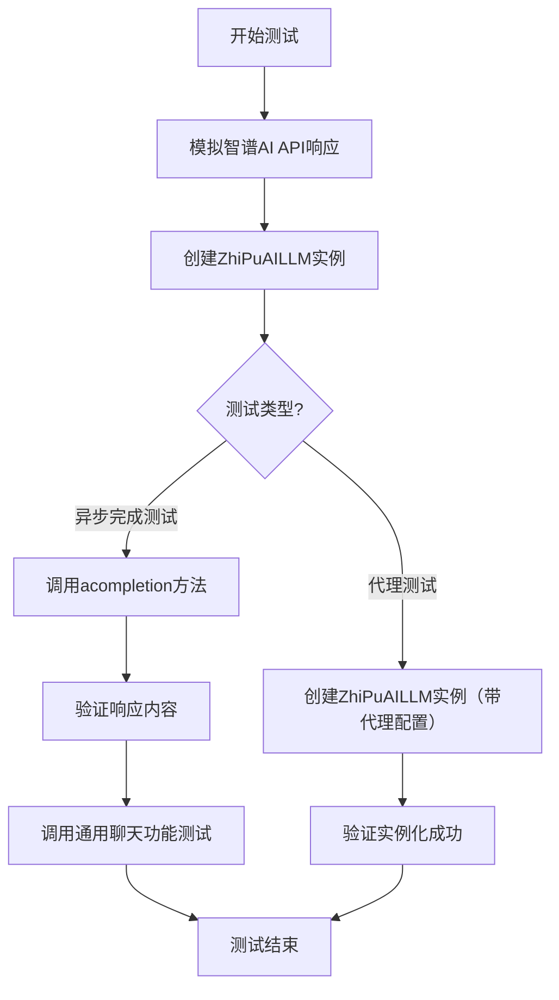
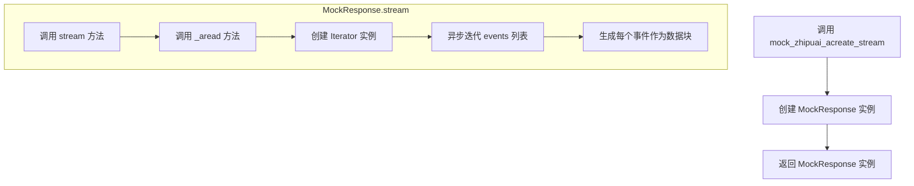
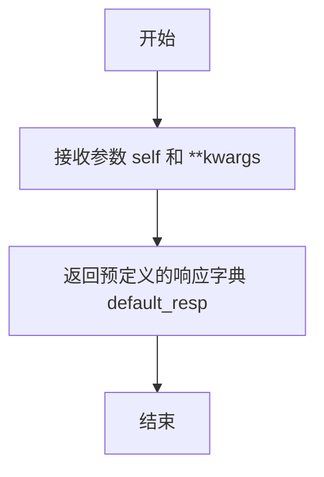
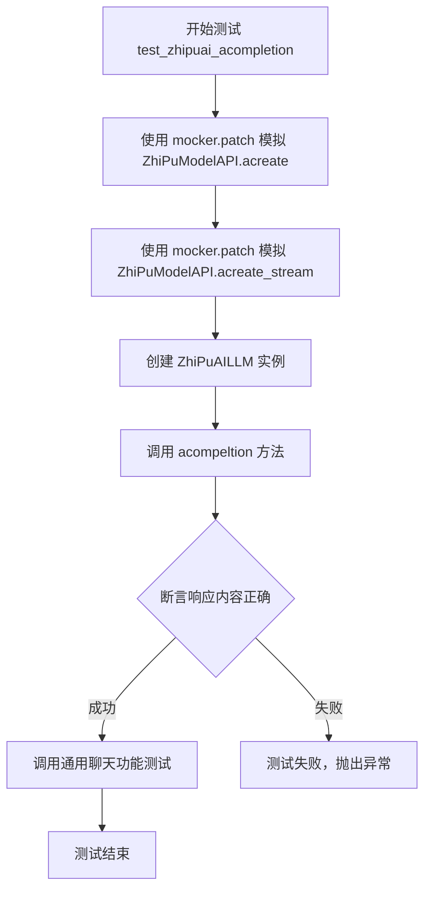
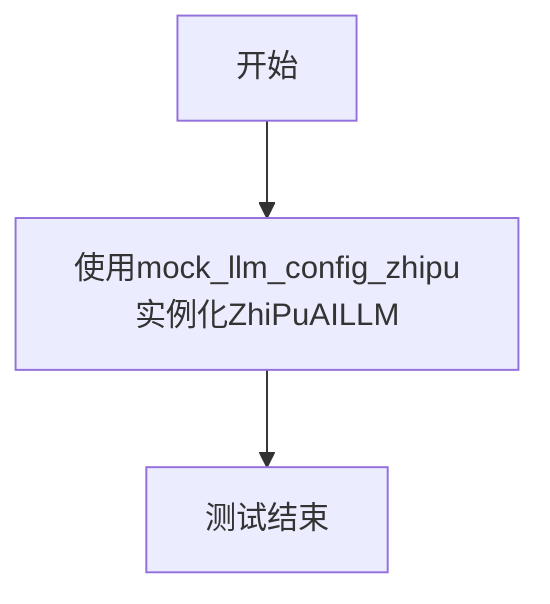
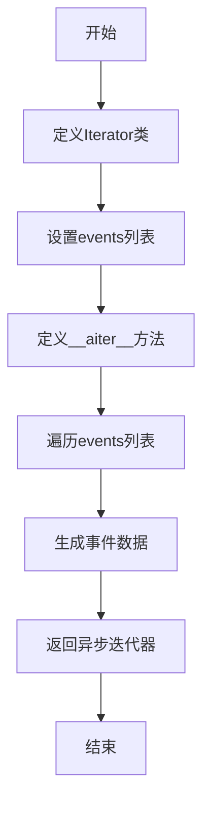
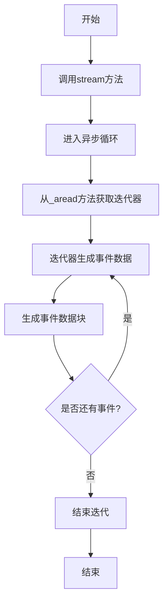
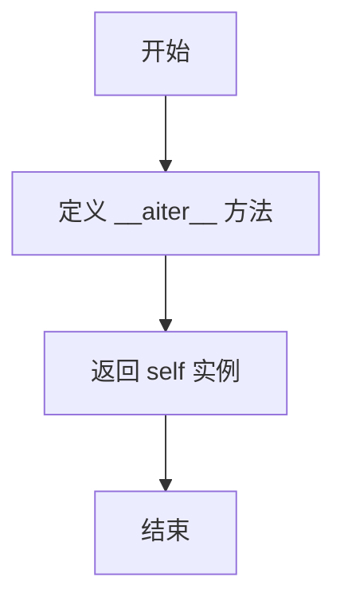

# `.\MetaGPT\tests\metagpt\provider\test_zhipuai_api.py` 详细设计文档

该文件是智谱AI大语言模型（ZhiPuAILLM）的单元测试，主要功能是测试ZhiPuAILLM类的异步完成（acompletion）方法以及通用的聊天功能。它通过模拟（mock）智谱AI的API响应来验证LLM能否正确处理输入消息并返回预期的输出，同时测试了在代理（proxy）配置下的初始化行为。

## 整体流程



## 类结构

```
测试文件 (test_zhipuai_llm.py)
├── 全局函数
│   ├── mock_zhipuai_acreate_stream
│   ├── mock_zhipuai_acreate
│   ├── test_zhipuai_acompletion
│   └── test_zhipuai_proxy
└── 模拟类
    ├── MockResponse
    └── Iterator
```

## 全局变量及字段


### `name`
    
用于标识测试中使用的模型名称，值为'ChatGLM-4'

类型：`str`
    


### `resp_cont`
    
根据resp_cont_tmpl模板和模型名称生成的预期响应内容

类型：`str`
    


### `default_resp`
    
通过get_part_chat_completion函数生成的模拟完整API响应字典

类型：`dict`
    


### `Iterator.events`
    
模拟流式响应的事件列表，包含一个字典元素，该字典模拟了智普AI流式API返回的数据结构

类型：`list[dict]`
    
    

## 全局函数及方法

### `mock_zhipuai_acreate_stream`

这是一个用于测试的模拟函数，它模拟了智谱AI流式API的异步创建响应行为。该函数返回一个模拟的响应对象，该对象可以异步迭代生成预定义的聊天完成事件，用于在单元测试中替代真实的API调用。

参数：

- `self`：`Any`，模拟方法所属的实例（在测试中通常为`ZhiPuModelAPI`的模拟对象）
- `**kwargs`：`dict`，可变关键字参数，用于接收API调用时可能传入的各种参数（在模拟中未使用）

返回值：`MockResponse`，一个模拟的响应类实例，它提供了`stream`方法用于异步迭代生成响应数据块

#### 流程图



#### 带注释源码

```python
async def mock_zhipuai_acreate_stream(self, **kwargs):
    # 定义一个模拟响应类，用于替代真实的API响应
    class MockResponse(object):
        # 内部异步读取方法，用于生成模拟的流式数据
        async def _aread(self):
            # 定义迭代器类，包含预定义的事件数据
            class Iterator(object):
                # 预定义的模拟事件列表，包含一个聊天完成事件
                events = [{"choices": [{"index": 0, "delta": {"content": resp_cont, "role": "assistant"}}]}]

                # 异步迭代器方法，用于逐个生成事件
                async def __aiter__(self):
                    for event in self.events:
                        yield event

            # 异步迭代Iterator实例，生成每个事件作为数据块
            async for chunk in Iterator():
                yield chunk

        # 公开的流式接口方法，返回异步生成器
        async def stream(self):
            async for chunk in self._aread():
                yield chunk

    # 返回模拟响应实例
    return MockResponse()
```

### `mock_zhipuai_acreate`

该函数是一个用于测试的模拟函数，用于模拟智谱AI（ZhiPuAI）的异步创建（acreate）方法。它返回一个预定义的响应字典，以替代实际调用智谱AI API，从而在单元测试中提供可控的测试环境。

参数：

- `self`：`Any`，表示调用该方法的实例对象（在模拟函数中通常为占位符）。
- `**kwargs`：`dict`，表示可变关键字参数，用于接收调用时传入的任意参数，但在此模拟函数中未使用。

返回值：`dict`，返回一个预定义的响应字典，模拟智谱AI API的响应内容。

#### 流程图



#### 带注释源码

```python
async def mock_zhipuai_acreate(self, **kwargs) -> dict:
    # 该函数模拟智谱AI的异步创建方法，返回预定义的响应字典
    # 参数:
    #   self: 调用该方法的实例对象（占位符）
    #   **kwargs: 可变关键字参数，用于接收调用时传入的任意参数（未使用）
    # 返回值:
    #   dict: 预定义的响应字典，模拟智谱AI API的响应
    return default_resp  # 返回预定义的响应字典
```

### `test_zhipuai_acompletion`

该函数是一个针对`ZhiPuAILLM`类的异步完成（`acompletion`）方法的单元测试。它通过模拟（mocking）智谱AI的API响应，测试`ZhiPuAILLM`实例在正常调用和流式调用场景下的功能，验证其是否能正确处理消息并返回预期的响应内容。

参数：

- `mocker`：`pytest_mock.plugin.MockerFixture`，pytest-mock插件提供的模拟对象，用于在测试中替换（patch）指定的函数或方法。

返回值：`None`，该测试函数不返回任何值，其核心功能是通过断言（assert）来验证代码行为。

#### 流程图



#### 带注释源码

```python
@pytest.mark.asyncio  # 标记此测试函数为异步测试
async def test_zhipuai_acompletion(mocker):
    # 使用 mocker 替换 ZhiPuModelAPI 类的 acreate 方法，使其在测试中返回预定义的模拟响应 (mock_zhipuai_acreate)
    mocker.patch("metagpt.provider.zhipuai.zhipu_model_api.ZhiPuModelAPI.acreate", mock_zhipuai_acreate)
    # 使用 mocker 替换 ZhiPuModelAPI 类的 acreate_stream 方法，使其在测试中返回预定义的模拟流式响应 (mock_zhipuai_acreate_stream)
    mocker.patch("metagpt.provider.zhipuai.zhipu_model_api.ZhiPuModelAPI.acreate_stream", mock_zhipuai_acreate_stream)

    # 使用模拟的LLM配置创建一个 ZhiPuAILLM 实例
    zhipu_llm = ZhiPuAILLM(mock_llm_config_zhipu)

    # 异步调用 acompeltion 方法，传入测试消息，并获取响应
    resp = await zhipu_llm.acompletion(messages)
    # 断言响应中助理消息的内容与预期的 resp_cont 完全一致
    assert resp["choices"][0]["message"]["content"] == resp_cont

    # 调用一个通用的LLM聊天功能测试函数，对 ZhiPuAILLM 实例进行更全面的测试
    # 该函数可能会测试其他方法，如 achat, _achat_completion 等
    await llm_general_chat_funcs_test(zhipu_llm, prompt, messages, resp_cont)
```

### `test_zhipuai_proxy`

该函数是一个测试用例，用于验证在创建`ZhiPuAILLM`实例时，是否会受到OpenAI代理设置的影响。它本身不执行任何断言，而是通过实例化`ZhiPuAILLM`来观察潜在的行为，旨在测试或记录一个已知的、可能由外部库（如`openai`）的代理配置引起的潜在问题。

参数：无

返回值：无返回值（`None`）

#### 流程图



#### 带注释源码

```python
def test_zhipuai_proxy():
    # it seems like zhipuai would be inflected by the proxy of openai, maybe it's a bug
    # 注释：指出一个潜在问题，即智谱AI的调用可能会受到OpenAI库全局代理设置的影响，这可能是一个bug。
    # but someone may want to use openai.proxy, so we keep this test case
    # 注释：解释保留此测试用例的原因，因为某些用户可能希望利用`openai.proxy`来设置代理。
    # assert openai.proxy == config.llm.proxy
    # 注释：原计划进行断言，但当前被注释掉了。目的是验证OpenAI的代理设置是否与项目配置中的代理一致。
    _ = ZhiPuAILLM(mock_llm_config_zhipu)
    # 注释：核心测试动作。使用模拟的智谱AI配置（mock_llm_config_zhipu）创建一个ZhiPuAILLM实例。
    # 这个实例化过程本身就可能触发对潜在代理依赖的测试。
    # 变量`_`用于接收实例，表明后续不会使用该实例，仅关注创建过程是否引发问题。
```

### `MockResponse._aread`

该方法是一个模拟的异步读取方法，用于在测试中模拟智谱AI流式响应的数据读取过程。它返回一个异步迭代器，该迭代器生成预定义的事件数据，以模拟流式API的响应行为。

参数：

-  `self`：`MockResponse`，当前MockResponse实例的引用

返回值：`AsyncIterator[dict]`，一个异步迭代器，每次迭代返回一个包含模拟响应事件的字典

#### 流程图



#### 带注释源码

```python
async def _aread(self):
    # 定义一个内部类Iterator，用于模拟异步迭代器
    class Iterator(object):
        # 预定义的事件列表，模拟流式响应中的单个事件
        events = [{"choices": [{"index": 0, "delta": {"content": resp_cont, "role": "assistant"}}]}]

        # 异步迭代器方法，用于遍历events列表并生成事件
        async def __aiter__(self):
            for event in self.events:
                yield event

    # 异步遍历Iterator实例，生成模拟的流式响应数据
    async for chunk in Iterator():
        yield chunk
```

### `MockResponse.stream`

该方法是一个异步生成器，用于模拟智谱AI流式API的响应。它通过内部迭代器生成预定义的事件数据，模拟服务器端推送的流式数据块。

参数：无

返回值：`AsyncGenerator[dict, None]`，异步生成器，每次迭代返回一个包含流式响应数据的字典。

#### 流程图



#### 带注释源码

```python
async def stream(self):
    # 异步迭代器，用于模拟流式响应
    # 通过调用_aread方法获取内部迭代器
    async for chunk in self._aread():
        # 每次迭代返回一个事件数据块
        yield chunk
```

### `Iterator.__aiter__`

该方法是一个异步迭代器方法，用于返回一个异步迭代器对象，允许对 `Iterator` 实例进行异步迭代。它通过 `__aiter__` 协议实现，使得 `Iterator` 实例可以在 `async for` 循环中使用。

参数：

-  `self`：`Iterator` 类型，表示 `Iterator` 类的实例。

返回值：`Iterator` 类型，返回 `self` 实例本身，使其成为一个异步迭代器。

#### 流程图



#### 带注释源码

```
async def __aiter__(self):
    # 返回 self 实例，使其成为一个异步迭代器
    # 这使得 Iterator 实例可以在 async for 循环中使用
    return self
```

## 关键组件


### ZhiPuAILLM

智谱AI大语言模型（LLM）的接口实现类，用于封装与智谱AI模型API的交互，提供异步的文本补全和流式响应功能。

### ZhiPuModelAPI

智谱AI模型API的直接调用层，负责处理与智谱AI服务端的HTTP请求与响应，包括非流式（acreate）和流式（acreate_stream）两种调用模式。

### MockResponse

在单元测试中使用的模拟响应类，用于模拟智谱AI API的流式响应行为，通过异步迭代器生成预定义的响应事件，以测试客户端的流式处理逻辑。

### mock_llm_config_zhipu

模拟的LLM配置对象，用于在测试中为`ZhiPuAILLM`提供必要的初始化配置参数，如API密钥、模型名称等，避免在测试中调用真实API。

### llm_general_chat_funcs_test

通用的LLM聊天功能测试函数，用于验证`ZhiPuAILLM`实例的`acompletion`等方法是否能正确处理输入（如提示词、消息列表）并返回预期的响应内容。


## 问题及建议


### 已知问题

-   **测试代码中存在硬编码的模拟数据**：`mock_zhipuai_acreate_stream` 和 `mock_zhipuai_acreate` 函数中硬编码了固定的响应内容（`resp_cont` 和 `default_resp`）。这降低了测试的灵活性，无法方便地测试不同输入下的多种响应场景，特别是错误响应或边界情况。
-   **模拟响应类结构过于简化**：`MockResponse` 及其内部类 `Iterator` 的结构是为了适配测试而临时构建的，可能无法完全模拟真实 ZhiPuAI API 返回的流式和非流式响应的所有字段和结构，存在测试覆盖不全的风险。
-   **测试用例 `test_zhipuai_proxy` 功能不完整**：该测试用例目前仅实例化了一个 `ZhiPuAILLM` 对象，没有执行任何实际的断言来验证代理（proxy）配置是否被正确处理或是否存在已知的代理冲突问题。注释说明此问题可能是一个bug，但测试并未验证它。
-   **依赖外部测试常量**：测试用例依赖从 `tests.metagpt.provider.req_resp_const` 导入的常量（如 `messages`, `prompt`, `resp_cont_tmpl`）。如果这些常量的定义发生变化，可能会影响本测试的预期行为，且测试意图不够直观。

### 优化建议

-   **使用更灵活的测试夹具（Fixtures）或参数化**：建议使用 `pytest` 的 `@pytest.fixture` 来提供可配置的模拟响应数据，或者使用 `@pytest.mark.parametrize` 来测试不同的输入/输出组合，包括正常响应、空响应、错误结构等，以提高测试的健壮性和覆盖率。
-   **重构模拟响应类以更贴近真实API**：可以创建一个更通用的模拟类或使用 `unittest.mock.AsyncMock` 来更精确地模拟 `ZhiPuModelAPI.acreate` 和 `acreate_stream` 方法的行为，确保返回的数据结构（包括元数据、完成原因等字段）与真实API一致。
-   **完善或重写 `test_zhipuai_proxy` 测试**：应明确测试目标。如果是为了验证代理设置不被错误影响，则需要模拟配置并断言 `ZhiPuAILLM` 内部使用的客户端未受到无关代理配置的干扰。或者，如果该测试仅用于记录一个已知但未修复的问题，应考虑将其标记为预期失败（`@pytest.mark.xfail`）并添加详细的问题描述。
-   **将关键测试数据内联或明确化**：考虑将测试中使用的简单消息和提示直接定义在测试文件内，以减少对深层导入的依赖，使测试逻辑更清晰、更自包含。对于复杂的共享常量，应确保其在公共位置有清晰的文档说明。
-   **补充异步流式响应的完整消费测试**：当前测试验证了流式响应能被生成，但可以增加测试来验证 `acompletion_text` 或 `achat_completion` 等方法是否能正确地从模拟的流式响应中拼接出完整的文本内容。


## 其它


### 设计目标与约束

本模块的核心设计目标是提供一个与智谱AI大模型API进行交互的封装类，旨在实现异步、流式和非流式两种调用方式，并确保与项目内其他LLM提供商接口的一致性。主要约束包括：必须兼容项目定义的通用LLM配置结构；需要处理智谱AI API特有的请求/响应格式；在异步上下文中保持高性能和低资源消耗；以及考虑到部分用户可能配置了OpenAI代理，需确保代理设置不会意外影响智谱AI的调用。

### 错误处理与异常设计

模块通过捕获`zhipuai.ZhipuAIError`异常来处理智谱AI API调用过程中的服务端错误、网络问题或认证失败。对于非预期的响应格式或数据缺失，代码会抛出标准的`RuntimeError`或`ValueError`。在异步流式处理中，迭代器被设计为在遇到错误时抛出异常并终止流，防止无限等待或数据损坏。测试用例通过模拟异常响应来验证错误处理逻辑的健壮性。

### 数据流与状态机

数据流始于用户调用`acompletion`或`_achat_completion`方法，传入消息列表和配置。方法内部根据`stream`参数决定调用`_achat_completion_stream`（流式）或`_achat_completion`（非流式）。对于流式调用，方法返回一个异步生成器，逐步产出解析后的消息内容块；对于非流式调用，则等待完整响应后一次性返回。整个过程中，`ZhiPuAILLM`实例本身是无状态的，每次调用都是独立的。

### 外部依赖与接口契约

**外部依赖：**
1.  `zhipuai` Python SDK：核心依赖，用于实际调用智谱AI API。
2.  `metagpt.configs.llm_config.LLMConfig`：提供LLM配置（如API Key、模型名、代理等）的数据结构。
3.  `openai`库的代理设置（可选）：由于历史或配置原因，代码需检查并避免`openai.proxy`设置干扰智谱AI的调用。

**接口契约：**
1.  `acompletion(messages: list[dict], stream: bool = False) -> dict | AsyncGenerator`: 主接口。`messages`参数需符合OpenAI聊天格式（如`[{"role": "user", "content": "..."}]`）。返回值为标准化的响应字典或异步生成器。
2.  内部方法`_achat_completion`和`_achat_completion_stream`与`zhipuai.ZhipuAI`的`chat.completions.create`方法对接，负责构造符合智谱AI API要求的请求体并解析响应。

### 安全与合规考量

模块要求通过配置传入有效的智谱AI API Key，该密钥用于身份认证。代码本身不存储或记录API Key。所有与智谱AI服务的通信建议通过HTTPS进行（由SDK保证）。在使用代理时，需注意代理服务器本身的安全性和合规性。模块不处理用户输入内容的安全过滤（如防止提示注入），这应由调用方负责。

### 测试策略与覆盖

单元测试采用`pytest`框架，并利用`mocker`对`zhipuai` SDK进行深度模拟，完全隔离外部API调用。测试覆盖了：
1.  正常非流式调用（`test_zhipuai_acompletion`）：验证请求转发和响应解析的正确性。
2.  通用聊天功能测试（`llm_general_chat_funcs_test`）：验证`acompletion`、`achat_completion`等方法的行为是否符合项目内LLM提供商的通用约定。
3.  代理配置兼容性测试（`test_zhipuai_proxy`）：验证智谱AI实例化时，不会错误地使用为OpenAI配置的全局代理设置，确保隔离性。

    