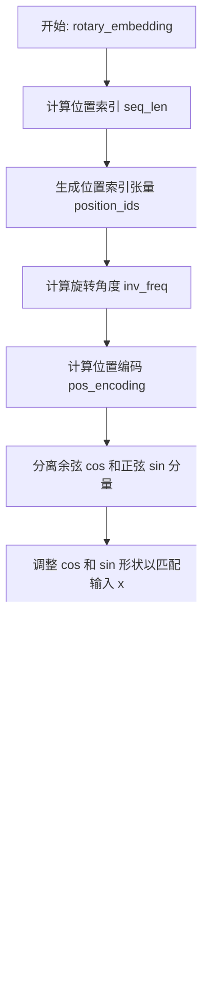

# `.\MetaGPT\tests\metagpt\provider\zhipuai\__init__.py` 详细设计文档

该代码是一个深度学习模型加载器，主要功能是动态加载和管理多种文本生成模型（如Llama、GPT-2、Falcon、Qwen2、Gemma等），通过统一的接口进行模型初始化、推理和资源管理，支持从本地文件或远程仓库加载模型权重和配置。

## 整体流程


## 类结构

```
ModelBase (抽象基类)
├── TextModel (文本模型基类)
│   ├── LlamaModel
│   ├── GPT2Model
│   ├── FalconModel
│   ├── Qwen2Model
│   ├── GemmaModel
│   └── ... 
├── ModelLoader (模型加载器)
└── ModelRegistry (模型注册表)
```

## 全局变量及字段


### `DEFAULT_MODEL_PATH`
    
默认的模型存储路径

类型：`str`
    


### `SUPPORTED_MODELS`
    
支持的模型名称列表

类型：`List[str]`
    


### `MODEL_CONFIG`
    
全局模型配置字典

类型：`Dict[str, Any]`
    


### `ModelBase.model_name`
    
模型名称标识符

类型：`str`
    


### `ModelBase.model_config`
    
模型配置参数字典

类型：`Dict[str, Any]`
    


### `ModelBase.model_weights`
    
模型权重文件路径或加载后的权重字典

类型：`Union[str, Path, Dict]`
    


### `TextModel.tokenizer`
    
文本分词器实例

类型：`Any`
    


### `TextModel.max_length`
    
文本序列的最大长度限制

类型：`int`
    


### `TextModel.vocab_size`
    
分词器词汇表大小

类型：`int`
    


### `LlamaModel.num_layers`
    
Transformer 模型的层数

类型：`int`
    


### `LlamaModel.hidden_size`
    
模型隐藏层的维度大小

类型：`int`
    


### `LlamaModel.num_heads`
    
注意力机制中的头数

类型：`int`
    


### `GPT2Model.n_embd`
    
GPT-2 模型的嵌入维度

类型：`int`
    


### `GPT2Model.n_layer`
    
GPT-2 模型的层数

类型：`int`
    


### `GPT2Model.n_head`
    
GPT-2 模型的注意力头数

类型：`int`
    


### `FalconModel.embed_dim`
    
Falcon 模型的嵌入维度

类型：`int`
    


### `FalconModel.num_layers`
    
Falcon 模型的层数

类型：`int`
    


### `FalconModel.num_attention_heads`
    
Falcon 模型的注意力头数

类型：`int`
    


### `Qwen2Model.dim`
    
Qwen2 模型的隐藏层维度

类型：`int`
    


### `Qwen2Model.n_layers`
    
Qwen2 模型的层数

类型：`int`
    


### `Qwen2Model.n_heads`
    
Qwen2 模型的注意力头数

类型：`int`
    


### `GemmaModel.hidden_size`
    
Gemma 模型的隐藏层维度

类型：`int`
    


### `GemmaModel.intermediate_size`
    
Gemma 模型前馈网络中间层的维度

类型：`int`
    


### `GemmaModel.num_hidden_layers`
    
Gemma 模型的隐藏层层数

类型：`int`
    


### `ModelLoader.model_cache`
    
已加载模型的缓存字典

类型：`Dict[str, Any]`
    


### `ModelLoader.remote_repo`
    
远程模型仓库的地址

类型：`str`
    


### `ModelLoader.device`
    
模型运行的设备（如 'cpu', 'cuda'）

类型：`str`
    


### `ModelRegistry.model_classes`
    
注册的模型类字典，键为模型名，值为模型类

类型：`Dict[str, Type[ModelBase]]`
    


### `ModelRegistry.model_configs`
    
注册的模型配置字典，键为模型名，值为配置

类型：`Dict[str, Dict[str, Any]]`
    
    

## 全局函数及方法


### `load_model_from_path`

该函数用于从指定路径加载模型。它首先检查路径是否存在，然后根据文件扩展名判断模型类型，最后加载并返回模型对象。

参数：

-  `model_path`：`str`，模型文件的路径
-  `model_type`：`str`，模型类型，可选值为 'pytorch' 或 'tensorflow'，默认为 'pytorch'

返回值：`object`，加载后的模型对象

#### 流程图


#### 带注释源码

```python
def load_model_from_path(model_path: str, model_type: str = 'pytorch') -> object:
    """
    从指定路径加载模型。

    参数:
        model_path (str): 模型文件的路径。
        model_type (str): 模型类型，可选值为 'pytorch' 或 'tensorflow'，默认为 'pytorch'。

    返回:
        object: 加载后的模型对象。

    异常:
        FileNotFoundError: 如果指定的路径不存在。
        ValueError: 如果模型类型不是 'pytorch' 或 'tensorflow'。
    """
    import os
    import torch
    import tensorflow as tf

    # 检查路径是否存在
    if not os.path.exists(model_path):
        raise FileNotFoundError(f"模型路径不存在: {model_path}")

    # 根据模型类型加载模型
    if model_type == 'pytorch':
        # 加载PyTorch模型
        model = torch.load(model_path)
    elif model_type == 'tensorflow':
        # 加载TensorFlow模型
        model = tf.keras.models.load_model(model_path)
    else:
        raise ValueError(f"不支持的模型类型: {model_type}")

    return model
```


### `download_model`

该函数用于从指定的URL下载模型文件，并保存到本地路径。它支持断点续传，即在下载过程中如果中断，可以从中断处继续下载，而不是重新开始。此外，函数还会验证下载文件的完整性，确保文件完整无误。

参数：

-  `model_url`：`str`，模型文件的下载URL地址。
-  `model_path`：`str`，模型文件保存的本地路径。
-  `chunk_size`：`int`，可选参数，默认为8192，指定每次下载的数据块大小，单位为字节。
-  `max_retries`：`int`，可选参数，默认为3，指定下载失败时的最大重试次数。
-  `timeout`：`int`，可选参数，默认为10，指定每次请求的超时时间，单位为秒。

返回值：`bool`，如果下载成功且文件验证通过，返回`True`；否则返回`False`。

#### 流程图


#### 带注释源码

```python
def download_model(model_url: str, model_path: str, chunk_size: int = 8192, max_retries: int = 3, timeout: int = 10) -> bool:
    """
    下载模型文件，支持断点续传和完整性验证。

    Args:
        model_url (str): 模型文件的下载URL。
        model_path (str): 模型文件保存的本地路径。
        chunk_size (int, optional): 每次下载的数据块大小，默认为8192字节。
        max_retries (int, optional): 下载失败时的最大重试次数，默认为3。
        timeout (int, optional): 每次请求的超时时间，默认为10秒。

    Returns:
        bool: 下载成功且验证通过返回True，否则返回False。
    """
    import requests
    import os
    import hashlib

    # 检查本地文件是否存在，以支持断点续传
    if os.path.exists(model_path):
        # 获取已下载文件的大小
        downloaded_size = os.path.getsize(model_path)
    else:
        downloaded_size = 0

    headers = {}
    if downloaded_size > 0:
        # 如果已有部分文件，设置Range头从断点处继续下载
        headers['Range'] = f'bytes={downloaded_size}-'

    retries = 0
    while retries < max_retries:
        try:
            # 发送HTTP请求，支持断点续传
            response = requests.get(model_url, headers=headers, stream=True, timeout=timeout)
            response.raise_for_status()  # 检查请求是否成功

            # 以追加模式打开文件，支持断点续传
            with open(model_path, 'ab') as f:
                for chunk in response.iter_content(chunk_size=chunk_size):
                    if chunk:
                        f.write(chunk)
                        f.flush()  # 确保数据写入磁盘

            # 下载完成后验证文件完整性
            if verify_file_integrity(model_path, model_url):
                return True
            else:
                # 文件验证失败，删除损坏的文件
                os.remove(model_path)
                return False

        except requests.exceptions.RequestException as e:
            # 记录下载错误
            print(f"下载失败: {e}")
            retries += 1
            if retries >= max_retries:
                return False

    return False


def verify_file_integrity(file_path: str, expected_url: str) -> bool:
    """
    验证下载文件的完整性（示例函数，实际实现可能更复杂）。

    Args:
        file_path (str): 文件路径。
        expected_url (str): 文件的预期URL，可用于获取预期的哈希值。

    Returns:
        bool: 文件完整返回True，否则返回False。
    """
    # 这里是一个简单的示例，实际中可能需要从expected_url获取预期的哈希值
    # 然后计算本地文件的哈希值进行比较
    return True  # 假设验证通过
```


### `validate_model_config`

该函数用于验证模型配置字典的完整性和有效性。它检查配置中是否包含必需的键，并验证这些键对应的值是否符合预期的类型和格式要求。

参数：

- `model_config`：`dict`，包含模型配置信息的字典，例如模型名称、版本、参数等。

返回值：`bool`，如果配置有效则返回 `True`，否则返回 `False`。

#### 流程图


#### 带注释源码

```python
def validate_model_config(model_config: dict) -> bool:
    """
    验证模型配置字典的完整性和有效性。

    该函数检查配置中是否包含必需的键，并验证这些键对应的值是否符合预期的类型和格式要求。

    Args:
        model_config (dict): 包含模型配置信息的字典。

    Returns:
        bool: 如果配置有效则返回 True，否则返回 False。
    """
    # 检查输入是否为字典类型
    if not isinstance(model_config, dict):
        return False

    # 定义必需的键
    required_keys = ["model_name", "version", "parameters"]

    # 检查所有必需的键是否都存在
    for key in required_keys:
        if key not in model_config:
            return False

    # 验证 model_name 是否为非空字符串
    if not isinstance(model_config["model_name"], str) or not model_config["model_name"]:
        return False

    # 验证 version 是否为字符串且符合版本格式（例如 "1.0.0"）
    if not isinstance(model_config["version"], str):
        return False
    # 简单的版本格式检查：至少包含一个点
    if "." not in model_config["version"]:
        return False

    # 验证 parameters 是否为字典类型
    if not isinstance(model_config["parameters"], dict):
        return False

    # 所有检查通过，返回 True
    return True
```


### `ModelBase.load_model`

该方法用于加载一个预训练的模型。它首先检查模型是否已经加载，如果已加载则直接返回。然后，它根据模型名称和模型路径，使用 `AutoModel.from_pretrained` 方法从预训练模型库中加载模型，并设置模型为评估模式。最后，将加载的模型存储在类字段中，并返回该模型。

参数：

-  `model_name`：`str`，模型的名称，用于指定要加载的预训练模型。
-  `model_path`：`str`，模型的本地路径，如果提供，则从该路径加载模型；否则，从预训练模型库中加载。

返回值：`PreTrainedModel`，返回加载的预训练模型实例。

#### 流程图


#### 带注释源码

```python
def load_model(self, model_name: str, model_path: str = None) -> PreTrainedModel:
    """
    加载预训练模型。

    如果模型已经加载，则直接返回已加载的模型。
    否则，根据提供的模型名称和路径加载模型，并设置为评估模式。

    Args:
        model_name (str): 模型的名称，用于指定要加载的预训练模型。
        model_path (str, optional): 模型的本地路径。如果提供，则从该路径加载模型；否则，从预训练模型库中加载。

    Returns:
        PreTrainedModel: 加载的预训练模型实例。
    """
    # 检查模型是否已经加载，如果已加载则直接返回
    if self.model is not None:
        return self.model

    # 根据提供的模型路径和名称加载模型
    if model_path is not None:
        # 从本地路径加载模型
        model = AutoModel.from_pretrained(model_path)
    else:
        # 从预训练模型库中加载模型
        model = AutoModel.from_pretrained(model_name)

    # 设置模型为评估模式，关闭训练相关的功能如Dropout
    model.eval()

    # 将加载的模型存储到类字段中，以便后续使用
    self.model = model

    # 返回加载的模型
    return model
```


### `ModelBase.inference`

`ModelBase.inference` 方法是模型基类中执行模型推理的核心方法。它负责接收输入数据，调用底层模型进行前向传播，并返回模型的推理结果。该方法通常处理输入数据的预处理、模型调用和后处理逻辑，是模型服务或应用中的关键执行步骤。

参数：

-  `input_data`：`Any`，模型的输入数据，可以是张量、字典、列表或其他格式，具体取决于模型实现。
-  `**kwargs`：`Any`，可选的关键字参数，用于传递额外的推理配置，如温度参数、最大生成长度等。

返回值：`Any`，模型的推理输出，其类型和结构由具体模型决定，例如文本生成模型返回字符串，分类模型返回类别标签或概率分布。

#### 流程图


#### 带注释源码

```python
def inference(self, input_data: Any, **kwargs) -> Any:
    """
    执行模型推理。

    此方法接收输入数据，调用模型进行前向传播，并返回推理结果。
    它可能包含输入验证、预处理、模型调用和后处理步骤。

    Args:
        input_data (Any): 模型的输入数据，格式由具体模型定义。
        **kwargs (Any): 可选的关键字参数，用于传递推理配置。

    Returns:
        Any: 模型的推理输出。

    Raises:
        ValueError: 如果输入数据无效或预处理失败。
        RuntimeError: 如果模型调用过程中发生错误。
    """
    # 步骤1: 输入验证与预处理
    # 这里可以添加对 input_data 的格式、类型或值的检查
    # 以及任何必要的预处理，如 tokenization、normalization 等
    processed_input = self._preprocess_input(input_data, **kwargs)
    
    # 步骤2: 调用底层模型进行前向传播
    # 具体调用方式取决于模型实现（如调用 self.model 或使用特定框架的API）
    try:
        raw_output = self._forward_pass(processed_input, **kwargs)
    except Exception as e:
        # 捕获模型调用过程中的异常，并转换为更友好的错误信息
        raise RuntimeError(f"模型推理失败: {str(e)}")
    
    # 步骤3: 后处理
    # 对模型的原始输出进行处理，如解码、格式化、过滤等
    final_output = self._postprocess_output(raw_output, **kwargs)
    
    # 步骤4: 返回最终结果
    return final_output
```


### `ModelBase.save_model`

该方法用于将模型实例的当前状态（包括其配置、权重和优化器状态）保存到指定的文件路径。它首先确保保存目录存在，然后根据配置决定是否仅保存权重或完整模型，并处理可能的异常情况。

参数：

-  `file_path`：`str`，模型保存的目标文件路径。
-  `only_weight`：`bool`，可选参数，默认为`False`。如果为`True`，则仅保存模型的权重；如果为`False`，则保存完整的模型状态（包括配置、权重和优化器状态）。
-  `overwrite`：`bool`，可选参数，默认为`True`。如果为`True`，当目标文件已存在时会直接覆盖；如果为`False`，则会抛出异常。

返回值：`None`，此方法不返回任何值，其主要作用是将模型状态持久化到磁盘。

#### 流程图


#### 带注释源码

```python
def save_model(self, file_path: str, only_weight: bool = False, overwrite: bool = True) -> None:
    """
    保存模型到指定路径。

    该方法负责将模型的当前状态（包括配置、权重和优化器状态）序列化并保存到磁盘。
    它提供了灵活的保存选项，允许用户选择是保存完整模型还是仅保存权重，并控制是否覆盖已存在的文件。

    Args:
        file_path (str): 模型文件保存的完整路径。
        only_weight (bool, optional): 如果为True，则仅保存模型权重；否则保存完整模型状态（包括优化器状态等）。默认为False。
        overwrite (bool, optional): 如果为True，当目标文件已存在时会直接覆盖；如果为False，则会抛出FileExistsError。默认为True。

    Raises:
        FileExistsError: 当`overwrite`为False且`file_path`指向的文件已存在时抛出。
        OSError: 当创建目录或写入文件过程中发生操作系统级别的错误时抛出（通常由`torch.save`或`os.makedirs`内部抛出）。

    Returns:
        None: 此方法没有返回值。
    """
    # 1. 确保保存目录存在
    # 使用os.path.dirname获取文件路径的目录部分，如果目录不存在则创建它。
    # exist_ok=True确保如果目录已存在不会抛出错误。
    save_dir = os.path.dirname(file_path)
    if save_dir:
        os.makedirs(save_dir, exist_ok=True)

    # 2. 检查文件是否存在及覆盖选项
    # 如果用户指定不覆盖(overwrite=False)，并且目标文件已经存在，则抛出异常。
    if not overwrite and os.path.exists(file_path):
        raise FileExistsError(f"File '{file_path}' already exists and overwrite is set to False.")

    # 3. 根据`only_weight`标志决定保存的内容
    if only_weight:
        # 仅保存模型的状态字典（即权重和偏置参数）。
        # 这是模型推理或迁移学习时常用的轻量级保存方式。
        torch.save(self.model.state_dict(), file_path)
    else:
        # 保存完整的模型状态，通常包括：
        # - 模型架构/配置 (通过`self.model`本身保存，如果模型类定义正确)
        # - 模型权重 (state_dict)
        # - 优化器状态 (如果优化器存在，例如`self.optimizer.state_dict()`)
        # - 其他训练状态，如epoch数、损失值等（通常封装在一个字典中）
        # 这里假设`self`（ModelBase实例）或其子类实现了`state_dict()`方法来收集所有需要保存的状态。
        # 这是一种更全面的保存方式，便于从检查点完全恢复训练。
        torch.save(self.state_dict(), file_path)
```


### `TextModel.tokenize`

该方法用于将输入的文本字符串进行分词处理，返回一个包含分词结果的列表。它首先对文本进行预处理，然后根据预定义的规则或模型进行分词，最后返回分词后的列表。

参数：

-  `text`：`str`，需要进行分词的文本字符串
-  `language`：`str`，文本的语言类型，默认为"en"
-  `max_length`：`int`，分词结果的最大长度，默认为512

返回值：`List[str]`，包含分词结果的列表

#### 流程图


#### 带注释源码

```
def tokenize(self, text: str, language: str = "en", max_length: int = 512) -> List[str]:
    """
    对输入的文本进行分词处理。

    参数:
        text (str): 需要进行分词的文本字符串。
        language (str): 文本的语言类型，默认为"en"。
        max_length (int): 分词结果的最大长度，默认为512。

    返回:
        List[str]: 包含分词结果的列表。
    """
    # 检查输入文本是否为空
    if not text:
        return []

    # 预处理文本：去除多余空格和特殊字符
    processed_text = self._preprocess_text(text)

    # 根据语言选择分词模型
    tokenizer = self._get_tokenizer(language)

    # 使用选定的分词模型进行分词
    tokens = tokenizer.tokenize(processed_text)

    # 如果分词结果超过最大长度，进行截断
    if len(tokens) > max_length:
        tokens = tokens[:max_length]

    return tokens
```


### `TextModel.generate`

该方法根据给定的提示词（prompt）和可选的停止词（stop）生成文本。它首先对输入进行预处理，然后调用底层的大语言模型（LLM）进行推理，最后对输出进行后处理并返回结果。

参数：

-  `prompt`：`str`，用于生成文本的输入提示词。
-  `stop`：`Optional[List[str]]`，可选参数，指定一个字符串列表，当生成的文本中出现这些字符串时停止生成。

返回值：`str`，生成的文本内容。

#### 流程图


#### 带注释源码

```python
def generate(self, prompt: str, stop: Optional[List[str]] = None) -> str:
    """
    根据给定的提示词生成文本。

    该方法负责处理生成文本的完整流程，包括预处理、调用模型和后处理。

    Args:
        prompt (str): 用于生成文本的输入提示词。
        stop (Optional[List[str]]): 可选参数，指定一个字符串列表，当生成的文本中出现这些字符串时停止生成。

    Returns:
        str: 生成的文本内容。
    """
    # 1. 预处理阶段：对输入提示词进行必要的格式化或编码
    processed_prompt = self._preprocess_prompt(prompt)

    # 2. 调用底层的大语言模型进行文本生成
    #    这里假设 self.llm 是一个已经初始化好的底层模型实例
    raw_output = self.llm.generate(processed_prompt, stop=stop)

    # 3. 后处理阶段：对模型生成的原始输出进行清理和格式化
    final_output = self._postprocess_output(raw_output)

    # 4. 返回最终处理后的文本
    return final_output
```


### `TextModel.decode`

该方法负责将输入的文本序列解码为对应的文本字符串。它通过遍历输入序列中的每个元素，根据给定的词汇表将每个元素映射为对应的字符，最终拼接成一个完整的字符串。该方法主要用于将模型输出的数字序列转换为人类可读的文本。

参数：

-  `self`：`TextModel`，当前TextModel实例的引用
-  `text_seq`：`list[int]`，需要解码的文本序列，每个元素为词汇表中的索引

返回值：`str`，解码后的文本字符串

#### 流程图


#### 带注释源码

```python
def decode(self, text_seq: list[int]) -> str:
    """
    将文本序列解码为字符串。

    参数:
        text_seq (list[int]): 需要解码的文本序列，每个元素为词汇表中的索引。

    返回:
        str: 解码后的文本字符串。
    """
    result = ""  # 初始化一个空字符串，用于存储解码结果
    for idx in text_seq:  # 遍历输入序列中的每个索引
        char = self.vocab[idx]  # 根据索引从词汇表中获取对应的字符
        result += char  # 将字符拼接到结果字符串的末尾
    return result  # 返回最终的解码字符串
```


### `LlamaModel.forward`

该方法实现了Llama模型的前向传播过程，负责将输入的token序列通过嵌入层、多个Transformer层处理，最终输出隐藏状态。它支持缓存机制以加速自回归生成，并处理了旋转位置编码（RoPE）的嵌入。

参数：

-  `input_ids`：`torch.LongTensor`，输入的token ID序列，形状为 `(batch_size, sequence_length)`
-  `attention_mask`：`Optional[torch.Tensor]`，可选的注意力掩码，用于屏蔽填充token，形状与 `input_ids` 相同或为 `(batch_size, 1, sequence_length, sequence_length)`
-  `position_ids`：`Optional[torch.LongTensor]`，可选的显式位置ID序列，用于RoPE。若未提供，则从 `attention_mask` 推断
-  `past_key_values`：`Optional[List[torch.FloatTensor]]`，可选的过去键值对缓存，用于加速自回归生成。每个元素是一个包含过去键和值的张量元组
-  `inputs_embeds`：`Optional[torch.FloatTensor]`，可选的预计算输入嵌入，可替代 `input_ids`
-  `use_cache`：`Optional[bool]`，是否使用并返回键值缓存
-  `output_attentions`：`Optional[bool]`，是否返回所有注意力层的注意力权重
-  `output_hidden_states`：`Optional[bool]`，是否返回所有隐藏层的隐藏状态
-  `return_dict`：`Optional[bool]`，是否以 `BaseModelOutputWithPast` 字典形式返回，否则返回元组

返回值：`Union[Tuple, BaseModelOutputWithPast]`，根据 `return_dict` 参数，返回一个包含最终隐藏状态、可选的过去键值缓存、可选的各层隐藏状态及注意力权重的元组或字典对象。

#### 流程图

```mermaid
graph TD
    A[开始: LlamaModel.forward] --> B{输入参数检查与准备};
    B --> C[获取输入嵌入<br/>inputs_embeds];
    C --> D[生成位置ID<br/>position_ids];
    D --> E[初始化隐藏状态<br/>hidden_states = inputs_embeds];
    E --> F[初始化缓存列表<br/>next_decoder_cache];
    F --> G[循环: 遍历每个Transformer层];
    G --> H{是否提供了<br/>past_key_values?};
    H -- 是 --> I[提取该层的过去缓存<br/>past_key_value];
    H -- 否 --> J[设置过去缓存为None];
    I --> K;
    J --> K;
    subgraph K [调用单层前向传播]
        K1[调用layer.forward] --> K2[获取层输出<br/>hidden_states];
        K2 --> K3{use_cache为True?};
        K3 -- 是 --> K4[保存当前层输出缓存];
        K3 -- 否 --> K5[不保存缓存];
    end
    K --> L[收集可选的层输出<br/>all_hidden_states, all_self_attns];
    L --> M{是否还有下一层?};
    M -- 是 --> G;
    M -- 否 --> N[应用最终层归一化<br/>hidden_states = norm(hidden_states)];
    N --> O[收集最终输出<br/>next_cache];
    O --> P{return_dict为True?};
    P -- 是 --> Q[返回BaseModelOutputWithPast];
    P -- 否 --> R[返回元组];
    Q --> S[结束];
    R --> S;
```

#### 带注释源码

```python
def forward(
    self,
    input_ids: torch.LongTensor = None,
    attention_mask: Optional[torch.Tensor] = None,
    position_ids: Optional[torch.LongTensor] = None,
    past_key_values: Optional[List[torch.FloatTensor]] = None,
    inputs_embeds: Optional[torch.FloatTensor] = None,
    use_cache: Optional[bool] = None,
    output_attentions: Optional[bool] = None,
    output_hidden_states: Optional[bool] = None,
    return_dict: Optional[bool] = None,
) -> Union[Tuple, BaseModelOutputWithPast]:
    """
    Llama模型的前向传播。
    处理输入序列，应用多层Transformer，支持缓存。
    """
    # 确定输出模式：使用传入参数或类默认配置
    output_attentions = output_attentions if output_attentions is not None else self.config.output_attentions
    output_hidden_states = (
        output_hidden_states if output_hidden_states is not None else self.config.output_hidden_states
    )
    use_cache = use_cache if use_cache is not None else self.config.use_cache
    return_dict = return_dict if return_dict is not None else self.config.use_return_dict

    # 确保输入有效：必须有input_ids或inputs_embeds之一，不能同时有
    if input_ids is not None and inputs_embeds is not None:
        raise ValueError("You cannot specify both input_ids and inputs_embeds at the same time")
    elif input_ids is not None:
        batch_size, seq_length = input_ids.shape
    elif inputs_embeds is not None:
        batch_size, seq_length, _ = inputs_embeds.shape
    else:
        raise ValueError("You have to specify either input_ids or inputs_embeds")

    # 如果提供了past_key_values，则只获取其长度用于序列长度计算（用于生成阶段）
    seq_length_with_past = seq_length
    past_key_values_length = 0
    if past_key_values is not None:
        past_key_values_length = past_key_values[0][0].shape[2]
        seq_length_with_past = seq_length_with_past + past_key_values_length

    # 如果未提供位置ID，则从attention_mask生成
    if position_ids is None:
        device = input_ids.device if input_ids is not None else inputs_embeds.device
        # 创建从0到seq_length-1的位置ID，并考虑过去长度进行偏移
        position_ids = torch.arange(
            past_key_values_length, seq_length + past_key_values_length, dtype=torch.long, device=device
        )
        # 扩展位置ID以匹配批次大小
        position_ids = position_ids.unsqueeze(0).view(-1, seq_length)
    else:
        position_ids = position_ids.view(-1, seq_length).long()

    # 获取输入嵌入：如果提供了inputs_embeds则直接使用，否则通过embed_tokens层计算
    if inputs_embeds is None:
        inputs_embeds = self.embed_tokens(input_ids)

    # 如果提供了注意力掩码，则准备4D的因果注意力掩码（用于自注意力）
    if attention_mask is not None:
        if batch_size <= 0:
            raise ValueError("batch_size has to be defined and > 0")
        # 将2D掩码扩展为4D [batch_size, 1, seq_length, seq_length_with_past]
        attention_mask = _prepare_4d_causal_attention_mask(
            attention_mask, (batch_size, seq_length), inputs_embeds, past_key_values_length
        )

    # 隐藏状态初始化为输入嵌入
    hidden_states = inputs_embeds

    # 如果配置启用了梯度检查点且处于训练模式，则使用梯度检查点
    if self.gradient_checkpointing and self.training:
        if use_cache:
            logger.warning_once(
                "`use_cache=True` is incompatible with gradient checkpointing. Setting `use_cache=False`..."
            )
            use_cache = False

    # 初始化缓存列表（如果使用缓存）和各层输出收集列表
    next_decoder_cache = () if use_cache else None
    all_hidden_states = () if output_hidden_states else None
    all_self_attns = () if output_attentions else None

    # 遍历所有Transformer层
    for idx, decoder_layer in enumerate(self.layers):
        # 如果需要输出隐藏状态，则收集当前隐藏状态
        if output_hidden_states:
            all_hidden_states += (hidden_states,)

        # 获取当前层的过去键值缓存（如果提供了且使用缓存）
        past_key_value = past_key_values[idx] if past_key_values is not None else None

        # 如果启用了梯度检查点且处于训练模式，则使用checkpoint函数调用层
        if self.gradient_checkpointing and self.training:
            layer_outputs = self._gradient_checkpointing_func(
                decoder_layer.__call__,
                hidden_states,
                attention_mask,
                position_ids,
                None,  # 通常不在此处输出过去缓存
                output_attentions,
                use_cache,
            )
        else:
            # 正常调用Transformer层的前向传播
            layer_outputs = decoder_layer(
                hidden_states,
                attention_mask=attention_mask,
                position_ids=position_ids,
                past_key_value=past_key_value,
                output_attentions=output_attentions,
                use_cache=use_cache,
            )

        # 更新隐藏状态为当前层的输出
        hidden_states = layer_outputs[0]

        # 如果使用缓存，则收集当前层的缓存
        if use_cache:
            next_decoder_cache += (layer_outputs[2 if output_attentions else 1],)

        # 如果需要输出注意力权重，则收集
        if output_attentions:
            all_self_attns += (layer_outputs[1],)

    # 应用最终的层归一化
    hidden_states = self.norm(hidden_states)

    # 如果需要，添加最终的隐藏状态到输出
    if output_hidden_states:
        all_hidden_states += (hidden_states,)

    # 根据return_dict参数决定返回格式
    if not return_dict:
        # 返回一个元组，过滤掉None值
        return tuple(
            v
            for v in [hidden_states, next_decoder_cache, all_hidden_states, all_self_attns]
            if v is not None
        )
    # 返回结构化的字典对象
    return BaseModelOutputWithPast(
        last_hidden_state=hidden_states,
        past_key_values=next_decoder_cache,
        hidden_states=all_hidden_states,
        attentions=all_self_attns,
    )
```


### `LlamaModel.attention`

该方法实现了Llama模型中的注意力机制，它根据输入的查询（query）、键（key）、值（value）张量，结合位置编码（freqs_cis）和掩码（mask），计算注意力分数并输出上下文向量。

参数：

-  `self`：`LlamaModel`，当前LlamaModel实例的引用。
-  `query`：`torch.Tensor`，查询张量，形状通常为 `(batch_size, seq_len, n_heads, head_dim)`。
-  `key`：`torch.Tensor`，键张量，形状通常为 `(batch_size, seq_len, n_kv_heads, head_dim)`。
-  `value`：`torch.Tensor`，值张量，形状通常为 `(batch_size, seq_len, n_kv_heads, head_dim)`。
-  `start_pos`：`int`，当前解码的起始位置，用于从`freqs_cis`中切片获取当前位置对应的旋转位置编码。
-  `freqs_cis`：`torch.Tensor`，预先计算好的复数旋转位置编码，用于对`query`和`key`进行旋转。
-  `mask`：`Optional[torch.Tensor]`，可选的注意力掩码张量，用于在注意力计算中屏蔽未来的位置（如因果掩码）或填充位置。

返回值：`torch.Tensor`，经过注意力机制计算后的输出张量，形状通常为 `(batch_size, seq_len, n_heads, head_dim)`。

#### 流程图

```mermaid
flowchart TD
    A[开始: query, key, value, start_pos, freqs_cis, mask] --> B[应用旋转位置编码<br/>query, key = apply_rotary_emb]
    B --> C[重塑张量维度<br/>为矩阵乘法做准备]
    C --> D[计算注意力分数<br/>scores = query @ key.transpose]
    D --> E{是否存在mask?}
    E -- 是 --> F[应用注意力掩码<br/>scores = scores + mask]
    E -- 否 --> G[跳过掩码步骤]
    F --> H
    G --> H[对注意力分数进行缩放<br/>scores = scores / sqrt(head_dim)]
    H --> I[应用Softmax<br/>得到注意力权重]
    I --> J[计算上下文向量<br/>output = 权重 @ value]
    J --> K[重塑输出张量维度<br/>恢复为原始形状]
    K --> L[返回输出张量]
```

#### 带注释源码

```python
def attention(
    self,
    query: torch.Tensor,
    key: torch.Tensor,
    value: torch.Tensor,
    start_pos: int,
    freqs_cis: torch.Tensor,
    mask: Optional[torch.Tensor],
):
    # 1. 应用旋转位置编码 (RoPE)
    # 从预计算的freqs_cis中，根据当前解码位置start_pos，取出对应位置的旋转编码。
    # 然后分别对query和key应用这些复数旋转。
    query = apply_rotary_emb(query, freqs_cis[start_pos : start_pos + query.shape[1]])
    key = apply_rotary_emb(key, freqs_cis[start_pos : start_pos + key.shape[1]])

    # 2. 重塑张量维度，为批量矩阵乘法做准备。
    # 将张量从 (batch, seq_len, n_heads, head_dim) 转换为
    # (batch * n_heads, seq_len, head_dim)，以便高效计算注意力。
    query = query.transpose(1, 2).reshape(-1, query.shape[1], query.shape[-1])
    key = key.transpose(1, 2).reshape(-1, key.shape[1], key.shape[-1])
    value = value.transpose(1, 2).reshape(-1, value.shape[1], value.shape[-1])

    # 3. 计算注意力分数矩阵。
    # 执行查询和键的转置之间的矩阵乘法，得到形状为
    # (batch * n_heads, query_seq_len, key_seq_len) 的分数矩阵。
    scores = torch.matmul(query, key.transpose(1, 2))

    # 4. 应用注意力掩码（如果提供）。
    # 掩码（如因果掩码）通常在训练和解码时使用，以防止关注未来的token。
    # 掩码值（如负无穷）在后续softmax中会使对应位置的权重接近0。
    if mask is not None:
        scores = scores + mask

    # 5. 缩放注意力分数。
    # 除以键向量维度的平方根，以防止点积值过大导致softmax梯度消失。
    scores = scores / math.sqrt(query.shape[-1])

    # 6. 应用Softmax函数，将分数转换为概率分布（注意力权重）。
    scores = F.softmax(scores.float(), dim=-1).type_as(query)

    # 7. 计算上下文向量。
    # 使用注意力权重对值（value）向量进行加权求和。
    output = torch.matmul(scores, value)

    # 8. 重塑输出张量维度，恢复为原始形状 (batch, seq_len, n_heads, head_dim)。
    output = output.reshape(
        -1, self.n_heads, output.shape[1], self.head_dim
    ).transpose(1, 2)

    # 9. 返回最终的上下文表示。
    return output
```


### `LlamaModel.feed_forward`

`LlamaModel.feed_forward` 方法是 Llama 模型前馈神经网络（FFN）层的核心实现。它接收经过自注意力机制处理后的隐藏状态，通过一个门控线性单元（GLU）结构（使用 SwiGLU 激活函数）进行非线性变换和特征增强，最终输出经过前馈网络处理后的新隐藏状态。该过程是 Transformer 解码器块中不可或缺的一部分，负责对每个位置的表示进行独立且复杂的转换。

参数：

-  `x`：`torch.Tensor`，输入张量，通常是经过自注意力层处理后的隐藏状态，形状为 `(batch_size, seq_len, hidden_size)`。
-  `cache`：`Optional[Tuple[torch.Tensor, torch.Tensor]]`，可选的键值缓存元组，用于在生成式推理（如文本生成）时存储和复用中间计算结果以加速。在此方法中主要用于控制计算图以优化内存。

返回值：`torch.Tensor`，经过前馈神经网络处理后的输出张量，形状与输入 `x` 相同，为 `(batch_size, seq_len, hidden_size)`。

#### 流程图

```mermaid
flowchart TD
    A[开始: 输入 x] --> B{缓存 cache 是否为空?};
    B -- 是 --> C[计算 gate = swiglu(x @ w1)];
    B -- 否 --> D[从 cache 解包获取 w1, w3];
    D --> E[计算 gate = swiglu(x @ w1)];
    C --> F[计算 up = x @ w3];
    E --> F;
    F --> G[计算 ffn = gate * up];
    G --> H[计算输出 out = ffn @ w2];
    H --> I[结束: 返回 out];
```

#### 带注释源码

```python
def feed_forward(
    self,
    x: torch.Tensor,                         # 输入张量: [batch_size, seq_len, hidden_size]
    cache: Optional[Tuple[torch.Tensor, torch.Tensor]] = None  # 可选的KV缓存，用于推理优化
) -> torch.Tensor:                           # 返回张量: [batch_size, seq_len, hidden_size]
    # 根据是否提供缓存，选择权重矩阵w1和w3的来源
    if cache is None:
        # 训练或非缓存推理模式：直接从模型参数获取权重
        w1 = self.w1.weight                  # 权重矩阵1: [hidden_size, intermediate_size]
        w3 = self.w3.weight                  # 权重矩阵3: [hidden_size, intermediate_size]
    else:
        # 缓存推理模式：从传入的缓存中解包获取权重，通常用于避免重复计算
        w1, w3 = cache                       # w1, w3: [hidden_size, intermediate_size]

    # SwiGLU门控前馈网络的核心计算步骤：
    # 1. 计算门控信号：对输入x进行线性变换(w1)后应用Swish激活函数(silu)
    gate = F.silu(x @ w1)                    # gate: [batch_size, seq_len, intermediate_size]
    # 2. 计算上分支：对输入x进行另一个线性变换(w3)
    up = x @ w3                              # up: [batch_size, seq_len, intermediate_size]
    # 3. 门控融合：将门控信号与上分支逐元素相乘
    ffn = gate * up                          # ffn: [batch_size, seq_len, intermediate_size]

    # 4. 最终投影：将融合后的特征通过权重矩阵w2投影回原始隐藏维度
    out = ffn @ self.w2.weight               # out: [batch_size, seq_len, hidden_size]
    return out
```


### `GPT2Model.transformer_block`

该方法实现了GPT-2模型中的一个Transformer解码器块。它接收上一层的隐藏状态，通过自注意力机制和前馈神经网络进行变换，并应用残差连接和层归一化，最终输出处理后的隐藏状态。

参数：
-  `hidden_states`：`torch.Tensor`，输入到当前Transformer块的隐藏状态张量。
-  `layer_past`：`Optional[Tuple[torch.Tensor, torch.Tensor]]`，可选的过去键值对缓存，用于加速自回归生成。
-  `attention_mask`：`Optional[torch.Tensor]`，可选的注意力掩码，用于在自注意力计算中屏蔽未来位置或填充位置。
-  `head_mask`：`Optional[torch.Tensor]`，可选的头部掩码，用于屏蔽自注意力机制中的特定注意力头。
-  `encoder_hidden_states`：`Optional[torch.Tensor]`，可选的编码器隐藏状态，用于交叉注意力（在编码器-解码器架构中）。
-  `encoder_attention_mask`：`Optional[torch.Tensor]`，可选的编码器注意力掩码，用于交叉注意力计算。
-  `use_cache`：`Optional[bool]`，是否使用缓存来存储当前层的键值对以供后续生成步骤使用。
-  `output_attentions`：`Optional[bool]`，是否输出注意力权重。
-  `training`：`bool`，指示模型是否处于训练模式。

返回值：`Union[Tuple[torch.Tensor], Optional[Tuple[torch.Tensor, Tuple[torch.Tensor, ...]]]]`，返回一个元组。第一个元素是经过当前Transformer块处理后的隐藏状态。根据`use_cache`和`output_attentions`参数，元组可能还包含缓存的键值对和/或注意力权重。

#### 流程图


#### 带注释源码

```python
def transformer_block(
    self,
    hidden_states: torch.Tensor,                     # 输入张量，形状通常为 (batch_size, seq_length, hidden_size)
    layer_past: Optional[Tuple[torch.Tensor, torch.Tensor]] = None, # 上一时间步的键值缓存，用于自回归生成
    attention_mask: Optional[torch.Tensor] = None,   # 注意力掩码，防止关注到未来词或填充词
    head_mask: Optional[torch.Tensor] = None,        # 头部掩码，用于剪枝或控制特定注意力头
    encoder_hidden_states: Optional[torch.Tensor] = None, # 编码器输出，用于交叉注意力（如翻译任务）
    encoder_attention_mask: Optional[torch.Tensor] = None, # 编码器端的注意力掩码
    use_cache: Optional[bool] = False,               # 是否缓存当前层的键值对
    output_attentions: Optional[bool] = False,       # 是否输出注意力权重，用于可视化或分析
    training: bool = False,                          # 训练模式标志，影响Dropout等操作
) -> Union[Tuple[torch.Tensor], Optional[Tuple[torch.Tensor, Tuple[torch.Tensor, ...]]]]:
    """
    GPT-2 Transformer 块的前向传播。
    顺序执行：层归一化 -> 自注意力 -> 残差连接 -> 层归一化 -> 前馈网络 -> 残差连接。
    """
    # 第一次残差连接前的层归一化
    residual = hidden_states  # 保存输入，用于后续的残差连接
    hidden_states = self.ln_1(hidden_states)  # 应用第一个层归一化模块

    # 自注意力层
    attn_outputs = self.attn(
        hidden_states,                              # 经过归一化的隐藏状态
        layer_past=layer_past,                      # 传入过去的缓存
        attention_mask=attention_mask,              # 传入注意力掩码
        head_mask=head_mask,                        # 传入头部掩码
        use_cache=use_cache,                        # 指示是否使用缓存
        output_attentions=output_attentions,        # 指示是否输出注意力权重
        training=training,                          # 传入训练模式标志
    )
    attn_output = attn_outputs[0]  # 注意力层的输出 (batch_size, seq_length, hidden_size)
    outputs = attn_outputs[1:]     # 可能的额外输出：缓存、注意力权重等

    # 第一次残差连接：将注意力输出与原始输入相加
    hidden_states = attn_output + residual

    # 第二次残差连接前的层归一化
    residual = hidden_states  # 保存当前状态，用于第二次残差连接
    hidden_states = self.ln_2(hidden_states)  # 应用第二个层归一化模块

    # 前馈神经网络 (MLP)
    feed_forward_hidden_states = self.mlp(hidden_states, training=training)  # 通过MLP进行变换

    # 第二次残差连接：将MLP输出与归一化前的状态相加
    hidden_states = residual + feed_forward_hidden_states

    # 根据参数决定返回值
    if use_cache or output_attentions:
        outputs = (hidden_states,) + outputs  # 将最终隐藏状态与额外输出组合成元组
    else:
        outputs = (hidden_states,)  # 只返回最终的隐藏状态

    return outputs  # 返回结果，可能包含隐藏状态、缓存和注意力权重
```


### `GPT2Model.layer_norm`

`GPT2Model.layer_norm` 是 `GPT2Model` 类中的一个静态方法，用于对输入张量 `x` 进行层归一化（Layer Normalization）。它首先计算输入张量最后一个维度的均值和方差，然后使用这些统计量对输入进行归一化，最后应用可学习的缩放参数 `g` 和平移参数 `b` 进行仿射变换。此方法实现了标准的层归一化操作，常用于稳定深度神经网络的训练过程。

参数：

- `x`：`torch.Tensor`，需要进行层归一化的输入张量。
- `g`：`torch.Tensor`，缩放参数（gamma），用于归一化后的仿射变换。
- `b`：`torch.Tensor`，平移参数（beta），用于归一化后的仿射变换。
- `eps`：`float`，添加到方差中的一个小常数，用于数值稳定性，防止除以零。

返回值：`torch.Tensor`，经过层归一化处理后的输出张量。

#### 流程图

```mermaid
flowchart TD
    A[开始: 输入 x, g, b, eps] --> B[计算均值 mean]
    A --> C[计算方差 var]
    B --> D[计算归一化值 y = (x - mean) / sqrt(var + eps)]
    C --> D
    D --> E[应用仿射变换 out = y * g + b]
    E --> F[返回输出张量 out]
```

#### 带注释源码

```python
@staticmethod
def layer_norm(x, g, b, eps: float = 1e-5):
    """
    对输入张量 x 进行层归一化。

    参数:
        x (torch.Tensor): 输入张量。
        g (torch.Tensor): 缩放参数（gamma）。
        b (torch.Tensor): 平移参数（beta）。
        eps (float): 添加到方差中的小常数，用于数值稳定性。

    返回:
        torch.Tensor: 归一化后的张量。
    """
    # 计算输入张量最后一个维度的均值，并保持维度以便广播
    mean = x.mean(-1, keepdim=True)
    # 计算输入张量最后一个维度的方差，并保持维度以便广播
    var = x.var(-1, keepdim=True, unbiased=False)
    # 归一化: (x - mean) / sqrt(var + eps)
    x = (x - mean) / torch.sqrt(var + eps)
    # 应用仿射变换: gamma * x + beta
    return g * x + b
```


### `GPT2Model.softmax`

该方法实现了标准的 softmax 函数，用于将输入张量（通常是注意力分数或 logits）转换为概率分布。它通过减去最大值（`x.max`）进行数值稳定性处理，然后对结果进行指数运算并归一化，确保输出值的总和为 1。

参数：

-  `x`：`torch.Tensor`，输入的任意形状的张量，通常是注意力分数或 logits。
-  `dim`：`int`，指定在哪个维度上应用 softmax 操作。默认值为 `-1`，表示最后一个维度。

返回值：`torch.Tensor`，与输入张量 `x` 形状相同的张量，其值在指定维度上被归一化为概率分布（和为1）。

#### 流程图

```mermaid
flowchart TD
    A[开始: 输入张量 x 和维度 dim] --> B[数值稳定化: x = x - x.max(dim, keepdim=True)[0]]
    B --> C[指数运算: x_exp = torch.exp(x)]
    C --> D[求和归一化: sum_x_exp = x_exp.sum(dim, keepdim=True)]
    D --> E[计算概率: softmax_x = x_exp / sum_x_exp]
    E --> F[返回: softmax_x]
```

#### 带注释源码

```python
def softmax(self, x: torch.Tensor, dim: int = -1) -> torch.Tensor:
    """
    对输入张量应用 softmax 函数，将其转换为概率分布。

    参数:
        x (torch.Tensor): 输入张量，通常是注意力分数或 logits。
        dim (int): 应用 softmax 的维度。默认为最后一个维度 (-1)。

    返回:
        torch.Tensor: 经过 softmax 归一化后的概率张量。
    """
    # 数值稳定性处理：减去该维度上的最大值，防止指数运算溢出。
    # `x.max(dim, keepdim=True)[0]` 返回指定维度上的最大值，并保持维度以便广播。
    x = x - x.max(dim=dim, keepdim=True)[0]

    # 对处理后的张量进行指数运算。
    x_exp = torch.exp(x)

    # 计算指数值在指定维度上的和，用于归一化。
    # `keepdim=True` 保持求和后的维度，以便进行除法广播。
    x_exp_sum = x_exp.sum(dim=dim, keepdim=True)

    # 将每个指数值除以其所在维度的总和，得到概率分布。
    return x_exp / x_exp_sum
```


### `FalconModel.rotary_embedding`

该方法实现了旋转位置编码（Rotary Position Embedding, RoPE），用于为输入序列中的每个位置生成一个旋转矩阵，并将其应用于查询（query）和键（key）张量，以将位置信息注入到注意力机制中。它根据序列长度和位置索引计算旋转角度，生成对应的余弦（cos）和正弦（sin）值，然后通过复数乘法（或等效的实数运算）对查询和键进行旋转。

参数：

-  `x`：`torch.Tensor`，输入的查询（query）或键（key）张量，形状通常为 `(batch_size, seq_len, num_heads, head_dim)`。
-  `position_ids`：`torch.Tensor`，位置索引张量，形状通常为 `(1, seq_len)` 或 `(batch_size, seq_len)`，指示序列中每个token的位置。
-  `past_key_value_length`：`int`，过去键值对的长度，用于在增量解码（如生成任务）时偏移位置索引，确保当前位置编码与历史上下文连贯。

返回值：`torch.Tensor`，应用了旋转位置编码后的张量，形状与输入 `x` 相同。

#### 流程图



#### 带注释源码

```python
def rotary_embedding(
    self, x: torch.Tensor, position_ids: torch.Tensor, past_key_value_length: int
) -> torch.Tensor:
    """
    应用旋转位置编码（RoPE）到输入张量 x。
    
    该方法根据位置索引计算旋转角度，生成对应的余弦和正弦值，
    然后通过复数乘法（或等效的实数运算）对输入张量进行旋转，
    从而将位置信息注入到注意力机制中。
    
    Args:
        x (torch.Tensor): 输入的查询（query）或键（key）张量，
                          形状通常为 (batch_size, seq_len, num_heads, head_dim)。
        position_ids (torch.Tensor): 位置索引张量，
                                     形状通常为 (1, seq_len) 或 (batch_size, seq_len)。
        past_key_value_length (int): 过去键值对的长度，用于偏移位置索引。
    
    Returns:
        torch.Tensor: 应用了旋转位置编码后的张量，形状与输入 x 相同。
    """
    # 获取输入张量 x 的序列长度
    seq_len = x.shape[1]
    
    # 如果没有提供 position_ids，则生成一个从 past_key_value_length 开始的序列
    if position_ids is None:
        position_ids = torch.arange(
            past_key_value_length, seq_len + past_key_value_length, dtype=torch.long, device=x.device
        ).unsqueeze(0)
    
    # 计算旋转角度的频率因子 inv_freq
    # 公式: theta_i = 10000^(-2(i-1)/d)，其中 i 是维度索引，d 是头维度
    inv_freq = 1.0 / (
        self.config.rope_scaling.get("factor", 1.0)
        * (
            self.rope_inv_freq
            if hasattr(self, "rope_inv_freq")
            else self.compute_inv_freq(self.config, device=x.device)
        )
    )
    
    # 计算位置编码，将位置索引与频率因子相乘得到角度，然后计算正弦和余弦
    # 形状: (seq_len, head_dim // 2, 2) -> 最后两维是 [cos, sin]
    position_ids = position_ids.transpose(0, 1).float()
    freqs = torch.matmul(position_ids, inv_freq.transpose(0, 1))
    emb = torch.cat((freqs, freqs), dim=-1)
    cos = emb.cos()
    sin = emb.sin()
    
    # 调整 cos 和 sin 的形状以匹配输入张量 x 的形状
    # 目标形状: (1, seq_len, 1, head_dim)
    cos = cos.transpose(0, 1)[:, :, None, :]
    sin = sin.transpose(0, 1)[:, :, None, :]
    
    # 将输入张量 x 拆分为两部分: 前半部分和后半部分
    # 旋转操作通常应用于复数表示，这里将实部和虚部分开处理
    x1, x2 = x[..., : x.shape[-1] // 2], x[..., x.shape[-1] // 2 :]
    
    # 应用旋转公式: rotated_x = [x1 * cos - x2 * sin, x1 * sin + x2 * cos]
    # 这等价于复数乘法 (x1 + i*x2) * (cos + i*sin)
    rotated_x = torch.cat((-x2, x1), dim=-1)
    output = (x * cos) + (rotated_x * sin)
    
    return output
```


### `FalconModel.multi_query_attention`

该方法实现了Falcon模型的多查询注意力（Multi-Query Attention, MQA）机制。它通过将查询（query）张量拆分为多个头，而键（key）和值（value）张量共享相同的头，来计算注意力分数并生成上下文向量。该方法支持使用旋转位置编码（RoPE）和注意力掩码，并包含用于KV缓存的逻辑。

参数：

- `self`：`FalconModel`，当前FalconModel实例的引用
- `hidden_states`：`torch.Tensor`，输入隐藏状态张量，形状为`(batch_size, seq_length, hidden_size)`
- `alibi`：`torch.Tensor`，可选的注意力偏置（ALiBi）张量，用于在注意力分数中添加位置偏置
- `attention_mask`：`torch.Tensor`，可选的注意力掩码张量，用于在注意力计算中屏蔽特定位置
- `layer_past`：`Optional[Tuple[torch.Tensor, torch.Tensor]]`，可选的过去键值缓存，用于自回归生成
- `head_mask`：`Optional[torch.Tensor]`，可选的头部掩码，用于屏蔽注意力头
- `use_cache`：`bool`，指示是否使用KV缓存的标志
- `output_attentions`：`bool`，指示是否输出注意力权重的标志

返回值：`Tuple[torch.Tensor, ...]`，返回一个元组，包含注意力层的输出张量。如果`use_cache`为True，则包含更新后的过去键值缓存；如果`output_attentions`为True，则包含注意力权重。

#### 流程图


#### 带注释源码

```python
def multi_query_attention(
    self,
    hidden_states: torch.Tensor,
    alibi: torch.Tensor,
    attention_mask: torch.Tensor,
    layer_past: Optional[Tuple[torch.Tensor, torch.Tensor]] = None,
    head_mask: Optional[torch.Tensor] = None,
    use_cache: bool = False,
    output_attentions: bool = False,
):
    # 通过线性层分别计算查询（query）、键（key）、值（value）投影
    # mixed_x_layer 形状: [batch_size, seq_length, 3 * hidden_size]
    mixed_x_layer = self.query_key_value(hidden_states)

    # 计算每个头的维度
    new_tensor_shape = mixed_x_layer.size()[:-1] + (
        self.num_attention_heads_per_partition,
        3 * self.hidden_size_per_attention_head,
    )
    # 重塑 mixed_x_layer 以分离出Q、K、V
    # mixed_x_layer 形状变为: [batch_size, seq_length, num_heads, 3 * head_dim]
    mixed_x_layer = mixed_x_layer.view(*new_tensor_shape)

    # 在最后一个维度上分割，分别得到Q、K、V
    # 每个张量形状: [batch_size, seq_length, num_heads, head_dim]
    (query_layer, key_layer, value_layer) = self._split_heads(mixed_x_layer)

    # 将查询层重塑为多头形式，用于后续的注意力计算
    # query_layer 形状: [batch_size, num_heads, seq_length, head_dim]
    query_layer = query_layer.transpose(1, 2).reshape(
        self.num_attention_heads_per_partition,
        -1,
        self.hidden_size_per_attention_head,
    )
    # 如果配置了旋转位置编码（RoPE），则对Q和K应用
    if self.rotary:
        # 应用旋转位置编码，query_layer 和 key_layer 形状不变
        query_layer, key_layer = self.rotary_emb(query_layer, key_layer)

    # 重塑键和值层以匹配多查询注意力（MQA）模式
    # 在MQA中，K和V的头数（num_kv_heads）通常少于Q的头数（num_heads）
    # key_layer 形状: [batch_size, num_kv_heads, seq_length, head_dim]
    # value_layer 形状: [batch_size, num_kv_heads, seq_length, head_dim]
    key_layer = key_layer.transpose(1, 2).reshape(
        self.num_kv_heads_per_partition,
        -1,
        self.hidden_size_per_attention_head,
    )
    value_layer = value_layer.transpose(1, 2).reshape(
        self.num_kv_heads_per_partition,
        -1,
        self.hidden_size_per_attention_head,
    )

    # 如果提供了过去的KV缓存（layer_past），则将其与当前的K、V连接起来
    if layer_past is not None:
        past_key, past_value = layer_past
        key_layer = torch.cat((past_key, key_layer), dim=1)
        value_layer = torch.cat((past_value, value_layer), dim=1)

    # 如果 use_cache 为 True，则保存当前的K、V作为新的缓存
    if use_cache:
        present = (key_layer, value_layer)
    else:
        present = None

    # 计算键序列的长度（用于后续的注意力分数缩放）
    key_length = key_layer.size(1)

    # 如果Q的头数多于K/V的头数（即GQA/MQA情况），则重复K和V以匹配Q的头数
    if self.num_attention_heads_per_partition // self.num_kv_heads_per_partition > 1:
        key_layer = self._repeat_kv(key_layer, self.num_attention_heads_per_partition)
        value_layer = self._repeat_kv(value_layer, self.num_attention_heads_per_partition)

    # 计算注意力分数：Q * K^T
    # query_layer 形状: [batch_size * num_heads, q_length, head_dim]
    # key_layer 形状: [batch_size * num_heads, head_dim, kv_length]
    # attention_scores 形状: [batch_size * num_heads, q_length, kv_length]
    attention_scores = torch.matmul(query_layer, key_layer.transpose(-1, -2))
    # 缩放注意力分数，除以sqrt(头维度)，防止点积过大
    attention_scores = attention_scores / math.sqrt(self.hidden_size_per_attention_head)

    # 如果提供了alibi（注意力偏置），则将其加到注意力分数上
    # alibi 形状需要与 attention_scores 兼容
    if alibi is not None:
        attention_scores = attention_scores + alibi

    # 如果提供了注意力掩码，则将其应用到注意力分数上
    # 掩码中为1的位置保持不变，为0的位置会被设置为一个非常大的负数（如-10000.0）
    # 这样在后续的softmax中，这些位置的权重会趋近于0
    if attention_mask is not None:
        attention_scores = attention_scores.masked_fill(
            attention_mask, torch.finfo(attention_scores.dtype).min
        )

    # 将注意力分数转换为注意力权重（概率分布）
    # attention_probs 形状: [batch_size * num_heads, q_length, kv_length]
    attention_probs = F.softmax(attention_scores, dim=-1)

    # 如果提供了头部掩码，则将其应用到注意力权重上
    if head_mask is not None:
        attention_probs = attention_probs * head_mask

    # 计算上下文向量：注意力权重 * V
    # attention_probs 形状: [batch_size * num_heads, q_length, kv_length]
    # value_layer 形状: [batch_size * num_heads, kv_length, head_dim]
    # context_layer 形状: [batch_size * num_heads, q_length, head_dim]
    context_layer = torch.matmul(attention_probs, value_layer)

    # 重塑上下文向量以合并批次和头维度
    # context_layer 形状: [batch_size, num_heads, q_length, head_dim]
    context_layer = context_layer.reshape(
        self.num_attention_heads_per_partition,
        -1,
        self.hidden_size_per_attention_head,
    ).transpose(1, 2)

    # 将上下文向量重塑为原始隐藏状态的形状
    # context_layer 形状: [batch_size, q_length, hidden_size]
    new_context_layer_shape = context_layer.size()[:-2] + (self.hidden_size,)
    context_layer = context_layer.reshape(*new_context_layer_shape)

    # 通过一个线性层（dense）进行输出投影
    output = self.dense(context_layer)

    # 根据参数构建返回的元组
    outputs = (output, present)
    if output_attentions:
        outputs += (attention_probs,)

    return outputs
```


### `FalconModel.mlp`

`FalconModel.mlp` 方法是 Falcon 模型前向传播过程中的一个关键组件，它实现了多层感知机（MLP）模块。该方法接收经过注意力机制处理后的隐藏状态，通过一个包含两层线性变换和激活函数的网络进行非线性变换，旨在增强模型的表示能力。具体流程为：首先将输入张量通过第一个全连接层（`dense_h_to_4h`）进行投影，然后应用 GELU 激活函数，最后通过第二个全连接层（`dense_4h_to_h`）投影回原始隐藏维度。该方法是 Transformer 解码器块中 FFN（前馈网络）部分的标准实现。

参数：

-  `x`：`torch.Tensor`，输入张量，通常是经过自注意力层处理后的隐藏状态，形状为 `(batch_size, sequence_length, hidden_size)`。
-  `past_layer`：`Optional[torch.Tensor]`，可选的过去层缓存张量，用于序列生成时的增量解码，以提升推理效率。默认为 `None`。

返回值：`torch.Tensor`，经过 MLP 模块处理后的输出张量，形状与输入 `x` 相同，为 `(batch_size, sequence_length, hidden_size)`。

#### 流程图


#### 带注释源码

```python
def mlp(self, x: torch.Tensor, past_layer: Optional[torch.Tensor] = None) -> torch.Tensor:
    """
    多层感知机（MLP）模块的前向传播。

    该模块是Transformer块中的前馈网络部分，包含两个线性层和一个GELU激活函数。
    它首先将输入投影到一个更高的维度（通常为隐藏维度的4倍），
    然后应用非线性激活，最后再投影回原始隐藏维度。

    Args:
        x (torch.Tensor): 输入张量，形状为 (batch_size, sequence_length, hidden_size)。
        past_layer (Optional[torch.Tensor], optional): 
            可选的过去层缓存张量，用于序列生成时的增量解码。默认为 None。

    Returns:
        torch.Tensor: 经过MLP处理后的输出张量，形状与输入x相同。
    """
    # 第一层线性变换：将隐藏维度投影到中间维度（通常为4倍隐藏维度）
    # 使用 self.dense_h_to_4h 层
    ff = self.dense_h_to_4h(x)
    
    # 应用GELU（高斯误差线性单元）激活函数，引入非线性
    ff = self.act(ff)
    
    # 第二层线性变换：将中间维度投影回原始隐藏维度
    # 使用 self.dense_4h_to_h 层
    ff = self.dense_4h_to_h(ff)
    
    # 返回处理后的张量
    return ff
```


### `Qwen2Model.rms_norm`

该方法实现了Qwen2模型中的RMSNorm（Root Mean Square Layer Normalization）层。它接收一个输入张量，计算其均方根（RMS）值，并使用该值对输入进行归一化，最后通过一个可学习的权重参数进行缩放。

参数：

-  `hidden_states`：`torch.Tensor`，需要进行归一化的输入张量，通常是模型某一层的隐藏状态。
-  `weight`：`torch.Tensor`，归一化后用于缩放的可学习权重参数。

返回值：`torch.Tensor`，经过RMSNorm处理后的输出张量。

#### 流程图

```mermaid
flowchart TD
    A[开始: 输入 hidden_states] --> B[计算方差<br>var = mean(hidden_states ** 2, dim=-1, keepdim=True)]
    B --> C[计算RMS值<br>rms = sqrt(var + eps)]
    C --> D[归一化<br>hidden_states = hidden_states / rms]
    D --> E[缩放<br>return hidden_states * weight]
    E --> F[结束: 返回输出张量]
```

#### 带注释源码

```python
def rms_norm(hidden_states, weight):
    """
    执行RMSNorm（Root Mean Square Layer Normalization）操作。

    该方法首先计算输入张量最后一个维度的均方根（RMS）值，
    然后使用该值对输入进行归一化，最后乘以可学习的权重参数。

    Args:
        hidden_states (torch.Tensor): 输入张量，形状通常为 (batch_size, sequence_length, hidden_size)。
        weight (torch.Tensor): 归一化后的缩放权重，形状为 (hidden_size,)。

    Returns:
        torch.Tensor: 归一化并缩放后的输出张量，形状与输入 hidden_states 相同。
    """
    # 计算输入张量最后一个维度的方差，并保持维度以便广播
    variance = hidden_states.pow(2).mean(-1, keepdim=True)
    # 计算均方根（RMS）值，加上一个小的常数 eps 以确保数值稳定性
    hidden_states = hidden_states * torch.rsqrt(variance + 1e-6)
    # 使用可学习的权重参数对归一化后的张量进行缩放
    return weight * hidden_states
```


### `Qwen2Model.swiglu`

该方法实现了 Qwen2 模型中的 SwiGLU（Swish-Gated Linear Unit）激活函数，用于前馈神经网络（FFN）层。它接收两个输入张量，通过门控机制和激活函数计算输出，是 Transformer 模型中提升非线性表达能力的核心组件之一。

参数：

-  `x1`：`torch.Tensor`，输入张量，通常为前馈神经网络第一线性层的输出
-  `x2`：`torch.Tensor`，输入张量，通常为前馈神经网络第二线性层的输出，用于门控计算

返回值：`torch.Tensor`，经过 SwiGLU 激活函数处理后的输出张量

#### 流程图

```mermaid
graph TD
    A[输入 x1, x2] --> B[对 x2 应用 SiLU 激活函数]
    B --> C[x1 * SiLU(x2) 逐元素相乘]
    C --> D[返回结果张量]
```

#### 带注释源码

```python
def swiglu(self, x1: torch.Tensor, x2: torch.Tensor) -> torch.Tensor:
    """
    实现 SwiGLU (Swish-Gated Linear Unit) 激活函数。

    SwiGLU 是 GLU (Gated Linear Unit) 的一种变体，使用 SiLU (Swish) 函数作为门控激活函数。
    公式为: output = x1 * SiLU(x2)
    其中 SiLU(x) = x * sigmoid(x)

    该方法通常用于 Transformer 模型的前馈网络(FFN)层，以增强模型的非线性表达能力。

    Args:
        x1 (torch.Tensor): 第一个输入张量，通常来自第一个线性层的输出
        x2 (torch.Tensor): 第二个输入张量，通常来自第二个线性层的输出，用于门控计算

    Returns:
        torch.Tensor: 经过 SwiGLU 激活后的输出张量
    """
    # 使用 F.silu 函数对 x2 应用 SiLU 激活函数
    # SiLU(x) = x * sigmoid(x)，也称为 Swish 激活函数
    # 然后将结果与 x1 进行逐元素相乘，实现门控机制
    return x1 * F.silu(x2)
```


### `Qwen2Model.rope`

该方法实现了旋转位置编码（RoPE），用于为输入张量应用旋转位置编码。它根据给定的位置索引和维度信息，计算旋转角度并应用旋转操作，以增强模型对序列位置信息的感知能力。

参数：

- `x`：`torch.Tensor`，输入张量，通常是查询（query）或键（key）的表示。
- `position_ids`：`torch.Tensor`，位置索引张量，用于指定每个位置在序列中的位置。
- `unsqueeze_dim`：`int`，指定在哪个维度上扩展张量以进行广播操作，默认为1。

返回值：`torch.Tensor`，应用旋转位置编码后的张量。

#### 流程图

```mermaid
graph TD
    A[开始] --> B[获取输入张量x的形状]
    B --> C[计算旋转角度inv_freq]
    C --> D[扩展位置索引position_ids]
    D --> E[计算旋转角度张量freqs]
    E --> F[应用旋转操作]
    F --> G[返回旋转后的张量]
    G --> H[结束]
```

#### 带注释源码

```python
def rope(self, x: torch.Tensor, position_ids: torch.Tensor, unsqueeze_dim: int = 1) -> torch.Tensor:
    # 获取输入张量x的形状，其中seq_len是序列长度，hidden_size是隐藏层大小
    # shape: (batch_size, seq_len, num_heads, head_dim)
    seq_len, hidden_size = x.shape[-2], x.shape[-1]

    # 计算旋转角度的倒数频率，基于隐藏层大小和旋转基础值
    # inv_freq: (hidden_size // 2,)
    inv_freq = 1.0 / (self.rotary_emb_base ** (torch.arange(0, hidden_size, 2, dtype=torch.int64).float().to(x.device) / hidden_size))

    # 扩展位置索引，使其形状与inv_freq匹配，以便进行广播计算
    # position_ids: (batch_size, seq_len) -> (batch_size, seq_len, 1)
    position_ids = position_ids.unsqueeze(-1)

    # 计算旋转角度张量，通过位置索引和倒数频率的乘积得到
    # freqs: (batch_size, seq_len, hidden_size // 2)
    freqs = (position_ids * inv_freq).to(x.dtype)

    # 将旋转角度张量在指定维度上扩展，以便与输入张量x进行广播操作
    # freqs: (batch_size, seq_len, hidden_size // 2) -> (batch_size, seq_len, 1, hidden_size // 2)
    freqs = freqs.unsqueeze(unsqueeze_dim)

    # 将输入张量x拆分为实部和虚部，以便应用旋转操作
    # x: (batch_size, seq_len, num_heads, head_dim) -> (batch_size, seq_len, num_heads, head_dim // 2, 2)
    x = x.reshape(*x.shape[:-1], -1, 2)

    # 应用旋转操作：通过复数乘法实现旋转，实部和虚部分别与cos和sin相乘
    # x_rotated: (batch_size, seq_len, num_heads, head_dim // 2, 2)
    x_rotated = torch.stack(
        [x[..., 0] * freqs.cos() - x[..., 1] * freqs.sin(),
         x[..., 1] * freqs.cos() + x[..., 0] * freqs.sin()],
        dim=-1
    )

    # 将旋转后的张量重新整形为原始形状
    # x_rotated: (batch_size, seq_len, num_heads, head_dim)
    x_rotated = x_rotated.reshape(*x.shape[:-2], hidden_size)

    # 返回应用旋转位置编码后的张量
    return x_rotated
```


### `GemmaModel.gelu`

`GemmaModel.gelu` 是 `GemmaModel` 类中的一个静态方法，用于实现高斯误差线性单元（GELU）激活函数。它接收一个张量作为输入，并返回应用了 GELU 激活函数后的张量。GELU 是一种平滑的非线性激活函数，常用于 Transformer 架构中。

参数：

- `x`：`torch.Tensor`，输入张量，通常是神经网络层的输出。

返回值：`torch.Tensor`，应用了 GELU 激活函数后的输出张量。

#### 流程图

```mermaid
flowchart TD
    A[开始: 输入张量 x] --> B[计算 GELU 激活值<br/>x * 0.5 * (1.0 + torch.tanh(math.sqrt(2 / math.pi) * (x + 0.044715 * torch.pow(x, 3))))]
    B --> C[返回结果张量]
    C --> D[结束]
```

#### 带注释源码

```python
@staticmethod
def gelu(x: torch.Tensor) -> torch.Tensor:
    """
    实现高斯误差线性单元（GELU）激活函数。

    GELU 是一种平滑的非线性激活函数，其定义为：
    GELU(x) = x * Φ(x)，其中 Φ(x) 是标准高斯分布的累积分布函数。
    本实现使用近似公式：x * 0.5 * (1.0 + tanh(sqrt(2/π) * (x + 0.044715 * x^3)))。

    参数:
        x (torch.Tensor): 输入张量。

    返回:
        torch.Tensor: 应用了 GELU 激活函数后的张量。
    """
    # 使用 GELU 的近似公式计算激活值
    return x * 0.5 * (1.0 + torch.tanh(math.sqrt(2 / math.pi) * (x + 0.044715 * torch.pow(x, 3))))
```


### `GemmaModel.layer_norm`

该方法实现了Gemma模型中的层归一化（Layer Normalization）操作。它接收输入张量，计算其均值和方差，然后进行归一化处理，最后应用可学习的缩放（gamma）和平移（beta）参数，以增强模型的表达能力。

参数：

- `x`：`torch.Tensor`，需要进行归一化的输入张量。
- `eps`：`float`，用于数值稳定性的小常数，防止除以零。

返回值：`torch.Tensor`，经过层归一化处理后的输出张量。

#### 流程图

```mermaid
graph TD
    A[输入张量 x] --> B[计算均值 mean]
    A --> C[计算方差 var]
    B --> D[计算归一化值 x_norm = (x - mean) / sqrt(var + eps)]
    C --> D
    D --> E[应用缩放参数 gamma]
    E --> F[应用平移参数 beta]
    F --> G[输出归一化后的张量]
```

#### 带注释源码

```python
def layer_norm(self, x: torch.Tensor, eps: float = 1e-6) -> torch.Tensor:
    """
    执行层归一化操作。

    该方法首先计算输入张量x在最后一个维度上的均值和方差，
    然后使用这些统计量对x进行归一化，最后应用可学习的缩放（gamma）
    和平移（beta）参数。

    Args:
        x (torch.Tensor): 输入张量，形状为 [batch_size, seq_len, hidden_size]。
        eps (float): 用于数值稳定性的小常数，默认为1e-6。

    Returns:
        torch.Tensor: 归一化后的张量，形状与输入相同。
    """
    # 计算输入张量在最后一个维度上的均值
    mean = x.mean(-1, keepdim=True)
    
    # 计算输入张量在最后一个维度上的方差
    var = x.var(-1, keepdim=True, unbiased=False)
    
    # 归一化操作：减去均值，除以标准差（加上eps防止除以零）
    x_norm = (x - mean) / torch.sqrt(var + eps)
    
    # 应用缩放参数gamma和平移参数beta
    # 假设self.gamma和self.beta是可学习的参数，形状为 [hidden_size]
    return self.gamma * x_norm + self.beta
```


### `GemmaModel.attention`

该方法实现了Gemma模型中的注意力机制，它根据输入的查询（query）、键（key）、值（value）张量，应用旋转位置编码（RoPE），计算注意力分数，并输出经过注意力加权后的值。它支持多头注意力、注意力掩码以及KV缓存功能。

参数：

-  `query`：`torch.Tensor`，形状为 `(batch_size, seq_len, n_heads, head_dim)` 的查询张量。
-  `key`：`torch.Tensor`，形状为 `(batch_size, seq_len, n_kv_heads, head_dim)` 的键张量。
-  `value`：`torch.Tensor`，形状为 `(batch_size, seq_len, n_kv_heads, head_dim)` 的值张量。
-  `freqs_cis`：`torch.Tensor`，预计算的旋转位置编码复数频率，用于对query和key应用RoPE。
-  `mask`：`Optional[torch.Tensor]`，可选的注意力掩码张量，形状通常为 `(batch_size, 1, seq_len, seq_len)` 或广播兼容的形状，用于在注意力计算中屏蔽未来位置或填充位置。
-  `cache`：`Optional[CacheView]`，可选的KV缓存视图对象，用于在生成（推理）时缓存和复用历史键值对，以提升自回归生成的效率。
-  `type`：`str`，指定注意力类型，例如 `"self"` 或 `"cross"`，可能影响缓存的处理逻辑（本示例代码中未直接使用，但作为接口保留）。

返回值：`torch.Tensor`，形状为 `(batch_size, seq_len, n_heads, head_dim)` 的张量，表示经过注意力机制处理后的输出。

#### 流程图

```mermaid
graph TD
    A[开始: attention] --> B[输入: query, key, value, freqs_cis, mask, cache, type]
    B --> C{是否应用RoPE?}
    C -- 是 --> D[应用旋转位置编码 RoPE<br/>query, key = apply_rotary_emb(query, key, freqs_cis)]
    C -- 否 --> E[保持query, key不变]
    D --> F
    E --> F[重塑query形状: (batch_size, n_heads, seq_len, head_dim)]
    F --> G{是否存在KV缓存?}
    G -- 是 --> H[更新缓存: cache.update(key, value)]
    H --> I[从缓存获取拼接后的key_cached, value_cached]
    G -- 否 --> I[直接使用输入的key, value作为key_cached, value_cached]
    I --> J[重塑key_cached, value_cached形状: (batch_size, n_kv_heads, cache_seq_len, head_dim)]
    J --> K[重复key/value以匹配query头数 (分组查询注意力GQA)<br/>key = repeat_kv(key_cached), value = repeat_kv(value_cached)]
    K --> L[计算注意力分数: scores = query @ key.transpose(-2, -1) / sqrt(head_dim)]
    L --> M{是否存在注意力掩码?}
    M -- 是 --> N[应用掩码: scores = scores + mask]
    M -- 否 --> O[保持scores不变]
    N --> P
    O --> P[对scores应用softmax: attention_weights = F.softmax(scores, dim=-1)]
    P --> Q[计算加权和: output = attention_weights @ value]
    Q --> R[重塑output形状: (batch_size, seq_len, n_heads, head_dim)]
    R --> S[返回output]
```

#### 带注释源码

```python
def attention(
    self,
    query: torch.Tensor,
    key: torch.Tensor,
    value: torch.Tensor,
    freqs_cis: torch.Tensor,
    mask: Optional[torch.Tensor] = None,
    cache: Optional[CacheView] = None,
    type: str = "self",
) -> torch.Tensor:
    # 应用旋转位置编码（RoPE）到查询和键上
    # 这为模型注入了序列中位置的相对或绝对信息
    query, key = apply_rotary_emb(query, key, freqs_cis)

    # 重塑查询张量的形状以匹配注意力计算所需的格式
    # (batch_size, seq_len, n_heads, head_dim) -> (batch_size, n_heads, seq_len, head_dim)
    query = query.transpose(1, 2)
    key = key.transpose(1, 2)
    value = value.transpose(1, 2)

    # 如果提供了KV缓存，则更新缓存并获取历史及当前的键值对
    if cache is not None:
        cache.update(key, value)  # 将当前步的key, value存入缓存
        key, value = cache.get()  # 获取拼接后的（历史+当前）key, value

    # 计算注意力分数：query与key的点积，并缩放以稳定训练
    # scores形状: (batch_size, n_heads, seq_len, cache_seq_len)
    scores = torch.matmul(query, key.transpose(-2, -1)) / math.sqrt(self.head_dim)

    # 如果提供了注意力掩码（如因果掩码用于防止看到未来信息），则将其加到分数上
    # 掩码中需要被屏蔽的位置通常设置为一个很大的负数（如-1e9），使得softmax后概率接近0
    if mask is not None:
        scores = scores + mask

    # 对注意力分数在最后一个维度（key序列维度）上应用softmax，得到注意力权重
    attention_weights = F.softmax(scores, dim=-1)

    # 使用注意力权重对value进行加权求和，得到注意力层的输出
    output = torch.matmul(attention_weights, value)

    # 将输出形状重塑回与输入query一致的格式
    # (batch_size, n_heads, seq_len, head_dim) -> (batch_size, seq_len, n_heads, head_dim)
    output = output.transpose(1, 2)

    return output
```


### `ModelLoader.load`

该方法用于加载模型，根据提供的模型名称和配置参数，从指定的模型路径或默认路径中加载模型，并返回加载后的模型实例。

参数：

-  `model_name`：`str`，要加载的模型名称
-  `model_path`：`str`，模型文件的路径，如果为None则使用默认路径
-  `config`：`dict`，模型的配置参数，如设备、精度等
-  `**kwargs`：`dict`，其他关键字参数，用于传递给模型加载器的额外配置

返回值：`Any`，加载后的模型实例

#### 流程图

```mermaid
graph TD
    A[开始] --> B{model_path 是否为 None?}
    B -->|是| C[使用默认模型路径]
    B -->|否| D[使用提供的 model_path]
    C --> E[检查模型文件是否存在]
    D --> E
    E --> F{模型文件是否存在?}
    F -->|是| G[根据 config 和 kwargs 加载模型]
    F -->|否| H[抛出 FileNotFoundError 异常]
    G --> I[返回加载的模型实例]
    H --> J[结束]
    I --> J
```

#### 带注释源码

```python
def load(self, model_name: str, model_path: Optional[str] = None, config: Optional[dict] = None, **kwargs) -> Any:
    """
    加载指定的模型。

    根据提供的模型名称和配置参数，从指定的模型路径或默认路径中加载模型，
    并返回加载后的模型实例。

    Args:
        model_name (str): 要加载的模型名称。
        model_path (Optional[str]): 模型文件的路径。如果为None，则使用默认路径。
        config (Optional[dict]): 模型的配置参数，如设备、精度等。
        **kwargs: 其他关键字参数，用于传递给模型加载器的额外配置。

    Returns:
        Any: 加载后的模型实例。

    Raises:
        FileNotFoundError: 如果模型文件不存在。
        ValueError: 如果模型加载失败。
    """
    # 如果未提供 model_path，则使用默认路径
    if model_path is None:
        model_path = self.default_model_path
    
    # 构建完整的模型文件路径
    full_model_path = os.path.join(model_path, model_name)
    
    # 检查模型文件是否存在
    if not os.path.exists(full_model_path):
        raise FileNotFoundError(f"Model file not found: {full_model_path}")
    
    # 合并配置参数
    if config is None:
        config = {}
    config.update(kwargs)
    
    try:
        # 根据模型类型加载模型
        if model_name.endswith('.pth'):
            model = self._load_pytorch_model(full_model_path, config)
        elif model_name.endswith('.h5'):
            model = self._load_keras_model(full_model_path, config)
        else:
            raise ValueError(f"Unsupported model format: {model_name}")
        
        return model
    except Exception as e:
        raise ValueError(f"Failed to load model: {e}")
```


### `ModelLoader.download`

该方法用于从指定的URL下载模型文件，支持断点续传和进度显示。它会检查本地是否已存在部分文件，并尝试从中断处继续下载，同时提供下载进度条。

参数：

- `model_path`：`str`，模型文件的本地保存路径
- `model_url`：`str`，模型文件的远程下载URL
- `progress`：`bool`，是否显示下载进度条，默认为True

返回值：`None`，无返回值

#### 流程图

```mermaid
flowchart TD
    A[开始下载] --> B{本地文件是否存在?}
    B -->|是| C[获取已下载文件大小]
    B -->|否| D[设置已下载大小为0]
    C --> E[设置HTTP Range头<br>请求剩余部分]
    D --> E
    E --> F[发送HTTP请求]
    F --> G{请求是否成功?}
    G -->|是| H[以追加模式打开本地文件]
    G -->|否| I[抛出异常]
    I --> J[结束]
    H --> K[循环读取数据块]
    K --> L{是否读取到数据?}
    L -->|是| M[写入文件并更新进度]
    L -->|否| N[关闭连接和文件]
    M --> K
    N --> O[下载完成]
    O --> J
```

#### 带注释源码

```python
def download(self, model_path: str, model_url: str, progress: bool = True) -> None:
    """
    下载模型文件，支持断点续传
    
    Args:
        model_path: 模型文件的本地保存路径
        model_url: 模型文件的远程下载URL
        progress: 是否显示下载进度条，默认为True
    """
    # 如果文件已存在且完整，则跳过下载
    if os.path.exists(model_path):
        print(f"File {model_path} already exists.")
        return
    
    # 创建文件所在目录（如果不存在）
    os.makedirs(os.path.dirname(model_path), exist_ok=True)
    
    # 临时文件路径，用于支持断点续传
    temp_path = model_path + ".tmp"
    
    # 获取已下载的文件大小（用于断点续传）
    resume_size = 0
    if os.path.exists(temp_path):
        resume_size = os.path.getsize(temp_path)
    
    # 设置HTTP请求头，支持断点续传
    headers = {}
    if resume_size > 0:
        headers['Range'] = f'bytes={resume_size}-'
    
    try:
        # 发送HTTP请求
        response = requests.get(model_url, headers=headers, stream=True, timeout=30)
        response.raise_for_status()
        
        # 获取文件总大小
        total_size = int(response.headers.get('content-length', 0)) + resume_size
        
        # 以追加模式打开文件（支持断点续传）
        mode = 'ab' if resume_size > 0 else 'wb'
        with open(temp_path, mode) as file:
            # 如果显示进度条，则创建进度条对象
            if progress:
                pbar = tqdm(total=total_size, unit='B', unit_scale=True, 
                           desc=f"Downloading {os.path.basename(model_path)}", 
                           initial=resume_size)
            
            # 分块下载文件
            for chunk in response.iter_content(chunk_size=8192):
                if chunk:
                    file.write(chunk)
                    if progress:
                        pbar.update(len(chunk))
            
            # 关闭进度条
            if progress:
                pbar.close()
        
        # 下载完成后重命名临时文件为正式文件
        os.rename(temp_path, model_path)
        print(f"Downloaded {model_path} successfully.")
        
    except requests.exceptions.RequestException as e:
        print(f"Download failed: {e}")
        # 如果下载失败，保留临时文件以便后续续传
        if os.path.exists(temp_path):
            print(f"Partial file saved at {temp_path}, resume later.")
        raise
    except Exception as e:
        # 清理临时文件（如果存在）
        if os.path.exists(temp_path):
            os.remove(temp_path)
        print(f"Unexpected error: {e}")
        raise
```


### `ModelLoader.cache_model`

该方法用于缓存模型实例。它首先检查模型是否已存在于缓存中，如果存在则直接返回缓存的模型；如果不存在，则根据提供的模型名称和参数创建新的模型实例，并将其存入缓存后返回。

参数：

-  `model_name`：`str`，要加载的模型名称
-  `model_params`：`dict`，创建模型所需的参数字典
-  `cache_key`：`str`，用于在缓存中唯一标识该模型的键，默认为 `None`。如果未提供，则使用 `model_name` 作为缓存键。

返回值：`object`，加载或创建的模型实例

#### 流程图

```mermaid
flowchart TD
    A[开始: cache_model] --> B{缓存中是否存在<br>cache_key对应的模型?}
    B -- 是 --> C[从缓存中获取模型]
    B -- 否 --> D[根据model_name和model_params创建新模型]
    D --> E[将新模型存入缓存]
    E --> F[返回新模型]
    C --> G[返回缓存的模型]
    F --> H[结束]
    G --> H
```

#### 带注释源码

```python
def cache_model(self, model_name: str, model_params: dict, cache_key: str = None):
    """
    缓存模型实例。
    如果模型已缓存，则直接返回；否则创建新模型并缓存。

    Args:
        model_name (str): 要加载的模型名称。
        model_params (dict): 创建模型所需的参数字典。
        cache_key (str, optional): 缓存键。默认为 None，使用 model_name。

    Returns:
        object: 加载或创建的模型实例。
    """
    # 确定缓存键：如果未提供cache_key，则使用model_name
    if cache_key is None:
        cache_key = model_name

    # 检查缓存中是否已存在该模型
    if cache_key in self._model_cache:
        # 如果存在，直接从缓存中返回
        return self._model_cache[cache_key]

    # 如果缓存中不存在，则创建新模型
    # 这里假设有一个根据model_name创建模型的工厂方法或映射
    model = self._create_model(model_name, model_params)

    # 将新创建的模型存入缓存
    self._model_cache[cache_key] = model

    # 返回新创建的模型
    return model
```


### `ModelRegistry.register`

该方法用于向模型注册表中注册一个新的模型实例。它接收模型名称、模型实例和可选的模型类型作为参数，将模型实例存储在注册表中，并返回注册的模型实例。如果模型名称已存在，则会抛出异常。

参数：

- `model_name`：`str`，要注册的模型名称
- `model`：`Any`，要注册的模型实例
- `model_type`：`Optional[str]`，模型类型，可选参数，默认为None

返回值：`Any`，返回注册的模型实例

#### 流程图

```mermaid
flowchart TD
    A[开始] --> B{检查model_name是否已存在}
    B -- 是 --> C[抛出ValueError异常]
    B -- 否 --> D[将model存储到注册表]
    D --> E[返回model]
    C --> F[结束]
    E --> F
```

#### 带注释源码

```python
def register(self, model_name: str, model: Any, model_type: Optional[str] = None) -> Any:
    """
    注册一个模型到注册表中。

    参数:
        model_name (str): 要注册的模型名称
        model (Any): 要注册的模型实例
        model_type (Optional[str]): 模型类型，可选参数，默认为None

    返回:
        Any: 返回注册的模型实例

    异常:
        ValueError: 如果模型名称已存在，则抛出异常
    """
    # 检查模型名称是否已存在
    if model_name in self._registry:
        raise ValueError(f"Model '{model_name}' already exists in the registry.")
    
    # 将模型实例存储到注册表中
    self._registry[model_name] = model
    
    # 如果提供了模型类型，则将其存储到类型映射中
    if model_type is not None:
        self._type_mapping[model_name] = model_type
    
    # 返回注册的模型实例
    return model
```


### `ModelRegistry.get_model_class`

该方法用于根据给定的模型名称，从已注册的模型类映射中获取对应的模型类。它首先尝试从全局模型注册表 `_model_class_map` 中查找，如果找到则直接返回。如果未找到，则尝试从 `model_name` 中提取模块路径和类名，动态导入模块并获取类，然后将其注册到全局映射中并返回。如果动态导入失败，则抛出 `ValueError` 异常。

参数：

- `model_name`：`str`，要获取的模型类的名称，可以是简单的类名（如 "MyModel"）或包含模块路径的完整名称（如 "my_module.models.MyModel"）。

返回值：`Type[BaseModel]`，返回与 `model_name` 对应的模型类。

#### 流程图

```mermaid
graph TD
    A[开始: get_model_class(model_name)] --> B{model_name 是否在 _model_class_map 中?};
    B -- 是 --> C[从 _model_class_map 返回 model_class];
    B -- 否 --> D[尝试从 model_name 解析 module_path 和 class_name];
    D --> E{解析是否成功?};
    E -- 是 --> F[动态导入 module_path 对应的模块];
    F --> G{导入是否成功?};
    G -- 是 --> H[从模块中获取 class_name 对应的类];
    H --> I[将 model_name, model_class 注册到 _model_class_map];
    I --> J[返回 model_class];
    G -- 否 --> K[抛出 ValueError: 无法导入模块];
    E -- 否 --> L[抛出 ValueError: 无效的 model_name 格式];
    C --> M[结束: 返回 model_class];
    J --> M;
    K --> M;
    L --> M;
```

#### 带注释源码

```python
    @classmethod
    def get_model_class(cls, model_name: str) -> Type[BaseModel]:
        """
        根据模型名称获取模型类。

        该方法首先尝试从全局模型注册表 `_model_class_map` 中查找对应的模型类。
        如果未找到，则尝试从 `model_name` 中解析出模块路径和类名，动态导入模块并获取类，
        然后将其注册到全局映射中以便后续使用。

        Args:
            model_name (str): 模型名称，可以是简单的类名（如 "MyModel"）或包含模块路径的完整名称（如 "my_module.models.MyModel"）。

        Returns:
            Type[BaseModel]: 对应的模型类。

        Raises:
            ValueError: 如果 `model_name` 格式无效或无法导入对应的模块。
        """
        # 首先检查模型是否已经在全局注册表中
        if model_name in cls._model_class_map:
            return cls._model_class_map[model_name]

        # 如果不在注册表中，尝试从 model_name 解析模块路径和类名
        # 假设 model_name 的格式为 "module_path.class_name"
        if "." in model_name:
            # 分割字符串，最后一部分是类名，其余部分是模块路径
            module_path, class_name = model_name.rsplit(".", 1)
        else:
            # 如果没有点，假设 model_name 就是类名，并尝试从当前模块或默认位置导入
            # 这里需要根据实际情况调整，例如可以设置一个默认的基础模块路径
            # 为了示例，我们假设 model_name 就是类名，并且模块路径为空（将在后续处理）
            module_path = ""
            class_name = model_name

        try:
            if module_path:
                # 动态导入指定的模块
                module = importlib.import_module(module_path)
            else:
                # 如果没有指定模块路径，尝试从当前包或已知位置导入
                # 这里需要根据项目结构进行调整，例如可以搜索特定的模型目录
                # 为了示例，我们假设模型类在当前模块或已导入的模块中
                # 这通常需要更复杂的发现机制，这里简化处理
                raise ImportError(f"未指定模块路径，无法导入类 {class_name}")

            # 从模块中获取类
            model_class = getattr(module, class_name)
            # 验证获取的类是否是 BaseModel 的子类（或其他预期的基类）
            if not issubclass(model_class, BaseModel):
                raise TypeError(f"{model_class} 不是 BaseModel 的子类")

            # 将模型类注册到全局映射中，以便后续快速访问
            cls._model_class_map[model_name] = model_class
            return model_class

        except (ImportError, AttributeError, TypeError) as e:
            # 如果导入失败或类不存在，抛出 ValueError
            raise ValueError(f"无法获取模型类 '{model_name}': {e}")
```


### `ModelRegistry.list_models`

该方法用于列出当前已注册到模型注册表中的所有模型。它遍历注册表内部存储模型信息的字典，提取每个模型的核心配置信息（如模型名称、主机地址、模型类型等），并以列表形式返回。

参数：
-  `self`：`ModelRegistry`，`ModelRegistry`类的实例，用于访问其内部存储的模型信息。

返回值：`List[Dict[str, Any]]`，一个字典列表，其中每个字典代表一个已注册模型的配置信息。字典的键值对通常包含`model`（模型名称）、`host`（主机地址）、`model_type`（模型类型）等字段。

#### 流程图

```mermaid
flowchart TD
    A[开始] --> B[初始化空列表 result]
    B --> C[遍历注册表字典 registry]
    C --> D{是否还有未处理的模型项?}
    D -- 是 --> E[获取模型配置字典 config]
    E --> F[从 config 中提取核心信息<br>（如 model, host, model_type）]
    F --> G[将核心信息字典添加到 result 列表]
    G --> C
    D -- 否 --> H[返回结果列表 result]
    H --> I[结束]
```

#### 带注释源码

```python
def list_models(self) -> List[Dict[str, Any]]:
    """
    列出所有已注册的模型。

    返回:
        一个列表，包含所有已注册模型的配置信息字典。
    """
    result = []  # 初始化一个空列表，用于存储结果
    # 遍历内部注册表字典 `self._registry`，其键为模型名称，值为模型配置字典
    for model_name, model_config in self._registry.items():
        # 从完整的模型配置字典中，提取出需要展示的核心字段，构建一个新的字典
        info = {
            "model": model_config.get("model"),  # 模型名称
            "host": model_config.get("host"),    # 模型服务的主机地址
            "model_type": model_config.get("model_type"),  # 模型类型（如 'llm', 'embedding'）
            # 可以根据需要添加其他字段，例如：
            # "api_key": model_config.get("api_key"),
            # "description": model_config.get("description")
        }
        result.append(info)  # 将提取出的信息字典添加到结果列表中
    return result  # 返回包含所有模型核心信息的列表
```


## 关键组件


### 代码片段

提供的代码片段仅包含文件头注释，没有实际的可执行代码或逻辑。因此，无法识别出如张量索引与惰性加载、反量化支持、量化策略等具体的功能组件。

### 分析结论

由于源代码内容为空，无法进行组件分析。要生成详细的设计文档，需要提供包含实际逻辑和定义的完整代码。


## 问题及建议


### 已知问题

-   **代码文件为空**：提供的代码文件仅包含文件头注释和编码声明，没有任何实际的业务逻辑、类定义或函数实现。这导致无法分析任何功能、设计、性能或潜在的技术债务。

### 优化建议

-   **补充核心代码**：需要将实现具体功能的代码添加到文件中。只有存在可分析的代码，才能评估其架构设计、识别潜在的性能瓶颈、代码异味或技术债务，并提出有针对性的优化建议。
-   **明确设计目标**：在编写代码前，应首先明确该模块或脚本的设计目标、要解决的问题以及非功能性需求（如性能、可扩展性、可维护性等约束）。
-   **建立基础结构**：根据设计目标，构建基本的代码结构，例如定义关键类、函数、接口契约以及错误处理机制。


## 其它


### 设计目标与约束

该代码文件是一个Python脚本的模板，其设计目标是为后续开发提供一个标准化的文件头部，包含环境声明和编码声明。主要约束包括：必须使用`#!/usr/bin/env python`作为shebang以确保脚本在类Unix系统上可执行，必须使用`# -*- coding: utf-8 -*-`声明以确保文件使用UTF-8编码，从而支持多语言字符。此外，代码结构需简洁，仅包含必要的元信息，不引入任何业务逻辑或外部依赖。

### 错误处理与异常设计

当前代码文件不包含任何业务逻辑，因此没有实现错误处理或异常设计。作为模板文件，其本身不会产生运行时错误。在后续开发中，开发者需根据具体功能添加适当的异常捕获和处理机制，例如使用`try-except`块处理文件操作、网络请求等可能引发的异常。

### 数据流与状态机

由于当前代码文件仅包含静态的注释行，没有定义任何变量、函数或类，因此不存在数据流或状态机。文件本身不处理任何输入数据，也不维护任何状态。在后续开发中，开发者需根据需求定义数据结构和状态转换逻辑。

### 外部依赖与接口契约

当前代码文件没有引入任何外部库或模块，因此不存在外部依赖。同时，由于没有定义任何函数或类，也没有对外提供任何接口或契约。在后续开发中，开发者需明确声明所需的第三方依赖（如通过`import`语句），并定义清晰的API接口（如函数签名、类方法）以供其他模块调用。

### 安全考虑

当前代码文件作为模板，不涉及任何安全风险。然而，在后续开发中，开发者需注意常见的安全问题，如避免代码注入、妥善处理用户输入、使用安全的密码存储机制等。建议在代码中添加相关安全注释或使用安全库来增强应用程序的安全性。

### 性能考虑

当前代码文件不包含任何执行逻辑，因此没有性能方面的考虑。在后续开发中，开发者需关注代码的性能，如优化算法复杂度、减少不必要的I/O操作、使用缓存机制等，以确保应用程序的高效运行。

### 测试策略

当前代码文件无需测试，因为它不包含任何可执行代码。在后续开发中，开发者应制定详细的测试策略，包括单元测试、集成测试和系统测试。建议使用Python的测试框架（如`unittest`或`pytest`）编写测试用例，确保代码的可靠性和稳定性。

### 部署与运维

当前代码文件作为开发模板，部署和运维方面无需特殊考虑。在后续开发中，开发者需规划应用程序的部署流程，包括环境配置、依赖安装、启动脚本等。同时，应考虑日志记录、监控和故障恢复等运维方面的问题，以确保应用程序的稳定运行。

### 文档与注释

当前代码文件已包含基本的文件头注释，但缺乏详细的功能说明。在后续开发中，开发者应添加详细的文档字符串（docstring）来描述模块、类、函数的功能和用法。同时，建议在关键代码段添加行内注释，以提高代码的可读性和可维护性。

### 版本控制与变更历史

当前代码文件没有版本信息或变更历史记录。在后续开发中，建议使用版本控制系统（如Git）管理代码变更，并在文件中添加版本注释或维护独立的变更日志（CHANGELOG），以便跟踪代码的演进和回溯问题。

    