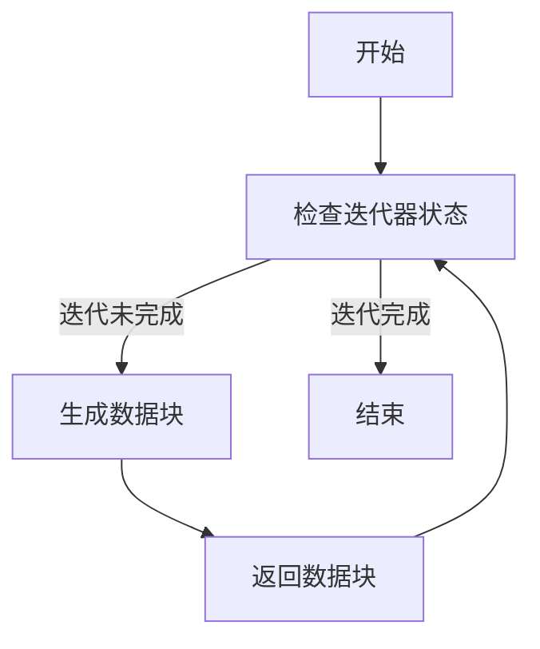
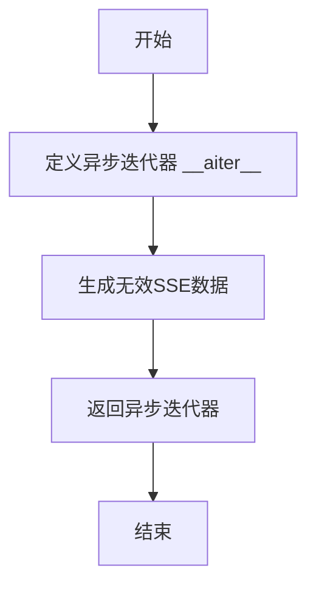

# `.\MetaGPT\tests\metagpt\provider\zhipuai\test_async_sse_client.py` 详细设计文档

该代码是一个使用 pytest 框架编写的异步单元测试，用于测试 AsyncSSEClient 类处理 Server-Sent Events (SSE) 数据流的功能。它通过模拟有效和无效的 SSE 事件源，验证客户端能否正确解析包含特定格式（'data: {...}'）的数据块，并忽略无效格式的数据。

## 整体流程

```mermaid
graph TD
    A[开始测试] --> B[创建模拟有效SSE源的AsyncSSEClient]
    B --> C[遍历stream()方法获取数据块]
    C --> D{数据块是否包含预期值'test_value'?}
    D -- 是 --> E[断言通过]
    D -- 否 --> F[断言失败，测试不通过]
    E --> G[创建模拟无效SSE源的AsyncSSEClient]
    G --> H[遍历stream()方法获取数据块]
    H --> I{数据块是否为空?}
    I -- 是 --> J[断言通过]
    I -- 否 --> K[断言失败，测试不通过]
    J --> L[测试结束]
    F --> L
    K --> L
```

## 类结构

```
测试文件结构
├── 全局导入 (pytest, AsyncSSEClient)
├── 测试函数 test_async_sse_client (异步)
│   ├── 内部类 Iterator (模拟有效SSE事件源)
│   │   └── 异步迭代器方法 __aiter__
│   └── 内部类 InvalidIterator (模拟无效SSE事件源)
│       └── 异步迭代器方法 __aiter__
└── 外部依赖 AsyncSSEClient (来自 metagpt.provider.zhipuai.async_sse_client)
```

## 全局变量及字段


### `async_sse_client`
    
用于测试的AsyncSSEClient实例，模拟SSE事件流

类型：`AsyncSSEClient`
    


### `chunk`
    
从SSE事件流中解析出的数据块

类型：`dict`
    


    

## 全局函数及方法

### `test_async_sse_client`

这是一个使用 `pytest` 编写的异步单元测试函数，用于测试 `AsyncSSEClient` 类的 `stream` 方法。它通过模拟两种不同的 SSE（Server-Sent Events）数据流来验证客户端是否能正确解析有效的事件数据并忽略无效格式的数据。

参数：
- 无显式参数。该函数是一个测试用例，由 `pytest` 框架调用。

返回值：`None`，该函数是一个测试用例，其主要目的是通过断言（`assert`）来验证代码行为，不返回业务逻辑值。

#### 流程图

```mermaid
flowchart TD
    A[开始测试] --> B[创建有效数据迭代器 Iterator]
    B --> C[实例化 AsyncSSEClient]
    C --> D[进入异步循环<br>stream]
    D --> E{迭代器有数据？}
    E -- 是 --> F[获取数据块 chunk]
    F --> G[断言 chunk.values()<br>包含 'test_value']
    G --> D
    E -- 否 --> H[创建无效数据迭代器 InvalidIterator]
    H --> I[实例化 AsyncSSEClient]
    I --> J[进入异步循环<br>stream]
    J --> K{迭代器有数据？}
    K -- 是 --> L[获取数据块 chunk]
    L --> M[断言 chunk 为空]
    M --> J
    K -- 否 --> N[测试结束]
```

#### 带注释源码

```python
@pytest.mark.asyncio                      # 标记此函数为异步测试用例
async def test_async_sse_client():
    # 第一部分：测试有效 SSE 数据
    class Iterator(object):               # 定义一个模拟的异步迭代器类，用于生成有效的 SSE 格式数据
        async def __aiter__(self):        # 实现异步迭代器协议
            yield b'data: {"test_key": "test_value"}'  # 生成一个字节串，模拟一个有效的 SSE 事件行（以 'data: ' 开头）

    # 使用上述迭代器创建 AsyncSSEClient 实例
    async_sse_client = AsyncSSEClient(event_source=Iterator())
    # 异步迭代 client 的 stream 方法返回的数据流
    async for chunk in async_sse_client.stream():
        # 断言：从有效数据中解析出的 chunk 的 values() 应包含预期的 'test_value'
        assert "test_value" in chunk.values()

    # 第二部分：测试无效 SSE 数据
    class InvalidIterator(object):        # 定义另一个模拟的异步迭代器类，用于生成无效的 SSE 格式数据
        async def __aiter__(self):
            yield b"invalid: test_value"  # 生成一个字节串，其前缀不是 'data: '，模拟无效的 SSE 格式

    # 使用无效数据迭代器创建新的 AsyncSSEClient 实例
    async_sse_client = AsyncSSEClient(event_source=InvalidIterator())
    # 异步迭代新的数据流
    async for chunk in async_sse_client.stream():
        # 断言：对于无效格式的数据，解析出的 chunk 应该为空（例如，False, None 或空字典）
        assert not chunk
```


### `Iterator.__aiter__`

该方法定义了一个异步迭代器，用于生成模拟的SSE（Server-Sent Events）数据流。在测试中，它被用作`AsyncSSEClient`的事件源，以验证客户端能否正确解析和处理SSE格式的数据。

参数：

-  `self`：`Iterator`，当前迭代器实例的引用

返回值：`AsyncIterator[bytes]`，一个异步迭代器，每次迭代返回一个字节串，模拟SSE事件数据

#### 流程图



#### 带注释源码

```
async def __aiter__(self):
    # 该方法使当前对象成为一个异步可迭代对象。
    # 在异步for循环中，解释器会自动调用此方法获取异步迭代器。
    # 这里直接使用`yield`语句，使得该方法本身成为一个异步生成器函数。
    # 异步生成器函数返回一个异步生成器对象，该对象即是异步迭代器。
    yield b'data: {"test_key": "test_value"}'
    # 生成一个符合SSE格式的字节串。
    # SSE事件数据以"data: "开头，后跟JSON格式的有效载荷。
    # 此数据块将被`AsyncSSEClient`接收并解析。
```


### `InvalidIterator.__aiter__`

该方法定义了一个异步迭代器，用于生成无效的SSE（Server-Sent Events）格式数据，用于测试`AsyncSSEClient`对无效数据的处理能力。

参数：

- `self`：`InvalidIterator`，表示`InvalidIterator`类的实例。

返回值：`AsyncIterator[bytes]`，返回一个异步迭代器，每次迭代生成一个字节串，表示无效的SSE格式数据。

#### 流程图



#### 带注释源码

```python
async def __aiter__(self):
    # 生成一个无效的SSE格式数据，用于测试AsyncSSEClient对无效数据的处理
    yield b"invalid: test_value"
```

## 关键组件


### AsyncSSEClient

一个用于处理异步服务器发送事件（Server-Sent Events, SSE）的客户端类，它包装了一个事件源迭代器，并提供了流式处理SSE数据的方法。

### SSE事件流解析器

在`AsyncSSEClient.stream()`方法内部实现的逻辑，用于从原始的字节流中解析出符合SSE格式（以`data: `开头的行）的有效事件数据，并过滤掉无效或空的事件。

### 异步迭代器适配

测试代码中定义的`Iterator`和`InvalidIterator`类，它们模拟了异步事件源的行为，用于验证`AsyncSSEClient`能否正确地从`__aiter__`方法产生的字节流中解析数据。


## 问题及建议


### 已知问题

-   **测试用例覆盖不完整**：当前测试仅验证了有效数据行（`data:` 前缀）和无效数据行（非 `data:` 前缀）两种简单情况。对于更复杂的SSE流场景，如多行数据、空行、`event:` 字段、`id:` 字段、重连机制、网络错误、流提前结束等情况均未覆盖，测试的健壮性不足。
-   **测试数据构造方式脆弱**：测试通过自定义的 `Iterator` 和 `InvalidIterator` 类来模拟SSE事件源。这种方式将测试与 `AsyncSSEClient` 的内部实现（即其依赖的 `event_source` 的 `__aiter__` 接口）紧密耦合。如果 `AsyncSSEClient` 的构造函数或对事件源的接口要求发生变化，所有测试用例都需要同步修改，维护成本高。
-   **缺乏对 `AsyncSSEClient` 内部状态的验证**：测试只检查了 `stream()` 方法输出的 `chunk` 内容，但没有验证 `AsyncSSEClient` 在处理流过程中的内部状态是否正确，例如是否正确解析了SSE事件行、是否妥善处理了各种边界情况等。
-   **测试断言过于简单**：断言 `assert "test_value" in chunk.values()` 依赖于 `chunk` 是一个字典且包含 `values()` 方法。如果 `AsyncSSEClient.stream()` 的返回值类型发生变化（例如返回字符串或自定义对象），此断言将立即失败，且错误信息不够清晰。对于无效数据流的断言 `assert not chunk` 语义模糊，未能明确表达期望 `chunk` 为空、为 `None` 还是为假值。

### 优化建议

-   **增强测试场景覆盖**：补充测试用例，模拟真实的SSE服务器响应。包括但不限于：包含多个 `data:` 字段的事件、包含 `event:` 和 `id:` 的事件、仅包含注释行（以 `:` 开头）的事件、空行分隔的事件、流中途关闭或抛出异常的场景。可以使用 `unittest.mock` 或 `pytest-mock` 来模拟更复杂的网络行为和错误。
-   **使用更灵活的测试替身（Test Double）**：摒弃自定义迭代器类的方式，采用 `unittest.mock.AsyncMock` 或创建一个通用的、可配置的模拟异步迭代器。这样可以根据每个测试用例的需要，动态生成不同的SSE数据序列，提高测试的灵活性和可读性。
-   **实施更精确的断言**：使用更具体的断言方法，例如 `assert chunk == {"test_key": "test_value"}` 来验证有效数据。对于无效数据，明确断言期望的结果，例如 `assert chunk is None` 或 `assert chunk == {}`。考虑使用 `pytest` 的参数化测试（`@pytest.mark.parametrize`）来批量测试多种输入/输出组合。
-   **将集成测试与单元测试分离**：当前测试更像是 `AsyncSSEClient` 与其迭代器源的集成测试。建议补充更纯粹的单元测试，使用 Mock 完全隔离 `AsyncSSEClient`，直接测试其 `_parse_sse_line`（如果存在）等私有方法或 `stream` 方法的核心逻辑，确保每个独立单元的正确性。
-   **添加异常处理测试**：编写测试用例，验证当 `event_source` 产生异常或返回不符合SSE格式的数据时，`AsyncSSEClient` 是否能按照预期抛出清晰的异常或进行优雅的错误处理，而不是让异常直接传播导致程序崩溃。
-   **改进测试命名与结构**：将单个的 `test_async_sse_client` 函数拆分为多个专注特定功能的测试函数，如 `test_stream_with_valid_data`, `test_stream_with_invalid_prefix`, `test_stream_with_multiple_events` 等。这样可以使测试意图更明确，并且在测试失败时能快速定位问题所在。


## 其它


### 设计目标与约束

该代码是一个针对 `AsyncSSEClient` 类的单元测试。其设计目标是验证 `AsyncSSEClient` 能够正确地从模拟的 Server-Sent Events (SSE) 数据流中解析出有效的事件数据，并能够妥善处理无效的数据格式。主要约束包括：1) 测试环境为异步 (`pytest.mark.asyncio`)，需要模拟异步迭代器作为输入；2) 测试用例应覆盖正常数据解析和错误数据处理两种场景。

### 错误处理与异常设计

测试代码本身不直接处理业务逻辑的异常，而是通过断言 (`assert`) 来验证 `AsyncSSEClient` 的行为是否符合预期。它设计了两种测试场景：
1.  **正常流**：模拟一个包含有效 `data:` 前缀的 SSE 事件。测试期望 `AsyncSSEClient.stream()` 方法能正确解析出 `{"test_key": "test_value"}`，并通过断言验证 `"test_value"` 存在于返回的 `chunk` 字典的值中。
2.  **无效数据流**：模拟一个不包含 `data:` 前缀的无效 SSE 事件。测试期望 `AsyncSSEClient.stream()` 方法能识别并忽略此无效行，返回一个空的或表示无效状态的 `chunk`（通过 `assert not chunk` 验证）。

### 数据流与状态机

测试代码的数据流是线性的，不涉及复杂的状态转换：
1.  **初始化**：创建 `AsyncSSEClient` 实例，并注入一个模拟的异步迭代器 (`Iterator` 或 `InvalidIterator`) 作为 `event_source`。
2.  **流式消费**：通过 `async for` 循环调用 `async_sse_client.stream()` 方法，该方法内部应消费 `event_source` 迭代器。
3.  **数据处理与验证**：对于迭代器产生的每一块（`chunk`）数据，测试代码执行断言以验证其内容。在正常流中，验证解析出的字典包含特定值；在无效流中，验证返回的 `chunk` 为假值（如空字典或 `None`）。

### 外部依赖与接口契约

1.  **`pytest` 框架**：用于组织和运行测试用例。依赖 `pytest.mark.asyncio` 来支持异步测试函数。
2.  **`metagpt.provider.zhipuai.async_sse_client.AsyncSSEClient`**：这是被测试的核心组件。测试代码依赖于其公开的接口：
    *   `__init__(event_source)`: 构造函数，接受一个异步迭代器作为事件源。
    *   `stream()`: 一个异步生成器方法，应返回一个异步迭代器，每次迭代产生一个代表解析后事件的字典（或类似结构）。
3.  **模拟对象 (`Iterator`, `InvalidIterator`)**：测试代码内部定义了这两个类来模拟 `AsyncSSEClient` 所期望的 `event_source` 接口（即实现 `__aiter__` 方法的异步可迭代对象）。这避免了测试对真实网络或外部服务的依赖。

    