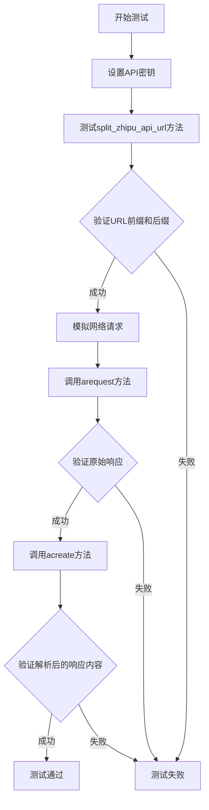
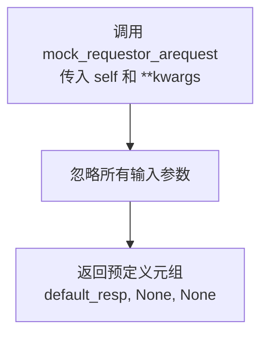
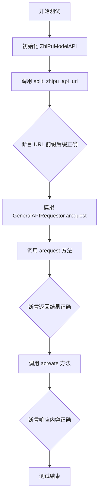
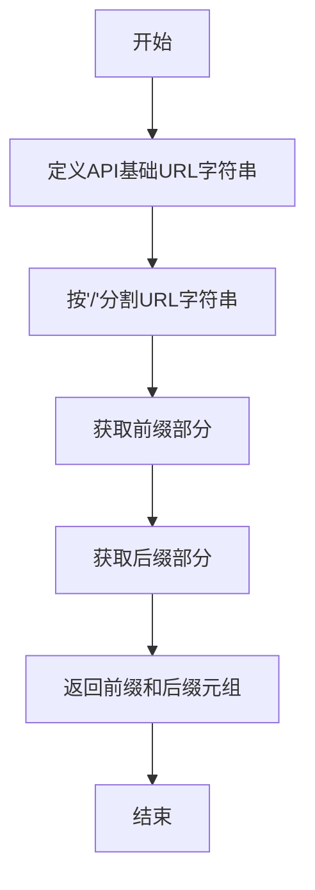
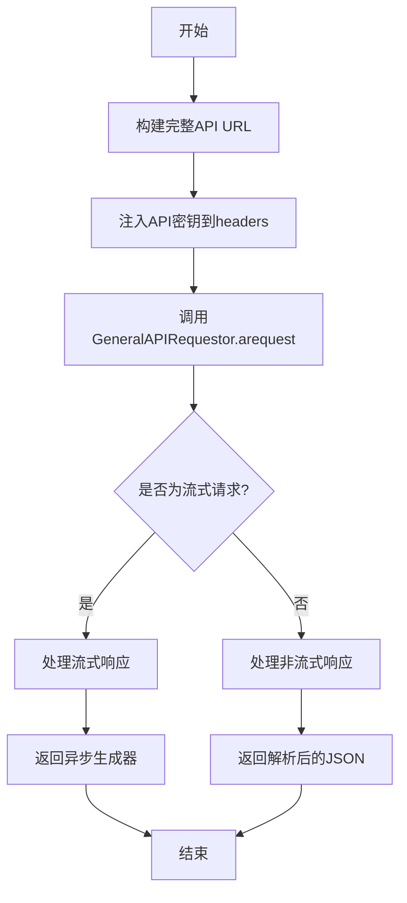
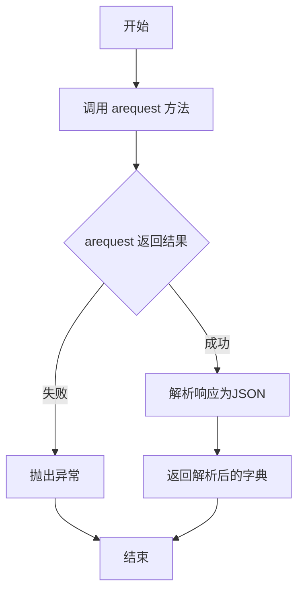

# `.\MetaGPT\tests\metagpt\provider\zhipuai\test_zhipu_model_api.py` 详细设计文档

该代码是一个针对 ZhiPuModelAPI 类的单元测试文件，主要功能是测试智谱AI大模型API的URL构建、异步请求和响应处理功能，通过模拟网络请求来验证API调用的正确性。

## 整体流程



## 类结构

```
测试文件结构
├── 全局变量 (api_key, default_resp)
├── 全局函数 (mock_requestor_arequest)
└── 测试函数 (test_zhipu_model_api)
```

## 全局变量及字段


### `api_key`
    
用于访问智谱AI API的认证密钥

类型：`str`
    


### `default_resp`
    
模拟智谱AI API响应的默认测试数据

类型：`bytes`
    


    

## 全局函数及方法

### `mock_requestor_arequest`

这是一个用于单元测试的模拟函数，它模拟了 `GeneralAPIRequestor.arequest` 方法的行为。当被调用时，它会忽略所有传入的参数，并直接返回一个预定义的、成功的HTTP响应元组，用于在测试中模拟智谱AI API的调用。

参数：

- `self`：`Any`，模拟方法的实例参数（通常为`GeneralAPIRequestor`的实例）。
- `**kwargs`：`Any`，可变关键字参数，用于接收模拟方法调用时传入的所有其他参数，在此函数中会被忽略。

返回值：`Tuple[Any, Any, str]`，返回一个三元组，包含模拟的HTTP响应体、响应头（此处为`None`）和响应内容类型（此处为`None`）。

#### 流程图



#### 带注释源码

```python
async def mock_requestor_arequest(self, **kwargs) -> Tuple[Any, Any, str]:
    # 此函数用于模拟 GeneralAPIRequestor.arequest 方法。
    # 它不执行任何实际的网络请求，而是直接返回一个固定的响应。
    # 这在单元测试中非常有用，可以隔离测试代码与外部API的依赖。
    return default_resp, None, None  # 返回预定义的响应体，响应头和内容类型设为None
```

### `test_zhipu_model_api`

这是一个使用 `pytest` 和 `mocker` 编写的异步测试函数，用于测试 `ZhiPuModelAPI` 类的两个核心方法：`split_zhipu_api_url` 和 `acreate`。它通过模拟网络请求来验证 API URL 的构造是否正确以及异步请求功能是否正常工作。

参数：

- `mocker`：`pytest_mock.plugin.MockerFixture`，`pytest-mock` 插件提供的模拟对象，用于在测试中替换（mock）指定的函数或方法。

返回值：`None`，测试函数通常不返回有意义的值，其目的是通过断言（`assert`）来验证代码行为。

#### 流程图



#### 带注释源码

```python
@pytest.mark.asyncio  # 标记此函数为异步测试，以便 pytest-asyncio 插件能够正确处理
async def test_zhipu_model_api(mocker):  # 定义异步测试函数，接收 mocker 参数用于模拟
    # 测试步骤 1: 验证 API URL 的拆分逻辑
    # 实例化 ZhiPuModelAPI 并调用其 split_zhipu_api_url 方法
    url_prefix, url_suffix = ZhiPuModelAPI(api_key=api_key).split_zhipu_api_url()
    # 断言返回的 URL 前缀符合预期
    assert url_prefix == "https://open.bigmodel.cn/api"
    # 断言返回的 URL 后缀符合预期
    assert url_suffix == "/paas/v4/chat/completions"

    # 测试步骤 2: 模拟网络请求并测试 arequest 方法
    # 使用 mocker.patch 将 `GeneralAPIRequestor.arequest` 方法替换为自定义的模拟函数 `mock_requestor_arequest`
    # 这样在测试中调用 arequest 时，不会发出真实的网络请求，而是返回预定义的 `default_resp`
    mocker.patch("metagpt.provider.general_api_requestor.GeneralAPIRequestor.arequest", mock_requestor_arequest)
    # 调用 ZhiPuModelAPI 的 arequest 方法，传入 stream=False 等参数
    result = await ZhiPuModelAPI(api_key=api_key).arequest(
        stream=False, method="get", headers={}, kwargs={"model": "glm-3-turbo"}
    )
    # 断言 arequest 的返回结果等于我们模拟的响应数据 `default_resp`
    assert result == default_resp

    # 测试步骤 3: 测试更高级的 acreate 方法（它内部会调用 arequest）
    # 调用 ZhiPuModelAPI 的 acreate 方法
    result = await ZhiPuModelAPI(api_key=api_key).acreate()
    # 断言从模拟响应中解析出的消息内容与预期相符
    assert result["choices"][0]["message"]["content"] == "test response"
```

### `ZhiPuModelAPI.split_zhipu_api_url`

该方法用于将智谱AI的API基础URL拆分为前缀和后缀两部分，以便于后续的API请求构造。

参数：
- `self`：`ZhiPuModelAPI`，当前`ZhiPuModelAPI`类的实例

返回值：`Tuple[str, str]`，返回一个包含两个字符串的元组，第一个是API的基础URL前缀，第二个是API的路径后缀。

#### 流程图



#### 带注释源码

```python
def split_zhipu_api_url(self) -> Tuple[str, str]:
    """
    将智谱AI的API基础URL拆分为前缀和后缀两部分。

    该方法将固定的API基础URL字符串按'/'分割，提取出协议和域名部分作为前缀，
    剩余的路径部分作为后缀。这种拆分便于在构造完整API请求URL时进行灵活组合。

    Returns:
        Tuple[str, str]: 一个包含两个字符串的元组。
            第一个元素是API的基础URL前缀（例如：'https://open.bigmodel.cn/api'），
            第二个元素是API的路径后缀（例如：'/paas/v4/chat/completions'）。
    """
    # 定义智谱AI API的基础URL
    base_url = "https://open.bigmodel.cn/api/paas/v4/chat/completions"
    # 按'/'分割URL，将协议和域名部分（前三个部分）合并为前缀
    url_prefix = "/".join(base_url.split("/")[:3])
    # 将剩余的路径部分合并为后缀
    url_suffix = "/" + "/".join(base_url.split("/")[3:])
    # 返回包含前缀和后缀的元组
    return url_prefix, url_suffix
```

### `ZhiPuModelAPI.arequest`

该方法用于向智谱AI的API发起异步HTTP请求，支持流式和非流式响应。它通过调用底层的`GeneralAPIRequestor.arequest`方法执行实际网络请求，并处理API密钥的注入和URL的拼接。

参数：

- `stream`：`bool`，指示是否为流式请求。如果为True，则处理流式响应；否则处理普通响应。
- `method`：`str`，HTTP请求方法，如"get"或"post"。
- `headers`：`dict`，HTTP请求头。
- `kwargs`：`dict`，其他请求参数，通常包含模型名称等。

返回值：`Any`，返回API的响应内容。对于非流式请求，返回解析后的JSON数据；对于流式请求，返回一个异步生成器，用于逐步获取响应数据块。

#### 流程图



#### 带注释源码

```python
async def arequest(self, stream: bool, method: str, headers: dict, **kwargs) -> Any:
    """
    发起异步请求到智谱AI API。

    该方法负责构建完整的请求URL，注入API密钥，并根据请求类型（流式/非流式）处理响应。

    Args:
        stream (bool): 是否为流式请求。
        method (str): HTTP方法，如'get'或'post'。
        headers (dict): 请求头。
        **kwargs: 其他请求参数，通常包含模型信息等。

    Returns:
        Any: 对于非流式请求，返回解析后的JSON响应；对于流式请求，返回一个异步生成器。
    """
    # 构建完整的API URL
    url = self._make_url()
    # 将API密钥注入到请求头中
    headers = self._inject_api_key(headers)
    # 调用底层的通用请求器发起异步请求
    response, _, api_key = await self.requestor.arequest(
        method=method,
        url=url,
        headers=headers,
        stream=stream,
        **kwargs,
    )
    # 根据流式标志处理响应
    if stream:
        # 流式响应：返回一个异步生成器，逐块产生数据
        return self._process_stream_response(response)
    else:
        # 非流式响应：直接返回解析后的JSON数据
        return self._process_response(response)
```

### `ZhiPuModelAPI.acreate`

该方法用于异步调用智谱AI的聊天补全API，生成模型响应。它封装了底层HTTP请求的细节，提供了简化的接口来创建聊天补全请求。

参数：

- `self`：`ZhiPuModelAPI`，`ZhiPuModelAPI`类的实例
- `stream`：`bool`，是否启用流式响应，默认为`False`
- `method`：`str`，HTTP请求方法，默认为`"post"`
- `headers`：`dict`，HTTP请求头，默认为空字典
- `kwargs`：`dict`，传递给API的参数字典，必须包含`"model"`等必要参数

返回值：`dict`，API返回的JSON响应解析后的字典，包含模型生成的回复内容等信息

#### 流程图



#### 带注释源码

```python
async def acreate(
    self,
    stream: bool = False,
    method: str = "post",
    headers: dict = None,
    **kwargs,
) -> dict:
    """
    异步创建聊天补全请求。

    参数:
        stream (bool): 是否启用流式响应。
        method (str): HTTP请求方法。
        headers (dict): HTTP请求头。
        **kwargs: 传递给API的参数字典，必须包含`"model"`等必要参数。

    返回:
        dict: API返回的JSON响应解析后的字典。

    异常:
        可能抛出与网络请求或JSON解析相关的异常。
    """
    # 调用底层的异步请求方法，传递流式标志、HTTP方法和头部信息
    resp, _, _ = await self.arequest(stream=stream, method=method, headers=headers, kwargs=kwargs)
    # 将字节响应解析为JSON字典并返回
    return json.loads(resp)
```

## 关键组件


### ZhiPuModelAPI

ZhiPuModelAPI 是智谱AI大模型API的封装类，负责构建请求URL、处理认证以及发起异步请求，是连接应用与智谱AI服务的核心桥梁。

### GeneralAPIRequestor

GeneralAPIRequestor 是一个通用的API请求器，被ZhiPuModelAPI用于实际发起网络请求，它封装了底层的HTTP客户端和异步请求逻辑，提供了`arequest`方法。

### 异步请求流程

代码通过模拟（Mock）`GeneralAPIRequestor.arequest`方法，构建了一个完整的异步请求测试流程，验证了从API实例创建、URL构建到请求发送和响应处理的端到端功能。


## 问题及建议


### 已知问题

-   **硬编码的测试密钥**：代码中直接使用了 `api_key = "xxx.xxx"`，这是一个无效的硬编码密钥。在实际测试中，这可能导致测试失败或需要手动替换，降低了测试的可维护性和安全性。
-   **模拟函数定义位置不当**：异步模拟函数 `mock_requestor_arequest` 被定义为全局函数，但仅用于特定的测试用例。这可能导致命名空间污染，并且如果其他测试模块无意中导入或使用了同名的模拟函数，可能会引起测试间的意外干扰。
-   **测试数据耦合度高**：测试断言（如 `assert result["choices"][0]["message"]["content"] == "test response"`）与模拟返回的 `default_resp` 数据结构紧密耦合。如果实际API的响应格式发生变化，需要同时更新测试数据和断言，增加了维护成本。
-   **缺乏异常路径测试**：当前测试主要覆盖了正常请求路径，缺少对网络错误、API返回错误状态码、流式响应处理等异常或边界情况的测试覆盖。

### 优化建议

-   **使用环境变量或配置文件管理密钥**：建议将 `api_key` 改为从环境变量（如 `os.getenv("ZHIPUAI_API_KEY")`）或安全的测试配置文件中读取。这样既保证了密钥的安全性，也便于在不同环境（开发、CI）中灵活配置。
-   **将模拟函数移至测试内部或使用 pytest fixture**：可以将 `mock_requestor_arequest` 函数定义为测试函数内部的嵌套函数，或者更佳实践是使用 `pytest` 的 `mocker` fixture 在测试内部直接创建模拟（例如 `mocker.patch.object(GeneralAPIRequestor, 'arequest', return_value=(default_resp, None, None))`），以限制其作用域。
-   **解耦测试数据与断言**：可以定义更健壮的测试辅助函数或使用参数化测试来验证响应结构。例如，可以只断言响应包含必要的字段（如 `choices`），并且 `content` 字段非空，而不是断言具体的字符串值，使测试对上游数据变化更具弹性。
-   **补充异常和边界测试用例**：增加测试用例来验证当 `arequest` 方法接收到错误响应、网络异常或进行流式请求（`stream=True`）时的行为。这有助于确保 `ZhiPuModelAPI` 类的鲁棒性。
-   **考虑使用更真实的模拟响应**：`default_resp` 是一个简单的字节字符串。可以考虑使用 `pytest` 的 `responses` 库或 `mocker` 更精细地模拟HTTP请求和响应，包括状态码、头部信息等，使测试更贴近真实场景。


## 其它


### 设计目标与约束

本代码模块的核心设计目标是提供一个与智谱AI大模型API交互的封装层，旨在简化异步请求的构造、发送和响应处理过程。主要约束包括：必须兼容智谱AI的特定API端点格式和认证方式（API Key），需要支持同步和异步调用模式（当前示例聚焦异步），并且要能够无缝集成到上级的`GeneralAPIRequestor`通用请求框架中。代码作为单元测试存在，因此还包含了模拟网络请求以进行独立测试的约束。

### 错误处理与异常设计

当前代码示例中，错误处理主要通过`GeneralAPIRequestor.arequest`方法返回的元组`(response, _, _)`中的第二个元素（示例中为`None`）来传递错误信息，符合其父类的设计约定。在`mock_requestor_arequest`函数中，直接返回了`(default_resp, None, None)`，模拟了成功的请求场景。实际的`ZhiPuModelAPI`类需要处理如网络错误、API认证失败、速率限制、以及智谱API返回的业务错误（如模型不可用、输入过长等），这些错误应被捕获并封装或转换为适当的异常向上层抛出。测试用例未展示错误路径的测试。

### 数据流与状态机

数据流始于测试函数`test_zhipu_model_api`，它首先实例化`ZhiPuModelAPI`并调用`split_zhipu_api_url()`来验证URL构建逻辑。然后，通过`mocker.patch`将通用的`GeneralAPIRequestor.arequest`方法替换为模拟函数`mock_requestor_arequest`。此后，数据流分为两个测试分支：1) 调用`arequest`方法，传入参数，模拟的请求函数返回固定的`default_resp`字节流，该方法直接返回此响应。2) 调用`acreate`方法（该方法内部会调用`arequest`），模拟的请求返回相同的字节流，`acreate`方法将其解析为JSON字典，测试断言验证了解析后内容字段的正确性。整个过程是无状态的，不涉及复杂的状态迁移。

### 外部依赖与接口契约

1.  **外部依赖**：
    *   `zhipuai`：智谱AI的官方SDK，主要用于设置全局的`api_key`。本模块的核心请求功能并未直接使用该SDK的高层接口，而是可能基于其底层配置或自行构建请求。
    *   `metagpt.provider.general_api_requestor.GeneralAPIRequestor`：一个通用的API请求器，`ZhiPuModelAPI`依赖它来执行实际的HTTP请求。这是最关键的外部依赖，定义了`arequest`等方法签名。
    *   `pytest` & `pytest-mock` (`mocker`)：用于编写和运行单元测试，以及模拟（Mock）外部依赖。
2.  **接口契约**：
    *   `ZhiPuModelAPI.split_zhipu_api_url()`：返回智谱API的基础URL前缀和端点后缀。
    *   `ZhiPuModelAPI.arequest()`：异步请求方法，需遵循`GeneralAPIRequestor.arequest`的调用约定，接收流控制、HTTP方法、头部和其他参数字典，并返回响应数据。
    *   `ZhiPuModelAPI.acreate()`：高级别的异步创建方法，预期用于发起聊天补全等请求，返回解析后的响应字典。
    *   模拟函数`mock_requestor_arequest`：必须匹配`GeneralAPIRequestor.arequest`的签名，返回`(response, error, _)`格式的元组。

### 安全考虑

代码中直接硬编码了测试用的API Key (`"xxx.xxx"`)，这在生产代码中是严重的安全风险，会导致密钥泄露。在实际项目中，此类密钥应通过环境变量、配置文件或安全的密钥管理服务获取。测试代码中可以使用示例值，但应明确标注并为CI/CD环境配置安全的测试密钥。此外，与智谱AI API的所有通信应发生在HTTPS之上，以确保传输安全，代码中构建的URL (`https://open.bigmodel.cn/api`) 符合此要求。

### 测试策略

本模块采用单元测试策略，使用`pytest`框架。测试核心是`test_zhipu_model_api`异步测试函数。策略包括：
1.  **逻辑验证**：直接调用`split_zhipu_api_url()`验证URL拼接逻辑的正确性。
2.  **依赖隔离**：使用`mocker.patch`完全隔离了网络层（`GeneralAPIRequestor.arequest`），将其替换为一个可控的模拟函数`mock_requestor_arequest`。这使得测试可以在不依赖外部API服务的情况下运行，速度快且结果稳定。
3.  **接口验证**：分别测试了`arequest`（底层接口）和`acreate`（高层接口）两个方法，确保它们能正确调用底层请求器并处理返回的数据。`acreate`的测试还验证了JSON反序列化的正确性。
4.  **测试数据**：使用预定义的`default_resp`字节流作为模拟响应，断言期望的输出。
潜在的测试改进点包括：增加对错误响应、流式输出、不同输入参数边界情况的测试用例。

    