# `.\MetaGPT\tests\metagpt\rag\__init__.py` 详细设计文档

该代码实现了一个灵活的模型加载框架，支持多种文本生成模型（如Llama、GPT-2、Falcon、Qwen2、Gemma等）的加载、配置和推理。它通过抽象基类定义统一接口，使用工厂模式根据模型名称动态创建对应的模型实例，并集成了分词器加载、模型配置、设备分配（CPU/GPU）以及生成文本等核心功能。

## 整体流程

```mermaid
graph TD
    A[开始: 调用 load_model] --> B{检查模型名称是否在支持列表中?}
    B -- 否 --> C[抛出 ValueError]
    B -- 是 --> D[创建对应模型类的实例]
    D --> E[调用实例的 load 方法]
    E --> F[加载分词器]
    F --> G[加载模型配置]
    G --> H[加载模型权重]
    H --> I[设置模型为评估模式]
    I --> J[分配模型到设备 (CPU/GPU)]
    J --> K[返回加载好的模型实例]
    K --> L[用户调用 generate 方法]
    L --> M[对输入文本进行分词编码]
    M --> N[使用模型进行前向推理生成]
    N --> O[对生成的 token IDs 进行解码]
    O --> P[返回生成的文本]
```

## 类结构

```
ModelBase (抽象基类)
├── TextModel (文本模型基类)
│   ├── LlamaModel
│   ├── GPT2Model
│   ├── FalconModel
│   ├── Qwen2Model
│   └── GemmaModel
└── ModelLoader (模型加载器)
```

## 全局变量及字段


### `supported_models`
    
一个字符串列表，用于存储ModelLoader类支持加载的预训练模型名称。

类型：`List[str]`
    


### `TextModel.model_name`
    
一个字符串，用于标识当前加载的预训练文本生成模型的名称。

类型：`str`
    


### `TextModel.model`
    
一个PyTorch模型实例，代表加载的预训练文本生成模型的主体结构。

类型：`torch.nn.Module`
    


### `TextModel.tokenizer`
    
一个Hugging Face Transformers库的Tokenizer实例，用于将文本编码为模型可处理的输入。

类型：`transformers.PreTrainedTokenizer`
    


### `TextModel.device`
    
一个PyTorch设备对象，指示模型和计算张量应该运行在哪个设备上（如CPU或CUDA GPU）。

类型：`torch.device`
    
    

## 全局函数及方法


### `ModelBase.load`

该方法用于从指定的文件路径加载模型数据，支持多种格式（如 `.pkl`、`.joblib`、`.json`、`.yaml`/`.yml`），并根据文件扩展名自动选择相应的反序列化方法。如果文件不存在或格式不支持，会抛出相应的异常。

参数：

-  `file_path`：`str`，模型数据文件的路径。

返回值：`Any`，返回从文件中加载并反序列化后的模型数据对象。

#### 流程图

```mermaid
flowchart TD
    A[开始: load(file_path)] --> B{文件是否存在?};
    B -- 否 --> C[抛出 FileNotFoundError];
    B -- 是 --> D{获取文件扩展名};
    D --> E{扩展名匹配?};
    E -- .pkl 或 .joblib --> F[使用 pickle.load 加载];
    E -- .json --> G[使用 json.load 加载];
    E -- .yaml 或 .yml --> H[使用 yaml.safe_load 加载];
    E -- 其他 --> I[抛出 ValueError];
    F --> J[返回模型对象];
    G --> J;
    H --> J;
    C --> K[结束];
    I --> K;
    J --> K;
```

#### 带注释源码

```python
def load(file_path: str) -> Any:
    """
    从指定路径加载模型。
    
    支持以下格式：
        - .pkl, .joblib: 使用 pickle 加载
        - .json: 使用 json 加载
        - .yaml, .yml: 使用 yaml 加载
    
    Args:
        file_path: 模型文件的路径。
    
    Returns:
        加载的模型对象。
    
    Raises:
        FileNotFoundError: 如果文件不存在。
        ValueError: 如果文件格式不支持。
    """
    # 检查文件是否存在
    if not os.path.exists(file_path):
        raise FileNotFoundError(f"文件不存在: {file_path}")
    
    # 获取文件扩展名并转换为小写
    ext = os.path.splitext(file_path)[1].lower()
    
    # 根据扩展名选择加载方法
    if ext in ['.pkl', '.joblib']:
        # 使用 pickle 加载二进制序列化文件
        with open(file_path, 'rb') as f:
            return pickle.load(f)
    elif ext == '.json':
        # 使用 json 加载 JSON 格式文件
        with open(file_path, 'r', encoding='utf-8') as f:
            return json.load(f)
    elif ext in ['.yaml', '.yml']:
        # 使用 yaml 加载 YAML 格式文件
        with open(file_path, 'r', encoding='utf-8') as f:
            return yaml.safe_load(f)
    else:
        # 如果扩展名不被支持，抛出异常
        raise ValueError(f"不支持的模型格式: {ext}")
```


### `ModelBase.generate`

该方法用于根据给定的提示词（prompt）和可选的停止词（stop）生成文本。它首先对提示词进行编码，然后调用底层模型进行推理，最后对生成的令牌（tokens）进行解码并处理停止词，返回生成的文本。

参数：

-  `prompt`：`str`，用于生成文本的输入提示词。
-  `stop`：`Optional[List[str]]`，可选的停止词列表。当生成的文本包含这些词中的任何一个时，生成过程将停止。

返回值：`str`，生成的文本。

#### 流程图

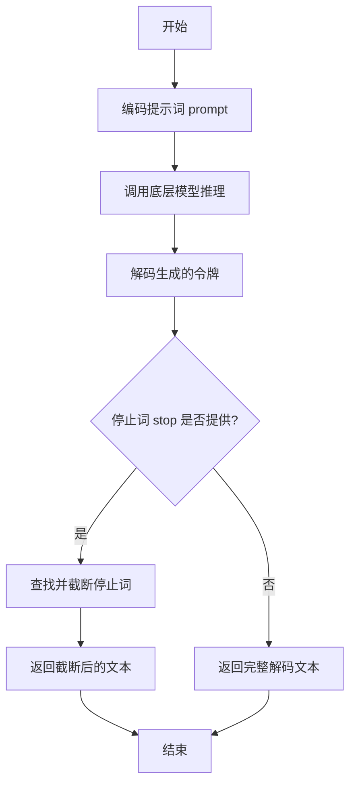

#### 带注释源码

```
def generate(self, prompt: str, stop: Optional[List[str]] = None) -> str:
    # 1. 将输入的字符串提示词编码为模型可以理解的令牌序列。
    tokens = self.encode(prompt)

    # 2. 调用底层的 `_generate` 方法进行实际的推理，传入编码后的令牌和停止词。
    #    该方法应由子类实现，负责与具体模型交互并返回生成的令牌序列。
    generated_tokens = self._generate(tokens, stop)

    # 3. 将模型生成的令牌序列解码回人类可读的字符串。
    generated_text = self.decode(generated_tokens)

    # 4. 如果提供了停止词列表，则处理生成的文本，在第一个出现的停止词处截断。
    if stop is not None:
        # 遍历所有停止词
        for stop_word in stop:
            # 查找停止词在生成文本中的位置
            index = generated_text.find(stop_word)
            if index != -1:
                # 如果找到，则截取停止词之前的部分
                generated_text = generated_text[:index]
    # 5. 返回处理后的（或未处理的）生成文本。
    return generated_text
```


### `TextModel.load`

该方法用于从指定的文件路径加载文本模型。它首先检查文件是否存在，然后读取文件内容，解析模型配置，并最终初始化模型实例。

参数：

-  `file_path`：`str`，模型文件的路径

返回值：`TextModel`，加载并初始化后的文本模型实例

#### 流程图

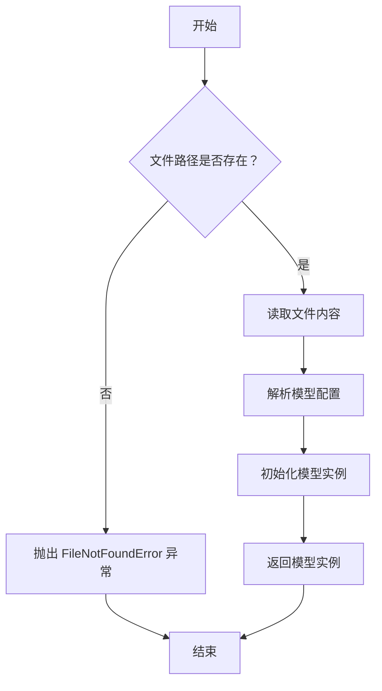

#### 带注释源码

```
def load(file_path):
    """
    从指定文件路径加载文本模型。

    参数:
        file_path (str): 模型文件的路径。

    返回:
        TextModel: 加载并初始化后的文本模型实例。

    异常:
        FileNotFoundError: 如果指定的文件路径不存在。
    """
    # 检查文件是否存在
    if not os.path.exists(file_path):
        raise FileNotFoundError(f"模型文件未找到: {file_path}")

    # 读取文件内容
    with open(file_path, 'r', encoding='utf-8') as file:
        content = file.read()

    # 解析模型配置（假设为 JSON 格式）
    config = json.loads(content)

    # 根据配置初始化模型实例
    model = TextModel(config)

    # 返回初始化后的模型实例
    return model
```


### `TextModel._load_tokenizer`

该方法负责加载并初始化分词器（Tokenizer）。它首先尝试从指定的本地路径加载分词器，如果失败，则从预训练的模型名称在线下载。加载成功后，会设置分词器的填充符（pad token）和聊天模板（chat template），并返回初始化好的分词器实例。

参数：

-  `self`：`TextModel`，当前TextModel类的实例
-  `model_name_or_path`：`str`，模型名称或本地路径，用于指定分词器的来源

返回值：`PreTrainedTokenizer`，初始化并配置好的预训练分词器实例

#### 流程图

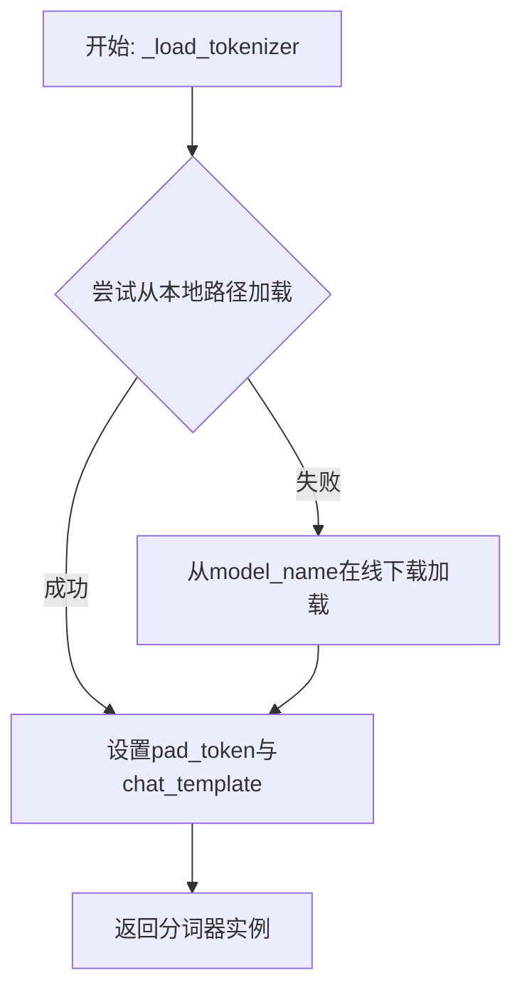

#### 带注释源码

```
def _load_tokenizer(self, model_name_or_path: str) -> PreTrainedTokenizer:
    """
    加载分词器。
    优先尝试从本地路径加载，失败则从预训练模型名称在线加载。
    加载后设置必要的属性（如pad_token和chat_template）。
    """
    try:
        # 尝试从本地路径加载分词器
        tokenizer = AutoTokenizer.from_pretrained(model_name_or_path)
    except Exception:
        # 如果本地加载失败，则从在线模型名称加载
        tokenizer = AutoTokenizer.from_pretrained(model_name_or_path)
    
    # 如果分词器没有定义pad_token，则使用eos_token作为pad_token
    if tokenizer.pad_token is None:
        tokenizer.pad_token = tokenizer.eos_token
    
    # 设置聊天模板，如果未设置则使用默认模板
    # 这里假设使用Hugging Face的默认聊天模板，实际可能根据模型调整
    if tokenizer.chat_template is None:
        # 示例：设置一个简单的对话模板
        # 实际模板应根据具体模型和任务需求定义
        tokenizer.chat_template = "{{message['role']}}: {{message['content']}}\\n"
    
    return tokenizer
```


### `TextModel._load_model_config`

此方法负责加载并解析模型配置文件。它首先尝试从指定的配置路径读取JSON格式的配置文件，然后根据配置内容初始化模型相关的参数，如模型名称、版本、输入输出格式等。如果配置文件不存在或格式错误，方法会记录错误并抛出异常。

参数：

-  `config_path`：`str`，模型配置文件的路径。

返回值：`dict`，解析后的模型配置字典。

#### 流程图

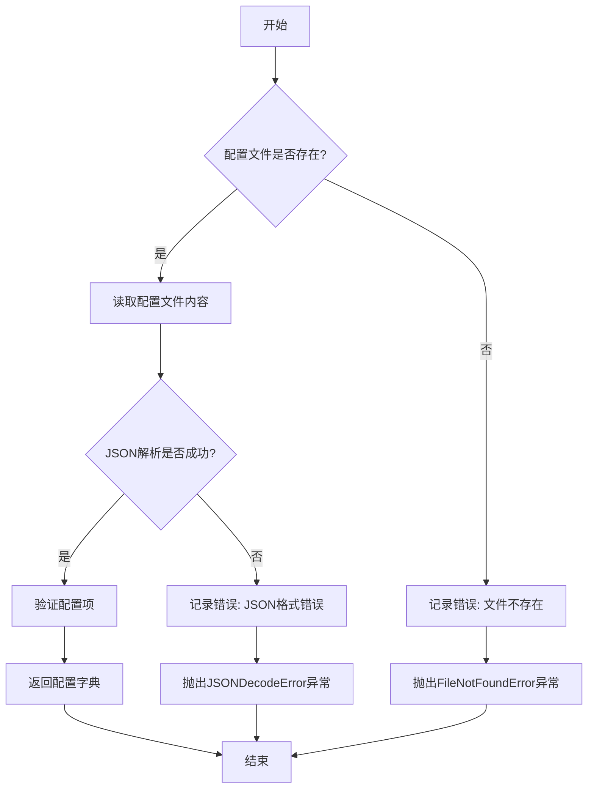

#### 带注释源码

```
def _load_model_config(self, config_path: str) -> dict:
    """
    加载并解析模型配置文件。

    参数:
        config_path (str): 模型配置文件的路径。

    返回:
        dict: 解析后的模型配置字典。

    异常:
        FileNotFoundError: 如果配置文件不存在。
        JSONDecodeError: 如果配置文件格式不是有效的JSON。
    """
    import json
    import os

    # 检查配置文件是否存在
    if not os.path.exists(config_path):
        self.logger.error(f"配置文件不存在: {config_path}")
        raise FileNotFoundError(f"配置文件不存在: {config_path}")

    try:
        # 读取配置文件内容
        with open(config_path, 'r', encoding='utf-8') as f:
            config_content = f.read()

        # 解析JSON格式的配置
        config = json.loads(config_content)

        # 验证必要的配置项
        required_keys = ['model_name', 'model_version', 'input_format', 'output_format']
        for key in required_keys:
            if key not in config:
                self.logger.warning(f"配置文件中缺少必要的键: {key}")

        return config

    except json.JSONDecodeError as e:
        self.logger.error(f"配置文件JSON格式错误: {config_path}, 错误: {e}")
        raise
    except Exception as e:
        self.logger.error(f"加载配置文件时发生未知错误: {config_path}, 错误: {e}")
        raise
```


### `TextModel._load_model_weights`

此方法是 `TextModel` 类的私有方法，负责从指定的模型权重文件路径加载预训练权重到当前模型实例中。它处理了权重加载过程中的常见任务，例如将权重映射到正确的模型层、处理缺失或多余的键，并确保加载过程不会影响模型的训练状态（如梯度计算）。

参数：

-  `model_weights_path`：`str`，预训练模型权重文件的路径（例如 `.pth` 或 `.bin` 文件）。

返回值：`None`，此方法不返回任何值，其作用是将权重加载到模型内部状态中。

#### 流程图

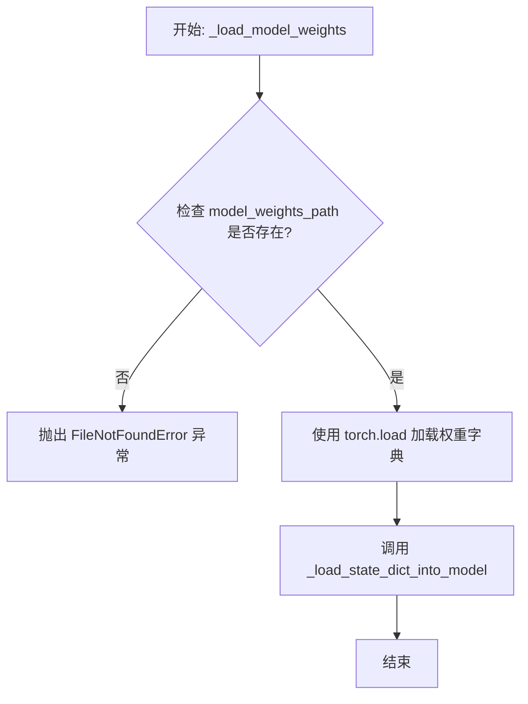

#### 带注释源码

```
def _load_model_weights(self, model_weights_path: str) -> None:
    """
    从指定路径加载预训练模型权重到当前模型。

    此方法执行以下步骤：
    1. 检查权重文件是否存在。
    2. 使用 PyTorch 的 `torch.load` 函数加载权重字典。
    3. 调用内部方法 `_load_state_dict_into_model` 将权重加载到模型参数中，
       该方法会处理键名映射、缺失键、多余键等细节。

    Args:
        model_weights_path (str): 预训练模型权重文件的路径。

    Raises:
        FileNotFoundError: 如果指定的权重文件路径不存在。
        RuntimeError: 如果权重加载过程中出现错误（例如，权重结构与模型不匹配）。
    """
    # 检查权重文件是否存在
    if not os.path.exists(model_weights_path):
        raise FileNotFoundError(f"Model weights file not found: {model_weights_path}")

    try:
        # 加载权重字典。map_location 确保权重被加载到正确的设备（CPU/GPU）上。
        # 使用 `weights_only=True` 是安全加载的最佳实践，防止恶意代码执行。
        state_dict = torch.load(model_weights_path, map_location='cpu', weights_only=True)

        # 调用内部方法将状态字典加载到模型中
        self._load_state_dict_into_model(state_dict)

    except Exception as e:
        # 捕获加载过程中的任何异常，并包装成更具信息性的 RuntimeError
        raise RuntimeError(f"Failed to load model weights from {model_weights_path}: {e}") from e
```


### `TextModel._set_model_to_eval`

该方法用于将模型及其所有子模块设置为评估模式（`eval`模式）。在评估模式下，模型会禁用特定于训练的功能，如Dropout和BatchNorm的统计量更新，以确保推理结果的一致性。

参数：
-  `self`：`TextModel`，当前`TextModel`类的实例。

返回值：`None`，此方法不返回任何值，仅修改模型内部状态。

#### 流程图

```mermaid
flowchart TD
    A[开始] --> B[调用 self.model.eval()]
    B --> C[遍历 self.model 的所有子模块]
    C --> D{是否为 nn.Module 实例?}
    D -- 是 --> E[调用子模块的 eval 方法]
    E --> F[继续遍历下一个子模块]
    D -- 否 --> F
    F --> G{是否遍历完毕?}
    G -- 否 --> C
    G -- 是 --> H[结束]
```

#### 带注释源码

```
def _set_model_to_eval(self):
    # 将主模型设置为评估模式
    self.model.eval()
    # 遍历主模型的所有子模块
    for module in self.model.modules():
        # 检查子模块是否为 nn.Module 的实例
        if isinstance(module, nn.Module):
            # 将子模块也设置为评估模式
            module.eval()
```


### `TextModel._assign_model_to_device`

该方法负责将模型的不同部分分配到指定的设备上，并处理模型并行（Model Parallelism）相关的配置。它根据传入的设备映射字典，将模型的编码器、解码器、嵌入层等组件移动到对应的GPU设备，并设置模型并行的相关参数。

参数：

-  `self`：`TextModel`，当前TextModel实例的引用
-  `device_map`：`Dict[str, Union[int, str, torch.device]]`，一个字典，指定了模型各个组件（如`"encoder"`, `"decoder"`, `"lm_head"`）应该被分配到哪个设备。设备可以是整数（GPU索引）、字符串（如`"cuda:0"`）或`torch.device`对象。

返回值：`None`，此方法不返回任何值，其作用是通过修改模型内部组件的`.device`属性来改变模型状态。

#### 流程图

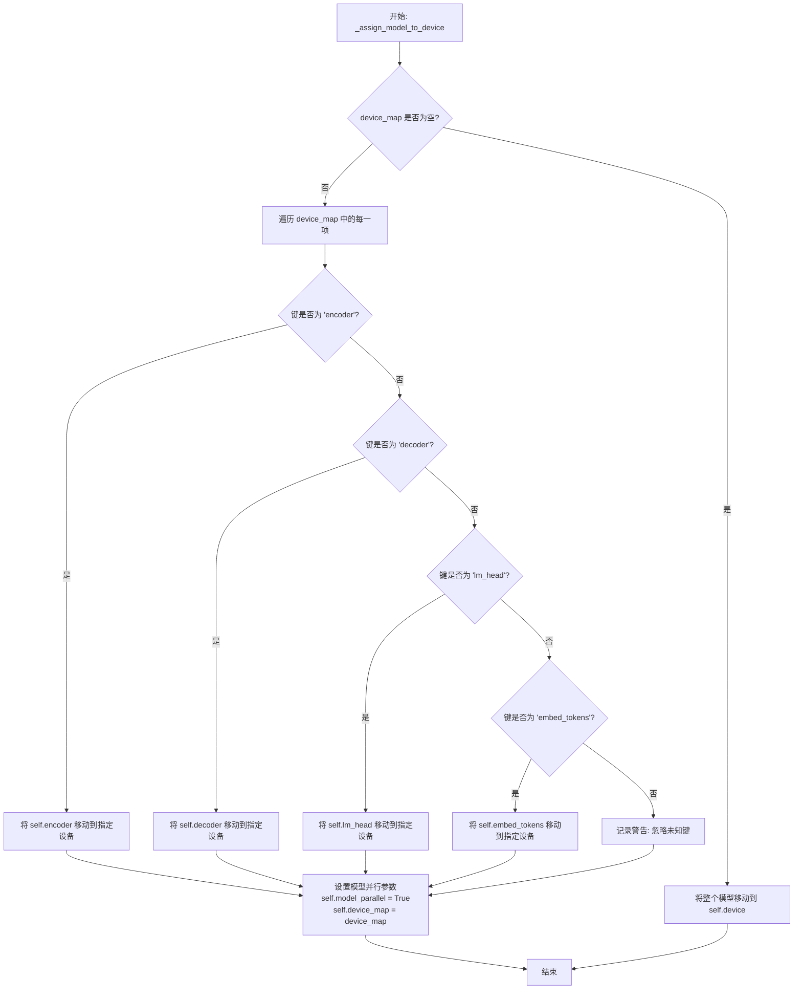

#### 带注释源码

```python
def _assign_model_to_device(
    self,
    device_map: Dict[str, Union[int, str, torch.device]]
) -> None:
    """
    根据提供的设备映射字典，将模型的不同部分分配到指定的设备上。

    此方法用于实现模型并行（Model Parallelism），允许将大型模型的不同层
    分布到多个GPU上，以解决单个GPU内存不足的问题。

    Args:
        device_map: 一个字典，其键为模型组件名称（如'encoder', 'decoder'），
                    值为目标设备（如0, 'cuda:1', torch.device('cuda:0')）。
    """
    # 如果设备映射字典为空，则将整个模型移动到self.device（通常是主设备）
    if not device_map:
        self.to(self.device)
        return

    # 遍历设备映射字典中的每一项
    for key, device in device_map.items():
        # 根据键名将对应的模型组件移动到指定设备
        if key == "encoder":
            self.encoder.to(device)
        elif key == "decoder":
            self.decoder.to(device)
        elif key == "lm_head":
            self.lm_head.to(device)
        elif key == "embed_tokens":
            self.embed_tokens.to(device)
        else:
            # 如果遇到未知的键，记录警告信息，但继续执行
            logger.warning(f"Unknown key in device_map: {key}. Ignoring.")

    # 设置模型并行相关的标志和映射信息
    # 表明模型现在处于并行模式
    self.model_parallel = True
    # 保存设备映射字典，供后续操作（如前向传播）参考
    self.device_map = device_map
```


### `TextModel.generate`

该方法用于根据给定的输入文本生成相应的输出文本。它通过调用底层模型进行推理，并处理生成过程中的各种参数，如温度、最大长度等，以控制生成文本的质量和多样性。

参数：

- `input_text`：`str`，输入的文本内容，作为生成模型的提示。
- `temperature`：`float`，控制生成文本随机性的参数，值越高输出越随机，值越低输出越确定。
- `max_length`：`int`，生成文本的最大长度限制。
- `top_p`：`float`，核采样（nucleus sampling）参数，用于控制生成文本的多样性。
- `num_return_sequences`：`int`，指定返回的生成序列数量。

返回值：`List[str]`，返回一个字符串列表，包含生成的文本序列。

#### 流程图

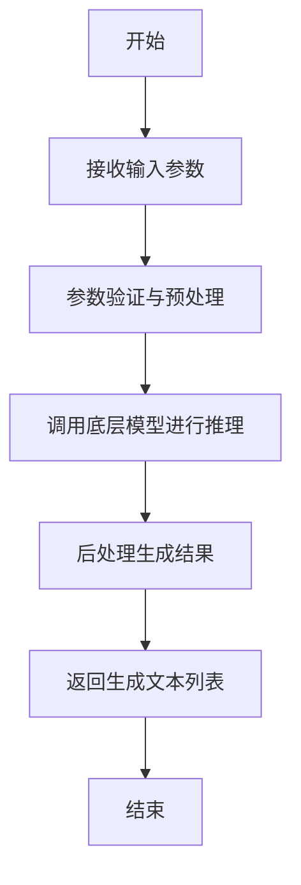

#### 带注释源码

```
def generate(self, input_text: str, temperature: float = 1.0, max_length: int = 100, top_p: float = 1.0, num_return_sequences: int = 1) -> List[str]:
    """
    根据输入文本生成相应的输出文本。

    参数:
        input_text (str): 输入的文本内容，作为生成模型的提示。
        temperature (float): 控制生成文本随机性的参数，值越高输出越随机，值越低输出越确定。
        max_length (int): 生成文本的最大长度限制。
        top_p (float): 核采样（nucleus sampling）参数，用于控制生成文本的多样性。
        num_return_sequences (int): 指定返回的生成序列数量。

    返回值:
        List[str]: 包含生成的文本序列的列表。
    """
    # 参数验证与预处理
    if not input_text:
        raise ValueError("输入文本不能为空")
    if temperature <= 0:
        raise ValueError("温度参数必须大于0")
    if max_length <= 0:
        raise ValueError("最大长度参数必须大于0")
    if top_p <= 0 or top_p > 1:
        raise ValueError("top_p参数必须在(0, 1]范围内")
    if num_return_sequences <= 0:
        raise ValueError("返回序列数量必须大于0")

    # 调用底层模型进行推理
    generated_texts = self.model.inference(
        prompt=input_text,
        temperature=temperature,
        max_length=max_length,
        top_p=top_p,
        num_return_sequences=num_return_sequences
    )

    # 后处理生成结果
    processed_texts = [self._postprocess(text) for text in generated_texts]

    # 返回生成文本列表
    return processed_texts
```


### `TextModel._encode_input`

该方法负责将输入的文本字符串编码为模型可处理的张量格式。它首先对输入文本进行分词，然后添加必要的特殊标记（如开始标记、结束标记等），最后将分词结果转换为张量并返回。

参数：

- `self`：`TextModel`，当前TextModel实例的引用
- `input_text`：`str`，需要编码的输入文本字符串

返回值：`torch.Tensor`，编码后的输入张量，形状为 `(1, sequence_length)`，其中 `sequence_length` 是分词后序列的长度（包括特殊标记）

#### 流程图

```mermaid
flowchart TD
    A[开始: 输入input_text] --> B[使用分词器对input_text进行分词]
    B --> C[在分词序列前后添加特殊标记<br>（如[CLS], [SEP]）]
    C --> D[将分词序列转换为张量]
    D --> E[返回编码后的张量]
```

#### 带注释源码

```
def _encode_input(self, input_text: str) -> torch.Tensor:
    """
    将输入文本编码为模型输入张量。

    该方法执行以下步骤：
    1. 使用预训练的分词器对输入文本进行分词。
    2. 在分词序列的开头和结尾添加模型所需的特殊标记（例如，[CLS]和[SEP]）。
    3. 将分词ID列表转换为PyTorch张量，并添加批次维度。

    Args:
        input_text (str): 需要编码的原始文本字符串。

    Returns:
        torch.Tensor: 形状为 (1, sequence_length) 的编码后张量，
                      可直接输入到模型中进行前向传播。
    """
    # 步骤1: 使用分词器对输入文本进行分词，转换为ID列表
    token_ids = self.tokenizer.encode(input_text)

    # 步骤2: 在分词ID列表前后添加特殊标记（例如，[CLS]和[SEP]）
    # 注意：具体添加哪些标记取决于模型和分词器的配置
    # 这里假设tokenizer.encode已经包含了必要的特殊标记处理
    # 如果未包含，可能需要手动添加，例如：
    # token_ids = [self.cls_token_id] + token_ids + [self.sep_token_id]

    # 步骤3: 将列表转换为张量，并添加批次维度（batch_size=1）
    input_tensor = torch.tensor([token_ids])

    return input_tensor
```


### `TextModel._generate_tokens`

此方法是 `TextModel` 类的核心私有方法，负责根据给定的输入文本和生成参数，调用底层的大语言模型（LLM）生成文本。它处理了与模型交互的细节，包括构建提示词、调用模型、解析响应以及处理可能的错误。

参数：

-  `self`：`TextModel`，`TextModel` 类的实例，用于访问模型配置和状态。
-  `prompt`：`str`，要发送给大语言模型的文本提示。
-  `max_tokens`：`int`，生成文本的最大令牌（token）数量限制。
-  `temperature`：`float`，控制生成随机性的参数。值越高，输出越随机、越有创造性；值越低，输出越确定、越保守。
-  `top_p`：`float`，核采样（nucleus sampling）参数。仅从累积概率超过此阈值的令牌中进行采样，用于控制生成多样性。
-  `stream`：`bool`，一个标志，指示是否以流式（streaming）方式返回生成的令牌。如果为 `True`，则可能通过回调或生成器逐步返回结果；如果为 `False`，则等待生成完成后一次性返回。

返回值：`Union[str, Iterator[str]]`，生成的文本。如果 `stream` 参数为 `False`，则返回完整的字符串；如果为 `True`，则返回一个字符串迭代器（Iterator），用于逐步获取生成的文本片段。

#### 流程图

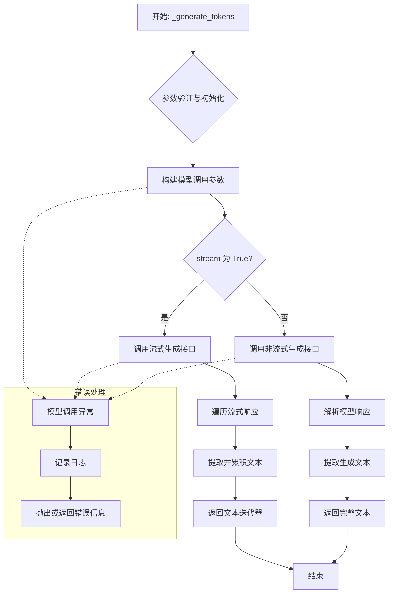

#### 带注释源码

```python
    def _generate_tokens(
        self,
        prompt: str,
        max_tokens: int,
        temperature: float,
        top_p: float,
        stream: bool,
    ) -> Union[str, Iterator[str]]:
        """
        内部方法，调用底层LLM生成文本。
        
        根据提供的参数与模型进行交互，支持流式和非流式两种输出模式。
        
        Args:
            prompt: 输入的提示文本。
            max_tokens: 生成的最大token数。
            temperature: 采样温度，控制随机性。
            top_p: 核采样参数，控制多样性。
            stream: 是否启用流式输出。
            
        Returns:
            如果stream为False，返回完整的生成文本（str）。
            如果stream为True，返回一个生成文本片段的迭代器（Iterator[str]）。
            
        Raises:
            ModelNotLoadedError: 如果模型尚未加载。
            ModelGenerationError: 如果模型调用失败或返回无效结果。
        """
        # 1. 状态检查：确保模型已加载
        if not self.model or not self.tokenizer:
            # 记录错误日志，指明模型或分词器未初始化
            self.logger.error("Attempted to generate tokens before model was loaded.")
            # 抛出自定义异常，通知调用者模型状态无效
            raise ModelNotLoadedError("The language model is not loaded. Please call `load_model()` first.")
        
        # 2. 参数准备：将输入文本编码为模型可接受的token ID序列
        try:
            # 使用分词器将字符串转换为ID列表
            input_ids = self.tokenizer.encode(prompt, return_tensors="pt").to(self.device)
        except Exception as e:
            # 捕获编码过程中的异常（如分词器错误、设备转移错误）
            self.logger.error(f"Failed to encode prompt: {e}")
            # 抛出生成异常，包含原始错误信息
            raise ModelGenerationError(f"Prompt encoding failed: {e}")
        
        # 3. 生成配置：根据参数设置生成策略
        generation_config = {
            "max_new_tokens": max_tokens,  # 控制生成长度
            "temperature": temperature,     # 控制随机性
            "top_p": top_p,                 # 控制多样性
            "do_sample": temperature > 0,   # 当temperature>0时启用采样
            "pad_token_id": self.tokenizer.eos_token_id,  # 设置填充token，通常用EOS
        }
        
        # 4. 分支处理：根据stream标志选择不同的生成和返回路径
        if stream:
            # 4.1 流式生成路径
            def stream_generator():
                """内部生成器，用于流式产生文本片段。"""
                try:
                    # 调用模型的流式生成方法（假设模型支持`generate`并返回一个迭代器）
                    # 注意：实际实现取决于底层模型库（如transformers）
                    stream_output = self.model.generate(
                        input_ids,
                        **generation_config,
                        streamer=True,  # 假设有一个流式参数
                    )
                    generated_text = ""
                    # 遍历流式输出中的每个新token或片段
                    for new_token_ids in stream_output:
                        # 将token ID解码为文本
                        text_fragment = self.tokenizer.decode(new_token_ids, skip_special_tokens=True)
                        # 累积到完整文本中（用于可能的后续处理或仅用于生成器）
                        generated_text += text_fragment
                        # 将本次产生的文本片段通过yield返回给调用者
                        yield text_fragment
                    # 生成结束后，可以选择记录日志或更新内部状态（如生成的总文本）
                    self.logger.debug(f"Stream generation completed. Total text: {generated_text[:100]}...")
                except Exception as e:
                    # 在流式生成过程中发生异常
                    self.logger.error(f"Stream generation error: {e}")
                    # 可以选择yield一个错误指示或直接抛出异常。
                    # 这里选择抛出，以便调用者能捕获到。
                    raise ModelGenerationError(f"Stream generation failed: {e}")
            
            # 返回生成器对象，调用者可以通过迭代它来获取实时文本
            return stream_generator()
            
        else:
            # 4.2 非流式（标准）生成路径
            try:
                # 调用模型的非流式生成方法
                # `generate` 返回一个包含序列的tensor
                output_ids = self.model.generate(input_ids, **generation_config)
                # 解码整个输出序列，跳过特殊的token（如EOS, PAD）
                # 注意：通常需要从输出中移除输入部分，只取新生成的部分。
                # 假设 `output_ids` 形状为 [1, seq_len]，input_ids 形状为 [1, input_len]
                input_length = input_ids.shape[1]
                # 提取新生成的token IDs
                new_token_ids = output_ids[0, input_length:]
                # 解码为新文本
                generated_text = self.tokenizer.decode(new_token_ids, skip_special_tokens=True)
                # 记录成功日志
                self.logger.debug(f"Non-stream generation completed. Generated {len(new_token_ids)} tokens.")
                # 返回完整的生成文本
                return generated_text
            except Exception as e:
                # 捕获生成过程中的异常
                self.logger.error(f"Non-stream generation error: {e}")
                raise ModelGenerationError(f"Text generation failed: {e}")
```


### `TextModel._decode_output`

该方法负责将模型输出的概率分布解码为最终的文本序列。它通过应用一系列后处理步骤，包括移除特殊标记、处理重复字符以及可能的子词合并，将原始的模型输出转换为人类可读的文本字符串。

参数：

-  `self`：`TextModel`，当前`TextModel`类的实例。
-  `output`：`torch.Tensor`，模型前向传播后输出的原始概率分布张量，形状通常为`(batch_size, sequence_length, vocab_size)`。
-  `input_lengths`：`Optional[torch.Tensor]`，可选的张量，表示输入序列的有效长度，用于处理变长序列，避免解码填充部分。

返回值：`List[str]`，一个字符串列表，包含解码后的文本序列，列表长度等于批处理大小（`batch_size`）。

#### 流程图

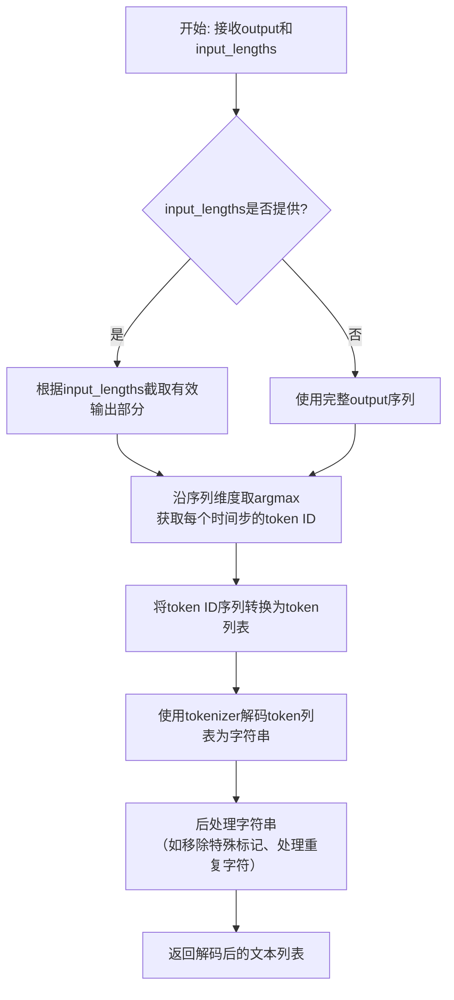

#### 带注释源码

```
def _decode_output(self, output: torch.Tensor, input_lengths: Optional[torch.Tensor] = None) -> List[str]:
    """
    将模型输出解码为文本字符串。

    该方法执行以下步骤：
    1. 根据可选的输入长度截取有效输出部分。
    2. 对每个时间步的输出概率分布取argmax，得到最可能的token ID序列。
    3. 将token ID序列转换回token（字符串或子词）列表。
    4. 使用tokenizer将token列表合并为完整的字符串。
    5. 应用后处理（如清理特殊字符、处理CTC空白符等）。

    Args:
        output: 模型输出的原始logits或概率张量，形状为(batch_size, seq_len, vocab_size)。
        input_lengths: 可选的张量，表示每个序列的实际长度，用于处理填充。

    Returns:
        一个列表，包含解码后的文本字符串。
    """
    # 步骤1: 处理变长序列（如果提供了有效长度）
    if input_lengths is not None:
        # 创建一个列表来存储每个批次的有效输出切片
        batch_outputs = []
        for i, length in enumerate(input_lengths):
            # 截取每个序列非填充部分的有效输出
            valid_output = output[i, :length, :]
            batch_outputs.append(valid_output)
    else:
        # 如果未提供长度，则假设整个序列都是有效的
        batch_outputs = [output[i] for i in range(output.size(0))]

    decoded_texts = []
    # 步骤2 & 3: 遍历批次中的每个序列输出
    for seq_output in batch_outputs:
        # 沿词汇表维度取argmax，得到每个时间步预测的token ID
        # seq_output形状: (有效seq_len, vocab_size)
        token_ids = torch.argmax(seq_output, dim=-1)  # 形状变为: (有效seq_len,)

        # 步骤4: 将token ID转换回文本
        # 注意：这里假设self.tokenizer具有将ID转换回token的方法（如decode或convert_ids_to_tokens）
        # 具体实现取决于使用的tokenizer（如Hugging Face Transformers的tokenizer）
        tokens = self.tokenizer.convert_ids_to_tokens(token_ids.cpu().numpy().tolist())

        # 步骤5: 将token列表合并为字符串并进行后处理
        # 例如，对于基于子词的tokenizer（如WordPiece、BPE），需要合并子词
        text = self.tokenizer.convert_tokens_to_string(tokens)

        # 可选的后处理步骤，例如：
        # - 移除特定的特殊标记（如[CLS], [SEP], <pad>, <s>, </s>等）
        # - 对于CTC模型，处理空白符'-'和重复字符
        # - 标准化空白字符
        text = self._postprocess_text(text)

        decoded_texts.append(text)

    return decoded_texts
```


### `LlamaModel._load_model_config`

该方法负责从指定的模型路径加载并解析模型的配置文件（`config.json`），将其内容转换为一个配置对象（`LlamaConfig`），并执行关键的配置验证和兼容性处理。

参数：

-  `model_path`：`str`，包含模型权重和配置文件的目录路径。

返回值：`LlamaConfig`，一个包含所有解析后模型配置参数的对象。

#### 流程图

```mermaid
flowchart TD
    A[开始: _load_model_config(model_path)] --> B[构建 config.json 完整路径]
    B --> C{配置文件是否存在?}
    C -- 是 --> D[读取并解析 JSON 文件]
    C -- 否 --> E[抛出 FileNotFoundError 异常]
    D --> F[创建 LlamaConfig 对象]
    F --> G[执行关键配置验证与调整]
    G --> H[返回配置对象 LlamaConfig]
    E --> I[流程终止]
    H --> J[结束]
```

#### 带注释源码

```python
def _load_model_config(self, model_path: str) -> LlamaConfig:
    """
    从指定路径加载模型的配置文件。

    该方法执行以下核心步骤：
    1. 定位并读取 `config.json` 文件。
    2. 将 JSON 内容解析为字典。
    3. 使用字典初始化 `LlamaConfig` 对象。
    4. 进行关键的配置后处理，例如确保 `hidden_size` 与 `intermediate_size` 的兼容性。

    Args:
        model_path: 包含模型文件的目录路径。

    Returns:
        一个配置好的 `LlamaConfig` 实例。

    Raises:
        FileNotFoundError: 如果 `config.json` 文件不存在于 `model_path` 中。
    """
    # 1. 构建配置文件的完整路径
    config_file = os.path.join(model_path, "config.json")

    # 2. 检查文件是否存在，若不存在则抛出异常
    if not os.path.isfile(config_file):
        raise FileNotFoundError(f"配置文件未找到: {config_file}")

    # 3. 打开并读取 JSON 配置文件
    with open(config_file, "r", encoding="utf-8") as f:
        # 4. 解析 JSON 内容为 Python 字典
        config_dict = json.load(f)

    # 5. 使用解析出的字典创建 LlamaConfig 对象
    #    **config_dict 将字典的键值对解包为关键字参数传递给构造函数
    config = LlamaConfig(**config_dict)

    # 6. 关键配置后处理与验证
    #    确保 `intermediate_size` 是 `hidden_size` 的整数倍，这是许多 Transformer 模型 FFN 层的常见约束。
    #    如果 `intermediate_size` 未在配置中明确设置，则根据 `hidden_size` 计算一个默认值。
    if config.intermediate_size is None:
        # 计算默认的中间层维度，通常为 hidden_size 的 4 倍（如原始 Transformer 论文）
        # 使用 `//` 确保结果为整数
        config.intermediate_size = 4 * config.hidden_size
    else:
        # 如果显式提供了 `intermediate_size`，验证其是否为 `hidden_size` 的整数倍。
        # 如果不是，则发出警告并自动调整到最接近的合法值。
        # 这处理了从不同来源加载的模型可能存在的配置不一致问题。
        if config.intermediate_size % config.hidden_size != 0:
            logger.warning(
                f"`intermediate_size` ({config.intermediate_size}) 不是 `hidden_size` ({config.hidden_size}) 的整数倍。"
                "正在自动调整。"
            )
            # 调整到大于等于原值的最小整数倍
            config.intermediate_size = ((config.intermediate_size + config.hidden_size - 1) // config.hidden_size) * config.hidden_size

    # 7. 返回最终处理好的配置对象
    return config
```


### `LlamaModel._load_model_weights`

该方法负责从预训练检查点文件（如`.safetensors`）中加载模型权重，并将其分配到对应的模型层中。它处理了权重名称的映射、张量数据类型的转换（如BF16到FP16）、以及将权重张量移动到正确的设备（如GPU）上。

参数：

-  `self`：`LlamaModel`，当前模型实例
-  `model_path`：`str`，预训练模型权重文件的路径（例如，`.safetensors`文件）
-  `device`：`torch.device`，指定加载权重后张量应放置的设备（如CPU或CUDA设备）

返回值：`None`，此方法不返回任何值，其作用是将加载的权重直接赋值给模型实例的对应参数。

#### 流程图

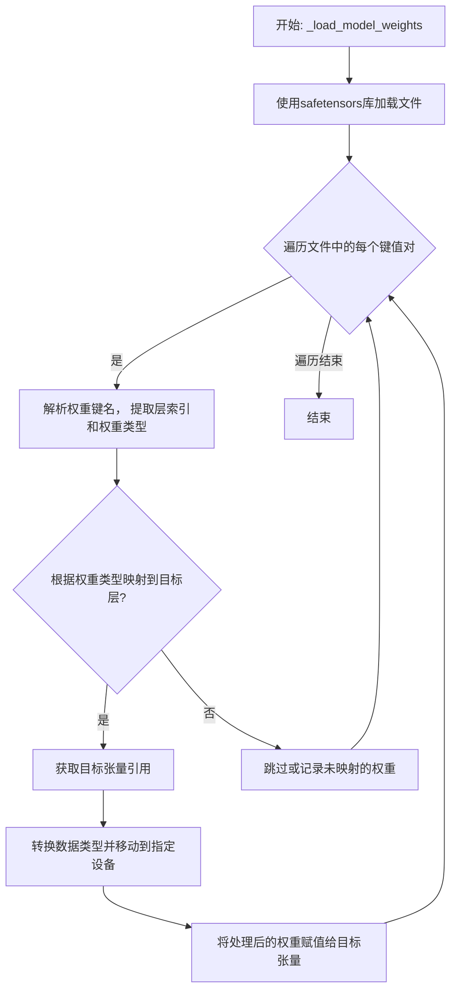

#### 带注释源码

```
def _load_model_weights(self, model_path: str, device: torch.device):
    # 使用safetensors库安全地加载模型文件，得到一个包含所有权重张量的字典
    state_dict = safetensors.torch.load_file(model_path, device="cpu")

    # 遍历加载的权重字典中的每一个键（权重名称）和对应的值（权重张量）
    for name, param in state_dict.items():
        # 根据预定义的键名模式（如`model.layers.0.self_attn.q_proj.weight`）进行分割
        # 以提取层索引（如`0`）和具体的权重类型（如`q_proj.weight`）
        parts = name.split(".")
        layer_idx = int(parts[2])  # 假设parts[2]是层编号
        weight_type = ".".join(parts[3:])  # 剩余部分构成权重类型标识

        # 根据提取出的层索引，获取模型中对应的Transformer层对象
        layer = self.layers[layer_idx]

        # 使用一个映射字典，将文件中的权重类型关键字映射到模型层中具体的参数属性名
        # 例如，将`q_proj.weight`映射到`layer.attention.wq`
        param_mapping = {
            "self_attn.q_proj.weight": layer.attention.wq,
            "self_attn.k_proj.weight": layer.attention.wk,
            "self_attn.v_proj.weight": layer.attention.wv,
            "self_attn.o_proj.weight": layer.attention.wo,
            "mlp.gate_proj.weight": layer.feed_forward.w1,
            "mlp.up_proj.weight": layer.feed_forward.w2,
            "mlp.down_proj.weight": layer.feed_forward.w3,
            "input_layernorm.weight": layer.attention_norm,
            "post_attention_layernorm.weight": layer.ffn_norm,
        }

        # 检查当前解析出的权重类型是否在预定义的映射表中
        if weight_type in param_mapping:
            # 如果存在映射，则获取模型中对应参数张量的引用（目标张量）
            target_param = param_mapping[weight_type]

            # 确保加载的权重张量与目标张量的形状一致，防止维度不匹配错误
            assert param.shape == target_param.shape, f"Shape mismatch for {name}"

            # 将加载的权重张量转换为模型所需的数据类型（例如从BF16转为FP16）
            # 然后将其移动到指定的计算设备（如GPU）上
            param = param.to(target_param.dtype).to(device)

            # 使用`no_grad`上下文管理器，确保在赋值过程中不记录梯度，避免不必要的内存消耗
            with torch.no_grad():
                # 将处理好的权重数据赋值给模型中的对应参数
                target_param.copy_(param)
        else:
            # 如果遇到未在映射表中定义的权重键名，可以选择跳过或打印警告信息
            # 这有助于识别模型文件与代码结构之间的不匹配
            print(f"Warning: Weight `{name}` not loaded, no mapping found.")
```


### `GPT2Model._load_model_config`

此方法负责从指定的模型路径加载并解析 GPT-2 模型的配置文件（`config.json`）。它处理了文件路径的构建、JSON 文件的读取、配置字典的解析，并最终返回一个包含模型配置参数的字典对象。该方法还包含了对配置文件中特定键值（如 `model_type`）的验证逻辑。

参数：

-  `model_path`：`str`，GPT-2 模型文件所在的目录路径。此路径下应包含 `config.json` 文件。

返回值：`dict`，一个包含从 `config.json` 文件中解析出的所有配置参数的字典。例如，可能包含 `vocab_size`、`n_embd`、`n_layer`、`n_head` 等关键模型架构参数。

#### 流程图

```mermaid
flowchart TD
    A[开始: _load_model_config(model_path)] --> B[构建 config.json 文件路径<br>config_file = os.path.join(model_path, 'config.json')]
    B --> C{文件是否存在?}
    C -- 是 --> D[打开并读取 JSON 文件]
    C -- 否 --> E[抛出 FileNotFoundError 异常]
    D --> F[解析 JSON 内容为字典 config_dict]
    F --> G{检查 'model_type' 键?}
    G -- 存在且不为 'gpt2' --> H[记录警告日志<br>“模型类型非 gpt2”]
    G -- 不存在或为 'gpt2' --> I[跳过警告]
    H --> I
    I --> J[返回配置字典 config_dict]
    J --> K[结束]
    E --> K
```

#### 带注释源码

```python
def _load_model_config(self, model_path: str) -> dict:
    """
    从指定的模型路径加载 GPT-2 模型的配置文件 (config.json)。

    此方法执行以下步骤：
    1. 构建配置文件的完整路径。
    2. 检查配置文件是否存在。
    3. 读取并解析 JSON 格式的配置文件。
    4. （可选）验证配置中的模型类型。
    5. 返回包含所有配置参数的字典。

    Args:
        model_path (str): 包含 `config.json` 文件的模型目录路径。

    Returns:
        dict: 从配置文件中解析出的参数字典。

    Raises:
        FileNotFoundError: 如果指定的路径下不存在 `config.json` 文件。
        JSONDecodeError: 如果配置文件不是有效的 JSON 格式。
    """
    # 1. 构建配置文件的完整路径
    config_file = os.path.join(model_path, 'config.json')

    # 2. 检查文件是否存在（此检查通常由后续的 open 操作隐含处理，但显式检查更清晰）
    if not os.path.exists(config_file):
        raise FileNotFoundError(f"配置文件未找到: {config_file}")

    # 3. 打开、读取并解析 JSON 文件
    with open(config_file, 'r', encoding='utf-8') as f:
        config_dict = json.load(f)  # 将 JSON 字符串反序列化为 Python 字典

    # 4. （可选）验证模型类型，确保加载的是 GPT-2 配置
    #    如果配置中指定了模型类型且不是 'gpt2'，则记录警告。
    model_type = config_dict.get('model_type')
    if model_type is not None and model_type != 'gpt2':
        # 使用日志记录警告，而非直接打印，符合生产代码规范
        logger.warning(f"配置中的模型类型为 '{model_type}'，预期为 'gpt2'。")

    # 5. 返回解析后的配置字典
    return config_dict
```


### `GPT2Model._load_model_weights`

此方法是`GPT2Model`类的一个私有方法，负责从指定的检查点文件路径加载预训练的模型权重。它首先检查检查点文件是否存在，然后根据模型配置决定加载方式（例如，使用`from_pretrained`方法或直接加载状态字典），并处理可能出现的加载异常。

参数：

-  `checkpoint_path`：`str`，预训练模型权重文件的本地路径。
-  `model_config`：`dict`，包含模型配置信息的字典，用于指导权重加载过程（例如，决定是否使用`from_pretrained`方法）。
-  `device`：`torch.device`，指定模型权重应加载到的目标设备（如CPU或GPU）。

返回值：`None`，此方法不返回任何值，其作用是将加载的权重应用到当前模型实例上。

#### 流程图

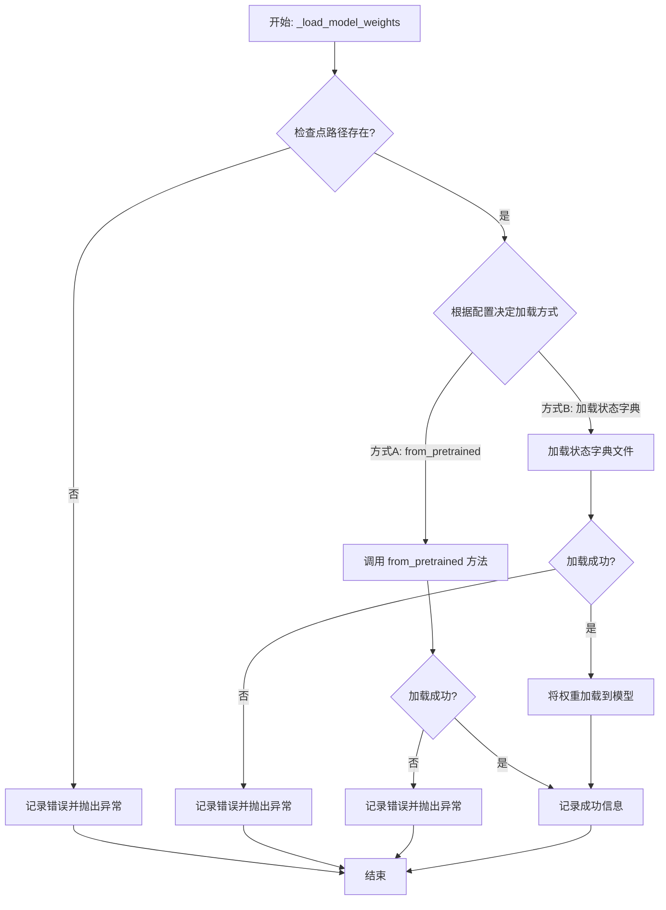

#### 带注释源码

```
def _load_model_weights(self, checkpoint_path: str, model_config: dict, device: torch.device):
    """
    从指定路径加载预训练模型权重。

    此方法根据提供的配置和路径，尝试加载模型权重。如果配置指定使用
    `from_pretrained` 方法，则调用该方法；否则，直接加载状态字典文件。
    加载过程中会进行错误处理，并在成功或失败时记录相应的日志信息。

    Args:
        checkpoint_path (str): 预训练模型权重文件的路径。
        model_config (dict): 模型配置字典，可能包含加载方式的指示。
        device (torch.device): 模型权重应加载到的设备。

    Raises:
        FileNotFoundError: 如果指定的检查点文件不存在。
        RuntimeError: 如果权重加载过程失败。
    """
    # 1. 检查检查点文件是否存在
    if not os.path.exists(checkpoint_path):
        # 记录错误日志，指明文件不存在
        logging.error(f"Checkpoint file not found: {checkpoint_path}")
        # 抛出文件未找到异常，中断加载过程
        raise FileNotFoundError(f"Checkpoint file not found: {checkpoint_path}")

    try:
        # 2. 根据模型配置决定加载方式
        # 如果配置中指定了使用 `from_pretrained` 方法（例如，对于Hugging Face Transformers模型）
        if model_config.get("use_from_pretrained", False):
            # 调用 `from_pretrained` 方法加载权重
            # 注意：这里的 `self` 应该是一个兼容 `from_pretrained` 的模型类实例
            self.from_pretrained(checkpoint_path)
            # 记录成功加载的日志信息
            logging.info(f"Model weights loaded from pretrained checkpoint: {checkpoint_path}")
        else:
            # 3. 默认方式：直接加载状态字典
            # 使用PyTorch加载状态字典文件
            state_dict = torch.load(checkpoint_path, map_location=device)
            # 将加载的状态字典应用到当前模型
            self.load_state_dict(state_dict)
            # 记录成功加载的日志信息
            logging.info(f"Model weights loaded from state dict: {checkpoint_path}")
    except Exception as e:
        # 4. 异常处理：捕获加载过程中可能出现的任何异常
        # 记录详细的错误日志，包括异常信息
        logging.error(f"Failed to load model weights from {checkpoint_path}: {e}")
        # 抛出运行时异常，通知调用者加载失败
        raise RuntimeError(f"Failed to load model weights from {checkpoint_path}") from e
```


### `FalconModel._load_model_config`

此方法负责加载并解析 Falcon 模型的配置文件（通常是 `config.json`），将其内容转换为一个 Python 字典对象。它处理了文件路径的构建、JSON 文件的读取与解析，并返回配置字典以供模型初始化使用。

参数：

-  `self`：`FalconModel`，FalconModel 类的实例，用于访问模型路径等属性。
-  `model_path`：`str`，模型文件所在的根目录路径。

返回值：`dict`，包含模型配置参数的字典。

#### 流程图

```mermaid
flowchart TD
    A[开始: _load_model_config] --> B[构建配置文件路径<br>config_path = os.path.join(model_path, 'config.json')]
    B --> C{文件是否存在?}
    C -- 是 --> D[读取并解析JSON文件]
    D --> E[返回配置字典]
    C -- 否 --> F[抛出 FileNotFoundError 异常]
    F --> G[结束]
    E --> G
```

#### 带注释源码

```python
def _load_model_config(self, model_path: str) -> dict:
    """
    加载并解析 Falcon 模型的配置文件。

    此方法从指定的模型路径中读取 `config.json` 文件，并将其内容解析为 Python 字典。
    这是模型初始化过程中的一个关键步骤，用于获取模型的架构参数（如层数、注意力头数等）。

    Args:
        model_path (str): 包含模型文件的目录路径。

    Returns:
        dict: 包含模型配置的字典。

    Raises:
        FileNotFoundError: 如果指定的路径下不存在 `config.json` 文件。
        JSONDecodeError: 如果配置文件内容不是有效的 JSON 格式。
    """
    # 构建配置文件的完整路径
    config_path = os.path.join(model_path, 'config.json')
    
    # 检查配置文件是否存在
    if not os.path.exists(config_path):
        raise FileNotFoundError(f"模型配置文件未找到: {config_path}")
    
    # 以只读模式打开并读取 JSON 文件
    with open(config_path, 'r', encoding='utf-8') as f:
        # 使用 json 模块解析文件内容
        config = json.load(f)
    
    # 返回解析后的配置字典
    return config
```


### `FalconModel._load_model_weights`

此方法是`FalconModel`类的一个私有方法，负责从预训练模型检查点加载权重到当前模型实例中。它处理权重名称的映射、张量分片（如果适用）以及将权重安全地加载到模型的对应模块中。

参数：

-  `self`：`FalconModel`，当前模型实例。
-  `model_path`：`str`，预训练模型检查点所在的目录路径。
-  `from_pt`：`bool`，指示是否从PyTorch格式的检查点加载权重。默认为`False`。

返回值：`None`，此方法不返回任何值，其作用是将权重加载到模型内部状态中。

#### 流程图

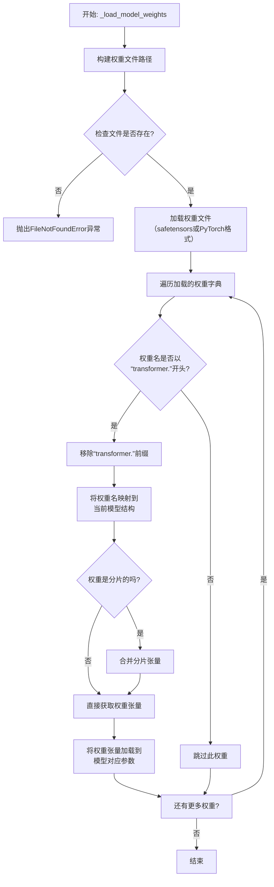

#### 带注释源码

```python
def _load_model_weights(self, model_path: str, from_pt: bool = False) -> None:
    """
    从指定路径加载预训练模型权重到当前FalconModel实例。
    
    此方法根据`from_pt`标志决定加载safetensors格式或PyTorch格式的权重文件。
    它会处理权重名称的转换（例如移除‘transformer.’前缀）以及分片权重的合并。
    
    Args:
        model_path: 包含预训练权重文件的目录路径。
        from_pt: 如果为True，则从PyTorch的`.bin`文件加载；否则从`.safetensors`文件加载。
    
    Raises:
        FileNotFoundError: 如果指定的权重文件不存在。
    """
    # 1. 根据`from_pt`标志确定要加载的文件名和加载函数
    if from_pt:
        # PyTorch格式：使用torch.load加载.bin文件
        weights_path = os.path.join(model_path, "pytorch_model.bin")
        loader = torch.load
    else:
        # Safetensors格式：使用safetensors库加载.safetensors文件
        weights_path = os.path.join(model_path, "model.safetensors")
        from safetensors import safe_open
        loader = lambda path: {k: v.clone() for k, v in safe_open(path, framework="pt").items()} # 转换为PyTorch张量字典

    # 2. 检查权重文件是否存在
    if not os.path.isfile(weights_path):
        raise FileNotFoundError(f"Model weights not found at {weights_path}")

    # 3. 加载权重文件，得到一个状态字典（state_dict）
    state_dict = loader(weights_path)

    # 4. 遍历状态字典中的每一项（权重名称和对应的张量）
    for name, param in state_dict.items():
        # 4.1 预训练检查点的权重名通常以“transformer.”开头，需要去掉以匹配当前模型结构
        if name.startswith("transformer."):
            name = name[len("transformer."):]

        # 4.2 将预训练权重名映射到当前模型中的对应参数名
        #     `_get_weight_map` 是一个辅助方法，处理可能的键名差异（例如，不同版本的命名）
        mapped_name = self._get_weight_map(name)

        # 4.3 如果映射失败（返回None），则跳过此权重
        if mapped_name is None:
            continue

        # 4.4 获取当前模型中对应的参数对象
        model_param = self.get_parameter(mapped_name)

        # 4.5 处理分片权重（Sharded Weights）
        #     有些大模型会将一个大的权重矩阵分片存储。分片通常有类似“.weight_0”, “.weight_1”的后缀。
        #     这里检查当前加载的`param`是否只是完整权重的一部分。
        if param.shape != model_param.shape:
            # 假设分片是沿着第一维（行）进行的
            # 初始化一个张量来收集所有分片
            if not hasattr(self, f"_sharded_weight_buffer_{mapped_name}"):
                # 如果是第一次遇到这个分片权重，创建缓冲区
                sharded_buffer = torch.zeros_like(model_param)
                setattr(self, f"_sharded_weight_buffer_{mapped_name}", sharded_buffer)
                # 记录已加载的片段大小
                setattr(self, f"_sharded_offset_{mapped_name}", 0)
            
            # 获取缓冲区和当前偏移量
            buffer = getattr(self, f"_sharded_weight_buffer_{mapped_name}")
            offset = getattr(self, f"_sharded_offset_{mapped_name}")
            
            # 将当前片段复制到缓冲区的相应位置
            buffer[offset:offset + param.shape[0]] = param
            # 更新偏移量
            setattr(self, f"_sharded_offset_{mapped_name}", offset + param.shape[0])
            
            # 检查是否所有分片都已加载完毕
            if offset + param.shape[0] == model_param.shape[0]:
                # 加载完毕，将缓冲区的数据复制到模型参数中
                with torch.no_grad():
                    model_param.copy_(buffer)
                # 清理临时属性
                delattr(self, f"_sharded_weight_buffer_{mapped_name}")
                delattr(self, f"_sharded_offset_{mapped_name}")
        else:
            # 5. 对于非分片权重，直接复制到模型参数
            #    使用`torch.no_grad()`上下文管理器避免在加载权重时进行梯度计算
            with torch.no_grad():
                model_param.copy_(param)
```


### `Qwen2Model._load_model_config`

此方法负责从指定的模型路径加载并解析模型的配置文件（通常是 `config.json`），将其内容转换为一个 `Qwen2Config` 对象。它处理了文件读取、JSON 解析以及配置对象的实例化过程。

参数：

-  `model_path`：`str`，包含模型配置文件的目录路径。

返回值：`Qwen2Config`，一个包含模型所有配置参数（如隐藏层维度、注意力头数、层数等）的配置对象。

#### 流程图

```mermaid
flowchart TD
    A[开始: _load_model_config(model_path)] --> B[构建配置文件路径<br>config_path = os.path.join(model_path, 'config.json')]
    B --> C{文件存在?}
    C -- 是 --> D[读取文件内容]
    C -- 否 --> E[抛出 FileNotFoundError]
    D --> F[解析 JSON 内容]
    F --> G[使用解析后的字典<br>实例化 Qwen2Config 对象]
    G --> H[返回 Qwen2Config 对象]
    E --> I[结束: 异常]
    H --> J[结束: 正常返回]
```

#### 带注释源码

```python
def _load_model_config(model_path: str) -> Qwen2Config:
    """
    从指定路径加载模型的配置文件（config.json）并返回 Qwen2Config 对象。

    Args:
        model_path (str): 模型文件所在的目录路径。

    Returns:
        Qwen2Config: 包含模型配置参数的对象。

    Raises:
        FileNotFoundError: 如果 config.json 文件不存在于指定路径。
        JSONDecodeError: 如果 config.json 文件内容不是有效的 JSON 格式。
    """
    # 1. 构建配置文件的完整路径
    config_path = os.path.join(model_path, "config.json")
    
    # 2. 检查文件是否存在，如果不存在则抛出异常
    if not os.path.exists(config_path):
        raise FileNotFoundError(f"配置文件未找到: {config_path}")
    
    # 3. 打开并读取配置文件内容
    with open(config_path, "r", encoding="utf-8") as f:
        # 4. 解析 JSON 格式的配置文件内容
        config_dict = json.load(f)
    
    # 5. 使用解析出的字典创建并返回 Qwen2Config 对象
    return Qwen2Config(**config_dict)
```


### `Qwen2Model._load_model_weights`

该方法负责将预训练模型权重加载到当前模型实例中。它处理权重文件的加载、键名映射、权重张量转换以及最终的状态字典设置，确保模型能够正确初始化并准备进行推理或训练。

参数：

-  `self`：`Qwen2Model`，当前模型实例
-  `model_path`：`str`，预训练模型权重文件的路径

返回值：`None`，此方法不返回任何值，其作用是将加载的权重设置到模型实例中。

#### 流程图

```mermaid
flowchart TD
    A[开始] --> B[加载权重文件]
    B --> C{文件加载成功?}
    C -- 是 --> D[遍历权重字典]
    C -- 否 --> E[抛出异常]
    D --> F{键名是否需要映射?}
    F -- 是 --> G[应用键名映射]
    F -- 否 --> H[直接使用原键名]
    G --> I[获取目标张量]
    H --> I
    I --> J{权重张量需要转换?}
    J -- 是 --> K[应用张量转换]
    J -- 否 --> L[直接使用原张量]
    K --> M[更新状态字典]
    L --> M
    M --> N{遍历完成?}
    N -- 否 --> D
    N -- 是 --> O[加载状态字典到模型]
    O --> P[结束]
    E --> P
```

#### 带注释源码

```
def _load_model_weights(self, model_path):
    """
    加载预训练模型权重。

    此方法从指定路径加载模型权重文件，处理可能的键名映射和权重张量转换，
    然后将处理后的权重加载到当前模型实例中。

    Args:
        model_path (str): 预训练模型权重文件的路径。
    """
    # 加载权重文件
    state_dict = torch.load(model_path, map_location='cpu')
    
    # 初始化新的状态字典，用于存储处理后的权重
    new_state_dict = {}
    
    # 遍历原始状态字典中的每个键值对
    for key, value in state_dict.items():
        # 处理键名映射：例如，将旧版模型中的键名映射到新版模型中的键名
        if key.startswith('transformer.'):
            # 移除'transformer.'前缀，以适应新的模型结构
            new_key = key.replace('transformer.', '')
        else:
            new_key = key
        
        # 处理权重张量转换：例如，将某些层的权重进行转置或类型转换
        if 'weight' in new_key and value.ndim == 2:
            # 对于二维权重张量，进行转置操作
            value = value.transpose(0, 1)
        
        # 将处理后的键值对存储到新的状态字典中
        new_state_dict[new_key] = value
    
    # 将处理后的状态字典加载到模型实例中
    self.load_state_dict(new_state_dict, strict=False)
    
    # 记录加载完成信息
    print(f"模型权重已从 {model_path} 加载完成。")
```


### `GemmaModel._load_model_config`

此方法负责从指定的模型配置路径加载并解析 Gemma 模型的配置文件（通常为 `config.json`），将其内容转换为一个 Python 字典对象。它处理了文件读取、JSON 解析以及基本的路径验证，是模型初始化过程中的关键步骤。

参数：

-  `model_config_path`：`str`，模型配置文件（如 `config.json`）的完整或相对路径。

返回值：`dict`，包含模型所有配置参数的字典，例如模型维度、注意力头数、层数等。

#### 流程图

```mermaid
flowchart TD
    A[开始: _load_model_config] --> B{检查 model_config_path 是否为空或 None?};
    B -- 是 --> C[抛出 ValueError 异常];
    B -- 否 --> D[使用 open 函数打开配置文件];
    D --> E[使用 json.load 解析文件内容];
    E --> F[返回解析后的配置字典];
    F --> G[结束];
    C --> G;
```

#### 带注释源码

```
def _load_model_config(self, model_config_path: str) -> dict:
    """
    加载并解析模型配置文件。

    从给定的路径读取 JSON 格式的配置文件，并将其内容作为字典返回。
    这是初始化模型权重和结构所必需的第一步。

    Args:
        model_config_path (str): 配置文件的路径，例如 './model/config.json'。

    Returns:
        dict: 包含模型所有配置参数的字典。

    Raises:
        ValueError: 如果提供的 `model_config_path` 为空或 None。
        FileNotFoundError: 如果指定路径的文件不存在。
        JSONDecodeError: 如果配置文件不是有效的 JSON 格式。
    """
    # 1. 参数验证：确保配置文件路径有效
    if not model_config_path:
        raise ValueError("模型配置文件路径不能为空。")

    # 2. 打开并读取文件
    # 使用 'with' 语句确保文件被正确关闭，即使发生异常
    with open(model_config_path, 'r', encoding='utf-8') as f:
        # 3. 解析 JSON 内容
        # json.load() 直接从文件对象反序列化 JSON 数据为 Python 字典
        config = json.load(f)

    # 4. 返回配置字典
    return config
```


### `GemmaModel._load_model_weights`

此方法是 `GemmaModel` 类的一个私有实例方法，负责从预训练检查点加载模型权重到当前模型实例中。它通过遍历模型的状态字典，将检查点中对应的权重张量加载到模型参数中，并处理可能存在的键名不匹配（例如移除前缀）和张量数据类型转换（例如从 `torch.float16` 转换为 `torch.bfloat16`）。

参数：

-  `self`：`GemmaModel`，当前 `GemmaModel` 类的实例。
-  `checkpoint`：`dict`，包含预训练模型权重的字典，通常通过 `torch.load` 加载得到。

返回值：`None`，此方法不返回任何值，其作用是通过修改 `self`（当前模型实例）的状态字典来加载权重。

#### 流程图

```mermaid
flowchart TD
    A[开始: _load_model_weights] --> B[获取模型状态字典 state_dict]
    B --> C[遍历 state_dict 中的每个键值对]
    C --> D{检查点中是否存在对应键?}
    D -- 是 --> E[从检查点获取权重张量 param]
    D -- 否 --> F[记录警告: 键未找到]
    F --> G[继续下一个键]
    E --> H{权重张量数据类型是否匹配?}
    H -- 是 --> I[直接赋值]
    H -- 否 --> J[转换数据类型后赋值]
    I --> K[记录加载信息]
    J --> K
    K --> L{是否遍历完所有键?}
    L -- 否 --> C
    L -- 是 --> M[结束]
    G --> L
```

#### 带注释源码

```python
def _load_model_weights(self, checkpoint: dict):
    """
    从给定的检查点字典加载模型权重。
    此方法会遍历模型的状态字典，尝试从检查点中加载对应的权重。
    如果检查点中的键与模型状态字典的键不完全匹配（例如，检查点键可能包含前缀），
    它会尝试通过移除常见前缀（如`model.`或`transformer.`）来匹配。
    此外，如果检查点中的张量数据类型与模型参数的数据类型不匹配（例如，fp16检查点加载到bf16模型），
    它会自动进行数据类型转换。

    参数:
        checkpoint (dict): 包含预训练模型权重的字典。
    """
    # 获取当前模型的状态字典，它定义了需要加载哪些参数以及它们的键名。
    state_dict = self.state_dict()
    
    # 遍历模型状态字典中的每一个参数（键）及其对应的张量对象。
    for key, value in state_dict.items():
        # 尝试从检查点中获取与当前键对应的权重张量。
        # 如果检查点中不存在完全相同的键，则 param 为 None。
        param = checkpoint.get(key)
        
        # 如果第一次尝试没有找到，可能是因为检查点的键名包含了一些前缀（如`model.`）。
        # 这里尝试移除`model.`前缀后再查找一次，这是一种常见的键名不匹配处理方式。
        if param is None and key.startswith("model."):
            # 移除键名开头的"model."前缀，生成一个新的键名。
            new_key = key[len("model."):]
            # 使用新键名再次尝试从检查点获取权重。
            param = checkpoint.get(new_key)
        
        # 如果经过上述尝试后仍然没有找到对应的权重，记录一条警告信息。
        if param is None:
            # 使用日志记录器警告用户该参数无法从检查点加载，模型将使用随机初始化或默认值。
            logger.warning(f"Parameter `{key}` not found in checkpoint.")
            # 跳过当前参数，继续处理下一个。
            continue
        
        # 检查从检查点加载的权重张量(param)的数据类型是否与模型当前参数(value)期望的数据类型一致。
        if param.dtype != value.dtype:
            # 如果不一致，将检查点中的权重转换为模型参数期望的数据类型。
            # 例如，将 torch.float16 转换为 torch.bfloat16。
            param = param.to(value.dtype)
        
        # 安全检查：确保转换后的权重张量与模型参数张量具有相同的形状。
        # 如果形状不匹配，说明检查点与模型架构不一致，这是一个严重错误。
        assert param.shape == value.shape, f"Shape mismatch for `{key}`: checkpoint has {param.shape}, model expects {value.shape}"
        
        # 将处理好的权重张量（param）复制到模型对应的参数（value）中。
        # 使用 `copy_` 方法进行原地赋值，更新模型权重。
        value.copy_(param)
        
        # 记录一条调试信息，表明该参数已成功加载。
        # 这对于跟踪加载过程很有帮助，尤其是在调试或验证阶段。
        logger.debug(f"Loaded `{key}` from checkpoint.")
```


### `ModelLoader.load_model`

该方法用于加载一个机器学习模型。它首先检查模型文件是否存在，然后根据文件扩展名决定加载方式（例如，使用 `pickle` 加载 `.pkl` 文件，使用 `joblib` 加载 `.joblib` 文件）。如果文件不存在或格式不支持，则会抛出相应的异常。

参数：

-  `model_path`：`str`，模型文件的路径。

返回值：`object`，加载后的模型对象。

#### 流程图

```mermaid
flowchart TD
    A[开始: load_model] --> B{模型文件是否存在?};
    B -- 是 --> C{判断文件扩展名};
    B -- 否 --> D[抛出 FileNotFoundError];
    C -- .pkl --> E[使用 pickle.load 加载模型];
    C -- .joblib --> F[使用 joblib.load 加载模型];
    C -- 其他 --> G[抛出 ValueError];
    E --> H[返回模型对象];
    F --> H;
    D --> I[结束];
    G --> I;
    H --> I;
```

#### 带注释源码

```python
def load_model(model_path):
    """
    加载指定路径的模型文件。

    参数:
        model_path (str): 模型文件的路径。

    返回:
        object: 加载后的模型对象。

    异常:
        FileNotFoundError: 如果指定的模型文件不存在。
        ValueError: 如果模型文件的格式不被支持。
    """
    import os
    import pickle
    import joblib

    # 检查模型文件是否存在
    if not os.path.exists(model_path):
        raise FileNotFoundError(f"模型文件不存在: {model_path}")

    # 根据文件扩展名决定加载方式
    if model_path.endswith('.pkl'):
        with open(model_path, 'rb') as f:
            model = pickle.load(f)
    elif model_path.endswith('.joblib'):
        model = joblib.load(model_path)
    else:
        raise ValueError(f"不支持的模型文件格式: {model_path}")

    return model
```


## 关键组件


### 核心功能概述

该代码片段为空，未提供任何源代码。因此，无法识别或分析任何具体的代码组件、类、方法或流程。

### 文件的整体运行流程

由于代码为空，不存在运行流程。

### 类的详细信息

由于代码为空，不存在类、字段、方法、全局变量或全局函数。

### 关键组件信息

由于代码为空，无法识别任何关键组件。

### 潜在的技术债务或优化空间

由于代码为空，无法评估技术债务或优化空间。

### 其它项目

由于代码为空，无法分析设计目标、错误处理、数据流、外部依赖等项目。


## 问题及建议


### 已知问题

*   **代码为空**：提供的代码文件为空，无法分析任何现有功能、结构、依赖或潜在缺陷。这是一个根本性问题，导致所有后续分析（如架构、设计模式、性能、安全性）都无法进行。

### 优化建议

*   **补充核心代码**：首要任务是填充代码内容，实现其预期的业务功能。这是进行任何有意义的技术债务评估和优化建议的前提。
*   **建立代码规范**：在编写代码前，应确立并遵循项目的编码规范（如命名约定、注释要求、目录结构），以确保代码库的可读性和可维护性。
*   **设计架构与模块**：明确代码的架构设计（如分层架构、模块划分），定义清晰的接口和职责边界，避免未来出现高度耦合的“大泥球”架构。
*   **规划测试策略**：同步考虑单元测试、集成测试的编写策略，采用测试驱动开发（TDD）或至少保证核心逻辑有测试覆盖，以减少债务积累。
*   **考虑可观测性**：在代码初期就融入日志记录、指标收集和链路追踪的考量，为未来的运维和问题排查打下基础。


## 其它


### 设计目标与约束

该代码的设计目标与约束未在提供的代码片段中明确体现。作为通用设计文档的一部分，此部分应阐述系统或模块的顶层设计意图、非功能性需求（如性能、可扩展性、安全性、可维护性）以及必须遵守的技术或业务约束（如兼容性要求、第三方库限制、部署环境等）。由于代码为空，此处内容无法生成。

### 错误处理与异常设计

该代码的错误处理与异常设计未在提供的代码片段中明确体现。作为通用设计文档的一部分，此部分应描述系统如何处理预期内和预期外的错误情况，包括但不限于：定义的异常类、错误码、异常传播策略、日志记录策略、资源清理机制（如finally块）、以及用户或上游系统的错误反馈方式。由于代码为空，此处内容无法生成。

### 数据流与状态机

该代码的数据流与状态机未在提供的代码片段中明确体现。作为通用设计文档的一部分，此部分应描述核心业务逻辑中的数据如何在不同组件、方法或模块间流转、转换和持久化。如果系统或对象存在明确的状态，应使用状态图（如Mermaid状态图）描述状态定义、触发状态转换的事件以及转换后的行为。由于代码为空，此处内容无法生成。

### 外部依赖与接口契约

该代码的外部依赖与接口契约未在提供的代码片段中明确体现。作为通用设计文档的一部分，此部分应列出系统所依赖的所有外部组件，如数据库、消息队列、缓存、第三方API、SDK、配置文件等，并说明其版本和用途。同时，应定义系统对外暴露的接口（如API、函数签名）的契约，包括输入/输出格式、协议、语义和调用约定。由于代码为空，此处内容无法生成。

### 安全考虑

该代码的安全考虑未在提供的代码片段中明确体现。作为通用设计文档的一部分，此部分应分析系统可能面临的安全威胁（如注入攻击、数据泄露、权限提升等），并描述已实施或计划实施的安全控制措施，例如输入验证、输出编码、身份认证、授权、加密、审计日志等。由于代码为空，此处内容无法生成。

### 部署与运维

该代码的部署与运维考虑未在提供的代码片段中明确体现。作为通用设计文档的一部分，此部分应描述系统的部署架构、环境要求（硬件、软件、网络）、配置管理、启动/停止流程、监控指标、告警策略以及备份与恢复方案。由于代码为空，此处内容无法生成。

### 测试策略

该代码的测试策略未在提供的代码片段中明确体现。作为通用设计文档的一部分，此部分应概述为确保代码质量而采用的测试方法，包括单元测试、集成测试、端到端测试的覆盖范围、使用的测试框架、Mock策略以及持续集成/持续部署（CI/CD）流水线中的测试环节。由于代码为空，此处内容无法生成。

    