# `.\MetaGPT\tests\metagpt\rag\engines\test_simple.py` 详细设计文档

该文件是一个针对 `SimpleEngine` 类的单元测试文件，`SimpleEngine` 是 MetaGPT RAG（检索增强生成）框架中的一个核心组件，用于构建和管理文档检索与问答引擎。测试文件通过模拟（Mock）外部依赖（如 LLM、Embedding 模型、文件读取器、检索器等），验证了 `SimpleEngine` 从不同来源（文档、对象、索引）创建引擎、执行异步检索与搜索、动态添加内容以及持久化等关键功能的正确性与健壮性。

## 整体流程

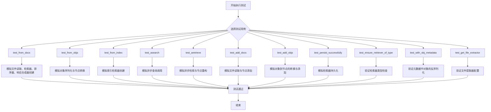

## 类结构

```
TestSimpleEngine (测试类)
├── mock_llm (fixture)
├── mock_embedding (fixture)
├── mock_simple_directory_reader (fixture)
├── mock_get_retriever (fixture)
├── mock_get_rankers (fixture)
├── mock_get_response_synthesizer (fixture)
├── mock_get_file_extractor (fixture)
├── test_from_docs (方法)
├── test_from_docs_without_file (方法)
├── test_from_objs (方法)
├── test_from_objs_with_bm25_config (方法)
├── test_from_index (方法)
├── test_asearch (方法)
├── test_aretrieve (方法)
├── test_add_docs (方法)
├── test_add_objs (方法)
├── test_persist_successfully (方法)
├── test_ensure_retriever_of_type (方法)
├── test_with_obj_metadata (方法)
└── test_get_file_extractor (方法)
```

## 全局变量及字段


### `ExampleObject.key`
    
ExampleObject实例的唯一标识符或键值。

类型：`str`
    


### `ExampleObject.value`
    
与ExampleObject实例的key关联的数据值。

类型：`str`
    
    

## 全局函数及方法

### `TestSimpleEngine.mock_llm`

这是一个Pytest fixture方法，用于在测试类`TestSimpleEngine`中创建一个`MockLLM`实例。它不接收任何参数，返回一个`MockLLM`对象，该对象是一个模拟的LLM（大语言模型），用于在单元测试中替代真实的LLM，以避免对外部服务的依赖和产生不必要的成本。

参数：
- 无

返回值：`MockLLM`，一个用于模拟LLM行为的测试替身对象。

#### 流程图

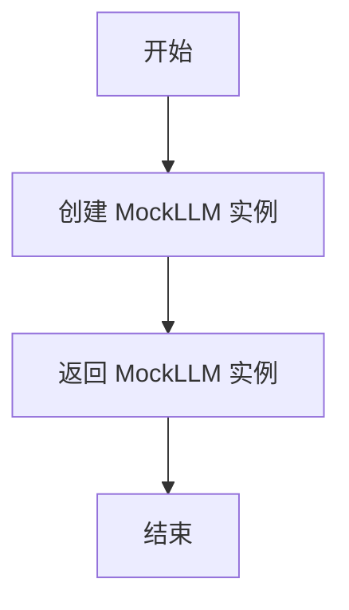

#### 带注释源码

```python
    @pytest.fixture
    # 定义一个名为 `mock_llm` 的 Pytest fixture
    def mock_llm(self):
        # 创建并返回一个 MockLLM 实例
        # 该实例在测试中用于模拟真实 LLM 的行为
        return MockLLM()
```

### `TestSimpleEngine.mock_embedding`

这是一个用于测试的pytest fixture，它创建并返回一个`MockEmbedding`实例。该实例模拟了文本嵌入模型的行为，用于在测试环境中替代真实的嵌入模型，以避免在单元测试中进行实际的网络调用或计算密集型操作。

参数：

- 无参数

返回值：`MockEmbedding`，一个模拟的嵌入模型实例，其嵌入维度被设置为1。

#### 流程图

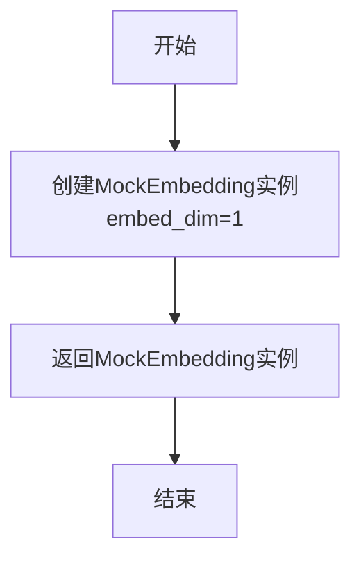

#### 带注释源码

```python
@pytest.fixture
def mock_embedding(self):
    # 创建一个MockEmbedding实例，设置其嵌入维度为1。
    # 这个fixture在测试中用于提供模拟的嵌入功能。
    return MockEmbedding(embed_dim=1)
```

### `TestSimpleEngine.mock_simple_directory_reader`

这是一个用于测试的pytest fixture，它的核心功能是模拟（mock）`SimpleDirectoryReader`类，以便在单元测试中隔离外部依赖，确保测试的独立性和可重复性。它通过`mocker.patch`方法创建了一个`SimpleDirectoryReader`的模拟对象，并返回该模拟对象，供测试方法使用。

参数：

- `mocker`：`pytest-mock`提供的`MockerFixture`类型对象，用于创建和管理模拟对象。

返回值：`unittest.mock.MagicMock`，返回一个模拟的`SimpleDirectoryReader`类对象。

#### 流程图

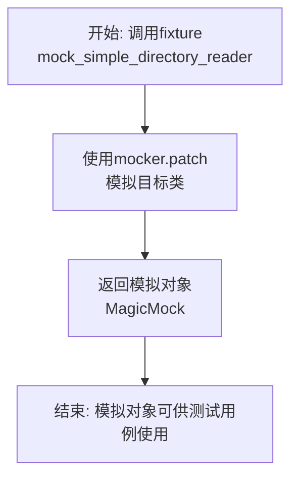

#### 带注释源码

```python
    @pytest.fixture
    # 定义一个pytest fixture，名为`mock_simple_directory_reader`
    def mock_simple_directory_reader(self, mocker):
        # 使用mocker.patch方法，模拟'metagpt.rag.engines.simple'模块中的SimpleDirectoryReader类
        # 这将在测试期间，用MagicMock对象替换实际的SimpleDirectoryReader类
        return mocker.patch("metagpt.rag.engines.simple.SimpleDirectoryReader")
```

### `TestSimpleEngine.mock_get_retriever`

这是一个用于单元测试的pytest fixture，它的主要功能是模拟（mock）`metagpt.rag.engines.simple`模块中的`get_retriever`函数。通过使用`mocker.patch`，它创建了一个模拟对象来替换实际的`get_retriever`函数，使得在测试`TestSimpleEngine`类的方法时，可以隔离并控制`get_retriever`的行为，从而专注于测试`SimpleEngine`类本身的逻辑。

参数：

- `mocker`：`pytest-mock`插件提供的`MockerFixture`对象，用于创建和管理模拟对象。

返回值：`unittest.mock.MagicMock`，一个被配置为模拟`get_retriever`函数的模拟对象。

#### 流程图

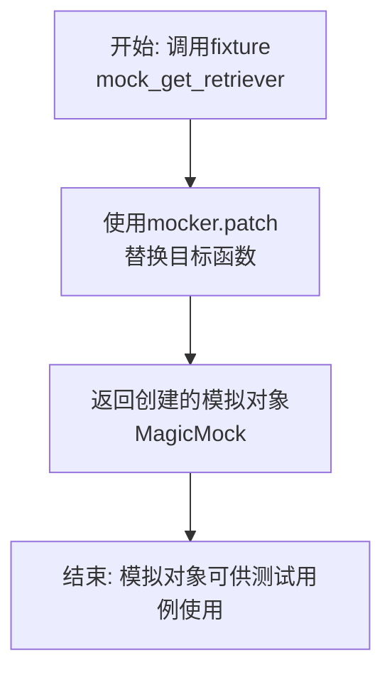

#### 带注释源码

```python
    @pytest.fixture
    # 定义一个pytest fixture，名为mock_get_retriever。
    # fixture在测试函数执行前运行，用于准备测试环境。
    def mock_get_retriever(self, mocker):
        # 使用mocker.patch方法对'metagpt.rag.engines.simple.get_retriever'进行模拟。
        # patch会临时将目标函数替换为一个MagicMock对象。
        # 这个模拟对象将在测试期间被使用，其调用和返回值可以被预设和断言。
        return mocker.patch("metagpt.rag.engines.simple.get_retriever")
```

### `TestSimpleEngine.mock_get_rankers`

这是一个用于单元测试的pytest fixture，它的主要作用是模拟（mock）`metagpt.rag.engines.simple`模块中的`get_rankers`函数。通过替换真实的`get_rankers`函数，它允许测试代码在隔离的环境中运行，无需依赖外部服务或复杂的初始化逻辑，从而专注于测试`SimpleEngine`类的行为。

参数：

- `mocker`：`pytest-mock`库提供的`MockerFixture`类型对象，用于创建和管理模拟对象。

返回值：`unittest.mock.MagicMock`，一个被配置为模拟`get_rankers`函数的MagicMock对象。

#### 流程图

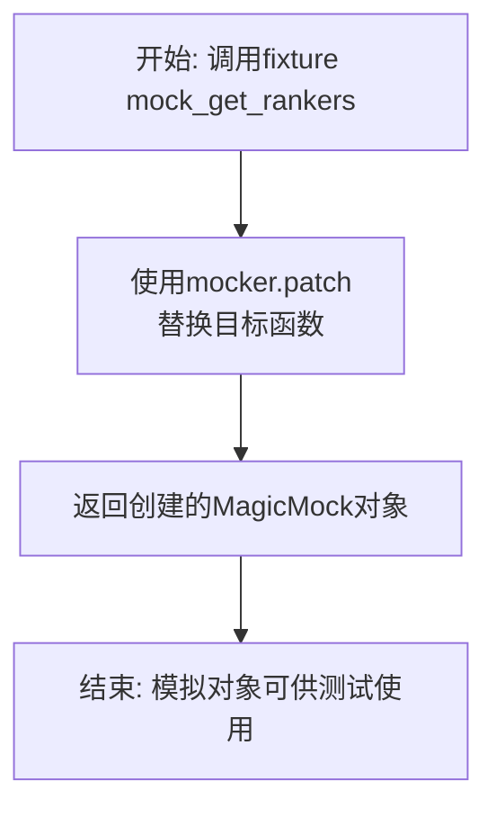

#### 带注释源码

```python
    @pytest.fixture
    # 定义一个名为`mock_get_rankers`的pytest fixture。
    def mock_get_rankers(self, mocker):
        # 使用`mocker.patch`方法替换`metagpt.rag.engines.simple`模块中的`get_rankers`函数。
        # 替换后，任何在测试中对该函数的调用都将被这个fixture返回的MagicMock对象拦截和处理。
        # 这避免了在测试`SimpleEngine`时实际执行`get_rankers`函数的逻辑。
        return mocker.patch("metagpt.rag.engines.simple.get_rankers")
```

### `TestSimpleEngine.mock_get_response_synthesizer`

这是一个用于单元测试的pytest fixture，它的核心功能是模拟（mock）`metagpt.rag.engines.simple`模块中的`get_response_synthesizer`函数。通过替换该函数，测试用例可以隔离并验证`SimpleEngine`类中与响应合成器相关的交互逻辑，而无需依赖真实的响应合成器实现。

参数：

- `mocker`：`pytest_mock.plugin.MockerFixture`，pytest-mock插件提供的mock对象，用于创建和管理模拟对象。

返回值：`unittest.mock.MagicMock`，返回一个被模拟的`get_response_synthesizer`函数对象。

#### 流程图

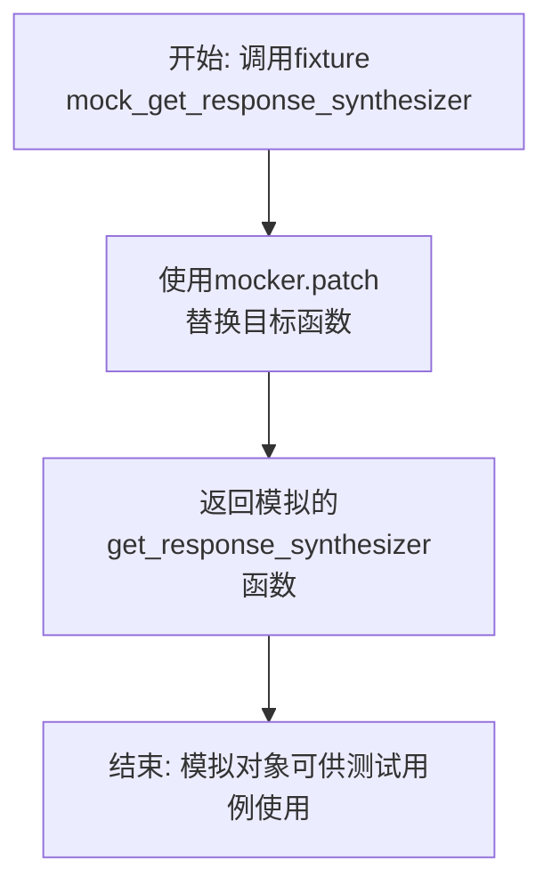

#### 带注释源码

```python
    @pytest.fixture
    # 定义一个pytest fixture，命名为`mock_get_response_synthesizer`。
    # Fixture会在测试函数执行前自动运行，其返回值（即模拟对象）会作为参数注入到测试函数中。
    def mock_get_response_synthesizer(self, mocker):
        # 使用`mocker.patch`方法对`metagpt.rag.engines.simple`模块中的`get_response_synthesizer`函数进行模拟。
        # 模拟后，在测试作用域内，任何对该函数的调用都会被拦截，并返回一个MagicMock对象。
        # 这允许测试用例控制该函数的返回值或验证其调用情况，而无需执行其真实逻辑。
        return mocker.patch("metagpt.rag.engines.simple.get_response_synthesizer")
```

### `TestSimpleEngine.mock_get_file_extractor`

这是一个用于单元测试的pytest fixture，它模拟（mock）了`SimpleEngine._get_file_extractor`方法。它的主要目的是在测试`SimpleEngine`类的其他方法（如`test_from_docs`）时，隔离并控制`_get_file_extractor`方法的返回值，从而避免测试依赖于真实的外部文件解析服务（如OmniParse），确保测试的独立性和可重复性。

参数：

- `mocker`：`pytest-mock`库提供的`MockerFixture`类型对象，用于创建和管理模拟对象。

返回值：`unittest.mock.MagicMock`，一个被配置为模拟`SimpleEngine._get_file_extractor`方法的MagicMock对象。

#### 流程图

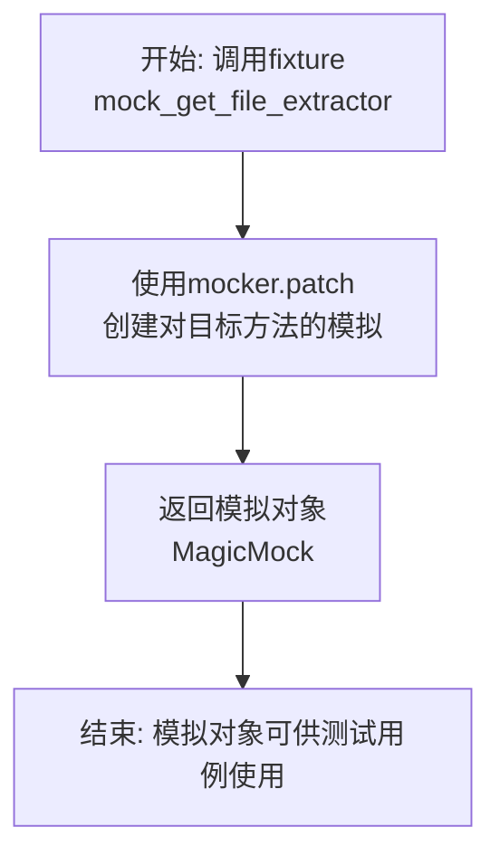

#### 带注释源码

```python
    @pytest.fixture
    # 定义一个名为`mock_get_file_extractor`的pytest fixture。
    # `mocker`参数是pytest-mock插件注入的，用于进行模拟操作。
    def mock_get_file_extractor(self, mocker):
        # 使用`mocker.patch`方法对`metagpt.rag.engines.simple.SimpleEngine._get_file_extractor`进行模拟。
        # 这意味着在测试运行期间，任何对`SimpleEngine._get_file_extractor`的调用都会被这个模拟对象拦截。
        # 模拟对象（一个MagicMock实例）会被返回，并可以在测试函数中通过参数注入来使用。
        return mocker.patch("metagpt.rag.engines.simple.SimpleEngine._get_file_extractor")
```

### `TestSimpleEngine.test_from_docs`

该方法是一个单元测试，用于验证 `SimpleEngine.from_docs` 类方法的正确性。它通过模拟（Mock）所有外部依赖，确保在给定输入参数时，`from_docs` 方法能够正确调用内部组件并返回一个 `SimpleEngine` 实例。

参数：

- `self`：`TestSimpleEngine`，测试类实例自身
- `mocker`：`MockerFixture`，pytest-mock 提供的模拟对象，用于创建和管理测试替身
- `mock_simple_directory_reader`：`MagicMock`，模拟的 `SimpleDirectoryReader` 类，用于加载文档
- `mock_get_retriever`：`MagicMock`，模拟的 `get_retriever` 函数，用于创建检索器
- `mock_get_rankers`：`MagicMock`，模拟的 `get_rankers` 函数，用于创建排序器
- `mock_get_response_synthesizer`：`MagicMock`，模拟的 `get_response_synthesizer` 函数，用于创建响应合成器
- `mock_get_file_extractor`：`MagicMock`，模拟的 `SimpleEngine._get_file_extractor` 方法，用于获取文件提取器

返回值：`None`，这是一个测试方法，不返回任何值，其目的是通过断言（assert）来验证代码行为。

#### 流程图

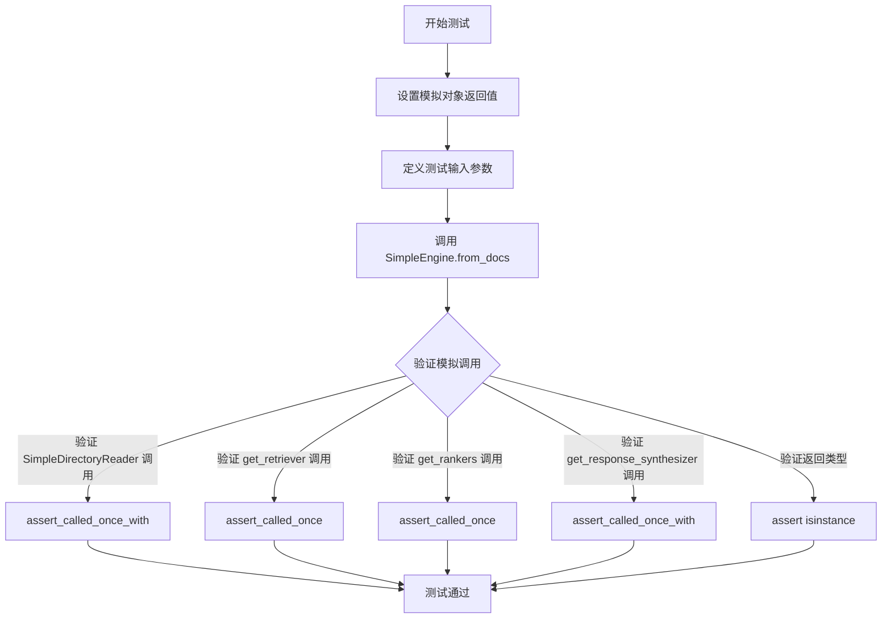

#### 带注释源码

```python
def test_from_docs(
    self,
    mocker, # 用于创建模拟对象的pytest-mock fixture
    mock_simple_directory_reader, # 模拟的SimpleDirectoryReader，用于加载文档
    mock_get_retriever, # 模拟的get_retriever函数，用于创建检索器
    mock_get_rankers, # 模拟的get_rankers函数，用于创建排序器
    mock_get_response_synthesizer, # 模拟的get_response_synthesizer函数，用于创建响应合成器
    mock_get_file_extractor, # 模拟的_get_file_extractor方法，用于获取文件提取器
):
    # Mock
    # 设置模拟对象的行为：当load_data被调用时，返回两个模拟的Document对象
    mock_simple_directory_reader.return_value.load_data.return_value = [
        Document(text="document1"),
        Document(text="document2"),
    ]
    # 将其他关键函数模拟为MagicMock对象
    mock_get_retriever.return_value = mocker.MagicMock()
    mock_get_rankers.return_value = [mocker.MagicMock()]
    mock_get_response_synthesizer.return_value = mocker.MagicMock()
    file_extractor = mocker.MagicMock()
    mock_get_file_extractor.return_value = file_extractor

    # Setup
    # 定义测试用的输入参数
    input_dir = "test_dir"
    input_files = ["test_file1", "test_file2"]
    transformations = [mocker.MagicMock()]
    embed_model = mocker.MagicMock()
    llm = mocker.MagicMock()
    retriever_configs = [mocker.MagicMock()]
    ranker_configs = [mocker.MagicMock()]

    # Exec
    # 执行待测试的方法：SimpleEngine.from_docs
    engine = SimpleEngine.from_docs(
        input_dir=input_dir,
        input_files=input_files,
        transformations=transformations,
        embed_model=embed_model,
        llm=llm,
        retriever_configs=retriever_configs,
        ranker_configs=ranker_configs,
    )

    # Assert
    # 验证SimpleDirectoryReader是否以正确的参数被调用了一次
    mock_simple_directory_reader.assert_called_once_with(
        input_dir=input_dir, input_files=input_files, file_extractor=file_extractor, fs=None
    )
    # 验证get_retriever是否被调用了一次
    mock_get_retriever.assert_called_once()
    # 验证get_rankers是否被调用了一次
    mock_get_rankers.assert_called_once()
    # 验证get_response_synthesizer是否以正确的参数被调用了一次
    mock_get_response_synthesizer.assert_called_once_with(llm=llm)
    # 验证返回的对象是否是SimpleEngine的实例
    assert isinstance(engine, SimpleEngine)
```

### `TestSimpleEngine.test_from_docs_without_file`

该方法是一个单元测试，用于验证 `SimpleEngine.from_docs` 类方法在未提供任何必需参数（如 `input_dir` 或 `input_files`）时，是否会正确地抛出 `ValueError` 异常。它测试了工厂方法在缺少必要输入时的边界情况和错误处理逻辑。

参数：
-  `self`：`TestSimpleEngine`，测试类实例的引用。

返回值：`None`，该测试方法不返回任何值，其成功与否由 `pytest.raises` 上下文管理器断言。

#### 流程图

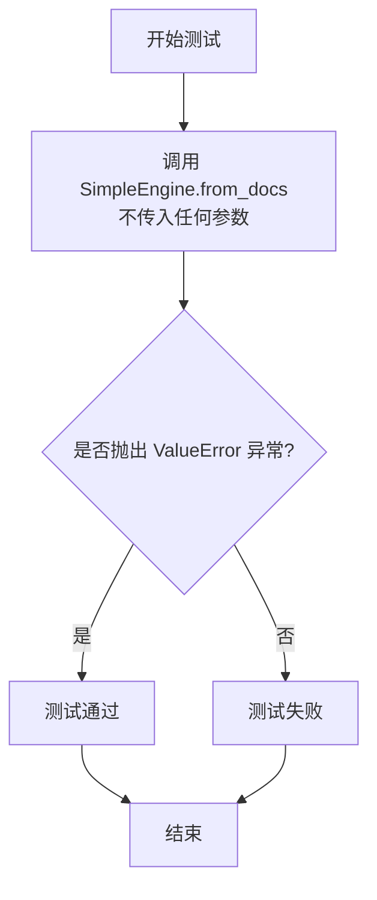

#### 带注释源码

```python
def test_from_docs_without_file(self):
    # 使用 pytest.raises 上下文管理器来断言，当调用 SimpleEngine.from_docs() 且不传入任何参数时，
    # 应该抛出一个 ValueError 异常。这是为了测试工厂方法在缺少必要输入（如 input_dir 或 input_files）时的错误处理。
    with pytest.raises(ValueError):
        SimpleEngine.from_docs()
```

### `TestSimpleEngine.test_from_objs`

该方法用于测试 `SimpleEngine.from_objs` 工厂方法的功能。它模拟传入一组符合特定接口（具有 `rag_key` 和 `model_dump_json` 方法）的对象，并使用模拟的 LLM 和嵌入模型来创建一个 `SimpleEngine` 实例。测试验证了引擎能够被成功创建，并且其内部的转换器（`_transformations`）不为空。

参数：

- `self`：`TestSimpleEngine`，测试类实例的引用。
- `mock_llm`：`MockLLM`，一个模拟的 LLM 对象，用于测试。
- `mock_embedding`：`MockEmbedding`，一个模拟的嵌入模型对象，用于测试。

返回值：`None`，这是一个单元测试方法，不返回任何值，其目的是通过断言来验证代码行为。

#### 流程图

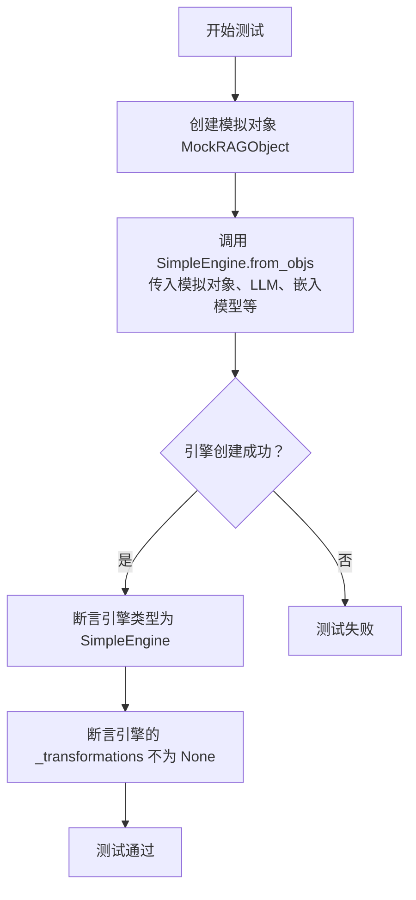

#### 带注释源码

```python
def test_from_objs(self, mock_llm, mock_embedding):
    # Mock
    # 定义一个模拟的 RAG 对象类，它必须包含 `rag_key` 和 `model_dump_json` 方法，
    # 这是 `SimpleEngine.from_objs` 方法对输入对象的要求。
    class MockRAGObject:
        def rag_key(self):
            return "key"

        def model_dump_json(self):
            return "{}"

    # 创建一个包含模拟对象的列表，作为测试输入。
    objs = [MockRAGObject()]

    # Setup
    # 初始化空的检索器和排序器配置列表。
    retriever_configs = []
    ranker_configs = []

    # Exec
    # 调用被测试的工厂方法 `SimpleEngine.from_objs`。
    # 传入模拟的对象列表、LLM、嵌入模型以及空的配置。
    engine = SimpleEngine.from_objs(
        objs=objs,
        llm=mock_llm,
        embed_model=mock_embedding,
        retriever_configs=retriever_configs,
        ranker_configs=ranker_configs,
    )

    # Assert
    # 验证返回的引擎是 `SimpleEngine` 类型。
    assert isinstance(engine, SimpleEngine)
    # 验证引擎内部的 `_transformations` 属性已被正确初始化（不为 None）。
    assert engine._transformations is not None
```

### `TestSimpleEngine.test_from_objs_with_bm25_config`

这是一个单元测试方法，用于测试 `SimpleEngine.from_objs` 静态工厂方法在传入 `BM25RetrieverConfig` 配置时，是否能正确地抛出 `ValueError` 异常。该测试验证了当 `objs` 参数为空列表时，使用基于文本的 BM25 检索器配置会引发错误，因为 BM25 需要文本内容来构建索引。

参数：

-  `self`：`TestSimpleEngine`，测试类实例的引用。
-  无其他显式参数。

返回值：`None`，测试方法通常不返回值，其成功与否由断言或异常触发决定。

#### 流程图

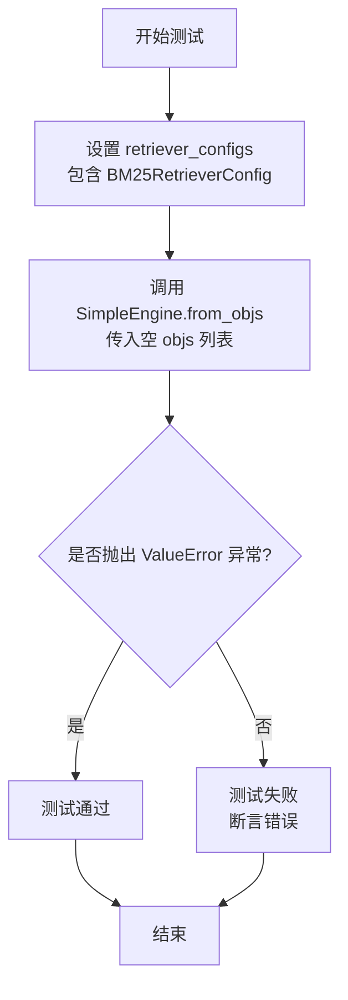

#### 带注释源码

```python
def test_from_objs_with_bm25_config(self):
    # Setup
    # 准备测试数据：创建一个包含 BM25RetrieverConfig 的检索器配置列表。
    # BM25RetrieverConfig 通常用于配置基于文本相似度（BM25算法）的检索器。
    retriever_configs = [BM25RetrieverConfig()]

    # Exec & Assert
    # 使用 pytest.raises 上下文管理器来断言接下来的代码块会抛出 ValueError 异常。
    # 这是测试的核心：验证当 objs 为空列表时，使用 BM25 配置会因无法构建索引而报错。
    with pytest.raises(ValueError):
        # 调用被测试的静态方法 SimpleEngine.from_objs。
        # 传入一个空列表作为 objs 参数，模拟没有提供任何可索引对象的情况。
        # 同时传入 MockLLM 作为 llm，空列表作为 ranker_configs。
        SimpleEngine.from_objs(
            objs=[], # 关键：空对象列表，BM25 无法从空数据创建索引。
            llm=MockLLM(), # 使用模拟的 LLM，避免依赖真实模型。
            retriever_configs=retriever_configs, # 传入包含 BM25 配置的列表。
            ranker_configs=[], # 不配置排序器。
        )
```

### `TestSimpleEngine.test_from_index`

该方法用于测试 `SimpleEngine.from_index` 类方法的功能，验证其能否根据给定的索引配置、嵌入模型和语言模型成功创建一个 `SimpleEngine` 实例，并正确设置其内部的检索器。

参数：

- `mocker`：`pytest-mock` 提供的 `MockerFixture` 类型，用于创建和管理测试中的模拟对象。
- `mock_llm`：`MockLLM` 类型，一个模拟的语言模型，作为 `from_index` 方法的 `llm` 参数。
- `mock_embedding`：`MockEmbedding` 类型，一个模拟的嵌入模型，作为 `from_index` 方法的 `embed_model` 参数。

返回值：`None`，这是一个单元测试方法，不返回业务值，其成功执行即表示断言通过。

#### 流程图

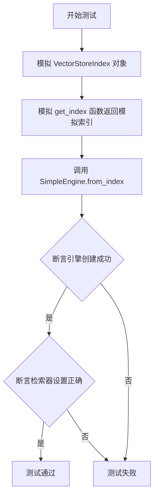

#### 带注释源码

```python
def test_from_index(self, mocker, mock_llm, mock_embedding):
    # Mock
    # 1. 创建一个模拟的 VectorStoreIndex 对象，并设置其 as_retriever 方法返回一个固定的字符串 "retriever"
    mock_index = mocker.MagicMock(spec=VectorStoreIndex)
    mock_index.as_retriever.return_value = "retriever"
    # 2. 模拟（patch）`metagpt.rag.engines.simple` 模块中的 `get_index` 函数，
    #    使其在测试中直接返回上面创建的模拟索引 `mock_index`，而不是执行真实逻辑。
    mock_get_index = mocker.patch("metagpt.rag.engines.simple.get_index")
    mock_get_index.return_value = mock_index

    # Exec
    # 调用被测试的类方法 `SimpleEngine.from_index`，传入模拟的索引配置、嵌入模型和语言模型。
    engine = SimpleEngine.from_index(
        index_config=mock_index,
        embed_model=mock_embedding,
        llm=mock_llm,
    )

    # Assert
    # 1. 断言返回的对象是 SimpleEngine 类型，证明引擎创建成功。
    assert isinstance(engine, SimpleEngine)
    # 2. 断言引擎内部的 `_retriever` 属性被正确设置为模拟索引 `as_retriever` 方法的返回值 "retriever"。
    assert engine._retriever == "retriever"
```

### `TestSimpleEngine.test_asearch`

这是一个异步单元测试方法，用于验证 `SimpleEngine` 类的 `asearch` 方法是否能够正确调用其内部的 `aquery` 方法并返回预期的结果。

参数：
- `self`：`TestSimpleEngine`，测试类实例的引用。
- `mocker`：`pytest-mock` 提供的 `MockerFixture` 对象，用于创建和管理测试中的模拟对象。

返回值：`None`，此测试方法不返回任何值，其目的是通过断言来验证代码行为。

#### 流程图

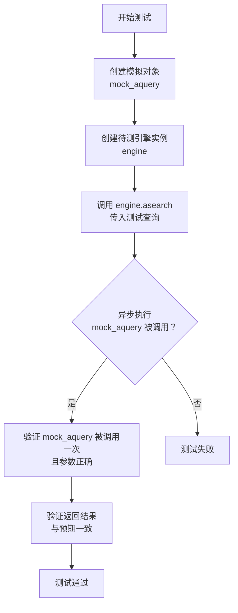

#### 带注释源码

```python
    @pytest.mark.asyncio  # 标记此测试为异步测试，需要异步执行环境
    async def test_asearch(self, mocker):  # 定义异步测试方法，接收 mocker 参数用于模拟
        # Mock  # 注释：开始模拟部分
        test_query = "test query"  # 定义一个测试用的查询字符串
        expected_result = "expected result"  # 定义期望的查询结果
        mock_aquery = mocker.AsyncMock(return_value=expected_result)  # 创建一个异步模拟对象，模拟 `aquery` 方法，并预设其返回值为 `expected_result`

        # Setup  # 注释：开始测试设置部分
        engine = SimpleEngine(retriever=mocker.MagicMock())  # 创建一个 `SimpleEngine` 实例，其 `retriever` 属性用一个通用的 `MagicMock` 对象填充
        engine.aquery = mock_aquery  # 将引擎实例的 `aquery` 方法替换为我们创建的异步模拟对象 `mock_aquery`

        # Exec  # 注释：开始执行测试操作部分
        result = await engine.asearch(test_query)  # 异步调用待测试的 `asearch` 方法，传入测试查询，并等待其返回结果

        # Assert  # 注释：开始断言验证部分
        mock_aquery.assert_called_once_with(test_query)  # 断言模拟的 `aquery` 方法被调用了一次，并且调用时的参数是 `test_query`
        assert result == expected_result  # 断言 `asearch` 方法返回的结果等于我们预设的 `expected_result`
```

### `TestSimpleEngine.test_aretrieve`

这是一个针对 `SimpleEngine` 类中 `aretrieve` 异步方法的单元测试。该测试验证了当调用 `SimpleEngine.aretrieve` 方法时，它会正确地将查询字符串转换为 `QueryBundle`，调用父类的 `aretrieve` 方法，并返回处理后的节点列表。

参数：

-  `mocker`：`pytest-mock` 提供的 `MockerFixture` 类型，用于创建和管理测试中的模拟对象。

返回值：`None`，这是一个测试方法，不返回任何值。

#### 流程图

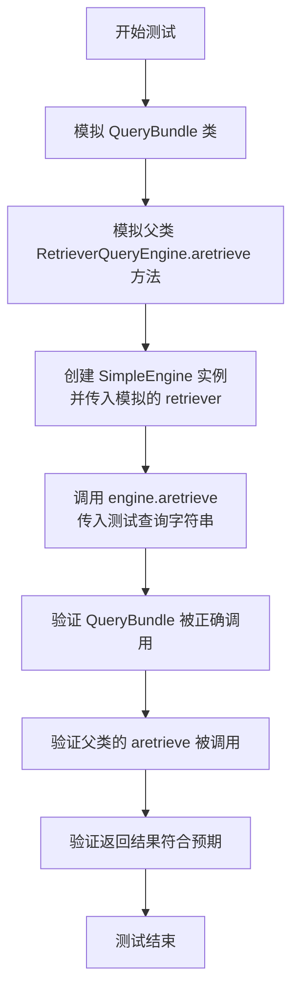

#### 带注释源码

```python
    @pytest.mark.asyncio  # 标记此测试为异步测试，需要异步执行环境
    async def test_aretrieve(self, mocker):  # 定义异步测试方法，接收 mocker 夹具用于模拟
        # Mock  # 开始模拟部分
        # 模拟 `metagpt.rag.engines.simple` 模块中的 `QueryBundle` 类
        # 使其在被调用时返回字符串 "query_bundle"
        mock_query_bundle = mocker.patch("metagpt.rag.engines.simple.QueryBundle", return_value="query_bundle")
        # 模拟 `SimpleEngine` 父类 `RetrieverQueryEngine` 的 `aretrieve` 异步方法
        # 使用 `new_callable=mocker.AsyncMock` 确保返回一个异步模拟对象
        # 设置其返回值为一个包含 `TextNode` 的列表
        mock_super_aretrieve = mocker.patch(
            "metagpt.rag.engines.simple.RetrieverQueryEngine.aretrieve", new_callable=mocker.AsyncMock
        )
        mock_super_aretrieve.return_value = [TextNode(text="node_with_score", metadata={"is_obj": False})]

        # Setup  # 测试准备阶段
        # 创建一个 `SimpleEngine` 实例，其 `retriever` 参数使用一个通用的模拟对象
        engine = SimpleEngine(retriever=mocker.MagicMock())
        # 定义测试用的查询字符串
        test_query = "test query"

        # Exec  # 执行被测试的方法
        # 异步调用 `SimpleEngine` 实例的 `aretrieve` 方法
        result = await engine.aretrieve(test_query)

        # Assert  # 断言验证阶段
        # 验证 `QueryBundle` 被调用了一次，并且参数是测试查询字符串
        mock_query_bundle.assert_called_once_with(test_query)
        # 验证父类的 `aretrieve` 方法被调用了一次，并且参数是模拟 `QueryBundle` 返回的 "query_bundle"
        mock_super_aretrieve.assert_called_once_with("query_bundle")
        # 验证返回结果列表的第一个元素的 `text` 属性等于预期的 "node_with_score"
        assert result[0].text == "node_with_score"
```

### `TestSimpleEngine.test_add_docs`

该方法用于测试 `SimpleEngine` 类的 `add_docs` 方法。它模拟了从指定文件加载文档、通过转换器处理文档生成节点，并将这些节点添加到检索器中的过程，以验证 `add_docs` 方法的功能正确性。

参数：

-  `mocker`：`pytest_mock.plugin.MockerFixture`，pytest-mock 插件提供的模拟对象，用于创建和管理测试中的模拟对象。

返回值：`None`，测试方法不返回任何值，仅通过断言验证行为。

#### 流程图

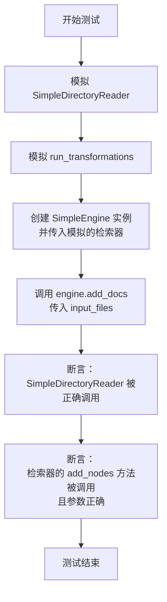

#### 带注释源码

```python
def test_add_docs(self, mocker):
    # Mock
    # 1. 模拟 SimpleDirectoryReader 类及其 load_data 方法，使其返回预设的 Document 列表。
    mock_simple_directory_reader = mocker.patch("metagpt.rag.engines.simple.SimpleDirectoryReader")
    mock_simple_directory_reader.return_value.load_data.return_value = [
        Document(text="document1"),
        Document(text="document2"),
    ]

    # 2. 创建一个符合 ModifiableRAGRetriever 接口的模拟检索器对象。
    mock_retriever = mocker.MagicMock(spec=ModifiableRAGRetriever)

    # 3. 模拟 run_transformations 函数，使其返回预设的节点列表。
    mock_run_transformations = mocker.patch("metagpt.rag.engines.simple.run_transformations")
    mock_run_transformations.return_value = ["node1", "node2"]

    # Setup
    # 4. 使用模拟的检索器创建一个 SimpleEngine 实例。
    engine = SimpleEngine(retriever=mock_retriever)
    # 5. 定义要添加的测试文件列表。
    input_files = ["test_file1", "test_file2"]

    # Exec
    # 6. 执行待测试的 add_docs 方法。
    engine.add_docs(input_files=input_files)

    # Assert
    # 7. 断言 SimpleDirectoryReader 被调用了一次，且参数为 input_files。
    mock_simple_directory_reader.assert_called_once_with(input_files=input_files)
    # 8. 断言检索器的 add_nodes 方法被调用了一次，且参数是 run_transformations 返回的节点列表。
    mock_retriever.add_nodes.assert_called_once_with(["node1", "node2"])
```

### `TestSimpleEngine.test_add_objs`

该方法用于测试 `SimpleEngine` 类的 `add_objs` 方法。它验证了当向引擎添加一组对象时，这些对象会被正确地转换为 `TextNode` 节点，并添加了特定的元数据标记（`is_obj`），然后通过检索器的 `add_nodes` 方法添加到系统中。

参数：

- `mocker`：`pytest-mock` 提供的 `MockerFixture` 类型，用于创建和管理测试中的模拟对象。

返回值：`None`，这是一个单元测试方法，不返回任何值，其目的是通过断言来验证代码行为。

#### 流程图

```mermaid
flowchart TD
    A[开始测试 test_add_objs] --> B[模拟一个 ModifiableRAGRetriever 对象]
    B --> C[创建 SimpleEngine 实例<br>并传入模拟的检索器]
    C --> D[创建两个自定义的 TextNode 对象作为测试数据]
    D --> E[调用 engine.add_objs(objs) 方法]
    E --> F[在 add_objs 内部<br>遍历每个对象]
    F --> G[将对象转换为 TextNode<br>并添加 is_obj 元数据]
    G --> H[调用模拟检索器的 add_nodes 方法]
    H --> I[断言 add_nodes 被调用了一次]
    I --> J[断言传入的每个节点都是 TextNode 类型]
    J --> K[断言每个节点都包含 is_obj 元数据]
    K --> L[测试结束]
```

#### 带注释源码

```python
def test_add_objs(self, mocker):
    # Mock
    # 1. 模拟一个 ModifiableRAGRetriever 对象。
    #    这是为了隔离测试，确保测试不依赖于真实的检索器实现。
    mock_retriever = mocker.MagicMock(spec=ModifiableRAGRetriever)

    # Setup
    # 2. 定义一个内部类 CustomTextNode，它继承自 TextNode 并添加了 RAG 对象所需的方法。
    #    这模拟了可以被 `add_objs` 方法处理的对象类型。
    class CustomTextNode(TextNode):
        def rag_key(self):
            return ""

        def model_dump_json(self):
            return ""

    # 3. 创建两个 CustomTextNode 实例作为测试输入数据。
    objs = [CustomTextNode(text=f"text_{i}", metadata={"obj": f"obj_{i}"}) for i in range(2)]
    # 4. 使用模拟的检索器实例化一个 SimpleEngine 对象。
    engine = SimpleEngine(retriever=mock_retriever)

    # Exec
    # 5. 执行被测试的方法：向引擎添加对象。
    engine.add_objs(objs=objs)

    # Assert
    # 6. 验证检索器的 `add_nodes` 方法被调用了一次。
    assert mock_retriever.add_nodes.call_count == 1
    # 7. 遍历 `add_nodes` 调用时传入的第一个参数（节点列表）。
    for node in mock_retriever.add_nodes.call_args[0][0]:
        # 8. 断言每个节点都是 TextNode 类型。
        assert isinstance(node, TextNode)
        # 9. 断言每个节点的元数据中都包含 `is_obj` 键。
        #    这表明 `add_objs` 方法成功地将普通对象标记为 RAG 对象节点。
        assert "is_obj" in node.metadata
```

### `TestSimpleEngine.test_persist_successfully`

该方法是一个单元测试，用于验证 `SimpleEngine` 类的 `persist` 方法在给定一个支持持久化的检索器（`PersistableRAGRetriever`）时，能够成功调用其 `persist` 方法，而不会抛出任何异常。

参数：

-  `mocker`：`pytest-mock` 提供的 `MockerFixture` 类型，用于创建和管理测试中的模拟对象。

返回值：`None`，该方法是一个测试函数，不返回任何值，其成功执行（即不抛出异常）即表示测试通过。

#### 流程图

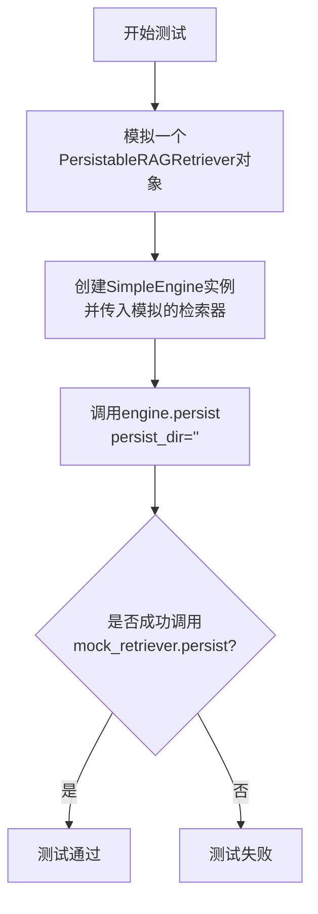

#### 带注释源码

```python
def test_persist_successfully(self, mocker):
    # Mock
    # 1. 创建一个模拟的 PersistableRAGRetriever 对象。
    #    该对象具有 `persist` 方法，这是测试成功的关键。
    mock_retriever = mocker.MagicMock(spec=PersistableRAGRetriever)
    # 2. 将模拟检索器的 `persist` 方法也设置为一个模拟对象，
    #    以便后续验证它是否被调用。
    mock_retriever.persist.return_value = mocker.MagicMock()

    # Setup
    # 3. 使用模拟的检索器创建一个 SimpleEngine 实例。
    #    这是被测试的对象。
    engine = SimpleEngine(retriever=mock_retriever)

    # Exec
    # 4. 调用被测试的 `persist` 方法。
    #    传入一个空字符串作为持久化目录路径。
    #    如果 `engine.retriever` 确实是 `PersistableRAGRetriever` 类型，
    #    此调用应成功执行。
    engine.persist(persist_dir="")
    # 5. 测试的“断言”是隐式的：如果上面的调用没有抛出 `TypeError` 或其他异常，
    #    则测试通过。`pytest` 框架会捕获任何未处理的异常并标记测试为失败。
```

### `TestSimpleEngine.test_ensure_retriever_of_type`

该方法用于测试 `SimpleEngine` 类的 `_ensure_retriever_of_type` 私有方法。该私有方法的核心功能是验证 `SimpleEngine` 实例内部的 `_retriever` 对象或其内部的检索器列表是否实现了指定的接口（如 `ModifiableRAGRetriever` 或 `PersistableRAGRetriever`）。如果验证失败，则抛出 `TypeError` 异常。本测试用例通过模拟不同的检索器配置，验证了该方法在符合条件时能正常执行，以及在不符合条件时能正确抛出异常的逻辑。

参数：

-  `mocker`：`pytest_mock.plugin.MockerFixture`，pytest-mock 插件提供的模拟对象，用于创建和管理测试中的模拟对象（Mock）。

返回值：`None`，这是一个单元测试方法，不返回任何值，其目的是通过断言来验证代码行为。

#### 流程图

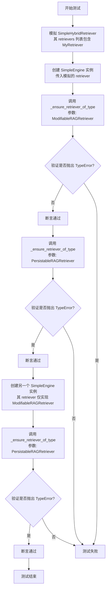

#### 带注释源码

```python
def test_ensure_retriever_of_type(self, mocker):
    # Mock
    # 定义一个简单的自定义检索器类 MyRetriever，它只包含一个 add_nodes 方法。
    class MyRetriever:
        def add_nodes(self):
            ...

    # 使用 mocker 创建一个模拟对象，其规格（spec）为 SimpleHybridRetriever。
    # 这确保了模拟对象具有 SimpleHybridRetriever 的接口。
    mock_retriever = mocker.MagicMock(spec=SimpleHybridRetriever)
    # 设置模拟对象的 `retrievers` 属性为一个列表，其中包含一个 MyRetriever 的实例。
    # 这模拟了一个混合检索器内部包含多个子检索器的情况。
    mock_retriever.retrievers = [MyRetriever()]

    # Setup
    # 使用上面模拟的 `mock_retriever` 创建一个 SimpleEngine 实例。
    # 这是被测试的 `_ensure_retriever_of_type` 方法所属的上下文。
    engine = SimpleEngine(retriever=mock_retriever)

    # Assert
    # 测试场景1：验证当要求检查 ModifiableRAGRetriever 接口时，方法能正常通过。
    # 因为 MyRetriever 实现了 `add_nodes` 方法，这符合 ModifiableRAGRetriever 接口的要求。
    engine._ensure_retriever_of_type(ModifiableRAGRetriever)

    # 测试场景2：验证当要求检查 PersistableRAGRetriever 接口时，方法会抛出 TypeError。
    # 因为 MyRetriever 没有实现 `persist` 方法，不符合 PersistableRAGRetriever 接口的要求。
    with pytest.raises(TypeError):
        engine._ensure_retriever_of_type(PersistableRAGRetriever)

    # 测试场景3：创建一个新的 SimpleEngine 实例，其检索器仅实现 ModifiableRAGRetriever。
    # 然后验证当要求检查 PersistableRAGRetriever 接口时，方法同样会抛出 TypeError。
    # 这测试了当 `_retriever` 本身不是混合检索器（即没有 `retrievers` 列表）时的逻辑分支。
    with pytest.raises(TypeError):
        other_engine = SimpleEngine(retriever=mocker.MagicMock(spec=ModifiableRAGRetriever))
        other_engine._ensure_retriever_of_type(PersistableRAGRetriever)
```

### `TestSimpleEngine.test_with_obj_metadata`

该方法是一个单元测试，用于验证 `SimpleEngine._try_reconstruct_obj` 方法的功能。它模拟了一个包含对象元数据的 `NodeWithScore`，测试该方法能否正确地从元数据中反序列化并重建出原始的 Python 对象，并将其存回节点的元数据中。

参数：
-  `self`：`TestSimpleEngine`，测试类实例的引用。
-  `mocker`：`pytest-mock` 提供的 `MockerFixture` 对象，用于创建和管理测试中的模拟对象。

返回值：`None`，这是一个测试方法，不返回业务值，其目的是通过断言来验证功能。

#### 流程图

```mermaid
flowchart TD
    A[开始测试] --> B[创建模拟的 NodeWithScore<br>包含 ObjectNode 和对象元数据]
    B --> C[模拟 import_class 函数<br>返回目标类 ExampleObject]
    C --> D[调用被测方法<br>SimpleEngine._try_reconstruct_obj]
    D --> E{方法内部逻辑}
    E --> F[从元数据中提取类信息<br>（obj_cls_name, obj_mod_name）]
    F --> G[动态导入目标类]
    G --> H[从元数据中提取 JSON 字符串<br>（obj_json）]
    H --> I[将 JSON 反序列化为字典]
    I --> J[使用字典实例化目标类对象]
    J --> K[将实例化对象存入<br>node.node.metadata['obj']]
    K --> L[断言验证<br>重建的对象与预期一致]
    L --> M[测试结束]
```

#### 带注释源码

```python
def test_with_obj_metadata(self, mocker):
    # Mock
    # 1. 创建一个模拟的 NodeWithScore 对象。
    #    其内部的 node 是一个 ObjectNode，包含了重建对象所需的所有元数据。
    node = NodeWithScore(
        node=ObjectNode(
            text="example",
            metadata={
                "is_obj": True, # 标记此节点源自一个对象
                "obj_cls_name": "ExampleObject", # 对象类的名称
                "obj_mod_name": "__main__", # 对象类所在的模块
                "obj_json": json.dumps({"key": "test_key", "value": "test_value"}), # 对象的 JSON 序列化数据
            },
        )
    )

    # 2. 定义测试中期望被重建的目标类 ExampleObject。
    class ExampleObject:
        def __init__(self, key, value):
            self.key = key
            self.value = value

        def __eq__(self, other):
            # 定义相等性判断，用于后续的断言比较
            return self.key == other.key and self.value == other.value

    # 3. 模拟 `import_class` 函数，使其返回我们定义的 ExampleObject 类。
    #    这样，当 `_try_reconstruct_obj` 尝试动态导入类时，会得到我们的模拟类。
    mock_import_class = mocker.patch("metagpt.rag.engines.simple.import_class")
    mock_import_class.return_value = ExampleObject

    # Setup & Exec
    # 4. 调用被测试的静态方法 `_try_reconstruct_obj`。
    #    该方法会处理传入的节点列表，尝试重建其中的对象。
    SimpleEngine._try_reconstruct_obj([node])

    # 5. 创建我们期望重建出来的对象实例，用于后续断言。
    expected_obj = ExampleObject(key="test_key", value="test_value")

    # Assert
    # 6. 断言：验证节点的元数据中是否成功添加了 `'obj'` 键。
    assert "obj" in node.node.metadata
    # 7. 断言：验证重建出来的对象（`node.node.metadata['obj']`）是否与我们期望的对象 `expected_obj` 相等。
    #    由于 ExampleObject 定义了 `__eq__` 方法，这里会进行值比较。
    assert node.node.metadata["obj"] == expected_obj
```

### `TestSimpleEngine.test_get_file_extractor`

该方法是一个单元测试，用于验证`SimpleEngine._get_file_extractor`静态方法的功能。它测试了在两种配置场景下（OmniParse服务未配置和已配置），该方法是否能正确返回预期的文件提取器字典。

参数：
-  `mocker`：`pytest-mock`提供的`MockerFixture`类型，用于创建和管理测试中的模拟对象。

返回值：`None`，单元测试方法通常不返回值，而是通过断言来验证行为。

#### 流程图

```mermaid
flowchart TD
    A[开始测试] --> B{模拟配置: omniparse.base_url 为空?}
    B -- 是 --> C[调用 SimpleEngine._get_file_extractor]
    C --> D[断言返回值为空字典 {}]
    B -- 否 --> E[模拟配置: omniparse.base_url 为有效URL]
    E --> F[调用 SimpleEngine._get_file_extractor]
    F --> G[断言返回值包含 '.pdf' 键]
    G --> H[断言 '.pdf' 对应的值为 OmniParse 实例]
    D --> I[测试结束]
    H --> I
```

#### 带注释源码

```python
def test_get_file_extractor(self, mocker):
    # mock no omniparse config
    # 模拟配置对象，并设置其base_url属性为空字符串，表示OmniParse服务未配置。
    mock_omniparse_config = mocker.patch("metagpt.rag.engines.simple.config.omniparse", autospec=True)
    mock_omniparse_config.base_url = ""

    # 调用被测试的静态方法。
    file_extractor = SimpleEngine._get_file_extractor()
    # 断言：当服务未配置时，返回一个空字典。
    assert file_extractor == {}

    # mock have omniparse config
    # 重新模拟配置对象，设置其base_url为一个有效的URL，表示OmniParse服务已配置。
    mock_omniparse_config.base_url = "http://localhost:8000"
    # 再次调用被测试的静态方法。
    file_extractor = SimpleEngine._get_file_extractor()
    # 断言：返回的字典中包含 '.pdf' 作为键。
    assert ".pdf" in file_extractor
    # 断言：'.pdf' 键对应的值是一个 OmniParse 类的实例。
    assert isinstance(file_extractor[".pdf"], OmniParse)
```

### `MockRAGObject.rag_key`

该方法用于获取RAG对象的唯一标识键，用于在检索增强生成（RAG）系统中唯一标识和检索对象。

参数：
- `self`：`MockRAGObject`，当前MockRAGObject实例

返回值：`str`，返回对象的唯一标识字符串

#### 流程图

```mermaid
flowchart TD
    A[开始] --> B[调用rag_key方法]
    B --> C[返回固定字符串'key']
    C --> D[结束]
```

#### 带注释源码

```python
def rag_key(self):
    # 返回固定的标识键"key"
    # 在实际应用中，这里可能会返回对象的某个唯一属性值
    return "key"
```

### `MockRAGObject.model_dump_json`

该方法用于将`MockRAGObject`实例序列化为JSON格式的字符串。在测试中，它被用作一个模拟对象的方法，以模拟真实RAG对象序列化的行为。

参数：
- `self`：`MockRAGObject`，`MockRAGObject`类的实例

返回值：`str`，返回一个固定的JSON字符串`"{}"`，表示一个空的JSON对象。

#### 流程图

```mermaid
flowchart TD
    A[开始] --> B[调用 model_dump_json 方法]
    B --> C[返回字符串 "{}"]
    C --> D[结束]
```

#### 带注释源码

```python
def model_dump_json(self):
    # 该方法返回一个固定的JSON字符串 "{}"
    # 用于在测试中模拟真实对象的序列化行为
    return "{}"
```

### `CustomTextNode.rag_key`

该方法用于返回自定义文本节点的RAG键值，通常用于在检索增强生成（RAG）系统中唯一标识或索引该节点。

参数：
- `self`：`CustomTextNode`，当前自定义文本节点实例

返回值：`str`，返回一个字符串，代表该节点的RAG键值

#### 流程图

```mermaid
flowchart TD
    A[开始] --> B[调用 rag_key 方法]
    B --> C[返回空字符串]
    C --> D[结束]
```

#### 带注释源码

```python
def rag_key(self):
    # 返回一个空字符串作为RAG键值
    # 在实际应用中，这里可能会返回节点的唯一标识符或其他关键信息
    return ""
```

### `CustomTextNode.model_dump_json`

该方法用于将 `CustomTextNode` 对象序列化为 JSON 字符串。它继承自 `TextNode` 类，并重写了 `model_dump_json` 方法，以提供自定义的序列化逻辑。

参数：

-  `self`：`CustomTextNode`，当前 `CustomTextNode` 实例

返回值：`str`，表示 `CustomTextNode` 对象序列化后的 JSON 字符串

#### 流程图

```mermaid
flowchart TD
    A[开始] --> B[调用 model_dump_json 方法]
    B --> C[返回空字符串]
    C --> D[结束]
```

#### 带注释源码

```python
def model_dump_json(self):
    # 返回一个空字符串作为 JSON 序列化的结果
    # 在实际应用中，这里应该包含将对象属性转换为 JSON 字符串的逻辑
    return ""
```

### `ExampleObject.__init__`

该方法用于初始化`ExampleObject`类的实例，接收两个参数`key`和`value`，并将它们分别赋值给实例的`key`和`value`属性。

参数：

- `key`：`Any`，用于设置实例的`key`属性
- `value`：`Any`，用于设置实例的`value`属性

返回值：`None`，无返回值

#### 流程图

```mermaid
flowchart TD
    A[开始] --> B[接收参数 key 和 value]
    B --> C[将 key 赋值给 self.key]
    C --> D[将 value 赋值给 self.value]
    D --> E[结束]
```

#### 带注释源码

```python
def __init__(self, key, value):
    # 初始化方法，接收两个参数 key 和 value
    self.key = key    # 将传入的 key 参数赋值给实例的 key 属性
    self.value = value  # 将传入的 value 参数赋值给实例的 value 属性
```

### `ExampleObject.__eq__`

该方法用于比较两个`ExampleObject`实例是否相等。它通过比较两个实例的`key`和`value`属性来判断它们是否相同。

参数：

- `other`：`ExampleObject`，要与当前实例进行比较的另一个`ExampleObject`实例。

返回值：`bool`，如果两个实例的`key`和`value`属性都相等，则返回`True`；否则返回`False`。

#### 流程图

```mermaid
flowchart TD
    A[开始] --> B{other 是否为 ExampleObject 实例?}
    B -- 是 --> C{比较 self.key 与 other.key}
    C -- 相等 --> D{比较 self.value 与 other.value}
    D -- 相等 --> E[返回 True]
    C -- 不相等 --> F[返回 False]
    D -- 不相等 --> F
    B -- 否 --> F
```

#### 带注释源码

```python
def __eq__(self, other):
    # 比较当前实例的 key 属性与 other 实例的 key 属性
    # 并且比较当前实例的 value 属性与 other 实例的 value 属性
    # 如果两者都相等，则返回 True，表示两个实例相等
    # 否则返回 False，表示两个实例不相等
    return self.key == other.key and self.value == other.value
```

## 关键组件

### SimpleEngine

一个用于构建和管理检索增强生成（RAG）管道的核心引擎类，它封装了从文档、对象或现有索引创建引擎，以及文档/对象添加、检索、持久化和异步查询等功能，提供了统一的高级接口。

### ModifiableRAGRetriever

一个可修改的检索器接口，定义了向检索器动态添加节点（如文档块）的能力，是支持增量索引和动态知识库更新的关键组件。

### PersistableRAGRetriever

一个可持久化的检索器接口，定义了将检索器状态（如索引）保存到磁盘的能力，是实现模型持久化和离线部署的关键组件。

### SimpleHybridRetriever

一个混合检索器的具体实现，可能组合了多种检索策略（如向量检索、关键词检索），是 `SimpleEngine` 中默认或常用的检索器类型。

### BM25RetrieverConfig

BM25检索器的配置类，用于在构建RAG引擎时配置基于关键词的BM25检索策略。

### ObjectNode

一种特殊的文本节点类型，用于封装可以被序列化和反序列化的复杂对象，支持将结构化数据作为RAG知识源的一部分。

### OmniParse

一个文件解析器，用于从多种格式（如PDF）的文件中提取文本内容，是文档处理流水线中的一个关键组件。

### MockLLM 与 MockEmbedding

用于单元测试的模拟类，分别模拟大语言模型（LLM）和嵌入模型（Embedding Model）的行为，确保测试的独立性和速度。

## 问题及建议


### 已知问题

-   **测试用例对实现细节依赖过强**：多个测试方法（如 `test_from_docs`, `test_add_docs`）通过 `mocker.patch` 直接模拟了 `SimpleEngine` 内部调用的函数（如 `SimpleDirectoryReader`, `run_transformations`）。这使得测试与具体实现紧密耦合，一旦内部实现逻辑发生变化（例如函数名、调用方式或模块结构改变），即使 `SimpleEngine` 的公开接口行为不变，这些测试也可能失败，增加了维护成本。
-   **异步方法测试的覆盖不完整**：`test_asearch` 和 `test_aretrieve` 主要测试了方法调用的正确性，但缺乏对异步错误处理、边界条件（如空结果、网络超时）以及 `_try_reconstruct_obj` 在异步流程中如何与检索结果集成的测试。
-   **`_ensure_retriever_of_type` 方法逻辑可能过于严格**：该方法在检查 `SimpleHybridRetriever` 时，会遍历其内部的 `retrievers` 列表，要求所有子检索器都满足指定类型。这可能不符合某些有效的混合检索器设计（例如，一个可修改的检索器与一个只读检索器组合）。当前的逻辑可能导致误报 `TypeError`。
-   **`_get_file_extractor` 方法存在潜在的配置副作用**：该方法直接读取全局配置对象 `config.omniparse`。在测试中通过 `mocker.patch` 修改此配置，可能会影响同一测试会话中其他不相关的测试用例，导致测试间的相互污染和不确定性。
-   **`test_with_obj_metadata` 测试用例构造复杂**：该测试需要手动构建一个包含特定元数据的 `NodeWithScore` 和 `ObjectNode` 对象来测试 `_try_reconstruct_obj` 的静态方法。这种构造方式繁琐且易错，未能清晰展示该方法的典型使用场景或输入边界。

### 优化建议

-   **重构测试以减少实现耦合**：建议采用更偏向黑盒或接口测试的策略。例如，对于 `from_docs` 等方法，可以更多地验证最终 `SimpleEngine` 实例的状态或行为，而非精确验证其内部调用了哪些辅助函数。可以考虑使用更高级的测试替身（Test Double）策略，如依赖注入，使测试更关注于组件的协作而非内部实现。
-   **补充异步和异常场景测试**：增加针对 `asearch` 和 `aretrieve` 方法的测试用例，覆盖查询结果为空的场景、底层检索器抛出异常时的错误传播、以及 `_try_reconstruct_obj` 处理异步检索结果集（包含多个带对象元数据的节点）的情况。
-   **重新评估 `_ensure_retriever_of_type` 的检查逻辑**：审查该方法的业务需求。如果目的是确保引擎的某项功能（如 `add_docs`）可用，或许只需检查主检索器或至少一个子检索器满足条件即可，而非全部。可以考虑修改方法签名或逻辑，使其更符合实际的使用预期和容错需求。
-   **隔离测试中的配置访问**：对于 `_get_file_extractor` 的测试，应确保每次测试后都能清理对全局配置的修改，或者将该方法重构为接收配置参数，以便在测试中直接传入模拟配置，避免污染全局状态。
-   **简化 `_try_reconstruct_obj` 的测试数据构造**：可以创建专用的测试辅助函数或夹具（fixture）来生成用于测试对象重建的节点数据。这样可以使测试用例更简洁，并提高测试数据的可复用性和可读性。同时，应补充测试当元数据不完整或 `json.loads` 失败时的异常处理。
-   **考虑增加集成测试**：当前单元测试覆盖了各个独立的方法。建议增加少量集成测试，例如测试从文档创建引擎到执行检索的完整流程，以验证各个模块在实际协作中的正确性。


## 其它


### 设计目标与约束

该测试套件的设计目标是验证 `SimpleEngine` 类及其工厂方法（`from_docs`, `from_objs`, `from_index`）和实例方法（`asearch`, `aretrieve`, `add_docs`, `add_objs`, `persist`）在各种场景下的正确行为。核心约束包括：1) 使用 `pytest` 框架和 `mocker` 进行单元测试，避免依赖真实的外部服务（如 LLM、Embedding 模型、解析服务）；2) 全面覆盖正常流程、边界条件（如无输入文件）和异常情况（如配置不兼容）；3) 验证 `SimpleEngine` 与底层 RAG 组件（如检索器、排序器）的交互逻辑是否符合预期。

### 错误处理与异常设计

测试代码明确验证了以下错误处理逻辑：1) `from_docs` 方法在未提供 `input_dir` 或 `input_files` 时应抛出 `ValueError`。2) `from_objs` 方法在配置了不兼容的 `BM25RetrieverConfig`（需要文本节点，而对象输入可能不包含原始文本）时应抛出 `ValueError`。3) `_ensure_retriever_of_type` 方法在检索器不满足指定类型约束时应抛出 `TypeError`。这些测试确保了生产代码在无效输入或非法状态下的健壮性。

### 数据流与状态机

测试模拟了 `SimpleEngine` 的关键数据流：1) **文档/对象摄入流**：通过 `from_docs`/`from_objs` 或 `add_docs`/`add_objs`，模拟文件读取、文档解析、节点转换，最终调用检索器的 `add_nodes` 方法。2) **查询/检索流**：通过 `asearch`/`aretrieve`，模拟查询字符串打包、调用父类检索逻辑、以及可选的节点元数据重构（`_try_reconstruct_obj`）。3) **持久化流**：通过 `persist` 方法，验证检索器是否支持持久化接口。测试通过 Mock 对象追踪这些数据流中关键方法的调用参数和顺序。

### 外部依赖与接口契约

测试通过 Mock 隔离并验证了 `SimpleEngine` 与以下外部组件的接口契约：1) **`SimpleDirectoryReader`**：验证其是否以正确的参数（`input_dir`, `input_files`, `file_extractor`）被调用。2) **RAG 组件工厂**（`get_retriever`, `get_rankers`, `get_response_synthesizer`）：验证它们是否被调用以组装引擎。3) **底层检索器**：验证其 `add_nodes`、`persist` 等方法是否被正确调用。4) **配置系统**（`config.omniparse`）：验证 `_get_file_extractor` 方法如何根据配置决定返回的解析器字典。5) **动态导入**（`import_class`）：验证 `_try_reconstruct_obj` 如何根据元数据动态重建对象。

### 测试策略与覆盖范围

测试策略主要采用单元测试，通过 `pytest.fixture` 提供共享的 Mock 依赖（如 `mock_llm`, `mock_embedding`），并使用 `mocker.patch` 在测试方法内精确控制外部行为。覆盖范围包括：1) **工厂方法测试**：验证从不同来源（文档、对象、索引）创建引擎。2) **功能方法测试**：验证检索、搜索、添加内容、持久化等核心功能。3) **边界与异常测试**：验证空输入、不兼容配置等场景。4) **内部方法测试**：验证 `_ensure_retriever_of_type` 和 `_try_reconstruct_obj` 等私有或受保护方法的逻辑。测试用例彼此独立，专注于单一职责。

    