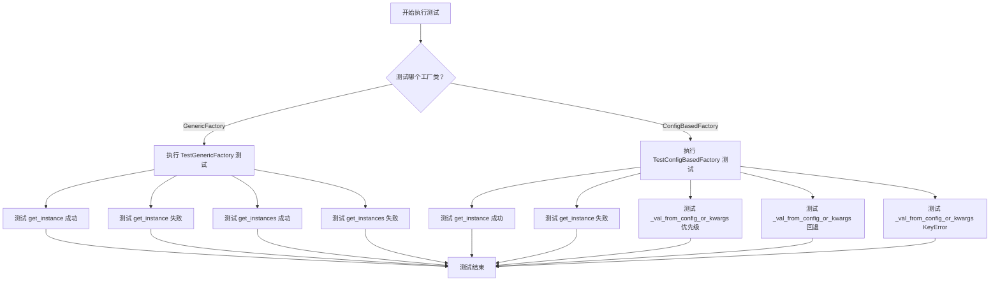
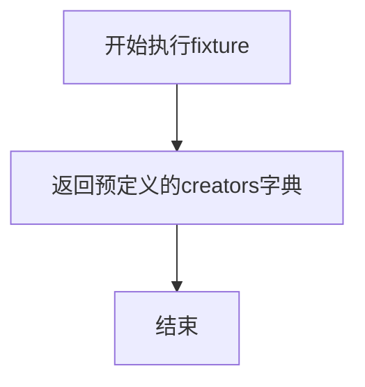
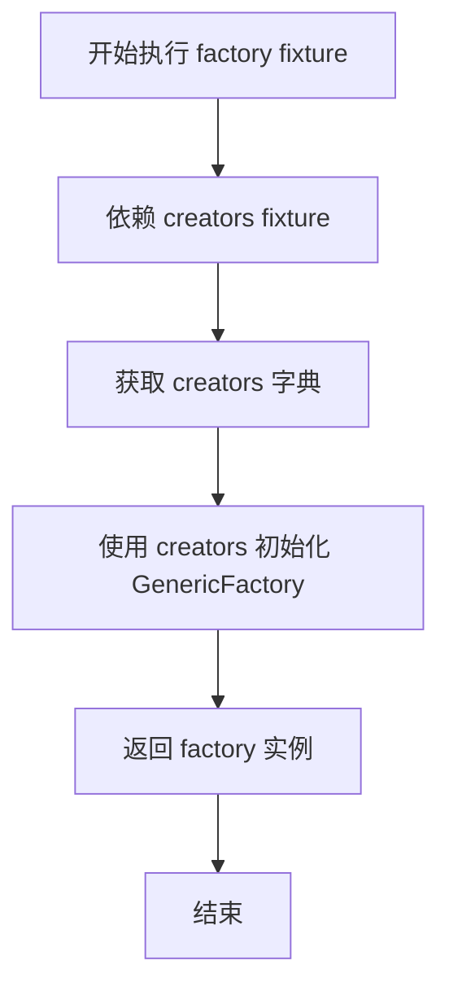
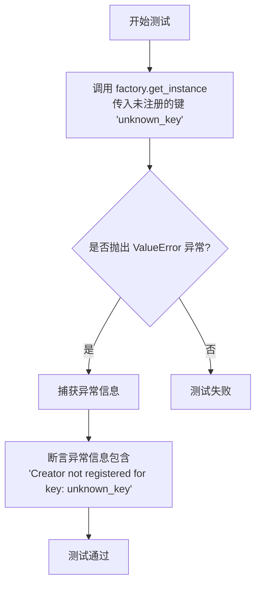
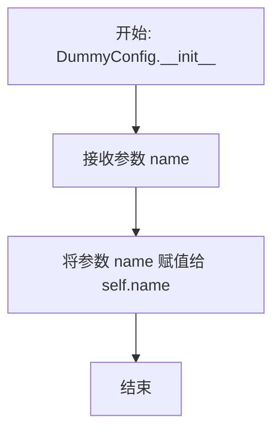
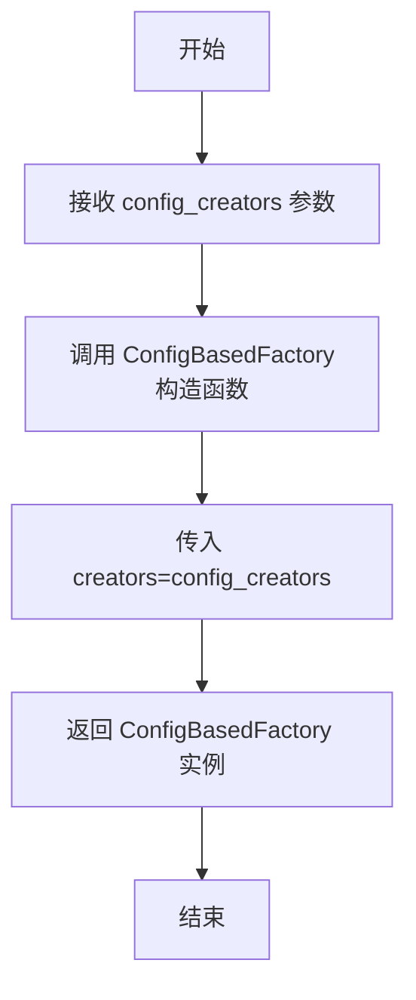
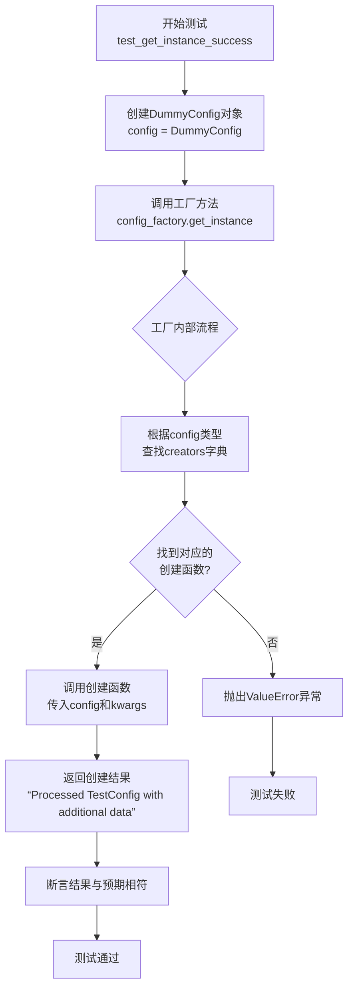
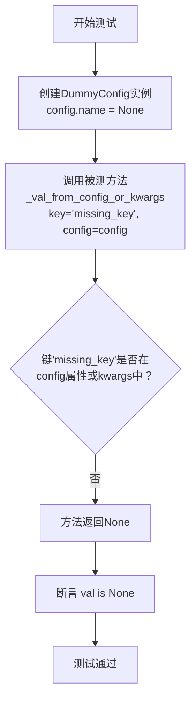

# `.\MetaGPT\tests\metagpt\rag\factories\test_base.py` 详细设计文档

该文件包含对 `metagpt.rag.factories.base` 模块中 `GenericFactory` 和 `ConfigBasedFactory` 两个工厂类的单元测试。`GenericFactory` 是一个通用的工厂类，根据给定的键（key）调用对应的创建函数来生成实例。`ConfigBasedFactory` 是 `GenericFactory` 的扩展，它根据配置对象（config）的类型来查找对应的创建函数，并提供了一个辅助方法 `_val_from_config_or_kwargs` 来优先从配置对象中获取值，若不存在则回退到关键字参数（kwargs）。测试用例覆盖了工厂类的成功实例化、失败处理（如未注册的键或配置类型）以及辅助方法的优先级逻辑。

## 整体流程



## 类结构

```
TestGenericFactory (测试类)
TestConfigBasedFactory (测试类)
└── DummyConfig (辅助类)
```

## 全局变量及字段


### `DummyConfig.name`
    
配置对象的名称属性，用于标识和区分不同的配置实例。

类型：`str`
    
    

## 全局函数及方法

### `TestGenericFactory.creators`

这是一个 Pytest 测试夹具（fixture），用于为 `TestGenericFactory` 测试类提供测试数据。它返回一个字典，其中包含两个键值对，用于模拟 `GenericFactory` 可以创建的不同类型的“实例”。每个键对应一个创建函数（lambda 表达式），该函数接收一个 `name` 参数并返回一个格式化的字符串。

参数：

-  `self`：`TestGenericFactory`，`TestGenericFactory` 测试类的实例，Pytest 夹具的固定参数。

返回值：`dict`，一个字典，其键为字符串类型（如 `"type1"`, `"type2"`），值为接收一个 `name` 参数并返回字符串的 lambda 函数。该字典用于初始化 `GenericFactory` 的 `creators` 参数。

#### 流程图



#### 带注释源码

```python
    @pytest.fixture
    # 定义一个名为 `creators` 的 Pytest 夹具。
    # 夹具函数在测试执行前运行，其返回值可供依赖它的其他夹具或测试用例使用。
    def creators(self):
        # 返回一个字典，模拟 GenericFactory 的创建器注册表。
        # 这个字典是测试 `GenericFactory.get_instance` 和 `get_instances` 方法的基础数据。
        return {
            # 键 "type1" 对应一个 lambda 函数。
            # 该函数接收一个 `name` 参数，并返回一个格式化的字符串。
            "type1": lambda name: f"Instance of type1 with {name}",
            # 键 "type2" 对应另一个类似的 lambda 函数。
            "type2": lambda name: f"Instance of type2 with {name}",
        }
```

### `TestGenericFactory.factory`

这是一个 pytest fixture 方法，用于为 `TestGenericFactory` 测试类创建并返回一个 `GenericFactory` 实例。它依赖于另一个名为 `creators` 的 fixture 来提供工厂的创建器字典。

参数：

-  `creators`：`dict`，一个包含创建器函数的字典，由同名的 `creators` fixture 提供。

返回值：`GenericFactory`，一个使用 `creators` 字典初始化的 `GenericFactory` 实例。

#### 流程图



#### 带注释源码

```python
    @pytest.fixture
    # 定义一个名为 `factory` 的 pytest fixture。
    def factory(self, creators):
        # 该 fixture 依赖于另一个名为 `creators` 的 fixture。
        # 使用传入的 `creators` 字典作为参数，实例化一个 `GenericFactory` 对象。
        return GenericFactory(creators=creators)
        # 返回新创建的 `GenericFactory` 实例，供测试用例使用。
```

### `TestGenericFactory.test_get_instance_success`

该方法是一个单元测试，用于验证 `GenericFactory` 工厂类的 `get_instance` 方法在传入已注册的键（key）时，能够成功创建并返回正确的实例。

参数：

- `factory`：`GenericFactory`，通过 `@pytest.fixture` 注入的 `GenericFactory` 实例，其 `creators` 字典已预置了 `"type1"` 和 `"type2"` 两个键对应的创建函数。

返回值：`None`，这是一个测试方法，不返回业务值，其成功与否由内部的断言（`assert`）决定。

#### 流程图

```mermaid
flowchart TD
    A[开始测试] --> B[调用 factory.get_instance<br>key='type1', name='TestName']
    B --> C{工厂内部查找 key}
    C -->|找到 key='type1'| D[执行对应的创建函数<br>lambda name: f'Instance of type1 with {name}']
    D --> E[返回字符串<br>'Instance of type1 with TestName']
    E --> F[断言返回值与预期相符]
    F --> G[测试通过]
    C -->|未找到 key| H[抛出 ValueError 异常<br>测试失败]
```

#### 带注释源码

```python
def test_get_instance_success(self, factory):
    # Test successful retrieval of an instance
    # 测试成功获取一个实例
    key = "type1"
    # 调用工厂的 get_instance 方法，传入已注册的 key 和参数
    instance = factory.get_instance(key, name="TestName")
    # 断言返回的实例与预期字符串完全一致
    assert instance == "Instance of type1 with TestName"
```

### `TestGenericFactory.test_get_instance_failure`

该方法是 `TestGenericFactory` 类中的一个单元测试方法，用于测试 `GenericFactory` 工厂类在尝试使用未注册的键（key）获取实例时的失败行为。它验证了工厂会抛出一个包含特定错误信息的 `ValueError` 异常。

参数：

- `factory`：`GenericFactory`，通过 `@pytest.fixture` 注入的 `GenericFactory` 实例，用于执行测试。

返回值：`None`，这是一个测试方法，不返回业务值，其目的是通过断言验证代码行为。

#### 流程图



#### 带注释源码

```python
def test_get_instance_failure(self, factory):
    # Test failure to retrieve an instance due to unregistered key
    # 使用 pytest.raises 上下文管理器来捕获预期的 ValueError 异常
    with pytest.raises(ValueError) as exc_info:
        # 尝试使用一个未在工厂中注册的键 'unknown_key' 来获取实例
        factory.get_instance("unknown_key")
    # 断言捕获到的异常信息中包含预期的错误提示字符串
    assert "Creator not registered for key: unknown_key" in str(exc_info.value)
```

### `TestGenericFactory.test_get_instances_success`

该方法用于测试 `GenericFactory` 工厂类的 `get_instances` 方法，验证其能够根据提供的键列表成功创建并返回对应的多个实例。

参数：

- `factory`：`GenericFactory`，一个已配置了创建器（creators）的 `GenericFactory` 实例，用于测试。
- `keys`：`list`，一个字符串列表，指定要创建的实例类型键。
- `name`：`str`，传递给每个实例创建器的参数，用于定制化实例。

返回值：`None`，该测试方法不返回任何值，其核心功能是通过断言（assert）来验证 `factory.get_instances` 方法的输出是否符合预期。

#### 流程图

```mermaid
flowchart TD
    A[开始测试] --> B[调用 factory.get_instances<br>keys=['type1', 'type2'], name='TestName']
    B --> C{内部遍历 keys}
    C --> D[处理 key='type1']
    D --> E[调用 creators['type1']<br>lambda name: f"Instance of type1 with {name}"]
    E --> F[生成实例 'Instance of type1 with TestName']
    F --> C
    C --> G[处理 key='type2']
    G --> H[调用 creators['type2']<br>lambda name: f"Instance of type2 with {name}"]
    H --> I[生成实例 'Instance of type2 with TestName']
    I --> C
    C --> J[遍历完成]
    J --> K[返回实例列表<br>['Instance of type1 with TestName',<br>'Instance of type2 with TestName']]
    K --> L[断言 instances == expected]
    L --> M[测试通过]
```

#### 带注释源码

```python
def test_get_instances_success(self, factory):
    # Test successful retrieval of multiple instances
    # 测试成功获取多个实例
    keys = ["type1", "type2"]
    # 调用工厂的 get_instances 方法，传入类型键列表和参数
    instances = factory.get_instances(keys, name="TestName")
    # 定义期望的输出结果
    expected = ["Instance of type1 with TestName", "Instance of type2 with TestName"]
    # 断言实际结果与期望结果一致
    assert instances == expected
```

### `TestGenericFactory.test_get_instances_with_failure`

该方法是一个参数化的单元测试，用于验证 `GenericFactory.get_instances` 方法在传入一个或多个未注册的键（`keys`）时，能否正确地抛出预期的 `ValueError` 异常。

参数：
-  `factory`：`GenericFactory`，一个已配置了特定创建器（creators）的 `GenericFactory` 实例，作为测试的上下文。
-  `keys`：`List[str]`，一个字符串列表，表示要请求实例的键。列表中可能包含未在工厂中注册的键。
-  `expected_exception_message`：`str`，期望在抛出的 `ValueError` 异常信息中包含的子字符串。

返回值：`None`，这是一个测试方法，不返回业务值，其成功与否由断言决定。

#### 流程图

```mermaid
flowchart TD
    A[开始测试] --> B[使用 pytest.raises 捕获异常]
    B --> C[调用 factory.get_instances(keys, name=...)]
    C --> D{是否抛出 ValueError?}
    D -- 是 --> E[获取异常信息 exc_info.value]
    D -- 否 --> F[测试失败<br>未抛出异常]
    E --> G{异常信息是否包含<br>expected_exception_message?}
    G -- 是 --> H[测试通过]
    G -- 否 --> I[测试失败<br>异常信息不匹配]
    F --> J[结束]
    H --> J
    I --> J
```

#### 带注释源码

```python
@pytest.mark.parametrize(
    "keys,expected_exception_message", # 使用 pytest 参数化装饰器，定义多组测试数据
    [
        (["unknown_key"], "Creator not registered for key: unknown_key"), # 第一组：单个未知键
        (["type1", "unknown_key"], "Creator not registered for key: unknown_key"), # 第二组：混合已知与未知键
    ],
)
def test_get_instances_with_failure(self, factory, keys, expected_exception_message):
    # Test failure to retrieve instances due to at least one unregistered key
    # 测试因至少一个未注册的键而导致获取多个实例失败的情况
    with pytest.raises(ValueError) as exc_info: # 断言上下文：期望接下来的代码块抛出 ValueError 异常
        factory.get_instances(keys, name="TestName") # 调用被测方法，尝试获取实例
    assert expected_exception_message in str(exc_info.value) # 断言捕获到的异常信息中包含预期的消息子串
```

### `DummyConfig.__init__`

`DummyConfig` 类的构造函数，用于初始化一个测试用的配置对象。它接收一个名称参数，并将其设置为实例的属性。

参数：
-  `name`：`Any`，配置对象的名称，将被赋值给实例的 `name` 属性。

返回值：`None`，构造函数不返回任何值。

#### 流程图



#### 带注释源码

```python
def __init__(self, name):
    # 将传入的 name 参数赋值给实例的 name 属性
    self.name = name
```

### `TestConfigBasedFactory.config_creators`

这是一个用于测试的 pytest fixture 方法。它创建并返回一个字典，该字典将配置类（`DummyConfig`）映射到对应的实例创建函数。这个字典用于初始化 `ConfigBasedFactory` 测试实例，以验证工厂模式如何根据配置对象创建相应的处理实例。

参数：

-  `self`：`TestConfigBasedFactory`，当前测试类的实例。

返回值：`dict`，一个包含配置类到创建函数映射的字典。具体为 `{DummyConfig: lambda config, **kwargs: ...}`。

#### 流程图

```mermaid
flowchart TD
    A[开始] --> B[定义字典 creators]
    B --> C[键: DummyConfig 类]
    C --> D[值: 匿名函数<br>接收 config 和 **kwargs]
    D --> E[返回处理后的字符串<br>格式: Processed {config.name} with {kwargs.get('extra', 'no extra')}]
    E --> F[返回字典 creators]
    F --> G[结束]
```

#### 带注释源码

```python
@pytest.fixture
def config_creators(self):
    # 定义一个字典，作为 ConfigBasedFactory 的 creators 参数。
    # 键是配置类（DummyConfig），值是一个用于创建实例的 lambda 函数。
    return {
        # 当工厂接收到 DummyConfig 类型的配置对象时，将调用此 lambda 函数。
        # 该函数接收配置对象 `config` 和任意关键字参数 `**kwargs`。
        DummyConfig: lambda config, **kwargs: f"Processed {config.name} with {kwargs.get('extra', 'no extra')}",
    }
```

### `TestConfigBasedFactory.config_factory`

这是一个用于测试的 `pytest` fixture 方法。它接收一个名为 `config_creators` 的字典参数，并返回一个使用该字典初始化的 `ConfigBasedFactory` 实例。这个 fixture 为 `TestConfigBasedFactory` 测试类中的其他测试方法提供了一个可重用的、预配置好的工厂对象。

参数：

-  `config_creators`：`dict`，一个字典，其键为配置类（如 `DummyConfig`），值为对应的创建器函数。该参数由同名的 `@pytest.fixture` 方法 `config_creators` 提供。

返回值：`ConfigBasedFactory`，一个使用传入的 `config_creators` 字典初始化好的 `ConfigBasedFactory` 实例。

#### 流程图



#### 带注释源码

```python
    @pytest.fixture
    # 定义一个名为 `config_factory` 的 pytest fixture。
    # fixture 是 pytest 的一个核心功能，用于提供测试所需的依赖项。
    # 这个 fixture 依赖于另一个名为 `config_creators` 的 fixture。
    def config_factory(self, config_creators):
        # 使用从 `config_creators` fixture 获取的字典来实例化 `ConfigBasedFactory` 类。
        # `creators=config_creators` 将字典传递给工厂的构造函数。
        # 最终，这个 fixture 返回一个配置好的 `ConfigBasedFactory` 对象，
        # 供 `TestConfigBasedFactory` 类中以 `config_factory` 为参数的测试方法使用。
        return ConfigBasedFactory(creators=config_creators)
```

### `TestConfigBasedFactory.test_get_instance_success`

该方法是一个单元测试，用于验证 `ConfigBasedFactory` 工厂类能够根据给定的配置对象成功创建并返回正确的实例。它测试了工厂的核心功能：根据配置对象的类型查找对应的创建函数，并传入配置对象和额外参数来生成实例。

参数：

- `self`：`TestConfigBasedFactory`，测试类实例，用于访问类属性和方法。
- `config_factory`：`ConfigBasedFactory`，通过 `@pytest.fixture` 注入的已配置好的工厂实例，其 `creators` 字典中注册了 `DummyConfig` 类型的创建函数。

返回值：`None`，这是一个测试方法，其主要目的是通过断言（`assert`）来验证行为，不返回业务值。

#### 流程图



#### 带注释源码

```python
def test_get_instance_success(self, config_factory):
    # Test successful retrieval of an instance
    # 1. 准备测试数据：创建一个 DummyConfig 配置对象，其 `name` 属性为 "TestConfig"
    config = DummyConfig(name="TestConfig")
    
    # 2. 执行被测方法：调用 ConfigBasedFactory 实例的 `get_instance` 方法。
    #    - 传入参数 `config`: 上一步创建的配置对象。
    #    - 传入关键字参数 `extra="additional data"`: 作为额外参数传递给创建函数。
    #    该方法预期会根据 `config` 的类型（DummyConfig）在工厂的 `creators` 字典中
    #    找到对应的创建函数（lambda函数），并调用该函数。
    instance = config_factory.get_instance(config, extra="additional data")
    
    # 3. 验证结果：断言工厂返回的实例字符串与预期完全一致。
    #    预期的创建函数逻辑是：f"Processed {config.name} with {kwargs.get('extra', 'no extra')}"
    #    代入后应为："Processed TestConfig with additional data"
    assert instance == "Processed TestConfig with additional data"
```

### `TestConfigBasedFactory.test_get_instance_failure`

该方法用于测试 `ConfigBasedFactory.get_instance` 方法在传入未知配置类型时的失败场景。它验证了当工厂无法找到与给定配置对象类型对应的创建器时，会抛出包含特定错误信息的 `ValueError` 异常。

参数：

-  `config_factory`：`ConfigBasedFactory`，通过 `@pytest.fixture` 注入的 `ConfigBasedFactory` 实例，其 `creators` 字典中仅注册了 `DummyConfig` 类型的创建器。
-  `self`：`TestConfigBasedFactory`，测试类实例的引用。

返回值：`None`，测试方法不返回任何值，其成功与否由断言决定。

#### 流程图

```mermaid
flowchart TD
    A[开始测试] --> B[定义内部类 UnknownConfig]
    B --> C[创建 UnknownConfig 实例 config]
    C --> D[调用 config_factory.get_instance(config)]
    D --> E{是否抛出 ValueError 异常?}
    E -- 是 --> F[捕获异常信息 exc_info]
    F --> G[断言异常信息包含 'Unknown config:']
    G --> H[测试通过]
    E -- 否 --> I[测试失败]
```

#### 带注释源码

```python
def test_get_instance_failure(self, config_factory):
    # Test failure to retrieve an instance due to unknown config type
    # 定义一个内部类 `UnknownConfig`，该类未在 `config_factory` 的创建器字典中注册。
    class UnknownConfig:
        pass

    # 创建 `UnknownConfig` 类的一个实例。
    config = UnknownConfig()
    # 使用 `pytest.raises` 上下文管理器来断言调用 `get_instance` 时会抛出 `ValueError` 异常。
    with pytest.raises(ValueError) as exc_info:
        # 尝试通过工厂获取 `UnknownConfig` 类型的实例。
        # 由于 `config_factory` 的 `creators` 字典中没有 `UnknownConfig` 类型的键，此调用应失败。
        config_factory.get_instance(config)
    # 断言捕获到的异常信息字符串中包含预期的子串 "Unknown config:"。
    # 这验证了工厂在遇到未知配置类型时抛出的错误信息是正确的。
    assert "Unknown config:" in str(exc_info.value)
```

### `TestConfigBasedFactory.test_val_from_config_or_kwargs_priority`

这是一个单元测试方法，用于验证 `ConfigBasedFactory._val_from_config_or_kwargs` 静态方法在获取参数值时，配置对象（config）中的属性值优先级高于关键字参数（kwargs）的逻辑。

参数：
-  `self`：`TestConfigBasedFactory`，测试类实例的引用，用于访问测试上下文。

返回值：`None`，这是一个测试方法，其主要目的是通过断言（assert）验证代码行为，不返回业务逻辑值。

#### 流程图

```mermaid
flowchart TD
    A[开始测试] --> B[创建DummyConfig对象<br>config.name = 'ConfigName']
    B --> C[调用被测方法<br>_val_from_config_or_kwargs<br>key='name', config, name='KwargsName']
    C --> D{config对象是否拥有<br>名为'name'的属性?}
    D -- 是 --> E[返回 config.name 的值<br>('ConfigName')]
    D -- 否 --> F[返回 kwargs['name'] 的值<br>('KwargsName')]
    E --> G[断言返回值等于 'ConfigName']
    F --> G
    G --> H[测试通过]
```

#### 带注释源码

```python
def test_val_from_config_or_kwargs_priority(self):
    # Test that the value from the config object has priority over kwargs
    # 测试目的：验证当配置对象和关键字参数中都存在某个键时，配置对象中的值具有更高优先级。
    config = DummyConfig(name="ConfigName")  # 创建一个DummyConfig测试对象，其name属性值为"ConfigName"
    # 调用ConfigBasedFactory类的静态方法_val_from_config_or_kwargs
    # 参数说明：
    #   key='name': 要查找的键名。
    #   config: 配置对象，此处为DummyConfig实例。
    #   name='KwargsName': 关键字参数，也提供了名为'name'的值。
    result = ConfigBasedFactory._val_from_config_or_kwargs("name", config, name="KwargsName")
    # 断言：期望返回的是config对象中的值('ConfigName')，而不是kwargs中的值('KwargsName')
    # 这验证了“config优先”的核心逻辑。
    assert result == "ConfigName"
```

### `TestConfigBasedFactory.test_val_from_config_or_kwargs_fallback_to_kwargs`

该方法用于测试 `ConfigBasedFactory` 类的静态方法 `_val_from_config_or_kwargs` 在配置对象 (`config`) 中不包含指定属性时的行为。具体场景是：当 `config` 对象的 `name` 属性值为 `None` 时，方法应回退到使用关键字参数 (`kwargs`) 中提供的同名参数值。

参数：

-  `self`：`TestConfigBasedFactory` 实例，Pytest 测试方法的固定参数，代表测试类实例本身。

返回值：`None`，这是一个单元测试方法，其主要目的是通过断言 (`assert`) 验证代码行为，不返回业务值。

#### 流程图

```mermaid
flowchart TD
    Start[开始测试] --> CallMethod[调用 _val_from_config_or_kwargs<br>key='name', config, name='KwargsName']
    CallMethod --> CheckConfigAttr{config.name 存在且不为 None?}
    CheckConfigAttr -- 否 --> UseKwargs[使用 kwargs['name'] 的值<br>（'KwargsName'）]
    CheckConfigAttr -- 是 --> UseConfigAttr[使用 config.name 的值]
    UseKwargs --> Assert[断言结果等于 'KwargsName']
    UseConfigAttr --> Assert
    Assert --> End[测试通过]
```

#### 带注释源码

```python
def test_val_from_config_or_kwargs_fallback_to_kwargs(self):
    # 测试当配置对象没有该值时，回退到使用 kwargs 中的值
    # 创建一个 DummyConfig 实例，其 name 属性被显式设置为 None
    config = DummyConfig(name=None)
    # 调用被测试的静态方法。
    # 参数说明：
    #   key='name': 要查找的属性/参数名。
    #   config: 配置对象，其 name 属性为 None。
    #   name='KwargsName': 关键字参数，提供了备选值。
    # 预期行为：由于 config.name 为 None，方法应返回 kwargs 中的 'KwargsName'。
    result = ConfigBasedFactory._val_from_config_or_kwargs("name", config, name="KwargsName")
    # 断言：验证方法返回值确实为回退后的 kwargs 值 'KwargsName'。
    assert result == "KwargsName"
```

### `TestConfigBasedFactory.test_val_from_config_or_kwargs_key_error`

该方法是 `TestConfigBasedFactory` 测试类中的一个单元测试方法，用于测试 `ConfigBasedFactory._val_from_config_or_kwargs` 静态方法在特定场景下的行为。具体场景是：当指定的键（`key`）既不存在于配置对象（`config`）的属性中，也不存在于关键字参数（`kwargs`）中时，该方法应返回 `None`。本测试旨在验证此默认行为。

参数：
-  `self`：`TestConfigBasedFactory`，测试类实例的引用，用于访问测试类的方法和属性。

返回值：`None`，测试方法通常不返回有意义的值，其目的是通过断言（`assert`）来验证代码行为。

#### 流程图



#### 带注释源码

```python
def test_val_from_config_or_kwargs_key_error(self):
    # 测试当键在配置对象和关键字参数中都找不到时，返回None的行为。
    # 1. 准备测试数据：创建一个DummyConfig实例，其`name`属性为None。
    config = DummyConfig(name=None)
    # 2. 执行：调用被测的静态方法，传入一个不存在的键`'missing_key'`和配置对象。
    #    注意：这里没有传入任何关键字参数（kwargs）。
    val = ConfigBasedFactory._val_from_config_or_kwargs("missing_key", config)
    # 3. 验证：断言方法的返回值是None，符合预期行为。
    assert val is None
```

## 关键组件

### GenericFactory

一个通用的工厂类，用于根据注册的键（key）和对应的创建函数（creator）动态创建对象实例。它支持通过单个键或多个键批量创建实例，并在遇到未注册的键时抛出明确的错误。

### ConfigBasedFactory

一个基于配置对象的工厂类，它扩展了通用工厂模式，能够根据传入的配置对象（config）的类型（class）来选择合适的创建函数。它提供了从配置对象或关键字参数（kwargs）中优先获取值的辅助方法，用于在创建实例时解析参数。

## 问题及建议


### 已知问题

-   **测试代码与生产代码耦合**：`TestConfigBasedFactory` 类中的测试方法 `test_val_from_config_or_kwargs_priority`、`test_val_from_config_or_kwargs_fallback_to_kwargs` 和 `test_val_from_config_or_kwargs_key_error` 直接测试了 `ConfigBasedFactory` 类的私有方法 `_val_from_config_or_kwargs`。这违反了测试原则，因为测试应该关注类的公共接口和行为，而不是其内部实现细节。私有方法的更改（如重命名、逻辑修改）将直接导致这些测试失败，增加了维护成本。
-   **测试覆盖不完整**：测试用例主要验证了工厂类的“快乐路径”和基本的错误处理（如未注册的键）。然而，对于 `GenericFactory.get_instances` 方法，当传入的 `keys` 列表为空时，其行为未经过测试。虽然可能返回空列表，但缺乏明确的测试来确认这一行为，存在潜在的边界情况风险。
-   **测试数据构造重复**：在 `TestGenericFactory` 和 `TestConfigBasedFactory` 中，分别使用 `@pytest.fixture` 定义了相似的 `creators` 字典。虽然这是标准的测试设置方式，但如果工厂的创建逻辑变得更复杂，这种重复的构造可能会变得冗长且难以维护。

### 优化建议

-   **重构对私有方法的测试**：建议将针对 `ConfigBasedFactory._val_from_config_or_kwargs` 的测试移除或重构。测试的重点应放在 `get_instance` 等公共方法上，通过设计不同的 `config` 对象和 `kwargs` 参数来间接验证 `_val_from_config_or_kwargs` 的逻辑。例如，可以创建具有特定属性的 `DummyConfig` 子类来测试优先级和回退机制。如果必须测试私有方法，应考虑将其重构为受保护的公共工具函数，或者重新评估其设计是否合理。
-   **补充边界条件测试**：为 `GenericFactory.get_instances` 方法添加一个测试用例，验证当传入空列表 `[]` 时的行为。预期结果应为返回一个空列表 `[]`。这有助于确保方法在边界条件下的鲁棒性，并作为方法契约的明确文档。
-   **考虑使用更高级的测试夹具**：如果 `creators` 的构造逻辑在未来变得复杂，可以考虑使用工厂模式（如 `pytest` 的工厂夹具）或从外部文件（如 JSON、YAML）加载测试配置来集中管理测试数据，减少代码重复并提高可维护性。目前代码结构简单，此建议为前瞻性优化。
-   **增强异常断言**：在测试 `get_instance` 和 `get_instances` 的失败案例时，除了检查异常消息字符串，还可以使用 `pytest.raises` 的 `match` 参数进行正则表达式匹配，使断言更精确。例如：`with pytest.raises(ValueError, match="Creator not registered for key: unknown_key"):`。


## 其它


### 设计目标与约束

本代码旨在为元GPT项目提供一个灵活、可扩展的工厂模式实现，用于根据配置或类型键动态创建对象。设计目标包括：1) 提供统一的实例创建接口，简化客户端代码；2) 支持通过注册机制灵活扩展新的创建者（Creator）；3) 确保类型安全，在请求未注册的类型时提供明确的错误反馈。主要约束是保持工厂类的轻量化和职责单一，不处理复杂的对象生命周期管理或依赖注入。

### 错误处理与异常设计

代码中的错误处理主要围绕工厂无法找到对应的创建者（Creator）这一场景。`GenericFactory` 和 `ConfigBasedFactory` 的 `get_instance` 和 `get_instances` 方法在遇到未注册的键（`key`）或配置类型（`config`）时，会抛出 `ValueError` 异常，并附带清晰的错误信息（如 "Creator not registered for key: unknown_key" 或 "Unknown config:"）。这种设计强制调用方处理或预知可能的创建失败，避免了返回 `None` 可能导致的后续空指针错误。辅助方法 `_val_from_config_or_kwargs` 在未找到值时返回 `None`，这是一种静默处理，适用于提供默认值或可选参数的场景。

### 数据流与状态机

本模块不涉及复杂的状态机。其核心数据流是单向的：客户端调用工厂方法（`get_instance`/`get_instances`）并传入标识符（键或配置对象）以及可选参数 -> 工厂内部根据标识符查找已注册的创建者函数 -> 创建者函数被调用，并接收传入的参数 -> 创建者函数返回创建的对象实例 -> 工厂将该实例返回给客户端。工厂内部维护的 `creators` 字典是唯一的核心状态，它在工厂实例化时被初始化，之后通常是只读的，决定了工厂的能力范围。

### 外部依赖与接口契约

1.  **外部依赖**：
    *   `pytest`：仅用于编写和运行单元测试，不属于生产代码的核心依赖。
    *   `metagpt.rag.factories.base`：从同一项目的基模块导入 `ConfigBasedFactory` 和 `GenericFactory`。这是强依赖，用于构建被测试的类。

2.  **接口契约**：
    *   **创建者（Creator）接口**：传递给工厂的 `creators` 字典中的每个值（创建者）必须是一个可调用对象。对于 `GenericFactory`，它应接受 `**kwargs` 参数；对于 `ConfigBasedFactory`，它应首先接受一个 `config` 参数，然后是 `**kwargs`。它们返回任何类型的对象。
    *   **工厂方法接口**：`get_instance` 方法必须返回一个对象或抛出 `ValueError`。`get_instances` 方法必须返回一个对象列表或抛出 `ValueError`。
    *   **配置对象接口**：与 `ConfigBasedFactory` 配合使用的配置对象，需要能够通过 `getattr` 访问其属性（如 `config.name`），以支持 `_val_from_config_or_kwargs` 方法的工作。

    