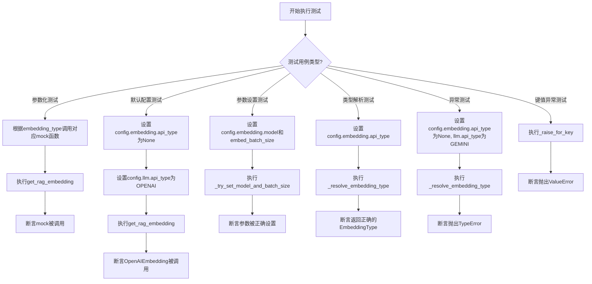
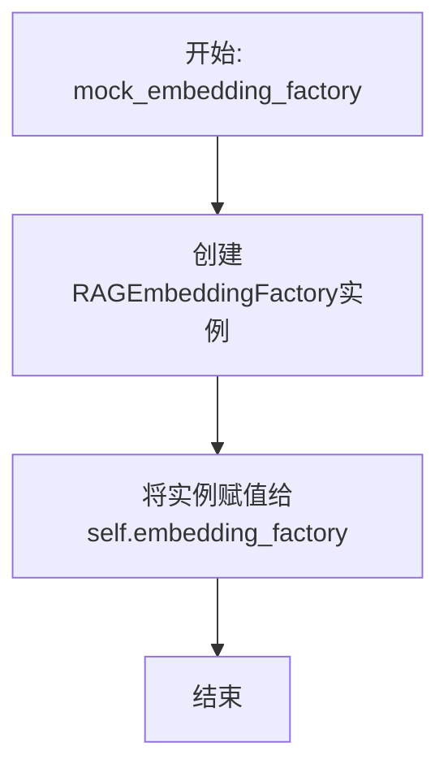
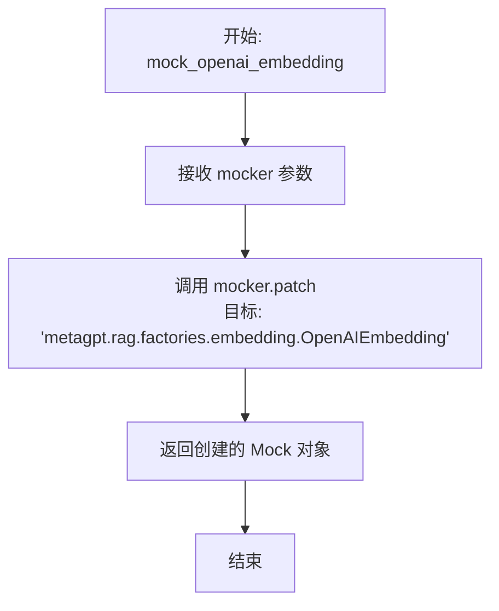
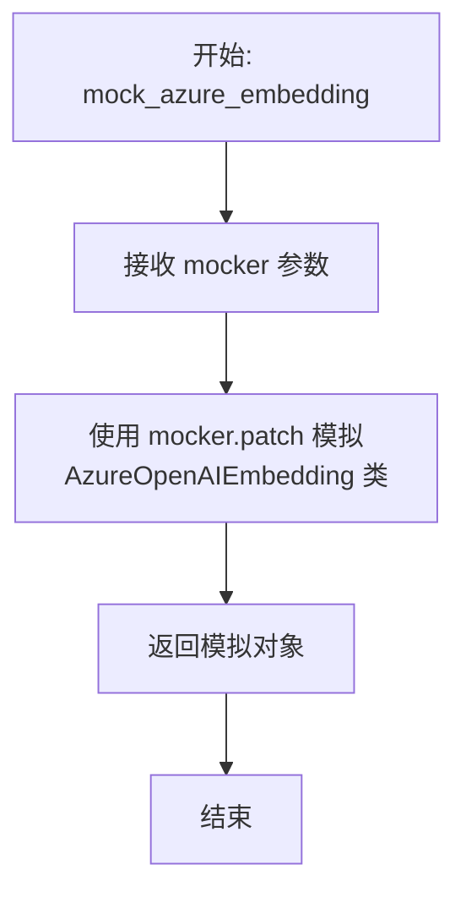
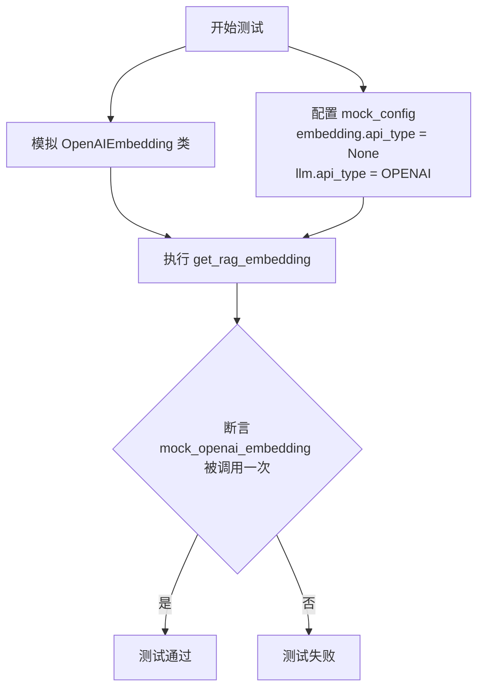
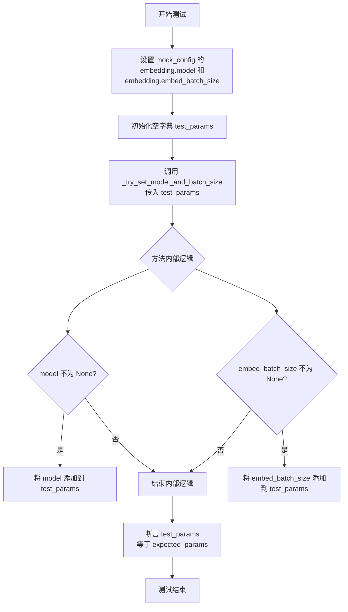
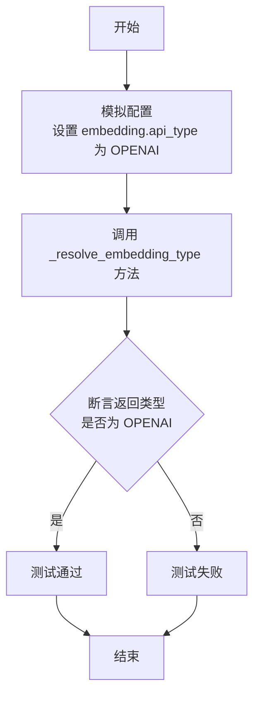
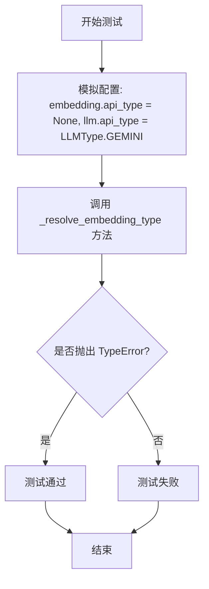
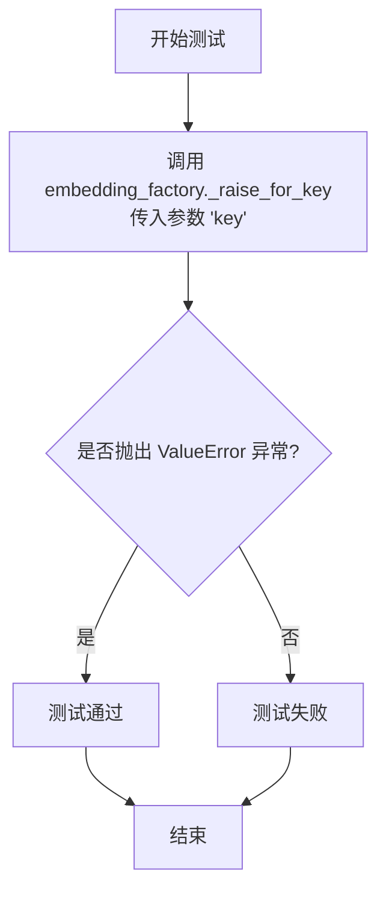

# `.\MetaGPT\tests\metagpt\rag\factories\test_embedding.py` 详细设计文档

该文件是一个使用pytest框架编写的单元测试文件，用于测试RAGEmbeddingFactory类。RAGEmbeddingFactory是一个工厂类，负责根据配置创建不同类型的嵌入模型实例。测试覆盖了工厂方法根据不同的API类型（如OPENAI、AZURE、GEMINI、OLLAMA）正确创建对应嵌入模型的能力，以及默认配置处理、参数设置和异常情况。

## 整体流程



## 类结构

```
TestRAGEmbeddingFactory (测试类)
├── mock_embedding_factory (fixture, 自动使用)
├── mock_config (fixture)
├── mock_openai_embedding (静态方法)
├── mock_azure_embedding (静态方法)
├── mock_gemini_embedding (静态方法)
├── mock_ollama_embedding (静态方法)
├── test_get_rag_embedding (参数化测试方法)
├── test_get_rag_embedding_default (测试方法)
├── test_try_set_model_and_batch_size (参数化测试方法)
├── test_resolve_embedding_type (测试方法)
├── test_resolve_embedding_type_exception (测试方法)
└── test_raise_for_key (测试方法)
```

## 全局变量及字段


### `TestRAGEmbeddingFactory.embedding_factory`
    
用于测试的RAGEmbeddingFactory实例，作为测试类的实例变量，用于在测试方法中调用其方法。

类型：`RAGEmbeddingFactory`
    
    

## 全局函数及方法

### `TestRAGEmbeddingFactory.mock_embedding_factory`

这是一个Pytest的fixture方法，用于在测试类`TestRAGEmbeddingFactory`的每个测试方法执行前自动运行。它的核心功能是初始化一个`RAGEmbeddingFactory`实例，并将其赋值给测试类的`embedding_factory`属性，为后续的测试方法提供一个干净、一致的测试对象。

参数：

- `self`：`TestRAGEmbeddingFactory`，当前测试类的实例，用于访问和设置实例属性。

返回值：`None`，此方法不返回任何值，其作用是为测试类设置状态。

#### 流程图



#### 带注释源码

```python
    @pytest.fixture(autouse=True)  # 声明这是一个Pytest fixture，`autouse=True`表示它会自动应用于类中的每个测试方法，无需显式引用。
    def mock_embedding_factory(self):  # 方法定义，参数`self`指代测试类实例本身。
        self.embedding_factory = RAGEmbeddingFactory()  # 创建一个RAGEmbeddingFactory对象，并将其赋值给测试实例的`embedding_factory`属性。
```

### `TestRAGEmbeddingFactory.mock_config`

这是一个用于单元测试的pytest fixture，用于创建并返回一个深度复制的默认配置对象，并模拟`Config.default()`方法使其返回这个配置对象，以便在测试中隔离和修改配置。

参数：

- `mocker`：`pytest-mock`库提供的`MockerFixture`对象，用于模拟（mock）其他对象或函数。

返回值：`metagpt.config2.Config`，一个深度复制的默认配置对象实例。

#### 流程图

```mermaid
flowchart TD
    A[开始: mock_config(mocker)] --> B[调用Config.default()获取默认配置]
    B --> C[深度复制配置对象]
    C --> D[使用mocker.patch模拟Config.default方法]
    D --> E[将模拟方法返回值设为复制的配置]
    E --> F[返回复制的配置对象]
    F --> G[结束]
```

#### 带注释源码

```python
@pytest.fixture
def mock_config(self, mocker):
    # 1. 获取默认配置并进行深度复制，确保测试间的配置隔离
    config = Config.default().model_copy(deep=True)
    # 2. 模拟（mock）`metagpt.config2.Config.default`方法
    default = mocker.patch("metagpt.config2.Config.default")
    # 3. 将模拟方法的返回值设置为上一步复制的配置对象
    default.return_value = config
    # 4. 返回这个配置对象，供测试用例使用
    return config
```

### `TestRAGEmbeddingFactory.mock_openai_embedding`

这是一个用于单元测试的静态辅助方法，其核心功能是创建一个对 `metagpt.rag.factories.embedding.OpenAIEmbedding` 类的模拟（Mock）对象。通过使用 `pytest-mock` 的 `mocker` 参数，它能够拦截对 `OpenAIEmbedding` 类的任何调用，从而在测试中隔离外部依赖，确保测试的独立性和可重复性。

参数：
- `mocker`：`pytest_mock.MockerFixture`，`pytest-mock` 插件提供的模拟对象创建器，用于创建和配置模拟对象。

返回值：`unittest.mock.MagicMock`，返回一个模拟了 `OpenAIEmbedding` 类的 `MagicMock` 对象，用于在测试中断言其是否被调用及调用参数。

#### 流程图



#### 带注释源码

```python
    @staticmethod
    def mock_openai_embedding(mocker):
        # 使用 mocker.patch 方法创建一个模拟对象。
        # 参数是一个字符串，指定了要模拟的目标对象的完整导入路径。
        # 这里模拟的是 `metagpt.rag.factories.embedding` 模块中的 `OpenAIEmbedding` 类。
        # 在测试期间，任何尝试导入或实例化 `OpenAIEmbedding` 的代码都将收到这个模拟对象。
        return mocker.patch("metagpt.rag.factories.embedding.OpenAIEmbedding")
```

### `TestRAGEmbeddingFactory.mock_azure_embedding`

这是一个用于单元测试的静态方法，其核心功能是创建一个对 `AzureOpenAIEmbedding` 类的模拟（mock）对象。它使用 `pytest-mock` 的 `mocker` 参数来拦截对 `metagpt.rag.factories.embedding.AzureOpenAIEmbedding` 的导入或调用，并返回一个模拟对象，以便在测试中控制其行为并验证其调用情况。

参数：

- `mocker`：`pytest_mock.MockerFixture`，pytest-mock 插件提供的模拟工具，用于创建和管理模拟对象。

返回值：`unittest.mock.MagicMock`，返回一个对 `AzureOpenAIEmbedding` 类的模拟对象。

#### 流程图



#### 带注释源码

```python
    @staticmethod
    def mock_azure_embedding(mocker):
        # 使用 mocker.patch 方法模拟（mock）'metagpt.rag.factories.embedding' 模块中的 AzureOpenAIEmbedding 类。
        # 这会在测试期间，将对该类的任何引用替换为一个 MagicMock 对象。
        # 参数 mocker 由 pytest-mock 插件自动注入，是创建模拟的主要工具。
        # 返回值是创建的模拟对象，测试用例可以使用它来断言调用或配置返回值。
        return mocker.patch("metagpt.rag.factories.embedding.AzureOpenAIEmbedding")
```

### `TestRAGEmbeddingFactory.mock_gemini_embedding`

这是一个用于单元测试的静态方法，其核心功能是创建一个用于模拟（Mock）`GeminiEmbedding` 类的补丁（Patch）对象。在测试 `RAGEmbeddingFactory.get_rag_embedding` 方法时，此方法被用来拦截对 `GeminiEmbedding` 类的实际调用，以便在不依赖外部服务的情况下验证工厂方法的逻辑是否正确。

参数：
- `mocker`：`pytest-mock` 库提供的 `MockerFixture` 对象，用于创建和管理模拟对象。

返回值：`unittest.mock.MagicMock`，返回一个被 `mocker.patch` 创建的模拟对象，该对象替代了 `metagpt.rag.factories.embedding.GeminiEmbedding` 类。

#### 流程图

```mermaid
flowchart TD
    A[开始: mock_gemini_embedding(mocker)] --> B[使用 mocker.patch 创建模拟对象<br>目标: GeminiEmbedding 类]
    B --> C[返回创建的模拟对象]
    C --> D[结束]
```

#### 带注释源码

```python
@staticmethod
def mock_gemini_embedding(mocker):
    # 使用 pytest-mock 的 mocker 对象创建一个补丁（patch）。
    # 这个补丁会临时将 `metagpt.rag.factories.embedding.GeminiEmbedding` 类替换为一个模拟对象（MagicMock）。
    # 这样，在测试中任何尝试实例化 `GeminiEmbedding` 的代码都会得到这个模拟对象，从而避免真实的外部API调用。
    return mocker.patch("metagpt.rag.factories.embedding.GeminiEmbedding")
```

### `TestRAGEmbeddingFactory.mock_ollama_embedding`

这是一个用于单元测试的静态方法，其核心功能是模拟（mock）`OllamaEmbedding`类，以便在测试`RAGEmbeddingFactory.get_rag_embedding`方法时，隔离对真实`OllamaEmbedding`类的依赖，确保测试的独立性和可重复性。

参数：
- `mocker`：`pytest-mock`库提供的`MockerFixture`类型对象，用于创建和管理模拟对象。

返回值：`unittest.mock.MagicMock`，返回一个模拟的`OllamaEmbedding`类对象。

#### 流程图

```mermaid
flowchart TD
    A[开始: mock_ollama_embedding(mocker)] --> B[使用mocker.patch<br>模拟OllamaEmbedding类]
    B --> C[返回模拟的类对象]
    C --> D[结束]
```

#### 带注释源码

```python
@staticmethod
def mock_ollama_embedding(mocker):
    # 使用pytest-mock的mocker.patch方法，模拟'metagpt.rag.factories.embedding'模块中的'OllamaEmbedding'类。
    # 这确保了在测试过程中，任何对OllamaEmbedding的调用都会被这个模拟对象拦截，而不会执行真实的代码。
    return mocker.patch("metagpt.rag.factories.embedding.OllamaEmbedding")
```

### `TestRAGEmbeddingFactory.test_get_rag_embedding`

这是一个参数化的单元测试方法，用于验证 `RAGEmbeddingFactory.get_rag_embedding` 方法能够根据不同的 `embedding_type` 参数正确调用对应的嵌入模型类（如 `OpenAIEmbedding`, `AzureOpenAIEmbedding` 等）。它通过模拟（Mock）目标类来断言其是否被调用一次，从而测试工厂方法的逻辑分支。

参数：
-  `mock_func`：`function`，一个用于模拟特定嵌入模型类的静态方法（如 `mock_openai_embedding`）。
-  `embedding_type`：`Union[LLMType, EmbeddingType]`，指定要测试的嵌入类型，例如 `LLMType.OPENAI` 或 `EmbeddingType.GEMINI`。
-  `mocker`：`pytest_mock.MockerFixture`，pytest-mock 插件提供的模拟对象，用于创建和管理测试替身（Mock）。

返回值：`None`，这是一个测试方法，不返回业务值，其目的是通过断言来验证行为。

#### 流程图

```mermaid
flowchart TD
    A[开始测试] --> B[使用 mocker 调用 mock_func<br>模拟目标嵌入类]
    B --> C[执行<br>embedding_factory.get_rag_embedding(embedding_type)]
    C --> D{断言<br>模拟的类被调用一次}
    D --> E[测试通过]
```

#### 带注释源码

```python
    @pytest.mark.parametrize(
        ("mock_func", "embedding_type"),
        [
            (mock_openai_embedding, LLMType.OPENAI),
            (mock_azure_embedding, LLMType.AZURE),
            (mock_openai_embedding, EmbeddingType.OPENAI),
            (mock_azure_embedding, EmbeddingType.AZURE),
            (mock_gemini_embedding, EmbeddingType.GEMINI),
            (mock_ollama_embedding, EmbeddingType.OLLAMA),
        ],
    )
    def test_get_rag_embedding(self, mock_func, embedding_type, mocker):
        # Mock
        # 调用传入的 mock_func（例如 mock_openai_embedding），并传入 mocker 对象，
        # 返回一个对目标嵌入类（如 OpenAIEmbedding）的模拟对象。
        mock = mock_func(mocker)

        # Exec
        # 执行被测试的方法：通过工厂获取指定类型的嵌入对象。
        # 此调用应触发工厂内部实例化对应的嵌入类。
        self.embedding_factory.get_rag_embedding(embedding_type)

        # Assert
        # 断言：模拟的嵌入类构造函数被调用了一次。
        # 这验证了工厂方法根据 embedding_type 正确选择了目标类。
        mock.assert_called_once()
```

### `TestRAGEmbeddingFactory.test_get_rag_embedding_default`

该方法用于测试 `RAGEmbeddingFactory.get_rag_embedding` 方法在未显式指定 `embedding_type` 参数时的默认行为。具体场景是当配置中 `embedding.api_type` 为 `None` 而 `llm.api_type` 为 `LLMType.OPENAI` 时，工厂应默认创建 `OpenAIEmbedding` 实例。

参数：

- `mocker`：`pytest_mock.plugin.MockerFixture`，pytest-mock 提供的 Mock 夹具，用于创建和管理测试替身（mock）。
- `mock_config`：`metagpt.config2.Config`，通过 `@pytest.fixture` 装饰的 `mock_config` 方法提供的模拟配置对象。

返回值：`None`，这是一个单元测试方法，不返回业务值，其目的是通过断言验证代码行为。

#### 流程图



#### 带注释源码

```python
def test_get_rag_embedding_default(self, mocker, mock_config):
    # Mock
    # 1. 使用类静态方法 mock_openai_embedding 来模拟（patch）OpenAIEmbedding 类。
    #    这确保了在测试执行期间，对 OpenAIEmbedding 的调用会被拦截并替换为一个 Mock 对象。
    mock_openai_embedding = self.mock_openai_embedding(mocker)

    # 2. 设置模拟配置对象的状态，以模拟特定的测试场景：
    #    - embedding.api_type 设为 None，模拟未显式配置嵌入类型。
    #    - llm.api_type 设为 LLMType.OPENAI，模拟 LLM 配置为 OpenAI 类型。
    #    这个组合是为了测试工厂的默认回退逻辑。
    mock_config.embedding.api_type = None
    mock_config.llm.api_type = LLMType.OPENAI

    # Exec
    # 3. 执行待测试的核心方法：在未传递 embedding_type 参数的情况下调用 get_rag_embedding。
    #    根据工厂的内部逻辑，当 embedding.api_type 为 None 时，它应尝试从 llm.api_type 推断。
    #    此处 llm.api_type 为 OPENAI，因此预期工厂会尝试实例化 OpenAIEmbedding。
    self.embedding_factory.get_rag_embedding()

    # Assert
    # 4. 验证断言：确认模拟的 OpenAIEmbedding 类被调用了一次（且仅一次）。
    #    如果 assert_called_once() 通过，则证明工厂在给定配置下正确地选择了 OpenAIEmbedding 作为默认实现。
    mock_openai_embedding.assert_called_once()
```

### `TestRAGEmbeddingFactory.test_try_set_model_and_batch_size`

该方法是 `TestRAGEmbeddingFactory` 类中的一个单元测试方法，用于测试 `RAGEmbeddingFactory._try_set_model_and_batch_size` 方法的功能。它验证了当配置对象（`mock_config`）中的 `embedding.model` 和 `embedding.embed_batch_size` 字段被设置时，`_try_set_model_and_batch_size` 方法能否正确地将这些值提取并填充到传入的参数字典中。

参数：
- `mock_config`：`Config` 类型，一个被模拟的配置对象，用于提供测试所需的配置数据。
- `model`：`str` 类型，模拟的嵌入模型名称。
- `embed_batch_size`：`int` 类型，模拟的嵌入批处理大小。
- `expected_params`：`dict` 类型，期望 `_try_set_model_and_batch_size` 方法处理后得到的参数字典。

返回值：`None`，这是一个测试方法，不返回任何值，仅通过断言验证测试结果。

#### 流程图



#### 带注释源码

```python
    @pytest.mark.parametrize(
        "model, embed_batch_size, expected_params", # 使用参数化测试，定义三组测试数据
        [("test_model", 100, {"model_name": "test_model", "embed_batch_size": 100}), # 场景1: 提供model和batch_size
         (None, None, {})], # 场景2: 两者都为None
    )
    def test_try_set_model_and_batch_size(self, mock_config, model, embed_batch_size, expected_params):
        # Mock
        # 将传入的测试数据设置到模拟的配置对象中
        mock_config.embedding.model = model
        mock_config.embedding.embed_batch_size = embed_batch_size

        # Setup
        # 初始化一个空字典，用于接收 _try_set_model_and_batch_size 方法的处理结果
        test_params = {}

        # Exec
        # 执行被测试的方法，传入空字典
        self.embedding_factory._try_set_model_and_batch_size(test_params)

        # Assert
        # 断言处理后的字典与期望的字典完全一致
        assert test_params == expected_params
```

### `TestRAGEmbeddingFactory.test_resolve_embedding_type`

该方法用于测试 `RAGEmbeddingFactory._resolve_embedding_type` 方法的功能。它模拟配置对象，设置 `embedding.api_type` 为 `EmbeddingType.OPENAI`，然后调用被测试方法，并断言返回的嵌入类型与预期一致。

参数：
-  `self`：`TestRAGEmbeddingFactory`，测试类实例
-  `mock_config`：`Config`，通过 `pytest.fixture` 提供的模拟配置对象

返回值：`None`，无返回值，这是一个测试方法，主要进行断言验证。

#### 流程图



#### 带注释源码

```python
def test_resolve_embedding_type(self, mock_config):
    # Mock
    # 模拟配置对象，将 embedding.api_type 设置为 EmbeddingType.OPENAI
    mock_config.embedding.api_type = EmbeddingType.OPENAI

    # Exec
    # 执行被测试的 _resolve_embedding_type 方法
    embedding_type = self.embedding_factory._resolve_embedding_type()

    # Assert
    # 断言返回的嵌入类型与预期的 OPENAI 一致
    assert embedding_type == EmbeddingType.OPENAI
```

### `TestRAGEmbeddingFactory.test_resolve_embedding_type_exception`

该方法用于测试 `RAGEmbeddingFactory._resolve_embedding_type` 方法在特定配置下（当 `embedding.api_type` 为 `None` 且 `llm.api_type` 为不支持的类型时）是否会抛出预期的 `TypeError` 异常。这是一个单元测试方法，旨在验证工厂类的异常处理逻辑。

参数：
-  `self`：`TestRAGEmbeddingFactory`，测试类实例
-  `mock_config`：`Config`，通过 `pytest.fixture` 提供的模拟配置对象

返回值：`None`，此测试方法不返回任何值，其成功与否由 `pytest.raises` 断言决定。

#### 流程图



#### 带注释源码

```python
def test_resolve_embedding_type_exception(self, mock_config):
    # Mock
    # 设置模拟配置：将 embedding.api_type 设为 None，将 llm.api_type 设为 LLMType.GEMINI。
    # 这个组合在 _resolve_embedding_type 方法中预计会引发 TypeError。
    mock_config.embedding.api_type = None
    mock_config.llm.api_type = LLMType.GEMINI

    # Assert
    # 使用 pytest.raises 上下文管理器断言：当调用 _resolve_embedding_type 方法时，
    # 应该抛出一个 TypeError 异常。如果异常被正确抛出，测试通过；否则，测试失败。
    with pytest.raises(TypeError):
        self.embedding_factory._resolve_embedding_type()
```

### `TestRAGEmbeddingFactory.test_raise_for_key`

该方法用于测试 `RAGEmbeddingFactory` 类中的 `_raise_for_key` 方法，验证当传入一个无效的键（key）时，该方法是否会正确地抛出一个 `ValueError` 异常。这是一个单元测试方法，旨在确保错误处理逻辑的健壮性。

参数：
-  `self`：`TestRAGEmbeddingFactory`，测试类实例的引用，用于访问测试夹具和待测试的 `embedding_factory` 对象。

返回值：`None`，测试方法通常不返回值，其成功与否由断言决定。

#### 流程图



#### 带注释源码

```python
def test_raise_for_key(self):
    # 使用 pytest 的 `raises` 上下文管理器来断言调用特定方法会抛出预期的异常。
    with pytest.raises(ValueError):
        # 调用待测试的 `RAGEmbeddingFactory` 实例的 `_raise_for_key` 方法，
        # 并传入字符串 'key' 作为参数。测试期望此调用会引发一个 ValueError 异常。
        self.embedding_factory._raise_for_key("key")
```

## 关键组件

### RAGEmbeddingFactory

一个工厂类，负责根据配置创建和返回不同的嵌入（Embedding）实例，支持多种嵌入类型（如OpenAI、Azure、Gemini、Ollama），并处理模型和批处理大小等参数的配置。

### EmbeddingType

一个枚举或配置类，定义了系统支持的嵌入服务类型（如OPENAI、AZURE、GEMINI、OLLAMA），用于在工厂中路由以创建正确的嵌入客户端。

### LLMType

一个枚举或配置类，定义了系统支持的大语言模型服务类型（如OPENAI、AZURE），在某些情况下（当未明确指定嵌入类型时）用于推断默认的嵌入类型。

### Config

一个全局配置类，用于管理应用程序的配置，包括嵌入和LLM相关的设置，如`api_type`、`model`和`embed_batch_size`，为工厂提供创建实例所需的参数。

### 参数解析与异常处理逻辑

工厂内部包含用于解析配置（如`_resolve_embedding_type`）、设置参数（如`_try_set_model_and_batch_size`）和抛出特定异常（如`_raise_for_key`）的方法，这些逻辑共同确保了工厂在给定配置下能正确、健壮地工作。

## 问题及建议

### 已知问题

-   **测试用例对实现细节耦合度高**：测试类 `TestRAGEmbeddingFactory` 中的多个测试方法（如 `test_get_rag_embedding`）通过 `mocker.patch` 直接模拟了 `RAGEmbeddingFactory` 内部调用的具体类（如 `OpenAIEmbedding`）。这种“白盒测试”方式使得测试与工厂方法的具体实现紧密绑定。一旦工厂方法的内部实现逻辑发生变化（例如，更换了底层库或调整了初始化参数），即使其对外接口和行为不变，这些测试也可能失败，增加了维护成本。
-   **异常测试用例覆盖不完整**：`test_raise_for_key` 方法测试了 `_raise_for_key` 在传入 `"key"` 时抛出 `ValueError`。然而，该方法没有测试其他可能触发异常的场景，例如传入 `None`、空字符串或其他非法值时的行为。这可能导致边界条件或错误输入的处理逻辑存在未被发现的缺陷。
-   **配置对象模拟存在潜在风险**：在 `mock_config` fixture 中，通过 `Config.default().model_copy(deep=True)` 创建了一个配置副本，并全局替换了 `Config.default` 方法。虽然这在单个测试中是隔离的，但如果测试套件中其他测试也依赖 `Config.default` 且未妥善处理，可能会引发难以调试的测试间污染问题。此外，深度拷贝可能带来不必要的性能开销。

### 优化建议

-   **重构测试以减少实现耦合**：建议将测试重点从“验证调用了哪个具体的类”转移到“验证返回的对象是否具备预期的行为和接口”。例如，可以为 `RAGEmbeddingFactory.get_rag_embedding` 方法定义一组公共的接口契约测试。同时，对于工厂方法，可以测试其在不同配置下返回的对象类型是否正确，而不是模拟其内部构造过程。这能提升测试的健壮性和可维护性。
-   **补充异常和边界测试**：为 `_raise_for_key` 方法增加更多的参数化测试用例，覆盖 `None`、空字符串、数字、特殊字符等输入，确保异常抛出逻辑的鲁棒性。同时，检查 `_resolve_embedding_type` 方法中 `TypeError` 的触发条件是否已被充分测试。
-   **优化测试配置的模拟方式**：考虑使用更轻量级、作用域更明确的配置模拟策略。例如，可以直接构造一个 `Config` 对象（或其简化版）并传递给工厂方法（如果设计允许），而不是通过全局打补丁。如果必须使用 `mocker.patch`，应确保其作用域仅限于需要的测试模块或类，并在测试结束后妥善清理。评估深度拷贝 (`deep=True`) 的必要性，如果配置对象在测试中不会被修改，可以考虑使用浅拷贝或直接使用默认实例。
-   **提升测试的可读性与结构化**：当前测试方法中混合了 Mock 设置、执行和断言步骤。建议明确使用 `Arrange-Act-Assert` 或 `Given-When-Then` 模式来组织每个测试用例的代码块，并使用清晰的注释分隔，这将使测试意图更明确，便于后续阅读和维护。

## 其它


### 设计目标与约束

本测试类的设计目标是验证 `RAGEmbeddingFactory` 类在不同配置下创建对应嵌入模型实例的正确性。主要约束包括：
1.  **隔离性**：每个测试用例必须独立运行，不依赖外部服务或全局状态，通过 Mock 技术实现。
2.  **覆盖性**：测试需覆盖 `RAGEmbeddingFactory` 的主要功能分支，包括显式指定嵌入类型、使用默认配置、处理配置参数以及异常情况。
3.  **可维护性**：测试代码结构清晰，使用 `pytest` 的 `fixture` 和 `parametrize` 来减少重复代码，便于后续扩展新的嵌入类型测试。

### 错误处理与异常设计

测试类验证了 `RAGEmbeddingFactory` 在特定输入或配置下的异常抛出行为：
1.  **配置解析异常**：当配置中既未指定 `embedding.api_type`，且 `llm.api_type` 也无法映射到支持的嵌入类型时（例如 `LLMType.GEMINI`），`_resolve_embedding_type` 方法应抛出 `TypeError`。测试用例 `test_resolve_embedding_type_exception` 对此进行了验证。
2.  **无效键值异常**：`_raise_for_key` 方法被设计为在遇到无效或缺失的关键配置时抛出 `ValueError`。测试用例 `test_raise_for_key` 直接验证了此异常抛出行为。

### 数据流与状态机

测试执行过程中的核心数据流如下：
1.  **初始状态**：每个测试方法开始时，通过 `mock_embedding_factory` fixture 初始化一个 `RAGEmbeddingFactory` 实例 (`self.embedding_factory`)。
2.  **配置注入**：多数测试通过 `mock_config` fixture 获取一个深度拷贝的默认 `Config` 对象，并允许测试方法修改其特定属性（如 `api_type`, `model`, `embed_batch_size`）以模拟不同测试场景。
3.  **方法调用与断言**：
    *   **正常流**：测试调用 `get_rag_embedding` 或 `_try_set_model_and_batch_size` 等方法，并断言其行为（如是否正确调用了预期的嵌入类构造函数，或是否正确修改了参数字典）。
    *   **异常流**：测试在预期会抛出异常的上下文中（`with pytest.raises(...):`）调用方法，并断言抛出了正确的异常类型。
4.  **状态清理**：由于使用了 Mock 和 fixture，每个测试方法结束后，相关的 Mock 对象和修改过的配置状态不会影响其他测试，保证了测试的独立性。

### 外部依赖与接口契约

测试类通过 Mock 定义了与外部组件和内部类的接口契约：
1.  **对 `RAGEmbeddingFactory` 的依赖**：测试的核心对象，其 `get_rag_embedding`, `_try_set_model_and_batch_size`, `_resolve_embedding_type`, `_raise_for_key` 方法是测试的直接目标。
2.  **对 `Config` 类的依赖**：通过 `mock_config` fixture 模拟，测试预设其 `embedding` 和 `llm` 子配置的属性值，以驱动 `RAGEmbeddingFactory` 的不同行为。
3.  **对具体嵌入类（如 `OpenAIEmbedding`, `AzureOpenAIEmbedding` 等）的依赖**：这些是 `RAGEmbeddingFactory` 的产出物。测试通过静态方法（如 `mock_openai_embedding`）创建对这些类构造函数的 Mock，并断言它们是否被以正确的参数调用。这间接验证了 `RAGEmbeddingFactory` 与下游嵌入类之间的创建契约。
4.  **对 `pytest` 框架的依赖**：使用了 `pytest` 的测试装饰器、fixture 机制、参数化测试 (`@pytest.mark.parametrize`) 和异常断言 (`pytest.raises`)。


    