# `.\MetaGPT\tests\metagpt\rag\factories\test_index.py` 详细设计文档

该文件是一个使用 pytest 框架编写的单元测试文件，用于测试 `RAGIndexFactory` 类根据不同的索引配置（FAISS、Chroma、BM25、Elasticsearch）创建相应 RAG（检索增强生成）索引的功能。测试通过模拟（Mock）外部依赖来验证工厂方法是否正确调用了底层的向量存储库和索引加载逻辑。

## 整体流程

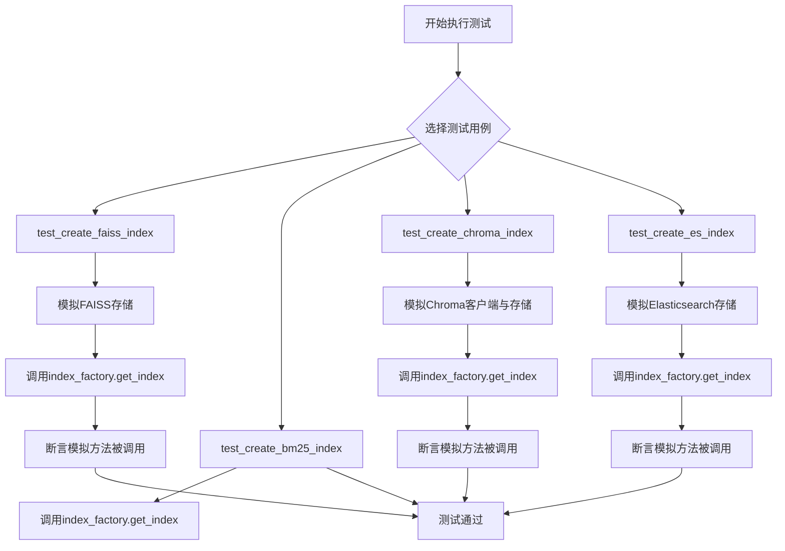

## 类结构

```
TestRAGIndexFactory (测试类)
├── setup (pytest fixture, 自动执行)
├── faiss_config (pytest fixture)
├── chroma_config (pytest fixture)
├── bm25_config (pytest fixture)
├── es_config (pytest fixture)
├── mock_storage_context (pytest fixture)
├── mock_load_index_from_storage (pytest fixture)
├── mock_from_vector_store (pytest fixture)
├── mock_embedding (pytest fixture)
├── test_create_faiss_index (测试方法)
├── test_create_bm25_index (测试方法)
├── test_create_chroma_index (测试方法)
└── test_create_es_index (测试方法)
```

## 全局变量及字段


### `TestRAGIndexFactory.index_factory`
    
用于创建和获取不同RAG索引的工厂类实例，是测试类的主要测试对象。

类型：`RAGIndexFactory`
    
    

## 全局函数及方法

### `TestRAGIndexFactory.setup`

该方法是 `TestRAGIndexFactory` 测试类的 `pytest` 自动使用（`autouse=True`）的 `fixture`。它的核心功能是在该类中的每个测试方法执行之前，自动初始化一个 `RAGIndexFactory` 实例，并将其赋值给测试实例的 `index_factory` 属性，为后续的测试方法提供一个干净、一致的工厂对象。

参数：
-  `self`：`TestRAGIndexFactory`，指向当前测试类实例的引用。

返回值：`None`，此 `fixture` 不返回任何值，其作用是为测试实例设置状态。

#### 流程图

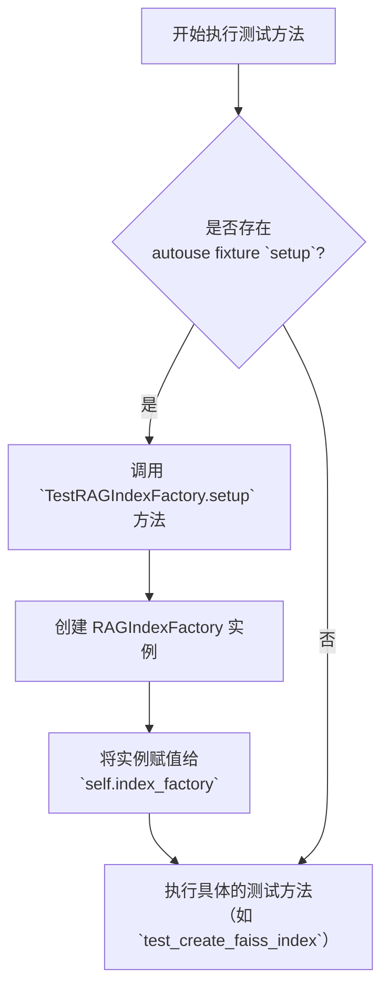

#### 带注释源码

```python
    @pytest.fixture(autouse=True)  # 装饰器，声明这是一个pytest fixture，且`autouse=True`表示它会自动应用于该类中的所有测试方法，无需在测试函数参数中显式声明。
    def setup(self):  # 方法定义，参数`self`代表当前测试类的实例。
        self.index_factory = RAGIndexFactory()  # 核心操作：创建一个RAGIndexFactory对象，并将其赋值给当前测试实例的`index_factory`属性。这确保了每个测试方法都有一个独立的、新初始化的工厂可用。
```

### `TestRAGIndexFactory.faiss_config`

这是一个 Pytest 测试夹具（fixture），用于为测试方法 `test_create_faiss_index` 提供预配置的 `FAISSIndexConfig` 对象。它简化了测试设置，确保测试使用一个具有特定配置（此处为空持久化路径）的索引配置对象。

参数：
-  `self`：`TestRAGIndexFactory`，对测试类实例的引用。

返回值：`FAISSIndexConfig`，一个配置了空持久化路径的 FAISS 索引配置对象。

#### 流程图

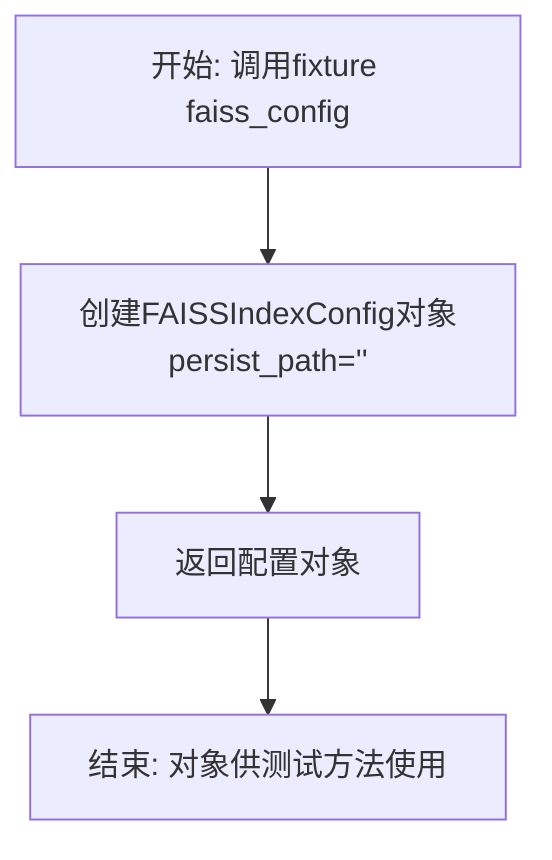

#### 带注释源码

```python
    @pytest.fixture
    # 定义名为`faiss_config`的pytest夹具
    def faiss_config(self):
        # 创建并返回一个FAISSIndexConfig实例，其持久化路径设置为空字符串
        # 此配置对象将在测试`test_create_faiss_index`中被使用
        return FAISSIndexConfig(persist_path="")
```

### `TestRAGIndexFactory.chroma_config`

这是一个用于测试的 Pytest fixture 方法，用于创建并返回一个 `ChromaIndexConfig` 配置对象。该配置对象模拟了使用 Chroma 向量数据库时所需的参数，主要用于在单元测试中为 `RAGIndexFactory.get_index` 方法提供输入。

参数：
-  `self`：`TestRAGIndexFactory`，当前测试类的实例，由 Pytest fixture 机制自动注入。

返回值：`ChromaIndexConfig`，一个配置对象，其 `persist_path` 和 `collection_name` 属性均被初始化为空字符串。

#### 流程图

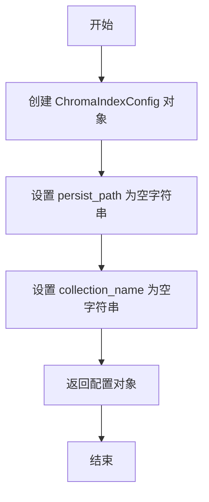

#### 带注释源码

```python
    @pytest.fixture
    # 定义一个名为 `chroma_config` 的 Pytest fixture。
    # 该 fixture 会在测试函数需要时被自动调用，其返回值（即此处的 ChromaIndexConfig 对象）会作为参数注入到测试函数中。
    def chroma_config(self):
        # 创建并返回一个 ChromaIndexConfig 实例。
        # `persist_path=""`: 将持久化路径设置为空字符串，模拟不进行持久化或使用默认路径的场景。
        # `collection_name=""`: 将集合名称设置为空字符串，模拟使用默认集合或未指定集合的场景。
        # 这两个空值在测试中通常会被 Mock 对象替代其实际功能。
        return ChromaIndexConfig(persist_path="", collection_name="")
```

### `TestRAGIndexFactory.bm25_config`

这是一个用于测试的 Pytest fixture 方法。它的核心功能是创建一个 `BM25IndexConfig` 配置对象，用于在 `TestRAGIndexFactory` 类的测试方法中模拟 BM25 索引的配置。该 fixture 被 `test_create_bm25_index` 方法使用，以测试 `RAGIndexFactory` 能否根据 BM25 配置正确创建索引。

参数：
-  `self`：`TestRAGIndexFactory`，指向当前测试类实例的引用。

返回值：`BM25IndexConfig`，一个配置对象，其中 `persist_path` 属性被设置为空字符串，用于模拟一个不持久化的 BM25 索引配置。

#### 流程图

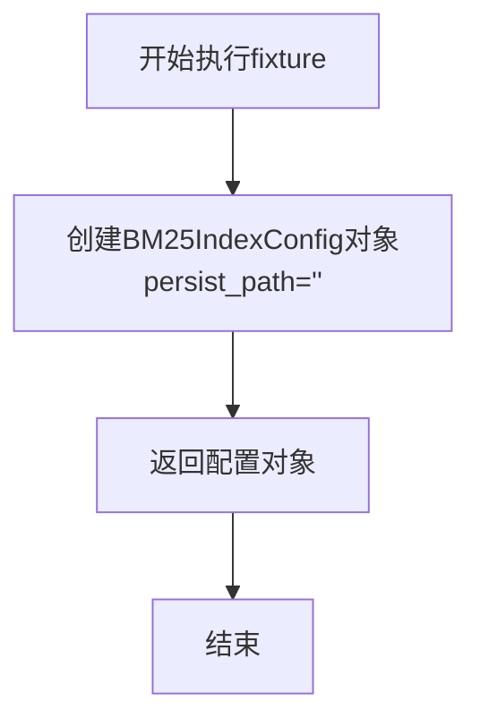

#### 带注释源码

```python
    @pytest.fixture
    # 定义一个名为 `bm25_config` 的 Pytest fixture。
    def bm25_config(self):
        # 创建并返回一个 BM25IndexConfig 对象。
        # 参数 `persist_path` 被设置为空字符串，这通常表示索引不进行持久化存储，
        # 或者其持久化路径在测试上下文中由其他方式指定。
        return BM25IndexConfig(persist_path="")
```

### `TestRAGIndexFactory.es_config`

这是一个测试夹具（fixture），用于为 `TestRAGIndexFactory` 测试类中的 `test_create_es_index` 方法创建并提供一个 `ElasticsearchIndexConfig` 实例。它使用 `pytest-mock` 来模拟依赖项，确保测试的隔离性。

参数：

- `mocker`：`pytest_mock.MockerFixture`，pytest-mock 插件提供的模拟对象，用于在测试中创建和管理模拟（mock）对象。

返回值：`ElasticsearchIndexConfig`，一个配置对象，用于测试 Elasticsearch 索引的创建逻辑。

#### 流程图

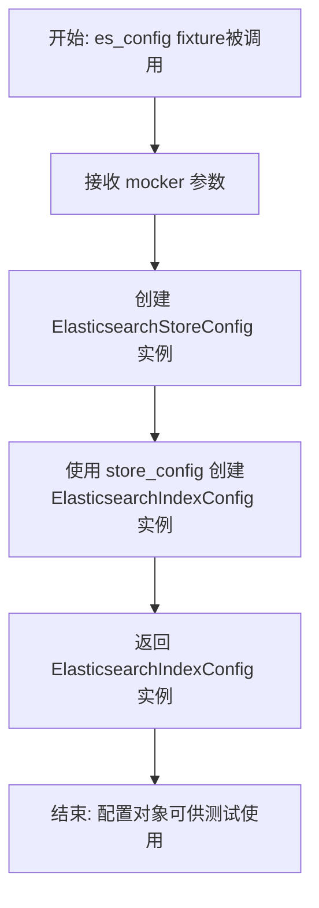

#### 带注释源码

```python
    @pytest.fixture
    # 定义了一个名为 `es_config` 的 pytest 夹具。
    # `mocker` 参数由 pytest-mock 插件自动注入，用于模拟。
    def es_config(self, mocker):
        # 创建一个 ElasticsearchStoreConfig 实例（使用默认参数）。
        # 然后使用这个 store_config 创建一个 ElasticsearchIndexConfig 实例。
        # 这个配置对象将被传递给 `test_create_es_index` 测试方法。
        return ElasticsearchIndexConfig(store_config=ElasticsearchStoreConfig())
```

### `TestRAGIndexFactory.mock_storage_context`

这是一个用于测试的 Pytest fixture 函数。它的核心功能是创建一个模拟（mock）对象，用于在单元测试中替换 `metagpt.rag.factories.index.StorageContext.from_defaults` 方法。通过模拟这个方法，测试用例可以隔离对 `RAGIndexFactory.get_index` 方法的测试，避免实际创建存储上下文和依赖外部存储系统，从而确保测试的快速、稳定和可重复性。

参数：

- `mocker`：`pytest-mock` 提供的 `MockerFixture` 类型对象，用于创建和管理模拟对象。

返回值：`unittest.mock.MagicMock`，返回一个被模拟的 `StorageContext.from_defaults` 方法对象。在测试中，这个模拟对象可以被配置其行为（如返回值）并验证其调用情况。

#### 流程图

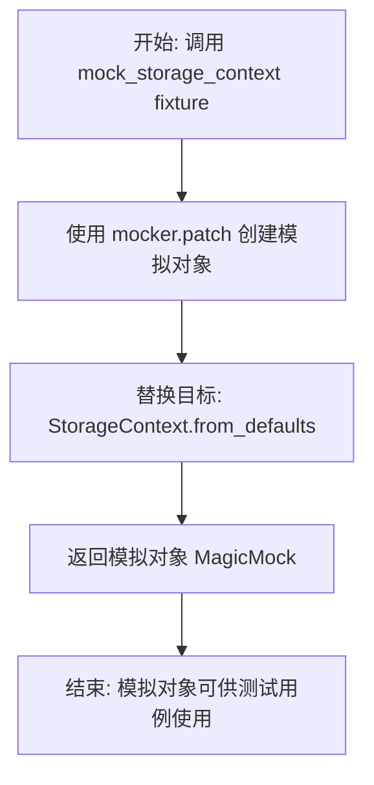

#### 带注释源码

```python
    @pytest.fixture
    # 定义一个名为 `mock_storage_context` 的 Pytest fixture。
    # `mocker` 参数由 pytest-mock 插件自动注入，它提供了模拟功能。
    def mock_storage_context(self, mocker):
        # 使用 `mocker.patch` 方法对指定的目标进行模拟。
        # 目标字符串 `"metagpt.rag.factories.index.StorageContext.from_defaults"` 指定了要模拟的模块和方法。
        # `patch` 会临时将原方法替换为一个 `MagicMock` 对象，并返回这个模拟对象。
        # 这个 fixture 的返回值就是这个模拟对象，它可以在使用此 fixture 的测试函数中被访问和配置。
        return mocker.patch("metagpt.rag.factories.index.StorageContext.from_defaults")
```

### `TestRAGIndexFactory.mock_load_index_from_storage`

这是一个用于测试的 Pytest fixture，它模拟（mock）了 `metagpt.rag.factories.index` 模块中的 `load_index_from_storage` 函数。它的主要目的是在单元测试中隔离 `RAGIndexFactory.get_index` 方法对底层存储加载逻辑的依赖，确保测试专注于 `RAGIndexFactory` 自身的逻辑。

参数：

- `mocker`：`pytest-mock` 提供的 `MockerFixture` 类型对象，用于创建和管理模拟对象。

返回值：`unittest.mock.MagicMock`，一个被模拟的 `load_index_from_storage` 函数对象，可以在测试用例中被断言其调用情况。

#### 流程图

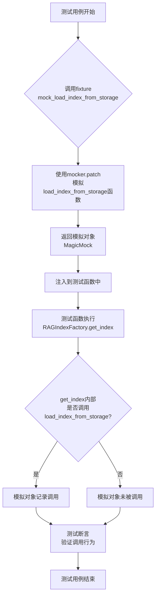

#### 带注释源码

```python
    @pytest.fixture
    # 定义一个名为 `mock_load_index_from_storage` 的 Pytest fixture。
    # `mocker` 参数由 pytest-mock 插件自动注入，它是一个用于创建模拟对象的工具。
    def mock_load_index_from_storage(self, mocker):
        # 使用 `mocker.patch` 方法来模拟（替换）目标函数。
        # 目标路径是 "metagpt.rag.factories.index.load_index_from_storage"。
        # 这意味着在此fixture生效的作用域内，任何导入自该模块的 `load_index_from_storage` 函数
        # 都会被替换成一个 `unittest.mock.MagicMock` 对象。
        # 这个模拟对象会被自动注入到使用此fixture的测试函数中。
        return mocker.patch("metagpt.rag.factories.index.load_index_from_storage")
```

### `TestRAGIndexFactory.mock_from_vector_store`

这是一个用于单元测试的pytest fixture，它的主要作用是模拟（mock）`VectorStoreIndex.from_vector_store`方法。在测试`RAGIndexFactory`创建Chroma和Elasticsearch索引时，它会拦截对该方法的实际调用，并返回一个模拟对象，从而将测试焦点隔离在`RAGIndexFactory`的逻辑上，而不依赖于外部向量存储库的实际连接和操作。

参数：

- `mocker`：`pytest_mock.plugin.MockerFixture`，pytest-mock插件提供的mocker fixture，用于创建和管理模拟对象。

返回值：`unittest.mock.MagicMock`，返回一个对`metagpt.rag.factories.index.VectorStoreIndex.from_vector_store`方法的模拟对象。

#### 流程图

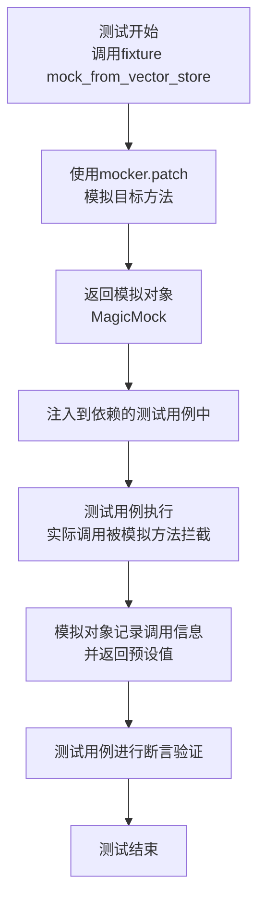

#### 带注释源码

```python
@pytest.fixture
def mock_from_vector_store(self, mocker):
    # 使用mocker.patch来模拟（替换）'metagpt.rag.factories.index'模块中的
    # 'VectorStoreIndex.from_vector_store' 方法。
    # 当测试代码调用这个方法时，实际执行的是这个fixture返回的MagicMock对象。
    # 这允许测试验证该方法是否被正确调用，而无需真正连接到一个向量数据库。
    return mocker.patch("metagpt.rag.factories.index.VectorStoreIndex.from_vector_store")
```

### `TestRAGIndexFactory.mock_embedding`

这是一个用于测试的Pytest fixture，它创建并返回一个`MockEmbedding`对象。该对象模拟了嵌入模型的行为，用于在单元测试中替代真实的嵌入模型，以避免对外部服务的依赖，并确保测试的快速和稳定。

参数：

- 无显式参数。作为Pytest fixture，它接收`pytest`框架注入的fixture上下文。

返回值：`llama_index.core.embeddings.MockEmbedding`，一个模拟的嵌入模型实例，其嵌入维度被设置为1。

#### 流程图

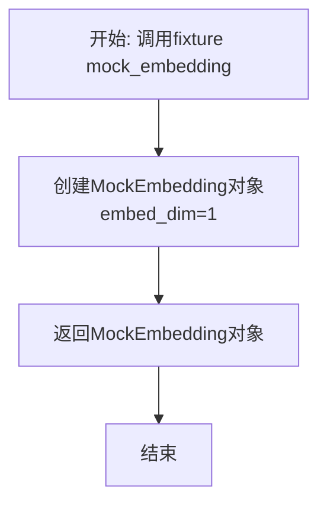

#### 带注释源码

```python
    @pytest.fixture
    def mock_embedding(self):
        # 创建一个MockEmbedding对象，embed_dim参数指定了模拟嵌入向量的维度。
        # 这里设置为1，意味着生成的每个嵌入向量都是1维的，这足以满足大多数测试场景，
        # 同时保持了简单和高效。
        return MockEmbedding(embed_dim=1)
```

### `TestRAGIndexFactory.test_create_faiss_index`

该方法是一个单元测试，用于验证 `RAGIndexFactory.get_index` 方法在传入 `FAISSIndexConfig` 配置时，能够正确地调用底层的 FAISS 向量存储库的创建逻辑。它通过模拟（Mock）相关依赖来隔离测试，确保索引创建流程中与 FAISS 相关的部分被正确触发。

参数：

- `self`：`TestRAGIndexFactory`，测试类实例的引用。
- `mocker`：`pytest-mock` 提供的 `MockerFixture`，用于创建和管理模拟对象。
- `faiss_config`：`FAISSIndexConfig`，一个 Pytest fixture，提供用于测试的 FAISS 索引配置对象。
- `mock_storage_context`：`MagicMock`，一个 Pytest fixture，模拟了 `StorageContext.from_defaults` 方法。
- `mock_load_index_from_storage`：`MagicMock`，一个 Pytest fixture，模拟了 `load_index_from_storage` 函数。
- `mock_embedding`：`MockEmbedding`，一个 Pytest fixture，提供模拟的嵌入模型。

返回值：`None`，这是一个测试方法，不返回业务值，其目的是通过断言（Assert）来验证行为。

#### 流程图

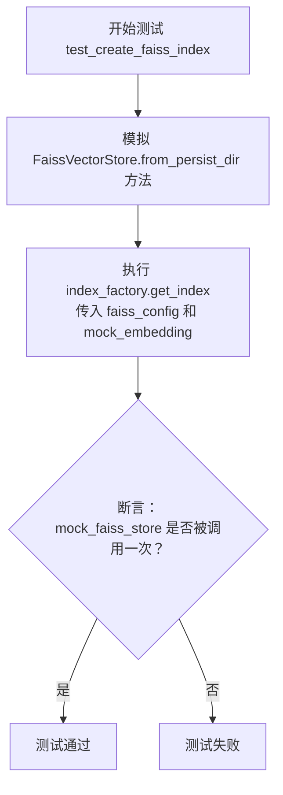

#### 带注释源码

```python
def test_create_faiss_index(
    self, mocker, faiss_config, mock_storage_context, mock_load_index_from_storage, mock_embedding
):
    # Mock
    # 模拟（Mock）`FaissVectorStore.from_persist_dir` 方法。
    # 这是测试的关键步骤，用于验证在创建FAISS索引时是否会调用此方法。
    mock_faiss_store = mocker.patch("metagpt.rag.factories.index.FaissVectorStore.from_persist_dir")

    # Exec
    # 执行被测试的核心方法：`RAGIndexFactory.get_index`。
    # 传入FAISS配置和模拟的嵌入模型，触发索引创建流程。
    self.index_factory.get_index(faiss_config, embed_model=mock_embedding)

    # Assert
    # 断言：验证 `FaissVectorStore.from_persist_dir` 方法被调用了一次。
    # 这确保了工厂方法正确地路由到了FAISS索引的创建逻辑。
    mock_faiss_store.assert_called_once()
```

### `TestRAGIndexFactory.test_create_bm25_index`

该方法用于测试 `RAGIndexFactory` 工厂类在给定 `BM25IndexConfig` 配置时，能否成功调用 `get_index` 方法来创建或加载一个基于 BM25 算法的索引。它是一个单元测试，不包含复杂的业务逻辑，主要目的是验证工厂方法在特定配置下的调用流程是否正常。

参数：

- `self`：`TestRAGIndexFactory`，测试类实例
- `mocker`：`pytest-mock` 提供的 `MockerFixture`，用于创建和管理测试中的模拟对象
- `bm25_config`：`BM25IndexConfig`，BM25索引的配置对象，由同名的 `pytest.fixture` 提供
- `mock_storage_context`：`MagicMock`，模拟的 `StorageContext.from_defaults` 方法，用于验证存储上下文是否被正确调用
- `mock_load_index_from_storage`：`MagicMock`，模拟的 `load_index_from_storage` 函数，用于验证是否尝试从存储加载索引
- `mock_embedding`：`MockEmbedding`，模拟的嵌入模型，用于索引创建过程

返回值：`None`，测试方法通常不返回有意义的值，其成功与否由断言或是否抛出异常决定。

#### 流程图

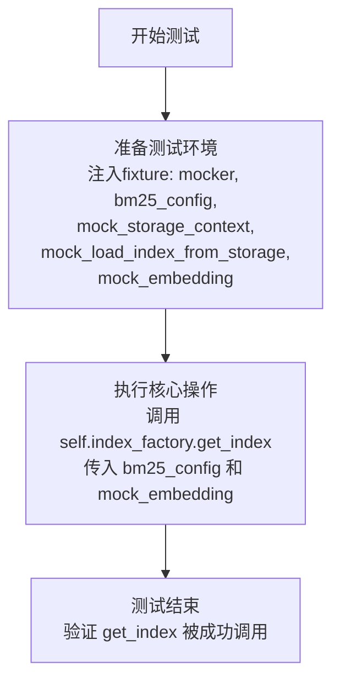

#### 带注释源码

```python
def test_create_bm25_index(
    self, mocker, bm25_config, mock_storage_context, mock_load_index_from_storage, mock_embedding
):
    # 测试方法：验证使用 BM25 配置创建索引的功能
    # 参数说明：
    #   self: 测试类实例
    #   mocker: pytest-mock 插件提供的模拟对象创建工具
    #   bm25_config: 由fixture提供的BM25索引配置对象
    #   mock_storage_context: 模拟的StorageContext.from_defaults方法
    #   mock_load_index_from_storage: 模拟的load_index_from_storage函数
    #   mock_embedding: 模拟的嵌入模型

    # 执行：调用索引工厂的get_index方法，传入BM25配置和模拟的嵌入模型。
    # 这是测试的核心操作，目的是验证在给定配置下，工厂方法能够被正常调用而不出错。
    # 该方法内部会处理索引的创建或加载逻辑（在本测试中被模拟）。
    self.index_factory.get_index(bm25_config, embed_model=mock_embedding)

    # 注意：此测试方法没有显式的断言（assert）。
    # 其测试成功依赖于以下条件：
    # 1. `get_index` 方法被成功调用且未抛出异常。
    # 2. 通过 `mocker` 注入的各个模拟对象（如 `mock_storage_context`, `mock_load_index_from_storage`）
    #    在 `get_index` 方法内部被适时调用。如果这些模拟对象未被调用或调用方式不符合预期，
    #    相关的模拟断言（在其他测试方法中常见）会失败，但在此方法中未设置。
    # 这是一种“冒烟测试”或“集成点测试”，确保代码路径可执行，更详细的验证可能在其他测试或依赖的模拟对象中完成。
```

### `TestRAGIndexFactory.test_create_chroma_index`

该方法是一个单元测试，用于验证 `RAGIndexFactory` 在给定 `ChromaIndexConfig` 配置时，能够正确地创建或加载一个 Chroma 向量数据库索引。它通过模拟（Mock）外部依赖来隔离测试，确保 `get_index` 方法能够调用正确的 Chroma 客户端和向量存储构造器。

参数：

- `self`：`TestRAGIndexFactory`，测试类实例的引用。
- `mocker`：`pytest-mock` 提供的 `MockerFixture`，用于创建和管理模拟对象。
- `chroma_config`：`ChromaIndexConfig`，一个 Pytest fixture，提供用于创建 Chroma 索引的配置对象。
- `mock_from_vector_store`：`MagicMock`，一个 Pytest fixture，模拟了 `VectorStoreIndex.from_vector_store` 方法。
- `mock_embedding`：`MockEmbedding`，一个 Pytest fixture，提供了一个模拟的嵌入模型。

返回值：`None`，单元测试方法不返回有意义的值，其目的是通过断言验证行为。

#### 流程图

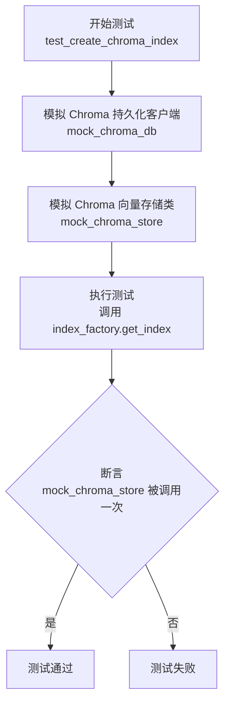

#### 带注释源码

```python
def test_create_chroma_index(self, mocker, chroma_config, mock_from_vector_store, mock_embedding):
    # Mock
    # 模拟 `chromadb.PersistentClient` 类，用于隔离对真实 Chroma 数据库的调用。
    mock_chroma_db = mocker.patch("metagpt.rag.factories.index.chromadb.PersistentClient")
    # 配置模拟客户端的方法 `get_or_create_collection` 返回一个模拟的集合对象。
    mock_chroma_db.get_or_create_collection.return_value = mocker.MagicMock()

    # 模拟 `ChromaVectorStore` 类，用于验证工厂是否尝试创建 Chroma 向量存储。
    mock_chroma_store = mocker.patch("metagpt.rag.factories.index.ChromaVectorStore")

    # Exec
    # 执行核心测试逻辑：调用索引工厂的 `get_index` 方法，传入 Chroma 配置和模拟的嵌入模型。
    self.index_factory.get_index(chroma_config, embed_model=mock_embedding)

    # Assert
    # 验证 `ChromaVectorStore` 的构造函数被调用了一次。
    # 这确保了工厂在给定 Chroma 配置时，正确地选择了 Chroma 作为后端存储。
    mock_chroma_store.assert_called_once()
```

### `TestRAGIndexFactory.test_create_es_index`

该方法是一个单元测试，用于验证 `RAGIndexFactory` 工厂类在给定 `ElasticsearchIndexConfig` 配置时，能够正确地创建或调用 Elasticsearch 索引。它通过模拟（Mock）外部依赖来隔离测试目标逻辑，确保 `get_index` 方法能够与 `ElasticsearchStore` 正确交互。

参数：

- `self`：`TestRAGIndexFactory`，测试类实例的引用。
- `mocker`：`pytest_mock.MockerFixture`，pytest-mock 插件提供的模拟对象，用于创建和管理测试中的模拟（Mock）对象。
- `es_config`：`ElasticsearchIndexConfig`，一个 Pytest fixture，返回一个用于测试的 Elasticsearch 索引配置对象。
- `mock_from_vector_store`：`unittest.mock.MagicMock`，一个 Pytest fixture，它模拟了 `VectorStoreIndex.from_vector_store` 方法，用于验证索引构建流程是否被正确调用。
- `mock_embedding`：`MockEmbedding`，一个 Pytest fixture，返回一个模拟的嵌入模型，用于在创建索引时提供文本向量化功能。

返回值：`None`，该测试方法不返回任何值，其目的是通过断言（assert）来验证代码行为。

#### 流程图

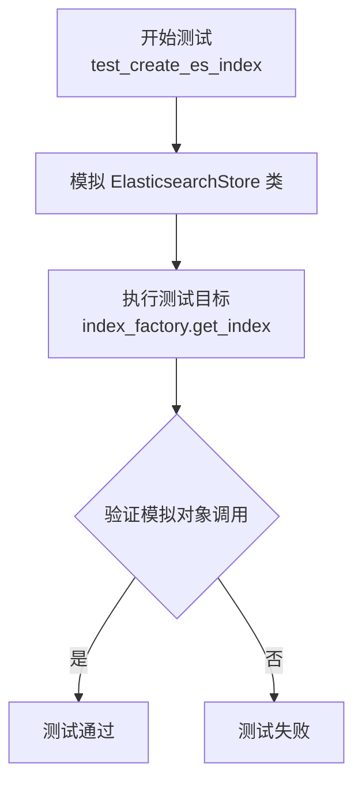

#### 带注释源码

```python
def test_create_es_index(self, mocker, es_config, mock_from_vector_store, mock_embedding):
    # Mock
    # 使用 mocker.patch 模拟 `metagpt.rag.factories.index.ElasticsearchStore` 类。
    # 这确保了在测试中不会创建真实的 Elasticsearch 连接，而是使用一个模拟对象来验证其是否被正确调用。
    mock_es_store = mocker.patch("metagpt.rag.factories.index.ElasticsearchStore")

    # Exec
    # 执行被测试的核心方法：使用工厂类，传入 Elasticsearch 配置和模拟的嵌入模型，尝试获取或创建索引。
    # 此调用应触发内部逻辑，最终尝试实例化或使用 `ElasticsearchStore`。
    self.index_factory.get_index(es_config, embed_model=mock_embedding)

    # Assert
    # 断言：验证模拟的 `ElasticsearchStore` 类是否被调用了一次。
    # 这是测试的关键，它确认了 `RAGIndexFactory.get_index` 方法在遇到 `ElasticsearchIndexConfig` 时，
    # 确实尝试创建了 `ElasticsearchStore` 实例，从而证明了配置解析和工厂分发逻辑的正确性。
    mock_es_store.assert_called_once()
```

## 关键组件

### RAGIndexFactory

一个用于创建和获取不同RAG（检索增强生成）索引的工厂类，支持多种后端存储（如FAISS、Chroma、BM25、Elasticsearch），根据传入的配置对象动态生成对应的索引实例。

### FAISSIndexConfig

FAISS向量索引的配置类，用于指定FAISS索引的持久化路径等参数。

### ChromaIndexConfig

Chroma向量数据库索引的配置类，用于指定Chroma的持久化路径和集合名称等参数。

### BM25IndexConfig

BM25检索索引的配置类，用于指定BM25索引的持久化路径等参数。

### ElasticsearchIndexConfig

Elasticsearch索引的配置类，包含一个ElasticsearchStoreConfig对象，用于配置Elasticsearch存储的相关参数。

### ElasticsearchStoreConfig

Elasticsearch存储的详细配置类，用于定义与Elasticsearch服务交互的具体设置。

### MockEmbedding

一个模拟的嵌入模型，用于测试场景，可以生成指定维度的伪嵌入向量。

## 问题及建议


### 已知问题

-   **测试用例对持久化路径和集合名称的模拟不完整**：`faiss_config`、`chroma_config`和`bm25_config`的fixture在创建配置对象时，`persist_path`和`collection_name`参数被设置为空字符串`""`。这可能导致被测试的`RAGIndexFactory.get_index`方法在尝试使用这些空路径或名称时，其内部逻辑（如检查路径是否存在、创建目录等）未被充分测试，或者在某些实现下可能引发意外错误，使得测试覆盖不全面。
-   **Elasticsearch配置的模拟过于简化**：`es_config`的fixture创建了一个几乎为空的`ElasticsearchStoreConfig`对象。这忽略了真实场景中必需的连接参数（如`hosts`, `index_name`等）。虽然当前测试可能仅关注对象创建流程，但这也意味着与Elasticsearch服务实际交互的配置验证、连接失败处理等逻辑未被测试，存在测试盲区。
-   **测试断言过于宽松，缺乏核心行为验证**：多个测试方法（如`test_create_bm25_index`）在执行被测方法后没有进行任何断言（`assert`语句）。这导致测试只能验证代码是否抛出运行时异常，而无法确认`get_index`方法是否按预期创建了正确的索引类型、是否正确调用了底层依赖等核心逻辑，降低了测试的有效性和可靠性。
-   **Mock对象的作用范围与验证可能不精确**：测试中大量使用`mocker.patch`来模拟依赖，但部分模拟（例如对`mock_storage_context`和`mock_load_index_from_storage`）在测试中并未被显式调用或验证。这可能导致测试意图不清晰，或者当被测试代码发生变更时，测试可能无法正确失败以指示问题。

### 优化建议

-   **使用更真实的测试配置数据**：为各个配置fixture提供有意义的、接近真实使用的测试值。例如，为`persist_path`设置一个临时目录路径（可使用`pytest`的`tmp_path` fixture），为`collection_name`设置一个明确的测试名称。这可以更全面地测试工厂方法处理实际参数的能力。
-   **完善Elasticsearch配置的测试数据**：在`es_config` fixture中，为`ElasticsearchStoreConfig`提供最小化的必要模拟参数（例如`hosts=["http://localhost:9200"]`, `index_name="test_index"`），即使它们不会被真正使用。这能使测试配置更完整，并提醒开发者相关配置项的存在。
-   **增强测试断言，聚焦行为验证**：在每个测试方法中，增加针对核心行为的断言。例如，验证是否调用了正确的向量存储构造函数、是否以预期的参数调用了关键方法（如`from_persist_dir`、`get_or_create_collection`）。对于`test_create_bm25_index`这类当前无断言的方法，应至少添加一个断言来确认`get_index`方法被成功调用且未出错，或者验证其返回结果（如果方法有返回）。
-   **精确化Mock的使用与验证**：审查每个Mock对象在测试中的必要性。如果某个Mock在测试中未被使用或验证，考虑移除对应的fixture或patch语句，以简化测试并提高可读性。对于需要使用的Mock，应明确验证其调用情况（如`assert_called_once_with`）以确保交互符合预期。
-   **考虑增加异常路径测试**：当前测试主要覆盖“正常创建”路径。建议补充测试用例，用于验证当传入无效配置、模拟依赖抛出异常时，`RAGIndexFactory.get_index`方法是否能进行适当的错误处理（例如抛出预期的异常类型）。


## 其它


### 设计目标与约束

本测试套件的设计目标是验证 `RAGIndexFactory` 类能够根据不同的索引配置（FAISS、Chroma、BM25、Elasticsearch）正确创建对应的索引实例。测试约束包括：1) 完全依赖模拟（Mock）来隔离外部依赖（如向量数据库、搜索引擎客户端），确保测试的单元性和执行速度；2) 使用 `pytest` 框架及其 `fixture` 机制来管理测试数据和模拟对象的生命周期，提高代码复用性和可维护性；3) 测试应覆盖工厂方法 `get_index` 与不同配置对象交互的核心路径，验证正确的底层存储对象被调用。

### 错误处理与异常设计

当前测试代码主要关注正常路径（Happy Path）的验证，通过模拟成功调用来断言行为。对于错误处理，测试中并未显式包含对异常情况的测试用例，例如传入无效配置、模拟依赖抛出异常等场景。这是测试覆盖的一个潜在缺口。一个健壮的测试套件应补充测试：1) 当 `persist_path` 无效时，相关向量存储（如 `FaissVectorStore.from_persist_dir`）是否会抛出预期异常，以及该异常是否被 `RAGIndexFactory.get_index` 适当处理或传播；2) 当外部服务（如 Elasticsearch）连接失败时，工厂方法的行为是否符合预期。

### 数据流与状态机

本测试的数据流是线性的、无状态的。每个测试方法 (`test_create_*_index`) 的流程为：1) **准备阶段**：通过 `@pytest.fixture` 注入模拟的配置对象和外部依赖（如 `mock_storage_context`, `mock_embedding`）；2) **执行阶段**：调用被测对象 `self.index_factory.get_index` 并传入特定配置；3) **验证阶段**：使用断言（如 `assert_called_once`）检查预期的底层模块（如 `FaissVectorStore`, `ChromaVectorStore`）是否被以正确的方式调用。测试类本身 (`TestRAGIndexFactory`) 没有内部状态在测试间共享（`autouse` 的 `setup` fixture 为每个测试新建工厂实例），确保了测试的独立性。

### 外部依赖与接口契约

测试明确识别并模拟了以下关键外部依赖，这些依赖也是 `RAGIndexFactory` 实现所必须遵守的接口契约：
1.  **向量存储库**：`FaissVectorStore`, `ChromaVectorStore`, `ElasticsearchStore`。测试验证工厂会调用这些类的特定构造方法（如 `from_persist_dir`）。
2.  **LlamaIndex 核心组件**：`StorageContext`, `load_index_from_storage`, `VectorStoreIndex.from_vector_store`。测试通过模拟这些组件，验证工厂是否正确使用了 LlamaIndex 框架的索引加载和构建流程。
3.  **数据库客户端**：`chromadb.PersistentClient`。测试模拟了 ChromaDB 客户端的交互，验证工厂能正确获取或创建集合。
4.  **嵌入模型**：`MockEmbedding`。测试使用一个模拟的嵌入模型，验证工厂能够接收并向下传递 `embed_model` 参数。
这些模拟点清晰地定义了 `RAGIndexFactory` 与外部系统交互的边界和预期行为。

    