# `.\MetaGPT\tests\metagpt\rag\factories\test_llm.py` 详细设计文档

该文件是一个测试文件，用于测试 RAGLLM 类及其工厂函数 get_rag_llm 的功能。RAGLLM 是一个包装类，它封装了一个底层的大语言模型（LLM）实例，并提供了与 llama-index 框架兼容的接口，用于检索增强生成（RAG）场景。测试验证了 RAGLLM 的元数据获取、同步/异步文本补全以及流式补全功能。

## 整体流程

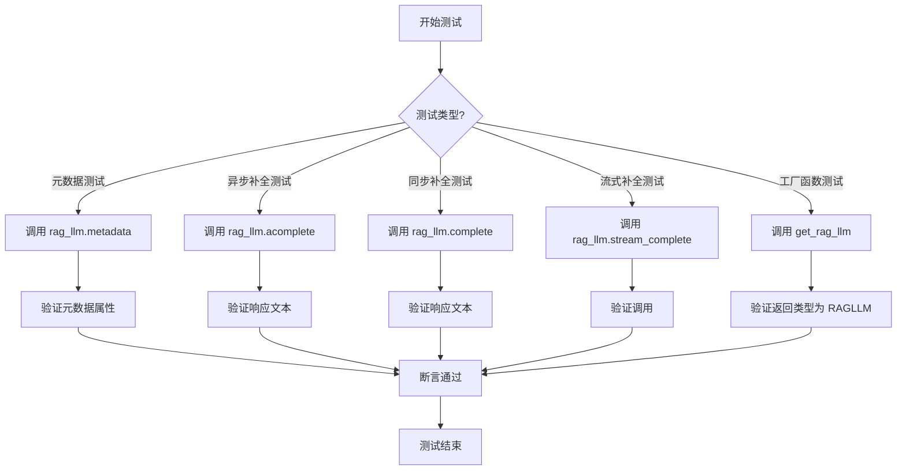

## 类结构

```
MockLLM (模拟LLM类，继承自BaseLLM)
├── __init__
├── _achat_completion
├── acompletion
├── completion
├── _achat_completion_stream
└── aask
TestRAGLLM (测试类)
├── mock_model_infer (fixture)
├── rag_llm (fixture)
├── test_metadata
├── test_acomplete
├── test_complete
└── test_stream_complete
test_get_rag_llm (全局测试函数)
```

## 全局变量及字段


    

## 全局函数及方法

### `test_get_rag_llm`

这是一个单元测试函数，用于测试 `get_rag_llm` 工厂函数。它验证当传入一个 `MockLLM` 实例时，`get_rag_llm` 函数能够正确返回一个 `RAGLLM` 类型的对象。

参数：
- 无显式参数。该函数是一个独立的测试用例，不接收外部参数。

返回值：`None`，该函数是一个测试用例，其主要目的是通过断言（assert）来验证代码行为，不返回业务逻辑相关的值。

#### 流程图

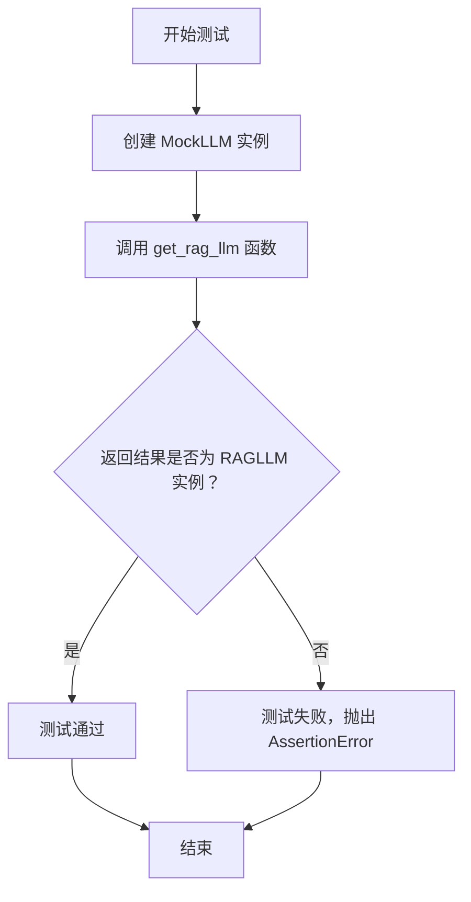

#### 带注释源码

```python
def test_get_rag_llm():
    # 步骤1：创建一个 MockLLM 的实例，作为 get_rag_llm 函数的输入参数。
    # MockLLM 是一个模拟的 LLM 类，用于在测试中替代真实的 LLM，避免依赖外部服务。
    result = get_rag_llm(MockLLM(config=LLMConfig()))
    
    # 步骤2：使用断言验证 get_rag_llm 函数的返回值。
    # 检查返回的 `result` 对象是否是 `RAGLLM` 类的一个实例。
    # 如果断言成功，则测试通过；如果失败，则抛出 AssertionError，表明函数行为不符合预期。
    assert isinstance(result, RAGLLM)
```

### `MockLLM.__init__`

该方法用于初始化 `MockLLM` 类的实例，接收一个 `LLMConfig` 配置对象，并调用父类 `BaseLLM` 的初始化方法。

参数：

- `config`：`LLMConfig`，用于配置大语言模型的参数对象。

返回值：`None`，无返回值。

#### 流程图

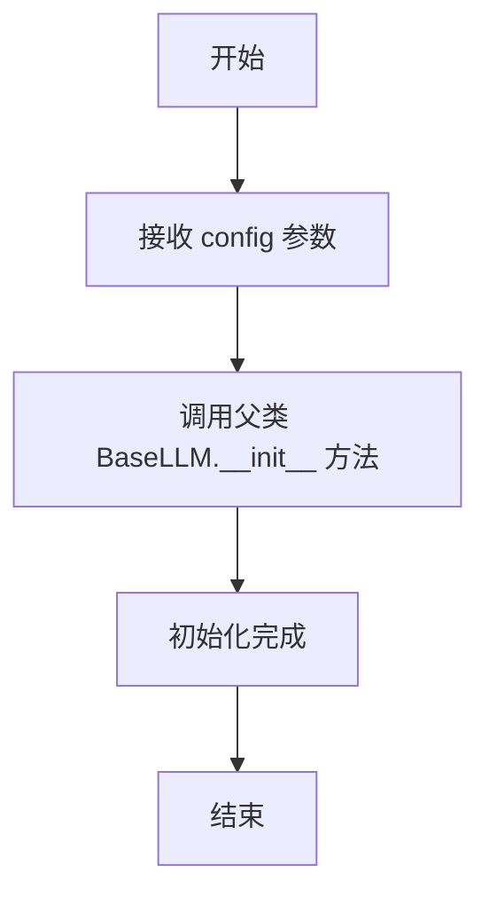

#### 带注释源码

```python
def __init__(self, config: LLMConfig):
    # 调用父类 BaseLLM 的初始化方法，传入配置对象 config
    super().__init__(config)
```

### `MockLLM._achat_completion`

该方法是一个异步方法，旨在由继承 `MockLLM` 的子类实现，用于处理聊天补全请求。在当前的 `MockLLM` 类中，它仅是一个占位符，没有实际功能。

参数：

- `messages`：`list[dict]`，包含聊天消息的列表，每个消息是一个字典。
- `timeout`：`int`，请求的超时时间，默认值为 `USE_CONFIG_TIMEOUT`。

返回值：`None`，该方法没有返回值。

#### 流程图

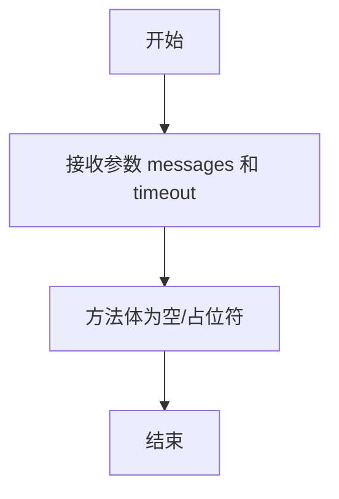

#### 带注释源码

```python
async def _achat_completion(self, messages: list[dict], timeout=USE_CONFIG_TIMEOUT):
    """_achat_completion implemented by inherited class"""
    # 该方法是一个占位符，需要由继承 MockLLM 的子类来实现具体的聊天补全逻辑。
    # 参数 messages 是消息列表，timeout 是超时设置。
    # 当前实现为空，不执行任何操作。
```

### `MockLLM.acompletion`

该方法是一个异步方法，用于模拟大语言模型（LLM）的异步文本补全操作。它接收一个消息列表和可选的超时参数，并始终返回一个固定的字符串 "ok"，主要用于单元测试场景，以验证调用流程而不依赖真实的外部LLM服务。

参数：

- `messages`：`list[dict]`，包含对话历史的消息列表，每个消息是一个字典，通常包含 "role" 和 "content" 等键。
- `timeout`：`int`，可选参数，指定请求的超时时间，默认值为 `USE_CONFIG_TIMEOUT`。

返回值：`str`，一个固定的字符串 "ok"，表示模拟的LLM响应。

#### 流程图

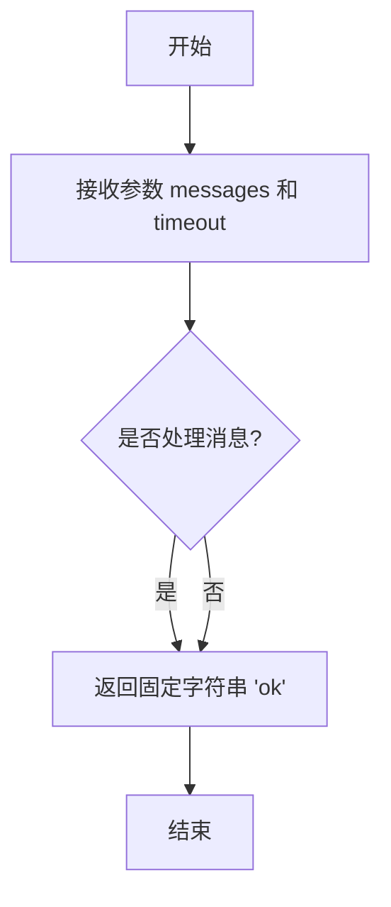

#### 带注释源码

```python
async def acompletion(self, messages: list[dict], timeout=USE_CONFIG_TIMEOUT):
    # 这是一个模拟的异步补全方法。
    # 它忽略传入的 `messages` 和 `timeout` 参数，直接返回一个固定的响应 "ok"。
    # 这使得它非常适合在不需要真实LLM响应的单元测试中使用。
    return "ok"
```

### `MockLLM.completion`

该方法是一个同步的文本补全方法，用于模拟LLM（大语言模型）的同步响应。它接收一个消息列表和可选的超时参数，并始终返回一个固定的字符串 "ok"，主要用于测试场景。

参数：

- `messages`：`list[dict]`，包含对话历史的消息列表，每个消息是一个字典。
- `timeout`：`int`，请求的超时时间，默认值为 `USE_CONFIG_TIMEOUT`。

返回值：`str`，始终返回字符串 "ok"。

#### 流程图

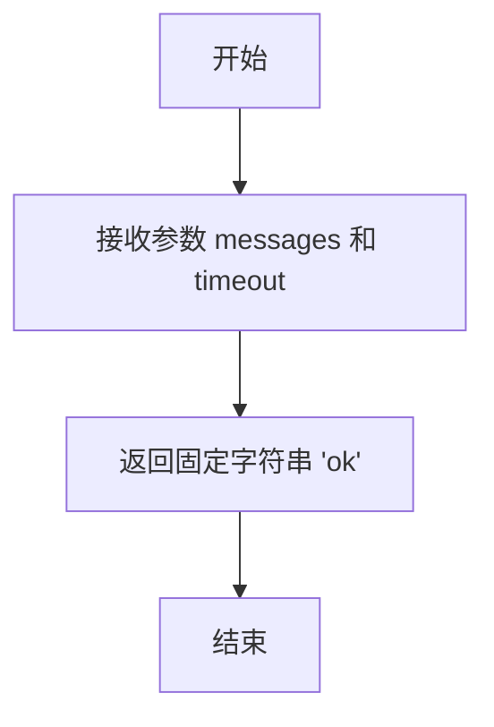

#### 带注释源码

```python
def completion(self, messages: list[dict], timeout=USE_CONFIG_TIMEOUT):
    # 这是一个模拟的同步补全方法。
    # 它忽略所有输入参数，直接返回一个固定的响应。
    # 主要用于单元测试，以避免调用真实的外部API。
    return "ok"
```

### `MockLLM._achat_completion_stream`

该方法是一个异步方法，用于模拟大语言模型（LLM）的流式聊天完成功能。它是 `MockLLM` 类的一个占位实现，旨在被子类重写以提供具体的流式响应逻辑。当前实现仅定义了方法签名和文档字符串，没有实际的业务逻辑。

参数：

- `messages`：`list[dict]`，包含对话消息的列表，通常每个字典代表一条消息，包含如 `role` 和 `content` 等键。
- `timeout`：`int`，默认为 `USE_CONFIG_TIMEOUT`，指定请求的超时时间（以秒为单位）。

返回值：`str`，返回一个字符串，表示流式响应的结果。当前实现返回一个空字符串。

#### 流程图

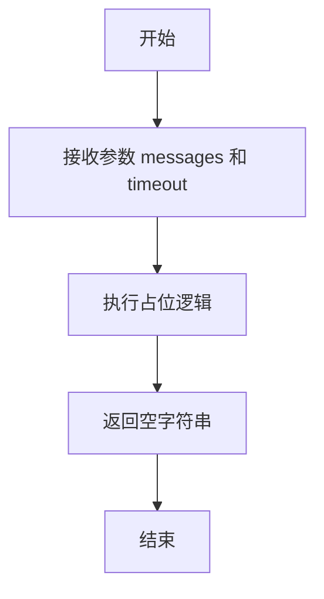

#### 带注释源码

```python
async def _achat_completion_stream(self, messages: list[dict], timeout: int = USE_CONFIG_TIMEOUT) -> str:
    """_achat_completion_stream implemented by inherited class"""
    # 这是一个占位方法，需要由继承 MockLLM 的子类来实现具体的流式聊天完成逻辑。
    # 参数 messages 是消息列表，timeout 是超时设置。
    # 返回值应为流式响应的字符串结果。
    return ""
```

### `MockLLM.aask`

该方法是一个异步方法，用于向大语言模型（LLM）发起一个询问请求。它支持多种输入格式，包括纯文本、消息列表，并可选择性地提供系统消息、格式化消息和图像。该方法始终返回一个固定的字符串 "ok"，主要用于测试场景。

参数：

- `msg`：`Union[str, list[dict[str, str]]]`，用户的问题或指令，可以是字符串，也可以是符合OpenAI API格式的消息字典列表。
- `system_msgs`：`Optional[list[str]]`，可选的系统消息列表，用于在对话中设置系统角色或提供上下文。
- `format_msgs`：`Optional[list[dict[str, str]]]`，可选的格式化消息列表，用于预定义对话的格式或结构。
- `images`：`Optional[Union[str, list[str]]]`，可选的图像输入，可以是单个图像路径字符串或图像路径列表，用于支持多模态模型。
- `timeout`：`int`，请求的超时时间，默认使用配置中的超时设置。
- `stream`：`bool`，是否启用流式响应。在此Mock实现中，此参数被忽略。

返回值：`str`，一个固定的字符串 "ok"，表示模拟的LLM响应。

#### 流程图

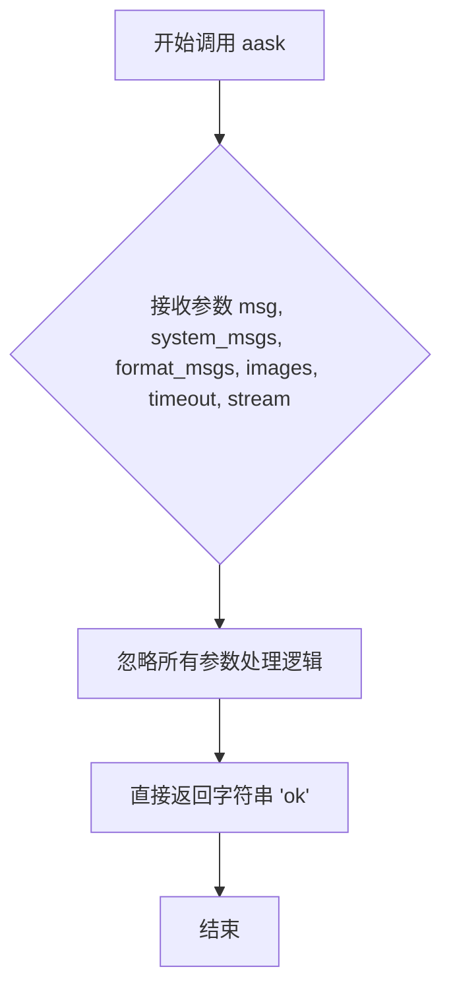

#### 带注释源码

```python
async def aask(
    self,
    # 用户的问题或指令，支持字符串或消息列表格式
    msg: Union[str, list[dict[str, str]]],
    # 可选的系统消息列表，用于设定对话背景
    system_msgs: Optional[list[str]] = None,
    # 可选的格式化消息列表，用于预定义对话结构
    format_msgs: Optional[list[dict[str, str]]] = None,
    # 可选的图像输入，支持单张或多张图片
    images: Optional[Union[str, list[str]]] = None,
    # 请求超时时间，默认使用全局配置
    timeout=USE_CONFIG_TIMEOUT,
    # 是否启用流式响应（在此Mock实现中未使用）
    stream=True,
) -> str:
    # Mock实现：直接返回固定的成功响应字符串，不进行任何实际处理
    return "ok"
```

### `TestRAGLLM.mock_model_infer`

`mock_model_infer` 是 `TestRAGLLM` 测试类中的一个 `pytest` 夹具（fixture）。它的核心功能是创建一个 `MockLLM` 的模拟实例，用于在单元测试中替代真实的 LLM 推理模型，从而隔离测试环境，确保 `RAGLLM` 类的测试不依赖于外部服务。

参数：
- 无显式参数。作为 `pytest.fixture`，它由 `pytest` 框架自动调用和管理。

返回值：`MockLLM`，一个模拟的 `BaseLLM` 子类实例，用于在测试中提供预定义的、确定性的响应。

#### 流程图

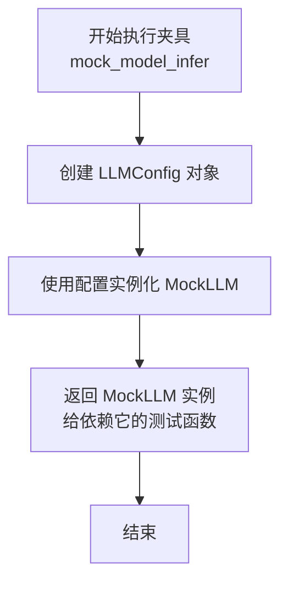

#### 带注释源码

```python
    @pytest.fixture
    # 定义一个名为 `mock_model_infer` 的 pytest 夹具。
    # 夹具是 pytest 的核心功能之一，用于提供测试所需的依赖项。
    # 这个夹具没有参数，意味着它不依赖于其他夹具。
    def mock_model_infer(self):
        # 夹具的主体函数。当测试函数请求 `mock_model_infer` 夹具时，会执行此函数。
        # 函数内部创建并返回一个 `MockLLM` 实例。
        return MockLLM(config=LLMConfig())
        # 1. `LLMConfig()`: 创建一个默认配置的 `LLMConfig` 对象。
        #    这通常包含模型名称、API密钥、超时设置等，但在测试中常使用默认或空值。
        # 2. `MockLLM(config=...)`: 使用上一步创建的配置对象来实例化 `MockLLM` 类。
        #    `MockLLM` 是一个模拟类，它重写了 `BaseLLM` 的异步和同步聊天、完成等方法，
        #    使其返回固定的字符串（如 "ok"），而不是调用真实的外部 API。
        # 3. `return`: 将创建好的 `MockLLM` 实例返回。
        #    任何在参数列表中声明了 `mock_model_infer` 的测试函数（如 `test_acomplete`）
        #    都会接收到这个实例作为参数，从而在测试中使用这个模拟对象。
```

### `TestRAGLLM.rag_llm`

这是一个 Pytest 测试夹具（fixture），用于为 `TestRAGLLM` 测试类中的测试方法提供 `RAGLLM` 类的实例。它依赖于另一个夹具 `mock_model_infer` 来获取一个模拟的 `BaseLLM` 实例，并以此构建 `RAGLLM` 对象，确保测试环境与真实 LLM 服务解耦。

参数：

- `mock_model_infer`：`MockLLM`，一个模拟的 `BaseLLM` 实例，用于作为 `RAGLLM` 的底层模型推理引擎。

返回值：`RAGLLM`，一个配置了模拟底层模型的 `RAGLLM` 实例，用于后续的单元测试。

#### 流程图

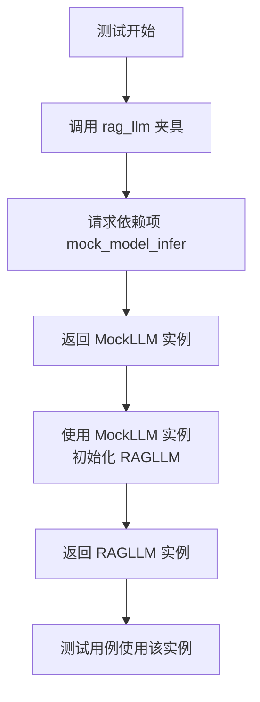

#### 带注释源码

```python
    @pytest.fixture
    # 定义了一个名为 'rag_llm' 的 Pytest 夹具。
    def rag_llm(self, mock_model_infer):
        # 该夹具接收一个参数 'mock_model_infer'，这是另一个夹具提供的 MockLLM 实例。
        # 使用这个模拟的模型推理器来实例化 RAGLLM 类。
        return RAGLLM(model_infer=mock_model_infer)
        # 返回新创建的 RAGLLM 实例，供依赖此夹具的测试函数使用。
```

### `TestRAGLLM.test_metadata`

该方法是一个单元测试，用于验证 `RAGLLM` 类的 `metadata` 属性。它检查该属性是否为 `LLMMetadata` 类型的实例，并且其 `context_window`、`num_output` 和 `model_name` 字段的值是否与 `RAGLLM` 实例的对应属性值一致。

参数：

- `rag_llm`：`RAGLLM`，通过 `@pytest.fixture` 装饰器提供的 `RAGLLM` 测试实例。

返回值：`None`，这是一个测试方法，不返回任何值，仅通过断言来验证测试结果。

#### 流程图

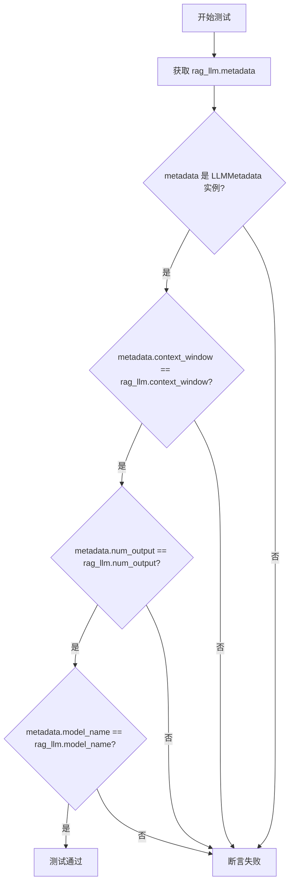

#### 带注释源码

```python
def test_metadata(self, rag_llm):
    # 从 RAGLLM 实例中获取 metadata 属性
    metadata = rag_llm.metadata
    # 断言 metadata 是 LLMMetadata 类型的实例
    assert isinstance(metadata, LLMMetadata)
    # 断言 metadata 的 context_window 属性值与 rag_llm 的 context_window 属性值相等
    assert metadata.context_window == rag_llm.context_window
    # 断言 metadata 的 num_output 属性值与 rag_llm 的 num_output 属性值相等
    assert metadata.num_output == rag_llm.num_output
    # 断言 metadata 的 model_name 属性值与 rag_llm 的 model_name 属性值相等
    assert metadata.model_name == rag_llm.model_name
```

### `TestRAGLLM.test_acomplete`

这是一个使用 `pytest` 框架编写的异步单元测试方法，用于测试 `RAGLLM` 类的 `acomplete` 方法。它验证了当调用 `RAGLLM.acomplete` 方法时，其内部封装的 `MockLLM` 实例的 `acompletion` 方法会被正确调用，并返回预期的结果。

参数：

- `rag_llm`：`RAGLLM`，由 `@pytest.fixture` 提供的 `RAGLLM` 测试实例，其内部使用 `MockLLM` 作为推理模型。
- `mock_model_infer`：`MockLLM`，由 `@pytest.fixture` 提供的 `MockLLM` 模拟实例，用于验证 `RAGLLM.acomplete` 是否调用了底层模型的异步完成方法。

返回值：`None`，这是一个测试方法，其主要目的是通过断言（`assert`）来验证功能，不返回业务值。

#### 流程图

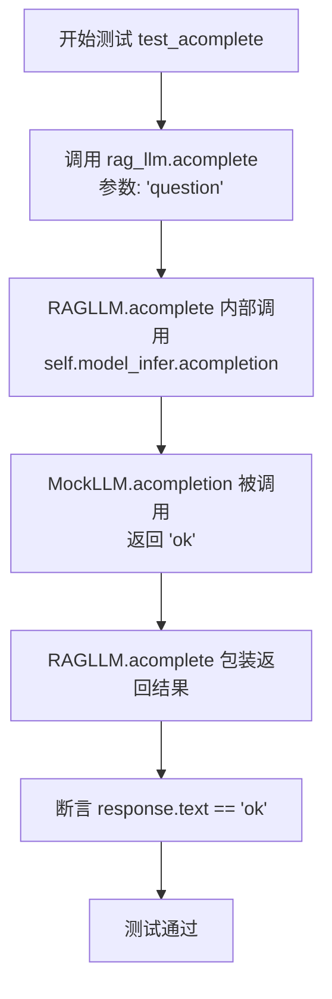

#### 带注释源码

```python
    @pytest.mark.asyncio  # 标记此测试用例为异步函数，以便pytest能正确处理
    async def test_acomplete(self, rag_llm, mock_model_infer):
        # 调用被测试对象 RAGLLM 的异步 complete 方法，传入测试问题 'question'
        response = await rag_llm.acomplete("question")
        # 断言：验证返回的 response 对象的 text 属性等于 'ok'
        # 这间接验证了 rag_llm.acomplete 正确调用了 mock_model_infer.acompletion 并返回了其结果
        assert response.text == "ok"
```

### `TestRAGLLM.test_complete`

这是一个使用 `pytest` 框架编写的单元测试方法，用于测试 `RAGLLM` 类的 `complete` 方法。它验证了当调用 `RAGLLM.complete` 方法并传入一个查询字符串时，能够正确返回一个包含预期文本的响应对象。

参数：

- `rag_llm`：`RAGLLM`，通过 `pytest` 夹具注入的 `RAGLLM` 测试实例。
- `mock_model_infer`：`MockLLM`，通过 `pytest` 夹具注入的模拟 `BaseLLM` 实例，用于提供预定义的响应。

返回值：`None`，这是一个测试方法，不返回业务值，其成功与否由断言决定。

#### 流程图

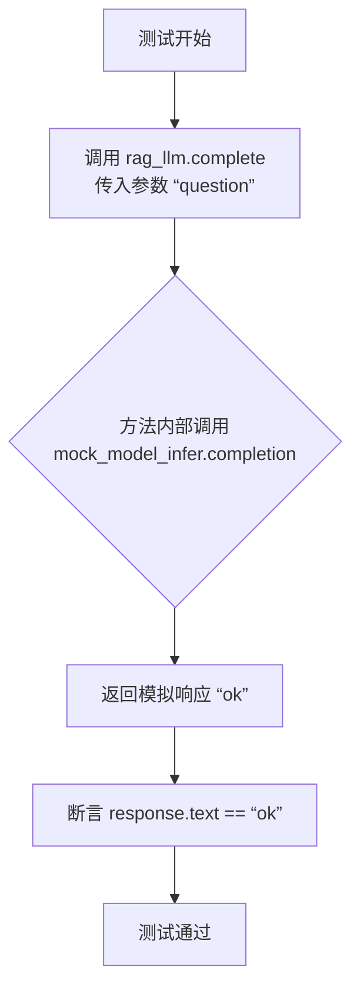

#### 带注释源码

```python
def test_complete(self, rag_llm, mock_model_infer):
    # 调用被测试对象 RAGLLM 的同步 complete 方法，并传入测试查询字符串 "question"
    response = rag_llm.complete("question")
    # 断言：验证返回的响应对象中的 text 属性是否等于模拟 LLM 返回的 "ok"
    assert response.text == "ok"
```

### `TestRAGLLM.test_stream_complete`

该方法是一个单元测试，用于测试 `RAGLLM` 类的 `stream_complete` 方法。它通过调用 `rag_llm.stream_complete("question")` 来验证流式完成功能是否能够被正常调用，而不会抛出异常。测试本身不验证返回的流式数据内容，仅验证方法调用的成功性。

参数：

-  `self`：`TestRAGLLM`，测试类实例的引用
-  `rag_llm`：`RAGLLM`，通过 `@pytest.fixture` 注入的 `RAGLLM` 实例，用于执行测试
-  `mock_model_infer`：`MockLLM`，通过 `@pytest.fixture` 注入的模拟 `BaseLLM` 实例，作为 `RAGLLM` 的底层模型

返回值：`None`，单元测试方法通常不返回值，其成功与否由断言或是否抛出异常决定

#### 流程图

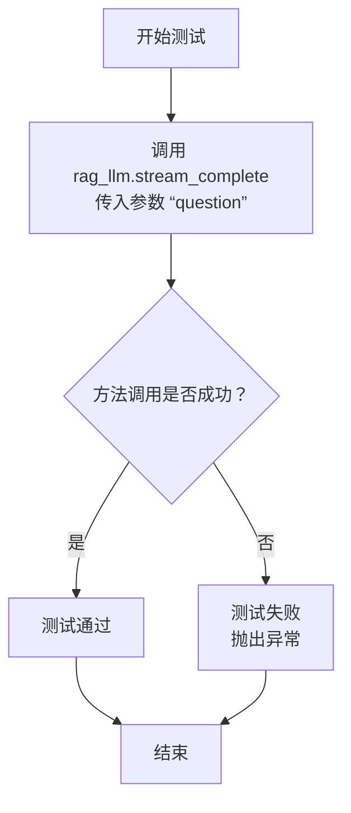

#### 带注释源码

```
def test_stream_complete(self, rag_llm, mock_model_infer):
    # 调用 RAGLLM 实例的 stream_complete 方法，传入测试问题 "question"
    # 此测试旨在验证 stream_complete 方法能够被正常调用，而不引发异常
    # 它不验证返回的流式数据内容，仅验证方法调用的接口可用性
    rag_llm.stream_complete("question")
```

## 关键组件


### RAGLLM

RAGLLM 是一个适配器类，它包装了一个基础的 LLM 实例（如 MockLLM），使其符合 llama_index 框架中 LLM 接口的规范，从而能够无缝集成到 RAG（检索增强生成）系统中。

### get_rag_llm

`get_rag_llm` 是一个工厂函数，用于接收一个基础 LLM 实例并返回一个配置好的 `RAGLLM` 适配器对象，简化了 RAG 系统中 LLM 组件的创建过程。

### MockLLM

MockLLM 是一个用于测试的模拟 LLM 类，它继承自 `BaseLLM` 并实现了其核心接口（如 `acompletion`, `completion`, `aask`），在测试中提供固定的响应（"ok"），用于验证 `RAGLLM` 和 `get_rag_llm` 的功能正确性，而无需依赖真实的外部模型服务。


## 问题及建议


### 已知问题

-   **测试覆盖不完整**：`test_stream_complete` 测试方法没有包含任何断言，仅调用了方法但没有验证其行为或输出，这可能导致流式处理逻辑中的潜在缺陷无法被检测到。
-   **模拟对象功能缺失**：`MockLLM` 类中的 `_achat_completion` 和 `_achat_completion_stream` 方法仅包含文档字符串，没有实现任何功能。虽然当前测试可能不依赖它们，但如果 `RAGLLM` 的内部实现未来发生变化并调用这些方法，测试将失败或产生不可预测的结果。
-   **硬编码返回值**：`MockLLM` 的 `acompletion` 和 `completion` 方法始终返回字符串 `"ok"`。这虽然简化了测试，但无法测试 `RAGLLM` 对不同模型响应（如结构化数据、错误信息、空响应）的处理逻辑，降低了测试的健壮性。
-   **配置对象创建简化**：在测试中创建 `LLMConfig()` 时使用了默认构造函数，没有传递任何配置参数。这无法测试 `RAGLLM` 或相关组件在不同配置（如不同的超时设置、模型名称）下的行为。

### 优化建议

-   **完善测试断言**：为 `test_stream_complete` 方法添加断言，验证流式返回的结果。例如，可以收集流式输出的片段并断言其最终内容或格式。
-   **增强模拟对象**：为 `MockLLM` 的 `_achat_completion` 和 `_achat_completion_stream` 方法提供最小化的实现（例如返回一个固定的字典或异步生成器），使其行为更接近真实对象，提高测试的可靠性。
-   **参数化测试数据**：使用 `@pytest.mark.parametrize` 为关键测试方法（如 `test_acomplete`, `test_complete`）提供多组测试数据，包括边界情况和异常输入，以验证 `RAGLLM` 在各种场景下的鲁棒性。
-   **测试配置多样性**：创建不同的 `LLMConfig` 实例（例如设置不同的 `timeout`、`model` 值）并传入 `get_rag_llm` 和 `RAGLLM`，测试工厂函数和类在不同配置下的初始化与行为是否正确。
-   **分离单元与集成关注点**：考虑将 `test_get_rag_llm` 中对 `MockLLM` 的依赖移除，改为直接测试 `get_rag_llm` 函数根据输入参数正确构造 `RAGLLM` 实例的逻辑，使其成为一个更纯粹的单位测试。


## 其它


### 设计目标与约束

该代码模块的核心设计目标是提供一个与 RAG（检索增强生成）框架集成的 LLM（大语言模型）包装器。其主要约束包括：1) 必须兼容 `llama_index.core.llms.LLM` 接口，以便无缝接入其生态系统；2) 需要包装一个符合 `BaseLLM` 接口的内部模型实例 (`model_infer`)，将外部调用委托给它；3) 作为测试代码，其设计需支持通过模拟 (`MockLLM`) 进行单元测试，确保核心逻辑正确性，而不依赖真实 LLM 服务。

### 错误处理与异常设计

当前代码中，错误处理主要依赖于底层 `model_infer` 对象（如 `MockLLM` 或真实的 `BaseLLM` 实现）的异常抛出。`RAGLLM` 类本身作为代理，未显式添加额外的错误处理逻辑。测试类 `TestRAGLLM` 使用 `pytest` 框架，通过断言 (`assert`) 来验证行为，测试失败即代表错误。潜在风险是，如果 `model_infer` 抛出未处理的异常，`RAGLLM` 会直接将其传播给调用者。对于生产环境，可能需要考虑在 `RAGLLM` 层添加统一的异常捕获、日志记录或重试机制。

### 数据流与状态机

数据流相对简单直接：外部调用者（如 RAG 检索器）调用 `RAGLLM` 的 `complete`、`acomplete` 或 `stream_complete` 方法。`RAGLLM` 将这些调用及其参数（如提示文本 `prompt`）转发给其内部持有的 `model_infer` 实例。`model_infer` 执行实际的 LLM 推理并返回结果（或流式响应），`RAGLLM` 再将此结果包装成 `llama_index` 所需的 `CompletionResponse` 格式返回。整个过程中，`RAGLLM` 自身是无状态的，其行为完全由 `model_infer` 和初始化的元数据（如 `context_window`）决定。

### 外部依赖与接口契约

1.  **llama_index.core.llms.LLM**: `RAGLLM` 继承自此抽象基类，必须实现其定义的接口（如 `complete`, `acomplete`, `stream_complete`, `metadata` 属性）。这是该模块存在的主要价值，使其能作为 LLM 被 `llama_index` 的其它组件（如检索器、查询引擎）使用。
2.  **metagpt.provider.base_llm.BaseLLM**: `RAGLLM` 通过 `model_infer` 字段依赖此接口。`get_rag_llm` 工厂函数也接受此类型的参数。这定义了与 MetaGPT 内部 LLM 提供者的契约。
3.  **pytest**: 测试套件 `TestRAGLLM` 和函数 `test_get_rag_llm` 依赖此测试框架来组织测试用例、使用固件 (`fixture`) 和进行异步测试 (`@pytest.mark.asyncio`)。
4.  **typing**: 用于类型注解，提高代码可读性和静态类型检查的支持。

### 测试策略与覆盖范围

测试策略聚焦于验证 `RAGLLM` 的适配器功能是否正确。`TestRAGLLM` 类使用 `MockLLM` 来模拟底层 LLM 的行为，确保测试不依赖外部服务且快速可靠。测试覆盖了：
*   **元数据 (`metadata`)**: 验证 `RAGLLM` 的属性是否正确映射到 `LLMMetadata`。
*   **同步完成 (`complete`)**: 验证同步调用委托给 `model_infer.completion` 并正确包装响应。
*   **异步完成 (`acomplete`)**: 验证异步调用委托给 `model_infer.acompletion` 并正确包装响应。
*   **流式完成 (`stream_complete`)**: 验证流式调用接口能被调用（当前测试未断言流内容）。
*   **工厂函数 (`get_rag_llm`)**: 验证工厂函数能正确创建 `RAGLLM` 实例。
测试未覆盖 `model_infer` 调用失败、`RAGLLM` 初始化参数无效等边界或异常场景。

    