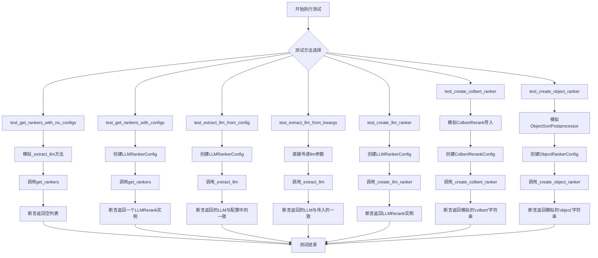
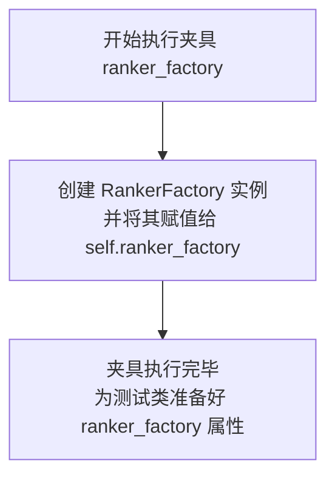
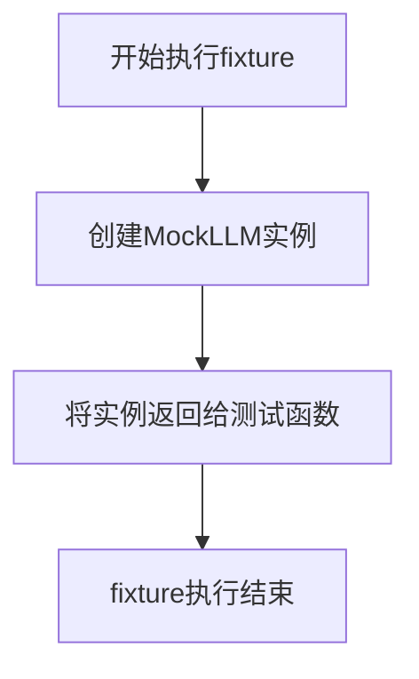
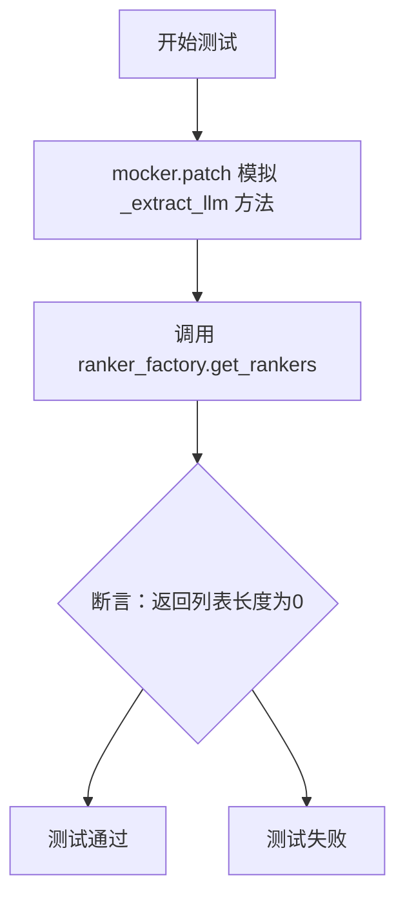
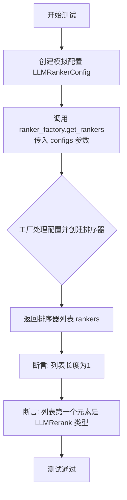
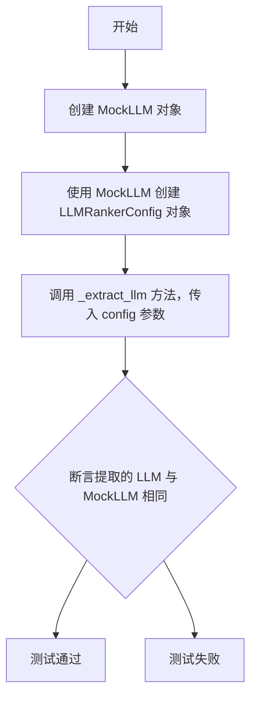
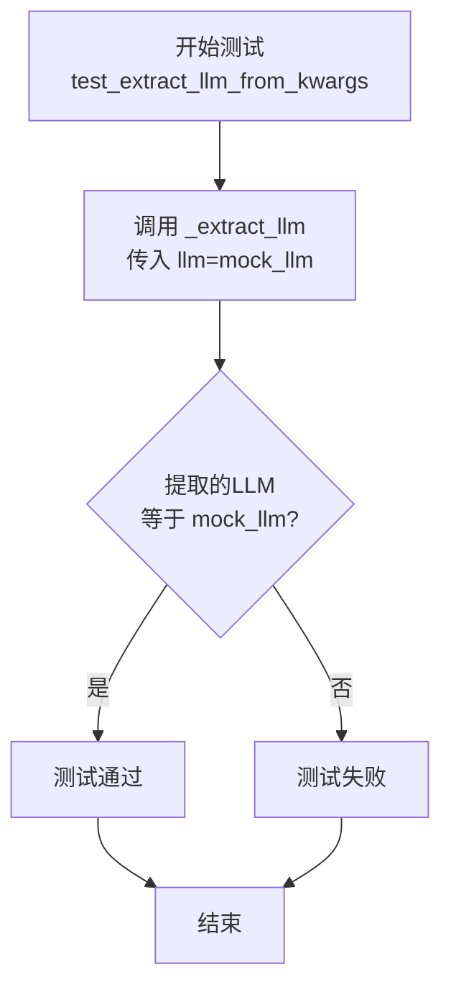
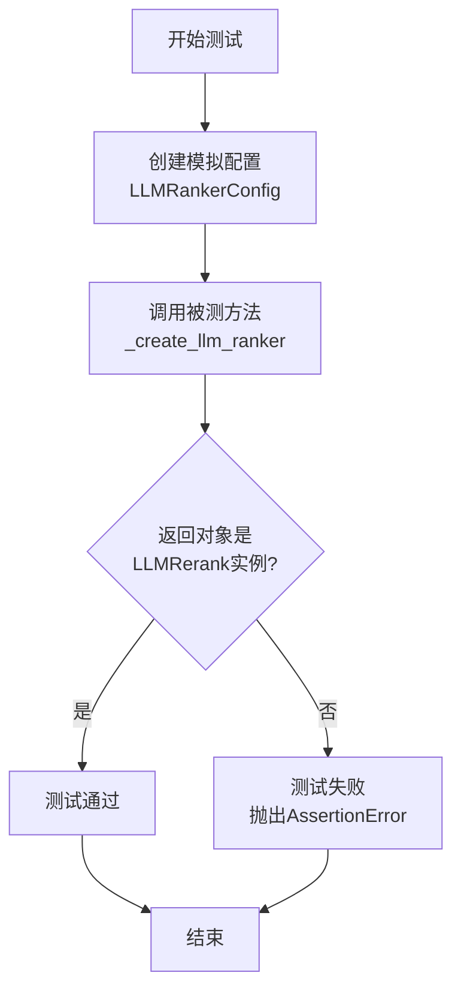
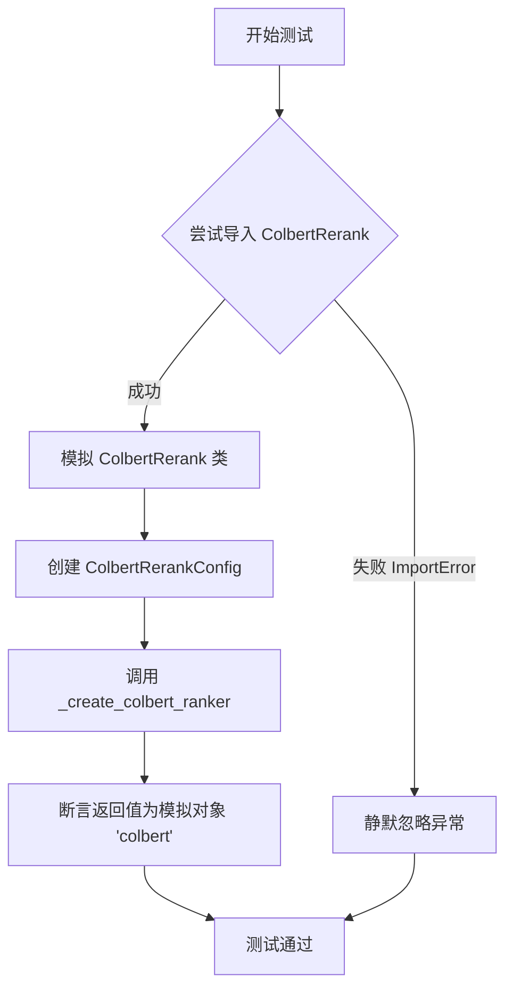
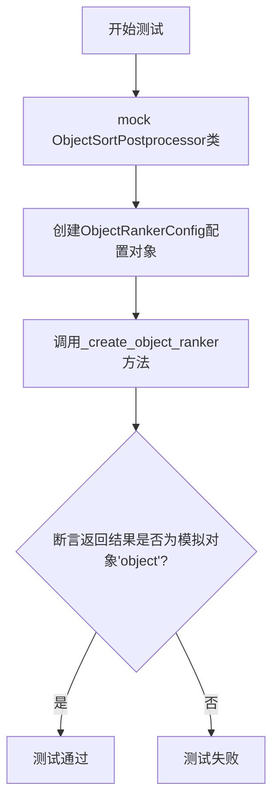

# `.\MetaGPT\tests\metagpt\rag\factories\test_ranker.py` 详细设计文档

这是一个使用pytest框架编写的单元测试文件，用于测试RankerFactory类。RankerFactory是一个工厂类，负责根据不同的配置创建和返回不同类型的排序器（ranker）。测试覆盖了工厂方法在无配置、有配置情况下的行为，以及从配置或关键字参数中提取LLM（大语言模型）的逻辑，并验证了三种具体排序器（LLM排序器、Colbert排序器和对象排序器）的创建过程。

## 整体流程



## 类结构

```
TestRankerFactory (测试类)
├── ranker_factory (fixture, 自动使用)
├── mock_llm (fixture)
├── test_get_rankers_with_no_configs (方法)
├── test_get_rankers_with_configs (方法)
├── test_extract_llm_from_config (方法)
├── test_extract_llm_from_kwargs (方法)
├── test_create_llm_ranker (方法)
├── test_create_colbert_ranker (方法)
└── test_create_object_ranker (方法)
```

## 全局变量及字段


### `TestRankerFactory.ranker_factory`
    
用于测试的RankerFactory实例，用于创建和测试不同类型的排序器（Ranker）。

类型：`RankerFactory`
    
    

## 全局函数及方法

### `TestRankerFactory.ranker_factory`

这是一个 Pytest 测试夹具（fixture），用于在 `TestRankerFactory` 类的每个测试方法执行前，自动创建并设置一个 `RankerFactory` 实例作为测试类的属性 `self.ranker_factory`。它确保了测试环境的隔离性和一致性。

参数：
- 无显式参数。Pytest 夹具系统会自动调用此方法。

返回值：`None`，此夹具不直接返回任何值，其作用是为测试类设置 `self.ranker_factory` 属性。

#### 流程图



#### 带注释源码

```python
    @pytest.fixture(autouse=True)  # 装饰器，声明这是一个Pytest夹具，`autouse=True`表示该夹具会自动应用于类中的所有测试，无需显式请求。
    def ranker_factory(self):  # 夹具方法定义，`self`指代当前的测试类实例。
        self.ranker_factory: RankerFactory = RankerFactory()  # 创建RankerFactory类的一个新实例，并将其赋值给测试类实例的`ranker_factory`属性。
```

### `TestRankerFactory.mock_llm`

这是一个 Pytest 测试夹具（fixture），用于在 `TestRankerFactory` 类的测试方法中提供一个模拟的 `MockLLM` 实例。它简化了测试设置，确保每个需要 `MockLLM` 的测试方法都能获得一个独立、干净的模拟对象。

参数：
- 无

返回值：`MockLLM`，一个用于模拟大型语言模型（LLM）行为的模拟对象实例。

#### 流程图



#### 带注释源码

```python
    @pytest.fixture
    # 定义了一个名为 `mock_llm` 的 Pytest 夹具。
    # 该夹具没有参数，其作用是创建一个 `MockLLM` 对象。
    def mock_llm(self):
        # 创建并返回一个 `MockLLM` 实例。
        # `MockLLM` 是 `llama_index` 提供的一个类，用于在测试中模拟 LLM 的行为，
        # 避免在单元测试中调用真实、缓慢且可能产生费用的 API。
        return MockLLM()
```

### `TestRankerFactory.test_get_rankers_with_no_configs`

该方法用于测试 `RankerFactory` 类的 `get_rankers` 方法在未提供任何配置参数时的行为。它模拟了 `_extract_llm` 方法，并验证当没有传入配置列表时，工厂返回的排序器列表为空。

参数：

- `self`：`TestRankerFactory`，测试类实例
- `mock_llm`：`MockLLM`，一个模拟的LLM对象，用于在测试中替代真实的LLM
- `mocker`：`MockerFixture`，pytest-mock提供的mock对象，用于模拟和打桩

返回值：`None`，这是一个单元测试方法，不返回任何值，其目的是通过断言来验证代码行为。

#### 流程图



#### 带注释源码

```python
def test_get_rankers_with_no_configs(self, mock_llm, mocker):
    # 使用 mocker 模拟 ranker_factory 对象的 _extract_llm 方法。
    # 当 _extract_llm 被调用时，直接返回传入的 mock_llm 对象，避免依赖外部LLM。
    mocker.patch.object(self.ranker_factory, "_extract_llm", return_value=mock_llm)
    
    # 调用被测试的 get_rankers 方法，不传入任何 configs 参数。
    # 根据设计，这应该返回一个空的排序器列表。
    default_rankers = self.ranker_factory.get_rankers()
    
    # 断言：验证返回的 default_rankers 列表长度是否为0。
    # 这是测试的核心，确保在没有配置时工厂不创建任何排序器。
    assert len(default_rankers) == 0
```

### `TestRankerFactory.test_get_rankers_with_configs`

该方法用于测试 `RankerFactory.get_rankers` 方法在传入配置列表时的行为。它验证了工厂能够根据给定的配置（例如 `LLMRankerConfig`）正确地创建并返回一个排序器（`LLMRerank`）列表。

参数：

- `self`：`TestRankerFactory`，测试类实例自身。
- `mock_llm`：`MockLLM`，一个由 `pytest.fixture` 提供的模拟 LLM 对象，用于在测试中替代真实的语言模型。

返回值：`None`，这是一个单元测试方法，其主要目的是通过断言（`assert`）来验证代码逻辑，不返回业务值。

#### 流程图



#### 带注释源码

```python
def test_get_rankers_with_configs(self, mock_llm):
    # 1. 准备测试数据：使用传入的模拟 LLM 创建一个 LLMRankerConfig 对象。
    mock_config = LLMRankerConfig(llm=mock_llm)
    
    # 2. 执行测试操作：调用被测试的 `get_rankers` 方法，并传入上一步创建的配置列表。
    rankers = self.ranker_factory.get_rankers(configs=[mock_config])
    
    # 3. 验证结果：
    #    a. 断言返回的排序器列表恰好包含一个元素。
    assert len(rankers) == 1
    #    b. 断言这个唯一的元素是 `LLMRerank` 类型的实例，这验证了工厂根据 `LLMRankerConfig` 正确创建了对应的排序器。
    assert isinstance(rankers[0], LLMRerank)
    # 如果两个断言都通过，则测试成功。
```

### `TestRankerFactory.test_extract_llm_from_config`

该方法用于测试 `RankerFactory._extract_llm` 方法从 `LLMRankerConfig` 配置对象中正确提取 `llm` 字段的功能。

参数：
- `self`：`TestRankerFactory`，测试类实例自身。
- `mock_llm`：`MockLLM`，一个模拟的LLM对象，作为测试的输入。

返回值：`None`，这是一个单元测试方法，不返回业务值，通过断言验证功能。

#### 流程图



#### 带注释源码

```python
def test_extract_llm_from_config(self, mock_llm):
    # 1. 使用传入的模拟LLM对象创建一个LLMRankerConfig配置对象。
    mock_config = LLMRankerConfig(llm=mock_llm)
    # 2. 调用被测方法 `_extract_llm`，传入上一步创建的配置对象。
    extracted_llm = self.ranker_factory._extract_llm(config=mock_config)
    # 3. 断言：验证从配置中提取出的LLM对象与最初传入的模拟LLM对象是同一个对象。
    assert extracted_llm == mock_llm
```

### `TestRankerFactory.test_extract_llm_from_kwargs`

该方法用于测试 `RankerFactory._extract_llm` 方法在通过关键字参数 `llm` 传递大语言模型（LLM）时的行为。它验证了工厂方法能够正确地从关键字参数中提取出 LLM 实例。

参数：
- `self`：`TestRankerFactory`，测试类实例的引用。
- `mock_llm`：`MockLLM`，一个模拟的 LLM 实例，作为测试的输入参数。

返回值：`None`，这是一个单元测试方法，其主要目的是进行断言验证，不返回业务值。

#### 流程图



#### 带注释源码

```python
def test_extract_llm_from_kwargs(self, mock_llm):
    # 调用被测试的私有方法 `_extract_llm`，并传入关键字参数 `llm`，其值为模拟的 `mock_llm` 对象。
    extracted_llm = self.ranker_factory._extract_llm(llm=mock_llm)
    # 断言：验证从工厂方法中提取出的 LLM 对象与传入的模拟对象 `mock_llm` 是同一个实例。
    # 这确保了 `_extract_llm` 方法能够正确处理通过关键字参数传递的 LLM 配置。
    assert extracted_llm == mock_llm
```

### `TestRankerFactory.test_create_llm_ranker`

该方法用于测试 `RankerFactory._create_llm_ranker` 方法的功能，验证其能否根据给定的 `LLMRankerConfig` 配置正确创建并返回一个 `LLMRerank` 类型的排序器实例。

参数：
- `self`：`TestRankerFactory`，测试类实例，用于访问测试夹具和方法。
- `mock_llm`：`MockLLM`，一个模拟的LLM对象，作为测试依赖项注入。

返回值：`None`，这是一个单元测试方法，不返回业务值，通过断言（`assert`）来验证测试结果。

#### 流程图



#### 带注释源码

```python
def test_create_llm_ranker(self, mock_llm):
    # 1. 准备测试数据：使用传入的模拟LLM创建一个LLMRankerConfig配置对象。
    mock_config = LLMRankerConfig(llm=mock_llm)
    
    # 2. 执行被测方法：调用RankerFactory的_create_llm_ranker方法，传入模拟配置。
    ranker = self.ranker_factory._create_llm_ranker(mock_config)
    
    # 3. 验证结果：断言返回的对象是LLMRerank类的一个实例。
    #    这验证了工厂方法能根据LLM配置正确创建对应的排序器。
    assert isinstance(ranker, LLMRerank)
```

### `TestRankerFactory.test_create_colbert_ranker`

该方法用于测试 `RankerFactory` 类的 `_create_colbert_ranker` 方法，验证其能否根据给定的 `ColbertRerankConfig` 配置正确创建并返回一个 Colbert 重排器（ranker）。测试中通过模拟（mocking）外部依赖来确保测试的独立性和可靠性。

参数：

- `self`：`TestRankerFactory`，测试类实例的引用。
- `mocker`：`MockerFixture`，pytest-mock 提供的模拟对象，用于在测试中模拟（patch）外部类或函数。
- `mock_llm`：`MockLLM`，一个模拟的 LLM 对象，作为配置参数传入。

返回值：`None`，这是一个单元测试方法，其主要目的是进行断言验证，不返回业务值。

#### 流程图



#### 带注释源码

```python
def test_create_colbert_ranker(self, mocker, mock_llm):
    # 使用 contextlib.suppress 来静默处理可能发生的 ImportError。
    # 这是因为 ColbertRerank 可能是一个可选依赖，如果未安装，测试应跳过而不报错。
    with contextlib.suppress(ImportError):
        # 使用 mocker.patch 模拟 'llama_index.postprocessor.colbert_rerank.ColbertRerank' 类。
        # 当这个类在 _create_colbert_ranker 方法内部被实例化时，将直接返回字符串 "colbert"，
        # 从而避免了对真实 ColbertRerank 实现的依赖，使测试专注于工厂方法的逻辑。
        mocker.patch("llama_index.postprocessor.colbert_rerank.ColbertRerank", return_value="colbert")

        # 创建一个 ColbertRerankConfig 配置对象，其中包含模拟的 LLM。
        mock_config = ColbertRerankConfig(llm=mock_llm)
        # 调用被测的工厂方法 _create_colbert_ranker，并传入模拟的配置。
        ranker = self.ranker_factory._create_colbert_ranker(mock_config)

        # 断言工厂方法返回的结果就是我们通过 patch 设置的模拟返回值 "colbert"。
        # 这验证了工厂方法正确地使用了传入的配置并尝试创建了对应类型的 ranker。
        assert ranker == "colbert"
```

### `TestRankerFactory.test_create_object_ranker`

该方法用于测试 `RankerFactory` 工厂类的 `_create_object_ranker` 方法。它通过模拟（mocking）`ObjectSortPostprocessor` 类来验证当传入一个 `ObjectRankerConfig` 配置对象时，工厂方法能够正确创建并返回预期的“对象排序后处理器”实例。

参数：

- `self`：`TestRankerFactory`，测试类实例自身。
- `mocker`：`MockerFixture`，pytest-mock 提供的模拟对象，用于在测试中替换（patch）依赖项。
- `mock_llm`：`MockLLM`，一个模拟的 LLM 对象，作为配置的一部分传入。

返回值：`None`，这是一个单元测试方法，其主要目的是进行断言验证，不返回业务值。

#### 流程图



#### 带注释源码

```python
def test_create_object_ranker(self, mocker, mock_llm):
    # 1. 模拟（Mock）目标依赖：将 `metagpt.rag.factories.ranker.ObjectSortPostprocessor` 类替换掉。
    #    当后续代码尝试实例化这个类时，会直接返回字符串 "object"。
    #    这样做是为了将测试焦点隔离在 `_create_object_ranker` 方法的逻辑上，避免依赖外部类的具体实现。
    mocker.patch("metagpt.rag.factories.ranker.ObjectSortPostprocessor", return_value="object")

    # 2. 准备测试数据：创建一个 `ObjectRankerConfig` 配置对象。
    #    该配置指定了排序的字段名（`field_name`）和使用的语言模型（`llm`）。
    mock_config = ObjectRankerConfig(field_name="fake", llm=mock_llm)

    # 3. 执行被测方法：调用 `RankerFactory` 实例的 `_create_object_ranker` 方法，
    #    并传入上一步创建的配置对象。
    ranker = self.ranker_factory._create_object_ranker(mock_config)

    # 4. 验证结果：断言工厂方法返回的对象就是我们之前模拟设定的字符串 "object"。
    #    这证明了 `_create_object_ranker` 方法正确地使用了 `ObjectSortPostprocessor` 类，
    #    并按照配置进行了实例化。
    assert ranker == "object"
```

## 关键组件

### RankerFactory

RankerFactory 是一个工厂类，负责根据不同的配置（如 LLMRankerConfig, ColbertRerankConfig, ObjectRankerConfig）创建和返回相应的排序器（Ranker）实例。它通过 `_extract_llm` 方法从配置或关键字参数中提取 LLM 实例，并提供了 `_create_llm_ranker`, `_create_colbert_ranker`, `_create_object_ranker` 等具体创建方法。

### LLMRerank

LLMRerank 是 llama_index 库提供的一个基于大语言模型（LLM）的重新排序器（Reranker）。它利用 LLM 的能力对检索到的文档或结果进行重新排序，以提高结果的相关性和准确性。

### ColbertRerank

ColbertRerank 是一个基于 ColBERT 模型的重新排序器。ColBERT 是一种高效的检索和重新排序模型，它通过后期交互机制计算查询和文档之间的相关性得分。该组件在代码中通过 `ColbertRerankConfig` 进行配置，并在 `_create_colbert_ranker` 方法中被实例化。

### ObjectSortPostprocessor

ObjectSortPostprocessor 是一个对象排序后处理器，用于根据指定的字段对对象进行排序。在代码中，它通过 `ObjectRankerConfig` 进行配置，并在 `_create_object_ranker` 方法中被实例化，用于处理特定字段的排序逻辑。

## 问题及建议


### 已知问题

-   **测试用例对可选依赖的处理不一致**：`test_create_colbert_ranker` 方法使用 `contextlib.suppress(ImportError)` 来静默处理 `ColbertRerank` 导入失败的情况，这可能导致测试在缺少可选依赖时“虚假通过”，掩盖了实际可能存在的导入或初始化问题。而 `test_create_object_ranker` 则直接进行 Mock，未考虑依赖缺失的场景，测试策略不统一。
-   **Mock 对象过于简化，可能掩盖逻辑错误**：在 `test_create_colbert_ranker` 和 `test_create_object_ranker` 中，Mock 返回了简单的字符串（如 `"colbert"`, `"object"`），而非实际 Ranker 对象的实例。这虽然能验证工厂方法被调用，但无法验证工厂方法是否正确构造了具有特定属性（如 `field_name`）的复杂对象，降低了测试的严谨性。
-   **测试覆盖不完整**：测试主要聚焦于 `RankerFactory` 的 `get_rankers` 和几个 `_create_*` 方法。对于 `get_rankers` 方法传入无效或边界 `configs`（如空列表、None、混合有效无效配置）时的行为，以及 `_extract_llm` 方法在 `config` 和 `llm` 参数都提供或都不提供时的优先级或错误处理逻辑，缺乏相应的测试用例。

### 优化建议

-   **统一并改进可选依赖的测试策略**：建议为 `ColbertRerank` 这类可选依赖定义明确的测试标记（如 `@pytest.mark.requires_colbert`）。在测试集运行时，可以根据依赖是否安装来跳过或执行相关测试。这比静默忽略导入错误更清晰，并能确保测试在正确环境下验证功能。同时，`test_create_object_ranker` 也应考虑其依赖 `ObjectSortPostprocessor` 为可选的情况。
-   **使用更真实的 Mock 或 Spy 进行验证**：在测试 `_create_*` 方法时，应 Mock 目标类并验证其是否以正确的参数被初始化。例如，使用 `mocker.patch.object` 配合 `spy` 或检查 Mock 的调用参数，确保传入的 `config` 中的属性（如 `LLMRankerConfig.top_n`, `ObjectRankerConfig.field_name`）被正确传递给了 Ranker 的构造函数。这能更精确地测试工厂的组装逻辑。
-   **补充边界和异常场景的测试**：增加测试用例以覆盖：1) `get_rankers(configs=[])` 和 `get_rankers(configs=None)` 的行为是否与文档或设计一致；2) `_extract_llm` 在同时收到 `config` 和 `llm` 参数时，是否优先使用 `config.llm`；3) 当 `_extract_llm` 无法从参数中提取出 LLM 实例时，工厂方法是否抛出清晰的异常或返回合理的默认值。这有助于提升代码的健壮性和可维护性。
-   **考虑使用参数化测试简化代码**：对于测试 `get_rankers_with_configs`，可以使用 `@pytest.mark.parametrize` 来测试多种不同的 `RankerConfig` 子类型（LLMRankerConfig, ColbertRerankConfig, ObjectRankerConfig），从而在一个测试方法中覆盖所有支持的 Ranker 类型，使测试代码更简洁、扩展性更好。


## 其它


### 设计目标与约束

该测试套件的设计目标是验证 `RankerFactory` 类能够根据不同的配置对象（`LLMRankerConfig`, `ColbertRerankConfig`, `ObjectRankerConfig`）正确创建对应的排序器（Ranker）实例。约束包括：1) 必须与 `llama_index` 和 `pytest` 框架兼容；2) 需要处理 `ColbertRerank` 可能未安装的导入错误；3) 测试应覆盖工厂方法的核心逻辑，包括配置解析和实例创建。

### 错误处理与异常设计

测试代码中显式处理了 `ImportError` 异常（通过 `contextlib.suppress`），用于在 `ColbertRerank` 依赖未安装时跳过相关测试步骤，确保测试套件在缺少可选依赖时仍能运行。对于其他潜在错误（如无效配置、`llm` 参数缺失），测试用例通过断言（`assert`）来验证工厂方法的行为是否符合预期，这些错误应由被测试的生产代码 `RankerFactory` 处理，测试负责验证其处理结果。

### 数据流与状态机

测试的数据流始于 `pytest` 框架注入的 `mock_llm` 夹具和 `mocker` 对象。`mock_llm` 作为模拟的 LLM 实例贯穿多个测试用例。`mocker` 用于模拟（Mock）外部依赖，如 `_extract_llm` 方法或 `ColbertRerank` 类。核心流程为：测试用例准备配置对象 -> 调用 `RankerFactory` 的相应方法（如 `get_rankers`, `_create_*_ranker`） -> 验证返回的排序器实例的类型或值。测试本身不涉及复杂的状态变化，主要验证工厂的输入输出映射关系。

### 外部依赖与接口契约

1.  **llama_index.core**: 依赖其 `MockLLM` 和 `LLMRerank` 类。测试验证工厂能正确创建 `LLMRerank` 实例。
2.  **llama_index.postprocessor.colbert_rerank (可选)**: 作为可选依赖，测试通过捕获 `ImportError` 来处理其缺失的情况。
3.  **metagpt.rag.factories.ranker**: 依赖被测试的 `RankerFactory` 类及其内部的 `ObjectSortPostprocessor`。
4.  **metagpt.rag.schema**: 依赖配置类 `LLMRankerConfig`, `ColbertRerankConfig`, `ObjectRankerConfig` 作为工厂方法的输入契约。
5.  **pytest**: 作为测试运行框架，依赖其夹具（`@pytest.fixture`）、断言和模拟（`mocker`）功能。

### 测试策略与覆盖范围

测试策略采用单元测试，聚焦于 `RankerFactory` 类的公共方法（`get_rankers`）和关键私有方法（`_extract_llm`, `_create_*_ranker`）。覆盖范围包括：1) 无配置时返回空列表；2) 传入配置列表时返回对应排序器列表；3) 从配置对象或关键字参数中正确提取 `llm`；4) 为三种不同的配置类型（LLM、Colbert、Object）成功创建对应的排序器模拟实例。通过模拟（Mock）隔离了外部依赖（如实际排序器类、LLM），确保测试的独立性和速度。

    