# `.\MetaGPT\tests\metagpt\rag\factories\test_retriever.py` 详细设计文档

这是一个针对 `RetrieverFactory` 类的单元测试文件，用于验证该工厂类能够根据不同的检索器配置（如FAISS、BM25、Chroma、Elasticsearch等）正确创建并返回对应的检索器实例，包括测试单一配置和混合配置的场景。

## 整体流程

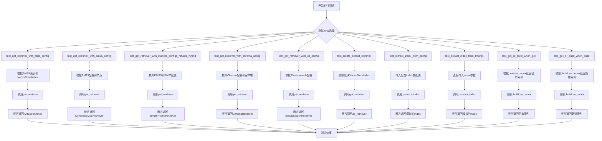

## 类结构

```
TestRetrieverFactory (测试类)
├── retriever_factory (fixture)
├── mock_faiss_index (fixture)
├── mock_vector_store_index (fixture)
├── mock_chroma_vector_store (fixture)
├── mock_es_vector_store (fixture)
├── mock_nodes (fixture)
├── mock_embedding (fixture)
├── test_get_retriever_with_faiss_config (方法)
├── test_get_retriever_with_bm25_config (方法)
├── test_get_retriever_with_multiple_configs_returns_hybrid (方法)
├── test_get_retriever_with_chroma_config (方法)
├── test_get_retriever_with_es_config (方法)
├── test_create_default_retriever (方法)
├── test_extract_index_from_config (方法)
├── test_extract_index_from_kwargs (方法)
├── test_get_or_build_when_get (方法)
└── test_get_or_build_when_build (方法)
```

## 全局变量及字段


### `TestRetrieverFactory.retriever_factory`
    
用于测试的RetrieverFactory实例，作为测试类的主要依赖对象。

类型：`RetrieverFactory`
    
    

## 全局函数及方法

### `TestRetrieverFactory.retriever_factory`

这是一个 Pytest 测试夹具（fixture），用于在 `TestRetrieverFactory` 类的每个测试方法执行前，自动创建并设置一个 `RetrieverFactory` 实例作为测试类的实例变量 `self.retriever_factory`。它确保了测试环境的隔离性和可重复性。

参数：
-  `self`：`TestRetrieverFactory`，当前测试类的实例。

返回值：`None`，此夹具不直接返回值，但会设置 `self.retriever_factory` 属性。

#### 流程图

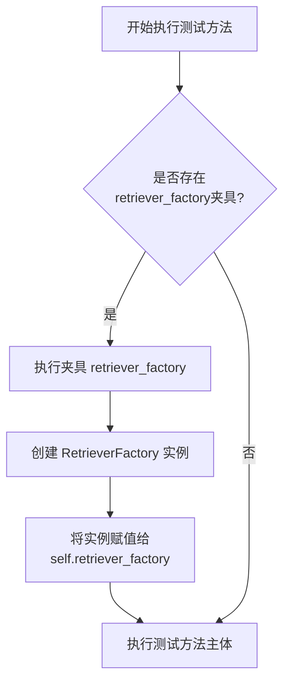

#### 带注释源码

```python
    @pytest.fixture(autouse=True)  # 声明这是一个Pytest夹具，`autouse=True`表示自动应用于类中的所有测试
    def retriever_factory(self):  # 夹具方法，接收测试类实例`self`作为参数
        self.retriever_factory: RetrieverFactory = RetrieverFactory()  # 创建RetrieverFactory实例，并赋值给测试类的`retriever_factory`属性
```

### `TestRetrieverFactory.mock_faiss_index`

这是一个 Pytest 测试夹具（fixture），用于在 `TestRetrieverFactory` 类的测试方法中，创建一个模拟的 FAISS 索引对象。它利用 `mocker` 参数来生成一个符合 `faiss.IndexFlatL2` 接口规范的模拟对象，以便在单元测试中隔离对真实 FAISS 库的依赖，确保测试的独立性和可重复性。

参数：

- `mocker`：`pytest_mock.plugin.MockerFixture`，Pytest-mock 插件提供的模拟对象创建工具，用于生成和配置测试替身（如 Mock、MagicMock）。

返回值：`unittest.mock.MagicMock`，一个被配置为模拟 `faiss.IndexFlatL2` 类的 MagicMock 对象。

#### 流程图

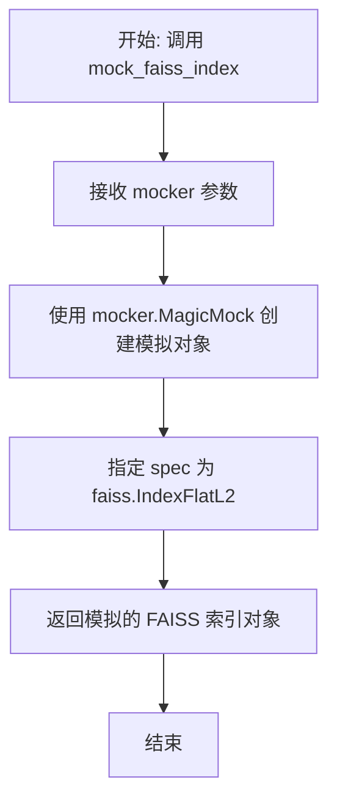

#### 带注释源码

```python
    @pytest.fixture
    # 定义一个名为 `mock_faiss_index` 的 Pytest 夹具。
    # `mocker` 参数由 pytest-mock 插件自动注入，用于创建模拟对象。
    def mock_faiss_index(self, mocker):
        # 使用 mocker.MagicMock 创建一个通用的模拟对象。
        # `spec=faiss.IndexFlatL2` 参数确保创建的模拟对象在接口上模仿 `faiss.IndexFlatL2` 类。
        # 这意味着模拟对象将拥有与真实 `IndexFlatL2` 相同的方法和属性签名，但在调用时不会执行真实逻辑，便于测试控制。
        return mocker.MagicMock(spec=faiss.IndexFlatL2)
```

### `TestRetrieverFactory.mock_vector_store_index`

这是一个 Pytest 测试夹具（fixture），用于在 `TestRetrieverFactory` 测试类中创建一个模拟的 `VectorStoreIndex` 对象。它使用 `mocker` 来模拟 `VectorStoreIndex` 及其内部组件（如 `_embed_model` 和 `docstore`），以便在单元测试中提供一个可控、隔离的依赖项，避免与真实的外部向量存储服务或数据库进行交互。

参数：

- `mocker`：`pytest_mock.plugin.MockerFixture`，Pytest-mock 插件提供的模拟对象创建器，用于创建和管理测试替身（如 MagicMock）。

返回值：`unittest.mock.MagicMock`，一个被配置为模拟 `llama_index.core.VectorStoreIndex` 类的 MagicMock 对象。

#### 流程图

```mermaid
flowchart TD
    A[开始: mock_vector_store_index] --> B[使用 mocker.MagicMock 创建<br>VectorStoreIndex 模拟对象]
    B --> C[为模拟对象的 _embed_model 属性<br>创建另一个 MagicMock]
    C --> D[配置模拟对象的 docstore.docs.values()<br>方法返回空列表]
    D --> E[返回配置好的模拟对象]
    E --> F[结束]
```

#### 带注释源码

```python
@pytest.fixture
def mock_vector_store_index(self, mocker):
    # 使用 mocker 创建一个 MagicMock 对象，并将其规范（spec）设置为 VectorStoreIndex 类。
    # 这意味着模拟对象将模仿 VectorStoreIndex 的接口，对不存在方法的调用会引发 AttributeError。
    mock = mocker.MagicMock(spec=VectorStoreIndex)
    
    # 为模拟对象的 `_embed_model` 属性创建一个新的 MagicMock。
    # 这个属性在真实对象中可能是一个嵌入模型实例，在测试中我们只需要一个模拟占位符。
    mock._embed_model = mocker.MagicMock()
    
    # 配置模拟对象内部 `docstore.docs.values()` 方法的返回值。
    # `docstore` 是模拟对象的一个属性（本身也是一个MagicMock），我们链式调用其 `docs` 属性和 `values` 方法，
    # 并设置 `return_value` 为一个空列表。这模拟了一个没有存储任何文档的索引状态。
    mock.docstore.docs.values.return_value = []
    
    # 返回最终配置好的 VectorStoreIndex 模拟对象，供测试用例使用。
    return mock
```

### `TestRetrieverFactory.mock_chroma_vector_store`

这是一个用于单元测试的pytest fixture，用于创建一个模拟的`ChromaVectorStore`对象。它通过`mocker`库生成一个符合`ChromaVectorStore`接口规范的MagicMock对象，以便在测试`RetrieverFactory.get_retriever`方法处理`ChromaRetrieverConfig`配置时，隔离对真实Chroma数据库的依赖。

参数：
- `mocker`：`pytest_mock.plugin.MockerFixture`，pytest-mock插件提供的mocker fixture，用于创建模拟对象和打补丁。

返回值：`unittest.mock.MagicMock`，一个模拟的`llama_index.vector_stores.chroma.ChromaVectorStore`对象。

#### 流程图

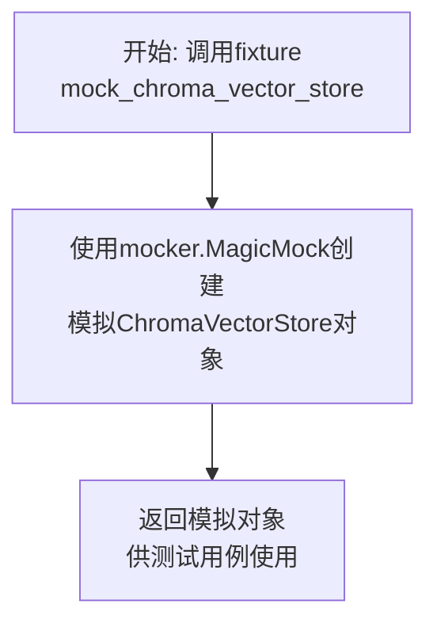

#### 带注释源码

```python
    @pytest.fixture
    # 定义了一个pytest fixture，名为`mock_chroma_vector_store`。
    # 该fixture会在测试函数请求它时自动执行。
    def mock_chroma_vector_store(self, mocker):
        # 使用传入的`mocker`参数创建一个MagicMock对象。
        # `spec=ChromaVectorStore`指定了这个模拟对象模仿`ChromaVectorStore`类的接口，
        # 这样在测试中调用它的方法时，会返回一个MagicMock对象，而不会访问真实数据库。
        # 这有助于实现测试的隔离性和可重复性。
        return mocker.MagicMock(spec=ChromaVectorStore)
```

### `TestRetrieverFactory.mock_es_vector_store`

这是一个用于单元测试的pytest fixture，用于创建并返回一个模拟的 `ElasticsearchStore` 对象。它的主要目的是在测试 `RetrieverFactory.get_retriever` 方法处理 `ElasticsearchRetrieverConfig` 配置时，隔离对真实Elasticsearch服务的依赖，确保测试的可靠性和速度。

参数：

- `mocker`：`pytest-mock` 库提供的 `MockerFixture` 类型对象，用于创建和管理模拟对象。

返回值：`unittest.mock.MagicMock`，一个被配置为模拟 `llama_index.vector_stores.elasticsearch.ElasticsearchStore` 类的MagicMock对象。

#### 流程图

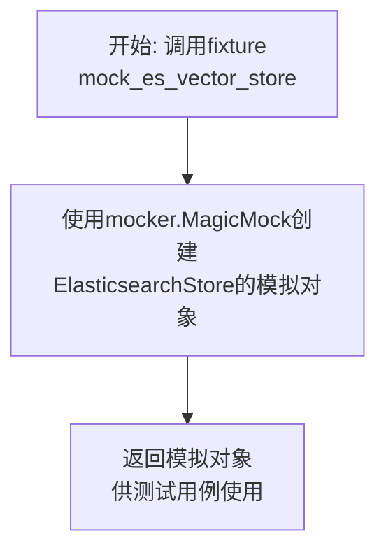

#### 带注释源码

```python
@pytest.fixture
def mock_es_vector_store(self, mocker):
    # 使用pytest-mock的mocker fixture创建一个MagicMock对象。
    # spec=ElasticsearchStore 参数确保模拟对象具有与真实ElasticsearchStore类相同的接口，
    # 这样在测试中调用其方法时，行为更接近真实对象，有助于发现接口不匹配的错误。
    return mocker.MagicMock(spec=ElasticsearchStore)
```

### `TestRetrieverFactory.mock_nodes`

这是一个用于单元测试的pytest fixture，用于创建并返回一个模拟的文本节点列表。它提供了一个简单的、可预测的测试数据源，用于测试检索器工厂（`RetrieverFactory`）在需要文本节点（`TextNode`）作为输入时的行为。

参数：

-  `mocker`：`pytest-mock` 的 `MockerFixture` 类型，用于创建模拟对象（mock objects）。它允许在测试中替换或模拟依赖项的行为。

返回值：`list[TextNode]`，一个包含单个 `TextNode` 对象的列表，该节点的文本内容为 "msg"。

#### 流程图

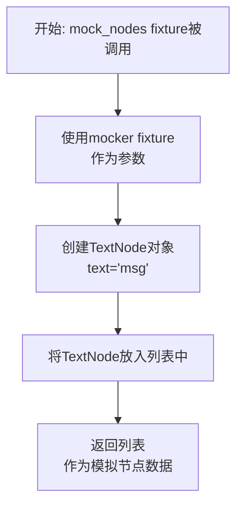

#### 带注释源码

```python
    @pytest.fixture
    # 定义一个pytest fixture，名为'mock_nodes'。
    # fixture是pytest的一个核心功能，用于提供测试所需的依赖项。
    # 这个fixture接收一个参数'mocker'，它是pytest-mock插件提供的，用于创建模拟对象。
    def mock_nodes(self, mocker):
        # 返回一个列表，其中包含一个TextNode对象。
        # TextNode是llama_index框架中表示文本块的基本单元。
        # 这里创建了一个文本内容为"msg"的节点，用于在测试中模拟真实的文档数据。
        return [TextNode(text="msg")]
```

### `TestRetrieverFactory.mock_embedding`

这是一个用于单元测试的pytest fixture，用于创建一个模拟的嵌入模型（MockEmbedding）实例。该fixture在测试中为其他测试方法提供一个预设的、行为可控的嵌入模型，避免依赖真实的外部嵌入服务，从而确保测试的独立性和可重复性。

参数：
- 无参数

返回值：`MockEmbedding`，一个模拟的嵌入模型实例，其嵌入维度（embed_dim）被预设为1。

#### 流程图

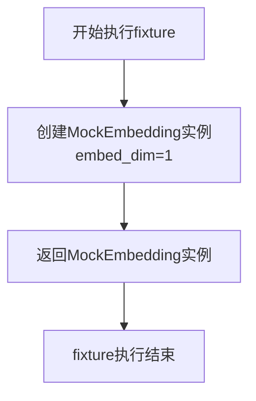

#### 带注释源码

```python
    @pytest.fixture
    def mock_embedding(self):
        # 创建一个MockEmbedding实例，并指定其嵌入维度为1。
        # 这个fixture可以在测试函数中通过参数注入的方式使用，
        # 为测试提供一个轻量级、可预测的嵌入模型，用于模拟向量化过程。
        return MockEmbedding(embed_dim=1)
```

### `TestRetrieverFactory.test_get_retriever_with_faiss_config`

该方法用于测试 `RetrieverFactory` 工厂类在传入 `FAISSRetrieverConfig` 配置时，能否正确创建并返回一个 `FAISSRetriever` 检索器实例。它通过模拟（Mock）FAISS索引和VectorStoreIndex来隔离外部依赖，专注于测试工厂方法的配置解析和对象创建逻辑。

参数：

- `mock_faiss_index`：`MagicMock`，一个模拟的FAISS索引对象，用于替换真实的`faiss.IndexFlatL2`。
- `mocker`：`MockerFixture`，pytest-mock插件提供的模拟器，用于创建和管理模拟对象及打补丁。
- `mock_vector_store_index`：`MagicMock`，一个模拟的`VectorStoreIndex`对象，作为工厂方法内部`_extract_index`的返回值。

返回值：`None`，这是一个单元测试方法，其主要目的是通过断言（`assert`）来验证行为，不返回业务值。

#### 流程图

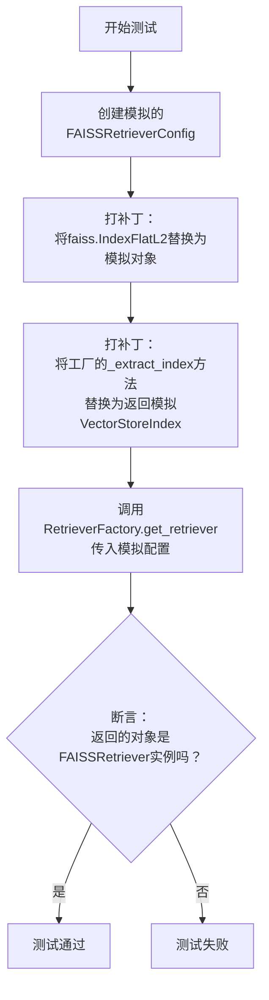

#### 带注释源码

```python
def test_get_retriever_with_faiss_config(self, mock_faiss_index, mocker, mock_vector_store_index):
    # 1. 准备测试数据：创建一个FAISS检索器的配置对象，指定向量维度为128。
    mock_config = FAISSRetrieverConfig(dimensions=128)
    
    # 2. 模拟外部依赖：
    #    - 将 `faiss.IndexFlatL2` 类的构造调用替换为返回预定义的模拟对象 `mock_faiss_index`。
    #      这确保了测试不会创建真实的FAISS索引，避免了本地环境依赖。
    mocker.patch("faiss.IndexFlatL2", return_value=mock_faiss_index)
    #    - 将 `RetrieverFactory` 实例的 `_extract_index` 方法替换为返回模拟的 `mock_vector_store_index`。
    #      这模拟了从配置或参数中成功提取到一个向量存储索引的场景。
    mocker.patch.object(self.retriever_factory, "_extract_index", return_value=mock_vector_store_index)

    # 3. 执行测试：调用工厂方法，传入包含FAISS配置的列表。
    #    根据设计，当只传入一个配置时，工厂应直接创建对应的检索器（而非混合检索器）。
    retriever = self.retriever_factory.get_retriever(configs=[mock_config])

    # 4. 验证结果：断言返回的对象是 `FAISSRetriever` 类型的实例。
    #    这验证了工厂能够正确解析 `FAISSRetrieverConfig` 并实例化对应的检索器类。
    assert isinstance(retriever, FAISSRetriever)
```

### `TestRetrieverFactory.test_get_retriever_with_bm25_config`

该方法用于测试 `RetrieverFactory` 工厂类在传入 `BM25RetrieverConfig` 配置时，能否正确创建并返回一个 `DynamicBM25Retriever` 检索器实例。它通过模拟 `rank_bm25.BM25Okapi` 的初始化来隔离外部依赖，确保测试的独立性和可靠性。

参数：
-  `mocker`：`pytest_mock.plugin.MockerFixture`，pytest-mock 插件提供的模拟对象，用于在测试中创建和管理模拟（Mock）对象。
-  `mock_nodes`：`List[llama_index.core.schema.TextNode]`，一个包含 `TextNode` 对象的列表，作为构建 BM25 检索器所需的文档节点数据。

返回值：`None`，这是一个单元测试方法，其主要目的是通过断言（`assert`）来验证功能，不返回业务值。

#### 流程图

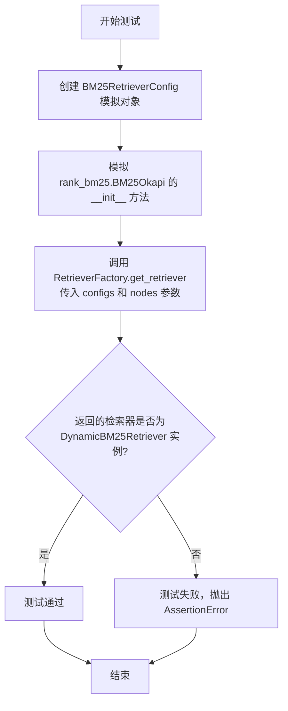

#### 带注释源码

```python
def test_get_retriever_with_bm25_config(self, mocker, mock_nodes):
    # 1. 准备测试配置：创建一个 BM25RetrieverConfig 的模拟对象。
    mock_config = BM25RetrieverConfig()
    # 2. 模拟外部依赖：将 rank_bm25.BM25Okapi 类的 __init__ 方法替换为一个什么都不做的模拟函数，
    #    目的是避免在单元测试中实际初始化 BM25 模型，从而隔离测试。
    mocker.patch("rank_bm25.BM25Okapi.__init__", return_value=None)

    # 3. 执行被测方法：调用 RetrieverFactory 的 get_retriever 方法，
    #    传入包含 BM25 配置的列表和模拟的文档节点。
    retriever = self.retriever_factory.get_retriever(configs=[mock_config], nodes=mock_nodes)

    # 4. 验证结果：断言返回的对象是 DynamicBM25Retriever 类型。
    #    这验证了工厂方法能够根据 BM25 配置正确创建对应的检索器。
    assert isinstance(retriever, DynamicBM25Retriever)
```

### `TestRetrieverFactory.test_get_retriever_with_multiple_configs_returns_hybrid`

该方法用于测试 `RetrieverFactory.get_retriever` 方法在传入多个检索器配置（例如 FAISS 和 BM25）时，能够正确创建并返回一个混合检索器（`SimpleHybridRetriever`）。它通过模拟依赖项（如 BM25 库）和提供必要的参数（如节点列表和嵌入模型）来验证工厂方法的混合检索器创建逻辑。

参数：

- `mocker`：`pytest_mock.plugin.MockerFixture`，pytest-mock 提供的模拟对象，用于在测试中模拟（mock）外部依赖或复杂对象。
- `mock_nodes`：`list[llama_index.core.schema.TextNode]`，一个模拟的文本节点列表，作为构建某些检索器（如 BM25）所需的数据。
- `mock_embedding`：`llama_index.core.embeddings.MockEmbedding`，一个模拟的嵌入模型，用于需要向量化操作的检索器（如 FAISS）。

返回值：`None`，这是一个单元测试方法，其主要目的是通过断言（`assert`）来验证功能，不返回业务值。

#### 流程图

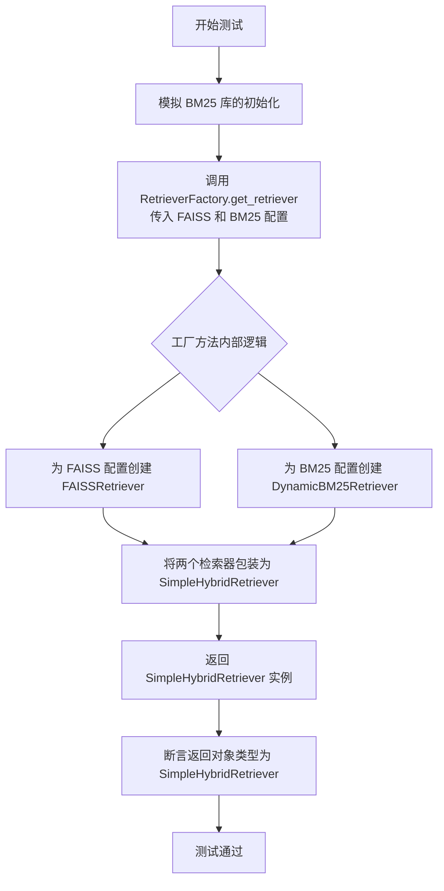

#### 带注释源码

```python
def test_get_retriever_with_multiple_configs_returns_hybrid(self, mocker, mock_nodes, mock_embedding):
    # 1. 准备测试数据：创建 FAISS 和 BM25 的模拟配置对象。
    mock_faiss_config = FAISSRetrieverConfig(dimensions=1)
    mock_bm25_config = BM25RetrieverConfig()
    
    # 2. 模拟外部依赖：模拟 rank_bm25.BM25Okapi 类的 __init__ 方法，使其不执行实际初始化。
    #    这是为了避免在单元测试中引入对真实 BM25 库的依赖和计算。
    mocker.patch("rank_bm25.BM25Okapi.__init__", return_value=None)

    # 3. 执行被测方法：调用 RetrieverFactory 的 get_retriever 方法。
    #    传入包含两种配置的列表、模拟的节点列表以及模拟的嵌入模型。
    retriever = self.retriever_factory.get_retriever(
        configs=[mock_faiss_config, mock_bm25_config], nodes=mock_nodes, embed_model=mock_embedding
    )

    # 4. 验证结果：断言返回的 retriever 对象是 SimpleHybridRetriever 类型。
    #    这验证了当传入多个配置时，工厂方法能够正确识别并组合它们，返回一个混合检索器。
    assert isinstance(retriever, SimpleHybridRetriever)
```

### `TestRetrieverFactory.test_get_retriever_with_chroma_config`

该方法用于测试 `RetrieverFactory.get_retriever` 方法在传入 `ChromaRetrieverConfig` 配置时，能否正确创建并返回一个 `ChromaRetriever` 实例。它通过模拟（Mock）ChromaDB客户端和向量存储来隔离外部依赖，专注于验证工厂方法的逻辑。

参数：
-  `self`：`TestRetrieverFactory`，测试类实例
-  `mocker`：`pytest-mock` 的 `MockerFixture`，用于创建和管理模拟对象
-  `mock_chroma_vector_store`：`MagicMock`，模拟的 `ChromaVectorStore` 对象，由同名的 `@pytest.fixture` 提供
-  `mock_embedding`：`MockEmbedding`，模拟的嵌入模型，由同名的 `@pytest.fixture` 提供

返回值：`None`，这是一个单元测试方法，不返回业务值，通过断言（`assert`）来验证测试结果。

#### 流程图

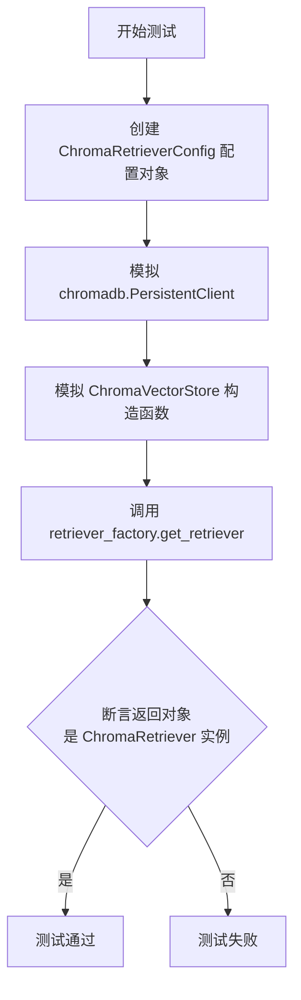

#### 带注释源码

```python
def test_get_retriever_with_chroma_config(self, mocker, mock_chroma_vector_store, mock_embedding):
    # 1. 准备测试数据：创建一个 ChromaRetrieverConfig 配置对象，指定持久化路径和集合名。
    mock_config = ChromaRetrieverConfig(persist_path="/path/to/chroma", collection_name="test_collection")
    
    # 2. 模拟外部依赖：
    #    - 模拟 chromadb.PersistentClient，使其返回一个模拟的集合对象。
    mock_chromadb = mocker.patch("metagpt.rag.factories.retriever.chromadb.PersistentClient")
    mock_chromadb.get_or_create_collection.return_value = mocker.MagicMock()
    #    - 模拟 ChromaVectorStore 类的构造函数，使其返回预定义的模拟向量存储对象。
    mocker.patch("metagpt.rag.factories.retriever.ChromaVectorStore", return_value=mock_chroma_vector_store)

    # 3. 执行测试：调用被测试的工厂方法，传入配置、空节点列表和模拟的嵌入模型。
    retriever = self.retriever_factory.get_retriever(configs=[mock_config], nodes=[], embed_model=mock_embedding)

    # 4. 验证结果：断言返回的对象是 ChromaRetriever 类型。
    assert isinstance(retriever, ChromaRetriever)
```

### `TestRetrieverFactory.test_get_retriever_with_es_config`

该方法用于测试 `RetrieverFactory` 工厂类在传入 `ElasticsearchRetrieverConfig` 配置时，能否正确创建并返回一个 `ElasticsearchRetriever` 检索器实例。它通过模拟（Mock）外部依赖来验证工厂的核心逻辑。

参数：

-  `mocker`：`pytest_mock.plugin.MockerFixture`，pytest-mock 插件提供的 Mock 夹具，用于创建和管理模拟对象。
-  `mock_es_vector_store`：`unittest.mock.MagicMock`，模拟的 `ElasticsearchStore` 向量存储对象，由类级别的 `@pytest.fixture` 提供。
-  `mock_embedding`：`llama_index.core.embeddings.MockEmbedding`，模拟的嵌入模型，由类级别的 `@pytest.fixture` 提供。

返回值：`None`，这是一个单元测试方法，其主要目的是通过断言（`assert`）来验证行为，不返回业务值。

#### 流程图

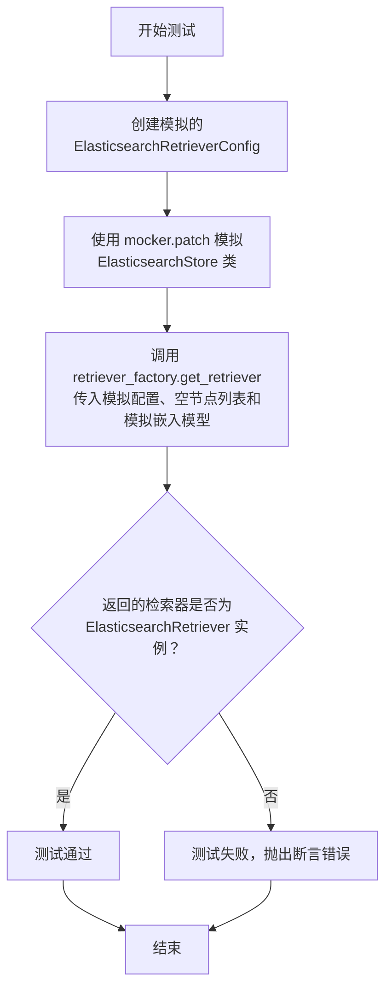

#### 带注释源码

```python
def test_get_retriever_with_es_config(self, mocker, mock_es_vector_store, mock_embedding):
    # 1. 准备测试数据：创建一个模拟的 Elasticsearch 检索器配置对象。
    #    其内部的 store_config 使用默认的 ElasticsearchStoreConfig。
    mock_config = ElasticsearchRetrieverConfig(store_config=ElasticsearchStoreConfig())

    # 2. 模拟外部依赖：将 `metagpt.rag.factories.retriever` 模块中的
    #    `ElasticsearchStore` 类替换为上面 Fixture 提供的模拟对象 `mock_es_vector_store`。
    #    这样，当工厂内部尝试实例化 ElasticsearchStore 时，会直接返回这个模拟对象，
    #    避免了真实的网络连接和 Elasticsearch 服务依赖。
    mocker.patch("metagpt.rag.factories.retriever.ElasticsearchStore", return_value=mock_es_vector_store)

    # 3. 执行被测逻辑：调用 RetrieverFactory 的 `get_retriever` 方法。
    #    传入参数：
    #    - configs: 包含上面创建的模拟配置的列表。
    #    - nodes: 一个空列表，因为对于 ElasticsearchRetriever，节点可能在配置或其它地方提供，或者测试不关心此参数。
    #    - embed_model: 模拟的嵌入模型，用于构建索引（如果需要）。
    retriever = self.retriever_factory.get_retriever(configs=[mock_config], nodes=[], embed_model=mock_embedding)

    # 4. 验证结果：断言工厂返回的对象是 `ElasticsearchRetriever` 类型。
    #    这确保了工厂能够正确解析 `ElasticsearchRetrieverConfig` 并实例化对应的检索器。
    assert isinstance(retriever, ElasticsearchRetriever)
```

### `TestRetrieverFactory.test_create_default_retriever`

该方法用于测试 `RetrieverFactory.get_retriever` 方法在未提供任何检索器配置 (`configs`) 时的默认行为。它验证了当没有指定特定配置时，工厂会回退到使用一个默认的 `VectorStoreIndex` 来创建检索器。

参数：

- `self`：`TestRetrieverFactory`，测试类实例的引用。
- `mocker`：`pytest-mock` 提供的 `MockerFixture` 类型，用于创建和管理测试替身（如模拟对象和补丁）。
- `mock_vector_store_index`：`MagicMock`，一个模拟的 `VectorStoreIndex` 对象，作为 `_extract_index` 方法的返回值。

返回值：`None`，这是一个单元测试方法，其主要目的是进行断言验证，不返回业务逻辑相关的值。

#### 流程图

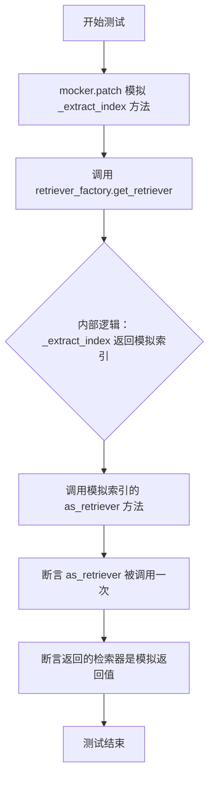

#### 带注释源码

```python
def test_create_default_retriever(self, mocker, mock_vector_store_index):
    # 模拟 RetrieverFactory 实例的 _extract_index 方法，使其返回一个预设的模拟 VectorStoreIndex 对象。
    # 这确保了测试不依赖于真实的索引构建过程。
    mocker.patch.object(self.retriever_factory, "_extract_index", return_value=mock_vector_store_index)
    # 为模拟的 VectorStoreIndex 对象的 `as_retriever` 方法创建一个模拟对象，以便后续验证其调用。
    mock_vector_store_index.as_retriever = mocker.MagicMock()

    # 调用被测方法：在不提供任何 `configs` 参数的情况下获取检索器。
    # 根据设计，这应触发工厂的默认行为。
    retriever = self.retriever_factory.get_retriever()

    # 验证：模拟的 `as_retriever` 方法被精确地调用了一次。
    # 这确认了当没有配置时，工厂确实使用了提供的（或默认的）索引来创建检索器。
    mock_vector_store_index.as_retriever.assert_called_once()
    # 验证：`get_retriever` 方法返回的对象正是 `as_retriever` 方法的返回值。
    # 这确保了工厂正确地将索引转换为了检索器并返回。
    assert retriever is mock_vector_store_index.as_retriever.return_value
```

### `TestRetrieverFactory.test_extract_index_from_config`

该方法用于测试 `RetrieverFactory._extract_index` 方法在从配置对象中提取索引时的功能。它验证当传入一个包含 `index` 属性的配置对象时，`_extract_index` 方法能正确返回该索引。

参数：

- `self`：`TestRetrieverFactory`，测试类实例的引用。
- `mock_vector_store_index`：`MagicMock`，一个模拟的 `VectorStoreIndex` 对象，作为测试中配置对象的 `index` 属性值。

返回值：`None`，这是一个单元测试方法，不返回业务值，其成功与否由 `assert` 语句判定。

#### 流程图

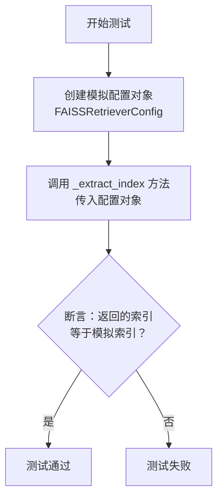

#### 带注释源码

```python
def test_extract_index_from_config(self, mock_vector_store_index):
    # 创建一个模拟的 FAISSRetrieverConfig 配置对象，并将其 `index` 属性设置为传入的模拟索引。
    mock_config = FAISSRetrieverConfig(index=mock_vector_store_index)

    # 调用被测试的 `_extract_index` 方法，传入上一步创建的配置对象。
    extracted_index = self.retriever_factory._extract_index(config=mock_config)

    # 使用断言验证 `_extract_index` 方法返回的索引对象是否与最初传入模拟配置的索引对象相同。
    # 这确保了方法能够正确地从配置对象中提取出 `index` 字段。
    assert extracted_index == mock_vector_store_index
```

### `TestRetrieverFactory.test_extract_index_from_kwargs`

该方法用于测试 `RetrieverFactory._extract_index` 方法在通过关键字参数 `index` 传递索引对象时的行为。它验证了工厂方法能够正确地从关键字参数中提取出预构建的索引对象。

参数：

- `self`：`TestRetrieverFactory`，测试类实例的引用。
- `mock_vector_store_index`：`MagicMock`，一个模拟的 `VectorStoreIndex` 对象，作为测试用的预构建索引。

返回值：`None`，这是一个单元测试方法，不返回业务值，其成功与否由断言决定。

#### 流程图

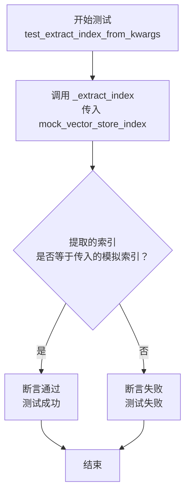

#### 带注释源码

```python
def test_extract_index_from_kwargs(self, mock_vector_store_index):
    # 调用 RetrieverFactory 实例的 _extract_index 方法，并传入模拟的索引对象作为关键字参数。
    extracted_index = self.retriever_factory._extract_index(index=mock_vector_store_index)

    # 断言：验证 _extract_index 方法返回的索引对象与传入的模拟索引对象是同一个。
    # 这确保了工厂方法能够正确地从关键字参数中识别并返回预构建的索引。
    assert extracted_index == mock_vector_store_index
```

### `TestRetrieverFactory.test_get_or_build_when_get`

该方法是一个单元测试，用于验证 `RetrieverFactory._build_es_index` 方法在传入的配置参数中已经包含一个索引对象时，能够正确返回该现有索引，而不是重新构建一个新的索引。它通过模拟 `_extract_index` 方法返回一个预设的索引对象来测试“获取”逻辑。

参数：

-  `self`：`TestRetrieverFactory`，测试类实例的引用。
-  `mocker`：`pytest-mock` 的 `MockerFixture`，用于创建和管理模拟对象。

返回值：`None`，这是一个测试方法，其主要目的是进行断言验证，不返回业务值。

#### 流程图

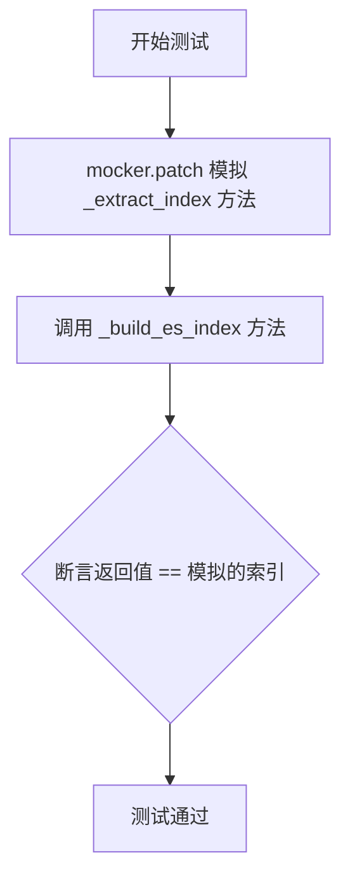

#### 带注释源码

```python
def test_get_or_build_when_get(self, mocker):
    # 1. 设置预期结果：一个模拟的“现有索引”对象
    want = "existing_index"
    # 2. 使用 mocker 模拟 `_extract_index` 方法，使其返回我们预设的 `want` 值。
    #    这模拟了传入的配置中已经包含一个索引的场景。
    mocker.patch.object(self.retriever_factory, "_extract_index", return_value=want)

    # 3. 执行待测试的方法 `_build_es_index`。
    #    传入 `None` 作为配置参数，因为模拟的 `_extract_index` 会忽略它并直接返回 `want`。
    got = self.retriever_factory._build_es_index(None)

    # 4. 断言：验证方法实际返回的结果 `got` 是否等于我们预期的 `want`。
    #    如果相等，则证明方法在“获取”现有索引的逻辑上工作正常。
    assert got == want
```

### `TestRetrieverFactory.test_get_or_build_when_build`

这是一个单元测试方法，用于测试 `RetrieverFactory._build_es_index` 方法在需要“构建”索引时的行为。它模拟了当 `_extract_index` 方法无法从配置或参数中提取到现有索引时，工厂会调用 `_build_es_index` 方法来构建一个新的索引。测试通过模拟（mocking）`_build_es_index` 方法并断言其返回值来验证逻辑。

参数：

-  `mocker`：`pytest-mock` 提供的 `MockerFixture` 类型，用于创建和管理模拟对象（mocks），以隔离被测试代码的依赖。

返回值：`None`，这是一个测试方法，其主要目的是通过断言（assert）来验证逻辑，不返回业务值。

#### 流程图

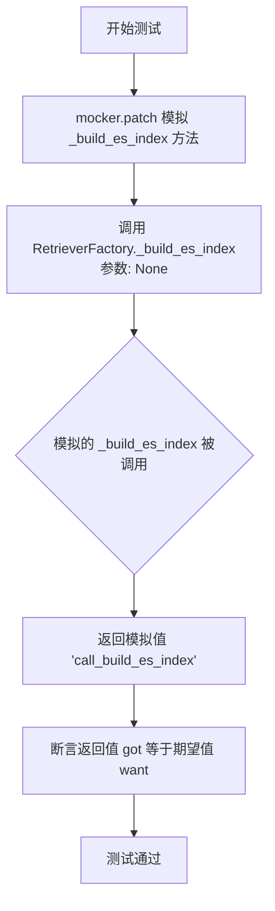

#### 带注释源码

```python
def test_get_or_build_when_build(self, mocker):
    # 定义期望的返回值，模拟构建索引后返回的结果
    want = "call_build_es_index"
    # 使用 mocker.patch.object 模拟 RetrieverFactory 实例的 _build_es_index 方法。
    # 当该方法被调用时，将直接返回我们预设的字符串 `want`，而不是执行实际构建逻辑。
    # 这隔离了外部依赖（如Elasticsearch连接），使测试专注于流程控制逻辑。
    mocker.patch.object(self.retriever_factory, "_build_es_index", return_value=want)

    # 调用被测试的方法 _build_es_index，并传入 None 作为参数。
    # 在这个测试场景中，参数为 None 暗示着没有提供现成的索引，需要触发“构建”分支。
    got = self.retriever_factory._build_es_index(None)

    # 断言：验证方法调用后返回的结果 `got` 是否等于我们模拟的期望值 `want`。
    # 如果相等，则证明当 `_extract_index` 无法提取索引时，正确调用了 `_build_es_index` 方法。
    assert got == want
```

## 关键组件


### RetrieverFactory

一个工厂类，用于根据不同的配置创建和返回相应的检索器（Retriever）实例，支持多种检索后端（如FAISS、BM25、Chroma、Elasticsearch）以及混合检索器。

### FAISSRetriever

基于FAISS（Facebook AI Similarity Search）库实现的稠密向量检索器，用于高效地进行近似最近邻搜索。

### DynamicBM25Retriever

基于BM25算法实现的稀疏向量（词频）检索器，适用于基于关键词匹配的文档检索。

### ChromaRetriever

基于Chroma向量数据库实现的检索器，用于持久化存储和检索向量嵌入。

### ElasticsearchRetriever

基于Elasticsearch搜索引擎实现的检索器，支持全文检索和向量检索。

### SimpleHybridRetriever

一个简单的混合检索器，能够组合多个不同检索器（如稠密检索和稀疏检索）的结果，以提供更全面的检索能力。

### 配置类（如FAISSRetrieverConfig, BM25RetrieverConfig等）

一系列数据类，用于定义和传递不同检索器初始化所需的特定参数和配置。


## 问题及建议


### 已知问题

-   **测试对具体实现细节的依赖过强**：多个测试方法（如 `test_get_retriever_with_faiss_config`, `test_get_retriever_with_chroma_config`）通过 `mocker.patch` 直接模拟了底层模块（如 `faiss.IndexFlatL2`, `chromadb.PersistentClient`）的导入和类构造。这使得测试与 `RetrieverFactory` 的内部实现（如具体的导入路径和初始化方式）紧密耦合。一旦工厂方法的实现细节发生变化（例如重构了模块结构或更改了初始化逻辑），即使公共接口和行为不变，这些测试也可能失败，增加了维护成本。
-   **测试覆盖不完整**：测试用例主要聚焦于 `get_retriever` 方法在各种配置下的成功路径，但缺乏对异常和边界情况的测试。例如，没有测试当传入无效的 `configs` 参数（如空列表、None、不支持的配置类型）、`nodes` 参数为 None 或空列表时工厂方法的行为，也没有测试 `_extract_index` 方法在无法从 `config` 或 `kwargs` 中提取索引时的行为。这可能导致潜在的错误未被发现。
-   **存在未使用的测试夹具**：`mock_embedding` 夹具在部分测试方法中被使用，但在 `test_get_retriever_with_bm25_config` 和 `test_get_retriever_with_faiss_config` 等测试中并未使用，却作为参数声明。虽然不影响测试运行，但可能造成混淆，暗示这些测试需要嵌入模型，而实际上 BM25 和部分场景下的 FAISS 可能并不需要。
-   **测试命名与逻辑存在不一致**：`test_get_or_build_when_get` 和 `test_get_or_build_when_build` 两个测试方法都调用了 `_build_es_index`，但方法名 `get_or_build` 暗示了“获取或构建”的逻辑，而测试内容似乎是在测试 `_build_es_index` 方法本身或其依赖的 `_extract_index` 的行为。测试的意图不够清晰，可能与实际待测方法 `_build_es_index` 的逻辑不符。
-   **模拟对象配置过于简化**：例如，`mock_vector_store_index` 夹具中 `docstore.docs.values.return_value` 被设置为空列表，但并未在所有测试中检查这一属性的使用。如果 `RetrieverFactory` 的逻辑依赖于这个值，而测试未覆盖相关场景，则测试的有效性存疑。

### 优化建议

-   **重构测试以减少实现耦合**：建议采用更黑盒的测试策略。对于 `RetrieverFactory`，应主要测试其公共接口 `get_retriever` 在不同输入下返回正确类型的 `Retriever` 对象。可以尝试通过模拟 `RetrieverFactory` 所依赖的关键外部服务接口（如 `VectorStoreIndex`, `ChromaVectorStore.from_client` 等）的返回值，而不是模拟具体的类构造过程。这能使测试更关注行为而非实现。
-   **补充异常和边界测试**：增加测试用例以覆盖：1) `configs` 参数为 `None`、空列表或包含未知配置类型时是否抛出合适的异常；2) 对于需要 `nodes` 参数的检索器（如 BM25），当 `nodes` 为 `None` 或空列表时的行为；3) `_extract_index` 方法在 `config` 和 `kwargs` 中均未提供 `index` 时的行为（应返回 `None` 或抛出异常）。
-   **清理测试夹具和参数**：移除未使用的测试方法参数（如 `mock_embedding`），确保每个测试夹具和参数都是该测试所必需的。这可以提高测试代码的清晰度和可维护性。
-   **重命名或重写意图模糊的测试**：审查 `test_get_or_build_when_get` 和 `test_get_or_build_when_build`。如果目的是测试 `_build_es_index` 方法，应更清晰地命名（例如 `test_build_es_index_extracts_existing_index`, `test_build_es_index_calls_build_when_no_index`）并明确其测试场景。确保测试逻辑与待测方法实际行为一致。
-   **增强模拟对象的真实性**：根据 `RetrieverFactory` 及其依赖组件的实际交互，更精细地配置模拟对象的行为和返回值。例如，确保 `mock_vector_store_index.as_retriever` 返回一个合理的模拟检索器对象。考虑使用 `pytest-mock` 的 `mocker.spy` 来监控特定方法的调用，而不是简单地断言 `assert_called_once`，以验证调用时的参数。
-   **考虑添加集成测试**：当前均为单元测试，高度依赖模拟。建议补充少量集成测试，针对某种检索器配置（如 FAISS 或 BM25）使用真实的小规模数据，验证 `RetrieverFactory` 能够成功创建出可工作的检索器实例。这有助于发现单元测试中因过度模拟而隐藏的集成问题。


## 其它


### 设计目标与约束

本代码模块（`TestRetrieverFactory`）是一个单元测试类，其核心设计目标是验证 `RetrieverFactory` 工厂类能够根据不同的配置参数，正确创建并返回对应的检索器（Retriever）实例。约束包括：1) 必须隔离外部依赖（如FAISS、ChromaDB、Elasticsearch），使用模拟（Mock）对象进行测试；2) 测试应覆盖工厂方法的主要分支，包括单一检索器（FAISS、BM25、Chroma、Elasticsearch）和混合检索器（Hybrid）的创建逻辑；3) 确保工厂的默认行为（无配置时）和索引提取逻辑的正确性。

### 错误处理与异常设计

当前测试代码未显式测试错误处理路径。根据被测试的 `RetrieverFactory` 逻辑推断，其潜在的错误处理应包括：1) 当传入的配置列表（`configs`）为空且未提供默认索引时，可能引发 `ValueError` 或返回默认检索器；2) 当配置参数不完整或无效时（如FAISS配置缺少`dimensions`），应抛出相应的配置验证异常；3) 当依赖的外部服务（如Elasticsearch）连接失败时，应抛出连接异常。测试类应通过模拟异常来验证这些场景，但现有测试用例未覆盖。

### 数据流与状态机

本测试类的数据流清晰：每个测试方法通过 `@pytest.fixture` 准备模拟依赖（状态初始化），调用 `RetrieverFactory.get_retriever()` 方法（状态转换），最后使用 `assert` 语句验证返回的检索器类型是否符合预期（状态验证）。工厂本身可视为一个无状态（Stateless）的函数，其输出完全由输入参数（`configs`, `nodes`, `embed_model` 等）决定。测试覆盖了从输入配置到输出检索器实例的完整数据流转。

### 外部依赖与接口契约

测试类严重依赖外部库和模块，并通过 `mocker.patch` 进行隔离：
1.  **向量数据库/检索库**：`faiss`, `rank_bm25.BM25Okapi`, `chromadb.PersistentClient`, `ElasticsearchStore`。测试模拟了它们的构造函数或关键方法。
2.  **LlamaIndex 组件**：`VectorStoreIndex`, `ChromaVectorStore`, `MockEmbedding`, `TextNode`。测试模拟了这些类的实例和行为。
3.  **项目内部模块**：`RetrieverFactory` 及其可能创建的所有 `Retriever` 子类（如 `FAISSRetriever`, `DynamicBM25Retriever` 等）。测试验证了工厂与这些子类之间的创建契约。
接口契约的核心是：`RetrieverFactory.get_retriever()` 方法接受特定的配置对象，返回实现了特定接口的检索器对象。测试确保了工厂遵守了这一契约。

### 测试策略与覆盖范围

测试策略采用基于配置的单元测试，针对 `RetrieverFactory` 的公共方法 `get_retriever` 和私有方法 `_extract_index`、`_build_es_index`（后两者通过公有方法间接测试）。覆盖范围包括：
1.  **功能覆盖**：分别测试使用 FAISS、BM25、Chroma、Elasticsearch 单一配置创建对应检索器。
2.  **组合覆盖**：测试使用多个配置创建混合检索器（`SimpleHybridRetriever`）。
3.  **边界/默认情况**：测试无配置时调用默认检索器路径。
4.  **参数提取逻辑**：测试从配置对象或关键字参数中提取索引的逻辑。
未覆盖的潜在范围包括：异常情况测试、配置对象之间冲突的处理、检索器创建后的功能性验证（如检索结果是否正确）。

### 模拟（Mock）策略

测试类广泛使用 `pytest-mock` 的 `mocker` fixture 进行模拟，策略包括：
1.  **模拟外部类**：使用 `mocker.MagicMock(spec=...)` 创建符合特定类接口的模拟对象（如 `mock_faiss_index`），避免真实初始化。
2.  **模拟构造函数**：使用 `mocker.patch(“module.Class”, return_value=...)` 拦截外部库类的实例化过程（如 `faiss.IndexFlatL2`, `chromadb.PersistentClient`）。
3.  **模拟对象方法**：在模拟对象上设置返回值（如 `mock_vector_store_index.as_retriever`）或验证调用（`assert_called_once`）。
4.  **模拟内部方法**：使用 `mocker.patch.object(...)` 模拟被测工厂内部的私有方法（如 `_extract_index`, `_build_es_index`），以控制测试分支或验证调用。
这种策略有效地将测试焦点隔离在 `RetrieverFactory` 自身的逻辑上。

    