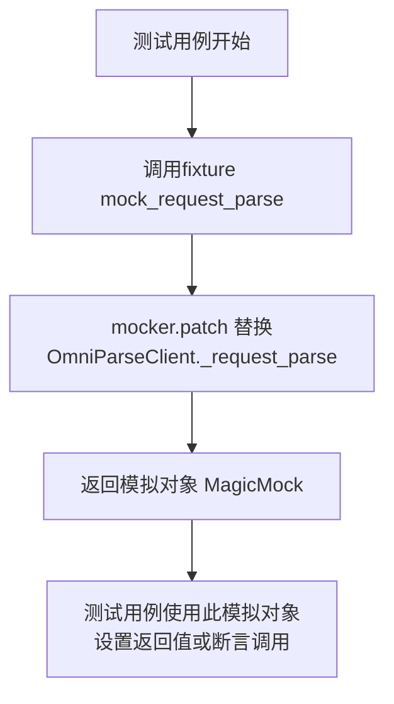
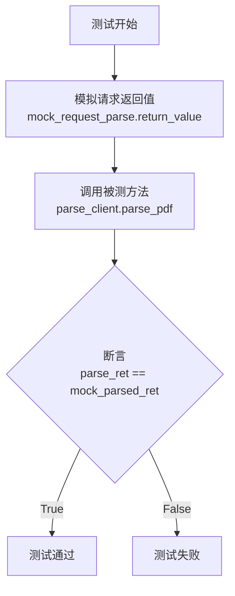
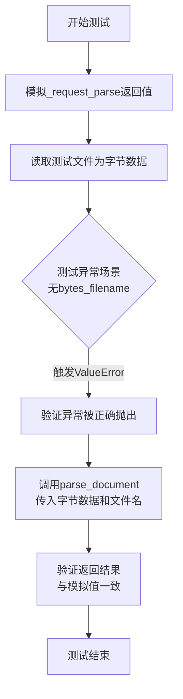
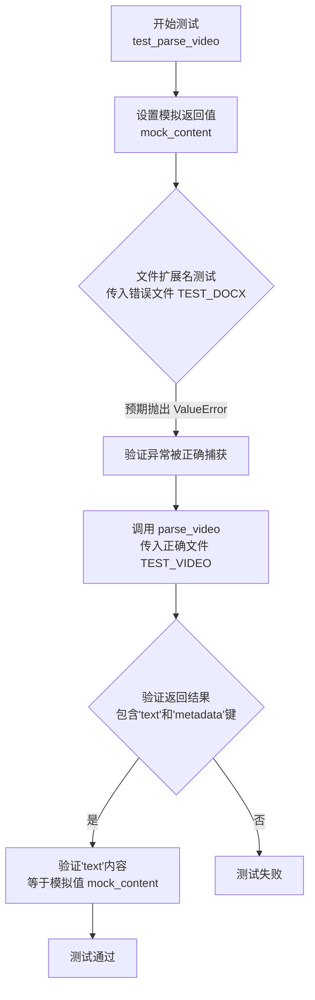
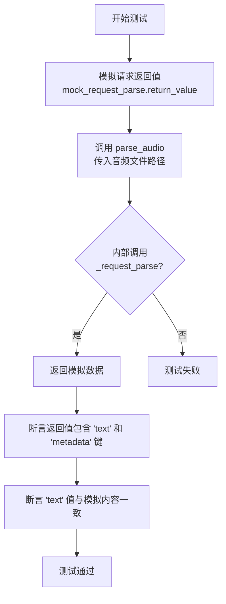
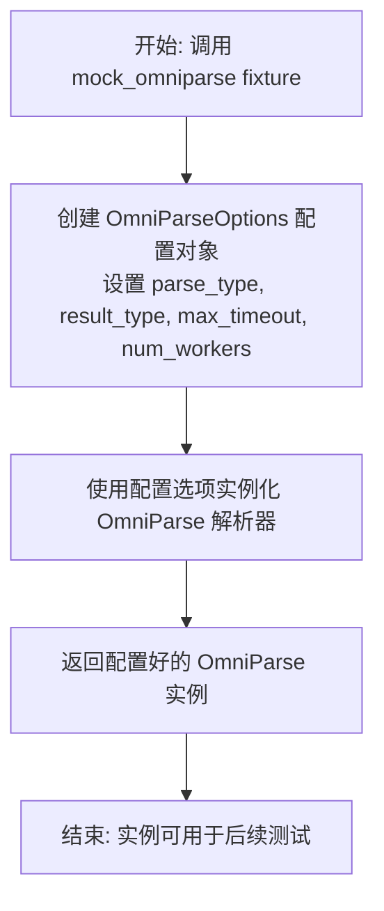
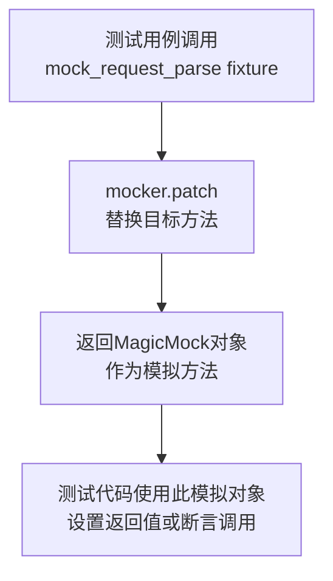

# `.\MetaGPT\tests\metagpt\rag\parser\test_omniparse.py` 详细设计文档

该文件是一个使用 pytest 框架编写的单元测试文件，用于测试 MetaGPT 项目中 RAG（检索增强生成）模块的 OmniParse 功能。OmniParse 是一个多功能文档解析器，能够处理多种格式的文件（如 PDF、DOCX、视频、音频），将其内容提取为结构化文本（如 Markdown 或纯文本）。测试文件主要验证 OmniParseClient 和 OmniParse 类中各个解析方法（parse_pdf, parse_document, parse_video, parse_audio, load_data, aload_data）的正确性，包括正常流程、异常处理（如文件类型校验、参数校验）以及异步加载功能。

## 整体流程

```mermaid
graph TD
    A[开始执行测试] --> B{选择测试类}
    B --> C[TestOmniParseClient]
    B --> D[TestOmniParse]
    C --> C1[设置测试夹具 mock_request_parse]
    C1 --> C2[执行具体测试方法]
    C2 --> C2_1[test_parse_pdf]
    C2 --> C2_2[test_parse_document]
    C2 --> C2_3[test_parse_video]
    C2 --> C2_4[test_parse_audio]
    C2_1 --> C2_1_1[模拟解析响应]
    C2_1_1 --> C2_1_2[调用 parse_pdf]
    C2_1_2 --> C2_1_3[断言结果与模拟值一致]
    C2_2 --> C2_2_1[模拟解析响应]
    C2_2_1 --> C2_2_2[测试无 bytes_filename 的异常]
    C2_2_2 --> C2_2_3[调用 parse_document (带参数)]
    C2_2_3 --> C2_2_4[断言结果与模拟值一致]
    C2_3 --> C2_3_1[模拟解析响应]
    C2_3_1 --> C2_3_2[测试错误文件扩展名的异常]
    C2_3_2 --> C2_3_3[调用 parse_video]
    C2_3_3 --> C2_3_4[断言响应结构及内容]
    C2_4 --> C2_4_1[模拟解析响应]
    C2_4_1 --> C2_4_2[调用 parse_audio]
    C2_4_2 --> C2_4_3[断言响应结构及内容]
    D --> D1[设置测试夹具 mock_omniparse]
    D1 --> D2[设置测试夹具 mock_request_parse]
    D2 --> D3[执行具体测试方法]
    D3 --> D3_1[test_load_data]
    D3_1 --> D3_1_1[模拟解析响应]
    D3_1_1 --> D3_1_2[测试 load_data (单文件)]
    D3_1_2 --> D3_1_3[断言返回 Document 对象及内容]
    D3_1_3 --> D3_1_4[测试 aload_data (多文件)]
    D3_1_4 --> D3_1_5[断言返回多个 Document 对象及内容]
    C2_1_3 --> E[测试通过]
    C2_2_4 --> E
    C2_3_4 --> E
    C2_4_3 --> E
    D3_1_5 --> E
```

## 类结构

```
TestOmniParseClient (测试类)
TestOmniParse (测试类)
```

## 全局变量及字段


### `TEST_DOCX`
    
测试用的DOCX文档文件路径，指向示例数据目录中的test01.docx文件

类型：`pathlib.Path`
    


### `TEST_PDF`
    
测试用的PDF文档文件路径，指向示例数据目录中的test02.pdf文件

类型：`pathlib.Path`
    


### `TEST_VIDEO`
    
测试用的视频文件路径，指向示例数据目录中的test03.mp4文件

类型：`pathlib.Path`
    


### `TEST_AUDIO`
    
测试用的音频文件路径，指向示例数据目录中的test04.mp3文件

类型：`pathlib.Path`
    


### `TestOmniParseClient.parse_client`
    
OmniParseClient的实例，用于在测试类中执行各种文档解析测试

类型：`OmniParseClient`
    
    

## 全局函数及方法

### `TestOmniParseClient.mock_request_parse`

这是一个用于单元测试的pytest fixture，它使用`mocker.patch`来模拟（mock）`OmniParseClient._request_parse`方法。它的主要目的是在测试`TestOmniParseClient`类中的异步方法（如`test_parse_pdf`, `test_parse_document`等）时，拦截对真实`_request_parse`方法的调用，并返回预设的模拟数据，从而实现对`OmniParseClient`解析功能的隔离测试。

参数：

- `mocker`：`pytest-mock`提供的`MockerFixture`类型对象，用于创建模拟对象和打补丁。

返回值：`unittest.mock.MagicMock`，一个被配置为模拟`OmniParseClient._request_parse`方法的MagicMock对象。

#### 流程图



#### 带注释源码

```python
    @pytest.fixture
    # 定义一个pytest fixture，命名为`mock_request_parse`。
    # Fixture会在每个使用它的测试函数执行前被调用，并注入其返回值。
    def mock_request_parse(self, mocker):
        # 参数`mocker`由pytest-mock插件自动注入，是一个用于模拟和打补丁的工具对象。
        # 使用mocker.patch方法，将`metagpt.rag.parsers.omniparse.OmniParseClient._request_parse`方法替换为一个模拟对象。
        # 这意味着在测试上下文中，任何对`OmniParseClient._request_parse`的调用都会被这个模拟对象拦截。
        return mocker.patch("metagpt.rag.parsers.omniparse.OmniParseClient._request_parse")
        # 返回这个新创建的模拟对象（一个MagicMock实例）。
        # 测试函数可以通过这个fixture的参数接收此模拟对象，并对其进行配置（如设置返回值）或验证（如断言调用次数）。
```

### `TestOmniParseClient.test_parse_pdf`

这是一个使用 `pytest` 编写的异步单元测试方法，用于测试 `OmniParseClient.parse_pdf` 方法的功能。它通过模拟（Mock）底层网络请求，验证 `parse_pdf` 方法在给定PDF文件路径时，能否正确调用解析服务并返回预期的 `OmniParsedResult` 对象。

参数：

- `self`：`TestOmniParseClient`，测试类实例。
- `mock_request_parse`：`unittest.mock.MagicMock`，由 `pytest.fixture` 提供的模拟对象，用于替换 `OmniParseClient._request_parse` 方法，避免真实的网络调用。

返回值：`None`，测试方法不返回业务值，通过断言（`assert`）来验证测试结果。

#### 流程图



#### 带注释源码

```python
    @pytest.mark.asyncio  # 标记此测试函数为异步函数，需要异步测试运行器执行
    async def test_parse_pdf(self, mock_request_parse):
        # 1. 准备模拟数据：模拟解析服务返回的文本内容
        mock_content = "#test title\ntest content"
        # 2. 构造一个预期的返回对象 OmniParsedResult
        mock_parsed_ret = OmniParsedResult(text=mock_content, markdown=mock_content)
        # 3. 设置模拟方法 `_request_parse` 的返回值为预期对象的字典形式
        #    这模拟了网络请求成功并返回有效数据的情景
        mock_request_parse.return_value = mock_parsed_ret.model_dump()

        # 4. 调用被测试的异步方法 `parse_pdf`，传入一个预定义的PDF测试文件路径常量 `TEST_PDF`
        parse_ret = await self.parse_client.parse_pdf(TEST_PDF)

        # 5. 断言：验证实际返回的 `parse_ret` 对象是否与预期的 `mock_parsed_ret` 对象完全相等
        #    这确保了 `parse_pdf` 方法正确地处理了模拟响应并返回了正确类型的对象
        assert parse_ret == mock_parsed_ret
```

### `TestOmniParseClient.test_parse_document`

这是一个单元测试方法，用于测试 `OmniParseClient.parse_document` 方法的功能。它模拟了 `_request_parse` 方法的返回，并验证了 `parse_document` 方法在传入字节数据时，是否正确地处理了参数验证（如必须提供 `bytes_filename`）以及是否返回了预期的解析结果。

参数：

- `self`：`TestOmniParseClient`，测试类实例
- `mock_request_parse`：`MagicMock`，由 `pytest` 的 `mocker` 提供的模拟对象，用于模拟 `OmniParseClient._request_parse` 方法

返回值：`None`，这是一个测试方法，不返回业务值，通过断言（`assert`）和异常检查（`pytest.raises`）来验证功能。

#### 流程图



#### 带注释源码

```python
    @pytest.mark.asyncio
    async def test_parse_document(self, mock_request_parse):
        # 1. 准备模拟数据：模拟的解析结果文本和对应的OmniParsedResult对象
        mock_content = "#test title\ntest_parse_document"
        mock_parsed_ret = OmniParsedResult(text=mock_content, markdown=mock_content)
        # 2. 设置模拟方法_request_parse的返回值为模拟结果的字典形式
        mock_request_parse.return_value = mock_parsed_ret.model_dump()

        # 3. 读取测试用的.docx文件，获取其字节数据，用于后续测试
        with open(TEST_DOCX, "rb") as f:
            file_bytes = f.read()

        # 4. 测试异常场景：当只传入字节数据而不提供bytes_filename时，应抛出ValueError
        with pytest.raises(ValueError):
            # bytes data must provide bytes_filename
            await self.parse_client.parse_document(file_bytes)

        # 5. 测试正常场景：传入字节数据和正确的文件名，调用被测试方法
        parse_ret = await self.parse_client.parse_document(file_bytes, bytes_filename="test.docx")
        # 6. 断言：验证返回的解析结果与之前模拟的结果完全一致
        assert parse_ret == mock_parsed_ret
```

### `TestOmniParseClient.test_parse_video`

这是一个使用 `pytest` 框架编写的异步单元测试方法，用于测试 `OmniParseClient.parse_video` 方法的功能。它主要验证视频文件解析的正确性，包括对文件扩展名的校验和解析结果的断言。

参数：

- `self`：`TestOmniParseClient`，测试类实例，用于访问类属性和方法。
- `mock_request_parse`：`MagicMock`，由 `pytest` 的 `mocker` 提供的模拟对象，用于模拟 `OmniParseClient._request_parse` 方法，避免在测试中发起真实的网络请求。

返回值：`None`，测试方法通常不返回值，而是通过断言（`assert`）来验证测试结果。

#### 流程图



#### 带注释源码

```python
    @pytest.mark.asyncio  # 标记此测试为异步测试
    async def test_parse_video(self, mock_request_parse):
        # 1. 准备模拟数据：模拟解析器返回的文本内容
        mock_content = "#test title\ntest_parse_video"
        # 2. 配置模拟对象：当调用 `_request_parse` 时，返回一个包含特定文本和空元数据的字典
        mock_request_parse.return_value = {
            "text": mock_content,
            "metadata": {},
        }
        # 3. 测试异常情况：验证当传入非视频文件（如 .docx）时，会抛出 ValueError 异常
        with pytest.raises(ValueError):
            # Wrong file extension test
            await self.parse_client.parse_video(TEST_DOCX)

        # 4. 测试正常情况：使用正确的视频文件路径调用 parse_video 方法
        parse_ret = await self.parse_client.parse_video(TEST_VIDEO)
        # 5. 断言验证：确保返回的字典包含预期的键
        assert "text" in parse_ret and "metadata" in parse_ret
        # 6. 断言验证：确保返回的文本内容与模拟值一致
        assert parse_ret["text"] == mock_content
```

### `TestOmniParseClient.test_parse_audio`

这是一个使用 `pytest` 框架编写的异步单元测试方法，用于测试 `OmniParseClient` 类的 `parse_audio` 方法。它通过模拟（mock）底层网络请求来验证 `parse_audio` 方法在给定音频文件路径时，能否正确调用解析服务并返回预期的文本和元数据结果。

参数：

- `self`：`TestOmniParseClient`，测试类实例，用于访问类级别的 `parse_client` 对象。
- `mock_request_parse`：`MagicMock`，由 `pytest-mock` 提供的 `mocker.patch` 装饰器注入的模拟对象，用于替换 `OmniParseClient._request_parse` 方法，从而避免真实的网络调用。

返回值：`None`，测试方法不返回业务值，而是通过断言（`assert`）来验证测试结果。

#### 流程图



#### 带注释源码

```python
    @pytest.mark.asyncio  # 标记此测试为异步函数，需要异步测试运行器
    async def test_parse_audio(self, mock_request_parse):
        # 1. 准备模拟数据：定义期望从解析服务返回的文本内容
        mock_content = "#test title\ntest_parse_audio"
        # 2. 设置模拟对象 `mock_request_parse` 的返回值。
        #    模拟 `_request_parse` 方法返回一个包含 `text` 和 `metadata` 字段的字典。
        mock_request_parse.return_value = {
            "text": mock_content,
            "metadata": {},
        }
        # 3. 执行测试：调用被测试的 `parse_audio` 方法，传入预定义的音频文件路径常量 `TEST_AUDIO`。
        parse_ret = await self.parse_client.parse_audio(TEST_AUDIO)
        # 4. 验证结果：
        #    a. 断言返回的字典 `parse_ret` 包含预期的键 `"text"` 和 `"metadata"`。
        assert "text" in parse_ret and "metadata" in parse_ret
        #    b. 断言返回的 `text` 字段的值与之前设置的模拟内容 `mock_content` 完全一致。
        assert parse_ret["text"] == mock_content
```

### `TestOmniParse.mock_omniparse`

这是一个用于测试的 Pytest fixture 函数。它的核心功能是创建一个配置好的 `OmniParse` 解析器实例，用于模拟对特定类型文件（如PDF）的解析过程，以便在单元测试中隔离外部依赖并验证 `OmniParse` 类的行为。

参数：

-   `self`：`TestOmniParse`，`TestOmniParse` 测试类实例的引用。

返回值：`OmniParse`，一个配置了特定解析选项的 `OmniParse` 解析器实例。该实例的 `parse_type` 被设置为 `OmniParseType.PDF`，`result_type` 被设置为 `ParseResultType.MD`，并指定了超时时间和工作线程数，专门用于模拟 PDF 文件的 Markdown 格式解析。

#### 流程图



#### 带注释源码

```python
@pytest.fixture
def mock_omniparse(self):
    # 创建一个 OmniParseOptions 配置对象，用于定义解析行为。
    # - parse_type: 指定解析类型为 PDF。
    # - result_type: 指定输出结果为 Markdown 格式。
    # - max_timeout: 设置最大超时时间为 120 秒。
    # - num_workers: 设置工作线程数为 3。
    parser = OmniParse(
        parse_options=OmniParseOptions(
            parse_type=OmniParseType.PDF,
            result_type=ParseResultType.MD,
            max_timeout=120,
            num_workers=3,
        )
    )
    # 返回这个配置好的解析器实例，供测试用例使用。
    return parser
```

### `TestOmniParse.mock_request_parse`

这是一个用于单元测试的pytest fixture，它使用`mocker.patch`方法模拟（mock）了`OmniParseClient._request_parse`方法。它的主要目的是在测试`TestOmniParse`类时，隔离对外部服务（即真实的`_request_parse`调用）的依赖，并允许测试代码控制该方法的返回值，从而验证`OmniParse`解析器在接收到特定响应时的行为。

参数：

- `mocker`：`pytest-mock`库提供的`MockerFixture`类型对象，用于创建和管理模拟对象（mock）。

返回值：`unittest.mock.MagicMock`，一个被配置为模拟`metagpt.rag.parsers.omniparse.OmniParseClient._request_parse`方法的MagicMock对象。

#### 流程图



#### 带注释源码

```python
@pytest.fixture
def mock_request_parse(self, mocker):
    # 使用pytest-mock的mocker对象，对`metagpt.rag.parsers.omniparse.OmniParseClient._request_parse`方法进行模拟。
    # 模拟后，在测试函数中调用`_request_parse`将不会执行真实逻辑，而是返回一个可配置的MagicMock对象。
    return mocker.patch("metagpt.rag.parsers.omniparse.OmniParseClient._request_parse")
```

### `TestOmniParse.test_load_data`

该方法是一个异步单元测试，用于验证 `OmniParse` 解析器的 `load_data` 和 `aload_data` 方法。它通过模拟（mock）底层解析请求，测试解析器能否正确处理单个文件路径和多个文件路径列表，并验证返回的文档对象是否符合预期。

参数：

- `mock_omniparse`：`OmniParse`，通过 `@pytest.fixture` 装饰器提供的模拟 `OmniParse` 解析器实例。
- `mock_request_parse`：`MagicMock`，通过 `@pytest.fixture` 装饰器提供的模拟 `OmniParseClient._request_parse` 方法的对象。

返回值：`None`，这是一个测试方法，不返回业务值，其成功与否由内部的断言（`assert`）语句决定。

#### 流程图

```mermaid
flowchart TD
    A[开始测试] --> B[模拟解析结果<br>mock_parsed_ret]
    B --> C[设置模拟请求返回值<br>mock_request_parse.return_value]
    C --> D[测试单文件解析<br>调用 load_data(TEST_PDF)]
    D --> E{断言检查<br>文档类型与内容}
    E -->|成功| F[测试多文件异步解析<br>设置 parse_type 为 DOCUMENT]
    F --> G[调用 aload_data(file_paths)]
    G --> H{断言检查<br>文档数量与内容}
    H -->|成功| I[测试结束]
    E -->|失败| J[测试失败]
    H -->|失败| J
```

#### 带注释源码

```python
    @pytest.mark.asyncio
    async def test_load_data(self, mock_omniparse, mock_request_parse):
        # mock
        # 1. 创建模拟的解析结果内容
        mock_content = "#test title\ntest content"
        # 2. 根据模拟内容构造一个 `OmniParsedResult` 对象
        mock_parsed_ret = OmniParsedResult(text=mock_content, markdown=mock_content)
        # 3. 将模拟解析结果转换为字典，并设置为模拟请求方法的返回值
        mock_request_parse.return_value = mock_parsed_ret.model_dump()

        # single file
        # 4. 测试同步加载单个文件：调用解析器的 `load_data` 方法
        documents = mock_omniparse.load_data(file_path=TEST_PDF)
        # 5. 获取返回文档列表的第一个文档
        doc = documents[0]
        # 6. 断言：返回的对象是 `Document` 类型
        assert isinstance(doc, Document)
        # 7. 断言：文档的文本内容与模拟的解析结果一致
        assert doc.text == mock_parsed_ret.text == mock_parsed_ret.markdown

        # multi files
        # 8. 准备一个包含多个文件路径的列表
        file_paths = [TEST_DOCX, TEST_PDF]
        # 9. 将解析器的解析类型设置为 DOCUMENT（以测试不同配置）
        mock_omniparse.parse_type = OmniParseType.DOCUMENT
        # 10. 测试异步加载多个文件：调用解析器的 `aload_data` 方法
        documents = await mock_omniparse.aload_data(file_path=file_paths)
        # 11. 获取返回文档列表的第一个文档
        doc = documents[0]

        # assert
        # 12. 断言：返回的对象是 `Document` 类型
        assert isinstance(doc, Document)
        # 13. 断言：返回的文档数量与输入的文件路径数量一致
        assert len(documents) == len(file_paths)
        # 14. 断言：文档的文本内容与模拟的解析结果一致
        assert doc.text == mock_parsed_ret.text == mock_parsed_ret.markdown
```

## 关键组件


### OmniParseClient

一个用于与OmniParse服务进行交互的客户端类，封装了针对不同类型文件（如PDF、文档、视频、音频）的解析请求方法。

### OmniParse

一个RAG（检索增强生成）文档解析器，利用OmniParseClient来解析多种格式的文件，并将结果转换为统一的Document对象，支持同步和异步加载。

### OmniParseOptions

解析器的配置选项类，用于指定解析类型（如PDF、文档）、期望的结果类型（如Markdown）、超时时间和工作线程数。

### OmniParsedResult

解析服务返回结果的标准化数据结构，包含原始文本和Markdown格式的文本内容。

### OmniParseType

枚举类，定义了支持的解析文件类型，例如PDF、DOCUMENT、VIDEO、AUDIO等。

### ParseResultType

枚举类，定义了解析结果的返回格式类型，例如纯文本或Markdown。


## 问题及建议


### 已知问题

-   **测试数据路径硬编码**：测试代码中使用的文件路径（如 `TEST_DOCX`, `TEST_PDF`）依赖于 `EXAMPLE_DATA_PATH` 常量，这可能导致测试在不同环境或项目结构下失败，降低了测试的可移植性。
-   **模拟数据不一致**：在 `TestOmniParseClient.test_parse_video` 和 `test_parse_audio` 方法中，模拟的返回值是字典 `{"text": ..., "metadata": {}}`，而 `test_parse_pdf` 和 `test_parse_document` 中模拟的是 `OmniParsedResult` 对象的 `model_dump()` 结果。这种不一致性可能掩盖了真实接口返回格式的问题，导致测试覆盖不准确。
-   **异常测试覆盖不全**：`test_parse_document` 方法测试了未提供 `bytes_filename` 时抛出 `ValueError` 的情况，但 `test_parse_video` 仅测试了文件扩展名错误的情况。对于其他方法（如 `parse_pdf`, `parse_audio`）在无效输入（如非PDF文件调用 `parse_pdf`）时的异常行为缺乏测试。
-   **异步方法测试潜在问题**：测试类使用了 `@pytest.mark.asyncio` 装饰器，但测试类本身不是异步的。虽然当前测试可能运行正常，但在更复杂的异步交互或特定 pytest 配置下，可能存在事件循环管理的问题。最佳实践是将测试类也定义为异步 (`async def`) 或使用更现代的 `pytest-asyncio` 模式。
-   **Mock对象作用域模糊**：`mock_request_parse` fixture 被多个测试方法使用，但每个测试方法对其返回值进行了不同的设置。如果测试执行顺序发生变化或测试并行运行，可能会造成模拟状态的意外污染或干扰。

### 优化建议

-   **使用临时测试文件**：建议在测试 setup 阶段（例如通过 `pytest.fixture`）动态创建测试所需的临时文件（.docx, .pdf 等），并在 teardown 时清理。这可以消除对固定外部文件路径的依赖，使测试更加自包含和可靠。
-   **统一模拟数据格式**：所有测试方法应模拟与 `OmniParseClient._request_parse` 方法真实返回格式一致的数据。建议深入理解该方法的实际返回值（是字典还是 `OmniParsedResult` 对象），并据此调整所有测试中的 `mock_request_parse.return_value`，确保测试真实地验证了客户端对下游响应的处理逻辑。
-   **补充异常和边界测试**：为每个 `parse_*` 方法增加更多的负面测试用例，例如：传入不存在的文件路径、传入格式正确但内容损坏的文件、传入超大文件测试超时处理等。这有助于提高代码的健壮性和测试的完整性。
-   **优化异步测试结构**：考虑将测试类改为异步类，或者确保每个测试方法都正确地管理自己的异步上下文。检查项目是否使用了 `pytest-asyncio` 的最新配置，以避免潜在的异步测试陷阱。
-   **增强Mock的隔离性**：为每个测试方法单独配置其所需的 `mock_request_parse` 返回值，避免在 fixture 层面设置默认值。或者，确保在每个测试方法开始时明确地重新设置 mock 的 `return_value` 和 `side_effect`，以保证测试的独立性。
-   **增加集成测试（可选但建议）**：当前测试完全依赖于 Mock，无法验证与真实 OmniParse 服务的交互。在拥有测试环境或沙箱的情况下，可以增加少量、标记为“集成”或“慢速”的测试，使用真实的端点或测试专用服务实例，以验证整个流程的连通性和基本功能。


## 其它


### 设计目标与约束

本代码模块的核心设计目标是提供一个统一、可扩展的异步文件解析接口，能够处理多种格式（如PDF、DOCX、视频、音频）的文件，并将其内容提取为结构化的文本或Markdown格式，以供下游的RAG（检索增强生成）系统使用。主要约束包括：1) 依赖外部OmniParse服务进行实际解析，模块本身主要负责客户端封装和接口适配；2) 需要支持同步（`load_data`）和异步（`aload_data`）两种调用模式以适应不同应用场景；3) 解析结果需统一封装为`llama_index.core.Document`对象，以融入现有数据处理流水线。

### 错误处理与异常设计

模块的错误处理主要围绕输入验证和外部服务调用异常展开。对于输入文件，会检查文件路径是否存在、文件扩展名是否匹配预期的解析类型（例如，`parse_video`方法会拒绝非视频文件），以及字节流输入时是否提供了必要的`bytes_filename`参数。这些检查失败会抛出`ValueError`异常。对于与外部OmniParse服务的交互，潜在的异常（如网络超时、服务端错误）目前依赖于底层HTTP客户端（如`aiohttp`或`httpx`）抛出的异常，在测试用例中通过`mock_request_parse`进行了模拟。未来可考虑引入更细粒度的自定义异常类（如`OmniParseClientError`, `FileValidationError`）来提升错误信息的可读性和处理逻辑的清晰度。

### 数据流与状态机

模块的数据流相对线性：用户调用`OmniParse`或`OmniParseClient`的解析方法 -> 方法内部进行参数验证和请求数据组装 -> 通过`_request_parse`私有方法异步调用外部OmniParse API -> 接收并解析API返回的JSON响应 -> 将响应数据转换为`OmniParsedResult`对象或直接返回字典 -> （对于`OmniParse`）进一步将解析结果包装成`Document`对象列表返回。整个流程无复杂的内部状态机，`OmniParse`和`OmniParseClient`实例本身是无状态的（Stateless），其行为完全由输入参数和外部服务响应决定。`OmniParseOptions`用于配置单次解析任务的参数（如解析类型、结果类型、超时、并发数），但不作为实例的持久化状态。

### 外部依赖与接口契约

1.  **外部服务依赖**：强依赖于一个名为“OmniParse”的外部RESTful API服务。`OmniParseClient._request_parse`方法是与这个服务交互的核心点，它定义了HTTP请求的端点、方法（POST）、请求头（如`Content-Type: multipart/form-data`）和请求体格式（包含文件流和`OmniParseOptions`参数）。服务响应的契约是返回一个包含`text`和`markdown`等字段的JSON对象。
2.  **第三方库依赖**：
    *   `pytest` & `pytest-asyncio`：用于编写和运行异步测试用例。
    *   `llama_index.core`：依赖其`Document`类作为输出数据的标准容器。
    *   `aiohttp`/`httpx`（推断）：用于实际发起异步HTTP请求，虽然在测试代码中未直接导入，但`OmniParseClient`的实现必然依赖其一。
    *   `pydantic`（推断）：用于定义数据模型（如`OmniParsedResult`, `OmniParseOptions`），进行数据验证和序列化（`model_dump`方法）。
3.  **项目内部依赖**：依赖于`metagpt.const`中的`EXAMPLE_DATA_PATH`常量来定位测试文件，以及`metagpt.rag.schema`中定义的一系列数据模型和枚举。

### 测试策略与覆盖

测试代码采用了单元测试和模拟（Mock）策略，核心目标是验证客户端逻辑而非外部服务。通过`pytest.fixture`（如`mock_request_parse`）来模拟`_request_parse`方法，隔离了对真实外部API的调用。测试用例覆盖了以下关键场景：
*   **正向路径**：成功解析PDF、文档（DOCX）、视频、音频文件，并验证返回结果的结构和内容。
*   **异常路径**：
    *   输入字节流时未提供`bytes_filename`（应抛`ValueError`）。
    *   向`parse_video`方法传入非视频文件（应抛`ValueError`）。
*   **接口兼容性**：测试`OmniParse`的`load_data`（同步）和`aload_data`（异步）方法，确保它们能正确调用客户端并返回`Document`对象列表。
*   **配置传递**：验证`OmniParseOptions`能正确初始化解析器并影响其行为（通过`parse_type`的更改）。

    