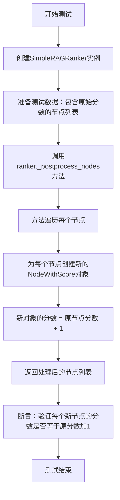
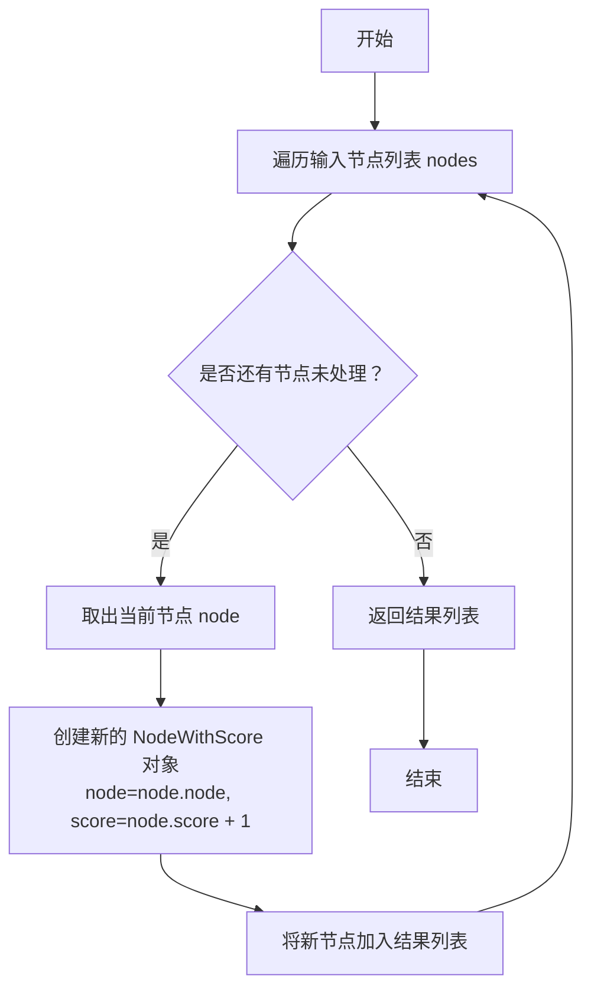
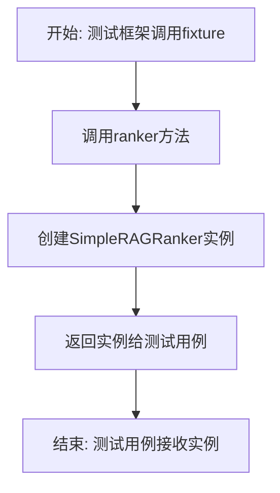
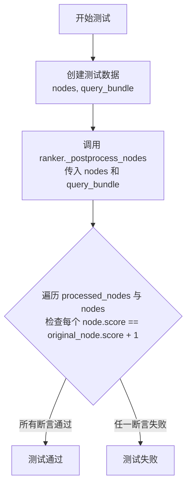

# `.\MetaGPT\tests\metagpt\rag\rankers\test_base_ranker.py` 详细设计文档

该代码定义了一个简单的RAG（检索增强生成）排序器（SimpleRAGRanker），它继承自一个基础排序器（RAGRanker），并重写了节点后处理方法，将所有传入节点的分数加1。同时，代码包含了对该排序器的单元测试，验证其分数增加功能是否正确。

## 整体流程



## 类结构

```
RAGRanker (基类，来自metagpt.rag.rankers.base)
└── SimpleRAGRanker (具体实现类)
TestSimpleRAGRanker (测试类)
```

## 全局变量及字段


    

## 全局函数及方法

### `SimpleRAGRanker._postprocess_nodes`

该方法是一个简单的后处理函数，用于对检索到的节点列表进行加工。其核心功能是遍历输入的节点列表，为每个节点的原始分数增加一个固定的增量（此处为1），并返回一个新的`NodeWithScore`对象列表，其中包含了更新后的分数。

参数：

- `nodes`：`List[NodeWithScore]`，需要进行后处理的节点列表，每个节点包含其原始内容和分数。
- `query_bundle`：`Optional[QueryBundle]`，查询包对象，包含原始的查询字符串等信息。在此方法中未使用，但为接口兼容性而保留。

返回值：`List[NodeWithScore]`，返回一个新的节点列表，其中每个节点的分数是原始分数加1。

#### 流程图



#### 带注释源码

```python
def _postprocess_nodes(self, nodes, query_bundle=None):
    # 使用列表推导式遍历输入的 nodes 列表
    # 对于列表中的每个 node 对象（类型为 NodeWithScore）：
    #   1. 保留其原始的 node.node 属性（即节点内容）
    #   2. 将其原始的 node.score 分数加 1，作为新节点的分数
    #   3. 用以上两个参数构造一个新的 NodeWithScore 对象
    # 最终，将所有新构造的 NodeWithScore 对象组成一个新的列表并返回
    return [NodeWithScore(node=node.node, score=node.score + 1) for node in nodes]
```


### `TestSimpleRAGRanker.ranker`

这是一个用于 `pytest` 测试框架的 `fixture` 方法。它的核心功能是创建并返回一个 `SimpleRAGRanker` 类的实例，以便在 `TestSimpleRAGRanker` 类的测试方法中作为依赖项使用。它遵循了 `pytest` 的依赖注入模式，简化了测试对象的创建和复用。

参数：
- 无显式参数。`pytest` 的 `fixture` 机制会自动调用此方法。

返回值：`SimpleRAGRanker`，一个 `SimpleRAGRanker` 类的实例，用于后续的单元测试。

#### 流程图



#### 带注释源码

```python
    @pytest.fixture  # 使用pytest的fixture装饰器，将此方法标记为一个测试夹具
    def ranker(self):  # 定义名为ranker的fixture方法，self指向TestSimpleRAGRanker测试类本身
        return SimpleRAGRanker()  # 创建并返回一个SimpleRAGRanker对象实例
```


### `TestSimpleRAGRanker.test_postprocess_nodes_increases_scores`

该方法是一个单元测试，用于验证 `SimpleRAGRanker` 类的 `_postprocess_nodes` 方法是否正确地增加了传入节点的分数。它创建了两个带有初始分数的 `NodeWithScore` 对象，调用待测试的方法，并断言处理后的每个节点的分数都比原始节点分数增加了1。

参数：
-  `self`：`TestSimpleRAGRanker`，测试类实例自身。
-  `ranker`：`SimpleRAGRanker`，通过 `@pytest.fixture` 装饰器提供的 `SimpleRAGRanker` 实例。

返回值：`None`，这是一个测试方法，不返回任何值，其目的是通过断言来验证功能。

#### 流程图



#### 带注释源码

```python
def test_postprocess_nodes_increases_scores(self, ranker):
    # 1. 准备测试数据：创建两个带有初始分数的 NodeWithScore 对象和一个查询包。
    nodes = [NodeWithScore(node=TextNode(text="a"), score=10), NodeWithScore(node=TextNode(text="b"), score=20)]
    query_bundle = QueryBundle(query_str="test query")

    # 2. 执行待测试的方法：调用 ranker 的 _postprocess_nodes 方法处理节点。
    processed_nodes = ranker._postprocess_nodes(nodes, query_bundle)

    # 3. 验证结果：使用断言检查处理后的每个节点的分数是否比原始节点分数增加了1。
    #    zip(processed_nodes, nodes) 将处理前后的节点配对。
    #    all(...) 确保所有配对都满足条件。
    assert all(node.score == original_node.score + 1 for node, original_node in zip(processed_nodes, nodes))
```

## 关键组件


### RAGRanker基类

定义了RAG（检索增强生成）系统中排序器的抽象基类，为具体排序器实现提供了统一的接口和基础结构。

### SimpleRAGRanker类

一个简单的RAG排序器实现，继承自`RAGRanker`，其核心功能是对输入的节点列表进行后处理，将每个节点的分数增加1。

### NodeWithScore类

用于封装检索到的节点及其相关性分数的数据结构，是排序器处理的基本单元。

### QueryBundle类

封装用户查询信息的数据结构，在排序过程中可能被用于更复杂的相关性计算。

### TextNode类

表示文本内容的基本节点，包含文本数据，是`NodeWithScore`中`node`字段的一种具体类型。

### _postprocess_nodes方法

`SimpleRAGRanker`类中实现的后处理方法，接收节点列表和可选的查询包，通过遍历节点并为其分数加1来生成新的节点列表。


## 问题及建议


### 已知问题

-   **测试类命名与实际测试对象不符**：测试类名为 `TestSimpleRAGRanker`，但测试方法 `test_postprocess_nodes_increases_scores` 测试的是 `_postprocess_nodes` 这个受保护方法。这违反了单元测试应针对公共接口的原则，使得测试与实现细节紧密耦合。如果 `_postprocess_nodes` 方法被重命名、移除或改变其内部实现，测试将失败，即使类的公共行为（`postprocess_nodes`）没有改变。
-   **测试覆盖不完整**：测试仅验证了分数增加的功能，但没有测试 `RAGRanker` 基类中定义的 `postprocess_nodes` 公共方法是否被正确调用或包装。也没有测试边界情况，例如输入空节点列表、节点分数为负数或浮点数等情况下的行为。
-   **模拟实现过于简单，缺乏实际意义**：`SimpleRAGRanker` 的实现（将所有分数加1）过于简单，更像是一个用于测试的桩（Stub）或模拟对象（Mock），而不是一个有实际排序逻辑的组件。这可能导致在理解 `RAGRanker` 抽象的实际用途时产生困惑。
-   **缺乏对 `query_bundle` 参数的使用**：在 `SimpleRAGRanker._postprocess_nodes` 的实现中，`query_bundle` 参数被接收但未使用。虽然这可能是在特定测试场景下的设计，但它没有展示一个典型的 `RAGRanker` 子类应如何利用查询信息进行重新排序，使得示例的指导意义减弱。

### 优化建议

-   **重构测试以针对公共接口**：将测试重点从 `_postprocess_nodes` 转移到公共方法 `postprocess_nodes`。这样可以确保测试的是契约和行为，而不是实现细节。测试可以通过断言最终输出节点的分数是否如预期增加来完成。
-   **补充测试用例**：增加更多的测试用例以提高覆盖率和健壮性。例如：
    -   测试传入空节点列表时，方法是否返回空列表。
    -   测试节点分数包含各种数值（零、负数、浮点数）时，`+1` 操作是否符合预期。
    -   测试 `postprocess_nodes` 方法是否确实调用了 `_postprocess_nodes`（可通过使用 `unittest.mock.patch` 来验证）。
-   **提供更有意义的示例实现**：考虑将 `SimpleRAGRanker` 重命名为更能反映其测试用途的名称，如 `MockIncrementRanker`，或者在示例中提供一个虽简单但更贴近实际场景的排序逻辑（例如，根据节点文本长度微调分数）。这能更好地服务于文档和示例的目的。
-   **明确 `query_bundle` 参数的角色**：如果 `SimpleRAGRanker` 仅用于演示或测试，可以在 `_postprocess_nodes` 方法中明确忽略 `query_bundle`（例如，添加 `_` 前缀或注释说明）。或者，实现一个会使用该参数的简单示例，以展示接口的完整用法。
-   **考虑添加类型提示的完整性**：虽然当前代码片段中类型提示已由基类继承，但确保所有测试工具方法（如 `ranker` fixture）也有明确的返回类型提示，可以提高代码的清晰度和工具支持（如IDE的自动补全和静态类型检查）。


## 其它


### 设计目标与约束

本代码的设计目标是实现一个简单的RAG（检索增强生成）排序器（Ranker），用于在RAG流程中对检索到的节点进行后处理。具体目标包括：
1. 提供一个可扩展的基类 `RAGRanker`，定义排序器的标准接口。
2. 实现一个具体的排序器 `SimpleRAGRanker`，演示如何通过修改节点分数来进行后处理。
3. 提供完整的单元测试 `TestSimpleRAGRanker`，确保排序器功能的正确性。

主要约束包括：
1. 必须继承自 `metagpt.rag.rankers.base.RAGRanker` 基类，遵循其定义的接口规范。
2. 排序逻辑应保持简单，专注于演示后处理流程，而非实现复杂的排序算法。
3. 单元测试需使用 `pytest` 框架，并确保测试的独立性和可重复性。

### 错误处理与异常设计

当前代码未显式包含错误处理逻辑。其行为依赖于父类 `RAGRanker` 和输入数据的有效性。
1. **输入验证**：`_postprocess_nodes` 方法假设 `nodes` 参数是一个可迭代对象，且每个元素都是 `NodeWithScore` 实例。如果传入非法数据（如 `None`、非迭代对象或元素类型错误），Python解释器将抛出相应的内置异常（如 `TypeError`, `AttributeError`）。
2. **异常传播**：任何在 `_postprocess_nodes` 方法执行过程中发生的异常（例如，`node.score` 不是数值类型）都将直接向上抛出，由调用者处理。
3. **测试异常**：单元测试 `test_postprocess_nodes_increases_scores` 仅验证正常路径下的功能，未包含对异常输入或边界条件的测试案例。

### 数据流与状态机

本模块的数据流相对简单直接，不涉及复杂的状态转换。
1. **数据输入**：`SimpleRAGRanker._postprocess_nodes` 方法接收两个参数：一个 `NodeWithScore` 对象列表 (`nodes`) 和一个可选的 `QueryBundle` 对象 (`query_bundle`)。
2. **数据处理**：方法内部遍历 `nodes` 列表，为每个 `NodeWithScore` 对象的 `score` 字段增加一个固定值（此处为1），并使用原节点的 `node` 属性和新的 `score` 创建一个新的 `NodeWithScore` 对象。
3. **数据输出**：返回一个新的 `NodeWithScore` 对象列表，其中每个节点的分数比原始节点分数高1。原始的 `nodes` 列表和 `query_bundle` 对象不会被修改。
4. **状态**：`SimpleRAGRanker` 类是无状态的，其行为不依赖于任何内部状态，仅由输入参数决定。

### 外部依赖与接口契约

1. **外部库依赖**：
    * `pytest`：仅用于编写和执行单元测试，不属于核心功能的生产依赖。
    * `llama_index.core.schema`：定义了核心数据结构 `NodeWithScore`, `QueryBundle`, `TextNode`。`SimpleRAGRanker` 的操作严重依赖于这些类的接口。
    * `metagpt.rag.rankers.base`：定义了抽象基类 `RAGRanker`。`SimpleRAGRanker` 通过继承并实现 `_postprocess_nodes` 方法来履行与该基类的契约。

2. **接口契约**：
    * **与 `RAGRanker` 基类的契约**：`SimpleRAGRanker` 必须实现 `_postprocess_nodes` 方法。该方法应接收 `nodes` 和 `query_bundle` 参数，并返回一个处理后的 `NodeWithScore` 列表。本实现履行了此契约。
    * **与调用者的契约**：调用者（通常是RAG检索流程）期望 `_postprocess_nodes` 方法返回一个有效的节点列表。本实现保证返回一个新列表，且不修改输入列表。
    * **与 `NodeWithScore` 的契约**：代码假设 `NodeWithScore` 对象具有 `node` 和 `score` 属性，并且 `score` 支持加法操作。这是与 `llama_index.core.schema.NodeWithScore` 类定义的隐式契约。

    