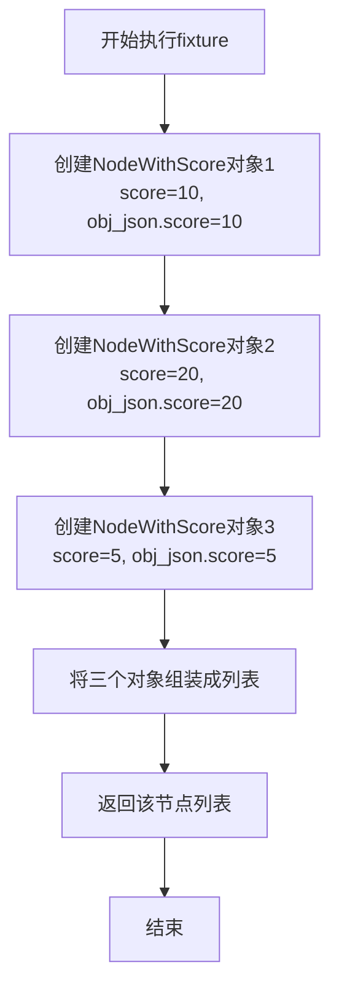
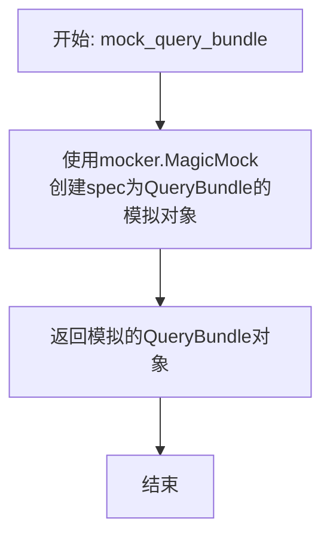
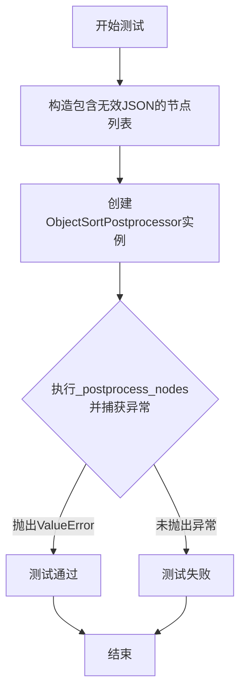
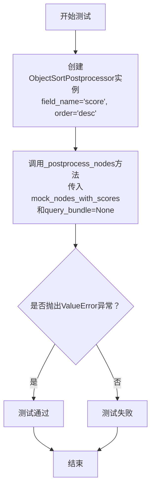
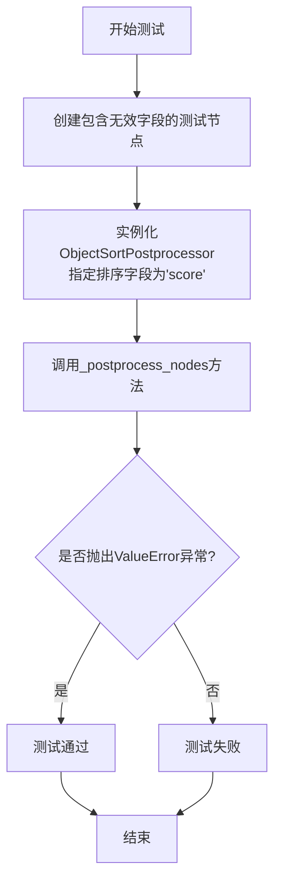
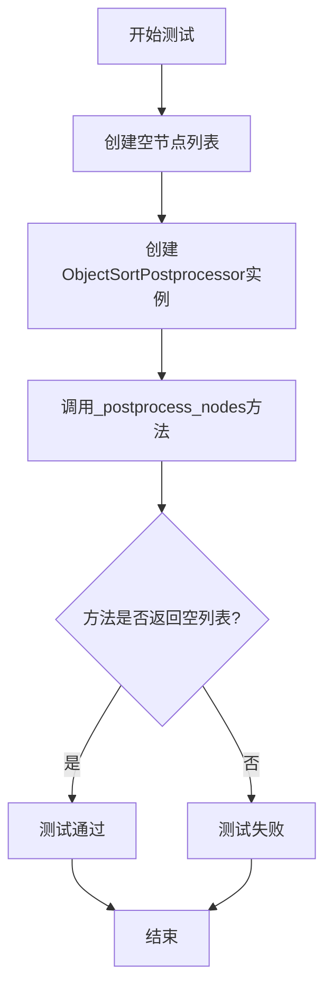

# `.\MetaGPT\tests\metagpt\rag\rankers\test_object_ranker.py` 详细设计文档

该文件是一个针对 ObjectSortPostprocessor 类的单元测试文件，用于验证其能够根据指定字段对包含 JSON 序列化对象的节点进行正确排序（升序或降序），支持 top_n 截断，并能妥善处理无效输入（如缺失字段、无效 JSON、空节点列表等）。

## 整体流程

```mermaid
graph TD
    A[开始执行测试] --> B{选择测试用例}
    B --> C[test_sort_descending]
    B --> D[test_sort_ascending]
    B --> E[test_top_n_limit]
    B --> F[test_invalid_json_metadata]
    B --> G[test_missing_query_bundle]
    B --> H[test_field_not_found_in_object]
    B --> I[test_not_nodes]
    B --> J[test_class_name]
    C --> K[创建降序排序器]
    K --> L[调用 _postprocess_nodes]
    L --> M[断言结果顺序为 [20, 10, 5]]
    D --> N[创建升序排序器]
    N --> O[调用 _postprocess_nodes]
    O --> P[断言结果顺序为 [5, 10, 20]]
    E --> Q[创建带top_n=2的降序排序器]
    Q --> R[调用 _postprocess_nodes]
    R --> S[断言结果长度为2且顺序为 [20, 10]]
    F --> T[创建包含无效JSON的节点]
    T --> U[创建排序器并调用 _postprocess_nodes]
    U --> V[断言抛出 ValueError]
    G --> W[创建排序器]
    W --> X[调用 _postprocess_nodes 并传入 None query_bundle]
    X --> Y[断言抛出 ValueError]
    H --> Z[创建节点，其对象中缺少指定字段]
    Z --> AA[创建排序器并调用 _postprocess_nodes]
    AA --> AB[断言抛出 ValueError]
    I --> AC[创建空节点列表]
    AC --> AD[创建排序器并调用 _postprocess_nodes]
    AD --> AE[断言返回空列表]
    J --> AF[调用 ObjectSortPostprocessor.class_name()]
    AF --> AG[断言返回 'ObjectSortPostprocessor']
```

## 类结构

```
BaseModel (Pydantic)
├── Record (测试辅助类)
TestObjectSortPostprocessor (pytest 测试类)
├── mock_nodes_with_scores (fixture)
├── mock_query_bundle (fixture)
├── test_sort_descending (测试方法)
├── test_sort_ascending (测试方法)
├── test_top_n_limit (测试方法)
├── test_invalid_json_metadata (测试方法)
├── test_missing_query_bundle (测试方法)
├── test_field_not_found_in_object (测试方法)
├── test_not_nodes (测试方法)
└── test_class_name (测试方法)
```

## 全局变量及字段


### `Record.score`
    
表示记录的分值，用于在排序测试中作为排序依据的字段

类型：`int`
    
    

## 全局函数及方法

### `TestObjectSortPostprocessor.mock_nodes_with_scores`

这是一个用于单元测试的pytest fixture函数。它的核心功能是创建并返回一个预定义的、包含三个`NodeWithScore`对象的列表，用于模拟`ObjectSortPostprocessor`排序处理器需要处理的输入数据。每个`NodeWithScore`对象都包含一个`ObjectNode`，其元数据中存储了一个JSON字符串，该字符串是由一个`Record` Pydantic模型序列化而来，其中包含一个名为`score`的整数字段。这个fixture为后续的测试方法（如`test_sort_descending`, `test_sort_ascending`等）提供了标准化的测试数据。

参数：
-   `self`：`TestObjectSortPostprocessor`，表示`TestObjectSortPostprocessor`测试类的一个实例，这是类方法的隐式参数。

返回值：`list[NodeWithScore]`，返回一个包含三个`NodeWithScore`对象的列表，这些对象具有不同的`score`值（10, 20, 5），用于测试排序功能。

#### 流程图



#### 带注释源码

```python
    @pytest.fixture
    # 定义一个pytest fixture，名为`mock_nodes_with_scores`。
    # fixture在测试中用于提供可重用的测试数据或设置。
    def mock_nodes_with_scores(self):
        # 创建一个包含三个NodeWithScore对象的列表。
        # 每个NodeWithScore包装了一个ObjectNode，其元数据中包含序列化为JSON的Record对象。
        nodes = [
            # 第一个节点：ObjectNode的元数据中存储了Record(score=10)的JSON，NodeWithScore的score也为10。
            NodeWithScore(node=ObjectNode(metadata={"obj_json": Record(score=10).model_dump_json()}), score=10),
            # 第二个节点：Record的score为20，NodeWithScore的score也为20。
            NodeWithScore(node=ObjectNode(metadata={"obj_json": Record(score=20).model_dump_json()}), score=20),
            # 第三个节点：Record的score为5，NodeWithScore的score也为5。
            NodeWithScore(node=ObjectNode(metadata={"obj_json": Record(score=5).model_dump_json()}), score=5),
        ]
        # 返回这个构建好的节点列表，供测试函数使用。
        return nodes
```

### `TestObjectSortPostprocessor.mock_query_bundle`

这是一个用于单元测试的pytest fixture函数，其核心功能是创建一个模拟的`QueryBundle`对象，用于在测试`ObjectSortPostprocessor`类时，模拟查询请求，避免依赖真实的查询逻辑或外部服务。

参数：

- `mocker`：`pytest_mock.plugin.MockerFixture`，pytest-mock插件提供的mocker对象，用于创建和管理模拟对象。

返回值：`unittest.mock.MagicMock`，一个模拟的`QueryBundle`对象实例，其行为可以被测试用例控制和断言。

#### 流程图



#### 带注释源码

```python
    @pytest.fixture
    # 定义一个pytest fixture，命名为`mock_query_bundle`。
    # fixture是pytest用于提供测试依赖（如数据、对象）的机制。
    # 当测试函数将此fixture名称作为参数时，pytest会自动调用此函数并注入其返回值。
    def mock_query_bundle(self, mocker):
        # 参数`mocker`由pytest-mock插件自动注入，它是一个用于创建模拟对象的工具。
        # `spec=QueryBundle`参数指定了模拟对象应该模仿`QueryBundle`类的接口。
        # 这意味着模拟对象会拥有`QueryBundle`的所有方法和属性，但它们的实现都是模拟的（默认返回另一个MagicMock）。
        # 这确保了在测试中，即使调用了模拟对象的方法，也不会执行真实逻辑，同时保持了类型安全。
        return mocker.MagicMock(spec=QueryBundle)
```

### `TestObjectSortPostprocessor.test_sort_descending`

该方法用于测试 `ObjectSortPostprocessor` 后处理器按指定字段降序排序节点的功能。它创建一个后处理器实例，传入一个模拟的节点列表（包含不同分数的节点）和一个模拟的查询包，然后验证排序后的节点分数顺序是否符合降序预期。

参数：

-  `mock_nodes_with_scores`：`List[NodeWithScore]`，一个包含三个 `NodeWithScore` 对象的列表，每个对象的 `node` 属性是一个 `ObjectNode`，其元数据中包含一个 JSON 字符串，表示一个具有 `score` 字段的 `Record` 对象。这些节点的 `score` 属性值分别为 10、20 和 5。
-  `mock_query_bundle`：`MagicMock`，一个模拟的 `QueryBundle` 对象，用于满足 `_postprocess_nodes` 方法的参数要求，在本测试中不参与实际逻辑。

返回值：`None`，这是一个单元测试方法，不返回业务值，其功能通过断言（`assert`）来验证。

#### 流程图

```mermaid
flowchart TD
    A[开始测试] --> B[创建 ObjectSortPostprocessor 实例<br>field_name='score', order='desc']
    B --> C[调用 _postprocess_nodes 方法<br>传入 mock_nodes_with_scores 和 mock_query_bundle]
    C --> D[获取排序后的节点列表 sorted_nodes]
    D --> E[断言 sorted_nodes 的分数顺序为 [20, 10, 5]]
    E --> F[测试通过]
```

#### 带注释源码

```python
def test_sort_descending(self, mock_nodes_with_scores, mock_query_bundle):
    # 1. 实例化 ObjectSortPostprocessor，配置为按 'score' 字段降序排序
    postprocessor = ObjectSortPostprocessor(field_name="score", order="desc")
    
    # 2. 调用后处理器的核心方法，传入模拟的节点列表和查询包
    sorted_nodes = postprocessor._postprocess_nodes(mock_nodes_with_scores, mock_query_bundle)
    
    # 3. 验证：提取排序后每个节点的分数，断言其顺序为 [20, 10, 5]
    #    这验证了降序排序功能正常工作。
    assert [node.score for node in sorted_nodes] == [20, 10, 5]
```

### `TestObjectSortPostprocessor.test_sort_ascending`

该方法用于测试 `ObjectSortPostprocessor` 后处理器在升序（`asc`）模式下对节点列表进行排序的功能。它验证排序后的节点列表是否按照指定字段（此处为 `score`）的值从小到大正确排列。

参数：

- `mock_nodes_with_scores`：`List[NodeWithScore]`，一个包含三个 `NodeWithScore` 对象的列表，每个对象的 `node` 属性是一个 `ObjectNode`，其元数据中包含一个 JSON 字符串，该字符串是 `Record` 对象的序列化形式，`Record` 对象包含一个 `score` 字段。这些节点的 `score` 属性值分别为 10, 20, 5。
- `mock_query_bundle`：`QueryBundle`，一个模拟的查询包对象，用于作为 `_postprocess_nodes` 方法的参数，在本测试中不直接影响排序逻辑。

返回值：`None`，这是一个单元测试方法，其主要目的是通过断言（`assert`）来验证功能，不返回业务逻辑值。

#### 流程图

```mermaid
flowchart TD
    A[开始测试] --> B[创建ObjectSortPostprocessor实例<br>field_name='score', order='asc']
    B --> C[调用_postprocess_nodes方法<br>传入mock_nodes_with_scores和mock_query_bundle]
    C --> D{内部处理流程}
    D --> E[从每个节点的元数据中<br>解析JSON并提取'score'字段值]
    E --> F[根据提取的'score'值<br>对节点列表进行升序排序]
    F --> G[返回排序后的节点列表]
    G --> H[断言验证<br>排序后节点的score属性序列为[5, 10, 20]]
    H --> I[测试通过]
```

#### 带注释源码

```python
def test_sort_ascending(self, mock_nodes_with_scores, mock_query_bundle):
    # 1. 实例化ObjectSortPostprocessor，配置为按'score'字段进行升序排序。
    postprocessor = ObjectSortPostprocessor(field_name="score", order="asc")
    
    # 2. 调用后处理器的核心方法，传入模拟的节点列表和查询包。
    #    _postprocess_nodes方法将根据配置对节点进行排序。
    sorted_nodes = postprocessor._postprocess_nodes(mock_nodes_with_scores, mock_query_bundle)
    
    # 3. 断言验证：检查排序后节点的score属性列表是否等于预期的升序序列[5, 10, 20]。
    #    这验证了排序逻辑的正确性。
    assert [node.score for node in sorted_nodes] == [5, 10, 20]
```

### `TestObjectSortPostprocessor.test_top_n_limit`

该方法用于测试 `ObjectSortPostprocessor` 后处理器在设置了 `top_n` 参数时，能否正确地对节点进行降序排序并仅返回前 N 个节点。

参数：

- `mock_nodes_with_scores`：`List[NodeWithScore]`，由 `@pytest.fixture` 提供的模拟节点列表，每个节点包含一个 `ObjectNode` 和分数。
- `mock_query_bundle`：`QueryBundle`，由 `@pytest.fixture` 提供的模拟查询包。

返回值：`None`，这是一个测试方法，不返回业务值，其功能通过断言（`assert`）来验证。

#### 流程图

```mermaid
flowchart TD
    A[开始测试] --> B[创建ObjectSortPostprocessor实例<br>设置field_name='score', order='desc', top_n=2]
    B --> C[调用_postprocess_nodes方法<br>传入mock_nodes_with_scores和mock_query_bundle]
    C --> D{内部处理流程}
    D --> E[从每个节点的元数据中<br>解析JSON并提取'score'字段]
    E --> F[根据'score'字段值<br>按降序排列所有节点]
    F --> G[应用top_n限制<br>仅保留前2个节点]
    G --> H[返回排序并截断后的节点列表]
    H --> I[断言验证]
    I --> J[断言1: 返回列表长度为2]
    I --> K[断言2: 返回节点分数为[20, 10]]
    J --> L[测试通过]
    K --> L
```

#### 带注释源码

```python
def test_top_n_limit(self, mock_nodes_with_scores, mock_query_bundle):
    # 1. 创建被测试的ObjectSortPostprocessor对象实例。
    #    配置其按'score'字段进行降序('desc')排序，并设置只返回前2个结果(top_n=2)。
    postprocessor = ObjectSortPostprocessor(field_name="score", order="desc", top_n=2)
    
    # 2. 调用后处理器的核心方法，传入模拟的节点列表和查询包。
    #    该方法内部会解析每个节点的元数据，提取指定字段，进行排序，并应用top_n限制。
    sorted_nodes = postprocessor._postprocess_nodes(mock_nodes_with_scores, mock_query_bundle)
    
    # 3. 验证断言1：经过处理后返回的节点列表长度应为2（即top_n的值）。
    assert len(sorted_nodes) == 2
    
    # 4. 验证断言2：返回的节点列表中的分数，应该是原始列表中分数最高的两个，且按降序排列，即[20, 10]。
    #    mock_nodes_with_scores中的原始分数为 [10, 20, 5]。
    assert [node.score for node in sorted_nodes] == [20, 10]
```

### `TestObjectSortPostprocessor.test_invalid_json_metadata`

该方法用于测试 `ObjectSortPostprocessor` 后处理器在遇到包含无效 JSON 字符串的节点元数据时，是否能正确地抛出 `ValueError` 异常。它构造了一个包含无效 JSON 的 `NodeWithScore` 节点，并验证后处理过程会因此失败。

参数：

- `self`：`TestObjectSortPostprocessor`，测试类实例的引用。
- `mock_query_bundle`：`MagicMock`，一个模拟的 `QueryBundle` 对象，用于作为 `_postprocess_nodes` 方法的参数。

返回值：`None`，这是一个单元测试方法，不返回业务值，其成功与否由 `pytest.raises` 上下文管理器断言。

#### 流程图



#### 带注释源码

```python
def test_invalid_json_metadata(self, mock_query_bundle):
    # 1. 准备测试数据：创建一个节点列表，其中包含一个元数据中 `obj_json` 字段为无效 JSON 字符串的节点。
    nodes = [NodeWithScore(node=ObjectNode(metadata={"obj_json": "invalid_json"}), score=10)]
    
    # 2. 创建被测对象：实例化 ObjectSortPostprocessor，指定排序字段为 "score"，顺序为降序。
    postprocessor = ObjectSortPostprocessor(field_name="score", order="desc")
    
    # 3. 执行测试并断言：使用 pytest.raises 上下文管理器验证，
    #    当调用 _postprocess_nodes 方法处理包含无效 JSON 的节点时，会抛出 ValueError 异常。
    with pytest.raises(ValueError):
        postprocessor._postprocess_nodes(nodes, mock_query_bundle)
```

### `TestObjectSortPostprocessor.test_missing_query_bundle`

该方法用于测试 `ObjectSortPostprocessor._postprocess_nodes` 方法在传入的 `query_bundle` 参数为 `None` 时，是否能正确地抛出 `ValueError` 异常。这是对后处理器边界条件和错误处理能力的验证。

参数：

- `self`：`TestObjectSortPostprocessor`，测试类实例的引用。
- `mock_nodes_with_scores`：`list[NodeWithScore]`，由 `@pytest.fixture` 装饰器生成的模拟节点列表，用于作为测试的输入数据。

返回值：`None`，这是一个单元测试方法，不返回任何值，其目的是通过断言来验证代码行为。

#### 流程图



#### 带注释源码

```python
def test_missing_query_bundle(self, mock_nodes_with_scores):
    # 1. 实例化被测试的ObjectSortPostprocessor对象，配置其按'score'字段降序排序。
    postprocessor = ObjectSortPostprocessor(field_name="score", order="desc")
    
    # 2. 调用被测试的_postprocess_nodes方法，并传入一个空的query_bundle（None）。
    #    使用pytest.raises上下文管理器来断言此调用会引发ValueError异常。
    #    这是测试的核心：验证当query_bundle缺失时，后处理器能正确地进行错误处理。
    with pytest.raises(ValueError):
        postprocessor._postprocess_nodes(mock_nodes_with_scores, query_bundle=None)
```

### `TestObjectSortPostprocessor.test_field_not_found_in_object`

该方法用于测试 `ObjectSortPostprocessor` 后处理器在尝试对节点进行排序时，当指定的排序字段在节点的元数据对象中不存在时，是否能正确地抛出 `ValueError` 异常。这是一个单元测试，旨在验证代码的健壮性和错误处理能力。

参数：

- `mock_query_bundle`：`MagicMock`，一个模拟的 `QueryBundle` 对象，用于模拟查询上下文，在本测试中未实际使用。
- `self`：`TestObjectSortPostprocessor`，测试类实例的引用。

返回值：`None`，这是一个测试方法，其主要目的是通过断言（`assert`）或检查是否抛出预期的异常来验证功能，不返回业务值。

#### 流程图



#### 带注释源码

```python
def test_field_not_found_in_object(self, mock_query_bundle):
    # 创建一个测试节点列表，其中仅包含一个NodeWithScore对象。
    # 该节点的元数据中，'obj_json'字段对应的JSON字符串表示一个字典，
    # 该字典包含键'not_score'，而不包含测试中ObjectSortPostprocessor
    # 将要查找的'score'键。
    nodes = [NodeWithScore(node=ObjectNode(metadata={"obj_json": json.dumps({"not_score": 10})}), score=10)]
    
    # 实例化被测试的ObjectSortPostprocessor对象。
    # 配置其按'score'字段进行降序（'desc'）排序。
    postprocessor = ObjectSortPostprocessor(field_name="score", order="desc")
    
    # 使用pytest的`raises`上下文管理器来断言：
    # 当调用`_postprocess_nodes`方法处理上述节点时，
    # 由于节点对象中不存在'score'字段，应抛出ValueError异常。
    with pytest.raises(ValueError):
        postprocessor._postprocess_nodes(nodes, query_bundle=mock_query_bundle)
```

### `TestObjectSortPostprocessor.test_not_nodes`

该方法用于测试 `ObjectSortPostprocessor` 的 `_postprocess_nodes` 方法在输入节点列表为空时的行为。它验证当没有节点需要处理时，后处理器能够正确地返回一个空列表，而不会引发异常或错误。

参数：

- `self`：`TestObjectSortPostprocessor`，测试类实例的引用。
- `mock_query_bundle`：`MagicMock`，一个模拟的查询包对象，用于模拟 `_postprocess_nodes` 方法的 `query_bundle` 参数。

返回值：`None`，该测试方法不返回任何值，其目的是通过断言来验证代码行为。

#### 流程图



#### 带注释源码

```python
def test_not_nodes(self, mock_query_bundle):
    # 创建一个空的节点列表，模拟没有节点需要处理的情况
    nodes = []
    # 实例化ObjectSortPostprocessor，指定排序字段为'score'，排序顺序为降序
    postprocessor = ObjectSortPostprocessor(field_name="score", order="desc")
    # 调用后处理器的_postprocess_nodes方法，传入空节点列表和模拟的查询包
    result = postprocessor._postprocess_nodes(nodes, mock_query_bundle)
    # 断言：验证返回的结果是一个空列表
    assert result == []
```

### `TestObjectSortPostprocessor.test_class_name`

该方法是一个单元测试，用于验证 `ObjectSortPostprocessor` 类的 `class_name` 方法是否返回正确的类名字符串。它通过断言来确保 `ObjectSortPostprocessor.class_name()` 的返回值等于预期的 `"ObjectSortPostprocessor"`。

参数：
-  `self`：`TestObjectSortPostprocessor`，指向当前测试类实例的引用。

返回值：`None`，该测试方法不返回任何值，其功能通过断言（`assert`）来体现。

#### 流程图

```mermaid
flowchart TD
    A[开始] --> B[调用 ObjectSortPostprocessor.class_name()]
    B --> C{返回值 ==<br/>'ObjectSortPostprocessor'?}
    C -- 是 --> D[测试通过]
    C -- 否 --> E[断言失败，测试不通过]
    D --> F[结束]
    E --> F
```

#### 带注释源码

```python
def test_class_name(self):
    # 调用 ObjectSortPostprocessor 类的 class_name 静态/类方法
    # 预期该方法返回类名的字符串表示
    assert ObjectSortPostprocessor.class_name() == "ObjectSortPostprocessor"
    # 使用 assert 语句验证实际返回值是否与预期字符串完全一致
    # 如果一致，测试通过；否则，pytest 将报告断言错误
```

## 关键组件

### ObjectSortPostprocessor

一个用于对包含序列化对象的检索增强生成（RAG）节点进行排序的后处理器。它从节点的元数据中提取指定的字段值，并根据该值对节点列表进行升序或降序排序，同时支持限制返回结果的数量（top_n）。

### ObjectNode

一个特殊的节点类型，其元数据中包含一个名为`obj_json`的字段，该字段存储了一个对象的JSON序列化字符串。`ObjectSortPostprocessor`依赖此结构来解析和提取排序所需的字段值。

### Record (Pydantic Model)

一个用于测试的Pydantic数据模型，包含一个`score`整数字段。在测试中，其实例被序列化为JSON字符串并存储在`ObjectNode`的元数据中，用以模拟`ObjectSortPostprocessor`处理的真实数据对象。

## 问题及建议


### 已知问题

-   **测试代码与实现代码耦合度高**：测试类 `TestObjectSortPostprocessor` 直接导入了待测类 `ObjectSortPostprocessor` 并调用了其内部方法 `_postprocess_nodes`。这表明 `_postprocess_nodes` 可能是一个私有或受保护的方法，直接测试它违反了封装原则，且测试的稳定性依赖于该内部方法的具体实现，而非公开接口。
-   **错误处理粒度较粗**：测试用例 `test_invalid_json_metadata`、`test_missing_query_bundle` 和 `test_field_not_found_in_object` 都预期抛出 `ValueError`。然而，这些错误源于不同的根本原因（JSON解析失败、参数缺失、字段缺失），使用同一种异常类型不利于调用方进行精确的错误处理和诊断。
-   **测试数据构造存在重复**：`mock_nodes_with_scores` fixture 中构造测试节点时，`NodeWithScore` 的 `score` 字段值与节点元数据中 `Record` 对象的 `score` 字段值被刻意设置为相同。这虽然方便了测试断言，但可能掩盖了排序逻辑实际是依据元数据中的字段值而非 `NodeWithScore.score` 这一事实，降低了测试的清晰度和对核心逻辑的验证强度。
-   **缺少边界和极端情况测试**：测试用例未覆盖 `top_n` 参数大于节点列表长度、等于0或为负数的情况。也未测试当 `order` 参数传入非 `"asc"` 或 `"desc"` 值时的行为。这些边界情况是潜在的错误来源。

### 优化建议

-   **解耦测试与实现**：建议通过测试 `ObjectSortPostprocessor` 的公开方法（例如一个 `postprocess` 或类似方法）来间接测试排序逻辑，而不是直接测试其内部方法 `_postprocess_nodes`。如果当前设计下必须测试此方法，应考虑将其访问级别调整为受保护的（`protected`）并添加清晰的文档说明，但优先推荐通过公共API进行测试。
-   **细化异常类型**：建议为不同的错误场景定义更具体的异常类型（例如 `InvalidJsonMetadataError`、`MissingQueryBundleError`、`FieldNotFoundInObjectError`）。这能提升代码的可读性和可维护性，使错误处理逻辑更加清晰。
-   **改进测试数据与断言**：在 `mock_nodes_with_scores` 中，使 `NodeWithScore.score` 与 `Record.score` 的值不同，以明确验证排序依据的是元数据中的字段。断言时，应提取并比较元数据中的目标字段值，而不是 `NodeWithScore.score`，使测试意图更明确。
-   **补充边界测试用例**：增加测试用例以验证：1) `top_n` 参数值大于节点数时返回所有节点；2) `top_n=0` 时返回空列表；3) 对 `top_n` 负数输入应有合理处理（如抛出异常或视为0）；4) 传入非法的 `order` 值时应抛出 `ValueError`。这能提高代码的健壮性。
-   **考虑使用参数化测试**：对于 `test_sort_descending` 和 `test_sort_ascending`，可以使用 `pytest.mark.parametrize` 来合并测试逻辑，减少代码重复，并使测试用例的输入输出对更清晰。
-   **增强测试描述性**：测试方法名称可以更具体，例如 `test_sort_descending_by_metadata_field` 和 `test_sort_ascending_by_metadata_field`，以更准确地反映被测试的行为。


## 其它


### 设计目标与约束

本模块的核心设计目标是实现一个可配置的、基于对象字段的后处理器，用于对检索增强生成（RAG）流程中检索到的节点进行排序。其核心约束包括：1) 必须能够从序列化的JSON字符串中解析出对象；2) 必须支持按指定字段进行升序或降序排序；3) 必须支持通过`top_n`参数限制输出结果数量；4) 必须继承自`llama_index`的`BaseNodePostprocessor`基类，以无缝集成到现有的RAG处理管道中。

### 错误处理与异常设计

模块通过抛出`ValueError`异常来处理多种错误场景，确保系统的健壮性。具体设计如下：
1.  **无效的JSON元数据**：当`metadata["obj_json"]`中的字符串无法被解析为有效的JSON时，抛出`ValueError`。
2.  **缺失查询包**：当必需的`query_bundle`参数为`None`时，抛出`ValueError`。
3.  **对象中未找到指定字段**：当从JSON解析出的对象中不存在`field_name`指定的字段时，抛出`ValueError`。
4.  **空节点列表**：当输入节点列表为空时，方法正常返回空列表，不视为错误。
这种设计将程序逻辑错误（如数据格式错误、参数缺失）与业务逻辑（如无结果）进行了清晰区分。

### 数据流与状态机

本模块处理的数据流是线性的，不涉及复杂的状态转换。
1.  **输入**：一个`NodeWithScore`对象列表和一个`QueryBundle`对象。每个`NodeWithScore`包含一个`ObjectNode`，其`metadata["obj_json"]`字段存储了序列化的对象JSON字符串。
2.  **处理**：
    a. 验证`query_bundle`不为`None`。
    b. 遍历节点列表，对每个节点：
        i. 从`metadata["obj_json"]`中加载JSON字符串。
        ii. 解析JSON为Python字典。
        iii. 从字典中提取`field_name`指定的字段值作为排序键。
    c. 根据`order`参数（`asc`或`desc`）对所有节点的排序键进行排序。
    d. 如果指定了`top_n`，则截取排序后的前N个节点。
3.  **输出**：一个经过排序（和可能截取）的`NodeWithScore`对象列表。节点的原始`score`属性（来自检索器）在此过程中被忽略，排序完全基于从对象中提取的指定字段。

### 外部依赖与接口契约

1.  **外部库依赖**：
    *   `llama_index.core`：核心依赖，模块继承自`BaseNodePostprocessor`，并处理其定义的`NodeWithScore`和`QueryBundle`类型。
    *   `pydantic`：用于在测试代码中定义数据模型`Record`，演示了与序列化/反序列化库的兼容性。
    *   `json`：Python标准库，用于解析JSON字符串。

2.  **接口契约**：
    *   **输入节点契约**：输入列表中的每个`NodeWithScore.node`必须是`ObjectNode`类型（或兼容类型），且其`metadata`字典必须包含键为`"obj_json"`的项，该项的值必须是可被`json.loads`解析的字符串。
    *   **输出契约**：返回的节点列表是输入列表的一个子集（经过排序和`top_n`筛选），列表中节点的顺序反映了按指定对象字段排序的结果。
    *   **基类契约**：必须实现`_postprocess_nodes`方法，其签名和返回值需符合`BaseNodePostprocessor`的要求。

### 测试策略与覆盖

提供的测试代码展示了完整的单元测试策略，覆盖了模块的所有主要功能点和异常分支：
1.  **功能测试**：验证升序(`test_sort_ascending`)、降序(`test_sort_descending`)排序和结果数量限制(`test_top_n_limit`)的正确性。
2.  **异常测试**：验证在输入无效JSON(`test_invalid_json_metadata`)、缺少必要参数(`test_missing_query_bundle`)、对象字段缺失(`test_field_not_found_in_object`)时能正确抛出异常。
3.  **边界测试**：验证输入空节点列表(`test_not_nodes`)时能正确处理并返回空列表。
4.  **元数据测试**：验证类名方法(`test_class_name`)返回正确值。
测试使用了`pytest`框架和`mocker`进行模拟，确保了测试的独立性和可靠性。

    