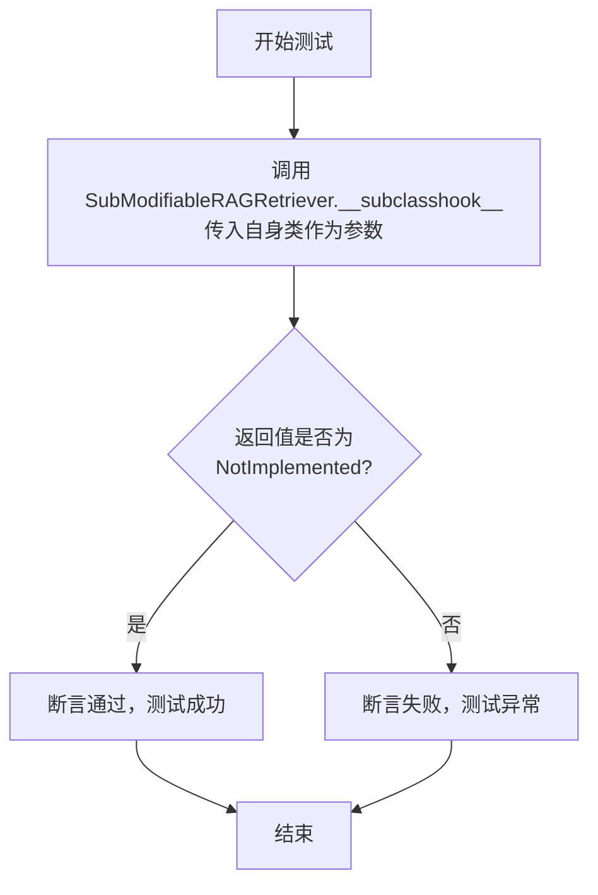

# `.\MetaGPT\tests\metagpt\rag\retrievers\test_base_retriever.py` 详细设计文档

该代码文件是一个测试模块，用于验证 MetaGPT RAG 框架中两个抽象基类 `ModifiableRAGRetriever` 和 `PersistableRAGRetriever` 的 `__subclasshook__` 方法的行为。它通过创建这两个基类的子类，并调用其 `__subclasshook__` 方法来测试当子类检查自身时，该方法是否正确地返回 `NotImplemented`，这是 Python 抽象基类机制中用于自定义子类检查逻辑的标准行为。

## 整体流程

```mermaid
graph TD
    A[开始测试] --> B[创建 SubModifiableRAGRetriever 实例]
    B --> C[调用 SubModifiableRAGRetriever.__subclasshook__(SubModifiableRAGRetriever)]
    C --> D{结果是否为 NotImplemented?}
    D -- 是 --> E[测试通过]
    D -- 否 --> F[测试失败]
    A --> G[创建 SubPersistableRAGRetriever 实例]
    G --> H[调用 SubPersistableRAGRetriever.__subclasshook__(SubPersistableRAGRetriever)]
    H --> I{结果是否为 NotImplemented?}
    I -- 是 --> J[测试通过]
    I -- 否 --> K[测试失败]
```

## 类结构

```
object (Python 内置基类)
├── ModifiableRAGRetriever (导入的抽象基类)
│   └── SubModifiableRAGRetriever (测试用子类)
├── PersistableRAGRetriever (导入的抽象基类)
│   └── SubPersistableRAGRetriever (测试用子类)
├── TestModifiableRAGRetriever (测试类)
└── TestPersistableRAGRetriever (测试类)
```

## 全局变量及字段


    

## 全局函数及方法

### `TestModifiableRAGRetriever.test_subclasshook`

该方法是一个单元测试，用于验证 `ModifiableRAGRetriever` 类的 `__subclasshook__` 特殊方法在特定情况下的行为。它测试当 `SubModifiableRAGRetriever` 类（`ModifiableRAGRetriever` 的子类）调用其自身的 `__subclasshook__` 方法时，返回值是否为 `NotImplemented`。这通常用于测试抽象基类（ABC）的子类检查逻辑是否正确实现。

参数：

- `self`：`TestModifiableRAGRetriever`，指向当前测试类实例的引用。

返回值：`None`，这是一个测试方法，其主要目的是通过断言（assert）来验证代码行为，不返回业务逻辑值。

#### 流程图



#### 带注释源码

```python
def test_subclasshook(self):
    # 调用 SubModifiableRAGRetriever 类的 __subclasshook__ 特殊方法，
    # 并将 SubModifiableRAGRetriever 类自身作为参数传入。
    # 这是为了测试当子类检查自身时，抽象基类的钩子方法如何响应。
    result = SubModifiableRAGRetriever.__subclasshook__(SubModifiableRAGRetriever)
    
    # 断言：验证上述调用的返回值是 NotImplemented。
    # 在 Python 的抽象基类机制中，__subclasshook__ 方法应返回
    # NotImplemented、True 或 False。返回 NotImplemented 表示
    # 应由标准的 issubclass() 逻辑继续判断。此测试确保该钩子方法
    # 在未明确处理的情况下返回正确的哨兵值。
    assert result is NotImplemented
```


### `TestPersistableRAGRetriever.test_subclasshook`

该方法是一个单元测试，用于验证 `PersistableRAGRetriever` 类的 `__subclasshook__` 特殊方法的行为。它测试当 `__subclasshook__` 方法被调用时，是否正确地返回 `NotImplemented`，这是 Python 抽象基类（ABC）机制中用于自定义子类检查逻辑的标准行为。

参数：

-  `self`：`TestPersistableRAGRetriever`，表示当前测试类的实例。

返回值：`None`，这是一个测试方法，其主要目的是通过断言（assert）来验证代码行为，不返回业务逻辑值。

#### 流程图


#### 带注释源码

```python
def test_subclasshook(self):
    # 调用 SubPersistableRAGRetriever 类的 __subclasshook__ 特殊方法。
    # 该方法通常由 isinstance() 和 issubclass() 内置函数在内部调用，
    # 用于实现抽象基类（ABC）的自定义子类检查逻辑。
    # 这里传入的参数是 SubPersistableRAGRetriever 类本身。
    result = SubPersistableRAGRetriever.__subclasshook__(SubPersistableRAGRetriever)

    # 断言：验证 __subclasshook__ 方法的返回值是 NotImplemented。
    # 对于未实现自定义子类检查逻辑的 ABC，其 __subclasshook__ 方法应返回 NotImplemented，
    # 这将使 Python 回退到标准的子类检查机制（即检查 __subclasshook__ 中定义的虚拟子类）。
    # 这个测试确保了 PersistableRAGRetriever 的 __subclasshook__ 行为符合预期，
    # 即没有将任意类都视为其子类，保持了类型检查的严格性。
    assert result is NotImplemented
```


## 关键组件


### ModifiableRAGRetriever

一个可修改的RAG检索器基类，定义了支持动态修改其内部检索逻辑或知识库的接口契约。

### PersistableRAGRetriever

一个可持久化的RAG检索器基类，定义了支持将检索器状态（如索引、缓存）保存到存储介质或从存储介质加载的接口契约。

### SubModifiableRAGRetriever

`ModifiableRAGRetriever` 的一个具体子类，用于测试或实现可修改检索器的具体功能。

### SubPersistableRAGRetriever

`PersistableRAGRetriever` 的一个具体子类，用于测试或实现可持久化检索器的具体功能。

### TestModifiableRAGRetriever

针对 `ModifiableRAGRetriever` 及其子类钩子机制 (`__subclasshook__`) 的测试类。

### TestPersistableRAGRetriever

针对 `PersistableRAGRetriever` 及其子类钩子机制 (`__subclasshook__`) 的测试类。


## 问题及建议


### 已知问题

-   **测试用例设计不完整**：当前测试仅验证了 `__subclasshook__` 方法返回 `NotImplemented` 这一种情况。这未能充分测试 `ModifiableRAGRetriever` 和 `PersistableRAGRetriever` 这两个抽象基类（ABC）的核心功能，即它们是否能够正确识别实现了特定接口（如 `add`， `delete`， `persist` 等方法）的子类。测试覆盖范围严重不足。
-   **测试类命名与实现类混淆**：测试类 `TestModifiableRAGRetriever` 和 `TestPersistableRAGRetriever` 的名称与待测的基类名称高度相似，容易在代码审查或维护时产生混淆，特别是当它们位于同一模块中时。
-   **测试用例缺乏实际意义**：`__subclasshook__` 方法通常由 Python 的 `issubclass` 内置函数调用，用于自定义子类检查逻辑。直接测试其返回 `NotImplemented` 并不能证明基类的抽象接口定义或子类检查机制工作正常，这更像是在测试 Python 语言本身的默认行为，而非业务逻辑。
-   **子类定义空洞**：`SubModifiableRAGRetriever` 和 `SubPersistableRAGRetriever` 类体内部仅使用 `...` 填充，未实现任何抽象方法或提供具体实现。这使得测试环境与真实使用场景脱节，无法验证一个“真正”的子类是否会被基类正确识别。

### 优化建议

-   **补充全面的接口测试**：为 `ModifiableRAGRetriever` 和 `PersistableRAGRetriever` 设计更全面的测试套件。应创建实现了所有必需抽象方法的“完整”子类，以及未实现全部方法的“不完整”子类，然后使用 `issubclass` 和 `isinstance` 来验证基类的子类检查逻辑是否符合预期（例如，完整子类应被识别为子类，不完整子类则不应被识别）。
-   **重命名测试类以提升清晰度**：建议遵循更清晰的命名约定，例如将测试类更名为 `TestModifiableRAGRetrieverABC` 或 `TestModifiableRAGRetrieverInterface`，以明确其测试的是抽象基类/接口的行为，而非某个具体实现。
-   **移除或重构无意义的 `__subclasshook__` 测试**：当前的 `test_subclasshook` 测试价值有限。可以考虑将其移除，或者将其重构为上述更全面的接口测试的一部分，以验证自定义的 `__subclasshook__` 逻辑（如果存在的话）。
-   **完善测试用的子类实现**：在测试模块中，应正确定义用于测试的子类。例如，`SubModifiableRAGRetriever` 应至少实现 `add` 和 `delete` 等方法（即使是空实现或抛出 `NotImplementedError`），`SubPersistableRAGRetriever` 应实现 `persist` 等方法。这能确保测试在贴近实际用法的上下文中进行。
-   **考虑使用 `unittest.mock` 或 `pytest` 夹具**：对于复杂的依赖或需要隔离测试的场景，可以使用 Mock 对象来模拟 `add`, `delete`, `persist` 等方法的内部行为，使测试焦点集中在接口契约和子类关系上，而非具体实现细节。


## 其它


### 设计目标与约束

本代码模块的设计目标是验证 `ModifiableRAGRetriever` 和 `PersistableRAGRetriever` 这两个抽象基类（ABC）的 `__subclasshook__` 方法的默认行为。具体而言，它旨在测试当这两个 ABC 的 `__subclasshook__` 方法被调用时，是否正确地返回 `NotImplemented`。这是一个典型的单元测试场景，用于确保抽象基类的子类检查机制在未实现自定义逻辑时遵循预期的默认行为。约束条件包括：测试必须独立运行，不依赖外部系统；测试类应清晰反映其测试目标；断言条件必须精确匹配预期返回值 `NotImplemented`。

### 错误处理与异常设计

当前代码主要专注于正向测试用例，即验证 `__subclasshook__` 方法在特定输入下返回 `NotImplemented`。代码本身不包含显式的错误处理逻辑，因为测试框架（如 pytest）会捕获测试方法中抛出的任何异常（例如 `AssertionError`）并将其标记为测试失败。这是一种标准的单元测试错误处理模式。然而，从设计文档角度，可以指出潜在的异常场景：如果 `__subclasshook__` 方法的实现被意外修改或子类化逻辑出错，可能导致返回值不是 `NotImplemented`，从而触发 `AssertionError`，这正是测试所要检测的情况。测试设计本身不处理其他运行时异常，依赖测试运行环境。

### 数据流与状态机

本模块的数据流非常简单且线性：
1.  **输入**：测试方法调用时，传入的参数是类对象本身（`SubModifiableRAGRetriever` 或 `SubPersistableRAGRetriever`）。
2.  **处理**：调用该类的 `__subclasshook__` 类方法，并将自身作为参数传入。
3.  **输出/验证**：方法返回一个结果，该结果立即与预期值 `NotImplemented` 进行比较。
整个过程中没有复杂的状态变化或状态机。测试类的实例（`TestModifiableRAGRetriever` 和 `TestPersistableRAGRetriever`）本身不维护任何状态，每个测试方法都是独立的。

### 外部依赖与接口契约

1.  **外部依赖**：
    *   `metagpt.rag.retrievers.base.ModifiableRAGRetriever`：被测试的抽象基类之一，`SubModifiableRAGRetriever` 继承自它。
    *   `metagpt.rag.retrievers.base.PersistableRAGRetriever`：被测试的抽象基类之一，`SubPersistableRAGRetriever` 继承自它。
    *   测试运行框架（如 `pytest`）：用于发现和执行测试用例，并报告结果。
2.  **接口契约**：
    *   `ModifiableRAGRetriever.__subclasshook__` 和 `PersistableRAGRetriever.__subclasshook__`：这两个方法隐式地遵循 Python 抽象基类 `__subclasshook__` 的契约。测试期望它们在未重写时，对任何输入（包括子类自身）返回 `NotImplemented`。这是对 ABC 默认行为的契约验证。
    *   测试类 `TestModifiableRAGRetriever` 和 `TestPersistableRAGRetriever`：它们提供了一个名为 `test_subclasshook` 的方法，这是与测试框架（如 pytest）的契约，表明这是一个可执行的测试用例。

    