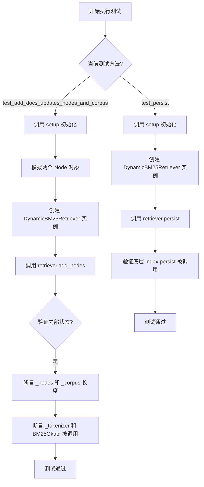
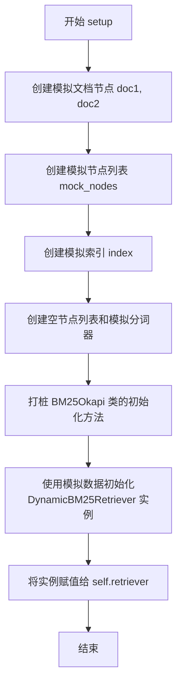
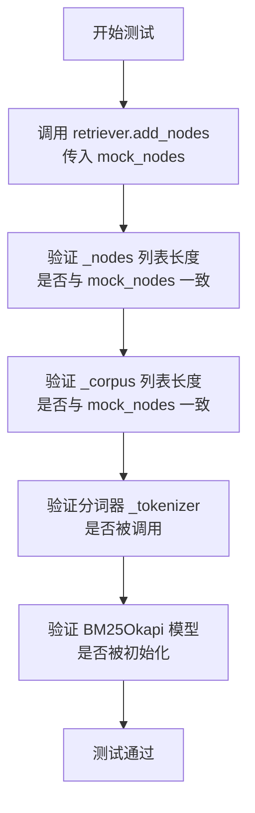
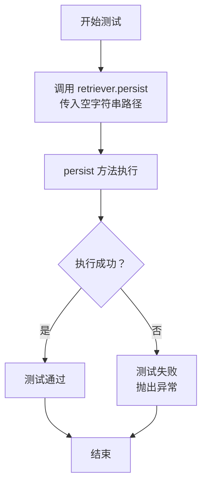

# `.\MetaGPT\tests\metagpt\rag\retrievers\test_bm25_retriever.py` 详细设计文档

该文件是一个使用 pytest 框架编写的单元测试文件，用于测试 DynamicBM25Retriever 类的功能，特别是其动态添加文档节点（add_nodes）和持久化存储（persist）方法。测试通过模拟（mock）依赖项来验证类在接收新节点后是否正确更新内部状态并调用底层索引的持久化方法。

## 整体流程



## 类结构

```
TestDynamicBM25Retriever (测试类)
├── setup (pytest fixture, 自动执行)
├── test_add_docs_updates_nodes_and_corpus (测试方法)
└── test_persist (测试方法)
```

## 全局变量及字段


### `TestDynamicBM25Retriever.doc1`
    
模拟的Node对象，用于测试，其get_content方法返回'Document content 1'。

类型：`MagicMock`
    


### `TestDynamicBM25Retriever.doc2`
    
模拟的Node对象，用于测试，其get_content方法返回'Document content 2'。

类型：`MagicMock`
    


### `TestDynamicBM25Retriever.mock_nodes`
    
包含doc1和doc2的列表，作为测试用的模拟文档节点集合。

类型：`List[MagicMock]`
    


### `TestDynamicBM25Retriever.mock_bm25okapi`
    
对rank_bm25.BM25Okapi.__init__方法的模拟对象，用于验证BM25Okapi是否被正确调用。

类型：`MagicMock`
    


### `TestDynamicBM25Retriever.retriever`
    
被测试的DynamicBM25Retriever实例，在setup方法中初始化，用于后续的单元测试。

类型：`DynamicBM25Retriever`
    
    

## 全局函数及方法

### `TestDynamicBM25Retriever.setup`

这是一个使用 `pytest` 的 `fixture` 装饰器定义的测试设置方法。它的主要功能是在每个测试方法执行前，为 `TestDynamicBM25Retriever` 测试类准备一个模拟的测试环境。它创建了模拟的文档节点（`Node`）、模拟的索引（`VectorStoreIndex`），并初始化了一个 `DynamicBM25Retriever` 实例，同时打桩了其内部依赖的 `BM25Okapi` 类，以确保测试的隔离性和可重复性。

参数：
- `self`：`TestDynamicBM25Retriever`，测试类实例自身。
- `mocker`：`pytest_mock.plugin.MockerFixture`，`pytest-mock` 插件提供的模拟对象创建器，用于创建和管理测试中的模拟对象（Mock）。

返回值：`None`，此方法不返回任何值，其主要作用是为测试类设置实例属性。

#### 流程图



#### 带注释源码

```python
    @pytest.fixture(autouse=True)  # 使用pytest的fixture装饰器，autouse=True表示此fixture会自动应用于类中的所有测试方法
    def setup(self, mocker):  # 定义setup方法，接收self和mocker两个参数
        # 创建第一个模拟文档节点，并指定其类型为Node
        self.doc1 = mocker.MagicMock(spec=Node)
        # 设置该模拟节点的get_content方法，使其在被调用时返回固定的字符串"Document content 1"
        self.doc1.get_content.return_value = "Document content 1"
        
        # 创建第二个模拟文档节点
        self.doc2 = mocker.MagicMock(spec=Node)
        # 设置其get_content方法的返回值
        self.doc2.get_content.return_value = "Document content 2"
        
        # 将两个模拟节点组合成一个列表，作为后续测试中使用的模拟节点集合
        self.mock_nodes = [self.doc1, self.doc2]

        # 创建一个模拟的VectorStoreIndex索引对象
        index = mocker.MagicMock(spec=VectorStoreIndex)
        # 设置该模拟索引的storage_context.persist方法的返回值为"ok"
        index.storage_context.persist.return_value = "ok"

        # 创建一个空的节点列表，用于初始化检索器
        mock_nodes = []
        # 创建一个模拟的分词器对象
        mock_tokenizer = mocker.MagicMock()
        # 使用mocker.patch打桩rank_bm25.BM25Okapi类的__init__方法，使其在初始化时直接返回None，不执行实际逻辑
        self.mock_bm25okapi = mocker.patch("rank_bm25.BM25Okapi.__init__", return_value=None)

        # 使用模拟的空节点列表、模拟分词器和模拟索引来初始化一个DynamicBM25Retriever实例
        # 这个实例将被赋值给测试类的self.retriever属性，供后续的测试方法使用
        self.retriever = DynamicBM25Retriever(nodes=mock_nodes, tokenizer=mock_tokenizer, index=index)
```

### `TestDynamicBM25Retriever.test_add_docs_updates_nodes_and_corpus`

这是一个单元测试方法，用于验证 `DynamicBM25Retriever` 类的 `add_nodes` 方法在添加新文档节点后，是否正确更新了其内部的 `_nodes` 列表和 `_corpus` 列表，并触发了分词器和 BM25 模型的初始化。

参数：
-  `self`：`TestDynamicBM25Retriever`，测试类实例的引用。

返回值：`None`，单元测试方法不返回具体值，而是通过断言（assert）来验证测试结果。

#### 流程图



#### 带注释源码

```python
def test_add_docs_updates_nodes_and_corpus(self):
    # Exec
    # 执行：调用被测试对象 DynamicBM25Retriever 的 add_nodes 方法，传入模拟的文档节点列表。
    self.retriever.add_nodes(self.mock_nodes)

    # Assert
    # 断言1：验证 retriever 内部的 _nodes 列表长度是否与传入的 mock_nodes 长度一致。
    assert len(self.retriever._nodes) == len(self.mock_nodes)
    # 断言2：验证 retriever 内部的 _corpus 列表长度是否与传入的 mock_nodes 长度一致。
    assert len(self.retriever._corpus) == len(self.mock_nodes)
    # 断言3：验证 retriever 的分词器 _tokenizer 是否被调用过（用于处理新文档）。
    self.retriever._tokenizer.assert_called()
    # 断言4：验证 BM25Okapi 模型的初始化函数 __init__ 是否被调用过（意味着模型根据新语料进行了更新或重建）。
    self.mock_bm25okapi.assert_called()
```

### `TestDynamicBM25Retriever.test_persist`

该方法是一个单元测试，用于验证 `DynamicBM25Retriever` 类的 `persist` 方法是否能够被正确调用。它本身不包含复杂的业务逻辑，主要作用是确保 `persist` 方法在给定路径参数时能够正常执行，是测试框架的一部分。

参数：
-  `self`：`TestDynamicBM25Retriever`，测试类实例自身引用

返回值：`None`，单元测试方法通常不显式返回值，其成功与否由断言或测试框架决定。

#### 流程图



#### 带注释源码

```python
def test_persist(self):
    # 调用被测试对象 DynamicBM25Retriever 实例的 persist 方法
    # 传入一个空字符串作为持久化路径参数
    # 此测试旨在验证 persist 方法的基本调用功能，不涉及具体的文件操作断言
    # 因为 setup 方法中已经将 index 模拟为 MagicMock
    # 所以实际调用的是模拟对象的 persist 方法
    self.retriever.persist("")
```

## 关键组件


### DynamicBM25Retriever

一个支持动态添加文档并更新检索模型的BM25检索器，它维护一个内部的文档节点列表和语料库，并在文档变更时重建BM25模型以保持检索的实时性和准确性。

### BM25Okapi

用于计算文档与查询之间相关性的核心排名算法组件，`DynamicBM25Retriever`在内部使用它来构建和更新检索模型。

### VectorStoreIndex

一个外部索引组件，`DynamicBM25Retriever`与之关联，可能用于文档的持久化存储或其他高级检索功能的集成。

### Node

表示文档或文本块的基础数据结构，`DynamicBM25Retriever`接收并处理`Node`对象列表以构建其内部语料库。


## 问题及建议


### 已知问题

-   **测试覆盖不完整**：当前测试用例仅覆盖了 `add_nodes` 和 `persist` 方法，缺少对核心检索方法 `retrieve` 的测试。这可能导致检索逻辑中的潜在缺陷无法被及时发现。
-   **Mock对象使用不当**：在 `setup` 方法中，`mock_tokenizer` 被创建为一个 `MagicMock` 对象，但在 `test_add_docs_updates_nodes_and_corpus` 测试中，断言 `self.retriever._tokenizer.assert_called()` 检查的是 `_tokenizer` 字段是否被调用，而该字段在 `DynamicBM25Retriever` 的 `add_nodes` 方法中可能并未直接调用。这可能导致测试断言错误或无法准确验证 `tokenizer` 的行为。
-   **测试数据与逻辑耦合**：测试中使用的 `mock_nodes` 及其 `get_content` 返回值是硬编码的。如果 `DynamicBM25Retriever` 处理节点内容的方式发生变化（例如，使用不同的方法获取文本），这些测试可能会失败，即使核心逻辑仍然正确。
-   **缺少异常和边界条件测试**：测试用例没有涵盖异常场景，例如向 `add_nodes` 传递空列表、`None` 或无效节点，也没有测试 `persist` 方法在路径无效或权限不足时的行为。

### 优化建议

-   **补充核心功能测试**：增加对 `retrieve` 方法的单元测试，验证其在不同查询和文档集下的返回结果、排序正确性以及 `top_k` 参数的功能。
-   **修正Mock和断言逻辑**：审查 `DynamicBM25Retriever.add_nodes` 方法的实现，明确 `_tokenizer` 字段的使用方式。在测试中，应模拟 `tokenizer` 被调用时的具体行为（例如，`tokenizer.return_value = ['token1', 'token2']`），并断言其以预期的参数被调用，而不是简单地断言被调用过。
-   **使用更灵活的测试数据**：考虑使用 `pytest` 的参数化功能（`@pytest.mark.parametrize`）来测试多种节点内容和结构，使测试更健壮，减少与具体实现的耦合。
-   **增加负面测试和边界测试**：
    -   为 `add_nodes` 添加测试，验证传入空列表、`None` 或包含非 `Node` 对象的列表时的行为（例如，是否抛出异常或优雅处理）。
    -   为 `persist` 方法添加测试，模拟 `index.storage_context.persist` 调用失败（抛出异常）时，`persist` 方法是否正确地传播或处理该异常。
-   **提升测试可读性和维护性**：将 `setup` 方法中创建模拟节点的代码提取为独立的辅助函数或使用 `pytest.fixture` 进行更清晰的组织。为测试用例和断言添加更详细的注释，说明测试的意图。
-   **考虑集成测试**：在单元测试之外，可以考虑编写小规模的集成测试，将 `DynamicBM25Retriever` 与真实的 `VectorStoreIndex` 和分词器结合，验证其在实际环境中的端到端行为。


## 其它


### 设计目标与约束

本代码模块的核心设计目标是提供一个可动态更新文档集合的BM25检索器（DynamicBM25Retriever）的单元测试。它旨在验证检索器在添加新文档后，其内部状态（如节点列表、语料库和BM25模型）能够正确更新，并且持久化功能可以正常调用。设计约束包括：1) 依赖于pytest框架进行测试组织；2) 使用mocker对复杂依赖（如`VectorStoreIndex`, `Node`, `BM25Okapi`）进行模拟，以确保测试的隔离性和可重复性；3) 测试应聚焦于检索器的行为（状态更新、方法调用），而非其依赖组件的内部逻辑。

### 错误处理与异常设计

当前测试代码未显式包含错误处理或异常测试用例。测试方法`test_add_docs_updates_nodes_and_corpus`和`test_persist`主要验证正常路径下的功能。潜在的异常场景未覆盖，例如：1) 向`add_nodes`方法传入`None`或空列表；2) 节点对象不符合预期规范（缺少`get_content`方法）；3) 持久化路径无效或不可写。完整的测试套件应考虑添加这些负面测试用例，使用`pytest.raises`来断言预期的异常被抛出。

### 数据流与状态机

测试的数据流始于`setup`夹具，它初始化了模拟的文档节点(`self.doc1`, `self.doc2`)、模拟的索引以及被测对象`DynamicBM25Retriever`的一个实例。在`test_add_docs_updates_nodes_and_corpus`测试中，数据流为：模拟节点列表(`self.mock_nodes`) -> `retriever.add_nodes()`方法 -> 验证`retriever._nodes`和`retriever._corpus`的状态更新以及`_tokenizer`和BM25模型初始化器的调用。这反映了`DynamicBM25Retriever`在接收新文档后，其内部状态从“初始空状态”转换到“已加载文档状态”。`test_persist`测试则验证了状态持久化的接口调用。

### 外部依赖与接口契约

测试代码明确模拟了以下关键外部依赖，并定义了与它们的交互契约：
1.  **`llama_index.core.schema.Node`**: 模拟对象需提供`get_content()`方法，并返回字符串内容。测试假设此接口稳定。
2.  **`llama_index.core.VectorStoreIndex`**: 仅模拟了其`storage_context.persist`方法，测试验证了检索器的`persist`方法会调用此依赖。
3.  **`rank_bm25.BM25Okapi`**: 模拟了其`__init__`方法。测试断言在添加文档后，会使用正确的参数（分词后的语料库）初始化一个新的BM25Okapi实例，这定义了检索器与BM25库的核心集成契约。
4.  **`pytest`与`pytest-mock`**: 作为测试框架和模拟工具，是测试执行的基础依赖。

### 测试策略与覆盖范围

当前测试采用了基于模拟的单元测试策略，专注于`DynamicBM25Retriever`类的两个公共方法：`add_nodes`和`persist`。覆盖范围包括：
*   **状态验证**：验证添加文档后内部`_nodes`和`_corpus`列表的正确性。
*   **协作验证**：验证是否正确调用了分词器(`_tokenizer`)和BM25模型初始化器。
*   **委托调用验证**：验证`persist`方法是否委托给了底层索引的持久化方法。
未覆盖的范围包括：`retrieve`核心检索功能的测试、多线程环境下的并发更新、大量文档添加的性能测试以及前面提到的各种异常情况测试。

    