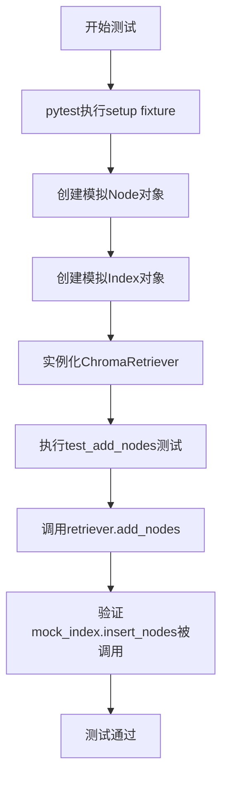
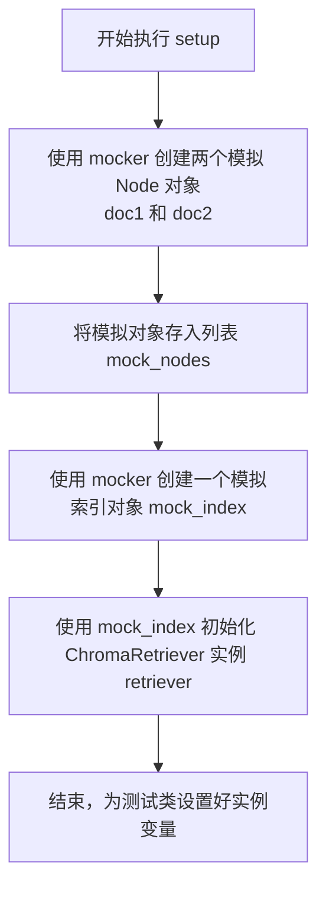
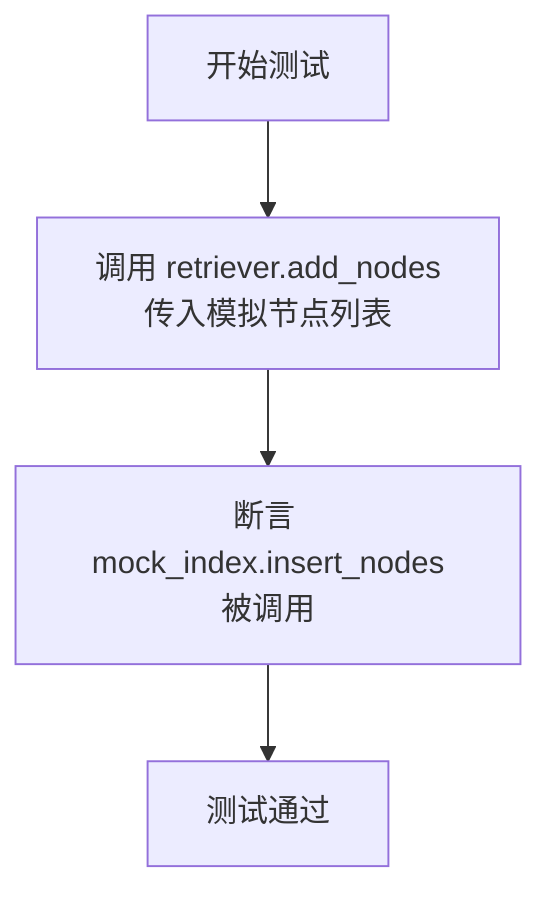

# `.\MetaGPT\tests\metagpt\rag\retrievers\test_chroma_retriever.py` 详细设计文档

该代码是一个使用pytest框架编写的单元测试文件，用于测试ChromaRetriever类的add_nodes方法。它通过模拟依赖对象来验证ChromaRetriever是否正确地将节点数据插入到其内部的索引中。

## 整体流程



## 类结构

```
TestChromaRetriever (测试类)
├── setup (pytest fixture)
└── test_add_nodes (测试方法)
```

## 全局变量及字段


### `TestChromaRetriever.doc1`
    
模拟的Node对象，用于测试ChromaRetriever的节点添加功能

类型：`MagicMock`
    


### `TestChromaRetriever.doc2`
    
模拟的Node对象，用于测试ChromaRetriever的节点添加功能

类型：`MagicMock`
    


### `TestChromaRetriever.mock_nodes`
    
包含doc1和doc2的列表，作为测试用的模拟节点集合

类型：`List[MagicMock]`
    


### `TestChromaRetriever.mock_index`
    
模拟的索引对象，用于测试ChromaRetriever的依赖注入

类型：`MagicMock`
    


### `TestChromaRetriever.retriever`
    
被测试的ChromaRetriever实例，使用模拟索引进行初始化

类型：`ChromaRetriever`
    
    

## 全局函数及方法

### `TestChromaRetriever.setup`

该方法是一个Pytest fixture，用于在`TestChromaRetriever`类的每个测试方法执行前自动运行，以设置测试环境。它主要创建模拟的文档节点（`Node`）和一个模拟的Chroma索引，并用这些模拟对象初始化一个`ChromaRetriever`实例，为后续的单元测试（如`test_add_nodes`）提供预配置的、隔离的测试上下文。

参数：
- `self`：`TestChromaRetriever`，指向当前测试类实例的引用。
- `mocker`：`pytest_mock.plugin.MockerFixture`，Pytest-mock插件提供的模拟对象创建器，用于生成测试替身（如Mock和MagicMock）。

返回值：`None`，此方法不返回任何值，其作用是为测试类设置实例变量。

#### 流程图



#### 带注释源码

```python
    @pytest.fixture(autouse=True)  # 装饰器，声明此方法为一个Pytest fixture，且`autouse=True`表示它会自动应用于类中的所有测试方法，无需显式调用。
    def setup(self, mocker):  # 方法定义，接收测试实例`self`和模拟工具`mocker`作为参数。
        self.doc1 = mocker.MagicMock(spec=Node)  # 使用mocker创建一个模拟对象doc1，其行为模仿`Node`类。
        self.doc2 = mocker.MagicMock(spec=Node)  # 使用mocker创建另一个模拟对象doc2，同样模仿`Node`类。
        self.mock_nodes = [self.doc1, self.doc2]  # 将两个模拟Node对象组成一个列表，赋值给实例变量`mock_nodes`，模拟一组待检索的文档。

        self.mock_index = mocker.MagicMock()  # 使用mocker创建一个通用的模拟索引对象`mock_index`。
        self.retriever = ChromaRetriever(self.mock_index)  # 使用上一步创建的模拟索引`mock_index`，实例化一个真正的`ChromaRetriever`对象，并赋值给实例变量`retriever`。这是被测系统（SUT）的核心对象。
```

### `TestChromaRetriever.test_add_nodes`

该方法是一个单元测试，用于验证 `ChromaRetriever.add_nodes` 方法的功能。它模拟了向检索器中添加节点列表的过程，并断言底层的索引对象正确地接收并处理了这些节点。

参数：
- `self`：`TestChromaRetriever`，测试类实例的引用。

返回值：`None`，单元测试方法不返回业务值，其目的是通过断言验证代码行为。

#### 流程图



#### 带注释源码

```python
def test_add_nodes(self):
    # 调用被测试对象 ChromaRetriever 的 add_nodes 方法，传入模拟的节点列表
    self.retriever.add_nodes(self.mock_nodes)

    # 断言：验证 ChromaRetriever 内部的索引对象（mock_index）的 insert_nodes 方法被调用。
    # 这确保了添加节点的请求被正确传递给了底层的存储引擎。
    self.mock_index.insert_nodes.assert_called()
```

## 关键组件


### ChromaRetriever

一个用于从Chroma向量数据库中检索相关文档的检索器类，封装了与Chroma索引的交互逻辑，包括添加节点和查询检索。

### Node

表示一个文档或文本块的基本单元，通常包含文本内容、元数据以及可选的向量嵌入，是检索和索引操作的核心数据对象。

### Chroma索引

一个轻量级、嵌入式的向量数据库，用于存储和高效检索由文本生成的向量表示，是ChromaRetriever进行相似性搜索的后端存储。


## 问题及建议


### 已知问题

-   **测试覆盖不完整**：当前测试用例仅覆盖了 `add_nodes` 方法，未对 `retrieve` 等核心检索功能进行测试，无法保证检索逻辑的正确性。
-   **模拟对象过于宽泛**：使用 `mocker.MagicMock(spec=Node)` 创建模拟节点，虽然指定了类型，但未模拟具体的属性（如 `text`, `embedding` 等），可能导致测试与真实对象行为存在差异。
-   **缺乏异常场景测试**：测试用例未涵盖 `add_nodes` 方法在传入空列表、`None` 或无效节点等异常输入时的行为，也未测试底层 `insert_nodes` 调用失败时的错误处理。
-   **测试与实现紧耦合**：测试直接断言调用了 `mock_index.insert_nodes`，这仅验证了方法调用，但未验证调用参数（如传入的节点列表）的正确性，且测试逻辑与实现细节（方法名）绑定过紧。

### 优化建议

-   **补充核心功能测试**：增加对 `ChromaRetriever.retrieve` 方法的测试用例，验证其能正确调用底层索引的检索方法并返回预期格式的结果。
-   **细化模拟对象**：为模拟的 `Node` 对象设置具体的属性值（例如 `text="test content"`），使测试更贴近真实使用场景，提高测试的可靠性。
-   **增加边界与异常测试**：
    -   为 `add_nodes` 方法添加测试，验证传入空列表时是否正常处理（例如，不调用或调用空插入）。
    -   添加测试验证传入 `None` 或非 `Node` 列表时是否抛出预期的异常。
    -   模拟 `insert_nodes` 抛出异常，测试 `add_nodes` 方法的错误传播或处理逻辑。
-   **增强断言验证**：在 `test_add_nodes` 中，不仅断言方法被调用，还应使用 `assert_called_with` 来验证调用时传入的参数是否与 `self.mock_nodes` 完全一致，确保数据传递的正确性。
-   **考虑测试结构优化**：可以将 `setup` 中创建公共模拟数据的部分提取出来，或者为不同的测试方法组准备更针对性的测试数据，提高测试的可维护性和清晰度。


## 其它


### 设计目标与约束

本代码是 `ChromaRetriever` 类的一个单元测试模块。其设计目标是验证 `ChromaRetriever.add_nodes` 方法能够正确地将 `Node` 对象列表传递给底层的 `Chroma` 索引进行插入操作。主要约束包括：1) 作为单元测试，必须与外部 `Chroma` 服务解耦，通过模拟（Mock）对象进行隔离测试；2) 测试应聚焦于 `ChromaRetriever` 类的公共接口行为，而非其内部实现或底层 `Chroma` 库的细节；3) 测试环境应可重复、独立，不依赖外部数据源或网络状态。

### 错误处理与异常设计

当前测试代码未显式测试错误处理路径。`ChromaRetriever.add_nodes` 方法可能抛出的异常（例如，传入参数类型错误、底层索引操作失败等）未被覆盖。测试套件应补充针对异常场景的测试用例，例如：1) 测试传入非 `Node` 对象列表时是否抛出 `TypeError`；2) 模拟底层 `index.insert_nodes` 方法抛出异常（如 `RuntimeError`），验证该异常是否被正确传播给调用者。这有助于确保代码的健壮性和错误边界的清晰定义。

### 数据流与状态机

本测试的数据流相对简单直接：1) **准备阶段** (`setup`): 创建模拟的 `Node` 对象 (`doc1`, `doc2`) 和 `Chroma` 索引对象 (`mock_index`)，并实例化待测的 `ChromaRetriever` 对象 (`retriever`)。2) **执行阶段** (`test_add_nodes`): 调用 `retriever.add_nodes(mock_nodes)`。3) **验证阶段**: 断言 `mock_index.insert_nodes` 方法被调用，且调用参数为 `mock_nodes`。整个测试过程不涉及复杂的状态变迁，核心是验证方法调用和参数传递的正确性。

### 外部依赖与接口契约

1.  **外部依赖**:
    *   **`pytest`**: 测试框架，用于组织测试用例、提供固件（fixture）和断言机制。
    *   **`llama_index.core.schema.Node`**: 作为数据模型，`ChromaRetriever.add_nodes` 方法接受此类型的对象列表。测试中通过 `mocker.MagicMock` 模拟其接口。
    *   **`metagpt.rag.retrievers.chroma_retriever.ChromaRetriever`**: 被测系统（SUT）。测试依赖于其构造函数接受一个索引对象，以及 `add_nodes` 方法的签名和行为。
    *   **`Chroma` 索引对象**: 作为 `ChromaRetriever` 的协作对象，其 `insert_nodes` 方法是测试验证的焦点。在测试中被完全模拟。

2.  **接口契约**:
    *   **`ChromaRetriever.__init__(index)`**: 契约要求传入一个具有 `insert_nodes` 方法的索引对象。
    *   **`ChromaRetriever.add_nodes(nodes)`**: 契约要求 `nodes` 是一个 `Node` 对象（或兼容对象）的列表。该方法应调用底层索引的 `insert_nodes` 方法，并传入相同的 `nodes` 列表。本测试的核心就是验证这一契约得到履行。

    