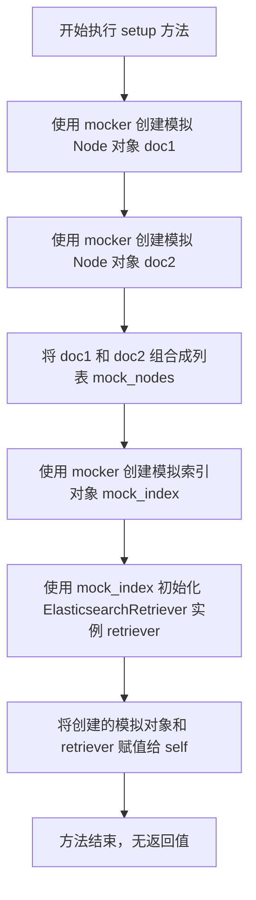
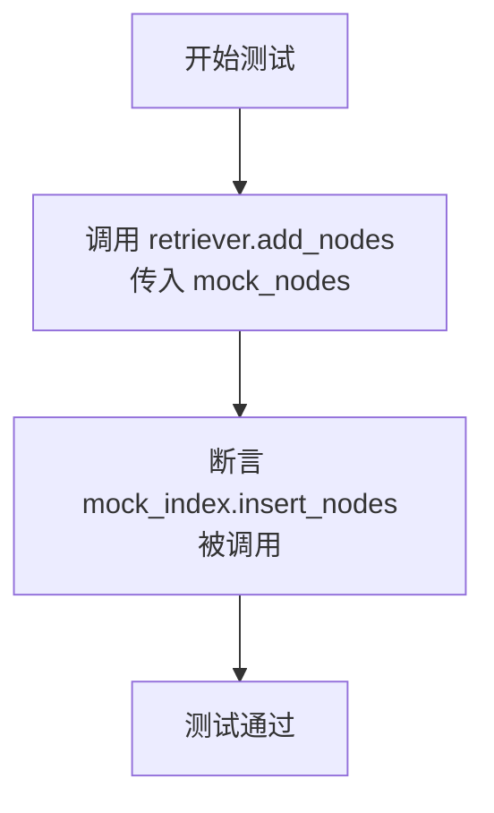

# `.\MetaGPT\tests\metagpt\rag\retrievers\test_es_retriever.py` 详细设计文档

该文件是一个使用 pytest 框架编写的单元测试文件，用于测试 ElasticsearchRetriever 类的 add_nodes 方法。它通过模拟（mock）依赖项来验证当向检索器添加节点时，是否会正确调用底层索引的插入方法。

## 整体流程

```mermaid
graph TD
    A[开始执行测试] --> B[调用 setup fixture]
    B --> C[创建模拟的 Node 对象 doc1, doc2]
    C --> D[创建模拟的索引对象 mock_index]
    D --> E[实例化 ElasticsearchRetriever]
    E --> F[执行 test_add_nodes 测试]
    F --> G[调用 retriever.add_nodes(mock_nodes)]
    G --> H[断言 mock_index.insert_nodes 被调用]
    H --> I[测试结束]
```

## 类结构

```
TestElasticsearchRetriever (测试类)
├── setup (pytest fixture， 自动执行)
└── test_add_nodes (测试方法)
```

## 全局变量及字段


### `TestElasticsearchRetriever.doc1`
    
模拟的Node对象，用于测试ElasticsearchRetriever的add_nodes方法

类型：`MagicMock`
    


### `TestElasticsearchRetriever.doc2`
    
模拟的Node对象，用于测试ElasticsearchRetriever的add_nodes方法

类型：`MagicMock`
    


### `TestElasticsearchRetriever.mock_nodes`
    
包含doc1和doc2的列表，作为测试数据用于验证add_nodes方法

类型：`List[MagicMock]`
    


### `TestElasticsearchRetriever.mock_index`
    
模拟的索引对象，作为ElasticsearchRetriever构造函数的参数

类型：`MagicMock`
    


### `TestElasticsearchRetriever.retriever`
    
被测试的ElasticsearchRetriever实例，使用mock_index初始化

类型：`ElasticsearchRetriever`
    
    

## 全局函数及方法

### `TestElasticsearchRetriever.setup`

`TestElasticsearchRetriever.setup` 是一个使用 `pytest.fixture` 装饰的测试设置方法。它的核心功能是在每个测试方法执行前，为 `TestElasticsearchRetriever` 类准备测试环境。具体来说，它创建了两个模拟的 `Node` 对象和一个模拟的 `Elasticsearch` 索引，并用这些模拟对象初始化了一个 `ElasticsearchRetriever` 实例，以便后续的测试方法（如 `test_add_nodes`）可以使用这个预配置的环境进行测试，而无需重复编写初始化代码。

参数：

- `self`：`TestElasticsearchRetriever`，指向当前测试类实例的引用。
- `mocker`：`pytest_mock.MockerFixture`，`pytest-mock` 插件提供的模拟对象创建工具，用于生成测试所需的模拟（Mock）对象。

返回值：`None`，此方法不返回任何值，其主要作用是通过副作用（side effect）设置测试类的实例变量。

#### 流程图



#### 带注释源码

```python
    @pytest.fixture(autouse=True)  # 使用 pytest 的 fixture 装饰器，autouse=True 表示此 fixture 会自动应用于类中的所有测试方法
    def setup(self, mocker):  # 定义 setup 方法，接收 self（测试实例）和 mocker（模拟工具）作为参数
        self.doc1 = mocker.MagicMock(spec=Node)  # 使用 mocker 创建一个模拟对象，其行为模仿 Node 类，并赋值给 self.doc1
        self.doc2 = mocker.MagicMock(spec=Node)  # 创建另一个模拟 Node 对象，赋值给 self.doc2
        self.mock_nodes = [self.doc1, self.doc2]  # 将两个模拟 Node 对象放入一个列表中，赋值给 self.mock_nodes

        self.mock_index = mocker.MagicMock()  # 使用 mocker 创建一个通用的模拟对象，模拟 Elasticsearch 索引，赋值给 self.mock_index
        self.retriever = ElasticsearchRetriever(self.mock_index)  # 使用上一步创建的模拟索引对象，实例化一个 ElasticsearchRetriever，并赋值给 self.retriever
        # 方法执行完毕，没有 return 语句，因此返回 None
```

### `TestElasticsearchRetriever.test_add_nodes`

该方法是一个单元测试，用于验证 `ElasticsearchRetriever` 类的 `add_nodes` 方法是否能够正确调用其内部索引对象的 `insert_nodes` 方法。

参数：
- `self`：`TestElasticsearchRetriever`，测试类实例自身。

返回值：`None`，单元测试方法不返回具体值，其成功与否由断言决定。

#### 流程图



#### 带注释源码

```python
def test_add_nodes(self):
    # 调用被测试对象 ElasticsearchRetriever 的 add_nodes 方法，传入模拟的节点列表
    self.retriever.add_nodes(self.mock_nodes)

    # 断言：验证 retriever 内部的 mock_index 对象的 insert_nodes 方法被调用了一次
    # 这是测试的核心，确保 add_nodes 的功能委托给了底层的索引对象
    self.mock_index.insert_nodes.assert_called()
```

## 关键组件


### ElasticsearchRetriever

一个用于从Elasticsearch索引中检索文档的检索器类，封装了与Elasticsearch索引交互的核心逻辑，包括文档的添加和检索功能。

### Node

表示一个文档或知识片段的基本单元，是检索和存储过程中的核心数据结构，通常包含文本内容、元数据和嵌入向量等信息。

### pytest 测试框架

一个用于编写和运行单元测试的Python框架，在本代码中用于构建ElasticsearchRetriever类的自动化测试用例，确保其功能的正确性。

### mocker (pytest-mock)

一个用于在测试中创建和管理模拟对象（Mock）的pytest插件，在本测试中用于模拟Elasticsearch索引和Node对象，以实现对ElasticsearchRetriever.add_nodes方法的隔离测试。


## 问题及建议


### 已知问题

-   **测试覆盖不完整**：当前测试类 `TestElasticsearchRetriever` 仅包含一个测试方法 `test_add_nodes`，用于验证 `add_nodes` 方法调用了底层的 `insert_nodes`。这未能覆盖 `ElasticsearchRetriever` 类的其他核心功能，例如 `retrieve`（检索）方法，以及可能存在的构造函数参数验证、错误处理逻辑等。测试的完整性不足，无法保证类在修改后的行为正确性。
-   **测试数据过于简单**：测试中使用的 `mock_nodes` 是由 `mocker.MagicMock` 创建的通用模拟对象。虽然这足以验证方法调用，但未能测试 `ElasticsearchRetriever` 与真实 `Node` 对象交互时的行为，例如处理 `Node` 的特定属性（如 `text`, `embedding`, `metadata` 等）。这可能导致一些边界条件或数据转换相关的缺陷未被发现。
-   **缺乏异常场景测试**：测试没有涵盖任何错误或异常情况，例如当 `add_nodes` 方法接收到 `None`、空列表或无效的 `Node` 对象时，`ElasticsearchRetriever` 或底层的 `mock_index` 应如何响应（例如抛出异常、记录日志、静默处理）。缺少这些测试使得代码的健壮性无法得到验证。
-   **测试与实现细节过度耦合**：`test_add_nodes` 直接断言 `mock_index.insert_nodes.assert_called()`，这仅验证了方法被调用，但没有验证调用时传递的参数是否正确（例如，传递的节点列表是否与输入一致）。虽然当前测试通过，但如果未来 `add_nodes` 的内部实现改变（例如对节点进行预处理后再传递），此测试可能无法准确反映功能正确性。

### 优化建议

-   **补充核心功能测试**：为 `ElasticsearchRetriever` 类的所有公共方法（尤其是 `retrieve`）添加单元测试。确保测试覆盖正常流程和主要业务逻辑。
-   **增强测试数据真实性**：在测试中，使用更接近真实数据的 `Node` 模拟或实例（例如，使用 `pytest.fixture` 创建带有典型属性的 `Node` 对象），以验证 `ElasticsearchRetriever` 是否正确处理了这些属性。
-   **增加异常与边界测试**：为每个测试方法添加针对异常输入和边界条件的测试用例。例如，测试 `add_nodes` 方法在接收空列表、`None` 或包含无效元素的列表时的行为。这有助于提高代码的鲁棒性并明确其契约。
-   **改进断言以验证行为而非实现**：在 `test_add_nodes` 中，除了验证 `insert_nodes` 被调用，还应验证其调用参数与传入的 `mock_nodes` 一致（例如，使用 `assert_called_with(self.mock_nodes)`）。这使测试更关注于类的对外行为，而非内部实现细节，提升测试的稳定性和价值。
-   **考虑集成测试**：在单元测试之外，考虑为 `ElasticsearchRetriever` 编写集成测试，使其与一个真实的或测试专用的 Elasticsearch 实例交互，以验证端到端的检索功能。这可以弥补单元测试在复杂交互和网络层方面的不足。
-   **重构测试结构以提高可维护性**：如果未来测试用例增多，可以考虑将通用的设置（如创建特定类型的模拟 `Node`）提取到更细粒度的 `pytest.fixture` 中，使测试代码更清晰、更易于维护。


## 其它


### 设计目标与约束

该代码是一个针对 `ElasticsearchRetriever` 类的单元测试。其设计目标是验证 `ElasticsearchRetriever.add_nodes` 方法能够正确调用其内部索引对象（`self.mock_index`）的 `insert_nodes` 方法。主要约束包括：1) 测试应完全隔离，不依赖真实的 Elasticsearch 服务或外部数据；2) 使用 `pytest` 框架和 `mocker` 工具进行模拟和断言；3) 测试范围仅限于 `add_nodes` 方法的功能正确性，不涉及数据验证或错误场景。

### 错误处理与异常设计

当前测试代码未显式测试错误处理或异常场景。`ElasticsearchRetriever.add_nodes` 方法可能抛出的异常（例如，索引服务不可用、节点数据格式错误等）未被覆盖。测试仅验证了在正常输入下，方法能按预期调用底层接口。这是一个测试覆盖率的缺口。

### 数据流与状态机

数据流非常简单：
1.  **输入**：测试通过 `setup` fixture 准备了一组模拟的 `Node` 对象 (`self.mock_nodes`) 和一个模拟的索引对象 (`self.mock_index`)。
2.  **处理**：在 `test_add_nodes` 方法中，调用 `self.retriever.add_nodes(self.mock_nodes)`。
3.  **输出/验证**：验证 `self.mock_index.insert_nodes` 方法被调用了一次，且调用时传入的参数正是 `self.mock_nodes`。没有复杂的状态转换。

### 外部依赖与接口契约

1.  **外部依赖**：
    *   `pytest`：测试运行框架。
    *   `mocker` (来自 `pytest-mock`)：用于创建模拟对象（Mock）。
    *   `llama_index.core.schema.Node`：被模拟的节点类，作为 `add_nodes` 方法的输入数据类型。
    *   `metagpt.rag.retrievers.es_retriever.ElasticsearchRetriever`：被测试的类。

2.  **接口契约**：
    *   **测试类 (`TestElasticsearchRetriever`) 与 `ElasticsearchRetriever`**：测试类依赖于 `ElasticsearchRetriever` 的构造函数接受一个索引对象，并且其 `add_nodes` 方法会调用该索引对象的 `insert_nodes` 方法。
    *   **`ElasticsearchRetriever` 与 `self.mock_index`**：这是被测试的核心契约。`ElasticsearchRetriever.add_nodes` 必须调用其 `index` 属性（在构造函数中传入）的 `insert_nodes` 方法，并将节点列表传递给它。测试通过模拟 `self.mock_index` 并断言 `insert_nodes` 被调用来验证此契约。

    