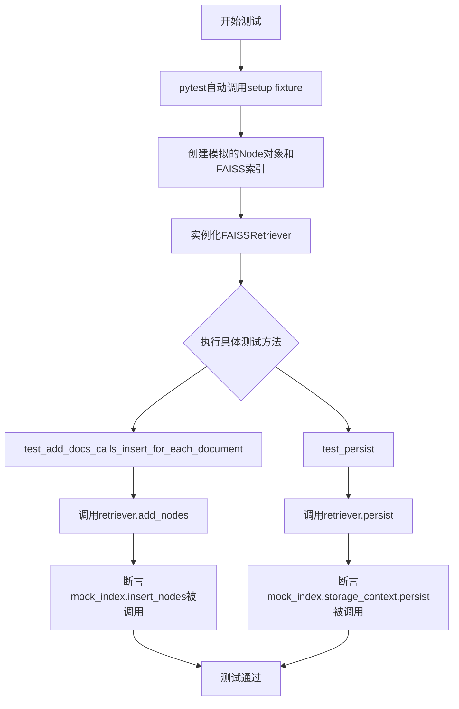
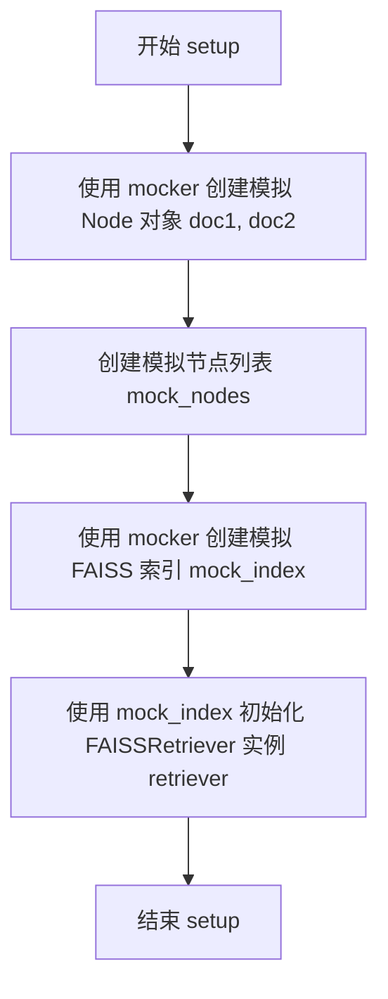
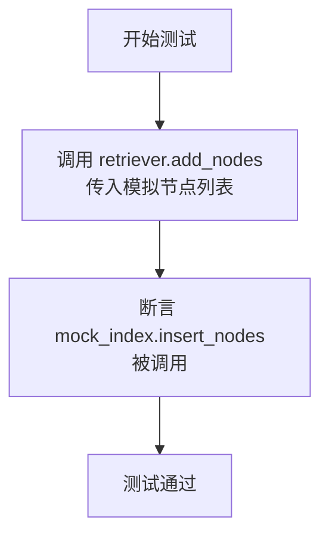
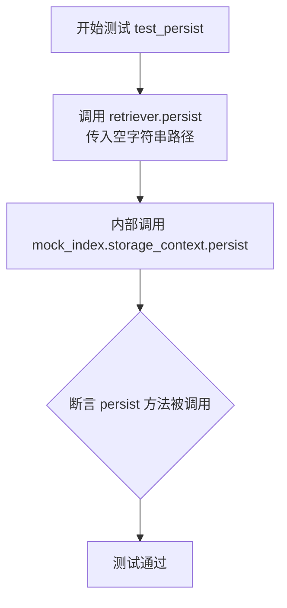

# `.\MetaGPT\tests\metagpt\rag\retrievers\test_faiss_retriever.py` 详细设计文档

该文件是一个使用pytest框架编写的单元测试文件，用于测试FAISSRetriever类的核心功能，包括向索引添加文档节点和持久化存储索引。

## 整体流程



## 类结构

```
TestFAISSRetriever (测试类)
├── setup (pytest fixture, 自动执行)
├── test_add_docs_calls_insert_for_each_document (测试方法)
└── test_persist (测试方法)
```

## 全局变量及字段


### `TestFAISSRetriever.doc1`
    
模拟的Node对象，用于测试FAISSRetriever的文档处理功能

类型：`MagicMock`
    


### `TestFAISSRetriever.doc2`
    
模拟的Node对象，用于测试FAISSRetriever的文档处理功能

类型：`MagicMock`
    


### `TestFAISSRetriever.mock_nodes`
    
包含doc1和doc2的模拟节点列表，用于批量操作测试

类型：`List[MagicMock]`
    


### `TestFAISSRetriever.mock_index`
    
模拟的FAISS索引对象，用于测试FAISSRetriever与索引的交互

类型：`MagicMock`
    


### `TestFAISSRetriever.retriever`
    
被测试的FAISSRetriever实例，使用模拟索引进行初始化

类型：`FAISSRetriever`
    
    

## 全局函数及方法

### `TestFAISSRetriever.setup`

该方法是一个pytest fixture，用于在`TestFAISSRetriever`类的每个测试方法执行前自动设置测试环境。它主要模拟了测试所需的依赖对象（如`Node`文档和FAISS索引），并初始化了待测试的`FAISSRetriever`实例，确保测试的独立性和可重复性。

参数：

- `self`：`TestFAISSRetriever`，当前测试类的实例
- `mocker`：`pytest_mock.MockerFixture`，pytest-mock插件提供的模拟对象创建工具，用于生成测试替身（mock）

返回值：`None`，无返回值

#### 流程图



#### 带注释源码

```python
    @pytest.fixture(autouse=True)  # 装饰器，声明此方法为自动使用的pytest fixture
    def setup(self, mocker):  # 定义setup方法，接收self和mocker参数
        self.doc1 = mocker.MagicMock(spec=Node)  # 使用mocker创建一个模拟的Node对象，赋值给实例变量doc1
        self.doc2 = mocker.MagicMock(spec=Node)  # 使用mocker创建另一个模拟的Node对象，赋值给实例变量doc2
        self.mock_nodes = [self.doc1, self.doc2]  # 将两个模拟Node对象组成列表，赋值给实例变量mock_nodes

        self.mock_index = mocker.MagicMock()  # 使用mocker创建一个模拟的FAISS索引对象，赋值给实例变量mock_index
        self.retriever = FAISSRetriever(self.mock_index)  # 使用模拟的索引对象初始化一个FAISSRetriever实例，赋值给实例变量retriever
```

### `TestFAISSRetriever.test_add_docs_calls_insert_for_each_document`

该方法是一个单元测试，用于验证 `FAISSRetriever.add_nodes` 方法在添加文档节点时，会正确地调用底层 FAISS 索引的 `insert_nodes` 方法。

参数：
- `self`：`TestFAISSRetriever`，当前测试类的实例，用于访问测试夹具中设置的模拟对象。

返回值：`None`，单元测试方法通常不返回值，其目的是通过断言来验证代码行为。

#### 流程图



#### 带注释源码

```python
def test_add_docs_calls_insert_for_each_document(self):
    # 调用被测试方法：FAISSRetriever 实例的 add_nodes 方法，传入模拟的文档节点列表。
    self.retriever.add_nodes(self.mock_nodes)

    # 核心断言：验证底层模拟的 FAISS 索引对象的 `insert_nodes` 方法被调用。
    # 这确保了 `add_nodes` 方法确实将添加操作委托给了索引。
    self.mock_index.insert_nodes.assert_called()
```

### `TestFAISSRetriever.test_persist`

该方法是一个单元测试，用于验证 `FAISSRetriever` 类的 `persist` 方法是否能够正确调用其内部索引的持久化功能。它通过模拟（mock）依赖项来隔离测试，确保 `persist` 方法会触发底层存储上下文的持久化操作。

参数：
-  `self`：`TestFAISSRetriever`，测试类实例自身。

返回值：`None`，单元测试方法不返回具体值，其目的是通过断言验证行为。

#### 流程图



#### 带注释源码

```python
def test_persist(self):
    # 调用被测试的 FAISSRetriever 实例的 persist 方法，传入一个空字符串作为持久化路径参数。
    self.retriever.persist("")

    # 断言：验证模拟对象 mock_index 的 storage_context 属性的 persist 方法被调用。
    # 这确保了 retriever.persist 方法确实将持久化请求委托给了底层的索引存储上下文。
    self.mock_index.storage_context.persist.assert_called()
```

## 关键组件


### FAISSRetriever

一个基于FAISS向量索引的检索器，负责将文档节点添加到索引中并支持索引的持久化存储。

### Node

表示一个文档节点，是检索系统处理的基本数据单元，通常包含文本内容及其向量表示。

### FAISS Index

一个高效的向量相似性搜索库的索引对象，用于存储文档向量并执行快速的最近邻搜索。

### Storage Context

存储上下文，管理FAISS索引及其相关元数据的持久化操作，例如将索引保存到磁盘。


## 问题及建议


### 已知问题

-   **测试覆盖不完整**：当前测试用例仅覆盖了 `add_nodes` 和 `persist` 两个方法，对于 `FAISSRetriever` 类的核心检索功能（如 `retrieve` 方法）以及可能的其他方法（如 `delete`、`clear`）缺乏测试。这可能导致未覆盖的代码路径存在潜在缺陷。
-   **测试数据过于简单**：测试中使用的 `mock_nodes` 是简单的 `MagicMock` 对象，没有模拟真实 `Node` 对象可能包含的复杂属性（如 `embedding` 向量、`text` 内容、`metadata` 等）。这可能导致测试无法发现与数据内容相关的边界条件或错误。
-   **测试断言过于宽泛**：`test_add_docs_calls_insert_for_each_document` 方法中使用 `assert_called()` 进行断言，这仅验证了方法被调用过，但无法验证其被调用的次数（应为两次）以及传入的参数是否正确（应为 `self.mock_nodes`）。这是一个不精确的断言。
-   **缺乏异常场景测试**：测试用例没有涵盖可能出现的异常情况，例如向 `add_nodes` 传入空列表、`None` 或无效数据时系统的行为，以及 `persist` 方法在存储失败时的错误处理。
-   **测试与实现细节过度耦合**：测试直接断言调用了 `mock_index.insert_nodes` 和 `mock_index.storage_context.persist`。如果 `FAISSRetriever` 的内部实现发生变化（例如，方法名或调用链改变），即使其对外功能不变，这些测试也会失败，降低了测试的健壮性。

### 优化建议

-   **补充核心功能测试**：为 `FAISSRetriever.retrieve` 方法添加测试用例，模拟查询向量，并验证其返回的节点列表是否符合预期。同时，考虑为其他可能存在的公共方法添加测试。
-   **增强测试数据真实性**：在 `setup` fixture 中，使用更真实的测试数据。可以创建具有特定 `embedding`、`text` 和 `metadata` 的 `Node` 模拟对象或使用 `pytest` 的工厂模式，使测试更贴近实际使用场景。
-   **使用更精确的断言**：将 `assert_called()` 替换为 `assert_called_once_with(self.mock_nodes)` 或使用 `call_args_list` 来精确验证方法调用的次数和参数。这能更有效地捕获逻辑错误。
-   **添加负面测试用例**：编写测试来验证代码在异常输入或环境下的行为。例如，测试 `add_nodes([])` 是否安全处理，或者当 `persist` 路径不可写时是否抛出适当的异常。
-   **采用面向行为而非实现的测试**：重构测试，使其更关注 `FAISSRetriever` 类的行为契约，而非其内部实现。例如，对于 `add_nodes`，可以断言在调用后，通过 `retrieve` 相关查询能检索到新增的节点，而不是断言某个内部方法被调用。这可以通过在 `mock_index` 上设置 `retrieve` 的返回值来实现。虽然当前测试简单直接，但为未来重构考虑，这是一个好的实践方向。
-   **考虑使用 pytest 参数化**：如果未来需要测试 `retrieve` 方法的不同场景（如不同 top_k 值、空结果等），可以使用 `@pytest.mark.parametrize` 来减少重复代码，使测试更清晰、更易维护。


## 其它


### 设计目标与约束

本代码是 `FAISSRetriever` 类的单元测试模块，其设计目标是验证 `FAISSRetriever` 的关键方法（如 `add_nodes` 和 `persist`）是否按预期与其底层的 FAISS 索引对象正确交互。主要约束包括：1) 测试应完全隔离，不依赖真实的 FAISS 索引或文件系统；2) 使用 `pytest` 框架和 `mocker` 工具进行模拟和断言；3) 测试范围聚焦于 `FAISSRetriever` 的公共接口行为，而非其内部实现细节或 FAISS 库本身的正确性。

### 错误处理与异常设计

当前测试代码未显式测试错误处理路径。`FAISSRetriever.add_nodes` 和 `persist` 方法在实际调用底层索引的 `insert_nodes` 和存储上下文的 `persist` 方法时，可能会抛出异常（例如，索引未初始化、文件路径不可写等）。测试套件应补充针对这些异常场景的测试用例，例如使用 `pytest.raises` 来验证在模拟的依赖对象抛出异常时，`FAISSRetriever` 是否正确地传播或处理了这些异常。

### 数据流与状态机

测试的数据流是线性的：1) **准备阶段 (`setup`)**：使用 `mocker` 创建模拟的 `Node` 对象列表和 `FAISS` 索引对象，并实例化被测对象 `FAISSRetriever`。2) **执行阶段 (各 `test_*` 方法)**：调用 `FAISSRetriever` 的特定方法。3) **验证阶段**：通过断言（如 `assert_called`）检查模拟的依赖对象是否以预期的参数和次数被调用。测试本身不涉及复杂的状态变迁，主要验证的是方法调用的“副作用”（即对协作对象的调用）是否符合契约。

### 外部依赖与接口契约

测试代码明确依赖于以下外部组件：
1.  **`pytest` 框架**：用于组织测试用例、夹具和断言。
2.  **`mocker` (来自 `pytest-mock`)**：用于创建模拟对象（Mock）以替代真实的 `Node` 和 `FAISS` 索引，实现测试隔离。
3.  **`FAISSRetriever` 类 (来自 `metagpt.rag.retrievers.faiss_retriever`)**：这是被测系统（SUT）。
4.  **`Node` 类 (来自 `llama_index.core.schema`)**：作为 `FAISSRetriever.add_nodes` 方法的参数类型被模拟。

接口契约测试集中于：
*   `FAISSRetriever.add_nodes` 必须调用其内部 `index` 属性的 `insert_nodes` 方法，并传入正确的节点列表。
*   `FAISSRetriever.persist` 必须调用其内部 `index.storage_context.persist` 方法，并传入正确的路径参数。

    