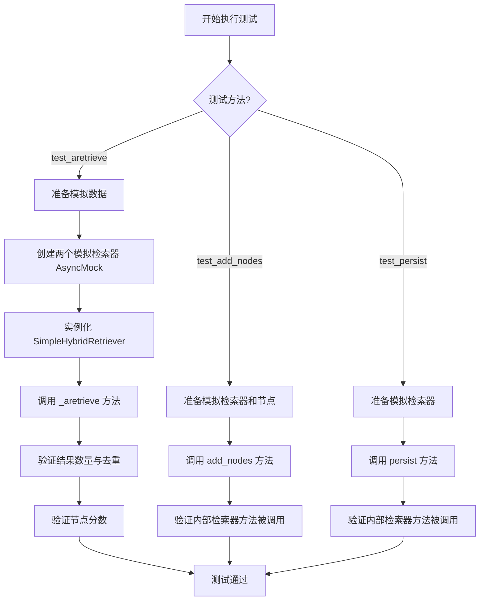
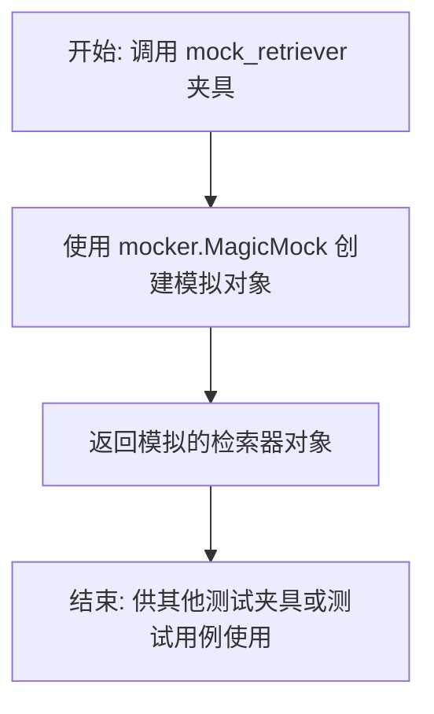
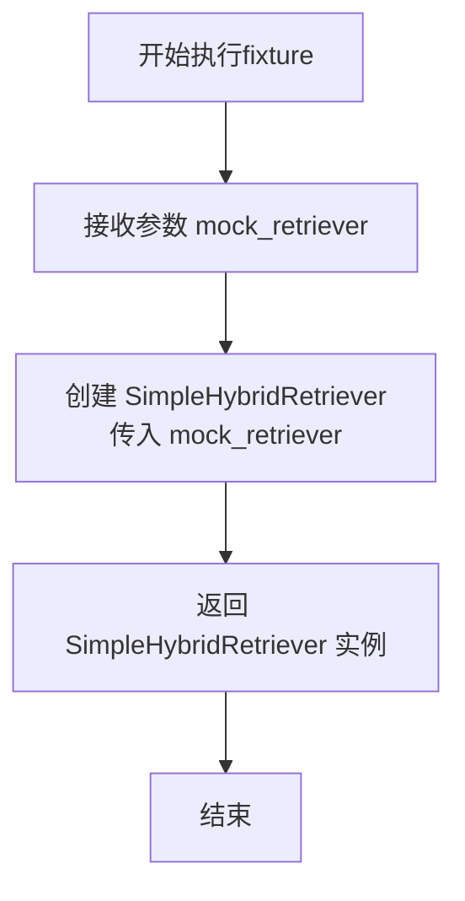
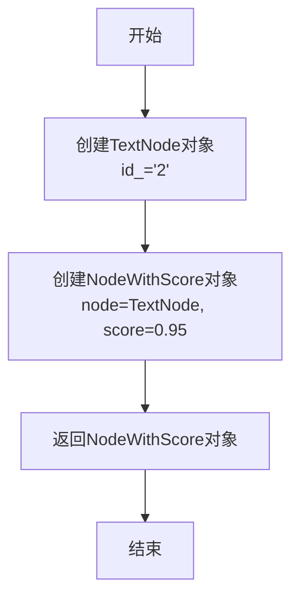
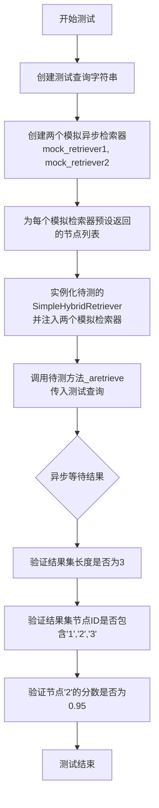
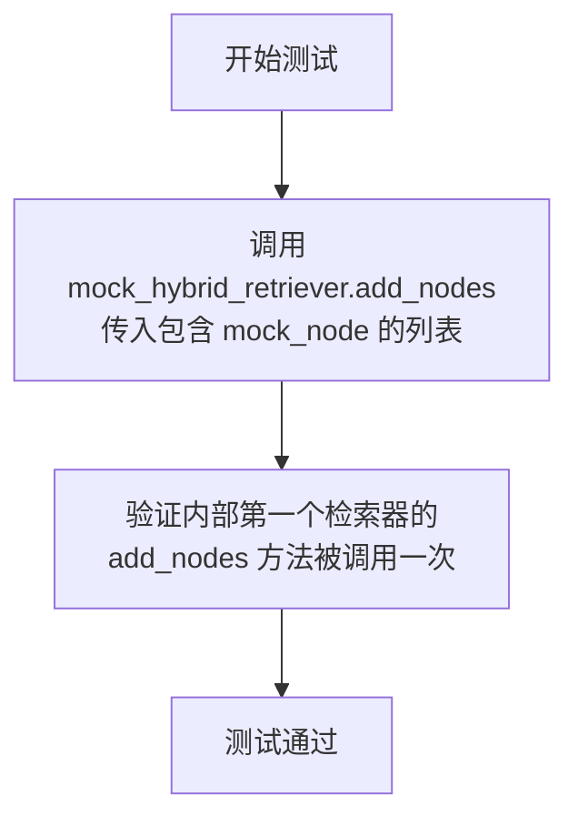

# `.\MetaGPT\tests\metagpt\rag\retrievers\test_hybrid_retriever.py` 详细设计文档

这是一个使用 pytest 框架编写的单元测试文件，用于测试 SimpleHybridRetriever 类的功能。SimpleHybridRetriever 是一个混合检索器，它封装了多个底层检索器，能够并行调用它们并合并去重返回的检索结果。该测试文件主要验证其异步检索方法 `_aretrieve` 的正确性，以及 `add_nodes` 和 `persist` 方法是否正确地委托给了内部的检索器。

## 整体流程



## 类结构

```
TestSimpleHybridRetriever (测试类)
├── mock_retriever (fixture)
├── mock_hybrid_retriever (fixture)
├── mock_node (fixture)
├── test_aretrieve (async 测试方法)
├── test_add_nodes (测试方法)
└── test_persist (测试方法)
```

## 全局变量及字段


    

## 全局函数及方法

### `TestSimpleHybridRetriever.mock_retriever`

这是一个使用 `pytest` 框架定义的测试夹具（fixture）。它的核心功能是创建一个模拟的检索器对象，用于在 `TestSimpleHybridRetriever` 测试类中隔离和测试 `SimpleHybridRetriever` 与其他检索器的交互，而无需依赖真实的检索器实现。

参数：

- `mocker`：`pytest-mock` 插件提供的 `MockerFixture` 类型对象，用于创建和管理模拟对象（Mock）。

返回值：`MagicMock`，一个由 `mocker` 创建的通用模拟对象，可以模拟任何类或函数的行为。

#### 流程图



#### 带注释源码

```python
    @pytest.fixture
    # 定义一个名为 `mock_retriever` 的 pytest 夹具。
    # 夹具函数会在测试运行前被自动调用，其返回值可供测试用例或其他夹具使用。
    def mock_retriever(self, mocker):
        # 使用 `pytest-mock` 插件提供的 `mocker` 参数来创建一个 `MagicMock` 对象。
        # `MagicMock` 是一个灵活的模拟对象，可以记录对其方法的调用，并允许配置返回值或副作用。
        return mocker.MagicMock()
```

### `TestSimpleHybridRetriever.mock_hybrid_retriever`

这是一个Pytest fixture，用于在测试中创建并返回一个配置好的`SimpleHybridRetriever`实例。它依赖于另一个fixture `mock_retriever`来提供模拟的检索器，从而方便地对`SimpleHybridRetriever`进行单元测试，而无需依赖真实的检索器实现。

参数：

- `mock_retriever`：`mocker.MagicMock`，一个由Pytest-mock提供的模拟检索器对象，作为`SimpleHybridRetriever`的构造参数。

返回值：`SimpleHybridRetriever`，一个使用模拟检索器初始化的`SimpleHybridRetriever`实例。

#### 流程图



#### 带注释源码

```python
    @pytest.fixture
    # 定义一个名为 `mock_hybrid_retriever` 的 Pytest fixture。
    # 它接收一个参数 `mock_retriever`，该参数是另一个fixture的返回值。
    def mock_hybrid_retriever(self, mock_retriever) -> SimpleHybridRetriever:
        # 使用传入的模拟检索器 `mock_retriever` 实例化 `SimpleHybridRetriever` 类。
        # 这个fixture的目的是为测试提供一个预配置的、可复用的 `SimpleHybridRetriever` 对象。
        return SimpleHybridRetriever(mock_retriever)
```

### `TestSimpleHybridRetriever.mock_node`

这是一个用于单元测试的pytest fixture方法，用于创建一个模拟的`NodeWithScore`对象，该对象包含一个`TextNode`和一个分数，用于测试`SimpleHybridRetriever`类的相关功能。

参数：
- 无

返回值：`NodeWithScore`，一个包含模拟文本节点和预设分数的节点评分对象。

#### 流程图



#### 带注释源码

```python
    @pytest.fixture
    # 定义一个pytest fixture，命名为mock_node
    def mock_node(self):
        # 返回一个NodeWithScore对象
        # 该对象包含一个TextNode（id为"2"）和一个预设的分数0.95
        return NodeWithScore(node=TextNode(id_="2"), score=0.95)
```

### `TestSimpleHybridRetriever.test_aretrieve`

这是一个针对 `SimpleHybridRetriever._aretrieve` 方法的异步单元测试。它验证了混合检索器能够正确地从多个底层检索器中异步获取结果，并按照预期对结果进行去重和合并。

参数：

- `self`：`TestSimpleHybridRetriever`，测试类实例本身。
- `mocker`：`pytest-mock` 提供的 `MockerFixture` 对象，用于创建和管理测试替身（Mock/AsyncMock）。

返回值：`None`，这是一个测试方法，其主要目的是通过断言（assert）来验证功能，不返回业务值。

#### 流程图



#### 带注释源码

```python
    @pytest.mark.asyncio  # 标记此测试函数为异步函数，以便pytest-asyncio插件能正确处理
    async def test_aretrieve(self, mocker):  # 定义异步测试方法，接收mocker fixture
        question = "test query"  # 定义一个测试用的查询字符串

        # Create mock retrievers
        # 创建第一个模拟异步检索器，它将模拟 `aretrieve` 方法
        mock_retriever1 = mocker.AsyncMock()
        # 预设该检索器调用 `aretrieve` 方法时返回的节点列表
        mock_retriever1.aretrieve.return_value = [
            NodeWithScore(node=TextNode(id_="1"), score=1.0),
            NodeWithScore(node=TextNode(id_="2"), score=0.95),
        ]

        # 创建第二个模拟异步检索器
        mock_retriever2 = mocker.AsyncMock()
        # 预设其返回的节点列表，其中节点"2"与第一个检索器返回的列表重复
        mock_retriever2.aretrieve.return_value = [
            NodeWithScore(node=TextNode(id_="2"), score=0.95),
            NodeWithScore(node=TextNode(id_="3"), score=0.8),
        ]

        # Instantiate the SimpleHybridRetriever with the mock retrievers
        # 使用两个模拟检索器实例化待测试的 SimpleHybridRetriever 对象
        hybrid_retriever = SimpleHybridRetriever(mock_retriever1, mock_retriever2)

        # Call the _aretrieve method
        # 调用待测试的异步检索方法 `_aretrieve`，并等待其完成
        results = await hybrid_retriever._aretrieve(question)

        # Check if the results are as expected
        # 断言1：验证合并去重后的结果总数应为3个（'1', '2', '3'）
        assert len(results) == 3  # Should be 3 unique nodes
        # 断言2：验证结果集中所有节点的ID集合是否等于预期的 {'1', '2', '3'}
        assert set(node.node.node_id for node in results) == {"1", "2", "3"}

        # Check if the scores are correct (assuming you want the highest score)
        # 将结果转换为 {节点ID: 分数} 的字典，便于验证
        node_scores = {node.node.node_id: node.score for node in results}
        # 断言3：验证重复节点'2'的分数是否正确（此处测试逻辑假设保留最高分或首次出现的分数，根据预设，应为0.95）
        assert node_scores["2"] == 0.95
```

### `TestSimpleHybridRetriever.test_add_nodes`

这是一个单元测试方法，用于验证 `SimpleHybridRetriever` 类的 `add_nodes` 方法是否能够正确地将节点列表传递给其内部包含的第一个检索器（`retriever`）。

参数：

- `mock_hybrid_retriever`：`SimpleHybridRetriever`，一个被模拟的 `SimpleHybridRetriever` 实例，用于测试。
- `mock_node`：`NodeWithScore`，一个被模拟的 `NodeWithScore` 节点对象，作为要添加的节点。

返回值：`None`，这是一个测试方法，不返回任何值，其目的是通过断言来验证行为。

#### 流程图



#### 带注释源码

```python
def test_add_nodes(self, mock_hybrid_retriever: SimpleHybridRetriever, mock_node):
    # 调用被测试的 SimpleHybridRetriever 实例的 add_nodes 方法，
    # 传入一个包含模拟节点（mock_node）的列表。
    mock_hybrid_retriever.add_nodes([mock_node])
    # 断言：验证 mock_hybrid_retriever 内部列表（retrievers）中的
    # 第一个检索器（retrievers[0]）的 add_nodes 方法被调用了一次。
    # 这确保了 SimpleHybridRetriever.add_nodes 方法将任务委托给了其内部的检索器。
    mock_hybrid_retriever.retrievers[0].add_nodes.assert_called_once()
```

### `TestSimpleHybridRetriever.test_persist`

这是一个单元测试方法，用于验证 `SimpleHybridRetriever` 类的 `persist` 方法是否能够正确地将持久化操作委托给其内部的第一个检索器（`retriever`）。

参数：
- `mock_hybrid_retriever`：`SimpleHybridRetriever`，一个通过 `pytest.fixture` 创建的 `SimpleHybridRetriever` 模拟对象，用于测试。

返回值：`None`，此测试方法不返回任何值，仅用于断言。

#### 流程图

```mermaid
flowchart TD
    A[开始测试] --> B[调用 mock_hybrid_retriever.persist<br/>参数: ""]
    B --> C[内部调用 mock_hybrid_retriever.retrievers[0].persist]
    C --> D{断言<br/>retrievers[0].persist 被调用一次}
    D --> E[测试通过]
    D -- 失败 --> F[测试失败]
```

#### 带注释源码

```python
def test_persist(self, mock_hybrid_retriever: SimpleHybridRetriever):
    # 调用待测试的 SimpleHybridRetriever 实例的 persist 方法，传入一个空字符串作为持久化路径参数。
    mock_hybrid_retriever.persist("")
    # 断言：验证 mock_hybrid_retriever 内部的第一个检索器（retrievers[0]）的 persist 方法被调用了一次。
    # 这确保了 SimpleHybridRetriever 的 persist 方法确实将操作委托给了其内部的检索器。
    mock_hybrid_retriever.retrievers[0].persist.assert_called_once()
```

## 关键组件

### SimpleHybridRetriever

一个混合检索器，通过聚合多个底层检索器的结果来执行检索，并支持节点的添加和持久化操作。

### 测试框架 (pytest)

用于对 `SimpleHybridRetriever` 类的功能进行单元测试，包括异步检索、节点添加和持久化方法的验证。

### Mock 对象

在测试中用于模拟外部依赖（如检索器）和行为，确保测试的隔离性和可靠性，而不依赖于实际的实现。

## 问题及建议


### 已知问题

-   **测试覆盖不完整**：当前测试用例仅覆盖了 `_aretrieve`、`add_nodes` 和 `persist` 方法，未对 `SimpleHybridRetriever` 的 `retrieve`（同步方法）进行测试。这可能导致同步检索逻辑中的潜在缺陷未被发现。
-   **测试数据单一**：测试中使用的 `NodeWithScore` 数据较为简单，未覆盖边界情况，例如节点分数相同、节点列表为空、或不同检索器返回大量重复节点等场景，可能无法充分验证去重和排序逻辑的健壮性。
-   **Mock对象验证不足**：在 `test_aretrieve` 中，虽然验证了最终结果，但未验证两个 `mock_retriever` 的 `aretrieve` 方法是否被正确调用（例如，使用 `assert_called_once_with(question)`），这削弱了测试对组件间交互契约的验证能力。
-   **硬编码断言值**：测试中断言了结果长度为3以及特定ID的分数为0.95。这些值直接依赖于Mock的返回值，使得测试脆弱，当Mock数据逻辑变更时测试容易失败，而非代码逻辑错误。

### 优化建议

-   **补充同步方法测试**：增加对 `SimpleHybridRetriever.retrieve` 方法的单元测试，确保同步与异步检索行为一致。
-   **增加边界和异常测试用例**：
    -   测试当 `retrievers` 列表为空时，`_aretrieve` 或 `retrieve` 的行为（应返回空列表或抛出明确异常）。
    -   测试不同检索器返回完全重复、部分重复、无重复节点的情况。
    -   测试节点分数为负值、零或极高值的情况，验证分数处理逻辑。
    -   测试传入的查询字符串为空或 `None` 时的行为。
-   **增强Mock验证**：在 `test_aretrieve` 中，对每个 `mock_retriever.aretrieve` 的调用参数进行断言，确保查询被正确传递。
-   **使用参数化测试**：利用 `@pytest.mark.parametrize` 为 `test_aretrieve` 提供多组输入输出数据，包括上述边界情况，使测试更全面、清晰且易于维护。
-   **重构测试以提高可维护性**：将 `test_aretrieve` 中创建Mock节点和检索器的部分提取为独立的fixture或辅助函数，减少测试函数的复杂度，提高代码复用性。
-   **明确测试意图**：考虑将 `test_aretrieve` 中关于“最高分数”的断言注释具体化，或补充测试验证合并策略（如取最高分、平均分）是否与 `SimpleHybridRetriever` 的设计文档一致。


## 其它


### 设计目标与约束

该测试代码的设计目标是验证 `SimpleHybridRetriever` 类的核心功能，特别是其异步检索 (`_aretrieve`) 方法、节点添加 (`add_nodes`) 方法和持久化 (`persist`) 方法。约束在于它是一个单元测试，依赖于 `pytest` 框架和 `mocker` 库来模拟外部依赖，确保测试的隔离性和可重复性。测试不涉及真实的检索器实现，仅验证 `SimpleHybridRetriever` 的逻辑正确性。

### 错误处理与异常设计

当前测试代码未显式测试错误处理或异常场景。它主要关注正常路径下的功能验证。例如，`test_aretrieve` 测试了在多个检索器返回结果（包含重复项）时，`_aretrieve` 方法能正确合并去重并返回预期数量的节点。测试中未包含对检索器抛出异常、输入无效问题或持久化路径无效等情况的测试。这是测试覆盖面的一个潜在缺口。

### 数据流与状态机

测试中的数据流是线性的：
1.  **准备阶段**：通过 `@pytest.fixture` 创建模拟的检索器 (`mock_retriever`) 和节点 (`mock_node`)。
2.  **执行阶段**：
    *   `test_aretrieve`：创建两个模拟的异步检索器，设置其返回值，实例化 `SimpleHybridRetriever`，调用 `_aretrieve` 方法并获取结果。
    *   `test_add_nodes` 和 `test_persist`：使用 `mock_hybrid_retriever` fixture，调用相应方法。
3.  **验证阶段**：使用 `assert` 语句验证结果是否符合预期（如结果数量、节点ID集合、方法调用次数）。

测试不涉及复杂的状态机，主要验证方法调用的输入输出关系。

### 外部依赖与接口契约

测试代码明确依赖于以下外部组件：
1.  **`pytest` 框架**：用于组织测试用例、管理fixture和运行测试。
2.  **`pytest-mock` (通过 `mocker`)**：用于创建模拟对象 (`MagicMock`, `AsyncMock`)，以隔离 `SimpleHybridRetriever` 与其内部的 `retrievers` 依赖。
3.  **`llama_index.core.schema`**：引入了 `NodeWithScore` 和 `TextNode` 类，用于构造测试数据，验证 `SimpleHybridRetriever` 与这些数据结构的兼容性。
4.  **`metagpt.rag.retrievers`**：引入了被测试的 `SimpleHybridRetriever` 类。

接口契约主要体现在对 `SimpleHybridRetriever` 构造器（接受多个检索器实例）、`_aretrieve` 方法（接受查询字符串，返回 `NodeWithScore` 列表）、`add_nodes` 方法（接受节点列表）和 `persist` 方法（接受路径字符串）的调用约定上。测试通过模拟对象验证了这些契约被正确履行。

    